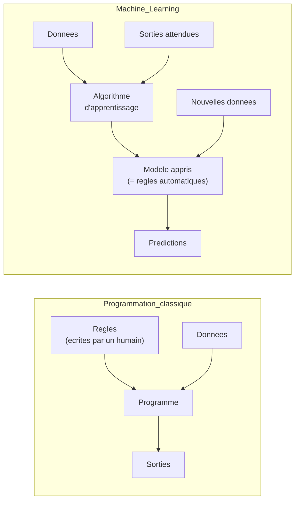
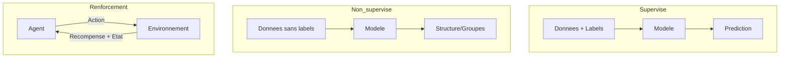
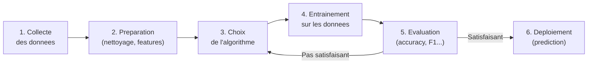
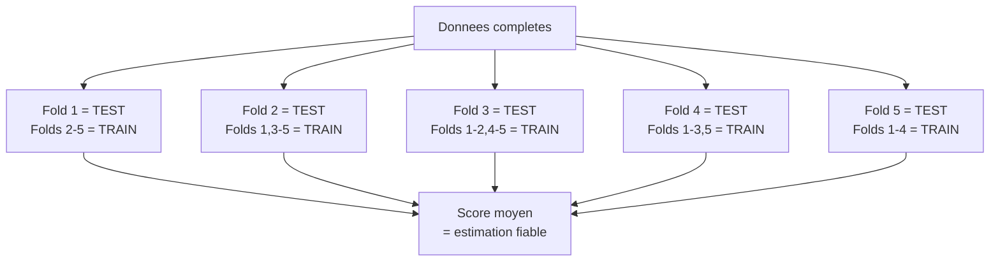
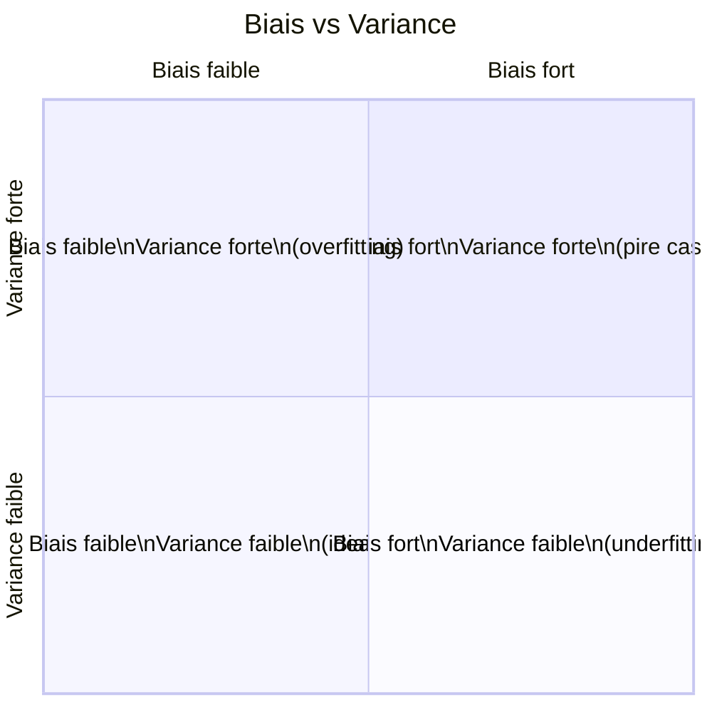
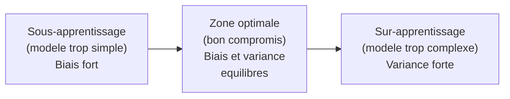

# Chapitre 1 -- Generalites du Machine Learning

> **Idee centrale en une phrase :** Le machine learning, c'est apprendre a un programme a trouver des regles a partir d'exemples, au lieu de lui dicter ces regles a la main -- comme un enfant qui apprend a reconnaitre un chat apres en avoir vu des centaines.

**Prerequis :** Aucun -- c'est le point de depart.
**Chapitre suivant :** [Arbres de decision ->](02_arbres_decision.md) | [Methodes bayesiennes ->](03_methodes_bayesiennes.md) | [KNN ->](04_knn.md)

---

## 1. L'analogie du medecin

### Comment un medecin apprend son metier ?

Un medecin en formation ne recoit pas une liste exhaustive de regles du type "si le patient tousse ET a de la fievre ET a mal a la gorge ALORS c'est une angine". Au lieu de cela, il **observe des centaines de patients** avec leurs symptomes et leurs diagnostics. Progressivement, son cerveau extrait des **regularites** (des patterns) : "les patients qui toussent et ont de la fievre ont souvent une angine".

Le machine learning fonctionne exactement de la meme maniere :

1. On fournit a l'algorithme des **exemples** (les patients et leurs diagnostics).
2. L'algorithme extrait des **regularites** (les liens entre symptomes et maladies).
3. Quand un nouveau patient arrive, l'algorithme utilise ces regularites pour **predire** le diagnostic.

### La difference avec la programmation classique

| Programmation classique | Machine Learning |
|------------------------|-----------------|
| Le programmeur ecrit les regles | Les regles sont apprises a partir des donnees |
| Entree : regles + donnees -> sortie | Entree : donnees + sorties -> regles |
| Necessite un expert du domaine | Necessite des donnees en quantite |
| Rigide : ne s'adapte pas | Flexible : s'adapte aux nouvelles donnees |

---

## 2. Intuition visuelle



**Lecture du schema :**
- A gauche, la programmation classique : un humain ecrit les regles, le programme les applique.
- A droite, le ML : on fournit des exemples (donnees + reponses attendues), l'algorithme apprend un modele, et ce modele peut ensuite predire sur de nouvelles donnees.

---

## 3. Les trois grandes familles de ML

### 3.1 Apprentissage supervise

C'est la famille la plus courante dans le cours. Le principe :

- On dispose de **donnees etiquetees** : chaque exemple est accompagne de la bonne reponse (le **label**).
- L'algorithme apprend la relation entre les entrees (features) et les sorties (labels).
- Objectif : predire correctement le label de nouvelles donnees.

**Deux sous-types :**

| Type | Variable cible | Exemple |
|------|---------------|---------|
| **Classification** | Categorie discrete (finie) | Classer un email en spam/non-spam |
| **Regression** | Valeur continue (numerique) | Predire le prix d'une maison |

**Exemples du cours :**
- Classer des critiques de jeux video en "mauvais", "moyen", "bien" (classification)
- Predire la distance de freinage d'un vehicule en fonction de sa vitesse (regression)

### 3.2 Apprentissage non supervise

- Les donnees **n'ont pas de label** : on ne connait pas la bonne reponse.
- L'algorithme cherche des **structures cachees** dans les donnees.
- Exemples : regrouper des clients similaires (clustering), reduire le nombre de variables (reduction de dimension).

### 3.3 Apprentissage par renforcement

- Un **agent** interagit avec un **environnement**.
- Il recoit des **recompenses** ou des **punitions** en fonction de ses actions.
- Objectif : maximiser la recompense totale sur le long terme.
- Exemple : apprendre a un robot a marcher, a une IA a jouer aux echecs.



---

## 4. Vocabulaire essentiel

Avant d'aller plus loin, voici les termes que tu rencontreras partout dans le cours :

| Terme | Definition | Exemple |
|-------|-----------|---------|
| **Instance / Exemple** | Un seul point de donnee | Un patient avec ses symptomes |
| **Feature / Attribut** | Une caracteristique mesurable | La temperature du patient |
| **Label / Classe / Cible** | La reponse qu'on veut predire | "angine" ou "grippe" |
| **Dataset / Jeu de donnees** | L'ensemble des exemples | Tableau de 1000 patients |
| **Entrainement (training)** | Phase ou l'algorithme apprend | Montrer les 800 premiers patients |
| **Test** | Phase ou l'on evalue le modele | Tester sur les 200 patients restants |
| **Modele** | Le resultat de l'apprentissage | L'arbre de decision appris |
| **Prediction / Inference** | Utiliser le modele sur de nouvelles donnees | Diagnostiquer un nouveau patient |
| **Hypothese** | La fonction apprise par le modele | La regle de decision trouvee |

---

## 5. Le pipeline d'un projet de ML

Tout projet de ML suit le meme schema general :



---

## 6. Evaluation d'un modele

### 6.1 Pourquoi ne pas evaluer sur les donnees d'entrainement ?

C'est **la regle d'or du ML** : ne jamais evaluer un modele sur les donnees qui ont servi a l'entrainer.

**Analogie :** C'est comme un etudiant qui revise uniquement les annales et les apprend par coeur. S'il tombe exactement sur les memes questions, il aura 20/20. Mais s'il tombe sur des questions differentes, il echouera. Ce qu'on veut mesurer, c'est sa capacite a **generaliser** -- repondre a des questions qu'il n'a jamais vues.

### 6.2 Separation train / test

La methode la plus simple : couper le jeu de donnees en deux parties.

```python
from sklearn.model_selection import train_test_split

X_train, X_test, y_train, y_test = train_test_split(
    X, y,
    test_size=0.3,       # 30% pour le test
    random_state=42       # pour reproductibilite
)
```

**Attention :** le decoupage doit etre **aleatoire**. Si les donnees sont triees (par exemple, les 100 premieres instances sont de classe A et les 100 suivantes de classe B), un decoupage sequentiel donnerait un jeu d'entrainement biaise.

### 6.3 Validation croisee (K-Fold)

Quand le jeu de donnees est petit, un seul decoupage train/test peut etre peu fiable. La validation croisee resout ce probleme :

1. On decoupe les donnees en **K** paquets (folds) de taille egale.
2. On entraine K fois le modele : a chaque fois, un paquet different sert de test, les K-1 autres servent d'entrainement.
3. On calcule la **moyenne** des K scores obtenus.



```python
from sklearn.model_selection import cross_val_score

scores = cross_val_score(clf, X, y, cv=10)
print(f"Accuracy moyenne : {scores.mean():.3f}")
print(f"Ecart-type : {scores.std():.3f}")
```

### 6.4 Metriques d'evaluation

#### La matrice de confusion

Pour un probleme de classification binaire (2 classes), la matrice de confusion resume tout :

```
                    Prediction Positive    Prediction Negative
Reelle Positive     Vrai Positif (VP)      Faux Negatif (FN)
Reelle Negative     Faux Positif (FP)      Vrai Negatif (VN)
```

**Explication mot par mot :**
- **Vrai Positif (VP)** : le modele dit "positif", et c'est effectivement positif. Bravo.
- **Faux Positif (FP)** : le modele dit "positif", mais c'est en realite negatif. Fausse alarme.
- **Faux Negatif (FN)** : le modele dit "negatif", mais c'est en realite positif. Rate.
- **Vrai Negatif (VN)** : le modele dit "negatif", et c'est effectivement negatif. Bravo.

#### Les metriques principales

| Metrique | Formule | Intuition |
|----------|---------|-----------|
| **Accuracy** | (VP + VN) / (VP + VN + FP + FN) | Proportion de predictions correctes au total |
| **Precision** | VP / (VP + FP) | Parmi ceux que j'ai dit positifs, combien le sont vraiment ? |
| **Rappel (Recall)** | VP / (VP + FN) | Parmi tous les vrais positifs, combien ai-je trouve ? |
| **F1-score** | 2 * (Precision * Rappel) / (Precision + Rappel) | Moyenne harmonique de precision et rappel |

**Analogie du filet de peche :**
- **Precision** = parmi les poissons attrapes, combien sont de la bonne espece ?
- **Rappel** = parmi tous les poissons de la bonne espece dans le lac, combien ai-je attrapes ?

```python
from sklearn.metrics import classification_report, confusion_matrix

# Matrice de confusion
print(confusion_matrix(y_test, y_pred))

# Rapport complet
print(classification_report(y_test, y_pred, target_names=['classe_0', 'classe_1']))
```

---

## 7. Le dilemme biais-variance

C'est **le** concept central du ML. Tout le reste en decoule.

### L'analogie du tireur

Imagine un tireur a l'arc :

- **Biais fort** : toutes les fleches atterrissent au meme endroit... mais loin du centre. Le tireur est **constant mais mal calibre**.
- **Variance forte** : les fleches sont dispersees partout. Le tireur est **instable**.
- **Biais et variance faibles** : les fleches sont groupees au centre. C'est le tireur parfait.



### Sous-apprentissage (Underfitting)

Le modele est **trop simple** pour capturer les regularites des donnees.

- **Biais fort** : le modele fait systematiquement des erreurs.
- **Symptome** : mauvaise performance sur le train ET le test.
- **Exemple** : utiliser une droite pour modeliser une relation quadratique.

### Sur-apprentissage (Overfitting)

Le modele est **trop complexe** et memorise les donnees d'entrainement, y compris le bruit.

- **Variance forte** : le modele est tres bon sur le train, mais mauvais sur le test.
- **Symptome** : excellente performance sur le train, mauvaise sur le test.
- **Exemple** : un arbre de decision tres profond qui memorise chaque exemple.

### Le compromis



**Comment lutter contre le sur-apprentissage :**
- **Plus de donnees** d'entrainement
- **Regularisation** : penaliser la complexite du modele
- **Elagage** (pour les arbres) : couper les branches inutiles
- **Validation croisee** : pour detecter le sur-apprentissage

---

## 8. Representation des donnees

### L'espace des features

Chaque exemple est un **point dans un espace multidimensionnel**. Si un exemple a 3 features (temperature, toux, age), il est un point dans un espace 3D.

```python
import numpy as np
from sklearn.datasets import load_iris

iris = load_iris()
X = iris.data       # matrice (150, 4) : 150 exemples, 4 features
y = iris.target      # vecteur (150,) : les labels (0, 1, 2)

print(f"Nombre d'exemples : {X.shape[0]}")
print(f"Nombre de features : {X.shape[1]}")
print(f"Noms des features : {iris.feature_names}")
print(f"Classes : {iris.target_names}")
```

### Representation vectorielle du texte

Le cours utilise aussi des donnees textuelles (critiques de jeux video). Pour les donner a un algorithme de ML, il faut les transformer en vecteurs numeriques.

**Sac de mots (Bag of Words) :**
Chaque document est represente par un vecteur ou chaque dimension correspond a un mot du vocabulaire. La valeur est 1 si le mot est present, 0 sinon (version booleenne) ou le nombre d'occurrences.

```python
from sklearn.feature_extraction.text import CountVectorizer

vectorizer = CountVectorizer(
    lowercase=True,        # tout en minuscules
    max_df=0.8,            # ignore les mots presents dans plus de 80% des docs
    min_df=10,             # ignore les mots presents dans moins de 10 docs
    binary=True            # 1 si present, 0 sinon
)
X_train = vectorizer.fit_transform(textes_train)
X_test = vectorizer.transform(textes_test)
```

**TF-IDF :**
Version plus sophistiquee qui pondere les mots par leur importance. Un mot rare dans l'ensemble du corpus mais frequent dans un document est considere comme tres informatif.

```python
from sklearn.feature_extraction.text import TfidfVectorizer

vectorizer = TfidfVectorizer(
    lowercase=True,
    ngram_range=(1, 1),    # unigrammes seulement
    max_df=0.7,
    min_df=5
)
X_train = vectorizer.fit_transform(textes_train)
```

---

## 9. Hyperparametres et tuning

### Qu'est-ce qu'un hyperparametre ?

Un **parametre** du modele est appris automatiquement (par exemple, les seuils d'un arbre de decision). Un **hyperparametre** est fixe par l'utilisateur **avant** l'entrainement (par exemple, la profondeur maximale de l'arbre).

| Parametres (appris) | Hyperparametres (fixes) |
|---------------------|------------------------|
| Seuils des noeuds d'un arbre | Profondeur maximale de l'arbre |
| Poids d'un reseau de neurones | Taux d'apprentissage |
| Probabilites du Naive Bayes | Aucun pour le Naive Bayes de base |

### GridSearchCV : trouver les meilleurs hyperparametres

```python
from sklearn.model_selection import GridSearchCV

# Definir les hyperparametres a tester
parameters = {'n_neighbors': [1, 3, 5, 11, 17, 39]}

# Tester toutes les combinaisons avec validation croisee
grid_search = GridSearchCV(
    estimator=KNeighborsClassifier(),
    param_grid=parameters,
    cv=5,                      # 5-fold cross-validation
    scoring='f1_weighted',     # metrique d'evaluation
    n_jobs=2,                  # parallelisation
    verbose=1
)
grid_search.fit(X_train, y_train)

# Meilleurs hyperparametres
print(f"Meilleur K : {grid_search.best_params_}")
print(f"Meilleur score : {grid_search.best_score_:.3f}")
```

---

## 10. Pieges classiques a eviter

- **Evaluer sur le train** : JAMAIS. C'est la premiere source d'erreur des debutants. Un modele qui a 100% de precision sur le train et 50% sur le test est en sur-apprentissage.
- **Oublier de melanger les donnees** : si le dataset est trie par classe, un split sequentiel donnera un jeu d'entrainement qui ne contient qu'une seule classe.
- **Ignorer le desequilibre de classes** : si 95% des emails sont non-spam, un modele qui dit toujours "non-spam" aura 95% d'accuracy mais sera inutile. Regarder la precision, le rappel et le F1.
- **Fuites de donnees (data leakage)** : utiliser des informations du test pendant l'entrainement. Par exemple, faire `fit_transform` sur tout le dataset au lieu de `fit` sur le train puis `transform` sur le test.
- **Confondre correlation et causalite** : le ML trouve des correlations, pas des causes. Ce n'est pas parce que les ventes de glaces et les noyades augmentent ensemble que les glaces causent les noyades (c'est l'ete !).

---

## 11. Code Python complet -- Premier modele

Voici un exemple complet de pipeline ML, de A a Z, sur le dataset Iris :

```python
# ============================================================
# Pipeline ML complet sur le dataset Iris
# ============================================================

# 1. Imports
from sklearn.datasets import load_iris
from sklearn.model_selection import train_test_split, cross_val_score
from sklearn.neighbors import KNeighborsClassifier
from sklearn.metrics import classification_report, confusion_matrix
import numpy as np

# 2. Charger les donnees
iris = load_iris()
X, y = iris.data, iris.target
print(f"Dataset : {X.shape[0]} exemples, {X.shape[1]} features")
print(f"Classes : {iris.target_names}")

# 3. Separer train / test
X_train, X_test, y_train, y_test = train_test_split(
    X, y, test_size=0.3, random_state=42
)
print(f"Train : {len(X_train)} exemples")
print(f"Test : {len(X_test)} exemples")

# 4. Entrainer un modele (KNN avec K=5)
clf = KNeighborsClassifier(n_neighbors=5)
clf.fit(X_train, y_train)

# 5. Evaluer sur le test
y_pred = clf.predict(X_test)
print("\nMatrice de confusion :")
print(confusion_matrix(y_test, y_pred))
print("\nRapport de classification :")
print(classification_report(y_test, y_pred, target_names=iris.target_names))

# 6. Validation croisee (plus robuste)
scores = cross_val_score(clf, X, y, cv=10)
print(f"\nValidation croisee (10-fold) :")
print(f"Accuracy moyenne : {scores.mean():.3f} (+/- {scores.std():.3f})")
```

---

## 12. Recapitulatif

- **Machine Learning** = apprendre des regles a partir d'exemples, sans les programmer explicitement.
- **Apprentissage supervise** = on a les reponses (labels). Les deux taches principales : classification (categories) et regression (valeurs continues).
- **Apprentissage non supervise** = pas de labels. On cherche des structures (clusters, dimensions principales).
- **Train / Test split** = toujours evaluer sur des donnees que le modele n'a pas vues pendant l'entrainement.
- **Validation croisee** = methode robuste pour estimer la performance (surtout quand le dataset est petit).
- **Metriques** : accuracy (proportion de bonnes reponses), precision (fiabilite des positifs), rappel (couverture des positifs), F1 (equilibre precision-rappel).
- **Biais-Variance** : le compromis central du ML. Modele trop simple = underfitting (biais fort). Modele trop complexe = overfitting (variance forte).
- **Hyperparametres** : parametres fixes par l'utilisateur avant l'entrainement. On les optimise par GridSearchCV + validation croisee.
