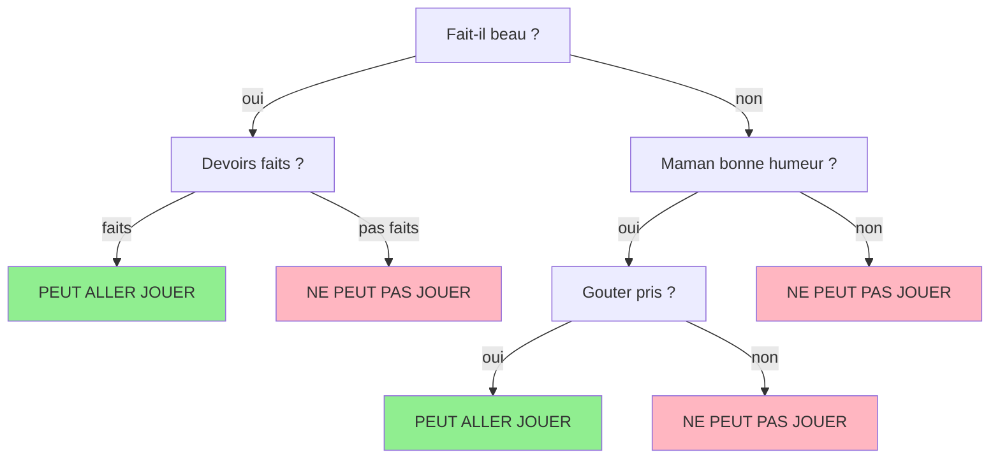
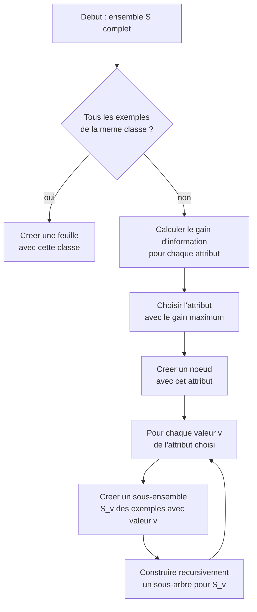
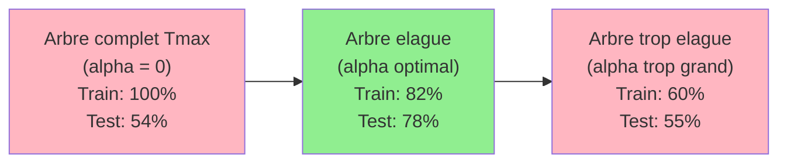

# Chapitre 2 -- Arbres de decision

> **Idee centrale en une phrase :** Un arbre de decision, c'est un jeu de "20 questions" automatise -- l'algorithme choisit la meilleure question a poser a chaque etape pour deviner la reponse le plus vite possible.

**Prerequis :** [Generalites ML](01_generalites_ml.md)
**Chapitre suivant :** [Methodes d'ensemble et Boosting ->](05_ensemble_boosting.md)

---

## 1. L'analogie du jeu de devinettes

### Le jeu "Oui ou Non"

Tu as surement deja joue a un jeu ou quelqu'un pense a un animal et tu dois le deviner en posant des questions auxquelles on repond par "oui" ou "non" :

- "Est-ce que ca a des plumes ?" -> Non
- "Est-ce que ca vit dans l'eau ?" -> Oui
- "Est-ce que c'est un mammifere ?" -> Oui
- "Est-ce que ca mange du poisson ?" -> Oui
- "C'est un dauphin !" -> Oui !

Un arbre de decision fonctionne exactement de la meme maniere, mais c'est l'algorithme qui :
1. **Choisit les questions** automatiquement (pas besoin d'un humain).
2. **Choisit l'ordre** des questions pour etre le plus efficace possible.
3. **Decide de la reponse** quand il n'y a plus de questions a poser.

### L'exemple du gouter

Voici un exemple concret tire du cours. Un enfant veut savoir s'il peut aller jouer dehors. Sa maman prend en compte plusieurs criteres :

| Devoirs faits ? | Maman de bonne humeur ? | Fait-il beau ? | Gouter pris ? | Peut aller jouer ? |
|----------------|------------------------|---------------|--------------|-------------------|
| faits | non | oui | non | oui |
| pas faits | oui | non | oui | oui |
| faits | oui | oui | non | oui |
| faits | non | oui | oui | oui |
| pas faits | oui | oui | oui | non |
| pas faits | oui | non | non | non |
| faits | non | non | oui | non |
| faits | oui | non | non | non |

L'algorithme va construire un arbre qui pose les questions dans l'ordre le plus efficace.

---

## 2. Intuition visuelle



**Lecture du schema :**
- Chaque **noeud interne** (losange/rectangle) pose une question sur un attribut.
- Chaque **branche** correspond a une reponse possible.
- Chaque **feuille** (en bas) donne la decision finale.
- Pour classer un nouvel exemple, on part de la racine et on suit le chemin correspondant aux reponses.

---

## 3. Explication progressive

### 3.1 La question cle : quelle question poser en premier ?

Le coeur de l'algorithme, c'est de choisir **la meilleure question a poser a chaque noeud**. "Meilleure" signifie : celle qui **separe le mieux** les exemples de classes differentes.

**Analogie du tri de cartes :**
Imagine que tu as un paquet de cartes melangees (rouges et noires). Tu veux les trier en un minimum de questions. La meilleure premiere question est celle qui cree deux paquets les plus "purs" possible (un paquet presque tout rouge, un autre presque tout noir).

### 3.2 L'entropie : mesurer le desordre

L'**entropie** est une mesure du "desordre" ou de "l'incertitude" dans un ensemble de donnees.

**Intuition :**
- Un sac contenant uniquement des billes rouges : **entropie = 0** (aucune incertitude, on sait qu'on va tirer une bille rouge).
- Un sac contenant 50% de rouges et 50% de bleues : **entropie = 1** (incertitude maximale pour 2 classes).

**Formule :**

```
H(S) = - somme_i ( p_i * log2(p_i) )
```

ou `p_i` est la proportion d'exemples de la classe `i` dans l'ensemble `S`.

**Explication mot par mot :**
1. **p_i** : la proportion d'exemples de la classe i. Si on a 3 billes rouges sur 10, p_rouge = 3/10 = 0.3
2. **log2(p_i)** : le logarithme en base 2 de cette proportion. Quand p est petit, log2(p) est tres negatif. Quand p = 1, log2(1) = 0.
3. **p_i * log2(p_i)** : on pondere chaque terme par la proportion correspondante.
4. **- somme(...)** : le signe moins rend le tout positif (car log2 de nombres < 1 est negatif).

**Exemples de calcul :**

```
# Ensemble pur (toutes les billes sont rouges)
H = -(1.0 * log2(1.0)) = 0

# Ensemble a 50/50 (2 classes)
H = -(0.5 * log2(0.5) + 0.5 * log2(0.5))
  = -(0.5 * (-1) + 0.5 * (-1))
  = -(-1) = 1

# Ensemble a 75/25 (2 classes)
H = -(0.75 * log2(0.75) + 0.25 * log2(0.25))
  = -(0.75 * (-0.415) + 0.25 * (-2))
  = -((-0.311) + (-0.5))
  = 0.811
```

### 3.3 Le gain d'information

Le **gain d'information** mesure a quel point une question reduit l'entropie. Plus le gain est eleve, plus la question est utile.

**Formule :**

```
Gain(S, A) = H(S) - somme_v ( |S_v| / |S| ) * H(S_v)
```

**Explication mot par mot :**
1. **H(S)** : l'entropie de l'ensemble **avant** de poser la question.
2. **S_v** : le sous-ensemble des exemples qui ont la valeur `v` pour l'attribut `A`.
3. **|S_v| / |S|** : la proportion d'exemples qui vont dans le sous-ensemble `v`.
4. **H(S_v)** : l'entropie du sous-ensemble `v`.
5. **somme_v (...)** : l'entropie **moyenne** apres avoir pose la question, ponderee par la taille de chaque sous-ensemble.
6. **H(S) - ...** : la difference entre l'entropie initiale et l'entropie apres la question. C'est le gain.

**En une phrase :** Le gain d'information, c'est "combien de desordre ai-je elimine en posant cette question ?"

### 3.4 L'algorithme de construction (ID3/C4.5)



**En pseudo-code :**

```
fonction ConstruireArbre(exemples, attributs):
    si tous les exemples ont la meme classe:
        retourner une feuille avec cette classe
    si plus d'attributs disponibles:
        retourner une feuille avec la classe majoritaire
    
    meilleur_attribut = celui avec le gain d'information max
    creer un noeud avec meilleur_attribut
    
    pour chaque valeur v de meilleur_attribut:
        sous_ensemble = exemples ou meilleur_attribut == v
        si sous_ensemble est vide:
            ajouter une feuille avec la classe majoritaire
        sinon:
            ajouter ConstruireArbre(sous_ensemble, attributs - {meilleur_attribut})
```

---

## 4. Types d'arbres de decision

Le cours distingue plusieurs variantes :

| Algorithme | Attributs | Critere de split | Particularites |
|-----------|-----------|-----------------|----------------|
| **ID3** | Nominaux uniquement | Gain d'information (entropie) | L'original, simple |
| **C4.5** | Nominaux et numeriques | Ratio de gain | Gere les valeurs manquantes |
| **CART** | Nominaux et numeriques | Indice de Gini | Arbres binaires uniquement |

### L'indice de Gini (alternative a l'entropie)

```
Gini(S) = 1 - somme_i ( p_i^2 )
```

- **Gini = 0** : ensemble pur (une seule classe).
- **Gini = 0.5** : melange maximal (2 classes a 50/50).

L'indice de Gini est souvent utilise a la place de l'entropie car il est plus rapide a calculer (pas de logarithme) et donne des resultats similaires.

---

## 5. Exemple concret detaille

Calculons pas a pas la construction d'un arbre sur l'exemple du gouter.

**Donnees :**

| # | devoirs | maman_humeur | beau | gouter | jouer |
|---|---------|-------------|------|--------|-------|
| 1 | faits | non | oui | non | oui |
| 2 | pas_faits | oui | non | oui | oui |
| 3 | faits | oui | oui | non | oui |
| 4 | faits | non | oui | oui | oui |
| 5 | pas_faits | oui | oui | oui | non |
| 6 | pas_faits | oui | non | non | non |
| 7 | faits | non | non | oui | non |
| 8 | faits | oui | non | non | non |

**Etape 1 : Entropie initiale**

4 "oui" et 4 "non" sur 8 exemples :

```
H(S) = -(4/8 * log2(4/8) + 4/8 * log2(4/8))
     = -(0.5 * (-1) + 0.5 * (-1))
     = 1.0
```

Entropie maximale pour 2 classes : le jeu de donnees est parfaitement equilibre.

**Etape 2 : Gain pour l'attribut "devoirs"**

- devoirs = "faits" : exemples {1, 3, 4, 7, 8} -> 3 oui, 2 non -> H = -(3/5 * log2(3/5) + 2/5 * log2(2/5)) = 0.97
- devoirs = "pas_faits" : exemples {2, 5, 6} -> 1 oui, 2 non -> H = -(1/3 * log2(1/3) + 2/3 * log2(2/3)) = 0.92

```
Gain(devoirs) = 1.0 - (5/8 * 0.97 + 3/8 * 0.92) = 1.0 - 0.95 = 0.05
```

On fait le meme calcul pour chaque attribut, et on choisit celui avec le gain le plus eleve.

---

## 6. Elagage (Pruning)

### Pourquoi elaguer ?

Un arbre qui descend jusqu'a avoir des feuilles pures sera en **sur-apprentissage** : il aura memorise les donnees d'entrainement, y compris le bruit.

**Analogie :** C'est comme un detecteur de fumee trop sensible qui se declenche quand on fait griller un toast. Il est tres precis sur les "donnees d'entrainement" (la fumee d'un toast) mais donne des faux positifs en permanence.

### Deux strategies d'elagage

| Strategie | Quand ? | Comment ? |
|-----------|---------|-----------|
| **Pre-elagage** (pre-pruning) | Pendant la construction | Arreter de subdiviser si un critere est atteint (profondeur max, nombre min d'exemples par feuille) |
| **Post-elagage** (post-pruning) | Apres la construction | Construire l'arbre complet, puis couper les branches qui n'ameliorent pas la performance sur un jeu de validation |

### Cost Complexity Pruning (CCP)

Methode de post-elagage utilisee dans scikit-learn. On cherche le parametre `alpha` optimal qui penalise la complexite :

```
Cout = Erreur + alpha * Nombre_de_feuilles
```

Plus `alpha` est grand, plus on penalise les arbres complexes (beaucoup de feuilles).

```python
from sklearn.tree import DecisionTreeClassifier
from sklearn.model_selection import train_test_split
from sklearn.metrics import accuracy_score

# 1. Construire l'arbre complet (Tmax)
clf = DecisionTreeClassifier(criterion='entropy', max_depth=20)
clf.fit(X_train, y_train)

# 2. Obtenir les alphas possibles
path = clf.cost_complexity_pruning_path(X_train, y_train)
ccp_alphas = path.ccp_alphas

# 3. Entrainer un arbre pour chaque alpha
train_scores = []
val_scores = []
for alpha in ccp_alphas:
    clf_pruned = DecisionTreeClassifier(ccp_alpha=alpha)
    clf_pruned.fit(X_train, y_train)
    train_scores.append(accuracy_score(y_train, clf_pruned.predict(X_train)))
    val_scores.append(accuracy_score(y_val, clf_pruned.predict(y_val)))

# 4. Choisir le meilleur alpha (celui qui maximise le score de validation)
best_alpha = ccp_alphas[np.argmax(val_scores)]
print(f"Meilleur alpha : {best_alpha}")
```



---

## 7. Code Python complet

```python
# ============================================================
# Arbre de decision complet avec elagage
# ============================================================

import pandas as pd
import numpy as np
from sklearn.tree import DecisionTreeClassifier, plot_tree
from sklearn.model_selection import train_test_split
from sklearn.metrics import accuracy_score, classification_report, confusion_matrix
import matplotlib.pyplot as plt

# 1. Charger les donnees (exemple : dataset heart)
data = pd.read_csv('heart.csv')
X = data.drop(columns=['target'])
y = data['target']
features = X.columns
classes = ['Pas de maladie', 'Maladie cardiaque']

# 2. Separer train / validation
X_train, X_val, y_train, y_val = train_test_split(
    X, y, test_size=0.3, random_state=42
)

# 3. Construire l'arbre (critere = entropie)
clf = DecisionTreeClassifier(
    criterion='entropy',   # ou 'gini'
    max_depth=20,          # profondeur maximale
    min_samples_leaf=5     # minimum d'exemples par feuille
)
clf.fit(X_train, y_train)
print(f"Nombre de feuilles : {clf.get_n_leaves()}")
print(f"Profondeur : {clf.get_depth()}")

# 4. Visualiser l'arbre
plt.figure(figsize=(25, 10))
plot_tree(
    clf,
    feature_names=features,
    class_names=classes,
    filled=True,         # couleur selon la classe majoritaire
    rounded=True         # bords arrondis
)
plt.title("Arbre de decision (critere : entropie)")
plt.show()

# 5. Evaluer
print("\n--- Performance sur le TRAIN ---")
y_train_pred = clf.predict(X_train)
print(classification_report(y_train, y_train_pred, target_names=classes))

print("--- Performance sur la VALIDATION ---")
y_val_pred = clf.predict(X_val)
print(classification_report(y_val, y_val_pred, target_names=classes))

# 6. Elagage par Cost Complexity Pruning
path = clf.cost_complexity_pruning_path(X_train, y_train)
ccp_alphas = path.ccp_alphas[:-1]  # enlever le dernier (arbre trivial)

train_acc, val_acc = [], []
for alpha in ccp_alphas:
    c = DecisionTreeClassifier(ccp_alpha=alpha, random_state=0)
    c.fit(X_train, y_train)
    train_acc.append(accuracy_score(y_train, c.predict(X_train)))
    val_acc.append(accuracy_score(y_val, c.predict(X_val)))

# 7. Tracer accuracy vs alpha
plt.figure(figsize=(10, 5))
plt.plot(ccp_alphas, train_acc, label='Train', marker='o')
plt.plot(ccp_alphas, val_acc, label='Validation', marker='s')
plt.xlabel('Alpha (complexite)')
plt.ylabel('Accuracy')
plt.title('Accuracy en fonction du parametre d\'elagage alpha')
plt.legend()
plt.grid(True)
plt.show()

# 8. Arbre final avec le meilleur alpha
best_alpha = ccp_alphas[np.argmax(val_acc)]
clf_best = DecisionTreeClassifier(ccp_alpha=best_alpha, random_state=0)
clf_best.fit(X_train, y_train)
print(f"\nMeilleur alpha : {best_alpha:.4f}")
print(f"Feuilles : {clf_best.get_n_leaves()}, Profondeur : {clf_best.get_depth()}")
print(f"Accuracy train : {accuracy_score(y_train, clf_best.predict(X_train)):.3f}")
print(f"Accuracy validation : {accuracy_score(y_val, clf_best.predict(X_val)):.3f}")
```

---

## 8. Pieges classiques a eviter

- **Arbre trop profond = sur-apprentissage.** Un arbre qui a autant de feuilles que d'exemples d'entrainement a tout memorise mais ne generalise pas. Toujours utiliser `max_depth` ou l'elagage.
- **Attributs avec beaucoup de valeurs.** Un attribut comme "numero de telephone" a une valeur differente pour chaque exemple : le gain d'information sera maximal, mais l'arbre sera inutile. C4.5 corrige cela avec le ratio de gain.
- **Confondre entropie et Gini.** Les deux fonctionnent, mais verifier quel critere est demande dans le sujet d'examen (souvent l'entropie dans ce cours).
- **Oublier la convention du log.** En ML, on utilise log en base 2 pour l'entropie (les valeurs sont en bits). Ne pas utiliser ln (logarithme naturel) sauf si le sujet le precise.
- **Ne pas comprendre la recursivite.** L'arbre se construit de maniere recursive : a chaque noeud, on appelle le meme algorithme sur un sous-ensemble. C'est la meme logique que le tri fusion ou la recherche binaire.

---

## 9. Recapitulatif

- **Arbre de decision** = modele qui pose des questions successives sur les attributs pour classer un exemple.
- **Entropie** = mesure du desordre. H(S) = -somme(p_i * log2(p_i)). Vaut 0 si le groupe est pur, 1 si c'est du 50/50 (2 classes).
- **Gain d'information** = reduction d'entropie apportee par une question. Gain = H(avant) - H(apres).
- **Algorithme** : a chaque noeud, choisir l'attribut qui maximise le gain, puis recommencer recursivement.
- **Elagage** = couper les branches inutiles pour eviter le sur-apprentissage. Pre-elagage (limiter pendant la construction) ou post-elagage (couper apres).
- **CCP (Cost Complexity Pruning)** = methode de post-elagage qui trouve le meilleur compromis entre precision et complexite via un parametre alpha.
- **En scikit-learn** : `DecisionTreeClassifier(criterion='entropy', max_depth=..., ccp_alpha=...)`.
