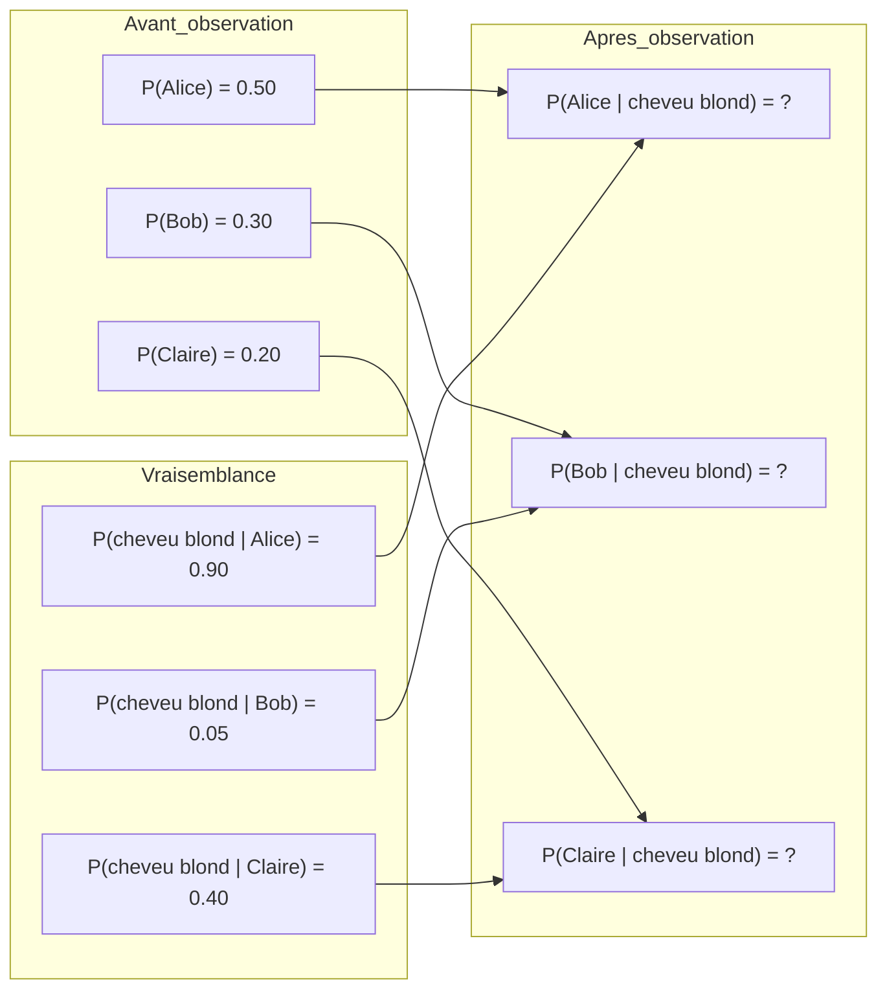
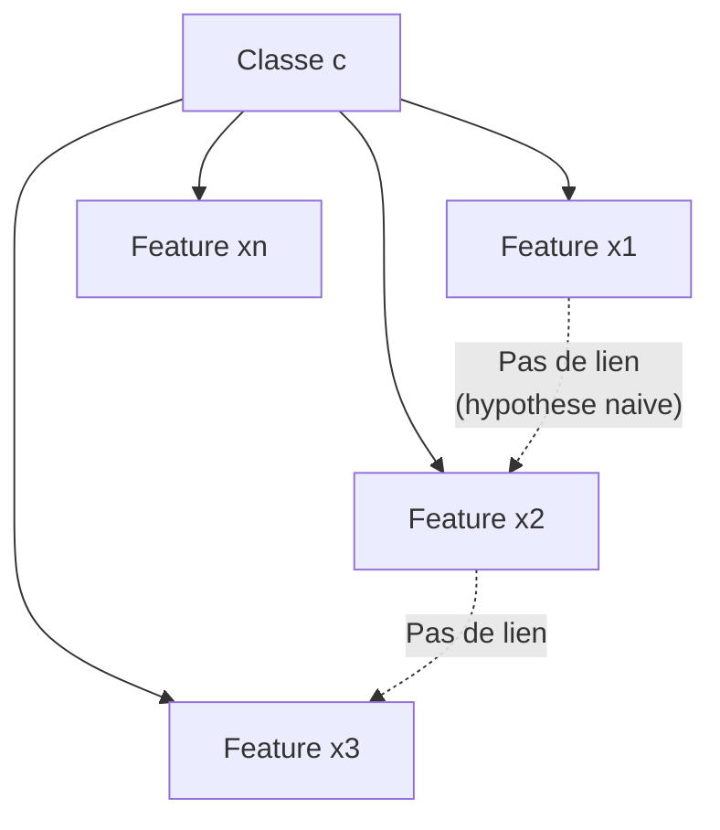
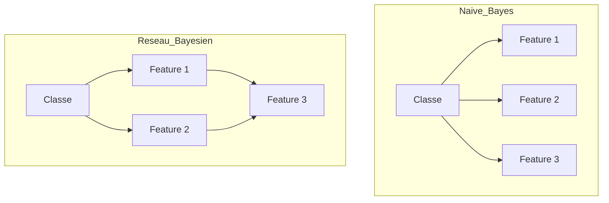

# Chapitre 3 -- Methodes bayesiennes

> **Idee centrale en une phrase :** Les methodes bayesiennes classifient en calculant la probabilite que chaque classe ait genere l'exemple observe -- comme un detective qui, devant un indice, se demande "quel suspect a le plus de chances d'avoir laisse cette trace ?"

**Prerequis :** [Generalites ML](01_generalites_ml.md)
**Chapitre suivant :** [Methodes d'ensemble et Boosting ->](05_ensemble_boosting.md)

---

## 1. L'analogie du detective

### Les indices et les suspects

Un detective arrive sur une scene de crime. Il trouve un cheveu blond. Il connait trois suspects :
- **Alice** : blonde, cheveux longs (90% de chances de laisser un cheveu blond).
- **Bob** : brun (5% de chances de laisser un cheveu blond).
- **Claire** : blonde, cheveux courts (40% de chances de laisser un cheveu blond).

La question : **quel suspect est le plus probable ?**

Le detective ne regarde pas seulement "qui pourrait laisser un cheveu blond" (la **vraisemblance**). Il prend aussi en compte **ce qu'il savait deja** avant de trouver l'indice :
- Alice etait vue pres du lieu (probabilite a priori de 50%).
- Bob avait un alibi fragile (probabilite a priori de 30%).
- Claire etait loin (probabilite a priori de 20%).

Le theoreme de Bayes combine ces deux informations pour donner la probabilite **a posteriori** -- la probabilite de chaque suspect **sachant** l'indice observe.

---

## 2. Intuition visuelle



**Lecture du schema :**
- A gauche : ce qu'on savait **avant** d'observer l'indice (probabilites a priori).
- Au milieu : la probabilite que chaque suspect laisse cet indice (vraisemblance).
- A droite : ce qu'on sait **apres** avoir observe l'indice (probabilites a posteriori). C'est ce qu'on veut calculer.

---

## 3. Le theoreme de Bayes

### La formule

```
P(classe | observation) = P(observation | classe) * P(classe) / P(observation)
```

**Explication mot par mot :**

| Terme | Nom | Signification | Exemple |
|-------|-----|---------------|---------|
| P(classe \| observation) | **Posteriori** | Probabilite de la classe sachant ce qu'on a observe | P(Alice \| cheveu blond) |
| P(observation \| classe) | **Vraisemblance** | Probabilite d'observer cet indice si c'est cette classe | P(cheveu blond \| Alice) |
| P(classe) | **A priori** | Probabilite de la classe avant toute observation | P(Alice) = proportion d'exemples d'Alice |
| P(observation) | **Evidence** | Probabilite d'observer cet indice toutes classes confondues | P(cheveu blond) |

### Le calcul de l'evidence

```
P(observation) = somme_c P(observation | c) * P(c)
```

C'est la somme sur toutes les classes de : vraisemblance * a priori. Elle sert de **normalisation** pour que les probabilites a posteriori somment a 1.

### Calcul complet du detective

```
P(cheveu blond) = 0.90 * 0.50 + 0.05 * 0.30 + 0.40 * 0.20
               = 0.45 + 0.015 + 0.08
               = 0.545

P(Alice | cheveu blond) = (0.90 * 0.50) / 0.545 = 0.826 (82.6%)
P(Bob | cheveu blond)   = (0.05 * 0.30) / 0.545 = 0.028 (2.8%)
P(Claire | cheveu blond) = (0.40 * 0.20) / 0.545 = 0.147 (14.7%)
```

**Conclusion :** Alice est la suspecte la plus probable (82.6%). Le detective l'interrogera en premier.

### La regle de decision

En classification bayesienne, on predit toujours la classe avec la **probabilite a posteriori la plus elevee** :

```
classe_predite = argmax_c P(classe = c | observation)
```

Comme P(observation) est la meme pour toutes les classes, on peut simplifier :

```
classe_predite = argmax_c P(observation | classe = c) * P(classe = c)
```

---

## 4. Le classifieur Naive Bayes

### L'hypothese "naive"

En pratique, un exemple a plusieurs features (attributs). Calculer P(x1, x2, ..., xn | classe) necessite enormement de donnees pour estimer toutes les combinaisons possibles.

**L'hypothese naive :** on suppose que les features sont **independantes** les unes des autres, sachant la classe. Cela simplifie enormement le calcul :

```
P(x1, x2, ..., xn | classe) = P(x1 | classe) * P(x2 | classe) * ... * P(xn | classe)
```

**Pourquoi "naive" ?** Parce que cette hypothese est presque toujours fausse en pratique ! Les features sont rarement vraiment independantes. Mais malgre cela, le Naive Bayes fonctionne remarquablement bien dans beaucoup de cas.

**Analogie :** C'est comme estimer la probabilite qu'il pleuve demain en regardant independamment la pression atmospherique, la temperature et l'humidite, sans considerer que ces trois variables sont liees entre elles.

### Schema du Naive Bayes



**Lecture :** La classe influence chaque feature, mais les features n'ont pas de lien entre elles (pas de fleche horizontale). C'est l'hypothese d'independance conditionnelle.

### Le Naive Bayes Multinomial

Pour les donnees textuelles (sac de mots), on utilise le **Naive Bayes Multinomial**. La vraisemblance est calculee a partir des frequences de chaque mot dans chaque classe.

```
P(mot | classe) = (nombre d'exemples de la classe contenant ce mot + lissage) / 
                  (nombre total d'exemples de la classe + lissage * taille du vocabulaire)
```

Le **lissage de Laplace** (ajouter 1 au numerateur et la taille du vocabulaire au denominateur) evite les probabilites nulles quand un mot n'apparait jamais dans une classe.

---

## 5. Exemple concret : classification de texte

### Le probleme

On veut classer des critiques de jeux video en 3 categories : "mauvais", "moyen", "bien".

### Donnees d'entrainement

| Critique | Classe |
|----------|--------|
| "Ce jeu est excellent et addictif" | bien |
| "Mauvais gameplay, rien ne fonctionne" | mauvais |
| "Sympathique mais limité" | moyen |
| "Un chef-d'oeuvre, parfait" | bien |
| "Catastrophique, une perte de temps" | mauvais |

### Calcul pas a pas

**1. Probabilites a priori :**
```
P(bien) = 2/5 = 0.40
P(mauvais) = 2/5 = 0.40
P(moyen) = 1/5 = 0.20
```

**2. Vraisemblances (pour quelques mots) :**
```
P("excellent" | bien)    = 1/2 = 0.50
P("excellent" | mauvais) = 0/2 = 0.00 -> avec lissage : ~0.01
P("excellent" | moyen)   = 0/1 = 0.00 -> avec lissage : ~0.01
```

**3. Prediction pour "ce jeu est excellent" :**
```
P(bien | critique) proportionnel a:
    P("excellent" | bien) * P("jeu" | bien) * ... * P(bien)

P(mauvais | critique) proportionnel a:
    P("excellent" | mauvais) * P("jeu" | mauvais) * ... * P(mauvais)
```

Le produit sera beaucoup plus grand pour la classe "bien" car "excellent" est fortement associe a cette classe.

### Ce que le modele apprend

Le cours montre les mots les plus discriminants par classe :

| Classe | Mots les plus caracteristiques |
|--------|-------------------------------|
| **mauvais** | "interet", "mauvais", "rien", "mal", "aucune", "moche", "pire" |
| **moyen** | "sympathique", "malheureusement", "manque", "plutot", "dommage" |
| **bien** | "grace", "excellent", "nombreuses", "parfaitement", "riche", "realisme" |

---

## 6. Classification bayesienne de surface vs en profondeur

Le cours distingue deux approches :

### Bayesien "de surface" (Naive Bayes classique)

- Hypothese d'independance des features.
- Rapide, simple, efficace pour le texte.
- Ne modelise pas les dependances entre features.

### Bayesien "en profondeur" (reseaux bayesiens)

- Modelise les **dependances** entre variables via un graphe dirige.
- Plus puissant mais beaucoup plus complexe a estimer.
- Chaque noeud a une table de probabilites conditionnelles.



**A gauche (Naive Bayes) :** les features sont independantes sachant la classe.
**A droite (Reseau bayesien) :** Feature 3 depend de Feature 1 et Feature 2.

---

## 7. Code Python complet

### Naive Bayes sur des critiques de jeux video

```python
# ============================================================
# Naive Bayes Multinomial pour la classification de texte
# ============================================================

from sklearn.naive_bayes import MultinomialNB
from sklearn.feature_extraction.text import CountVectorizer
from sklearn.metrics import classification_report
import numpy as np

# 1. Charger les donnees
# (Ici on simule. Dans le cours, les donnees viennent de jv.data)
targets = {'mauvais': 0, 'moyen': 1, 'bien': 2}
id2target = ['mauvais', 'moyen', 'bien']

def load(filename):
    data = open(filename, 'r').readlines()
    X = [line.split(',')[1] for line in data]
    Y = [targets[line.split(',')[2].split('.')[0]] for line in data]
    return X, Y

trainXraw, trainY = load('jv.data')
testXraw, testY = load('jv.test')

# 2. Vectoriser le texte (sac de mots booleens)
vectorizer = CountVectorizer(
    lowercase=True,        # tout en minuscules
    analyzer='word',       # mots entiers
    ngram_range=(1, 1),    # unigrammes seulement
    binary=True,           # 1 si le mot est present, 0 sinon
    max_df=0.8,            # ignorer les mots trop frequents
    min_df=10              # ignorer les mots trop rares
)
trainX = vectorizer.fit_transform(trainXraw)
testX = vectorizer.transform(testXraw)
print(f"Taille du vocabulaire : {trainX.shape[1]} mots")
print(f"Exemples d'entrainement : {trainX.shape[0]}")

# 3. Entrainer le Naive Bayes
clf = MultinomialNB()
clf.fit(trainX, trainY)

# 4. Analyser le modele appris
# Les probabilites a priori (log)
import pandas as pd
prior = pd.DataFrame(
    clf.class_log_prior_,
    index=id2target,
    columns=['log P(classe)']
)
print("\nProbabilites a priori (log) :")
print(prior)

# 5. Evaluer sur le train
pred_train = clf.predict(trainX)
print("\n--- Performance sur le TRAIN ---")
print(classification_report(trainY, pred_train, target_names=id2target))

# 6. Evaluer sur le test
pred_test = clf.predict(testX)
print("--- Performance sur le TEST ---")
print(classification_report(testY, pred_test, target_names=id2target))

# 7. Predire un exemple specifique avec probabilites
index = 73
print(f"\nExemple #{index} :")
print(f"Vraie classe : {id2target[testY[index]]}")
print(f"Log-probabilites : {clf.predict_log_proba(testX[index])}")
print(f"Probabilites : {clf.predict_proba(testX[index])}")
```

### Naive Bayes sur le dataset Iris

```python
# ============================================================
# Naive Bayes Gaussien sur des donnees numeriques
# ============================================================

from sklearn.naive_bayes import GaussianNB
from sklearn.datasets import load_iris
from sklearn.model_selection import train_test_split, cross_val_score
from sklearn.metrics import classification_report

# 1. Charger et separer
iris = load_iris()
X_train, X_test, y_train, y_test = train_test_split(
    iris.data, iris.target, test_size=0.3, random_state=42
)

# 2. Entrainer le Naive Bayes Gaussien
# (pour des features continues, on suppose une distribution gaussienne)
clf = GaussianNB()
clf.fit(X_train, y_train)

# 3. Evaluer
y_pred = clf.predict(X_test)
print(classification_report(y_test, y_pred, target_names=iris.target_names))

# 4. Validation croisee
scores = cross_val_score(clf, iris.data, iris.target, cv=10)
print(f"Accuracy (10-fold) : {scores.mean():.3f} +/- {scores.std():.3f}")
```

---

## 8. Comparaison Naive Bayes vs Arbre de decision

Le cours compare les deux approches sur les critiques de jeux video :

| Critere | Naive Bayes | Arbre de decision |
|---------|-------------|------------------|
| **Accuracy train** | ~94% | ~71% |
| **Accuracy test** | ~74% | ~54% |
| **Sur-apprentissage** | Faible (modele simple) | Fort (arbre profond) |
| **Interpretabilite** | Les mots discriminants sont explicites | L'arbre est visuel mais peut etre enorme |
| **Vitesse** | Tres rapide | Rapide mais plus lent que NB |
| **Hypothese** | Independence des features | Aucune (non-parametrique) |

**Observation cle :** Le Naive Bayes fait mieux sur le test malgre son hypothese simpliste. L'arbre, plus flexible, overfitte davantage.

---

## 9. Pieges classiques a eviter

- **Oublier le lissage de Laplace.** Sans lissage, si un mot n'apparait jamais dans une classe, P(mot | classe) = 0, et tout le produit des vraisemblances tombe a zero. Le lissage empeche cela.
- **Travailler en probabilites directes.** Les produits de petites probabilites deviennent vite des nombres infiniment petits (underflow). Toujours travailler en **log-probabilites** : log(a * b) = log(a) + log(b).
- **Croire que l'hypothese d'independance est "vraie".** Elle ne l'est presque jamais. Mais Naive Bayes fonctionne quand meme parce qu'on ne cherche pas les bonnes probabilites, juste le bon **classement** des classes.
- **Confondre MultinomialNB et GaussianNB.** MultinomialNB est pour des features de comptage (texte, sac de mots). GaussianNB est pour des features continues (mesures physiques).
- **Mal calculer P(observation).** En examen, on oublie souvent de calculer l'evidence. Si on ne la calcule pas, les probabilites ne somment pas a 1 (mais l'argmax reste correct).

---

## 10. Recapitulatif

- **Theoreme de Bayes** : P(classe | obs) = P(obs | classe) * P(classe) / P(obs). C'est le coeur de la classification bayesienne.
- **Naive Bayes** : hypothese d'independance des features sachant la classe. Simplification enorme mais qui fonctionne bien en pratique.
- **Multinomial NB** : pour le texte. Les features sont des comptages de mots.
- **Gaussien NB** : pour les donnees continues. Chaque feature suit une loi normale par classe.
- **A priori** : P(classe) = proportion de chaque classe dans les donnees d'entrainement.
- **Vraisemblance** : P(feature | classe) = estimee a partir des donnees d'entrainement.
- **Lissage de Laplace** : ajouter 1 (ou alpha) pour eviter les probabilites nulles.
- **Log-probabilites** : toujours travailler en log pour eviter les problemes numeriques.
- **Decision** : predire la classe qui maximise P(classe | obs), ou de maniere equivalente, P(obs | classe) * P(classe).
