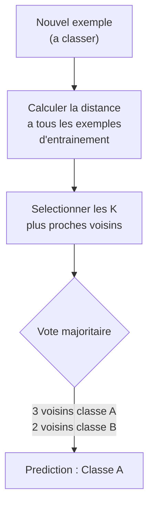
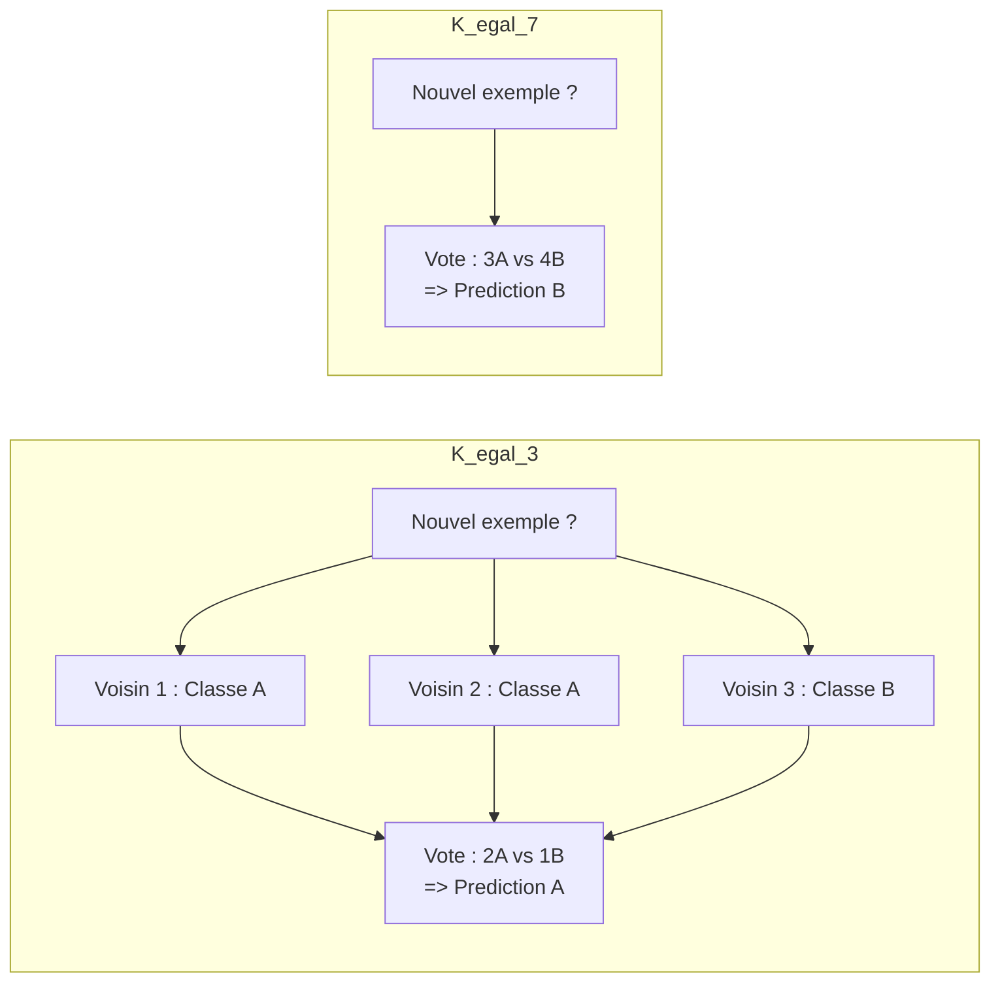
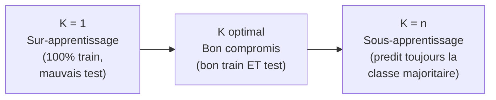
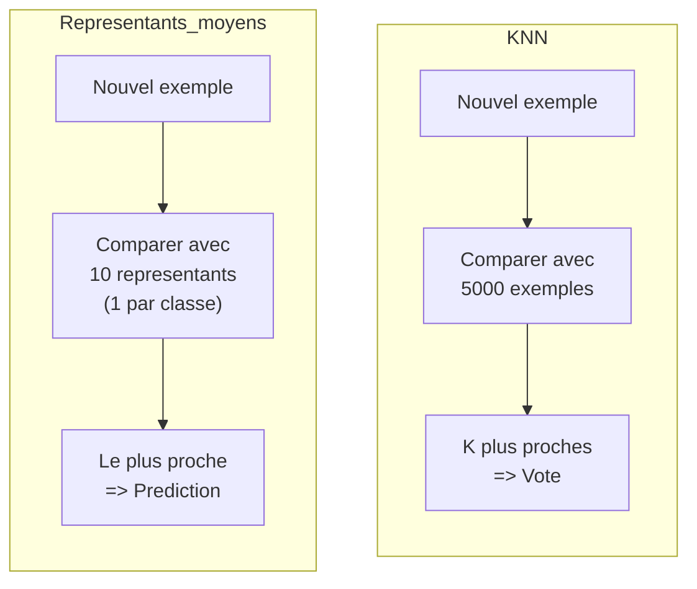

# Chapitre 4 -- K plus proches voisins (KNN)

> **Idee centrale en une phrase :** Le KNN classe un nouvel exemple en regardant ses K voisins les plus proches dans les donnees d'entrainement et en prenant un vote majoritaire -- comme demander l'avis de tes voisins de table avant de repondre a une question.

**Prerequis :** [Generalites ML](01_generalites_ml.md)
**Chapitre suivant :** [Methodes d'ensemble et Boosting ->](05_ensemble_boosting.md)

---

## 1. L'analogie de l'agent immobilier

### Estimer le prix d'un appartement

Tu veux estimer le prix de ton appartement. Un agent immobilier ne connait pas de formule magique. Au lieu de cela, il regarde les **appartements les plus similaires** vendus recemment dans le quartier (meme surface, meme etage, meme nombre de pieces) et en deduit un prix.

Si les 3 appartements les plus proches se sont vendus a 200k, 210k et 195k, il estimera ton appartement a environ 202k (la moyenne).

C'est exactement ce que fait l'algorithme KNN :
1. **Calculer la distance** entre le nouvel exemple et tous les exemples d'entrainement.
2. **Selectionner les K plus proches** voisins.
3. **Voter** : la classe majoritaire parmi ces K voisins est la prediction (classification), ou la moyenne des valeurs (regression).

---

## 2. Intuition visuelle



### Illustration avec K=3 et K=7



**Observation cle :** Avec K=3, on predit A. Avec K=7, on pourrait predire B. Le choix de K change la prediction.

---

## 3. Explication progressive

### 3.1 L'algorithme en detail

```
Algorithme KNN :
Entree : exemple x a classer, parametre K, jeu d'entrainement (X_train, Y_train)

1. Pour chaque exemple x_i dans X_train :
    calculer distance(x, x_i)

2. Trier les exemples par distance croissante

3. Selectionner les K premiers (les K plus proches)

4. Classification : retourner la classe la plus frequente parmi les K voisins
   Regression : retourner la moyenne des valeurs des K voisins
```

### 3.2 La distance euclidienne

La distance la plus courante pour mesurer la "proximite" entre deux exemples :

```
d(x, y) = racine( somme_i (x_i - y_i)^2 )
```

**Explication mot par mot :**
1. **x_i - y_i** : la difference entre les deux exemples sur la dimension i.
2. **(x_i - y_i)^2** : on met au carre pour eliminer les valeurs negatives.
3. **somme_i (...)** : on somme sur toutes les dimensions.
4. **racine(...)** : on prend la racine carree pour revenir a l'echelle originale.

**En pratique**, on utilise souvent la distance au carre (sans la racine) pour gagner du temps, car l'ordre relatif des distances ne change pas.

**Exemple en 2D :**

```
Point A = (1, 2)
Point B = (4, 6)

d(A, B) = racine( (4-1)^2 + (6-2)^2 )
        = racine( 9 + 16 )
        = racine(25)
        = 5
```

### 3.3 L'influence de K

| K trop petit (ex: K=1) | K trop grand (ex: K=n) |
|------------------------|----------------------|
| Le modele est **tres sensible au bruit** | Le modele est **trop lisse** |
| **Variance forte** : change beaucoup si on modifie un seul point | **Biais fort** : ignore les structures locales |
| Frontiere de decision tres irreguliere | Frontiere de decision trop simple |
| **Sur-apprentissage** (100% sur train si K=1) | **Sous-apprentissage** (predit toujours la classe majoritaire) |



### 3.4 Resultats du cours (MNIST)

Le cours montre les resultats du KNN sur la reconnaissance de chiffres manuscrits (MNIST) :

| K | Accuracy train | Accuracy test |
|---|---------------|--------------|
| 1 | 100% | 90.6% |
| 2 | 100% | 90.6% |
| 3 | 97.3% | **92.4%** |
| 4 | 96.8% | 91.4% |
| 5 | 96.1% | 91.2% |

**Observations :**
- K=1 a 100% sur le train (chaque point est son propre voisin) mais pas le meilleur sur le test.
- K=3 donne le meilleur compromis sur le test (92.4%).
- Quand K augmente, l'accuracy train diminue (le modele est moins "exact" sur les donnees d'entrainement).

---

## 4. Choix de K par validation croisee

Le choix optimal de K depend des donnees. On utilise la **validation croisee** pour le trouver :

```python
from sklearn.neighbors import KNeighborsClassifier
from sklearn.model_selection import GridSearchCV

# Definir les valeurs de K a tester
parameters = {'n_neighbors': [1, 3, 5, 11, 17, 39]}

# GridSearch avec validation croisee 5-fold
grid_search = GridSearchCV(
    estimator=KNeighborsClassifier(),
    param_grid=parameters,
    cv=5,
    scoring='f1_weighted',
    n_jobs=2,
    verbose=1
)
grid_search.fit(X_train, y_train)

# Resultats
print(f"Meilleur K : {grid_search.best_params_['n_neighbors']}")
print(f"Meilleur score (F1) : {grid_search.best_score_:.3f}")
```

### Resultats du cours (Breast Cancer)

| K | Score moyen (5-fold) |
|---|---------------------|
| 1 | 0.897 |
| 3 | 0.898 |
| **5** | **0.917** |
| 11 | 0.909 |
| 17 | 0.903 |
| 39 | 0.889 |

K=5 est optimal : ni trop petit (sensible au bruit) ni trop grand (trop lisse).

---

## 5. Avantages et inconvenients du KNN

| Avantages | Inconvenients |
|-----------|--------------|
| Aucun entrainement (lazy learning) | Prediction tres lente (calcul de toutes les distances) |
| Tres simple a comprendre et implementer | Necessite beaucoup de memoire (stocker toutes les donnees) |
| Pas d'hypothese sur la distribution des donnees | Sensible a l'echelle des features (normalisation necessaire) |
| Naturellement multi-classe | Sensible a la malediction de la dimensionnalite |
| Fonctionne pour la classification ET la regression | Le choix de K est critique |

### La malediction de la dimensionnalite

En haute dimension, tous les points sont presque a la meme distance les uns des autres. Les "voisins les plus proches" ne sont pas vraiment proches. Le KNN perd son efficacite.

**Analogie :** Dans un couloir (1D), tes voisins sont vraiment a cote de toi. Dans un immense champ (2D), ils sont deja un peu plus loin. Dans un espace 3D, encore plus loin. En dimension 100, tout le monde est "egalement loin" de tout le monde.

---

## 6. Le classifieur par representants moyens

Une variante plus economique du KNN : au lieu de comparer avec TOUS les exemples d'entrainement, on calcule le **point moyen** de chaque classe et on compare uniquement avec ces representants.



**Avantage :** Tres rapide (seulement 10 comparaisons au lieu de 5000 pour MNIST).
**Inconvenient :** Moins precis (78% vs 92% sur MNIST). Le "point moyen" d'une classe peut ne pas bien representer la classe.

```python
# Representant moyen de chaque classe
class MeanClassifier:
    def __init__(self, n_classes, X_train, Y_train):
        self.mean = np.zeros((n_classes, X_train.shape[1]))
        for c in range(n_classes):
            self.mean[c] = X_train[Y_train == c].mean(axis=0)
    
    def predict(self, x):
        distances = np.sum((self.mean - x) ** 2, axis=1)
        return np.argmin(distances)
```

---

## 7. KNN pour la regression

En regression, au lieu de voter, on **moyenne les valeurs** des K voisins :

```
prediction = (1/K) * somme des y_i des K plus proches voisins
```

**Exemple du cours :** Predire la distance de freinage d'un vehicule en fonction de sa vitesse.

```python
class KNNRegression:
    def __init__(self, k, X_train, Y_train):
        self.k = k
        self.X_train = X_train
        self.Y_train = Y_train
    
    def predict(self, x):
        # 1. Calculer toutes les distances
        distances = np.sum((self.X_train - x) ** 2, axis=1)
        # 2. Trouver les K plus proches
        k_indices = np.argpartition(distances, self.k)[:self.k]
        # 3. Moyenner leurs valeurs
        return np.mean(self.Y_train[k_indices])
```

**Difference avec un modele lineaire :** Le KNN regression donne une courbe en "escalier" qui s'adapte localement aux donnees, tandis qu'un modele lineaire donne une droite.

---

## 8. Code Python complet

```python
# ============================================================
# KNN complet : classification et regression
# ============================================================

import numpy as np
from sklearn.neighbors import KNeighborsClassifier
from sklearn.datasets import load_breast_cancer
from sklearn.model_selection import train_test_split, GridSearchCV
from sklearn.metrics import classification_report

# ---- PARTIE 1 : CLASSIFICATION ----

# 1. Charger les donnees
data = load_breast_cancer()
X, y = data.data, data.target
id2target = data.target_names
print(f"Classes : {id2target}")
print(f"Features : {data.feature_names[:5]}... ({X.shape[1]} au total)")

# 2. Separer train / test
X_train, X_test, y_train, y_test = train_test_split(
    X, y, test_size=0.33, random_state=42
)
print(f"\nTrain : {X_train.shape[0]} exemples")
print(f"Test : {X_test.shape[0]} exemples")

# 3. Entrainer un KNN avec K=3
clf = KNeighborsClassifier(n_neighbors=3, n_jobs=2)
clf.fit(X_train, y_train)

# 4. Evaluer
pred = clf.predict(X_test)
print("\n--- KNN avec K=3 ---")
print(classification_report(y_test, pred, target_names=id2target))

# 5. Trouver le meilleur K par GridSearchCV
parameters = {'n_neighbors': [1, 3, 5, 11, 17, 39]}
grid = GridSearchCV(
    estimator=KNeighborsClassifier(),
    param_grid=parameters,
    cv=5,
    scoring='f1_weighted',
    n_jobs=2
)
grid.fit(X_train, y_train)

print(f"\nMeilleur K : {grid.best_params_['n_neighbors']}")
print(f"Meilleur F1 (5-fold) : {grid.best_score_:.3f}")

# 6. Evaluer le meilleur modele sur le test
pred_best = grid.predict(X_test)
print("\n--- KNN optimal ---")
print(classification_report(y_test, pred_best, target_names=id2target))

# ---- PARTIE 2 : IMPLEMENTATION MANUELLE ----

# KNN from scratch (comme dans le TP du cours)
class KNNManuel:
    def __init__(self, k, X_train, Y_train):
        self.k = k
        self.X_train = X_train
        self.Y_train = Y_train
    
    def predict(self, x):
        """Predit la classe d'un seul exemple x."""
        # Distance euclidienne au carre avec chaque exemple d'entrainement
        distances = np.sum((self.X_train - x) ** 2, axis=1)
        # Indices des K plus proches
        k_indices = np.argpartition(distances, self.k)[:self.k]
        # Classe la plus frequente parmi les K voisins
        from collections import Counter
        votes = Counter(self.Y_train[k_indices])
        return votes.most_common(1)[0][0]
    
    def accuracy(self, X, Y):
        """Calcule la precision sur un jeu de donnees."""
        correct = sum(1 for i in range(len(X)) if self.predict(X[i]) == Y[i])
        return correct / len(X)

# Test de l'implementation manuelle
knn_manual = KNNManuel(3, X_train, y_train)
print(f"\nAccuracy manuelle (K=3) sur le test : {knn_manual.accuracy(X_test, y_test):.3f}")
```

---

## 9. Pieges classiques a eviter

- **Ne pas normaliser les features.** Si une feature varie de 0 a 1000 et une autre de 0 a 1, la premiere dominera le calcul de distance. Il faut **standardiser** les features (centrer-reduire) avant d'appliquer le KNN.
- **K pair en classification binaire.** Avec K pair (ex: K=4), on peut avoir une egalite (2 voisins de chaque classe). Choisir K impair pour eviter les ex aequo.
- **Confondre K=1 avec 100% de precision.** Oui, K=1 donne 100% sur le train (chaque point est son propre voisin), mais c'est du sur-apprentissage pur. Ce n'est pas une bonne performance.
- **Oublier que KNN est "lazy".** Il n'y a pas de phase d'entrainement : on stocke juste les donnees. La prediction est la partie couteuse (il faut calculer toutes les distances).
- **Utiliser KNN en tres haute dimension.** A cause de la malediction de la dimensionnalite, le KNN perd son sens en haute dimension. Reduire la dimension d'abord (PCA, selection de features) si necessaire.

---

## 10. Recapitulatif

- **KNN** = classer en regardant les K voisins les plus proches et en faisant un vote majoritaire.
- **Distance euclidienne** : d(x,y) = racine(somme(x_i - y_i)^2). La metrique la plus courante.
- **K=1** : sur-apprentissage (100% train). **K=n** : sous-apprentissage (predit toujours la classe majoritaire).
- **Choix de K** : par validation croisee (GridSearchCV). Choisir K impair en binaire.
- **Avantages** : simple, pas d'hypothese, multi-classe naturel.
- **Inconvenients** : lent en prediction, sensible a l'echelle des features et a la dimension.
- **Representants moyens** : variante economique -- un seul representant par classe, moins precis mais tres rapide.
- **Regression KNN** : meme principe mais on moyenne les valeurs au lieu de voter.
- **Normalisation** : indispensable avant le KNN pour que toutes les features contribuent equitablement.
