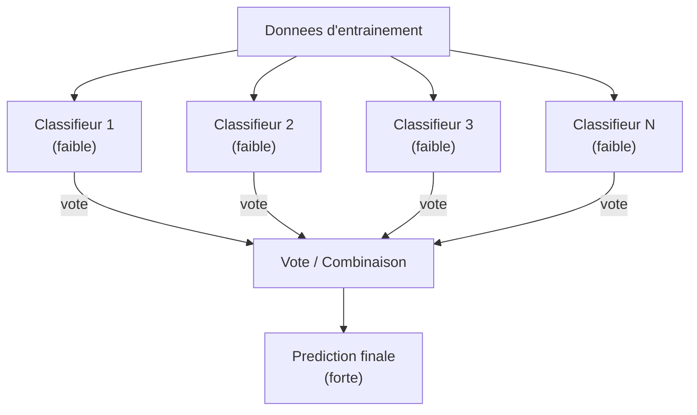
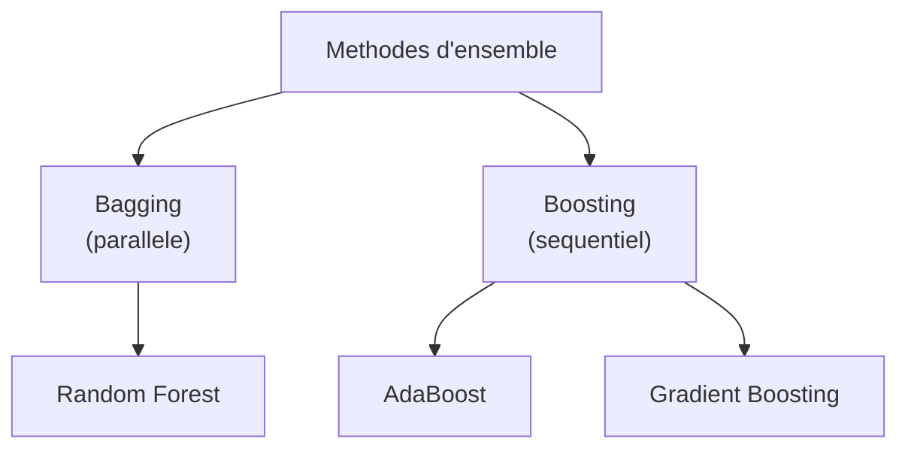
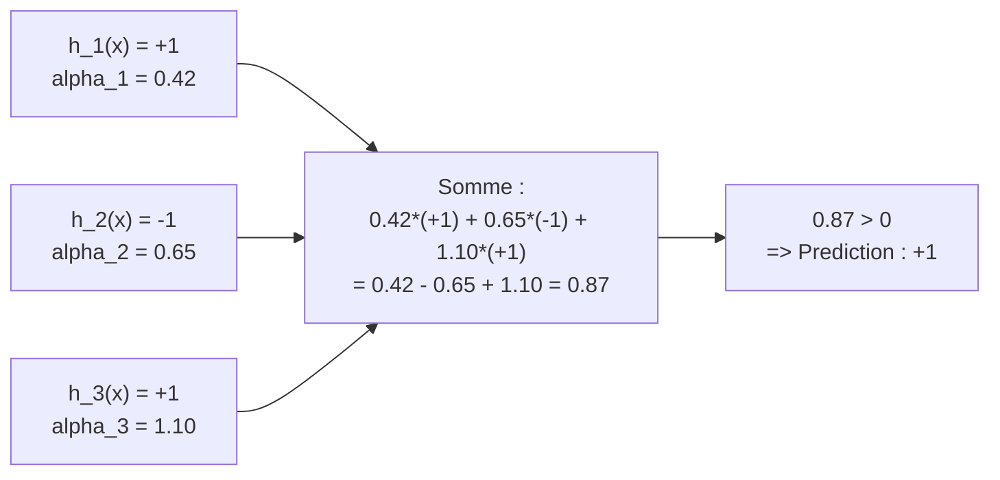
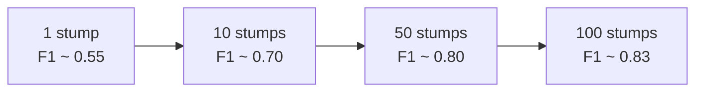

# Chapitre 5 -- Methodes d'ensemble et Boosting

> **Idee centrale en une phrase :** Les methodes d'ensemble combinent plusieurs modeles "faibles" pour creer un modele "fort" -- comme demander l'avis a 100 personnes moyennes plutot qu'a un seul expert, la sagesse collective est souvent meilleure.

**Prerequis :** [Arbres de decision](02_arbres_decision.md), [Methodes bayesiennes](03_methodes_bayesiennes.md)
**Aucun chapitre suivant** (chapitre avance)

---

## 1. L'analogie du jury

### Un juge vs un jury

Imagine un tribunal :
- **Un seul juge** : il peut etre competent, mais il a ses biais, ses angles morts. S'il fait une erreur, il n'y a personne pour le corriger.
- **Un jury de 12 personnes** : chaque jure a ses propres biais, mais en combinant leurs votes, les erreurs individuelles se compensent. Le verdict collectif est souvent plus juste.

Les methodes d'ensemble fonctionnent sur le meme principe :
- Un seul classifieur (arbre de decision, Naive Bayes) peut faire des erreurs.
- En combinant **plusieurs classifieurs**, leurs erreurs se compensent et le resultat est meilleur.

### La condition cle

Pour que la combinaison fonctionne, il faut que les classifieurs soient **diversifies** : s'ils font tous les memes erreurs, les combiner n'apportera rien. C'est comme un jury compose de 12 clones de la meme personne.

---

## 2. Intuition visuelle



---

## 3. Les grandes approches d'ensemble

### Vue d'ensemble



| Methode | Principe | Diversite | Construction |
|---------|---------|-----------|-------------|
| **Bagging** | Entrainer sur des sous-echantillons aleatoires | Donnees differentes | Parallele (independant) |
| **Random Forest** | Bagging + sous-ensemble aleatoire de features | Donnees ET features differentes | Parallele |
| **Boosting** | Chaque classifieur corrige les erreurs du precedent | Focus sur les exemples difficiles | Sequentiel (ordre important) |

---

## 4. AdaBoost en detail

### 4.1 Le principe intuitif

AdaBoost (Adaptive Boosting) fonctionne comme un tuteur qui se concentre sur les exercices que tu rates :

1. **Tour 1 :** L'eleve passe un test. Il reussit certains exercices et en rate d'autres.
2. **Tour 2 :** Le tuteur augmente le poids des exercices rates et diminue celui des reussis. L'eleve se concentre sur ses faiblesses.
3. **Tour 3 :** Meme chose, en se concentrant sur les nouvelles erreurs.
4. **A la fin :** on combine les reponses de tous les tours, en donnant plus de poids aux tours les plus fiables.

### 4.2 L'algorithme en detail

**Vocabulaire :**
- **Classifieur faible (weak learner)** : un classifieur juste un peu meilleur que le hasard (par exemple, un arbre a 2 feuilles -- un "decision stump").
- **Poids des exemples** : chaque exemple a un poids qui indique son importance. Au debut, tous les poids sont egaux.
- **Poids de vote** : chaque classifieur a un poids qui indique sa fiabilite.

```
Algorithme AdaBoost :

1. Initialiser les poids : w_i = 1/n pour chaque exemple i

2. Pour t = 1, 2, ..., T iterations :
   a) Entrainer un classifieur faible h_t sur les donnees ponderees par w
   b) Calculer son erreur ponderee : epsilon_t = somme des w_i pour les exemples mal classes
   c) Calculer son poids de vote : alpha_t = (1/2) * ln((1 - epsilon_t) / epsilon_t)
   d) Mettre a jour les poids des exemples :
      - Si bien classe : w_i = w_i * exp(-alpha_t) / Z_t
      - Si mal classe : w_i = w_i * exp(+alpha_t) / Z_t
      (Z_t est un facteur de normalisation pour que les poids somment a 1)

3. Prediction finale : signe( somme_t alpha_t * h_t(x) )
```

### 4.3 Explication des formules

#### Le poids de vote alpha_t

```
alpha_t = (1/2) * ln( (1 - epsilon_t) / epsilon_t )
```

| epsilon_t (erreur) | alpha_t (poids) | Interpretation |
|-------------------|-----------------|----------------|
| 0.0 (parfait) | +infini | Ce classifieur a toujours raison : poids maximal |
| 0.1 (tres bon) | 1.10 | Fort poids |
| 0.3 (bon) | 0.42 | Poids modere |
| 0.5 (hasard) | 0.00 | Aussi utile que de lancer une piece : poids nul |
| > 0.5 (pire que hasard) | negatif | On inverse ses predictions ! |

**Intuition :** Un classifieur qui se trompe moins a plus de poids dans le vote final. Si un classifieur est pire que le hasard, on inverse ses predictions (d'ou le signe negatif).

#### La mise a jour des poids

```
w_i (nouveau) = w_i (ancien) * exp(-alpha_t * y_i * h_t(x_i)) / Z_t
```

Ou :
- **y_i** = la vraie classe (-1 ou +1)
- **h_t(x_i)** = la prediction du classifieur (-1 ou +1)
- **y_i * h_t(x_i)** = +1 si bien classe, -1 si mal classe

| Cas | y_i * h_t(x_i) | exp(-alpha * ...) | Effet sur w_i |
|-----|----------------|-------------------|---------------|
| Bien classe | +1 | exp(-alpha) < 1 | Le poids **diminue** |
| Mal classe | -1 | exp(+alpha) > 1 | Le poids **augmente** |

**Intuition :** Les exemples mal classes deviennent plus importants au tour suivant. Le prochain classifieur va se concentrer dessus.

#### Le facteur de normalisation Z_t

```
Z_t = 2 * racine( epsilon_t * (1 - epsilon_t) )
```

C'est juste un facteur pour que les poids somment a 1 (distribution de probabilite).

### 4.4 La prediction finale

```
H(x) = signe( somme_t=1..T  alpha_t * h_t(x) )
```

Chaque classifieur faible h_t vote -1 ou +1, pondere par son poids alpha_t. On somme tous les votes ponderes. Si la somme est positive, on predit +1. Sinon, -1.



---

## 5. Le decision stump (classifieur faible)

Dans le TP du cours, le classifieur faible est un **decision stump** : un arbre de decision avec un seul noeud (2 feuilles seulement).

Pour des donnees textuelles, chaque stump teste la presence d'un seul mot :

```
Si le mot "excellent" est dans la critique :
    predire +1 (positif)
Sinon :
    predire -1 (negatif)
```

```python
class decision_stump:
    def __init__(self, word):
        self.binary_rule = word           # Le mot a tester
        self.yes_branch_prediction = None # Prediction si le mot est present
        self.no_branch_prediction = None  # Prediction si le mot est absent
        self.global_error = None          # Erreur ponderee du stump
    
    def fit(self, samples, classes, weights):
        """
        Apprend les predictions optimales pour ce mot.
        
        Pour chaque branche (mot present / absent) :
        - Si la majorite ponderee des exemples est positive => predire +1
        - Sinon => predire -1
        """
        yes_pos = sum(w for s, c, w in zip(samples, classes, weights)
                      if self.binary_rule in s and c == 1)
        yes_neg = sum(w for s, c, w in zip(samples, classes, weights)
                      if self.binary_rule in s and c == -1)
        
        self.yes_branch_prediction = 1 if yes_pos >= yes_neg else -1
        
        no_pos = sum(w for s, c, w in zip(samples, classes, weights)
                     if self.binary_rule not in s and c == 1)
        no_neg = sum(w for s, c, w in zip(samples, classes, weights)
                     if self.binary_rule not in s and c == -1)
        
        self.no_branch_prediction = 1 if no_pos >= no_neg else -1
        
        # Erreur ponderee
        preds = self.predict(samples)
        self.global_error = sum(w for p, c, w in zip(preds, classes, weights) if p != c)
        return self.global_error
    
    def predict(self, samples):
        return [self.yes_branch_prediction if self.binary_rule in s
                else self.no_branch_prediction for s in samples]
```

---

## 6. Effet du nombre d'iterations

Plus on ajoute de classifieurs faibles, meilleur est l'ensemble :



**Observation importante :** Contrairement a d'autres methodes, AdaBoost est **relativement resistant au sur-apprentissage** quand on augmente le nombre d'iterations. Les performances sur le test continuent de s'ameliorer meme apres que le train atteint 100%.

---

## 7. Code Python complet

### AdaBoost avec scikit-learn

```python
# ============================================================
# AdaBoost avec scikit-learn
# ============================================================

from sklearn.ensemble import AdaBoostClassifier
from sklearn.tree import DecisionTreeClassifier
from sklearn.datasets import load_breast_cancer
from sklearn.model_selection import train_test_split
from sklearn.metrics import classification_report
import matplotlib.pyplot as plt
import numpy as np

# 1. Charger les donnees
data = load_breast_cancer()
X_train, X_test, y_train, y_test = train_test_split(
    data.data, data.target, test_size=0.3, random_state=42
)

# 2. Entrainer AdaBoost
# Le classifieur de base est un decision stump (arbre de profondeur 1)
ada = AdaBoostClassifier(
    estimator=DecisionTreeClassifier(max_depth=1),
    n_estimators=50,    # nombre de classifieurs faibles
    learning_rate=1.0,  # pas d'apprentissage
    random_state=42
)
ada.fit(X_train, y_train)

# 3. Evaluer
y_pred = ada.predict(X_test)
print("--- AdaBoost (50 stumps) ---")
print(classification_report(y_test, y_pred, target_names=data.target_names))

# 4. Courbe de performance en fonction du nombre de stumps
train_errors = []
test_errors = []
for n in range(1, 51):
    ada_n = AdaBoostClassifier(
        estimator=DecisionTreeClassifier(max_depth=1),
        n_estimators=n,
        random_state=42
    )
    ada_n.fit(X_train, y_train)
    train_errors.append(1 - ada_n.score(X_train, y_train))
    test_errors.append(1 - ada_n.score(X_test, y_test))

plt.figure(figsize=(10, 5))
plt.plot(range(1, 51), train_errors, label='Erreur train')
plt.plot(range(1, 51), test_errors, label='Erreur test')
plt.xlabel('Nombre de classifieurs faibles')
plt.ylabel('Taux d\'erreur')
plt.title('AdaBoost : erreur en fonction du nombre d\'iterations')
plt.legend()
plt.grid(True)
plt.show()
```

### Implementation manuelle de AdaBoost (style du TP)

```python
# ============================================================
# AdaBoost implementation manuelle (pour comprendre l'algorithme)
# ============================================================

import numpy as np

class Adaboost:
    def __init__(self, allwords, n_iter=1):
        self.allwords = allwords
        self.n_iteration = n_iter
        self.weak_learners = []
        self.poids_de_vote = []
    
    def round(self, samples, classes):
        """Trouve le meilleur stump parmi tous les mots possibles."""
        best_clf = None
        best_error = float('inf')
        for word in self.allwords:
            clf = decision_stump(word)
            error = clf.fit(samples, classes, self.weights)
            if error < best_error:
                best_error = error
                best_clf = clf
        return best_clf
    
    def fit(self, samples, classes):
        """Entraine T classifieurs faibles iterativement."""
        n = len(samples)
        self.weights = np.ones(n, dtype='float64') / n
        
        for t in range(self.n_iteration):
            # 1. Trouver le meilleur classifieur faible
            clf = self.round(samples, classes)
            self.weak_learners.append(clf)
            
            # 2. Calculer le poids de vote alpha
            epsilon = clf.error()
            if epsilon == 0:
                epsilon = 1e-10  # eviter log(0)
            alpha = 0.5 * np.log((1 - epsilon) / epsilon)
            self.poids_de_vote.append(alpha)
            
            # 3. Mettre a jour les poids des exemples
            predictions = clf.predict(samples)
            for i in range(n):
                self.weights[i] *= np.exp(-alpha * classes[i] * predictions[i])
            
            # 4. Normaliser
            Z = 2 * np.sqrt(epsilon * (1 - epsilon))
            self.weights /= Z
    
    def predict(self, samples, n=None):
        """Predit en combinant les votes de tous les classifieurs."""
        if n is None:
            n = len(self.weak_learners)
        
        predictions = []
        for sample_idx in range(len(samples)):
            vote = sum(
                self.poids_de_vote[t] * self.weak_learners[t].predict([samples[sample_idx]])[0]
                for t in range(n)
            )
            predictions.append(1 if vote >= 0 else -1)
        return predictions
```

---

## 8. Bagging et Random Forest (notions complementaires)

### Bagging (Bootstrap Aggregating)

Au lieu de changer les poids des exemples (boosting), on entraine chaque classifieur sur un **sous-echantillon aleatoire** des donnees (avec remise = bootstrap).

```python
from sklearn.ensemble import BaggingClassifier, RandomForestClassifier

# Bagging avec des arbres
bagging = BaggingClassifier(
    estimator=DecisionTreeClassifier(),
    n_estimators=100,
    max_samples=0.8,    # chaque arbre utilise 80% des donnees
    random_state=42
)
bagging.fit(X_train, y_train)
print(f"Bagging accuracy : {bagging.score(X_test, y_test):.3f}")

# Random Forest = Bagging + sous-ensemble aleatoire de features
rf = RandomForestClassifier(
    n_estimators=100,
    max_features='sqrt',  # chaque arbre utilise sqrt(n_features) features
    random_state=42
)
rf.fit(X_train, y_train)
print(f"Random Forest accuracy : {rf.score(X_test, y_test):.3f}")
```

---

## 9. Pieges classiques a eviter

- **Confondre bagging et boosting.** Le bagging construit les classifieurs en **parallele** (independants). Le boosting les construit en **sequence** (chaque classifieur depend du precedent).
- **Croire que le boosting overfitte toujours.** Contrairement aux arbres profonds, AdaBoost overfitte peu meme avec beaucoup d'iterations (c'est un resultat theorique surprenant).
- **Oublier les poids dans les calculs.** En AdaBoost, TOUT est pondere : l'erreur est ponderee, la mise a jour est ponderee, le vote final est pondere. Ne pas oublier les poids dans les calculs d'examen.
- **Utiliser un classifieur trop fort comme base.** AdaBoost est concu pour des classifieurs **faibles** (stumps). Utiliser un arbre profond comme classifieur de base peut causer du sur-apprentissage.
- **Oublier que le boosting est binaire.** AdaBoost classique fonctionne pour 2 classes (-1 et +1). Pour le multi-classe, il faut des extensions (AdaBoost.M1, AdaBoost.SAMME).

---

## 10. Recapitulatif

- **Methode d'ensemble** = combiner plusieurs classifieurs faibles pour obtenir un classifieur fort.
- **AdaBoost** = boosting adaptatif. Chaque nouveau classifieur se concentre sur les erreurs du precedent via un systeme de poids.
- **Decision stump** = classifieur faible typique : un arbre a un seul noeud (2 feuilles).
- **Poids de vote** : alpha_t = (1/2) * ln((1 - epsilon) / epsilon). Un classifieur precis a plus de poids.
- **Mise a jour des poids** : les exemples mal classes voient leur poids augmenter, les bien classes le voient diminuer.
- **Prediction** : vote pondere de tous les classifieurs. signe(somme alpha_t * h_t(x)).
- **Bagging** : entrainer sur des sous-echantillons aleatoires (parallele).
- **Random Forest** : bagging + sous-ensemble aleatoire de features a chaque noeud.
- **Boosting vs Bagging** : boosting est sequentiel et adaptatif ; bagging est parallele et aleatoire.
