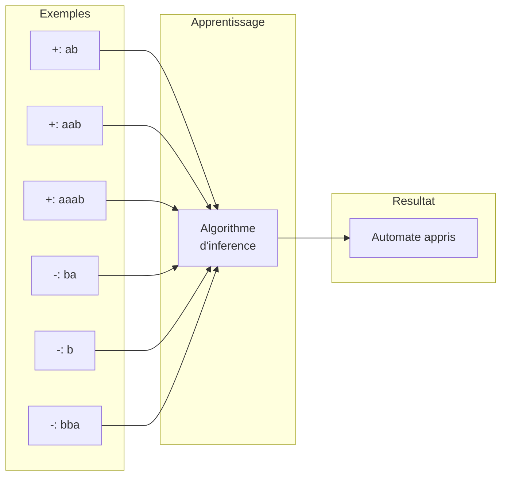
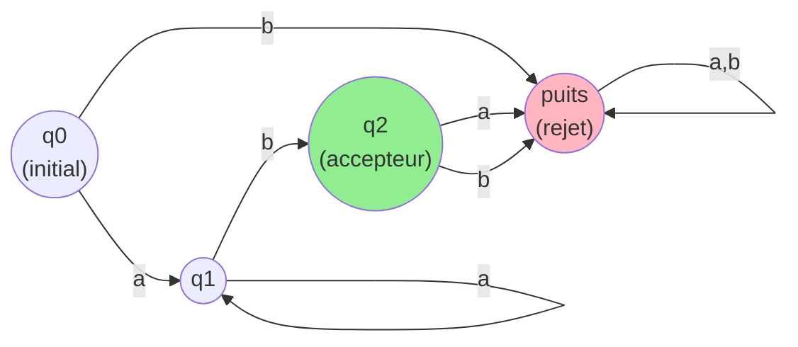
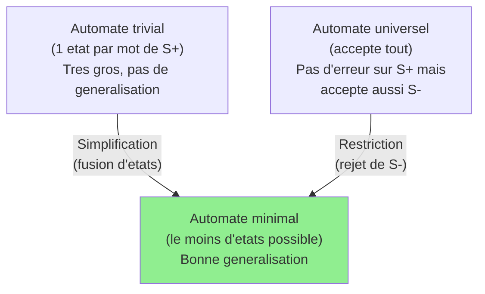
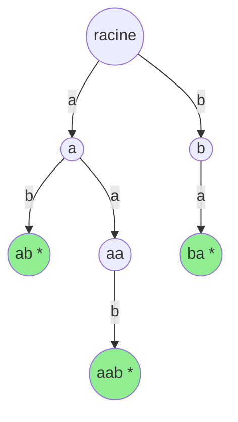
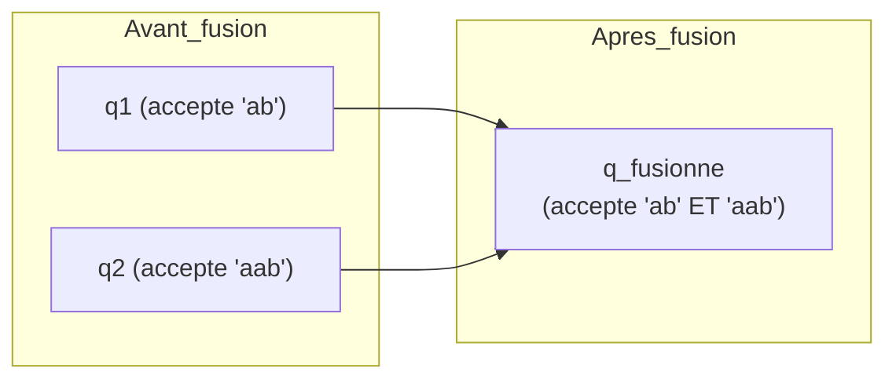
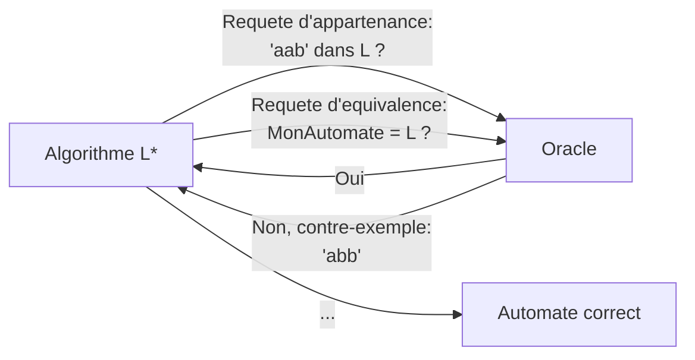
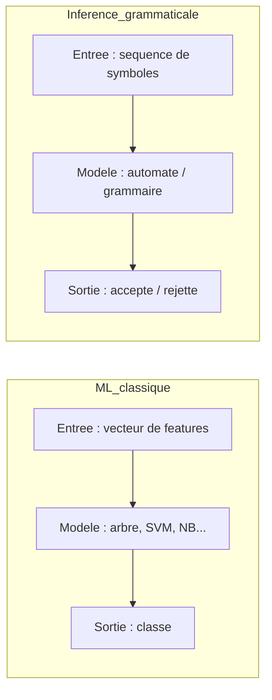

# Chapitre 6 -- Inference grammaticale

> **Idee centrale en une phrase :** L'inference grammaticale, c'est deviner les regles d'un langage (comme la grammaire d'une langue) en observant des exemples de phrases correctes et incorrectes -- comme un enfant qui apprend a parler en ecoutant les adultes.

**Prerequis :** [Generalites ML](01_generalites_ml.md)
**Chapitre independant** -- pas de suite directe

---

## 1. L'analogie de l'enfant qui apprend une langue

### Comment un enfant apprend la grammaire ?

Un enfant de 3 ans n'a jamais ouvert un livre de grammaire. Pourtant, il sait dire "le chat mange la souris" et pas "chat le souris mange la". Comment a-t-il appris ?

En ecoutant des milliers de phrases, son cerveau a **extrait les regles** :
- Le determinant vient avant le nom.
- Le verbe vient apres le sujet.
- etc.

L'inference grammaticale fonctionne de la meme maniere :
1. On donne a l'algorithme des **exemples positifs** (mots/sequences qui appartiennent au langage).
2. Eventuellement des **exemples negatifs** (mots/sequences qui n'appartiennent pas au langage).
3. L'algorithme **apprend un automate** (ou une grammaire) qui accepte les bons mots et rejette les mauvais.

### Difference avec le ML classique

| ML classique | Inference grammaticale |
|-------------|----------------------|
| Classe un exemple dans une categorie | Determine si une sequence appartient a un langage |
| Features fixes (taille du vecteur constante) | Sequences de longueur variable |
| Pas de structure temporelle | L'ordre des symboles compte |
| Modele = fonction de decision | Modele = automate / grammaire |

---

## 2. Intuition visuelle

L'automate appris pourrait etre : "Le langage est constitue d'un ou plusieurs 'a' suivis d'un seul 'b'" (expression reguliere : `a+b`).

---

## 3. Rappels : automates et langages

### 3.1 Alphabet, mot, langage

| Terme | Definition | Exemple |
|-------|-----------|---------|
| **Alphabet (Sigma)** | Ensemble fini de symboles | {a, b} |
| **Mot** | Suite finie de symboles de l'alphabet | "aab", "ba", "aaab" |
| **Mot vide (epsilon)** | Mot de longueur 0 | "" |
| **Langage** | Ensemble de mots | L = {"ab", "aab", "aaab", ...} |

### 3.2 Automate fini deterministe (AFD)

Un AFD est une machine qui lit un mot symbole par symbole et decide si le mot est accepte ou rejete.

**Composants :**

| Composant | Symbole | Description |
|-----------|---------|-------------|
| Etats | Q | Ensemble fini d'etats (les "noeuds" de l'automate) |
| Alphabet | Sigma | Les symboles d'entree |
| Transitions | delta | Fonction qui dit "depuis l'etat q, en lisant le symbole a, on va a l'etat q'" |
| Etat initial | q0 | L'etat de depart |
| Etats accepteurs | F | Les etats finaux (si on termine dans un de ces etats, le mot est accepte) |

### Exemple d'automate

**Lecture de l'automate :**
- On commence en q0 (etat initial).
- En lisant un 'a', on va en q1.
- En q1, en lisant un 'a', on reste en q1 (on peut lire autant de 'a' qu'on veut).
- En q1, en lisant un 'b', on va en q2 (etat accepteur).
- Le mot "aab" : q0 -a-> q1 -a-> q1 -b-> q2 (accepte).
- Le mot "ba" : q0 -b-> puits (rejete).

---

## 4. Le probleme de l'inference grammaticale

### Formulation formelle

**Donnees :**
- Un ensemble d'exemples positifs S+ = {mots qui appartiennent au langage}
- Un ensemble d'exemples negatifs S- = {mots qui n'appartiennent pas au langage}

**Objectif :** Trouver un automate A tel que :
- A accepte tous les mots de S+
- A rejette tous les mots de S-
- A **generalise** correctement sur des mots non vus

### Le probleme de la generalisation

Avec seulement des exemples positifs, il existe toujours un automate trivial qui fonctionne : un automate avec un etat par mot de S+, qui accepte exactement ces mots et rien d'autre. Mais cet automate ne generalise pas du tout (c'est l'equivalent du sur-apprentissage en ML).

L'objectif est de trouver l'automate **le plus simple** (le moins d'etats possible) qui est coherent avec les exemples. C'est le **biais d'Occam** applique aux automates.

---

## 5. Algorithmes d'inference

### 5.1 L'arbre des prefixes (PTA - Prefix Tree Acceptor)

Le point de depart de la plupart des algorithmes. On construit un arbre ou chaque branche represente un mot de S+.

**Exemple avec S+ = {ab, aab, ba} :**

Les noeuds marques * sont des etats accepteurs. Le PTA accepte exactement les mots de S+ et rien d'autre.

### 5.2 La fusion d'etats (State Merging)

L'idee cle : on part du PTA et on **fusionne** des etats pour simplifier l'automate, tant que cette fusion ne contredit pas les exemples negatifs.

**Algorithme RPNI (Regular Positive and Negative Inference) :**
1. Construire le PTA a partir de S+.
2. Ordonner les etats (par exemple, par ordre lexicographique des prefixes).
3. Pour chaque paire d'etats, essayer de les fusionner.
4. Si la fusion ne cree pas de contradiction avec S-, accepter la fusion.
5. Sinon, refuser la fusion et essayer la paire suivante.

### 5.3 L'approche par requetes (Algorithme L*)

L'algorithme L* (Angluin, 1987) apprend un automate en posant deux types de questions a un "oracle" :

| Type de requete | Question | Reponse |
|----------------|----------|---------|
| **Requete d'appartenance** | "Le mot 'aab' est-il dans le langage ?" | Oui / Non |
| **Requete d'equivalence** | "Voici mon automate. Est-il correct ?" | Oui / Non + contre-exemple |

---

## 6. Applications

L'inference grammaticale a des applications dans de nombreux domaines :

| Domaine | Application |
|---------|------------|
| **Bio-informatique** | Modelisation de sequences ADN/proteines |
| **Linguistique computationnelle** | Apprentissage de la syntaxe d'une langue |
| **Verification de logiciels** | Apprendre le comportement d'un systeme (test boite noire) |
| **Reconnaissance de formes** | Modelisation de patterns sequentiels |
| **Compression de donnees** | Trouver des regularites dans les sequences |

---

## 7. Lien avec le ML classique

| Concept ML | Equivalent en inference grammaticale |
|-----------|--------------------------------------|
| Jeu d'entrainement | Exemples positifs et negatifs |
| Modele | Automate fini |
| Complexite du modele | Nombre d'etats de l'automate |
| Sur-apprentissage | Automate avec trop d'etats (PTA pur) |
| Sous-apprentissage | Automate avec trop peu d'etats (automate universel) |
| Regularisation | Preference pour l'automate minimal |
| Generalisation | Capacite a classer de nouveaux mots correctement |

---

## 8. Programmation logique inductive (ILP)

Le cours mentionne aussi la **Programmation Logique Inductive** (Inductive Logic Programming), une approche de ML qui apprend des regles logiques a partir d'exemples.

### Principe

- **Entrees** : des exemples positifs et negatifs + un savoir de fond (background knowledge).
- **Sortie** : des regles logiques (de type Prolog) qui expliquent les exemples.

**Exemple :**
- Exemples positifs : "Alice est la grand-mere de Charlie", "Bob est le grand-pere de David"
- Savoir de fond : "Alice est la mere de Eve", "Eve est la mere de Charlie", etc.
- Regle apprise : `grandparent(X, Z) :- parent(X, Y), parent(Y, Z).`

### Lien avec l'inference grammaticale

Les deux domaines partagent l'idee d'**apprendre des structures symboliques** (regles, automates) a partir d'exemples, contrairement au ML numerique classique qui apprend des fonctions continues.

---

## 9. Pieges classiques a eviter

- **Confondre AFD et AFN.** Un automate fini **deterministe** (AFD) a exactement une transition par (etat, symbole). Un automate fini **non-deterministe** (AFN) peut en avoir plusieurs. En inference grammaticale, on travaille souvent avec des AFD.
- **Oublier l'etat puits.** Un AFD complet a une transition pour chaque (etat, symbole). Si aucune transition n'est definie, on va dans un "etat puits" qui rejette tout. Ne pas oublier cet etat dans les representations.
- **Croire que le PTA generalise.** Le PTA (Prefix Tree Acceptor) n'accepte que les mots exacts de S+. Il ne generalise pas. C'est l'equivalent d'apprendre par coeur.
- **Confondre inference grammaticale et NLP.** L'inference grammaticale apprend des langages **formels** (reguliers, hors-contexte). Le NLP (traitement du langage naturel) est beaucoup plus complexe car les langues humaines ne sont pas des langages formels.
- **Oublier le biais d'Occam.** Le bon automate n'est pas celui qui a le plus d'etats, mais le plus simple qui est coherent avec les exemples. C'est le meme principe que l'elagage des arbres de decision.

---

## 10. Recapitulatif

- **Inference grammaticale** = apprendre un automate (ou une grammaire) a partir d'exemples de mots acceptes et rejetes.
- **Automate fini deterministe (AFD)** = machine a etats qui lit un mot symbole par symbole et decide s'il est accepte ou rejete.
- **PTA (Prefix Tree Acceptor)** = point de depart -- un arbre qui accepte exactement les mots de S+ (pas de generalisation).
- **Fusion d'etats** = technique pour simplifier le PTA en fusionnant des etats compatibles. C'est la cle de la generalisation.
- **RPNI** = algorithme qui fusionne des etats du PTA tant que les exemples negatifs ne sont pas contredits.
- **Algorithme L*** = apprend un automate en posant des requetes d'appartenance et d'equivalence a un oracle.
- **Biais d'Occam** = preferer l'automate le plus simple (le moins d'etats) qui est coherent avec les exemples.
- **ILP** = apprentissage de regles logiques a partir d'exemples, une autre forme d'apprentissage symbolique.
- **Lien avec le ML** : memes concepts (generalisation, sur-apprentissage, complexite du modele) mais appliques a des structures symboliques (automates) plutot que numeriques (vecteurs).
