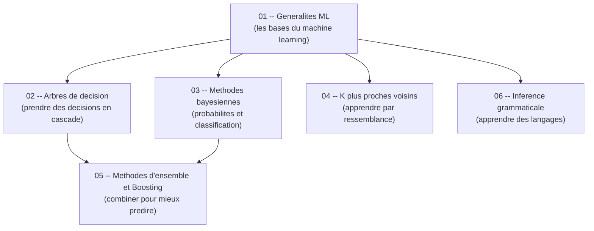

# Guide -- Apprentissage Automatique / Machine Learning (S6)

Bienvenue dans ce guide d'apprentissage automatique, concu pour etre accessible meme si tu n'as jamais touche a un algorithme de ML. L'objectif est simple : te permettre de comprendre les concepts fondamentaux du machine learning, etape par etape, avec des explications claires, des analogies concretes et du code Python que tu peux reproduire immediatement. Chaque chapitre est **autonome** -- tu peux les lire dans l'ordre ou sauter directement a celui qui t'interesse sans etre perdu.

---

## Roadmap d'apprentissage

Voici l'ordre recommande pour progresser efficacement. Chaque etape s'appuie sur les precedentes, mais tu peux toujours revenir en arriere si un concept te manque.

> **Lecture du diagramme** : les fleches indiquent l'ordre logique. Les generalites (01) sont le point de depart. Les arbres de decision (02), les methodes bayesiennes (03) et le KNN (04) sont trois branches independantes. Les methodes d'ensemble (05) combinent les arbres et le bayesien. L'inference grammaticale (06) est un theme a part.

---

## Prerequis

Pas besoin d'etre un expert en maths pour suivre ce guide. Voici le strict minimum :

- **Savoir ce qu'est une probabilite** -- si tu sais que lancer un de a 1 chance sur 6 de tomber sur chaque face, c'est suffisant.
- **Notions basiques de Python** -- variables, boucles, fonctions. Pas besoin d'etre expert.
- **Avoir Python installe** avec les librairies `scikit-learn`, `numpy`, `pandas` et `matplotlib`.
- **Connaitre les bases de l'algebre lineaire** -- vecteurs, matrices, produit scalaire (revu dans le guide).

Si tu sais calculer `P(A) = nombre de cas favorables / nombre de cas total`, tu as le niveau requis.

---

## Comment utiliser ce guide

1. **Lis dans l'ordre** pour une progression naturelle, ou **saute directement** au chapitre qui t'interesse -- chaque fichier est autonome et complet.
2. **Reproduis le code Python** en parallele dans un Jupyter Notebook ou Google Colab. Le ML s'apprend en pratiquant, pas en lisant passivement.
3. **Les diagrammes Mermaid** sont rendus automatiquement sur GitHub et dans Obsidian. Si tu lis les fichiers dans un autre editeur, installe une extension Mermaid pour en profiter.
4. **Ne memorise pas les formules** -- comprends d'abord l'intuition, le reste viendra naturellement.

---

## Table des matieres

| # | Chapitre | Description |
|---|----------|-------------|
| 01 | [Generalites ML](01_generalites_ml.md) | Les bases : apprentissage supervise, non supervise, evaluation, biais-variance -- le socle de tout le reste. |
| 02 | [Arbres de decision](02_arbres_decision.md) | Construire un arbre qui prend des decisions en posant des questions. Entropie, gain d'information, elagage. |
| 03 | [Methodes bayesiennes](03_methodes_bayesiennes.md) | Utiliser les probabilites pour classer. Theoreme de Bayes, Naive Bayes, classifieur bayesien. |
| 04 | [K plus proches voisins](04_knn.md) | Classifier en cherchant les voisins les plus proches. Choix de K, distance, validation croisee. |
| 05 | [Methodes d'ensemble et Boosting](05_ensemble_boosting.md) | Combiner plusieurs classifieurs faibles pour en faire un fort. Bagging, AdaBoost, Random Forests. |
| 06 | [Inference grammaticale](06_inference_grammaticale.md) | Apprendre des langages et des automates a partir d'exemples. |
| -- | [Cheat Sheet](cheat_sheet.md) | Fiche de revision : structure du DS, questions recurrentes, formules essentielles, pieges a eviter. |

---

## Structure d'un chapitre

Chaque chapitre suit la meme progression pour t'aider a construire ta comprehension pas a pas :

| Etape | Ce que tu y trouves |
|-------|---------------------|
| **Analogie** | Une situation de la vie courante pour ancrer le concept. |
| **Intuition visuelle** | Un schema ou diagramme Mermaid pour visualiser l'idee avant toute formule. |
| **Explication progressive** | Le concept explique en partant du plus simple vers le plus precis. |
| **Formules** | Les equations mathematiques, introduites seulement quand l'intuition est en place. |
| **Exemple concret** | Un jeu de donnees realiste pour voir le concept en action. |
| **Code Python** | Le code complet et commente a reproduire dans un notebook. |
| **Pieges classiques** | Les erreurs frequentes et comment les eviter. |
| **Recapitulatif** | Un resume en quelques points pour reviser rapidement. |

> Cette structure est pensee pour que tu puisses toujours comprendre le *pourquoi* avant le *comment*. Si une formule te bloque, reviens a l'analogie -- elle contient l'essentiel.
