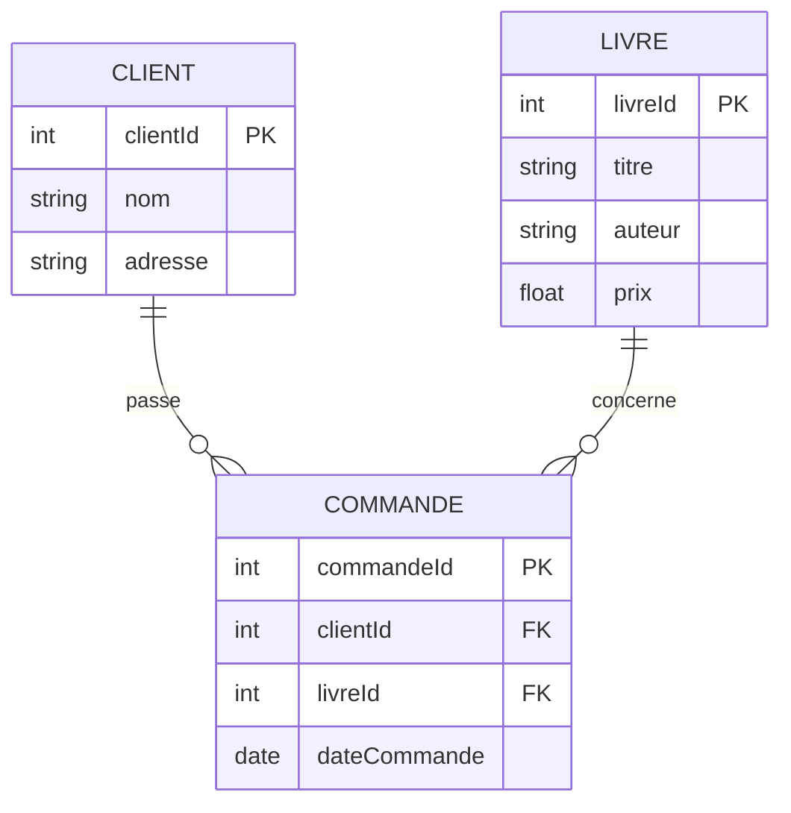
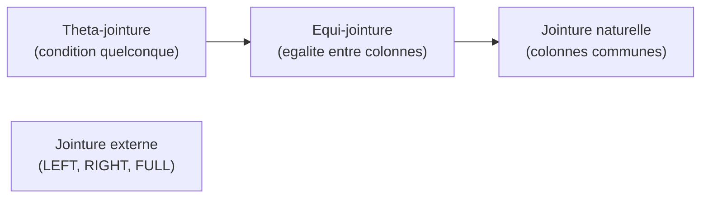

# Chapitre 1 -- Modele relationnel

> **Idee centrale en une phrase :** Une base de donnees relationnelle, c'est un ensemble de tableaux lies entre eux par des colonnes communes, comme un classeur Excel bien organise ou chaque feuille a un role precis.

**Prerequis :** Aucun
**Chapitre suivant :** [Dependances fonctionnelles ->](02_dependances_fonctionnelles.md)

---

## 1. L'analogie du classeur d'entreprise

### Pourquoi on ne met pas tout dans un seul tableau ?

Imagine que tu geres une petite librairie. Tu pourrais mettre toutes les informations dans un seul grand tableau :

| Commande | Client | Adresse | Livre | Auteur | Prix |
|----------|--------|---------|-------|--------|------|
| C001 | Alice | 3 rue A | Harry Potter | Rowling | 15 |
| C002 | Alice | 3 rue A | Le Hobbit | Tolkien | 12 |
| C003 | Bob | 7 rue B | Harry Potter | Rowling | 15 |

**Problemes immediats :**

- **Redondance** : l'adresse d'Alice est ecrite deux fois. Si elle demenage, il faut modifier toutes les lignes.
- **Anomalie de mise a jour** : si tu oublies de modifier une ligne, tu as deux adresses differentes pour Alice.
- **Anomalie de suppression** : si tu supprimes la commande C003 (la seule de Bob), tu perds aussi l'existence de Bob comme client.
- **Anomalie d'insertion** : tu ne peux pas ajouter un nouveau client tant qu'il n'a pas passe de commande.

### La solution : separer les informations

Le modele relationnel propose de **decouper** ce grand tableau en plusieurs petits tableaux, chacun dedie a un type d'information :

- Un tableau **Clients** (qui sont nos clients ?)
- Un tableau **Livres** (qu'est-ce qu'on vend ?)
- Un tableau **Commandes** (qui a achete quoi ?)

C'est exactement comme organiser un classeur avec une feuille par theme.

---

## 2. Les concepts fondamentaux

### Schema visuel



**Lecture du schema :**

- Chaque rectangle est une **relation** (= un tableau).
- Les colonnes a l'interieur sont les **attributs**.
- PK = cle primaire, FK = cle etrangere.
- Les lignes entre les rectangles montrent les **liens** : un client peut passer plusieurs commandes (1 vers N).

---

### 2.1 Relation (= table)

Une **relation** est un tableau a deux dimensions :

- Les **colonnes** sont les **attributs** (les proprietes qu'on stocke).
- Les **lignes** sont les **tuples** (= les enregistrements, les donnees).

| Terme formel | Equivalent courant | Exemple |
|---|---|---|
| Relation | Table | La table "Client" |
| Attribut | Colonne | La colonne "nom" |
| Tuple | Ligne / enregistrement | (1, "Alice", "3 rue A") |
| Domaine | Type de donnees | INTEGER, VARCHAR, DATE... |
| Schema | Structure de la table | Client(clientId, nom, adresse) |

**Notation du schema :** On ecrit le nom de la relation suivi de ses attributs entre parentheses. La cle primaire est **soulignee** :

```
Client(clientId, nom, adresse)
```

### 2.2 Cle primaire (Primary Key -- PK)

La cle primaire est un attribut (ou un groupe d'attributs) qui **identifie de facon unique** chaque tuple dans la relation. C'est comme le numero de securite sociale : deux personnes ne peuvent pas avoir le meme.

**Regles d'une cle primaire :**

1. **Unicite** : deux tuples ne peuvent jamais avoir la meme valeur de cle.
2. **Non-nullite** : la cle ne peut jamais etre vide (NULL).
3. **Minimalite** : on ne doit pas pouvoir retirer un attribut de la cle tout en gardant l'unicite.

**Exemple :**

```sql
CREATE TABLE client (
    clientId INTEGER PRIMARY KEY,  -- Cle primaire : identifie chaque client
    nom VARCHAR(50),
    adresse VARCHAR(100)
);
```

> **Analogie :** La cle primaire, c'est le numero de badge dans une entreprise. Chaque employe a un badge unique, personne ne peut entrer sans badge, et on ne peut pas simplifier davantage le numero.

### 2.3 Cle etrangere (Foreign Key -- FK)

Une cle etrangere est un attribut dans une table qui **fait reference** a la cle primaire d'une autre table. C'est le mecanisme qui **lie les tables entre elles**.

**Exemple :**

```sql
CREATE TABLE commande (
    commandeId INTEGER PRIMARY KEY,
    clientId INTEGER,               -- Cle etrangere vers client
    livreId INTEGER,                -- Cle etrangere vers livre
    dateCommande DATE,
    FOREIGN KEY (clientId) REFERENCES client(clientId),
    FOREIGN KEY (livreId) REFERENCES livre(livreId)
);
```

**Contrainte d'integrite referentielle :** La valeur de la cle etrangere **doit correspondre** a une valeur existante dans la table referencee (ou etre NULL si autorise). On ne peut pas creer une commande pour un client qui n'existe pas.

> **Analogie :** La cle etrangere, c'est le numero de badge ecrit sur un formulaire interne. Il doit correspondre a un badge existant dans la table des employes, sinon le formulaire est invalide.

### 2.4 Cle candidate et super-cle

- **Super-cle** : tout ensemble d'attributs qui identifie de facon unique un tuple (peut contenir des attributs inutiles).
- **Cle candidate** : une super-cle **minimale** -- on ne peut en retirer aucun attribut sans perdre l'unicite.
- **Cle primaire** : la cle candidate qu'on a **choisie** pour identifier les tuples.

**Exemple :** Pour une table Etudiant(numINE, numINSA, nom, prenom) :

- Super-cles : {numINE}, {numINSA}, {numINE, nom}, {numINE, numINSA, nom, prenom}...
- Cles candidates : {numINE}, {numINSA} (les deux sont minimales et uniques)
- Cle primaire : on choisit {numINE} (par convention)

---

## 3. L'algebre relationnelle

L'algebre relationnelle est le **langage theorique** qui definit les operations qu'on peut faire sur les relations. C'est la base mathematique de SQL.

### 3.1 Selection (sigma)

La selection filtre les **lignes** d'une relation selon une condition. C'est le WHERE de SQL.

**Notation :** sigma_{condition}(Relation)

**Exemple :**

```
sigma_{prix > 10}(Livre)
```

```sql
-- Equivalent SQL
SELECT * FROM Livre WHERE prix > 10;
```

**Resultat :** Toutes les lignes de la table Livre ou le prix est superieur a 10.

### 3.2 Projection (pi)

La projection selectionne des **colonnes** specifiques. C'est le SELECT (avec des colonnes nommees) de SQL.

**Notation :** pi_{attributs}(Relation)

**Exemple :**

```
pi_{titre, auteur}(Livre)
```

```sql
-- Equivalent SQL
SELECT titre, auteur FROM Livre;
```

**Resultat :** Un tableau avec seulement les colonnes titre et auteur.

### 3.3 Produit cartesien

Le produit cartesien combine **chaque ligne** d'une relation avec **chaque ligne** d'une autre relation. Si la table A a n lignes et la table B a m lignes, le resultat a n * m lignes.

```sql
-- Produit cartesien en SQL
SELECT * FROM etudiant, professeur;
-- Avec 73 etudiants et 25 professeurs : 73 x 25 = 1825 lignes
```

> **Attention :** Le produit cartesien seul est rarement utile. On l'utilise presque toujours avec une selection (= jointure) pour ne garder que les combinaisons pertinentes.

### 3.4 Jointure

La jointure combine deux relations **en ne gardant que les lignes qui correspondent** selon une condition. C'est la combinaison d'un produit cartesien et d'une selection.

**Types de jointures :**



**Jointure naturelle :** Joint automatiquement sur les colonnes de meme nom.

```sql
-- Jointure naturelle (implicite)
SELECT * FROM customer NATURAL JOIN facture;

-- Equivalent avec jointure explicite (prefere !)
SELECT * FROM customer c
JOIN facture f ON c.customerId = f.customerId;
```

**Jointure externe (LEFT JOIN) :** Garde toutes les lignes de la table de gauche, meme si aucune correspondance n'existe dans la table de droite.

```sql
-- Tous les clients, meme ceux sans commande
SELECT c.nom, co.commandeId
FROM client c
LEFT JOIN commande co ON c.clientId = co.clientId;
```

### 3.5 Operations ensemblistes

| Operation | Description | SQL | Condition |
|-----------|-------------|-----|-----------|
| Union | Lignes de A **ou** B | `A UNION B` | Meme schema |
| Intersection | Lignes de A **et** B | `A INTERSECT B` | Meme schema |
| Difference | Lignes de A **pas dans** B | `A EXCEPT B` | Meme schema |

```sql
-- Etudiants inscrits en maths OU en physique
SELECT etudId FROM inscription_maths
UNION
SELECT etudId FROM inscription_physique;

-- Etudiants inscrits en maths ET en physique
SELECT etudId FROM inscription_maths
INTERSECT
SELECT etudId FROM inscription_physique;
```

### 3.6 Division

La division repond a la question : "Quels elements sont en relation avec **tous** les elements d'un ensemble ?"

**Exemple :** "Quels etudiants sont inscrits a **tous** les cours ?"

```sql
-- Division en SQL (pas d'operateur natif, on utilise un double NOT EXISTS)
SELECT e.etudId
FROM etudiant e
WHERE NOT EXISTS (
    SELECT ens.ensId
    FROM enseignement ens
    WHERE NOT EXISTS (
        SELECT *
        FROM enseignementSuivi es
        WHERE es.etudId = e.etudId
        AND es.ensId = ens.ensId
    )
);
```

> **Astuce pour comprendre la division :** "Trouver les etudiants pour lesquels il n'existe PAS de cours auquel ils ne sont PAS inscrits." La double negation = affirmation universelle.

---

## 4. Le schema de la base du cours

Le cours utilise un schema de base de donnees avec des etudiants, professeurs et cours :

```sql
-- Schema du TP/TD de la matiere
CREATE TABLE etudiant (
    etudId VARCHAR(3),      -- Identifiant etudiant (E1, E2...)
    nom VARCHAR(30),        -- Nom de famille
    prenom VARCHAR(30)      -- Prenom
);

CREATE TABLE professeur (
    profId VARCHAR(3),      -- Identifiant professeur (P1, P2...)
    nom VARCHAR(30),
    prenom VARCHAR(30)
);

CREATE TABLE enseignement (
    ensId VARCHAR(3),       -- Identifiant cours
    sujet VARCHAR(50)       -- Intitule du cours
);

CREATE TABLE enseignementSuivi (
    ensId VARCHAR(3),       -- FK vers enseignement
    etudId VARCHAR(3),      -- FK vers etudiant
    profId VARCHAR(3)       -- FK vers professeur
);
```

**A noter :** ce schema n'a pas de cles primaires ni de contraintes de cles etrangeres explicites. C'est volontaire pour le TP1, mais en pratique on devrait **toujours** les definir.

---

## 5. Contraintes d'integrite

Les contraintes d'integrite sont des regles qui garantissent la **coherence** des donnees.

| Contrainte | Description | Exemple SQL |
|---|---|---|
| **NOT NULL** | L'attribut ne peut pas etre vide | `nom VARCHAR(50) NOT NULL` |
| **UNIQUE** | Pas de doublon sur cet attribut | `email VARCHAR(100) UNIQUE` |
| **PRIMARY KEY** | Identifiant unique + non nul | `clientId INTEGER PRIMARY KEY` |
| **FOREIGN KEY** | Reference une cle d'une autre table | `FOREIGN KEY (clientId) REFERENCES client(clientId)` |
| **CHECK** | Condition booleenne a respecter | `CHECK (prix >= 0)` |
| **DEFAULT** | Valeur par defaut si non specifiee | `statut VARCHAR(10) DEFAULT 'actif'` |

**Exemple complet :**

```sql
CREATE TABLE produit (
    produitId INTEGER PRIMARY KEY,
    nom VARCHAR(100) NOT NULL,
    prix REAL CHECK (prix >= 0),
    stock INTEGER DEFAULT 0,
    categorieId INTEGER,
    FOREIGN KEY (categorieId) REFERENCES categorie(categorieId)
);
```

---

## 6. Pieges classiques

### Piege 1 : Confondre cle primaire et cle etrangere

- La cle **primaire** identifie les lignes de **sa propre table**.
- La cle **etrangere** pointe vers la cle primaire d'**une autre table**.
- Une meme colonne peut etre cle primaire ET cle etrangere (dans une table d'association).

### Piege 2 : Oublier la contrainte d'integrite referentielle

```sql
-- ERREUR : inserer une commande pour un client inexistant
INSERT INTO commande (commandeId, clientId, livreId) VALUES (1, 999, 1);
-- Si clientId=999 n'existe pas dans client => violation !
```

### Piege 3 : Confondre produit cartesien et jointure

```sql
-- Produit cartesien (ATTENTION : toutes les combinaisons !)
SELECT * FROM etudiant, professeur;  -- 73 x 25 = 1825 lignes

-- Jointure (seulement les correspondances pertinentes)
SELECT * FROM etudiant e
JOIN enseignementSuivi es ON e.etudId = es.etudId;
```

### Piege 4 : Schema sans cle primaire

Toujours definir une cle primaire. Un schema sans PK est techniquement valide mais :
- Impossible d'identifier un tuple de facon unique
- Risque de doublons
- Pas de cle etrangere possible depuis d'autres tables

### Piege 5 : Confondre NATURAL JOIN et JOIN ... ON

```sql
-- NATURAL JOIN : joint sur TOUTES les colonnes de meme nom (risque d'erreur)
SELECT * FROM A NATURAL JOIN B;

-- JOIN ... ON : on specifie explicitement la condition (plus sur)
SELECT * FROM A JOIN B ON A.id = B.id;
```

Le NATURAL JOIN est dangereux car si les deux tables ont une colonne de meme nom par coincidence (ex: "nom"), la jointure se fera aussi sur cette colonne, ce qui n'est pas ce qu'on veut.

---

## 7. Recapitulatif

| Concept | Definition courte |
|---------|-------------------|
| **Relation** | Un tableau avec des colonnes (attributs) et des lignes (tuples) |
| **Attribut** | Une colonne d'une relation (une propriete) |
| **Tuple** | Une ligne d'une relation (un enregistrement) |
| **Cle primaire** | Attribut(s) qui identifie(nt) de facon unique chaque ligne |
| **Cle etrangere** | Attribut qui reference la cle primaire d'une autre table |
| **Cle candidate** | Super-cle minimale (pourrait etre choisie comme PK) |
| **Selection** | Filtrer les lignes selon une condition (sigma / WHERE) |
| **Projection** | Choisir des colonnes specifiques (pi / SELECT col1, col2) |
| **Jointure** | Combiner deux tables sur une condition de correspondance |
| **Produit cartesien** | Toutes les combinaisons possibles de lignes de deux tables |
| **Division** | Trouver les elements en relation avec TOUS les elements d'un ensemble |
| **Integrite referentielle** | Les cles etrangeres doivent pointer vers des valeurs existantes |

> **A retenir :** Le modele relationnel repose sur trois piliers : des **tables bien definies** (avec des cles), des **liens entre tables** (par cles etrangeres), et des **operations** pour interroger les donnees (algebre relationnelle / SQL).
