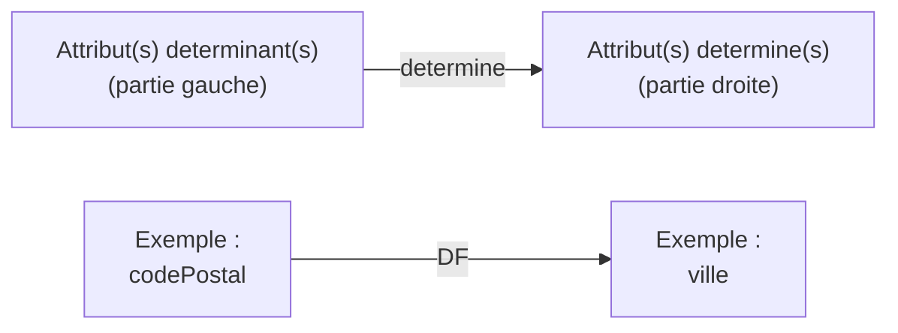
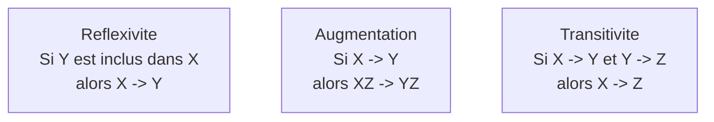

# Chapitre 2 -- Dependances fonctionnelles

> **Idee centrale en une phrase :** Une dependance fonctionnelle, c'est quand la valeur d'une colonne permet de determiner automatiquement la valeur d'une autre colonne -- comme un code postal qui determine la ville.

**Prerequis :** [Modele relationnel](01_modele_relationnel.md)
**Chapitre suivant :** [Formes normales ->](03_formes_normales.md)

---

## 1. L'analogie du code postal

### Pourquoi certaines colonnes dependent d'autres ?

Quand tu ecris une adresse, si tu donnes le code postal **75005**, tout le monde sait que la ville est **Paris**. Tu n'as pas besoin de preciser la ville -- le code postal la determine automatiquement.

On ecrit : `codePostal -> ville`

Cela se lit : "le code postal **determine fonctionnellement** la ville". Autrement dit, si deux adresses ont le **meme code postal**, elles ont **forcement la meme ville**.

### Attention : ce n'est pas symetrique !

- `codePostal -> ville` : VRAI (un code postal = une seule ville)
- `ville -> codePostal` : FAUX (Paris a plusieurs codes postaux : 75001, 75002, ..., 75020)

### Pourquoi c'est important ?

Si on stocke a la fois le code postal et la ville dans la meme table, on stocke de l'information **redondante** (la ville peut etre deduite du code postal). Cette redondance cause des problemes :

- **Gaspillage d'espace** : on repete la meme information.
- **Risque d'incoherence** : quelqu'un pourrait ecrire "75005, Lyon" par erreur.
- **Difficulte de maintenance** : si une ville change de nom, il faut modifier toutes les lignes.

---

## 2. Definition formelle

### Schema visuel



### Definition

Soit une relation R avec des attributs. On dit qu'il existe une **dependance fonctionnelle** (DF) entre un ensemble d'attributs X et un ensemble d'attributs Y, notee :

```
X -> Y
```

si et seulement si : pour tout couple de tuples t1 et t2 de R, si t1 et t2 ont les **memes valeurs** sur X, alors ils ont **forcement les memes valeurs** sur Y.

**En langage courant :** "Si je connais X, je connais Y de facon certaine."

### Exemples concrets

| Dependance fonctionnelle | Explication | Vraie ? |
|---|---|---|
| `numEtudiant -> nom, prenom` | Un numero d'etudiant determine le nom et prenom | Oui |
| `nom, prenom -> numEtudiant` | Un nom et prenom determine le numero d'etudiant | Non (homonymes) |
| `numSecu -> dateNaissance` | Un numero de secu determine la date de naissance | Oui |
| `ISBN -> titre, auteur, editeur` | Un ISBN determine les infos du livre | Oui |
| `titre -> auteur` | Un titre de livre determine l'auteur | Non (titres identiques possibles) |

---

## 3. Les axiomes d'Armstrong

Les axiomes d'Armstrong sont trois regles logiques qui permettent de **deduire de nouvelles DF** a partir de celles qu'on connait deja. Ce sont les regles du jeu.

### Les trois axiomes



#### Axiome 1 : Reflexivite

Si Y est un sous-ensemble de X, alors X -> Y.

**Traduction :** Un ensemble d'attributs determine toujours ses propres sous-ensembles. C'est trivial mais necessaire.

**Exemple :** `{nom, prenom} -> {nom}` (si je connais le nom et le prenom, je connais forcement le nom).

#### Axiome 2 : Augmentation

Si X -> Y, alors pour tout attribut Z : XZ -> YZ.

**Traduction :** On peut ajouter les memes attributs des deux cotes d'une DF sans la casser.

**Exemple :** Si `numEtudiant -> nom`, alors `{numEtudiant, adresse} -> {nom, adresse}`.

#### Axiome 3 : Transitivite

Si X -> Y et Y -> Z, alors X -> Z.

**Traduction :** Les dependances se "propagent" comme une chaine.

**Exemple :** Si `numEtudiant -> codePostal` et `codePostal -> ville`, alors `numEtudiant -> ville`.

### Regles derivees (consequences des axiomes)

A partir de ces trois axiomes, on peut demontrer d'autres regles utiles :

| Regle | Formulation | Explication |
|-------|-------------|-------------|
| **Union** | Si X -> Y et X -> Z, alors X -> YZ | On peut combiner les parties droites |
| **Decomposition** | Si X -> YZ, alors X -> Y et X -> Z | On peut separer les parties droites |
| **Pseudo-transitivite** | Si X -> Y et WY -> Z, alors WX -> Z | Combinaison de transitivite et augmentation |

> **Astuce pratique :** La **decomposition** est tres utile. Si on a `A -> BC`, on peut ecrire `A -> B` et `A -> C` separement. A l'inverse, si on a `A -> B` et `A -> C`, on peut ecrire `A -> BC` (union).

---

## 4. Fermeture d'un ensemble d'attributs (X+)

### Definition

La **fermeture** de X, notee X+, est l'ensemble de **tous les attributs** qu'on peut determiner a partir de X en utilisant les DF connues.

### Algorithme de calcul de X+

C'est un algorithme iteratif tres simple :

```
Entree : un ensemble d'attributs X, un ensemble de DF F
Sortie : X+ (la fermeture de X)

1. Initialiser resultat = X
2. Repeter :
   a. Pour chaque DF (A -> B) dans F :
      - Si A est inclus dans resultat :
        - Ajouter B a resultat
3. Jusqu'a ce que resultat ne change plus
4. Retourner resultat
```

### Exemple detaille

Soit la relation R(A, B, C, D, E) avec les DF :

```
F = { A -> B, B -> C, A -> D, D -> E }
```

Calculons {A}+ :

| Etape | Resultat actuel | DF applicable | Nouvel attribut |
|-------|-----------------|---------------|-----------------|
| Init | {A} | -- | -- |
| 1 | {A} | A -> B | B |
| 2 | {A, B} | B -> C | C |
| 3 | {A, B, C} | A -> D | D |
| 4 | {A, B, C, D} | D -> E | E |
| 5 | {A, B, C, D, E} | (plus rien) | -- |

**Resultat :** {A}+ = {A, B, C, D, E} = tous les attributs !

**Conclusion :** A est une **cle candidate** car sa fermeture contient tous les attributs de la relation.

### A quoi sert la fermeture ?

1. **Verifier si une DF est impliquee** : X -> Y est impliquee par F si et seulement si Y est inclus dans X+.
2. **Trouver les cles candidates** : X est une super-cle si X+ contient tous les attributs. X est une cle candidate si aucun sous-ensemble propre de X n'est une super-cle.
3. **Calculer la couverture minimale** (voir section suivante).

---

## 5. Couverture minimale (couverture canonique)

### Pourquoi simplifier les DF ?

Un ensemble de DF peut contenir des redondances. La couverture minimale est un ensemble **equivalent** (meme fermeture) mais **sans DF inutile** ni attribut inutile.

### Algorithme de calcul

```
1. Decomposer : chaque DF doit avoir un seul attribut en partie droite
   Exemple : A -> BC  devient  A -> B  et  A -> C

2. Reduire les parties gauches : pour chaque DF X -> A,
   tester si un sous-ensemble strict de X determine aussi A
   Exemple : Si AB -> C mais que B seul suffit (B+ contient C),
   alors remplacer AB -> C par B -> C

3. Supprimer les DF redondantes : pour chaque DF X -> A,
   tester si on peut la deduire des autres
   Exemple : Si A -> B et B -> C impliquent A -> C,
   alors A -> C est redondante et peut etre supprimee
```

### Exemple

Soit F = { A -> BC, B -> C, AB -> D }

**Etape 1 -- Decomposition :**

```
A -> B, A -> C, B -> C, AB -> D
```

**Etape 2 -- Reduction des parties gauches :**

- `AB -> D` : est-ce que A seul determine D ? Calculons {A}+ avec les autres DF : A -> B, A -> C, B -> C. Donc {A}+ = {A, B, C}. D n'est pas dedans. A seul ne suffit pas.
- Est-ce que B seul determine D ? {B}+ = {B, C}. Non.
- Donc AB -> D reste tel quel.

**Etape 3 -- Suppression des redondances :**

- `A -> C` : est-ce que c'est redondant ? Sans cette DF, a-t-on A -> C ? Avec A -> B et B -> C, par transitivite, oui ! Donc `A -> C` est redondante.

**Couverture minimale :**

```
Fmin = { A -> B, B -> C, AB -> D }
```

---

## 6. Dependances fonctionnelles dans les TD

### TD3-4 : Exercices types

Les exercices de DF suivent generalement ce schema :

1. On te donne une relation R(A, B, C, D, ...) et un ensemble de DF.
2. On te demande de :
   - Calculer des fermetures (X+)
   - Trouver les cles candidates
   - Calculer la couverture minimale
   - Decomposer en formes normales (voir chapitre suivant)

**Methode systematique pour trouver les cles candidates :**

1. Identifie les attributs qui n'apparaissent **jamais en partie droite** d'une DF. Ces attributs **doivent** etre dans toute cle.
2. Calcule la fermeture de ces attributs.
3. Si la fermeture contient tous les attributs, tu as ta cle candidate.
4. Sinon, ajoute progressivement des attributs et recalcule.

**Exemple :** R(A, B, C, D), F = { A -> B, C -> D }

- Attributs jamais en partie droite : A et C (ils n'apparaissent qu'a gauche).
- Calculons {A, C}+ : A -> B donne {A, B, C}, puis C -> D donne {A, B, C, D} = tous les attributs.
- {A, C} est une super-cle.
- A seul : {A}+ = {A, B}. Pas une super-cle.
- C seul : {C}+ = {C, D}. Pas une super-cle.
- Donc {A, C} est minimale : c'est la cle candidate.

---

## 7. Pieges classiques

### Piege 1 : Confondre DF et correlation

Une DF est une **garantie absolue**, pas une tendance statistique. Si `A -> B`, alors pour TOUTES les lignes ou A a la meme valeur, B a la meme valeur. Sans exception.

### Piege 2 : Croire qu'une DF est symetrique

`A -> B` n'implique PAS `B -> A`. Exemple : codePostal -> ville, mais ville -/-> codePostal.

### Piege 3 : Oublier des attributs dans la fermeture

Lors du calcul de X+, il faut iterer **jusqu'a stabilisation**. Apres avoir ajoute un nouvel attribut, il faut re-verifier toutes les DF car les nouvelles combinaisons peuvent debloquer d'autres DF.

### Piege 4 : Confondre cle candidate et cle primaire

- **Cle candidate** : tout ensemble minimal d'attributs dont la fermeture couvre tous les attributs.
- **Cle primaire** : la cle candidate qu'on a **choisie** (il peut y en avoir plusieurs).

### Piege 5 : Mauvaise reduction dans la couverture minimale

Quand on teste si un attribut est inutile dans la partie gauche d'une DF, on calcule la fermeture **avec l'ensemble actuel de DF** (y compris la DF qu'on est en train de tester). C'est une erreur courante de la retirer avant de tester.

### Piege 6 : DF triviale

Une DF est **triviale** si la partie droite est incluse dans la partie gauche. Exemple : `{A, B} -> A` est triviale (on sait deja A si on a A). Les DF triviales sont toujours vraies mais n'apportent aucune information utile.

---

## 8. Recapitulatif

| Concept | Definition courte |
|---------|-------------------|
| **Dependance fonctionnelle X -> Y** | Si deux tuples ont le meme X, ils ont le meme Y |
| **Reflexivite** | Si Y est dans X, alors X -> Y (trivial) |
| **Augmentation** | Si X -> Y, alors XZ -> YZ |
| **Transitivite** | Si X -> Y et Y -> Z, alors X -> Z |
| **Union** | Si X -> Y et X -> Z, alors X -> YZ |
| **Decomposition** | Si X -> YZ, alors X -> Y et X -> Z |
| **Fermeture X+** | Tous les attributs determinables a partir de X |
| **Cle candidate** | Ensemble minimal dont la fermeture = tous les attributs |
| **Couverture minimale** | Ensemble de DF equivalent mais sans redondance |

> **A retenir :** Les DF expriment les regles metier de tes donnees. Connaitre les DF d'une relation permet de trouver les cles candidates et de determiner si la structure de la table est bonne (voir chapitre suivant sur les formes normales).
