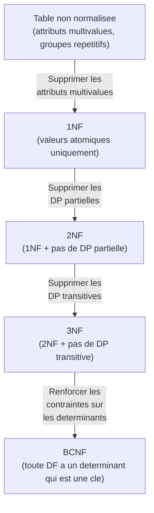
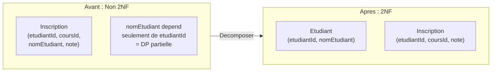
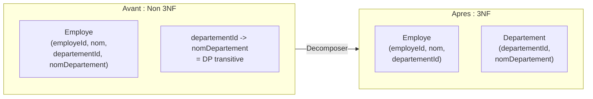

# Chapitre 3 -- Formes normales

> **Idee centrale en une phrase :** Les formes normales sont des regles de "bonne hygiene" pour structurer tes tables afin d'eviter les repetitions inutiles et les incoherences -- comme ranger chaque type d'objet dans le bon tiroir.

**Prerequis :** [Dependances fonctionnelles](02_dependances_fonctionnelles.md)
**Chapitre suivant :** [SQL avance ->](04_sql_avance.md)

---

## 1. L'analogie du rangement

### Pourquoi normaliser ?

Imagine un carton de demenagement ou tu as melange la vaisselle, les vetements, les livres et les outils. Pour trouver un verre, tu dois fouiller dans tout le carton. Pire : si tu casses un verre en cherchant, tu risques de tacher un vetement.

La **normalisation**, c'est le fait de **ranger chaque type d'objet dans son propre carton** :
- Un carton pour la vaisselle
- Un carton pour les vetements
- Un carton pour les livres

De la meme facon, en base de donnees, chaque table ne doit contenir que les informations qui **vont ensemble**. Les formes normales sont les regles qui definissent ce que "aller ensemble" veut dire.

---

## 2. La hierarchie des formes normales



> **Lecture :** Chaque forme normale est **plus stricte** que la precedente. BCNF implique 3NF, qui implique 2NF, qui implique 1NF. En general, on vise au minimum la **3NF** et idealement la **BCNF**.

---

## 3. Premiere forme normale (1NF)

### Regle

Une relation est en **1NF** si et seulement si **tous les attributs contiennent des valeurs atomiques** (indivisibles).

### Ce qui est interdit

- Des listes dans une cellule
- Des ensembles dans une cellule
- Des tableaux imbriques

### Exemple

**Non 1NF :**

| etudiantId | nom | cours |
|---|---|---|
| E1 | Alice | {Maths, Info, Physique} |
| E2 | Bob | {Info, Chimie} |

La colonne "cours" contient une **liste** de valeurs -- ce n'est pas atomique.

**En 1NF :**

| etudiantId | nom | cours |
|---|---|---|
| E1 | Alice | Maths |
| E1 | Alice | Info |
| E1 | Alice | Physique |
| E2 | Bob | Info |
| E2 | Bob | Chimie |

Chaque cellule contient une seule valeur. La cle primaire devient {etudiantId, cours}.

> **Attention :** Mettre en 1NF introduit de la redondance (le nom d'Alice est repete 3 fois). C'est pourquoi on continue avec 2NF et 3NF.

---

## 4. Deuxieme forme normale (2NF)

### Regle

Une relation est en **2NF** si :
1. Elle est en 1NF.
2. Tout attribut **non-cle** depend de la **totalite** de la cle primaire (pas d'un sous-ensemble).

Autrement dit : il n'y a pas de **dependance partielle** par rapport a la cle.

### Quand est-ce pertinent ?

La 2NF ne s'applique que quand la cle primaire est **composee** (plusieurs attributs). Si la cle est un seul attribut, une relation en 1NF est automatiquement en 2NF.

### Exemple

**Non 2NF :**

Relation : Inscription(**etudiantId**, **coursId**, nomEtudiant, note)

DF :
- {etudiantId, coursId} -> note (la note depend du couple etudiant-cours : OK)
- etudiantId -> nomEtudiant (le nom depend seulement de l'etudiant, pas du cours : PROBLEME !)

`nomEtudiant` depend d'une **partie** de la cle ({etudiantId}) et non de la totalite ({etudiantId, coursId}).

**Decomposition en 2NF :**

```
Etudiant(etudiantId, nomEtudiant)
    DF : etudiantId -> nomEtudiant

Inscription(etudiantId, coursId, note)
    DF : {etudiantId, coursId} -> note
```

### Schema visuel



---

## 5. Troisieme forme normale (3NF)

### Regle

Une relation est en **3NF** si :
1. Elle est en 2NF.
2. Aucun attribut non-cle ne depend **transitivement** de la cle primaire.

Autrement dit : un attribut non-cle ne doit pas dependre d'un autre attribut non-cle. Si A -> B et B -> C (avec B non-cle), alors il y a une dependance transitive A -> C via B.

### Definition formelle (plus precise)

Pour toute DF non triviale X -> A ou A n'est pas dans X :
- Soit X est une super-cle,
- Soit A est un attribut premier (fait partie d'une cle candidate).

### Exemple

**Non 3NF :**

Relation : Employe(**employeId**, nom, departementId, nomDepartement)

DF :
- employeId -> nom, departementId, nomDepartement
- departementId -> nomDepartement (dependance transitive !)

Le chemin est : `employeId -> departementId -> nomDepartement`. Le `nomDepartement` depend transitivement de la cle via `departementId` (qui est un attribut non-cle).

**Decomposition en 3NF :**

```
Employe(employeId, nom, departementId)
    DF : employeId -> nom, departementId

Departement(departementId, nomDepartement)
    DF : departementId -> nomDepartement
```

### Schema visuel



---

## 6. Forme normale de Boyce-Codd (BCNF)

### Regle

Une relation est en **BCNF** si pour toute DF non triviale X -> Y, X est une **super-cle**.

C'est plus strict que la 3NF : meme si A est un attribut premier, la DF doit avoir un determinant qui est une super-cle.

### Difference avec la 3NF

| Forme | Condition sur X -> A (non triviale) |
|-------|--------------------------------------|
| 3NF | X est super-cle **OU** A est attribut premier |
| BCNF | X est super-cle (point final) |

La BCNF est plus stricte car elle supprime l'exception pour les attributs premiers.

### Exemple ou 3NF et BCNF different

Relation : Enseignement(**matiere**, **professeur**, salle)

DF :
- {matiere, professeur} -> salle (un prof enseigne une matiere dans une salle donnee)
- salle -> matiere (une salle est dediee a une matiere)

Cles candidates : {matiere, professeur} et {salle, professeur}

Examinons `salle -> matiere` :
- **3NF** : matiere est un attribut premier (fait partie de la cle {matiere, professeur}) -> OK pour la 3NF.
- **BCNF** : salle n'est pas une super-cle -> VIOLATION de la BCNF.

**Decomposition en BCNF :**

```
SalleMatiere(salle, matiere)
    DF : salle -> matiere

EnseignementSalle(professeur, salle)
```

> **Attention :** La decomposition en BCNF ne preserve pas toujours les dependances fonctionnelles ! On ne peut plus verifier que {matiere, professeur} -> salle sans faire une jointure. C'est pourquoi en pratique, la 3NF est souvent preferee.

---

## 7. Algorithme de decomposition en 3NF

### Algorithme de synthese (methode de Bernstein)

C'est l'algorithme standard enseigne en cours :

```
Entree : Relation R(A1, ..., An), ensemble de DF F
Sortie : Decomposition en 3NF

1. Calculer la couverture minimale Fmin de F
   (voir chapitre 2, section 5)

2. Pour chaque partie gauche X distincte dans Fmin :
   - Creer une relation R_X contenant X et tous
     les attributs Y tels que (X -> Y) est dans Fmin
   - La cle de R_X est X

3. Si aucune des relations creees ne contient
   une cle candidate de R :
   - Ajouter une relation supplementaire
     contenant une cle candidate de R

4. Supprimer les relations qui sont incluses
   dans une autre (nettoyage)
```

### Exemple complet

Soit R(A, B, C, D, E) avec F = { AB -> C, C -> D, D -> E, E -> A }

**Etape 1 : Couverture minimale**

Les DF sont deja decomposees avec un seul attribut a droite. Verifions les reductions :
- AB -> C : A seul ? {A}+ = {A} (avec E -> A on tourne en rond). Non. B seul ? {B}+ = {B}. Non. AB reste.
- Les autres sont deja minimales.

Fmin = { AB -> C, C -> D, D -> E, E -> A }

**Etape 2 : Creer les relations**

| Partie gauche | DF | Relation |
|---|---|---|
| AB | AB -> C | R1(**A**, **B**, C) |
| C | C -> D | R2(**C**, D) |
| D | D -> E | R3(**D**, E) |
| E | E -> A | R4(**E**, A) |

**Etape 3 : Verifier la cle**

Calculons {A, B}+ : AB -> C -> D -> E -> A. Donc {A, B}+ = {A, B, C, D, E}. AB est une cle candidate. R1 contient AB, donc pas besoin d'ajouter une relation.

**Resultat final :** R1(A, B, C), R2(C, D), R3(D, E), R4(E, A)

---

## 8. Algorithme de decomposition en BCNF

```
Entree : Relation R, ensemble de DF F
Sortie : Decomposition en BCNF

1. Si R est en BCNF, retourner {R}
2. Sinon, trouver une DF X -> Y qui viole la BCNF
   (X n'est pas une super-cle)
3. Calculer X+ (la fermeture de X)
4. Decomposer R en :
   - R1 = X+ (tous les attributs determines par X)
   - R2 = X union (attributs de R qui ne sont pas dans X+)
5. Appliquer recursivement sur R1 et R2
```

### Proprietes des decompositions

| Propriete | 3NF (synthese) | BCNF (decomposition) |
|---|---|---|
| Sans perte de jointure | Oui | Oui |
| Preservation des DF | Oui | **Pas toujours** |
| Existence garantie | Toujours | Toujours |

> **En resume :** La decomposition 3NF est preferable en pratique car elle preserve toujours les DF. La BCNF est un objectif ideal mais pas toujours atteignable sans perte d'information.

---

## 9. Pieges classiques

### Piege 1 : Confondre DP partielle et DP transitive

- **DP partielle** (interdit en 2NF) : un attribut non-cle depend d'une **partie** de la cle composee.
- **DP transitive** (interdit en 3NF) : un attribut non-cle depend d'un **autre attribut non-cle**.

### Piege 2 : Croire que 3NF = BCNF

La 3NF tolere que le determinant ne soit pas une super-cle, **a condition que** l'attribut determine soit premier. La BCNF ne tolere pas cette exception.

### Piege 3 : Oublier d'ajouter la cle dans la decomposition 3NF

A l'etape 3 de l'algorithme de synthese, si aucune relation creee ne contient une cle candidate de R, il faut en ajouter une. C'est souvent oublie.

### Piege 4 : Normaliser trop

La normalisation a un cout : plus de tables = plus de jointures = requetes plus complexes. En pratique, on ne depasse generalement pas la 3NF/BCNF. Parfois, on **denormalise** volontairement pour des raisons de performance (notamment en OLAP, voir chapitre 06).

### Piege 5 : Se tromper dans l'ordre des etapes de la couverture minimale

L'ordre est : **decomposer -> reduire les parties gauches -> supprimer les redondances**. Si tu inverses les etapes, tu risques de supprimer une DF qui aurait ete simplifiee plutot que supprimee.

### Piege 6 : Confondre "attribut premier" et "cle primaire"

- **Attribut premier** : un attribut qui fait partie d'au moins une cle candidate.
- **Cle primaire** : la cle candidate choisie.
- Un attribut peut etre premier sans faire partie de la cle primaire (s'il fait partie d'une autre cle candidate).

---

## 10. Recapitulatif

| Forme | Condition | Ce qu'elle elimine |
|-------|-----------|-------------------|
| **1NF** | Valeurs atomiques | Attributs multivalues, groupes repetitifs |
| **2NF** | 1NF + pas de DP partielle | Dependances d'un sous-ensemble de la cle |
| **3NF** | 2NF + pas de DP transitive | Dependances entre attributs non-cles |
| **BCNF** | Tout determinant est une super-cle | Toute anomalie liee aux DF |

| Algorithme | Forme visee | Preserve les DF ? | Sans perte ? |
|---|---|---|---|
| Synthese (Bernstein) | 3NF | Oui | Oui |
| Decomposition | BCNF | Pas toujours | Oui |

> **A retenir :** La normalisation sert a eliminer les redondances et les anomalies. La 3NF par synthese est la methode standard car elle preserve les dependances fonctionnelles tout en eliminant les principales sources de problemes.
