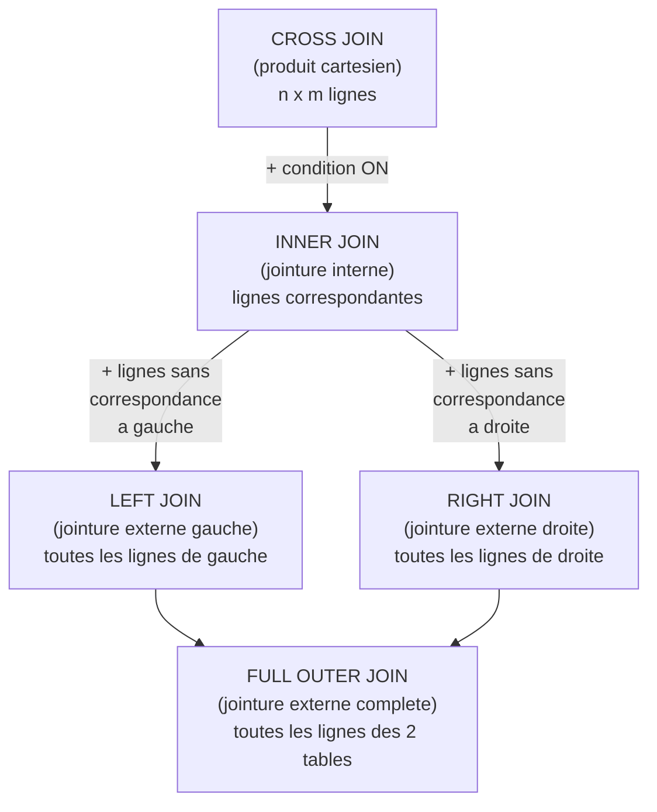
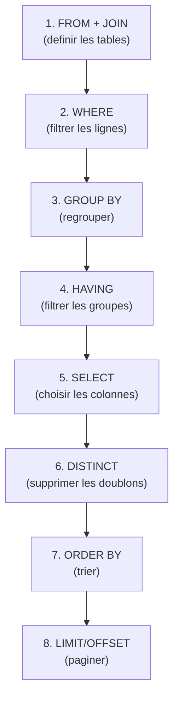
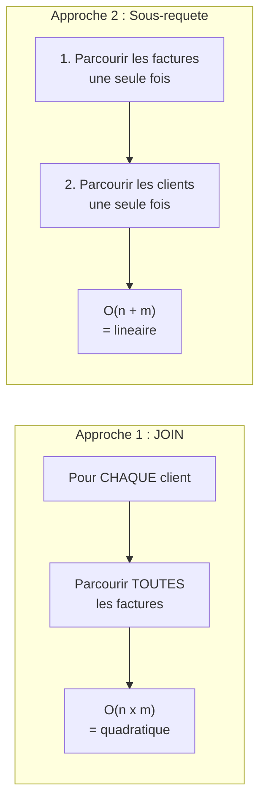

# Chapitre 4 -- SQL avance

> **Idee centrale en une phrase :** SQL avance, c'est savoir poser des questions complexes a ta base de donnees -- comme un detective qui croise plusieurs fichiers, filtre des suspects et calcule des statistiques pour resoudre une enquete.

**Prerequis :** [Modele relationnel](01_modele_relationnel.md)
**Chapitre suivant :** [XML ->](05_xml.md), [OLAP ->](06_olap.md), ou [NoSQL ->](07_nosql.md)

---

## 1. L'analogie de l'enquete policiere

### Pourquoi des requetes complexes ?

Imagine que tu es un detective. Tu as :
- Un fichier des **suspects** (nom, age, adresse)
- Un fichier des **temoignages** (qui a vu quoi, ou, quand)
- Un fichier des **preuves** (type, lieu, date)

Pour resoudre l'affaire, tu ne vas pas juste regarder un seul fichier. Tu vas :
1. **Croiser** les fichiers (jointures) : "quels suspects habitent pres du lieu du crime ?"
2. **Filtrer** (WHERE) : "parmi ceux-la, qui n'a pas d'alibi ?"
3. **Regrouper et compter** (GROUP BY, COUNT) : "combien de temoignages par suspect ?"
4. **Trier** (ORDER BY) : "classer les suspects du plus au moins suspect"
5. **Poser des sous-questions** (sous-requetes) : "quel suspect a le plus de connexions avec les preuves ?"

SQL avance, c'est exactement ca : combiner plusieurs operations pour extraire l'information pertinente de grandes quantites de donnees.

---

## 2. Les jointures en detail

### Schema visuel des types de jointures



### INNER JOIN (jointure interne)

Ne garde que les lignes **qui ont une correspondance** dans les deux tables.

```sql
-- Trouver le nom des clients et le montant de leurs factures
SELECT c.name, f.amount
FROM customer c
INNER JOIN facture f ON c.customerId = f.customerId;
```

**Resultat :** Seuls les clients qui ont au moins une facture apparaissent.

### LEFT JOIN (jointure externe gauche)

Garde **toutes les lignes** de la table de gauche, meme sans correspondance. Les colonnes de la table de droite sont NULL quand il n'y a pas de correspondance.

```sql
-- Tous les clients, meme ceux sans facture
SELECT c.name, f.amount
FROM customer c
LEFT JOIN facture f ON c.customerId = f.customerId;
```

**Resultat :** Tous les clients apparaissent. Ceux sans facture ont NULL dans la colonne amount.

**Cas d'usage classique :** Trouver les clients **sans** facture :

```sql
SELECT c.name
FROM customer c
LEFT JOIN facture f ON c.customerId = f.customerId
WHERE f.factureId IS NULL;
```

### CROSS JOIN (produit cartesien)

Combine **chaque ligne** d'une table avec **chaque ligne** de l'autre. Si A a 100 lignes et B a 50 lignes, le resultat a 5000 lignes.

```sql
-- Toutes les combinaisons etudiant-professeur
SELECT e.nom, p.nom
FROM etudiant e
CROSS JOIN professeur p;
-- Avec 73 etudiants et 25 profs : 1825 combinaisons
```

> **Attention :** Le CROSS JOIN est rarement utile tel quel. Si tu vois un `FROM table1, table2` sans WHERE, c'est un produit cartesien implicite -- generalement une erreur.

---

## 3. Sous-requetes

### Qu'est-ce qu'une sous-requete ?

Une sous-requete est une requete SQL **imbriquee** dans une autre. Le resultat de la sous-requete est utilise par la requete principale.

### Sous-requete dans le WHERE avec IN

La plus courante. "Trouve les X qui sont dans la liste Y."

```sql
-- Clients qui ont au moins une facture > 999 euros
SELECT name
FROM customer
WHERE customerId IN (
    SELECT customerId
    FROM facture
    WHERE amount > 999
);
```

**Comment ca marche :**
1. La sous-requete s'execute d'abord : elle retourne la liste des customerId avec une facture > 999.
2. La requete principale filtre les clients dont l'id est dans cette liste.

### Sous-requete avec EXISTS

EXISTS verifie si la sous-requete retourne **au moins une ligne**.

```sql
-- Clients qui ont au moins une facture (version EXISTS)
SELECT c.name
FROM customer c
WHERE EXISTS (
    SELECT 1
    FROM facture f
    WHERE f.customerId = c.customerId
);
```

**Difference IN vs EXISTS :**

| Critere | IN | EXISTS |
|---------|-----|--------|
| Utilisation | Liste de valeurs | Test d'existence |
| Sous-requete | S'execute une fois | S'execute pour chaque ligne |
| Performance | Meilleur si sous-requete petite | Meilleur si table externe petite |
| NULL | Problematique avec NOT IN | Gere correctement les NULL |

### Sous-requete dans le FROM

On peut utiliser une sous-requete comme une **table temporaire**.

```sql
-- Montant moyen des factures par client, pour les clients avec moyenne > 500
SELECT sub.name, sub.moyenne
FROM (
    SELECT c.name, AVG(f.amount) AS moyenne
    FROM customer c
    JOIN facture f ON c.customerId = f.customerId
    GROUP BY c.customerId, c.name
) sub
WHERE sub.moyenne > 500;
```

### Sous-requete scalaire (une seule valeur)

```sql
-- Clients dont le montant total depasse la moyenne globale
SELECT c.name, SUM(f.amount) AS total
FROM customer c
JOIN facture f ON c.customerId = f.customerId
GROUP BY c.customerId, c.name
HAVING SUM(f.amount) > (
    SELECT AVG(amount)
    FROM facture
);
```

---

## 4. Agregation et GROUP BY

### Les fonctions d'agregation

| Fonction | Description | Exemple |
|----------|-------------|---------|
| `COUNT(*)` | Nombre de lignes | Combien de commandes ? |
| `COUNT(col)` | Nombre de valeurs non-NULL | Combien de factures avec montant renseigne ? |
| `COUNT(DISTINCT col)` | Nombre de valeurs distinctes | Combien de clients differents ? |
| `SUM(col)` | Somme | Chiffre d'affaires total |
| `AVG(col)` | Moyenne | Montant moyen d'une facture |
| `MIN(col)` | Minimum | Plus petite facture |
| `MAX(col)` | Maximum | Plus grosse facture |

### GROUP BY : regrouper avant d'agreger

GROUP BY regroupe les lignes qui ont les memes valeurs pour les colonnes specifiees, puis applique les fonctions d'agregation sur chaque groupe.

```sql
-- Nombre de factures et montant total par client
SELECT c.name,
       COUNT(*) AS nb_factures,
       SUM(f.amount) AS total,
       AVG(f.amount) AS moyenne
FROM customer c
JOIN facture f ON c.customerId = f.customerId
GROUP BY c.customerId, c.name;
```

### HAVING : filtrer les groupes

HAVING est le WHERE des groupes. Il filtre **apres** le GROUP BY.

```sql
-- Clients avec plus de 5 factures
SELECT c.name, COUNT(*) AS nb_factures
FROM customer c
JOIN facture f ON c.customerId = f.customerId
GROUP BY c.customerId, c.name
HAVING COUNT(*) > 5;
```

### Ordre d'execution d'une requete SQL



> **Important :** L'ordre d'execution est different de l'ordre d'ecriture ! On ecrit `SELECT ... FROM ... WHERE ...` mais le SGBD execute `FROM -> WHERE -> GROUP BY -> HAVING -> SELECT -> ORDER BY`.

---

## 5. Performance et optimisation (du TP1)

### L'impact des index

Le TP1 du cours demontre l'impact spectaculaire des index sur la performance :

| Requete | Sans index | Avec index | Acceleration |
|---------|-----------|------------|-------------|
| Recherche par egalite (valeur existante) | 0.1-0.2s | 0.0001s | 1000x |
| Recherche par egalite (valeur inexistante) | 0.05-0.08s | 0.0001s | 800x |
| Recherche par intervalle (>) | 5-7s | 0.0004s | 15000x |

```sql
-- Creer un index (B+ tree)
CREATE INDEX demoIDX ON demo(code);

-- Verifier le plan d'execution
EXPLAIN QUERY PLAN SELECT * FROM demo WHERE code = 62518937;
-- Avant index : SCAN TABLE demo (O(n) - parcours lineaire)
-- Apres index : SEARCH TABLE demo USING INDEX demoIDX (O(log n))
```

### Comparaison des approches de requete

Le TP1 compare quatre facons de trouver les clients avec des factures > 999 euros :

```sql
-- Approche 1 : JOIN + WHERE (lente : O(n*m))
SELECT c.name
FROM customer c, facture f
WHERE f.customerId = c.customerId AND f.amount > 999;
-- Temps : ~200 secondes

-- Approche 2 : Sous-requete + IN (rapide : O(n+m))
SELECT name
FROM customer
WHERE customerId IN (
    SELECT f.customerId FROM facture f WHERE amount > 999
);
-- Temps : ~1 seconde (200x plus rapide !)

-- Approche 3 : NATURAL JOIN (tres lente : O(n*m) + overhead)
SELECT name
FROM (customer NATURAL JOIN facture)
WHERE amount > 999;
-- Temps : ~283 secondes

-- Approche 4 : Sous-requete avec JOIN interne (lente : O(n*m))
SELECT name
FROM customer
WHERE customerId IN (
    SELECT c.customerId
    FROM customer c, facture f
    WHERE c.customerId = f.customerId AND f.amount > 999
);
-- Temps : ~219 secondes
```

### Pourquoi l'approche 2 gagne ?



**Explication :**
- La sous-requete filtre d'abord les factures (1 seul parcours de la table facture).
- Le IN fait un simple test d'appartenance a un ensemble.
- Le JOIN classique fait un produit cartesien filtre, soit n * m operations.

### Index composite

```sql
-- Index sur plusieurs colonnes
CREATE INDEX IamSpeeed ON facture(customerId, amount);
-- Optimise les requetes qui filtrent par customerId ET/OU amount
```

**Quand creer un index :**

| Situation | Index recommande |
|-----------|------------------|
| Colonne dans WHERE avec = | Index simple |
| Colonne dans JOIN ... ON | Index simple |
| Colonnes dans WHERE avec = et > | Index composite (= d'abord, > ensuite) |
| Colonne dans ORDER BY | Index simple |
| Petite table (< 1000 lignes) | Pas necessaire |

---

## 6. Vues

### Qu'est-ce qu'une vue ?

Une vue est une **requete sauvegardee** sous un nom. Elle se comporte comme une table virtuelle.

```sql
-- Creer une vue des clients avec leur total de factures
CREATE VIEW vue_clients_totaux AS
SELECT c.customerId, c.name,
       COUNT(*) AS nb_factures,
       SUM(f.amount) AS total
FROM customer c
JOIN facture f ON c.customerId = f.customerId
GROUP BY c.customerId, c.name;

-- Utiliser la vue comme une table
SELECT name, total
FROM vue_clients_totaux
WHERE total > 10000
ORDER BY total DESC;
```

**Avantages :**
- Simplifier les requetes complexes
- Cacher la complexite du schema
- Restreindre l'acces aux donnees (securite)

---

## 7. Division en SQL

La division relationnelle est l'operation la plus complexe en SQL. Rappel : "Trouver les X qui sont en relation avec TOUS les Y."

### Methode du double NOT EXISTS

```sql
-- Quels etudiants sont inscrits a TOUS les cours ?
SELECT e.nom
FROM etudiant e
WHERE NOT EXISTS (
    -- Il n'existe pas de cours...
    SELECT ens.ensId
    FROM enseignement ens
    WHERE NOT EXISTS (
        -- ...auquel l'etudiant n'est pas inscrit
        SELECT *
        FROM enseignementSuivi es
        WHERE es.etudId = e.etudId
        AND es.ensId = ens.ensId
    )
);
```

### Methode par comptage (alternative)

```sql
-- Quels etudiants sont inscrits a TOUS les cours ?
SELECT e.nom
FROM etudiant e
JOIN enseignementSuivi es ON e.etudId = es.etudId
GROUP BY e.etudId, e.nom
HAVING COUNT(DISTINCT es.ensId) = (
    SELECT COUNT(*) FROM enseignement
);
```

> **Astuce :** La methode par comptage est souvent plus intuitive, mais elle suppose qu'il n'y a pas de doublons. Le double NOT EXISTS est plus rigoureux.

---

## 8. EXPLAIN QUERY PLAN

C'est ton meilleur outil pour comprendre les performances.

```sql
EXPLAIN QUERY PLAN
SELECT c.name
FROM customer c
JOIN facture f ON c.customerId = f.customerId
WHERE f.amount > 999;
```

**Lecture du resultat :**

| Terme dans le plan | Signification | Performance |
|---|---|---|
| SCAN TABLE | Parcours de toute la table | O(n) - lent |
| SEARCH TABLE ... USING INDEX | Recherche via un index | O(log n) - rapide |
| COVERING INDEX | L'index contient toutes les colonnes necessaires | Optimal |
| USING TEMPORARY B-TREE | Tri temporaire (ORDER BY ou DISTINCT) | Cout supplementaire |

---

## 9. Pieges classiques

### Piege 1 : NULL dans les comparaisons

```sql
-- ATTENTION : NULL n'est egal a rien, meme pas a lui-meme !
SELECT * FROM client WHERE adresse = NULL;     -- Ne retourne RIEN
SELECT * FROM client WHERE adresse IS NULL;    -- Correct !

-- NULL avec NOT IN est dangereux :
SELECT * FROM A WHERE x NOT IN (SELECT y FROM B);
-- Si un y est NULL, la requete retourne 0 resultat !
-- Solution : ajouter WHERE y IS NOT NULL dans la sous-requete
```

### Piege 2 : GROUP BY avec des colonnes manquantes

```sql
-- ERREUR : nom n'est pas dans GROUP BY ni dans une fonction d'agregation
SELECT customerId, name, COUNT(*)
FROM customer c JOIN facture f ON c.customerId = f.customerId
GROUP BY c.customerId;
-- En SQL standard, name doit etre dans GROUP BY (SQLite est permissif)
```

### Piege 3 : HAVING sans GROUP BY

HAVING sert a filtrer des **groupes**. Si tu veux filtrer des **lignes**, utilise WHERE.

```sql
-- MAUVAIS : utiliser HAVING pour filtrer des lignes
SELECT * FROM facture HAVING amount > 999;

-- CORRECT : utiliser WHERE
SELECT * FROM facture WHERE amount > 999;
```

### Piege 4 : Confusion WHERE vs HAVING

```sql
-- WHERE filtre AVANT le GROUP BY
-- HAVING filtre APRES le GROUP BY

SELECT customerId, AVG(amount) AS moy
FROM facture
WHERE amount > 0           -- Exclure les factures a 0 AVANT le regroupement
GROUP BY customerId
HAVING AVG(amount) > 500;  -- Garder les clients dont la MOYENNE > 500
```

### Piege 5 : NATURAL JOIN imprevisible

```sql
-- Dangereux : si les deux tables ont une colonne "nom" par hasard,
-- le NATURAL JOIN jointra dessus aussi
SELECT * FROM customer NATURAL JOIN facture;

-- Preferer toujours la jointure explicite
SELECT * FROM customer c JOIN facture f ON c.customerId = f.customerId;
```

### Piege 6 : Oublier DISTINCT

```sql
-- Peut retourner des doublons si un client a plusieurs factures > 999
SELECT c.name
FROM customer c JOIN facture f ON c.customerId = f.customerId
WHERE f.amount > 999;

-- Solution
SELECT DISTINCT c.name
FROM customer c JOIN facture f ON c.customerId = f.customerId
WHERE f.amount > 999;
```

---

## 10. Recapitulatif

| Concept | Description | Syntaxe |
|---------|-------------|---------|
| **INNER JOIN** | Lignes correspondantes des 2 tables | `A JOIN B ON A.id = B.id` |
| **LEFT JOIN** | Toutes les lignes de gauche + correspondances | `A LEFT JOIN B ON ...` |
| **CROSS JOIN** | Produit cartesien (n x m) | `A CROSS JOIN B` |
| **Sous-requete IN** | Filtrer par une liste de valeurs | `WHERE x IN (SELECT ...)` |
| **Sous-requete EXISTS** | Tester l'existence d'un resultat | `WHERE EXISTS (SELECT ...)` |
| **GROUP BY** | Regrouper pour agreger | `GROUP BY col1, col2` |
| **HAVING** | Filtrer les groupes (apres GROUP BY) | `HAVING COUNT(*) > 5` |
| **Index** | Accelerer les recherches (B+ tree) | `CREATE INDEX idx ON t(col)` |
| **EXPLAIN** | Analyser le plan d'execution | `EXPLAIN QUERY PLAN SELECT ...` |
| **Vue** | Requete sauvegardee comme table virtuelle | `CREATE VIEW v AS SELECT ...` |
| **Division** | Trouver X en relation avec TOUS les Y | `NOT EXISTS (... NOT EXISTS ...)` |

> **A retenir :** La performance d'une requete depend autant de **comment** on l'ecrit que de **ce qu'on demande**. Une sous-requete avec IN peut etre 200x plus rapide qu'un JOIN pour le meme resultat. Utilise EXPLAIN QUERY PLAN pour comprendre et optimiser tes requetes.
