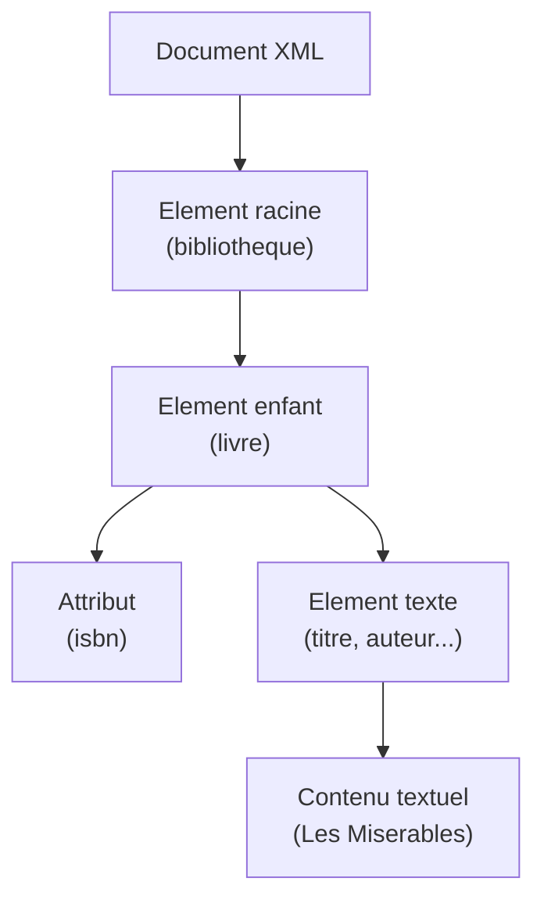
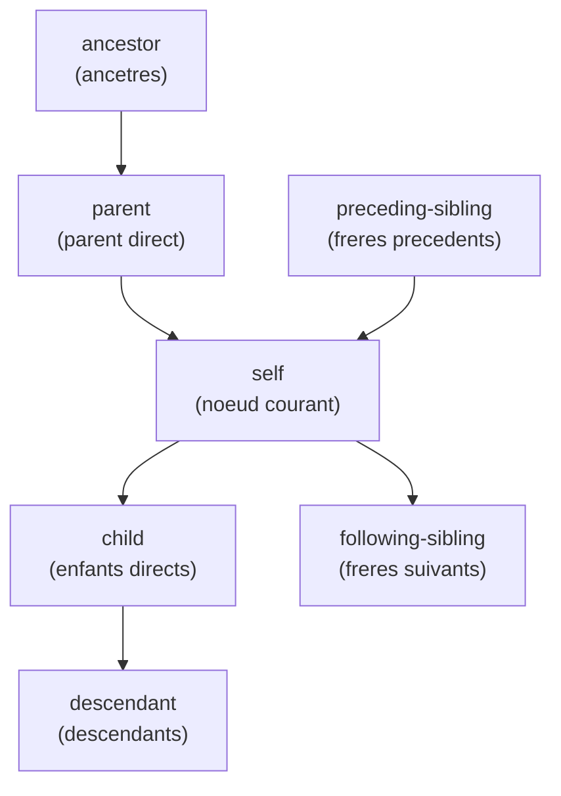

# Chapitre 5 -- XML et XQuery

> **Idee centrale en une phrase :** XML est un format qui permet de stocker des donnees en les organisant comme un arbre genealogique -- chaque information est emboitee dans une autre, et XQuery est le langage pour interroger cet arbre.

**Prerequis :** [SQL avance](04_sql_avance.md)
**Chapitre suivant :** [OLAP ->](06_olap.md) ou [NoSQL ->](07_nosql.md)

---

## 1. L'analogie de l'arbre genealogique

### Pourquoi des donnees hierarchiques ?

Imagine un arbre genealogique. Chaque personne a des enfants, qui ont eux-memes des enfants. L'information est **imbriquee** : pour comprendre une branche, tu dois savoir qui est le parent de qui.

Les bases de donnees relationnelles stockent tout dans des tableaux plats (lignes et colonnes). Mais certaines donnees sont naturellement **hierarchiques** :

- Un livre a des chapitres, qui ont des sections, qui ont des paragraphes
- Un pays a des regions, qui ont des villes, qui ont des quartiers
- Une commande a des articles, qui ont des options

XML represente ces donnees sous forme d'**arbre** : chaque element peut contenir d'autres elements, a l'infini.

### Donnees relationnelles vs XML

| Aspect | Relationnel (SQL) | XML |
|--------|-------------------|-----|
| Structure | Tableaux plats (lignes/colonnes) | Arbre hierarchique |
| Schema | Rigide (defini a l'avance) | Flexible (semi-structure) |
| Interrogation | SQL | XQuery / XPath |
| Cas d'usage | Donnees structurees | Documents, configs, echanges |

---

## 2. La syntaxe XML

### Structure de base

```xml
<?xml version="1.0" encoding="UTF-8"?>
<!-- Ceci est un commentaire -->
<bibliotheque>
    <livre isbn="978-2-01-123456-7">
        <titre>Les Miserables</titre>
        <auteur>
            <prenom>Victor</prenom>
            <nom>Hugo</nom>
        </auteur>
        <annee>1862</annee>
        <prix devise="EUR">12.50</prix>
    </livre>
    <livre isbn="978-2-07-036822-8">
        <titre>Le Petit Prince</titre>
        <auteur>
            <prenom>Antoine</prenom>
            <nom>de Saint-Exupery</nom>
        </auteur>
        <annee>1943</annee>
        <prix devise="EUR">8.90</prix>
    </livre>
</bibliotheque>
```

### Vocabulaire



| Terme | Definition | Exemple |
|-------|-----------|---------|
| **Element** | Balise ouvrante + contenu + balise fermante | `<titre>Les Miserables</titre>` |
| **Attribut** | Information attachee a une balise | `isbn="978-..."` |
| **Element racine** | L'element qui contient tous les autres | `<bibliotheque>` |
| **Element vide** | Balise sans contenu | `<br/>` |
| **Texte** | Contenu textuel d'un element | "Les Miserables" |
| **Noeud** | Tout element de l'arbre (element, texte, attribut) | -- |

### Regles de bonne formation (well-formed)

Un document XML est **bien forme** s'il respecte ces regles :

1. **Une seule racine** : un seul element englobant tout le document.
2. **Balises correctement imbriquees** : `<a><b></b></a>` et non `<a><b></a></b>`.
3. **Balises fermees** : chaque `<tag>` a un `</tag>` (ou `<tag/>`).
4. **Attributs entre guillemets** : `isbn="..."` et non `isbn=...`.
5. **Noms sensibles a la casse** : `<Livre>` et `<livre>` sont differents.

---

## 3. DTD (Document Type Definition)

La DTD definit la **grammaire** d'un document XML : quels elements sont autorises, dans quel ordre, avec quels attributs.

### Exemple de DTD

```xml
<!DOCTYPE bibliotheque [
    <!ELEMENT bibliotheque (livre+)>
    <!ELEMENT livre (titre, auteur, annee, prix)>
    <!ELEMENT titre (#PCDATA)>
    <!ELEMENT auteur (prenom, nom)>
    <!ELEMENT prenom (#PCDATA)>
    <!ELEMENT nom (#PCDATA)>
    <!ELEMENT annee (#PCDATA)>
    <!ELEMENT prix (#PCDATA)>

    <!ATTLIST livre isbn CDATA #REQUIRED>
    <!ATTLIST prix devise CDATA #IMPLIED>
]>
```

### Syntaxe des declarations

| Declaration | Signification | Exemple |
|-------------|---------------|---------|
| `(A, B, C)` | A suivi de B suivi de C (ordre strict) | `(titre, auteur, annee)` |
| `(A \| B)` | A ou B (choix) | `(article \| livre)` |
| `A+` | A une ou plusieurs fois | `livre+` (au moins un livre) |
| `A*` | A zero ou plusieurs fois | `commentaire*` (optionnel, peut etre multiple) |
| `A?` | A zero ou une fois | `soustitre?` (optionnel) |
| `#PCDATA` | Texte brut | `<!ELEMENT titre (#PCDATA)>` |
| `EMPTY` | Element vide | `<!ELEMENT br EMPTY>` |
| `ANY` | N'importe quel contenu | `<!ELEMENT note ANY>` |

### Attributs dans la DTD

| Type | Signification |
|------|---------------|
| `CDATA` | Chaine de caracteres quelconque |
| `ID` | Identifiant unique dans le document |
| `IDREF` | Reference a un ID existant |
| `IDREFS` | Liste de references a des ID |
| `#REQUIRED` | Attribut obligatoire |
| `#IMPLIED` | Attribut optionnel |
| `#FIXED "valeur"` | Attribut avec valeur fixe |

### ID et IDREF : les "cles etrangeres" de XML

```xml
<!ATTLIST etudiant eid ID #REQUIRED>
<!ATTLIST inscription etud IDREF #REQUIRED>
```

```xml
<universite>
    <etudiant eid="E1">
        <nom>Alice</nom>
    </etudiant>
    <inscription etud="E1" cours="BD"/>
    <!-- etud="E1" reference l'etudiant avec eid="E1" -->
</universite>
```

> **Analogie :** ID/IDREF en XML, c'est comme PK/FK en relationnel. L'ID identifie de facon unique, l'IDREF pointe vers un ID existant.

---

## 4. XPath : naviguer dans l'arbre

XPath est un langage pour **selectionner des noeuds** dans un arbre XML. C'est comme le systeme de chemins de fichiers sur ton ordinateur.

### Syntaxe de base

| Expression | Signification | Exemple |
|---|---|---|
| `/` | Racine du document | `/bibliotheque` |
| `/A/B` | B enfant direct de A | `/bibliotheque/livre` |
| `//B` | B n'importe ou dans l'arbre | `//titre` (tous les titres) |
| `.` | Noeud courant | `.` |
| `..` | Noeud parent | `../titre` |
| `@attr` | Attribut | `@isbn` |
| `*` | Tout element | `/bibliotheque/*` |
| `[condition]` | Predicat (filtre) | `livre[@isbn='978-...']` |

### Exemples concrets

En partant de notre document XML de bibliotheque :

```
/bibliotheque/livre                  --> tous les elements <livre>
/bibliotheque/livre/titre            --> tous les <titre> des livres
/bibliotheque/livre[1]               --> le premier livre
/bibliotheque/livre[last()]          --> le dernier livre
//auteur/nom                         --> tous les noms d'auteurs (n'importe ou)
/bibliotheque/livre[@isbn]           --> livres qui ont un attribut isbn
/bibliotheque/livre[annee > 1900]    --> livres publies apres 1900
//livre[prix < 10]/titre             --> titres des livres a moins de 10
```

### Axes de navigation



---

## 5. XQuery : interroger du XML

XQuery est le **SQL de XML**. Il permet d'interroger, transformer et creer des documents XML.

### La structure FLWOR

FLWOR (prononce "flower") est l'equivalent du SELECT-FROM-WHERE :

| XQuery (FLWOR) | SQL equivalent |
|----------------|----------------|
| **F**or | FROM |
| **L**et | (variable intermediaire) |
| **W**here | WHERE |
| **O**rder by | ORDER BY |
| **R**eturn | SELECT |

### Exemples

**Exemple 1 : Lister les titres**

```xquery
for $livre in doc("bibliotheque.xml")//livre
return $livre/titre
```

Equivalent SQL : `SELECT titre FROM livre;`

**Exemple 2 : Filtrer par annee**

```xquery
for $livre in doc("bibliotheque.xml")//livre
where $livre/annee > 1900
return <resultat>
    <titre>{ $livre/titre/text() }</titre>
    <auteur>{ $livre/auteur/nom/text() }</auteur>
</resultat>
```

Equivalent SQL : `SELECT titre, nom_auteur FROM livre WHERE annee > 1900;`

**Exemple 3 : Trier et limiter**

```xquery
for $livre in doc("bibliotheque.xml")//livre
order by $livre/prix descending
return $livre/titre
```

Equivalent SQL : `SELECT titre FROM livre ORDER BY prix DESC;`

**Exemple 4 : Agregation**

```xquery
let $livres := doc("bibliotheque.xml")//livre
return <stats>
    <nombre>{ count($livres) }</nombre>
    <prix_moyen>{ avg($livres/prix) }</prix_moyen>
    <prix_max>{ max($livres/prix) }</prix_max>
</stats>
```

**Exemple 5 : Jointure (deux documents)**

```xquery
for $auteur in doc("auteurs.xml")//auteur
for $livre in doc("bibliotheque.xml")//livre
where $auteur/nom = $livre/auteur/nom
return <publication>
    <ecrivain>{ $auteur/nom/text() }</ecrivain>
    <oeuvre>{ $livre/titre/text() }</oeuvre>
</publication>
```

### Fonctions XQuery utiles

| Fonction | Description | Exemple |
|----------|-------------|---------|
| `count()` | Nombre d'elements | `count(//livre)` |
| `sum()` | Somme | `sum(//prix)` |
| `avg()` | Moyenne | `avg(//prix)` |
| `min()`, `max()` | Min et max | `max(//annee)` |
| `string-length()` | Longueur d'une chaine | `string-length(//titre)` |
| `contains()` | Test de sous-chaine | `contains(titre, "Prince")` |
| `distinct-values()` | Valeurs uniques | `distinct-values(//auteur/nom)` |
| `text()` | Contenu textuel d'un noeud | `$livre/titre/text()` |

---

## 6. Conversion relationnel <-> XML

### Du relationnel vers XML

Une table relationnelle peut se representer en XML :

```sql
-- Table relationnelle
-- Etudiant(etudId, nom, prenom)
-- Valeurs : (E1, Dupont, Alice), (E2, Martin, Bob)
```

```xml
<!-- Equivalent XML -->
<etudiants>
    <etudiant etudId="E1">
        <nom>Dupont</nom>
        <prenom>Alice</prenom>
    </etudiant>
    <etudiant etudId="E2">
        <nom>Martin</nom>
        <prenom>Bob</prenom>
    </etudiant>
</etudiants>
```

### Choix de conception : attribut vs element ?

| Critere | Utiliser un attribut | Utiliser un element |
|---------|---------------------|---------------------|
| Donnee simple (id, code) | Oui | Possible |
| Donnee complexe (adresse) | Non | Oui |
| Donnee avec sous-structure | Non | Oui |
| Identifiant unique | Oui (ID) | Non |
| Donnee optionnelle | Oui (#IMPLIED) | Oui |

---

## 7. Pieges classiques

### Piege 1 : Oublier la racine unique

```xml
<!-- INVALIDE : deux racines -->
<livre>...</livre>
<livre>...</livre>

<!-- VALIDE : une seule racine -->
<bibliotheque>
    <livre>...</livre>
    <livre>...</livre>
</bibliotheque>
```

### Piege 2 : Confondre XPath / et //

- `/bibliotheque/livre` : les `<livre>` enfants **directs** de `<bibliotheque>`
- `//livre` : les `<livre>` **n'importe ou** dans l'arbre (peut inclure des sous-elements nommes "livre")

### Piege 3 : Oublier text() dans XQuery

```xquery
<!-- Retourne l'element entier avec ses balises -->
return $livre/titre

<!-- Retourne uniquement le texte -->
return $livre/titre/text()
```

### Piege 4 : Confondre ID et IDREF dans la DTD

- `ID` est l'identifiant **unique** (comme une cle primaire)
- `IDREF` est la **reference** (comme une cle etrangere)
- Un `IDREF` doit pointer vers un `ID` existant dans le meme document

### Piege 5 : Accolades dans XQuery

En XQuery, les `{ }` sont utilises pour **evaluer** une expression a l'interieur d'un element XML construit.

```xquery
<!-- Sans accolades : texte literal -->
return <titre>$livre/titre/text()</titre>
<!-- Resultat : <titre>$livre/titre/text()</titre>  (le texte brut !) -->

<!-- Avec accolades : expression evaluee -->
return <titre>{ $livre/titre/text() }</titre>
<!-- Resultat : <titre>Les Miserables</titre> -->
```

---

## 8. Recapitulatif

| Concept | Description |
|---------|-------------|
| **XML** | Format de donnees hierarchique (arbre) |
| **Element** | Balise ouvrante + contenu + balise fermante |
| **Attribut** | Information attachee a une balise (`cle="valeur"`) |
| **DTD** | Grammaire definissant la structure du document |
| **ID/IDREF** | Mecanisme de reference (comme PK/FK) |
| **XPath** | Langage de navigation dans l'arbre XML |
| **XQuery FLWOR** | For-Let-Where-Order-Return (comme SELECT-FROM-WHERE) |
| **text()** | Extraire le contenu textuel d'un noeud |
| **Well-formed** | Document syntaxiquement correct (balises fermees, une racine) |
| **Valid** | Document conforme a une DTD ou un schema |

> **A retenir :** XML est utile pour les donnees hierarchiques et semi-structurees. XPath permet de naviguer dans l'arbre, XQuery permet de l'interroger. La DTD definit la structure attendue du document. Penser a XML comme une alternative au relationnel quand les donnees sont naturellement arborescentes.
