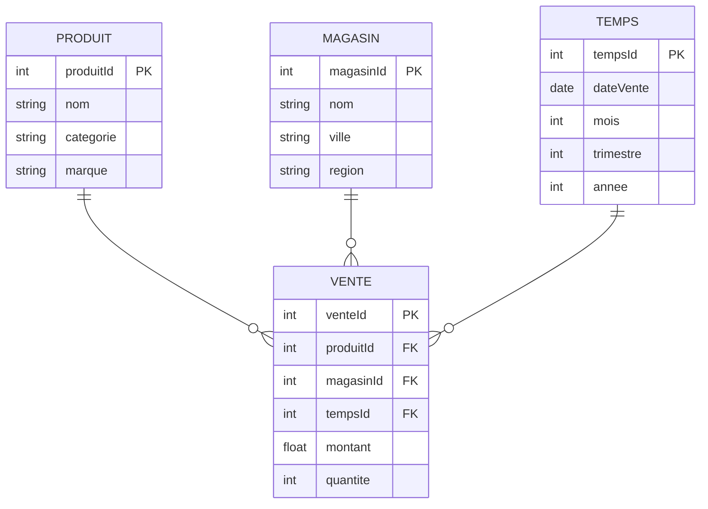
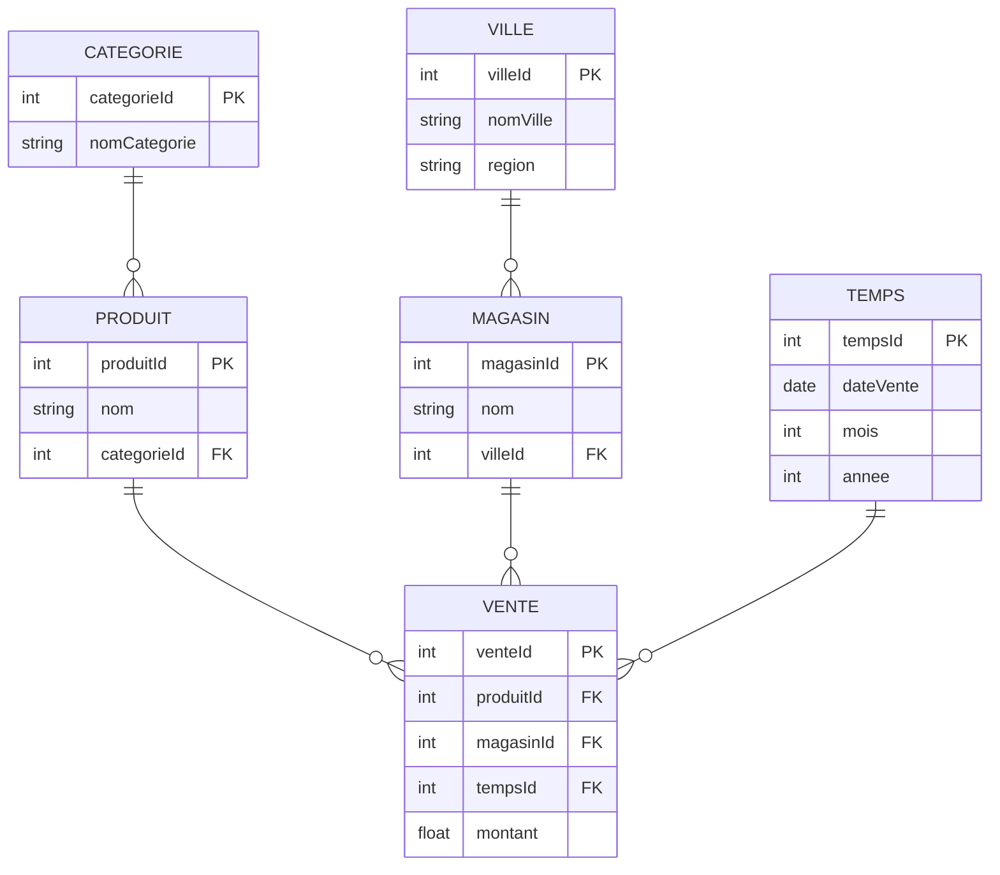
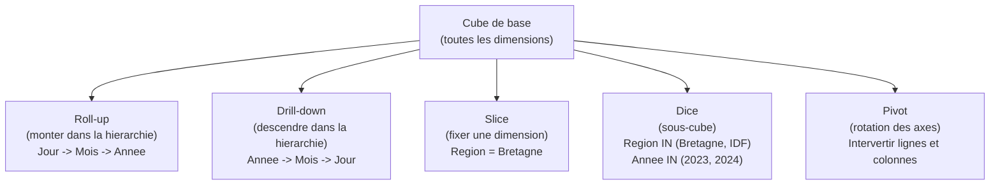
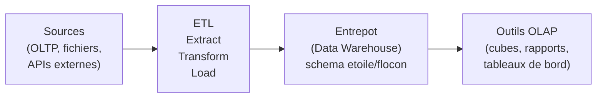

# Chapitre 6 -- OLAP (Analyse multidimensionnelle)

> **Idee centrale en une phrase :** OLAP, c'est comme regarder un Rubik's Cube de donnees -- tu peux le tourner dans tous les sens pour analyser les ventes par produit, par region, par mois, ou tout ca en meme temps.

**Prerequis :** [SQL avance](04_sql_avance.md)
**Chapitre suivant :** [NoSQL ->](07_nosql.md)

---

## 1. L'analogie du tableau croise dynamique

### Pourquoi OLAP ?

Imagine que tu es le directeur d'une chaine de magasins. Tu as des millions de lignes de ventes. Tu veux savoir :

- "Quel est le chiffre d'affaires par region ?"
- "Quels produits se vendent le mieux en decembre ?"
- "Comment les ventes evoluent trimestre par trimestre ?"
- "Quel magasin performe le moins bien sur les chaussures ?"

Tu pourrais ecrire des requetes SQL avec GROUP BY, mais :
- Chaque question necessite une requete differente
- Les requetes sont lentes sur des millions de lignes
- Tu veux pouvoir **naviguer** dans les donnees de facon interactive

OLAP (OnLine Analytical Processing) propose un modele de donnees en **cube** qui permet de repondre a toutes ces questions rapidement en **pre-calculant** les agregations.

### OLTP vs OLAP

| Critere | OLTP (operationnel) | OLAP (analytique) |
|---------|---------------------|-------------------|
| Usage | Operations quotidiennes | Analyse et reporting |
| Requetes | INSERT, UPDATE, DELETE | SELECT avec agregations |
| Utilisateurs | Employes, applications | Managers, analystes |
| Donnees | Actuelles | Historiques |
| Volume par requete | Quelques lignes | Millions de lignes |
| Optimisation | Temps de reponse, concurrence | Debit de lecture, agregation |
| Schema | 3NF (normalise) | Etoile/flocon (denormalise) |

---

## 2. Le modele en etoile

### Concept central : faits et dimensions



### Table de faits

La **table de faits** est la table centrale. Elle contient :
- Les **mesures** (ce qu'on veut analyser) : montant, quantite, cout...
- Les **cles etrangeres** vers les dimensions : produitId, magasinId, tempsId...

Chaque ligne de la table de faits represente un **evenement mesurable** (une vente, une visite, une transaction...).

### Tables de dimensions

Les **tables de dimensions** contiennent les **axes d'analyse** : par quoi on veut regrouper les donnees.

| Dimension | Hierarchie | Exemple |
|-----------|-----------|---------|
| Temps | Jour -> Mois -> Trimestre -> Annee | 15/03/2024 -> Mars -> T1 -> 2024 |
| Produit | Produit -> Sous-categorie -> Categorie | Nike Air -> Chaussures sport -> Chaussures |
| Geographie | Magasin -> Ville -> Region -> Pays | INSA Shop -> Rennes -> Bretagne -> France |

### Schema en flocon (snowflake)

Le schema en flocon est une variante ou les dimensions sont elles-memes **normalisees** (decomposees en sous-tables).



| Schema | Avantage | Inconvenient |
|--------|----------|-------------|
| **Etoile** | Requetes simples (moins de jointures) | Redondance dans les dimensions |
| **Flocon** | Pas de redondance | Requetes plus complexes (plus de jointures) |

---

## 3. Le cube de donnees

### Concept

Un **cube OLAP** est une representation multidimensionnelle des donnees. Chaque **dimension** est un axe du cube, et chaque **cellule** contient une mesure agregee.

```
                    Produit
                   /
                  /
    Temps ------+------- Mesure (montant)
                  \
                   \
                    Region
```

Avec 3 dimensions (Temps, Produit, Region), on peut voir les donnees sous n'importe quel angle :
- Montant par Produit et Region (une tranche du cube)
- Montant par Temps et Produit (une autre tranche)
- Montant total par Region (une projection)

### Operations sur le cube



| Operation | Description | Analogie |
|-----------|-------------|----------|
| **Roll-up** | Agreger a un niveau superieur | Zoomer en arriere : villes -> regions |
| **Drill-down** | Detailler a un niveau inferieur | Zoomer en avant : regions -> villes |
| **Slice** | Couper une tranche du cube (fixer une dimension) | Regarder une seule page du calendrier |
| **Dice** | Selectionner un sous-cube (filtrer plusieurs dimensions) | Decouper un morceau du cube |
| **Pivot** | Tourner le cube (echanger les axes) | Tourner le tableau croise |

---

## 4. SQL pour OLAP

### GROUP BY classique

```sql
-- Chiffre d'affaires par region
SELECT m.region, SUM(v.montant) AS ca
FROM vente v
JOIN magasin m ON v.magasinId = m.magasinId
GROUP BY m.region;
```

### GROUP BY ROLLUP

ROLLUP calcule les sous-totaux **hierarchiquement** et le total general.

```sql
-- CA par region et ville, avec sous-totaux par region et total general
SELECT m.region, m.ville, SUM(v.montant) AS ca
FROM vente v
JOIN magasin m ON v.magasinId = m.magasinId
GROUP BY ROLLUP(m.region, m.ville);
```

**Resultat :**

| region | ville | ca |
|--------|-------|----|
| Bretagne | Rennes | 50000 |
| Bretagne | Brest | 30000 |
| Bretagne | NULL | 80000 |
| IDF | Paris | 120000 |
| IDF | Versailles | 40000 |
| IDF | NULL | 160000 |
| NULL | NULL | 240000 |

Les lignes avec NULL sont les **sous-totaux** (par region) et le **total general** (tout NULL).

### GROUP BY CUBE

CUBE calcule les agregations pour **toutes les combinaisons** possibles de dimensions.

```sql
-- CA pour toutes les combinaisons de region et categorie
SELECT m.region, p.categorie, SUM(v.montant) AS ca
FROM vente v
JOIN magasin m ON v.magasinId = m.magasinId
JOIN produit p ON v.produitId = p.produitId
GROUP BY CUBE(m.region, p.categorie);
```

**Resultat :** En plus de ce que ROLLUP donne, CUBE ajoute aussi les totaux **par categorie** (region = NULL, categorie = valeur).

### Difference ROLLUP vs CUBE

| | ROLLUP(A, B) | CUBE(A, B) |
|---|---|---|
| GROUP BY (A, B) | Oui | Oui |
| GROUP BY (A) -- sous-total A | Oui | Oui |
| GROUP BY (B) -- sous-total B | **Non** | Oui |
| Total general () | Oui | Oui |
| Nombre de groupes | n + 1 | 2^n |

Avec 2 dimensions : ROLLUP donne 3 niveaux, CUBE donne 4 niveaux.

### GROUPING SETS

Permet de specifier **exactement** quels regroupements on veut.

```sql
-- Seulement le CA par region et le CA par categorie (pas les deux ensemble)
SELECT m.region, p.categorie, SUM(v.montant) AS ca
FROM vente v
JOIN magasin m ON v.magasinId = m.magasinId
JOIN produit p ON v.produitId = p.produitId
GROUP BY GROUPING SETS (
    (m.region),
    (p.categorie)
);
```

### Fonction GROUPING()

La fonction `GROUPING()` permet de distinguer un vrai NULL (donnee manquante) d'un NULL de sous-total.

```sql
SELECT
    m.region,
    p.categorie,
    SUM(v.montant) AS ca,
    GROUPING(m.region) AS is_total_region,
    GROUPING(p.categorie) AS is_total_categorie
FROM vente v
JOIN magasin m ON v.magasinId = m.magasinId
JOIN produit p ON v.produitId = p.produitId
GROUP BY CUBE(m.region, p.categorie);
```

- `GROUPING(col) = 0` : c'est une valeur reelle (ou un vrai NULL)
- `GROUPING(col) = 1` : c'est un NULL de sous-total/total

---

## 5. Entrepot de donnees (Data Warehouse)

### Architecture ETL



| Etape | Description | Exemple |
|-------|-------------|---------|
| **Extract** | Recuperer les donnees des sources | Lire les bases OLTP, fichiers CSV |
| **Transform** | Nettoyer, standardiser, agreger | Corriger les formats de date, fusionner les doublons |
| **Load** | Charger dans l'entrepot | Inserer dans les tables de faits et dimensions |

### Contraintes specifiques

- **Donnees historiques** : on ne supprime pas, on ajoute (append-only)
- **Chargement periodique** : les donnees sont rafraichies par batch (quotidien, hebdomadaire)
- **Denormalisation** : les tables de dimensions sont souvent en 2NF/1NF pour eviter les jointures
- **Volumes massifs** : des milliards de lignes dans la table de faits

---

## 6. Pieges classiques

### Piege 1 : Confondre OLTP et OLAP

- **OLTP** : systeme operationnel (inserer une commande, modifier un stock)
- **OLAP** : systeme analytique (quel est le CA par region et par mois ?)

On ne fait pas d'OLAP sur une base OLTP : les requetes analytiques bloqueraient les operations courantes.

### Piege 2 : Confondre ROLLUP et CUBE

ROLLUP respecte l'ordre des colonnes (hierarchie), CUBE donne toutes les combinaisons. Avec 3 dimensions A, B, C :
- ROLLUP(A, B, C) : 4 niveaux (ABC, AB, A, total)
- CUBE(A, B, C) : 8 niveaux (ABC, AB, AC, BC, A, B, C, total)

### Piege 3 : NULL ambigus dans ROLLUP/CUBE

Les sous-totaux utilisent NULL pour marquer les dimensions agregees, ce qui peut se confondre avec de vrais NULL dans les donnees. Utiliser `GROUPING()` pour distinguer les deux.

### Piege 4 : Schema etoile vs flocon

- **Etoile** : dimensions denormalisees (une seule table par dimension)
- **Flocon** : dimensions normalisees (sous-tables)
- En pratique, l'etoile est souvent preferee car les requetes sont plus simples.

### Piege 5 : Penser que OLAP = SQL avec GROUP BY

SQL avec GROUP BY est la base, mais un vrai systeme OLAP inclut :
- Pre-calcul des agregats (cube materialise)
- Navigation interactive (drill-down, roll-up)
- Optimisations specifiques (index bitmap, partitionnement)

---

## 7. Recapitulatif

| Concept | Description |
|---------|-------------|
| **OLAP** | Analyse multidimensionnelle des donnees |
| **OLTP** | Traitement transactionnel operationnel |
| **Table de faits** | Table centrale avec les mesures (montant, quantite...) |
| **Table de dimensions** | Tables d'axes d'analyse (temps, produit, lieu...) |
| **Schema en etoile** | Faits au centre, dimensions autour (denormalisees) |
| **Schema en flocon** | Comme l'etoile, mais dimensions normalisees |
| **Roll-up** | Agreger a un niveau superieur dans la hierarchie |
| **Drill-down** | Detailler a un niveau inferieur |
| **Slice** | Fixer une dimension (couper une tranche) |
| **Dice** | Selectionner un sous-cube (filtrer plusieurs dimensions) |
| **Pivot** | Echanger les axes d'analyse |
| **ROLLUP** | GROUP BY hierarchique avec sous-totaux |
| **CUBE** | GROUP BY avec toutes les combinaisons de sous-totaux |
| **GROUPING()** | Distinguer les vrais NULL des NULL de sous-total |
| **ETL** | Extract-Transform-Load (alimentation de l'entrepot) |

> **A retenir :** OLAP est complementaire du relationnel. On utilise le modele en etoile (faits + dimensions) pour analyser de grands volumes de donnees historiques. Les operations ROLLUP et CUBE en SQL permettent de calculer des sous-totaux a differents niveaux d'agregation. Ne pas confondre OLTP (operations quotidiennes) et OLAP (analyse strategique).
