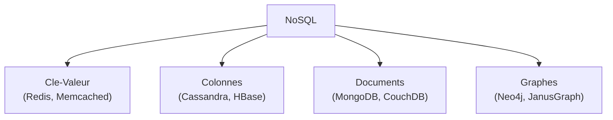
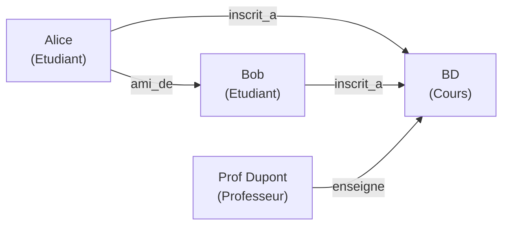
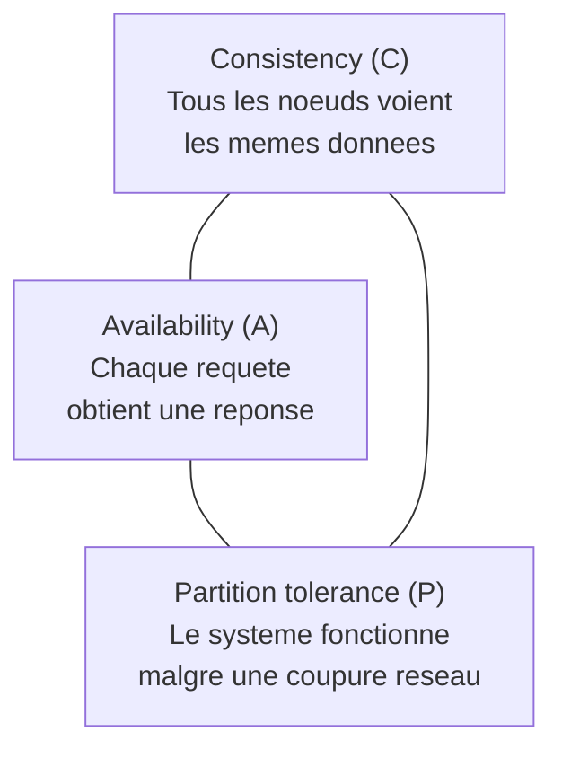
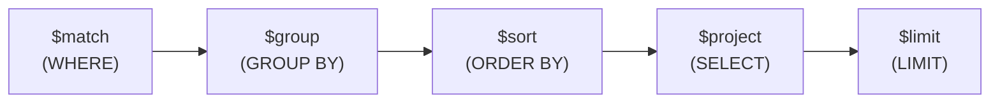

# Chapitre 7 -- NoSQL

> **Idee centrale en une phrase :** NoSQL, c'est un ensemble de bases de donnees concues pour les cas ou le modele relationnel classique atteint ses limites -- trop de donnees, trop de serveurs, ou des structures qui ne rentrent pas dans des tableaux.

**Prerequis :** [SQL avance](04_sql_avance.md)

---

## 1. L'analogie de la bibliotheque geante

### Pourquoi le relationnel ne suffit pas toujours ?

Imagine une bibliotheque de quartier. Les livres sont ranges par genre (Fiction, Sciences, Histoire...), chaque etagere est numerotee, et un catalogue central permet de tout retrouver. C'est efficace pour une petite bibliotheque.

Maintenant, imagine la **Bibliotheque nationale de France** avec 40 millions de documents. Le systeme de catalogue unique devient un goulot d'etranglement : tout le monde attend pour consulter le meme catalogue. Si une etagere est pleine, il faut tout reorganiser.

Les bases NoSQL proposent des solutions differentes selon le probleme :

| Probleme | Solution NoSQL | Analogie |
|----------|---------------|----------|
| Trop de donnees pour un seul serveur | Distribution (sharding) | Plusieurs bibliotheques reparties en ville |
| Donnees de structure variable | Documents flexibles | Chaque livre a sa propre fiche de description |
| Relations complexes entre entites | Graphes | Plan des connexions entre personnes |
| Acces tres rapide par cle | Cle-valeur | Casier avec un numero, tu ouvres et tu prends |

---

## 2. Les 4 familles NoSQL



### 2.1 Cle-Valeur

Le modele le plus simple : chaque donnee est une **paire (cle, valeur)**.

| Cle | Valeur |
|-----|--------|
| `user:1234` | `{"nom": "Alice", "age": 25}` |
| `session:abc` | `{"token": "xyz", "expire": "2024-12-31"}` |
| `compteur:visites` | `42857` |

**Caracteristiques :**
- Extremement rapide (acces en O(1))
- Pas de requete complexe (juste GET/SET par cle)
- Ideal pour : cache, sessions, compteurs

**Exemple Redis :**

```
SET user:1234 '{"nom": "Alice", "age": 25}'
GET user:1234
```

### 2.2 Colonnes (Column-family)

Les donnees sont stockees **par colonne** plutot que par ligne. Chaque "ligne" peut avoir un nombre different de colonnes.

**Exemple Cassandra :**

```
Ligne "alice" :
    nom: "Alice Dupont"
    email: "alice@mail.com"
    age: 25
    ville: "Rennes"

Ligne "bob" :
    nom: "Bob Martin"
    email: "bob@mail.com"
    telephone: "0612345678"
    -- (pas de colonne age ni ville !)
```

**Caracteristiques :**
- Tres efficace pour les agregations sur une colonne
- Scalable horizontalement (ajout de serveurs)
- Pas de jointures
- Ideal pour : logs, series temporelles, donnees massives

### 2.3 Documents

Chaque enregistrement est un **document** (JSON, BSON). Les documents peuvent avoir des structures differentes dans la meme collection.

**Exemple MongoDB :**

```json
// Collection "etudiants"
{
    "_id": "E001",
    "nom": "Alice Dupont",
    "age": 22,
    "cours": ["BD", "Algo", "Reseaux"],
    "adresse": {
        "rue": "3 rue de la Paix",
        "ville": "Rennes",
        "cp": "35000"
    }
}

{
    "_id": "E002",
    "nom": "Bob Martin",
    "age": 23,
    "cours": ["BD", "Systemes"],
    "stage": {
        "entreprise": "Google",
        "duree": "6 mois"
    }
    // Pas de champ "adresse", mais un champ "stage" en plus
}
```

**Caracteristiques :**
- Schema flexible (chaque document peut etre different)
- Documents imbriques (pas besoin de jointures)
- Requetes riches (filtres, agregations)
- Ideal pour : catalogues, profils utilisateurs, CMS

### 2.4 Graphes

Les donnees sont modelisees comme des **noeuds** (entites) et des **aretes** (relations entre entites).



**Caracteristiques :**
- Optimise pour les traversees de graphe (amis des amis, chemin le plus court)
- Performant meme avec des millions de relations
- Ideal pour : reseaux sociaux, recommandations, detection de fraude

---

## 3. Le theoreme CAP

### Enonce

Dans un systeme distribue, il est **impossible** de garantir simultanement les trois proprietes :



**Quand une partition reseau survient** (P est impose), on doit choisir :

| Choix | Garantie | Sacrifice | Exemples |
|-------|----------|-----------|----------|
| **CP** | Coherence | Disponibilite | MongoDB, HBase, Redis |
| **AP** | Disponibilite | Coherence | Cassandra, CouchDB, DynamoDB |
| **CA** | Les deux | (pas de partition = un seul serveur) | SGBD classiques (PostgreSQL, MySQL) |

> **Analogie :** Imagine deux agences bancaires qui doivent synchroniser les comptes. Si la ligne entre les deux tombe :
> - **CP** : on bloque les operations (coherent mais indisponible)
> - **AP** : on autorise les operations des deux cotes (disponible mais potentiellement incoherent)

### ACID vs BASE

| Propriete | ACID (relationnel) | BASE (NoSQL) |
|-----------|-------------------|--------------|
| **A** | Atomicity (tout ou rien) | **B**asically **A**vailable (disponible en general) |
| **C** | Consistency (coherent) | **S**oft state (etat temporairement incoherent) |
| **I** | Isolation (transactions separees) | **E**ventually consistent (coherent a terme) |
| **D** | Durability (persiste) | -- |

---

## 4. Cassandra (TP2)

### Modele de donnees

Cassandra utilise un modele **colonne-famille** (column-family). Les concepts cles :

| Concept | Description | Equivalent relationnel |
|---------|-------------|----------------------|
| **Keyspace** | Conteneur de tables | Base de donnees / Schema |
| **Table** | Collection de lignes | Table |
| **Partition key** | Cle de distribution des donnees | -- |
| **Clustering key** | Cle de tri dans une partition | -- |
| **Primary key** | Partition key + clustering key | Cle primaire |

### CQL (Cassandra Query Language)

CQL ressemble a SQL mais avec des restrictions :

```sql
-- Creer un keyspace (equivalent d'une base)
CREATE KEYSPACE magasin
WITH replication = {'class': 'SimpleStrategy', 'replication_factor': 3};

USE magasin;

-- Creer une table
CREATE TABLE ventes (
    region TEXT,
    date_vente DATE,
    produit TEXT,
    montant DECIMAL,
    PRIMARY KEY ((region), date_vente, produit)
);
-- Partition key : region (distribution des donnees)
-- Clustering key : date_vente, produit (tri dans la partition)

-- Inserer des donnees
INSERT INTO ventes (region, date_vente, produit, montant)
VALUES ('Bretagne', '2024-03-15', 'Laptop', 999.99);

-- Requetes autorisees (filtrent par partition key)
SELECT * FROM ventes WHERE region = 'Bretagne';
SELECT * FROM ventes WHERE region = 'Bretagne' AND date_vente > '2024-01-01';

-- INTERDIT (pas de filtre sur la partition key)
-- SELECT * FROM ventes WHERE produit = 'Laptop';
-- => Error : cannot execute this query as it might involve data filtering
```

### Regles de conception Cassandra

1. **Modeliser par les requetes** : concevoir les tables en fonction des requetes prevues (inverse du relationnel !).
2. **Denormaliser** : dupliquer les donnees si necessaire pour eviter les jointures (pas de JOIN en Cassandra).
3. **Choisir la partition key** : doit distribuer uniformement les donnees entre les noeuds.
4. **Pas de JOIN, pas de sous-requete** : tout doit etre dans une seule table.

---

## 5. Neo4j (TP3)

### Modele de donnees

Neo4j est une base de donnees **graphe**. Les elements fondamentaux :

| Element | Description | Syntaxe Cypher |
|---------|-------------|----------------|
| **Noeud** | Entite (personne, produit...) | `(n:Label {prop: val})` |
| **Relation** | Lien entre deux noeuds | `-[r:TYPE {prop: val}]->` |
| **Label** | Type d'un noeud | `:Etudiant`, `:Cours` |
| **Propriete** | Attribut d'un noeud ou relation | `{nom: "Alice", age: 22}` |

### Cypher (langage de requete)

Cypher est le SQL de Neo4j. Sa syntaxe utilise de l'art ASCII pour representer les graphes :

```cypher
// Creer des noeuds
CREATE (a:Etudiant {nom: "Alice", age: 22})
CREATE (b:Etudiant {nom: "Bob", age: 23})
CREATE (c:Cours {nom: "Bases de Donnees"})
CREATE (p:Prof {nom: "Dupont"})

// Creer des relations
CREATE (a)-[:INSCRIT_A]->(c)
CREATE (b)-[:INSCRIT_A]->(c)
CREATE (p)-[:ENSEIGNE]->(c)
CREATE (a)-[:AMI_DE]->(b)
```

```cypher
// Trouver tous les etudiants inscrits au cours BD
MATCH (e:Etudiant)-[:INSCRIT_A]->(c:Cours {nom: "Bases de Donnees"})
RETURN e.nom

// Trouver les amis d'amis d'Alice
MATCH (a:Etudiant {nom: "Alice"})-[:AMI_DE*2]->(fof:Etudiant)
RETURN DISTINCT fof.nom

// Chemin le plus court entre deux personnes
MATCH p = shortestPath(
    (a:Etudiant {nom: "Alice"})-[*]-(b:Etudiant {nom: "Charlie"})
)
RETURN p

// Compter les inscriptions par cours
MATCH (e:Etudiant)-[:INSCRIT_A]->(c:Cours)
RETURN c.nom, count(e) AS nb_inscrits
ORDER BY nb_inscrits DESC
```

### Quand utiliser un graphe ?

| Cas d'usage | Pourquoi un graphe ? |
|-------------|---------------------|
| Reseau social | Amis, followers, recommandations |
| Detection de fraude | Patterns de connexions suspectes |
| Recommandation | "Les gens qui aiment X aiment aussi Y" |
| Genealogie | Ancetres, descendants, cousins |
| Reseau de transport | Chemin le plus court, accessibilite |

---

## 6. MongoDB (TP4)

### Modele de donnees

MongoDB est une base **orientee documents**. Les donnees sont stockees en BSON (Binary JSON).

| Concept MongoDB | Equivalent relationnel |
|-----------------|----------------------|
| **Database** | Base de donnees |
| **Collection** | Table |
| **Document** | Ligne (tuple) |
| **Field** | Colonne (attribut) |
| **_id** | Cle primaire (auto-generee) |

### Syntaxe de requete

```javascript
// Inserer un document
db.etudiants.insertOne({
    nom: "Alice Dupont",
    age: 22,
    cours: ["BD", "Algo", "Reseaux"],
    adresse: { ville: "Rennes", cp: "35000" }
});

// Trouver tous les etudiants
db.etudiants.find()

// Filtrer (equivalent de WHERE)
db.etudiants.find({ age: { $gt: 21 } })              // age > 21
db.etudiants.find({ cours: "BD" })                    // inscrits en BD
db.etudiants.find({ "adresse.ville": "Rennes" })      // dot notation pour les sous-documents

// Projection (equivalent de SELECT colonnes)
db.etudiants.find({ age: { $gt: 21 } }, { nom: 1, age: 1, _id: 0 })

// Tri (equivalent de ORDER BY)
db.etudiants.find().sort({ age: -1 })                 // -1 = decroissant

// Agregation (equivalent de GROUP BY)
db.etudiants.aggregate([
    { $match: { age: { $gt: 20 } } },                 // WHERE
    { $group: {
        _id: "$adresse.ville",                         // GROUP BY
        nb: { $sum: 1 },                               // COUNT(*)
        age_moyen: { $avg: "$age" }                    // AVG(age)
    }},
    { $sort: { nb: -1 } }                             // ORDER BY
])
```

### Operateurs de requete

| Operateur | Description | Exemple |
|-----------|-------------|---------|
| `$eq` | Egalite | `{ age: { $eq: 22 } }` |
| `$ne` | Difference | `{ age: { $ne: 22 } }` |
| `$gt`, `$gte` | Superieur, superieur ou egal | `{ age: { $gt: 21 } }` |
| `$lt`, `$lte` | Inferieur, inferieur ou egal | `{ age: { $lt: 25 } }` |
| `$in` | Dans une liste | `{ cours: { $in: ["BD", "Algo"] } }` |
| `$exists` | Le champ existe | `{ stage: { $exists: true } }` |
| `$and`, `$or` | Operateurs logiques | `{ $or: [{ age: 22 }, { age: 23 }] }` |
| `$regex` | Expression reguliere | `{ nom: { $regex: /^A/ } }` |

### Pipeline d'agregation

Le pipeline d'agregation est l'equivalent du GROUP BY + HAVING + ORDER BY en SQL :



---

## 7. Comparaison des technologies NoSQL

| Critere | Cassandra | Neo4j | MongoDB |
|---------|-----------|-------|---------|
| **Modele** | Colonnes | Graphe | Documents |
| **Langage** | CQL (~SQL) | Cypher | JSON/JS |
| **Scalabilite** | Horizontale (excellente) | Verticale | Horizontale |
| **Jointures** | Non | Traversees de graphe | Limitees ($lookup) |
| **Schema** | Defini par table | Flexible (labels) | Flexible |
| **Cas d'usage** | Logs, IoT, series temporelles | Reseaux, recommandations | Apps web, catalogues |
| **CAP** | AP | CP | CP |

---

## 8. Pieges classiques

### Piege 1 : Appliquer la pensee relationnelle au NoSQL

- En **relationnel** : on normalise, puis on fait des jointures.
- En **NoSQL** : on denormalise et on duplique pour eviter les jointures.
- En **Cassandra** : on modelise **par les requetes**, pas par les entites.

### Piege 2 : Choisir NoSQL "parce que c'est tendance"

NoSQL n'est pas meilleur que SQL. Chaque modele a ses forces :
- Donnees structurees avec transactions -> **SQL (relationnel)**
- Donnees massives avec lectures simples -> **Cassandra**
- Donnees flexibles avec imbrication -> **MongoDB**
- Relations complexes entre entites -> **Neo4j**

### Piege 3 : Filtrer sans la partition key en Cassandra

En Cassandra, toute requete SELECT **doit** inclure la partition key. Sinon, Cassandra devrait scanner tous les noeuds du cluster, ce qui est extremement lent.

### Piege 4 : Confondre les directions dans Cypher

```cypher
// Relation dirigee (Alice -> cours)
MATCH (a)-[:INSCRIT_A]->(c) RETURN c

// Relation non dirigee (dans les deux sens)
MATCH (a)-[:AMI_DE]-(b) RETURN b
```

### Piege 5 : Oublier l'_id dans MongoDB

Tout document MongoDB a un champ `_id` auto-genere (ObjectId). Si tu inseres deux documents identiques, ils auront des `_id` differents -- donc pas de doublon au sens MongoDB (mais les donnees sont les memes).

### Piege 6 : Confondre coherence forte et coherence eventuelle

- **Coherence forte** (ACID/SQL) : apres une ecriture, toutes les lectures retournent la nouvelle valeur.
- **Coherence eventuelle** (BASE/Cassandra) : apres une ecriture, certaines lectures peuvent temporairement retourner l'ancienne valeur. Mais a terme, tout sera coherent.

---

## 9. Recapitulatif

| Concept | Description |
|---------|-------------|
| **NoSQL** | Ensemble de bases de donnees non relationnelles |
| **Cle-Valeur** | Paire (cle, valeur), acces en O(1), ex: Redis |
| **Colonnes** | Stockage par colonne, scalable, ex: Cassandra |
| **Documents** | Objets JSON flexibles, ex: MongoDB |
| **Graphes** | Noeuds + relations, ex: Neo4j |
| **Theoreme CAP** | On ne peut pas avoir C + A + P simultanement |
| **ACID** | Atomicite, Coherence, Isolation, Durabilite (SQL) |
| **BASE** | Basically Available, Soft state, Eventually consistent (NoSQL) |
| **CQL** | Cassandra Query Language (ressemble a SQL) |
| **Cypher** | Langage de requete pour Neo4j (art ASCII pour les graphes) |
| **Pipeline d'agregation** | Equivalent GROUP BY en MongoDB ($match, $group, $sort) |
| **Partition key** | Cle de distribution des donnees (Cassandra) |

> **A retenir :** NoSQL n'est pas "mieux" que SQL, c'est **different**. Chaque famille NoSQL resout un probleme specifique. Le choix depend de la nature des donnees et des requetes prevues. En pratique, beaucoup de systemes utilisent SQL **et** NoSQL en complement (polyglot persistence).
