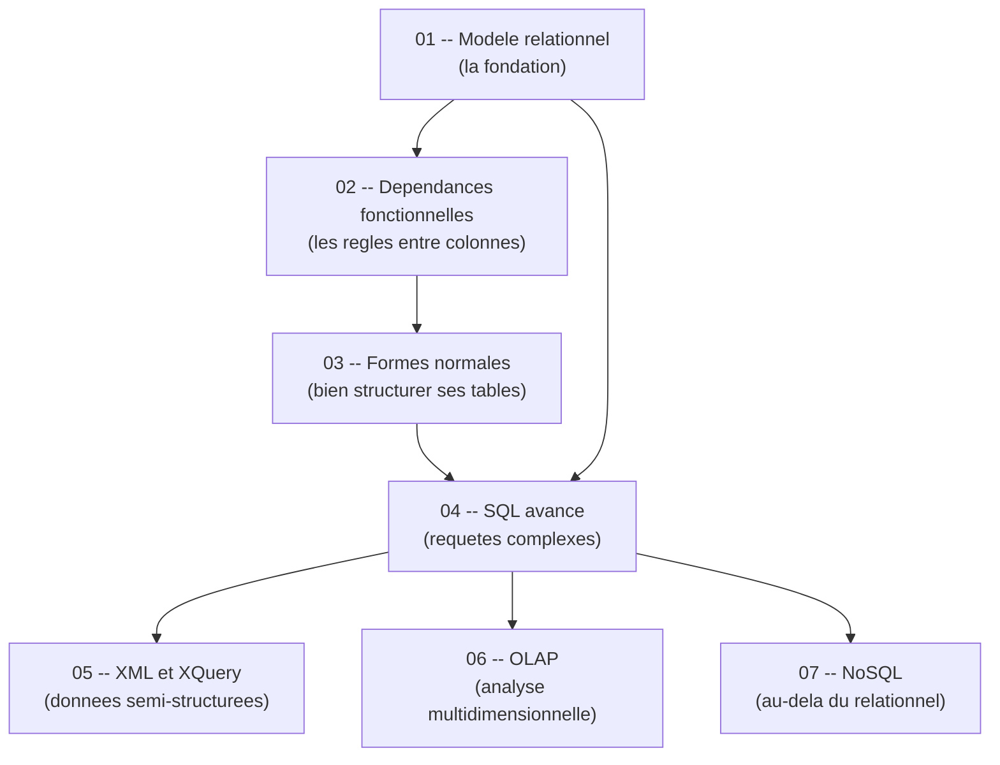

# Guide — Bases de Donnees (S6)

Bienvenue dans ce guide de bases de donnees, concu pour etre accessible meme si tu pars de zero. L'objectif : te permettre de comprendre les concepts fondamentaux des bases de donnees relationnelles et NoSQL, etape par etape, avec des explications claires, des analogies concretes et du code SQL que tu peux reproduire immediatement. Chaque chapitre est **autonome** -- tu peux les lire dans l'ordre ou sauter directement a celui qui t'interesse sans etre perdu.

---

## Roadmap d'apprentissage

Voici l'ordre recommande pour progresser efficacement. Chaque etape s'appuie sur les precedentes, mais tu peux toujours revenir en arriere si un concept te manque.

> **Lecture du diagramme** : les fleches indiquent l'ordre logique. Le modele relationnel (01) est le socle de tout. Les dependances fonctionnelles (02) menent aux formes normales (03). Le SQL avance (04) est accessible des que le modele relationnel est maitrise. XML (05), OLAP (06) et NoSQL (07) sont trois branches independantes qui partent du SQL avance.

---

## Prerequis

Pas besoin d'etre expert pour suivre ce guide. Voici le strict minimum :

- **Savoir ce qu'est un tableau** -- des lignes et des colonnes, comme un tableur Excel.
- **Avoir une idee de ce qu'est une base de donnees** -- un endroit ou l'on stocke des informations de facon organisee.
- **Avoir un SGBD installe** (SQLite suffit) -- telecharge-le ici : <https://www.sqlite.org/download.html>

Si tu sais ce qu'est un tableau avec des lignes et des colonnes, tu as le niveau requis.

---

## Comment utiliser ce guide

1. **Lis dans l'ordre** pour une progression naturelle, ou **saute directement** au chapitre qui t'interesse -- chaque fichier est autonome et complet.
2. **Reproduis le code SQL** en parallele dans SQLite ou un autre SGBD. Les bases de donnees s'apprennent en pratiquant, pas en lisant passivement.
3. **Les diagrammes Mermaid** sont rendus automatiquement sur GitHub et dans Obsidian. Si tu lis les fichiers dans un autre editeur, installe une extension Mermaid pour en profiter.
4. **Ne memorise pas les formules** -- comprends d'abord l'intuition, le reste viendra naturellement.

---

## Table des matieres

| # | Chapitre | Description |
|---|----------|-------------|
| 01 | [Modele relationnel](01_modele_relationnel.md) | Tables, attributs, cles, contraintes -- les fondations de toute base de donnees. |
| 02 | [Dependances fonctionnelles](02_dependances_fonctionnelles.md) | Comprendre les liens logiques entre colonnes pour eviter les anomalies. |
| 03 | [Formes normales](03_formes_normales.md) | Structurer ses tables correctement avec 1NF, 2NF, 3NF et BCNF. |
| 04 | [SQL avance](04_sql_avance.md) | Jointures, sous-requetes, agregations, vues -- maitriser les requetes complexes. |
| 05 | [XML et XQuery](05_xml.md) | Stocker et interroger des donnees semi-structurees avec XML et XQuery. |
| 06 | [OLAP](06_olap.md) | Analyser de grands volumes de donnees avec les cubes et l'analyse multidimensionnelle. |
| 07 | [NoSQL](07_nosql.md) | Decouvrir Cassandra, Neo4j et MongoDB -- quand le relationnel ne suffit plus. |
| -- | [Cheat sheet](cheat_sheet.md) | Recapitulatif des annales, questions recurrentes, formules cles et pieges pour le DS. |

---

## Structure d'un chapitre

Chaque chapitre suit la meme progression pour t'aider a construire ta comprehension pas a pas :

| Etape | Ce que tu y trouves |
|-------|---------------------|
| **Analogie** | Une situation de la vie courante pour ancrer le concept. |
| **Intuition visuelle** | Un schema ou diagramme Mermaid pour visualiser l'idee avant toute formule. |
| **Explication progressive** | Le concept explique en partant du plus simple vers le plus precis. |
| **Formules et regles** | Les regles formelles, introduites seulement quand l'intuition est en place. |
| **Exemples concrets** | Des exercices tires du cours et des TD pour voir le concept en action. |
| **Code SQL** | Le code complet et commente a reproduire dans un SGBD. |
| **Pieges classiques** | Les erreurs frequentes et comment les eviter. |
| **Recapitulatif** | Un resume en quelques points pour reviser rapidement. |

> Cette structure est pensee pour que tu puisses toujours comprendre le *pourquoi* avant le *comment*. Si une regle te bloque, reviens a l'analogie -- elle contient l'essentiel.

---

## Correspondance avec les materiaux du cours

| Chapitre du guide | Cours PDF | TD | TP |
|---|---|---|---|
| 01 - Modele relationnel | poly_etudiants_CM1 | TD1, TD2 | -- |
| 02 - Dependances fonctionnelles | 1-cours_DF_FN (partie 1) | TD3-4 | -- |
| 03 - Formes normales | 1-cours_DF_FN (partie 2) | TD3-4 | -- |
| 04 - SQL avance | 2-cours2016_part2, 3-cours2016_part3 | TD1, TD2 | TP1 (evaluation de requetes) |
| 05 - XML | CM 2 XML | TD5 | TP XML |
| 06 - OLAP | CM3OLAP | TD6 | -- |
| 07 - NoSQL | NoSQL-court-6 | TD7 | TP2 (Cassandra), TP3 (Neo4j), TP4 (MongoDB) |
