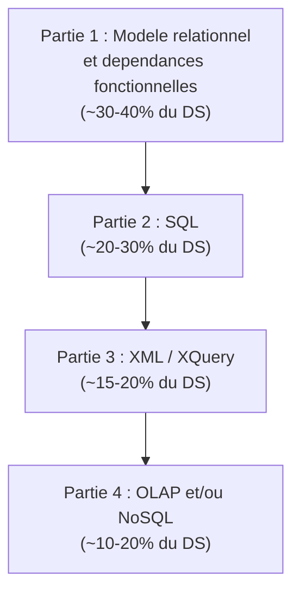

# Cheat Sheet -- Bases de Donnees (DS)

> Ce document synthetise les elements cles pour preparer le DS : structure des annales, questions recurrentes, formules essentielles et pieges a eviter.

---

## 1. Structure typique d'un DS

L'analyse des annales (2013-2024) revele une structure recurrente :



| Partie | Themes | Poids approximatif |
|--------|--------|-------------------|
| 1. DF et normalisation | Fermeture, cle candidate, couverture minimale, decomposition 3NF/BCNF | 30-40% |
| 2. SQL | Requetes complexes (jointures, sous-requetes, agregation, division) | 20-30% |
| 3. XML | DTD, XPath, XQuery (FLWOR) | 15-20% |
| 4. OLAP / NoSQL | Modele en etoile, ROLLUP/CUBE, ou Cassandra/MongoDB/Neo4j | 10-20% |

---

## 2. Questions recurrentes par theme

### 2.1 Dependances fonctionnelles et normalisation (revient dans CHAQUE DS)

| Question type | Ce qu'on attend | Frequence |
|---------------|-----------------|-----------|
| Calculer X+ (fermeture) | Algorithme iteratif, montrer chaque etape | Tres haute |
| Trouver les cles candidates | Identifier les attributs jamais en partie droite, calculer les fermetures | Tres haute |
| Couverture minimale | Decomposer, reduire parties gauches, supprimer redondances | Haute |
| Decomposition en 3NF | Algorithme de synthese (Bernstein) | Haute |
| Decomposition en BCNF | Algorithme de decomposition + verifier perte de DF | Moyenne |
| Verifier si une DF est impliquee | Calculer la fermeture du determinant et verifier inclusion | Moyenne |
| Identifier la forme normale | Verifier 1NF -> 2NF -> 3NF -> BCNF dans l'ordre | Haute |

### 2.2 SQL

| Question type | Ce qu'on attend | Frequence |
|---------------|-----------------|-----------|
| Jointures (INNER, LEFT, NATURAL) | Syntaxe correcte, choix de la bonne jointure | Tres haute |
| Sous-requetes (IN, EXISTS) | Savoir choisir entre IN et EXISTS | Haute |
| GROUP BY + HAVING | Agregation correcte, distinction WHERE/HAVING | Tres haute |
| Division relationnelle | Double NOT EXISTS ou methode par comptage | Moyenne |
| Algebre relationnelle | Ecrire sigma, pi, jointure en notation formelle | Moyenne |
| Optimisation (index) | Savoir quel index creer et pourquoi | Moyenne |

### 2.3 XML / XQuery

| Question type | Ce qu'on attend | Frequence |
|---------------|-----------------|-----------|
| Ecrire une DTD | Elements, attributs, ID/IDREF, cardinalites | Haute |
| Expressions XPath | Navigation dans l'arbre, predicats | Haute |
| Requetes XQuery FLWOR | for/let/where/order by/return | Haute |
| Conversion relationnel -> XML | Choisir attributs vs elements, definir la hierarchie | Moyenne |

### 2.4 OLAP / NoSQL

| Question type | Ce qu'on attend | Frequence |
|---------------|-----------------|-----------|
| Schema en etoile | Identifier faits, dimensions, mesures | Haute |
| ROLLUP vs CUBE | Savoir quelles lignes chaque operateur produit | Moyenne |
| Modelisation Cassandra | Partition key, clustering key, conception par les requetes | Moyenne |
| Requetes Cypher (Neo4j) | MATCH, RETURN, traversees | Basse-Moyenne |
| Requetes MongoDB | find(), aggregate() | Basse-Moyenne |

---

## 3. Formules et algorithmes cles

### 3.1 Fermeture X+

```
resultat = X
Repeter :
    Pour chaque DF (A -> B) :
        Si A est dans resultat :
            resultat = resultat U B
Jusqu'a stabilite
```

**Temps de calcul :** rapide (quelques iterations), mais ne pas oublier de re-parcourir toutes les DF apres chaque ajout.

### 3.2 Cles candidates

```
1. Attributs jamais en partie droite = DOIVENT etre dans toute cle
2. Calculer la fermeture de ces attributs
3. Si fermeture = tous les attributs -> c'est la cle
4. Sinon, ajouter progressivement des attributs et recalculer
```

### 3.3 Couverture minimale

```
1. Decomposer (un seul attribut en partie droite)
2. Reduire les parties gauches (tester si un attribut est inutile)
3. Supprimer les DF redondantes (testable par fermeture)
```

### 3.4 Decomposition 3NF (synthese)

```
1. Couverture minimale
2. Une relation par partie gauche distincte
3. Ajouter une relation avec une cle candidate si necessaire
4. Supprimer les relations incluses dans d'autres
```

### 3.5 Decomposition BCNF

```
1. Trouver X -> Y qui viole BCNF (X pas super-cle)
2. Decomposer en R1(X+) et R2(X U (R - X+))
3. Appliquer recursivement
```

### 3.6 Division en SQL (double NOT EXISTS)

```sql
SELECT x FROM R1
WHERE NOT EXISTS (
    SELECT y FROM R2
    WHERE NOT EXISTS (
        SELECT * FROM R3
        WHERE R3.x = R1.x AND R3.y = R2.y
    )
)
```

**Lecture :** "Les x pour lesquels il n'existe pas de y sans correspondance dans R3."

---

## 4. Equivalences SQL / Algebre relationnelle

| Algebre relationnelle | SQL |
|-----------------------|-----|
| sigma_{condition}(R) | `SELECT * FROM R WHERE condition` |
| pi_{A,B}(R) | `SELECT A, B FROM R` |
| R1 x R2 | `SELECT * FROM R1, R2` (ou CROSS JOIN) |
| R1 |x|_{cond} R2 | `SELECT * FROM R1 JOIN R2 ON cond` |
| R1 U R2 | `SELECT * FROM R1 UNION SELECT * FROM R2` |
| R1 - R2 | `SELECT * FROM R1 EXCEPT SELECT * FROM R2` |
| R1 ∩ R2 | `SELECT * FROM R1 INTERSECT SELECT * FROM R2` |

---

## 5. Pieges les plus frequents en DS

### DF et normalisation

| Piege | Pourquoi c'est faux | Correction |
|-------|---------------------|------------|
| Arreter la fermeture trop tot | Les nouveaux attributs peuvent debloquer d'autres DF | Iterer jusqu'a stabilite |
| Oublier les attributs jamais a droite | Ils DOIVENT etre dans la cle | Les identifier en premier |
| Confondre couverture minimale et ensemble minimal de DF | La couverture minimale preservee l'equivalence | Verifier que Fmin+ = F+ |
| Croire que 3NF = BCNF | 3NF tolere l'exception pour les attributs premiers | Verifier specifiquement |
| Faire la couverture minimale dans le mauvais ordre | Decomposer -> Reduire -> Supprimer (cet ordre !) | Suivre l'ordre strict |

### SQL

| Piege | Pourquoi c'est faux | Correction |
|-------|---------------------|------------|
| NULL = NULL retourne FALSE | NULL n'est egal a rien | Utiliser IS NULL |
| NOT IN avec des NULL | Si un NULL est dans la liste, le resultat est vide | Ajouter WHERE col IS NOT NULL |
| HAVING sans GROUP BY | HAVING filtre des groupes, pas des lignes | Utiliser WHERE pour les lignes |
| SELECT col sans GROUP BY col | En SQL standard, toute colonne non agregee doit etre dans GROUP BY | Ajouter au GROUP BY ou utiliser une agregation |
| NATURAL JOIN imprevisible | Joint sur TOUTES les colonnes de meme nom | Preferer JOIN ... ON |

### XML / XQuery

| Piege | Pourquoi c'est faux | Correction |
|-------|---------------------|------------|
| Oublier la racine unique | XML exige exactement un element racine | Engober dans un element racine |
| Oublier text() en XQuery | Sans text(), on obtient l'element avec ses balises | Ajouter /text() |
| Oublier les accolades { } | Sans { }, l'expression n'est pas evaluee | Entourer les expressions XQuery de { } |
| Confondre / et // en XPath | / = enfant direct, // = n'importe ou | Choisir selon le contexte |

### OLAP / NoSQL

| Piege | Pourquoi c'est faux | Correction |
|-------|---------------------|------------|
| Requete Cassandra sans partition key | Cassandra DOIT utiliser la partition key | Toujours inclure la PK dans WHERE |
| Modeliser Cassandra comme du SQL | Cassandra se modelise par les requetes | Partir des requetes, pas des entites |
| Confondre ROLLUP et CUBE | ROLLUP = hierarchique, CUBE = toutes combinaisons | Compter les niveaux |

---

## 6. Aide-memoire syntaxique

### SQL essentiel

```sql
-- Jointure
SELECT ... FROM A JOIN B ON A.id = B.id WHERE ...

-- Agregation
SELECT col, COUNT(*), SUM(val) FROM T GROUP BY col HAVING COUNT(*) > N

-- Sous-requete
SELECT ... FROM T WHERE col IN (SELECT col FROM T2 WHERE ...)

-- Division (double NOT EXISTS)
SELECT x FROM T1 WHERE NOT EXISTS (SELECT y FROM T2 WHERE NOT EXISTS (SELECT * FROM T3 WHERE ...))

-- Index
CREATE INDEX idx ON table(col1, col2);
EXPLAIN QUERY PLAN SELECT ...;
```

### XQuery essentiel

```xquery
for $x in doc("fichier.xml")//element
let $y := $x/sous_element
where $x/@attribut > valeur
order by $x/critere descending
return <resultat>{ $x/champ/text() }</resultat>
```

### Cassandra essentiel

```sql
CREATE TABLE t (
    pk TEXT,
    ck INT,
    val TEXT,
    PRIMARY KEY ((pk), ck)
);
SELECT * FROM t WHERE pk = 'valeur' AND ck > 10;
```

### Neo4j (Cypher) essentiel

```cypher
MATCH (n:Label {prop: val})-[:REL]->(m:Label2)
WHERE n.prop > val
RETURN n.prop, count(m)
ORDER BY count(m) DESC
```

### MongoDB essentiel

```javascript
db.collection.find({ champ: { $gt: val } }, { projection: 1 })
db.collection.aggregate([
    { $match: { champ: val } },
    { $group: { _id: "$champ", total: { $sum: "$val" } } },
    { $sort: { total: -1 } }
])
```

---

## 7. Strategie pour le DS

### Gestion du temps

1. **Lire tout le sujet** en entier avant de commencer (5 min)
2. **Commencer par les questions faciles** (fermeture, SQL simple) pour securiser des points
3. **DF et normalisation** : methodique, montrer chaque etape (souvent le plus gros coefficient)
4. **SQL** : ecrire la requete puis la relire en verifiant WHERE, GROUP BY, HAVING
5. **XML** : la DTD est souvent offerte, ne pas la negliger
6. **OLAP/NoSQL** : si c'est la derniere partie, ne pas la sauter -- souvent des points faciles

### Presentation

- **Montrer le raisonnement** : les etapes intermediaires valent souvent des points
- **Fermeture** : ecrire chaque iteration sur une nouvelle ligne
- **Couverture minimale** : indiquer quelle DF on teste et pourquoi on la garde/supprime
- **SQL** : indenter proprement et commenter si la requete est complexe
- **Ne pas inventer de syntaxe** : si tu ne te rappelles pas de la syntaxe exacte, explique en francais ce que ta requete devrait faire

---

## 8. Check-list de revision

- [ ] Je sais calculer une fermeture X+ en montrant chaque etape
- [ ] Je sais trouver les cles candidates d'une relation
- [ ] Je sais calculer la couverture minimale (decomposer -> reduire -> supprimer)
- [ ] Je sais decomposer en 3NF par synthese
- [ ] Je sais decomposer en BCNF et identifier quand des DF sont perdues
- [ ] Je sais ecrire des jointures (INNER, LEFT, NATURAL, CROSS)
- [ ] Je sais utiliser GROUP BY + HAVING correctement
- [ ] Je sais ecrire une division en SQL (double NOT EXISTS)
- [ ] Je sais ecrire une DTD avec ID/IDREF
- [ ] Je sais ecrire des expressions XPath avec predicats
- [ ] Je sais ecrire des requetes XQuery FLWOR
- [ ] Je sais dessiner un schema en etoile (faits + dimensions)
- [ ] Je connais la difference entre ROLLUP et CUBE
- [ ] Je comprends le theoreme CAP et la difference ACID/BASE
- [ ] Je sais ecrire une requete CQL basique pour Cassandra
- [ ] Je sais ecrire une requete Cypher basique pour Neo4j
- [ ] Je sais ecrire un find() et un aggregate() pour MongoDB
