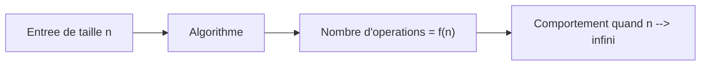
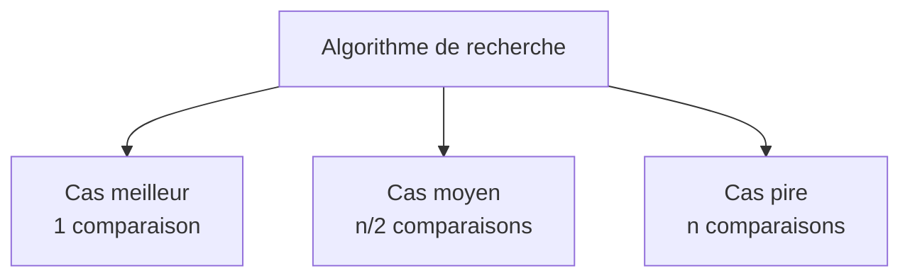
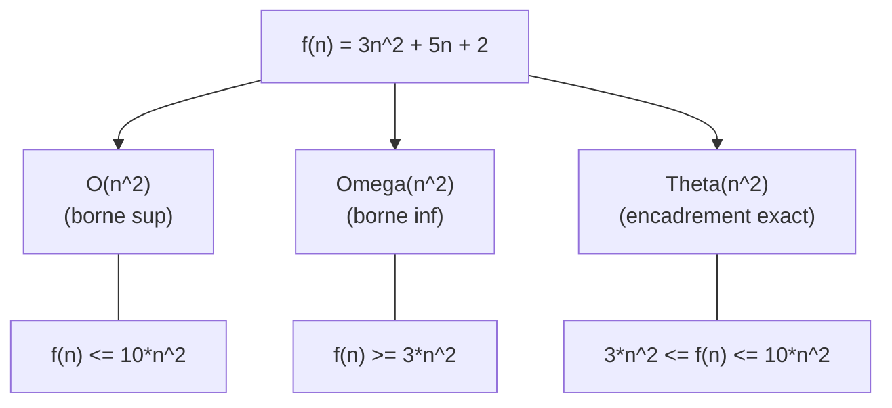

# Chapitre 1 -- Notations asymptotiques

> **Idee centrale en une phrase :** On ne compte pas le temps exact d'un algorithme -- on mesure comment ce temps evolue quand la taille du probleme grandit.

**Prerequis :** Savoir ce qu'est une boucle et une fonction
**Chapitre suivant :** [Recurrences ->](02_recurrences.md)

---

## 1. L'analogie du trajet

### Pourquoi ne pas mesurer le temps exact ?

Imaginons que tu veuilles savoir si ta voiture est rapide. Tu pourrais chronometrer un trajet Paris-Lyon, mais le resultat dependrait de :

- La **meteo** (pluie, soleil)
- Le **trafic** (heure de pointe ou non)
- Le **modele exact** de ta voiture

Ce qui t'interesse vraiment, c'est : **comment le temps de trajet evolue quand la distance augmente ?** Si la distance double, le temps double-t-il aussi ? C'est ca que mesurent les notations asymptotiques pour les algorithmes.

### L'idee cle

Au lieu de dire "cet algorithme prend 3.7 secondes sur mon PC", on dit "cet algorithme prend un temps **proportionnel a n^2** quand il traite n elements". Peu importe la machine : sur un PC deux fois plus rapide, il prendra deux fois moins de temps, mais le temps restera proportionnel a n^2.



**Lecture du schema :** On donne une entree de taille n a l'algorithme, on compte le nombre d'operations, puis on etudie comment ce nombre evolue quand n grandit vers l'infini.

---

## 2. Les trois cas : meilleur, pire, moyen

Avant de parler des notations O, Theta et Omega, il faut comprendre que la complexite d'un algorithme **depend des donnees**.

### Exemple : recherche d'un element dans un tableau

```
fonction chercher(T, n, x):
    pour i de 0 a n-1:
        si T[i] == x:
            retourner i
    retourner -1
```

- **Cas meilleur** : l'element est en premiere position. On fait **1 comparaison**. C'est le cas le plus optimiste.
- **Cas pire** : l'element n'est pas dans le tableau. On fait **n comparaisons**. C'est le cas le plus pessimiste.
- **Cas moyen** : en supposant que x est dans le tableau et que chaque position est equiprobable, on fait en moyenne **n/2 comparaisons**.



> **Regle d'or :** En pratique, on s'interesse presque toujours au **cas pire**, car il donne une garantie : "quelles que soient les donnees, l'algorithme ne fera jamais plus de X operations."

---

## 3. Les notations O, Omega, Theta

### 3.1 O (grand O) -- borne superieure

**Intuition :** "L'algorithme ne fera **jamais pire** que ca."

O(g(n)) represente l'ensemble des fonctions qui **ne grandissent pas plus vite** que g(n) a partir d'un certain rang.

**Definition formelle :**

```
f(n) = O(g(n)) si et seulement si :
    il existe c > 0 et n0 tels que pour tout n >= n0 :
    f(n) <= c * g(n)
```

**En francais :** A partir d'un certain rang n0, f(n) est toujours en dessous de c * g(n), ou c est une constante.

**Exemple :**

```
f(n) = 3n^2 + 5n + 2

On veut montrer que f(n) = O(n^2)
Pour n >= 1 :
    3n^2 + 5n + 2 <= 3n^2 + 5n^2 + 2n^2 = 10n^2
Donc f(n) <= 10 * n^2 pour tout n >= 1
Avec c = 10 et n0 = 1, on a bien f(n) = O(n^2)
```

### 3.2 Omega -- borne inferieure

**Intuition :** "L'algorithme fera **au moins** ca."

Omega(g(n)) represente l'ensemble des fonctions qui **grandissent au moins aussi vite** que g(n).

**Definition formelle :**

```
f(n) = Omega(g(n)) si et seulement si :
    il existe c > 0 et n0 tels que pour tout n >= n0 :
    f(n) >= c * g(n)
```

**Exemple :**

```
f(n) = 3n^2 + 5n + 2

On veut montrer que f(n) = Omega(n^2)
Pour tout n >= 0 :
    3n^2 + 5n + 2 >= 3n^2
Donc f(n) >= 3 * n^2 pour tout n >= 0
Avec c = 3 et n0 = 0, on a bien f(n) = Omega(n^2)
```

### 3.3 Theta -- encadrement exact

**Intuition :** "L'algorithme fait **exactement** ca, a une constante pres."

Theta(g(n)) represente l'ensemble des fonctions qui **grandissent a la meme vitesse** que g(n).

**Definition formelle :**

```
f(n) = Theta(g(n)) si et seulement si :
    f(n) = O(g(n)) ET f(n) = Omega(g(n))
```

**Autrement dit :** il existe c1, c2 > 0 et n0 tels que pour tout n >= n0 :

```
c1 * g(n) <= f(n) <= c2 * g(n)
```

**En resume :**

| Notation | Signification | Analogie |
|----------|---------------|----------|
| O(g(n)) | f ne grandit pas plus vite que g | f <= g (a une constante pres) |
| Omega(g(n)) | f grandit au moins aussi vite que g | f >= g (a une constante pres) |
| Theta(g(n)) | f grandit a la meme vitesse que g | f = g (a une constante pres) |



---

## 4. Proprietes utiles des notations

### 4.1 Regles de calcul

Ces regles permettent de simplifier rapidement une expression de complexite :

**Regle 1 : les constantes disparaissent**

```
O(5n) = O(n)
O(100 * n^2) = O(n^2)
```

**Regle 2 : on garde le terme dominant**

```
O(n^2 + n) = O(n^2)          car n^2 domine n
O(n^3 + 1000*n^2) = O(n^3)   car n^3 domine 1000*n^2
O(2^n + n^100) = O(2^n)       car 2^n domine n^100
```

**Regle 3 : les operations se combinent**

```
O(f) + O(g) = O(max(f, g))      -- sequences
O(f) * O(g) = O(f * g)          -- boucles imbriquees
```

### 4.2 Hierarchie des complexites

Du plus rapide au plus lent, voici les complexites les plus courantes :

```
O(1) < O(log n) < O(n) < O(n log n) < O(n^2) < O(n^3) < O(2^n) < O(n!)
```

| Complexite | Nom | Exemple | n=10 | n=100 | n=1000 |
|-----------|-----|---------|------|-------|--------|
| O(1) | Constante | Acces tableau | 1 | 1 | 1 |
| O(log n) | Logarithmique | Recherche dichotomique | 3 | 7 | 10 |
| O(n) | Lineaire | Parcours de tableau | 10 | 100 | 1000 |
| O(n log n) | Quasi-lineaire | Tri fusion | 33 | 664 | 9966 |
| O(n^2) | Quadratique | Tri par insertion (pire cas) | 100 | 10000 | 10^6 |
| O(n^3) | Cubique | Multiplication de matrices naive | 1000 | 10^6 | 10^9 |
| O(2^n) | Exponentielle | Sous-ensembles | 1024 | 10^30 | 10^301 |
| O(n!) | Factorielle | Permutations | 3.6*10^6 | 9.3*10^157 | astronomique |

> **Regle pratique :** Un ordinateur moderne fait environ 10^8 a 10^9 operations par seconde. Un algorithme en O(n^2) avec n = 10^9 prendrait environ 10^9 secondes, soit 30 ans. D'ou l'importance de la complexite !

---

## 5. Calculer la complexite d'un code

### 5.1 Boucle simple

```python
# O(n)
for i in range(n):
    # operation en O(1)
    x = x + 1
```

Justification : la boucle s'execute n fois, chaque iteration coute O(1), donc le total est n * O(1) = O(n).

### 5.2 Boucles imbriquees

```python
# O(n^2)
for i in range(n):
    for j in range(n):
        # operation en O(1)
        x = x + 1
```

Justification : la boucle externe s'execute n fois, pour chaque iteration la boucle interne s'execute n fois, donc le total est n * n * O(1) = O(n^2).

### 5.3 Boucles imbriquees dependantes

```python
# O(n^2)
for i in range(n):
    for j in range(i):
        # operation en O(1)
        x = x + 1
```

Justification : le nombre total d'operations est 0 + 1 + 2 + ... + (n-1) = n(n-1)/2 = O(n^2).

### 5.4 Boucle logarithmique

```python
# O(log n)
i = n
while i > 0:
    # operation en O(1)
    i = i // 2
```

Justification : a chaque iteration, i est divise par 2. Partant de n, il faut log2(n) divisions pour atteindre 0. Donc O(log n).

### 5.5 Boucle imbriquee avec division

```python
# O(n log n)
for i in range(n):
    j = n
    while j > 0:
        # operation en O(1)
        j = j // 2
```

Justification : la boucle externe fait n iterations, chaque iteration interne fait log(n) operations, donc n * log(n) = O(n log n).

---

## 6. Cout moyen et cout amorti

### 6.1 Cout moyen

Le cout moyen necessite de connaitre la **distribution des entrees possibles**.

**Exemple : recherche sequentielle**

Si on cherche un element x dans un tableau de taille n, et qu'on suppose :
- x est dans le tableau avec probabilite p
- Chaque position est equiprobable

```
E[cout] = p * (1 + 2 + ... + n) / n + (1-p) * n
        = p * (n+1)/2 + (1-p) * n
```

Si p = 1 (on sait que x est dans le tableau) : E[cout] = (n+1)/2 = O(n).

### 6.2 Cout amorti

Le cout amorti mesure le **cout moyen par operation sur une sequence d'operations**. C'est different du cout moyen car il ne suppose aucune distribution sur les entrees.

**Exemple classique : le compteur binaire**

Un compteur binaire represente un entier en binaire. L'operation "incrementer" peut changer beaucoup de bits (par exemple, 01111 + 1 = 10000 change 5 bits).

- Le **pire cas** d'un increment est O(k) ou k est le nombre de bits.
- Mais le **cout amorti** est O(1) par increment, car les changements massifs de bits sont rares.

**Pourquoi ?** Sur n increments :
- Le bit 0 change n fois
- Le bit 1 change n/2 fois
- Le bit 2 change n/4 fois
- ...
- Total : n + n/2 + n/4 + ... < 2n

Donc le cout total est O(n), et le cout amorti par operation est O(n)/n = O(1).

---

## 7. Les algorithmes de tri -- illustration

Les algorithmes de tri sont les exemples les plus classiques pour illustrer la complexite.

### Comparaison des tris

| Algorithme | Meilleur cas | Cas moyen | Pire cas | Stable ? | En place ? |
|-----------|-------------|-----------|----------|----------|-----------|
| Tri par insertion | O(n) | O(n^2) | O(n^2) | Oui | Oui |
| Tri par selection | O(n^2) | O(n^2) | O(n^2) | Non | Oui |
| Tri par fusion | O(n log n) | O(n log n) | O(n log n) | Oui | Non |
| Tri rapide (Quicksort) | O(n log n) | O(n log n) | O(n^2) | Non | Oui |

### Tri par insertion

```python
def tri_insertion(T):
    for i in range(1, len(T)):
        cle = T[i]
        j = i - 1
        while j >= 0 and T[j] > cle:
            T[j+1] = T[j]
            j -= 1
        T[j+1] = cle
```

**Analyse :**
- **Meilleur cas** (tableau deja trie) : la boucle while ne s'execute jamais. Cout : O(n).
- **Pire cas** (tableau trie en ordre inverse) : la boucle while s'execute i fois a chaque iteration. Cout : 1 + 2 + ... + (n-1) = O(n^2).

### Tri par fusion

```python
def tri_fusion(T, debut, fin):
    if debut < fin:
        milieu = (debut + fin) // 2
        tri_fusion(T, debut, milieu)
        tri_fusion(T, milieu + 1, fin)
        fusionner(T, debut, milieu, fin)
```

**Analyse :** T(n) = 2*T(n/2) + O(n) => par le theoreme maitre, T(n) = O(n log n).

---

## 8. Exemple du cours : valmax

Le cours presente une fonction qui calcule le maximum d'un tableau :

```c
int valmax(int i) {
    if (i == 0)
        return T[0];
    else {
        if (T[i] > valmax(i-1))
            return T[i];
        else
            return valmax(i-1);
    }
}
```

**Question du cours :** "La fonction marche jusqu'a 27 elements, mais boucle pour 28."

**Explication :** Dans le pire cas (tableau croissant), l'appel `valmax(i-1)` est fait **deux fois** (une dans le if, une dans le else). L'arbre des appels est un arbre binaire de profondeur n, donc la complexite est O(2^n). Avec 27 elements, 2^27 = 134 millions d'appels (quelques secondes). Avec 28 elements, 2^28 = 268 millions -- ca devient trop long.

**Solution :** Stocker le resultat de `valmax(i-1)` dans une variable :

```c
int valmax(int i) {
    if (i == 0)
        return T[0];
    else {
        int m = valmax(i-1);  // un seul appel
        if (T[i] > m)
            return T[i];
        else
            return m;
    }
}
```

Complexite : O(n). C'est la premiere illustration de l'importance d'eviter les **calculs redondants** -- un theme central du cours.

---

## 9. Pieges classiques

**Piege 1 : Confondre O et Theta**

Dire "cet algorithme est en O(n^2)" ne signifie PAS qu'il est toujours quadratique. O est une borne superieure. Le tri rapide est en O(n^2) dans le pire cas, mais en Theta(n log n) en moyenne.

**Piege 2 : Oublier que O cache des constantes**

O(n) peut signifier n operations ou 1000*n operations. Pour de petites tailles, un algorithme en O(n^2) peut etre plus rapide qu'un algorithme en O(n log n) si les constantes cachees sont tres differentes.

**Piege 3 : Confondre log2 et log10**

En complexite, la base du logarithme n'a pas d'importance car log_a(n) = log_b(n) / log_b(a), et log_b(a) est une constante. O(log2(n)) = O(log10(n)) = O(ln(n)) = O(log n).

**Piege 4 : Compter les boucles imbriquees dependantes**

```python
for i in range(n):
    for j in range(i):
        ...
```

La complexite n'est PAS O(n^2/2) -- c'est O(n^2). Les constantes disparaissent dans la notation O.

**Piege 5 : Oublier le cout des appels recursifs**

Un appel recursif n'est pas "gratuit". Il faut compter le nombre total d'appels ET le travail fait dans chaque appel. C'est le sujet du chapitre suivant sur les recurrences.

---

## 10. Recapitulatif

- **Complexite = comment le cout evolue avec la taille n**, pas le temps exact.
- **Trois cas** : meilleur, pire, moyen. On s'interesse surtout au **pire cas**.
- **O(f)** = borne superieure : "pas pire que f".
- **Omega(f)** = borne inferieure : "au moins f".
- **Theta(f)** = encadrement exact : "exactement f, a une constante pres".
- **Hierarchie** : O(1) < O(log n) < O(n) < O(n log n) < O(n^2) < O(2^n) < O(n!).
- **Pour calculer la complexite d'un code** : compter les iterations des boucles, multiplier pour les boucles imbriquees.
- **Cout amorti** : cout moyen par operation sur une sequence, sans hypothese sur les entrees.
- Les **constantes et termes non dominants** disparaissent dans les notations asymptotiques.
