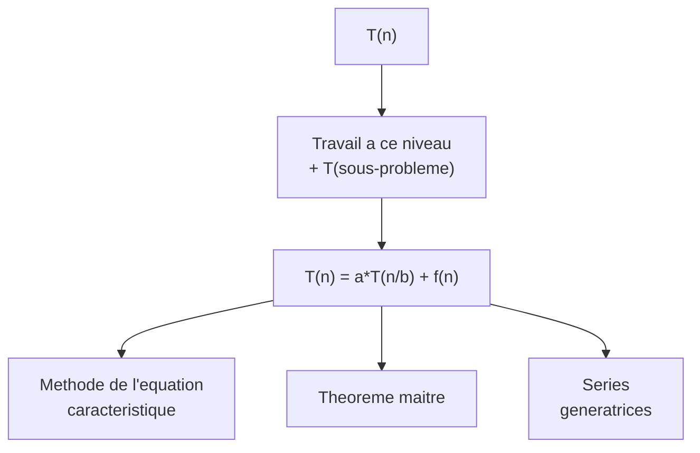
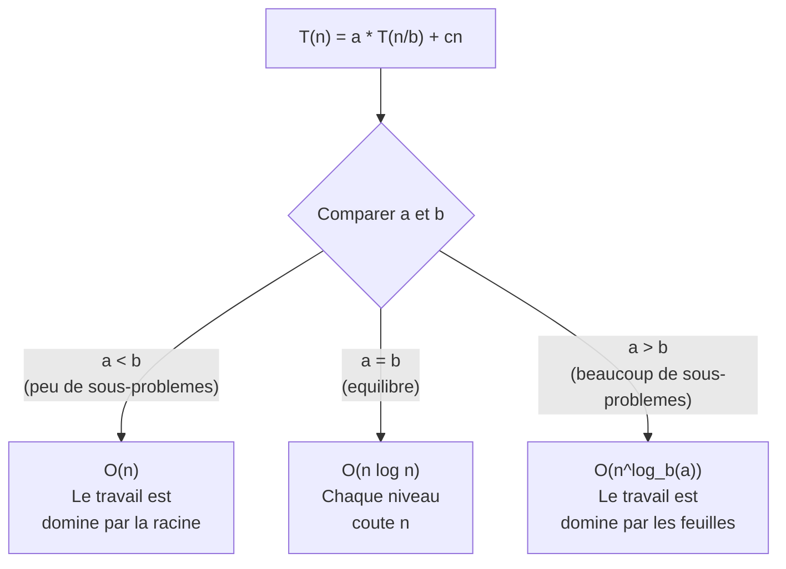

# Chapitre 2 -- Recurrences

> **Idee centrale en une phrase :** Les algorithmes recursifs produisent des equations de recurrence, et savoir les resoudre permet de calculer leur complexite exacte.

**Prerequis :** [Notations asymptotiques](01_notations_asymptotiques.md)
**Chapitre suivant :** [Diviser pour regner ->](03_diviser_regner.md)

---

## 1. L'analogie des poupees russes

### Pourquoi les recurrences ?

Imaginons que tu veuilles savoir combien de temps il faut pour ouvrir un ensemble de poupees russes (matriochka). Chaque poupee contient une poupee plus petite. Pour ouvrir toutes les poupees :

- Tu ouvres la poupee actuelle (1 operation)
- Tu ouvres toutes les poupees a l'interieur (le meme probleme, mais plus petit)

Ca donne une **relation de recurrence** : le temps pour ouvrir n poupees depend du temps pour ouvrir n-1 poupees.

```
T(n) = T(n-1) + 1
T(0) = 0
```

Solution : T(n) = n. Simple, non ? Les choses se compliquent quand on a des recurrences plus complexes.



---

## 2. Les trois grandes methodes de resolution

Le cours de Maud Marchal couvre trois methodes, chacune adaptee a un type d'equation :

| Methode | Quand l'utiliser | Type d'equation |
|---------|-----------------|-----------------|
| Equation caracteristique | Coefficients constants, recurrence lineaire | un = a*un-1 + b*un-2 + ... |
| Theoreme maitre | Diviser pour regner | T(n) = a*T(n/b) + f(n) |
| Series generatrices | Cas generaux, surtout en DS | Toute recurrence lineaire |

---

## 3. Methode de l'equation caracteristique

### 3.1 Le principe en 5 etapes

C'est **la methode la plus demandee en DS**. Elle s'applique aux recurrences lineaires a coefficients constants.

**Forme generale :**

```
un = a1*un-1 + a2*un-2 + ... + ak*un-k + g(n)
```

**Etape 1 : Resoudre la partie homogene**

On commence par resoudre l'equation SANS le terme g(n) :

```
un = a1*un-1 + a2*un-2 + ... + ak*un-k
```

On cherche des solutions de la forme un = r^n. En substituant :

```
r^n = a1*r^(n-1) + a2*r^(n-2) + ... + ak*r^(n-k)
```

On divise par r^(n-k) (le plus petit terme) :

```
r^k = a1*r^(k-1) + a2*r^(k-2) + ... + ak
```

C'est l'**equation caracteristique**. Ses racines donnent la solution homogene.

**Etape 2 : Trouver les racines**

Resoudre le polynome r^k - a1*r^(k-1) - a2*r^(k-2) - ... - ak = 0

**Etape 3 : Ecrire la solution homogene**

- Si les racines r1, r2, ..., rk sont **toutes distinctes** :

```
un(h) = C1*r1^n + C2*r2^n + ... + Ck*rk^n
```

- Si une racine r a une **multiplicite m** :

```
Les termes correspondants sont : (C1 + C2*n + C3*n^2 + ... + Cm*n^(m-1)) * r^n
```

**Etape 4 : Trouver une solution particuliere** (si g(n) != 0)

| Forme de g(n) | Solution particuliere a essayer |
|---------------|-------------------------------|
| c (constante) | A (constante) |
| c * n | A*n + B |
| c * n^2 | A*n^2 + B*n + C |
| c * alpha^n | A * alpha^n |
| c * n * alpha^n | (A*n + B) * alpha^n |

**Attention :** si alpha est deja une racine de l'equation caracteristique de multiplicite m, il faut multiplier par n^m. Par exemple, si alpha est une racine simple et g(n) = c * alpha^n, on essaie A * n * alpha^n.

**Etape 5 : Solution generale = homogene + particuliere**

```
un = un(h) + un(p)
```

Puis on utilise les **conditions initiales** (u0, u1, ...) pour determiner les constantes C1, C2, etc.

### 3.2 Exemple detaille (type DS 2017/2021)

**Probleme :** Resoudre un = un-1 + 6*un-2 + 5*3^n pour n >= 2, avec u0 = 2, u1 = 0.

**Etape 1 : Equation caracteristique de la partie homogene**

```
un = un-1 + 6*un-2
```

On cherche r^n = r^(n-1) + 6*r^(n-2), soit r^2 = r + 6, soit :

```
r^2 - r - 6 = 0
```

**Etape 2 : Racines**

```
Delta = 1 + 24 = 25
r1 = (1 + 5) / 2 = 3
r2 = (1 - 5) / 2 = -2
```

**Etape 3 : Solution homogene**

```
un(h) = A * 3^n + B * (-2)^n
```

**Etape 4 : Solution particuliere pour g(n) = 5 * 3^n**

Normalement, on essaierait C * 3^n, mais 3 est deja racine (r1 = 3). Donc on essaie :

```
un(p) = C * n * 3^n
```

On substitue dans un = un-1 + 6*un-2 + 5*3^n :

```
C*n*3^n = C*(n-1)*3^(n-1) + 6*C*(n-2)*3^(n-2) + 5*3^n
```

Divisons tout par 3^(n-2) :

```
C*n*9 = C*(n-1)*3 + 6*C*(n-2) + 5*9
```

```
9Cn = 3Cn - 3C + 6Cn - 12C + 45
```

```
9Cn = 9Cn - 15C + 45
```

```
0 = -15C + 45
C = 3
```

Donc un(p) = 3*n*3^n = n*3^(n+1).

**Etape 5 : Solution generale et conditions initiales**

```
un = A * 3^n + B * (-2)^n + n * 3^(n+1)
```

Avec u0 = 2 : A + B = 2
Avec u1 = 0 : 3A - 2B + 9 = 0, soit 3A - 2B = -9

De la premiere equation : A = 2 - B. En substituant :
3(2 - B) - 2B = -9
6 - 3B - 2B = -9
-5B = -15
B = 3, A = -1

**Solution finale :**

```
un = -3^n + 3*(-2)^n + n*3^(n+1)
```

---

## 4. Theoreme maitre (Master theorem)

### 4.1 Le contexte : diviser pour regner

Les algorithmes "diviser pour regner" produisent des recurrences de la forme :

```
T(n) = a * T(n/b) + f(n)
```

ou :
- **a** = nombre de sous-problemes
- **n/b** = taille de chaque sous-probleme
- **f(n)** = cout de la division + recombinaison

### 4.2 Le theoreme (version du cours)

Le cours de Maud Marchal utilise cette version simplifiee :

**Theoreme :** Si T(n) = a * T(n/b) + c*n, avec T(1) = C, a > 1, b > 1, alors :

```
a < b  =>  T(n) = O(n)
a = b  =>  T(n) = O(n * log(n))
a > b  =>  T(n) = O(n^(log_b(a)))
```

**Intuition :**



### 4.3 Exemples classiques

**Tri par fusion :** T(n) = 2*T(n/2) + n

```
a = 2, b = 2, a = b => T(n) = O(n log n)
```

**Recherche dichotomique :** T(n) = T(n/2) + 2

```
a = 1, b = 2, c*n = 2 (constant)
Cas special : T(n) = O(log n)
```

**Multiplication de Strassen :** T(n) = 7*T(n/2) + n^2

```
a = 7, b = 2, a > b => T(n) = O(n^(log_2(7))) = O(n^2.807)
```

### 4.4 Demonstration (idee)

On developpe la recurrence en arbre :

```
Niveau 0 : c*n                     (1 probleme de taille n)
Niveau 1 : a * c*(n/b) = c*n*a/b   (a problemes de taille n/b)
Niveau 2 : a^2 * c*(n/b^2)         (a^2 problemes de taille n/b^2)
...
Niveau k : a^k * c*(n/b^k)         (a^k problemes de taille n/b^k)
```

Le dernier niveau est atteint quand n/b^k = 1, soit k = log_b(n). Le cout total est :

```
T(n) = c*n * somme(k=0 a log_b(n)) de (a/b)^k + a^(log_b(n)) * C
```

C'est une serie geometrique de raison a/b, d'ou les trois cas selon que a/b < 1, = 1, ou > 1.

---

## 5. Series generatrices

### 5.1 Le principe

Cette methode est plus puissante mais aussi plus technique. Elle est **demandee regulierement en DS** a cote de l'equation caracteristique.

**Idee :** On "encode" toute la suite (un) dans une seule fonction :

```
F(x) = u0 + u1*x + u2*x^2 + u3*x^3 + ...
     = somme(n=0 a infini) de un * x^n
```

**Procedure :**

1. Multiplier l'equation de recurrence par x^n
2. Sommer pour tout n
3. Reconnaitre F(x) dans la somme
4. Resoudre pour F(x) (equation algebrique)
5. Decomposer F(x) en fractions partielles
6. Identifier les coefficients (developpement en serie)

### 5.2 Formules utiles a connaitre

| Fonction | Serie generatrice |
|----------|-------------------|
| 1/(1-x) | 1 + x + x^2 + x^3 + ... = somme x^n |
| 1/(1-ax) | 1 + ax + a^2*x^2 + ... = somme a^n * x^n |
| 1/(1-x)^2 | 1 + 2x + 3x^2 + ... = somme (n+1) * x^n |
| x/(1-x)^2 | x + 2x^2 + 3x^3 + ... = somme n * x^n |

### 5.3 Exemple detaille

**Probleme (type DS 2021) :** Resoudre un = un-2 + 8n*3^(n-2) pour n >= 2, u0 = 0, u1 = 2.

**Etape 1 :** On definit F(x) = somme(n>=0) un * x^n.

**Etape 2 :** On multiplie un = un-2 + 8n*3^(n-2) par x^n et on somme pour n >= 2 :

```
somme(n>=2) un*x^n = somme(n>=2) un-2*x^n + 8 * somme(n>=2) n*3^(n-2)*x^n
```

Le membre de gauche est F(x) - u0 - u1*x = F(x) - 2x.

Pour le premier terme de droite : somme(n>=2) un-2*x^n = x^2 * F(x).

Pour le second terme, posons m = n-2 : somme(n>=2) n*3^(n-2)*x^n = somme(m>=0) (m+2)*3^m*x^(m+2) = x^2 * somme(m>=0) (m+2)*(3x)^m.

On decompose : somme(m>=0) (m+2)*(3x)^m = somme m*(3x)^m + 2*somme(3x)^m = 3x/(1-3x)^2 + 2/(1-3x).

**Etape 3 :** On resout pour F(x) :

```
F(x) - 2x = x^2 * F(x) + 8x^2 * [3x/(1-3x)^2 + 2/(1-3x)]
F(x)(1 - x^2) = 2x + 8x^2 * [3x/(1-3x)^2 + 2/(1-3x)]
```

**Etape 4 :** On decompose F(x) en fractions partielles, puis on identifie les coefficients pour obtenir un.

> **Note :** En DS, on ne vous demande generalement pas d'aller jusqu'au bout de la decomposition. L'important est de maitriser la mise en equation et les premieres etapes de resolution.

---

## 6. Cas special : resolution par deroulement

Quand la recurrence est simple, on peut la resoudre en "deroulant" :

**Exemple :** T(n) = T(n-1) + n, T(0) = 0

```
T(n) = T(n-1) + n
     = T(n-2) + (n-1) + n
     = T(n-3) + (n-2) + (n-1) + n
     = ...
     = T(0) + 1 + 2 + ... + n
     = n(n+1)/2
     = O(n^2)
```

**Exemple :** T(n) = 2*T(n/2) + n, T(1) = 1

```
T(n) = 2*T(n/2) + n
     = 2*(2*T(n/4) + n/2) + n = 4*T(n/4) + 2n
     = 4*(2*T(n/8) + n/4) + 2n = 8*T(n/8) + 3n
     = ...
     = 2^k * T(n/2^k) + k*n
```

Quand n/2^k = 1, k = log2(n), donc :

```
T(n) = n * T(1) + n * log2(n) = n + n*log(n) = O(n log n)
```

---

## 7. La methode des facteurs sommants

C'est une methode enseignee dans le cours pour les recurrences de la forme T(n) = T(n/2) + g(n).

**Theoreme :** Si T(n) = T(n/2) + g(n), avec T(1) = C, alors :

```
T(n) = C + somme(i=1 a E(log2(n))) de g(2^i)
```

**Exemple : recherche dichotomique**

T(n) = T(n/2) + 2, T(1) = C

```
T(n) = C + somme(i=1 a log2(n)) de 2
     = C + 2*log2(n)
     = O(log n)
```

---

## 8. Pieges classiques

**Piege 1 : Oublier de verifier si alpha est racine de l'equation caracteristique**

Quand g(n) = c*alpha^n, il faut d'abord verifier si alpha est racine. Si oui, on ne peut pas essayer une solution particuliere de la forme A*alpha^n -- il faut multiplier par n.

**Piege 2 : Se tromper dans les conditions initiales**

La solution generale contient des constantes (A, B, ...) qui doivent etre determinees par les conditions initiales. Ne pas oublier de substituer n = 0, n = 1, etc. et de resoudre le systeme.

**Piege 3 : Mal appliquer le theoreme maitre**

Le theoreme maitre ne s'applique que si :
- a >= 1 et b > 1
- La recurrence est de la forme T(n) = a*T(n/b) + f(n)
- f(n) est "regulier" (pas de cas pathologiques)

**Piege 4 : Confondre les methodes**

L'equation caracteristique s'applique aux recurrences a coefficients constants (un = a*un-1 + b*un-2 + ...). Le theoreme maitre s'applique aux recurrences de type diviser pour regner (T(n) = a*T(n/b) + f(n)). Ce ne sont PAS les memes equations !

**Piege 5 : Oublier les cas de multiplicite dans l'equation caracteristique**

Si r est une racine double de l'equation caracteristique, les solutions correspondantes sont r^n ET n*r^n (pas seulement r^n).

---

## 9. Recapitulatif

- **Equation caracteristique** : methode principale pour les recurrences lineaires. 5 etapes : equation caract., racines, solution homogene, solution particuliere, conditions initiales.
- **Theoreme maitre** : pour T(n) = a*T(n/b) + cn. Comparer a et b pour obtenir la complexite.
- **Series generatrices** : encoder la suite dans F(x), resoudre, decomposer en fractions partielles.
- **Deroulement** : methode intuitive pour les recurrences simples.
- En DS, l'exercice de recurrence vaut typiquement **6 points sur 20** et porte sur l'equation caracteristique ET les series generatrices.
