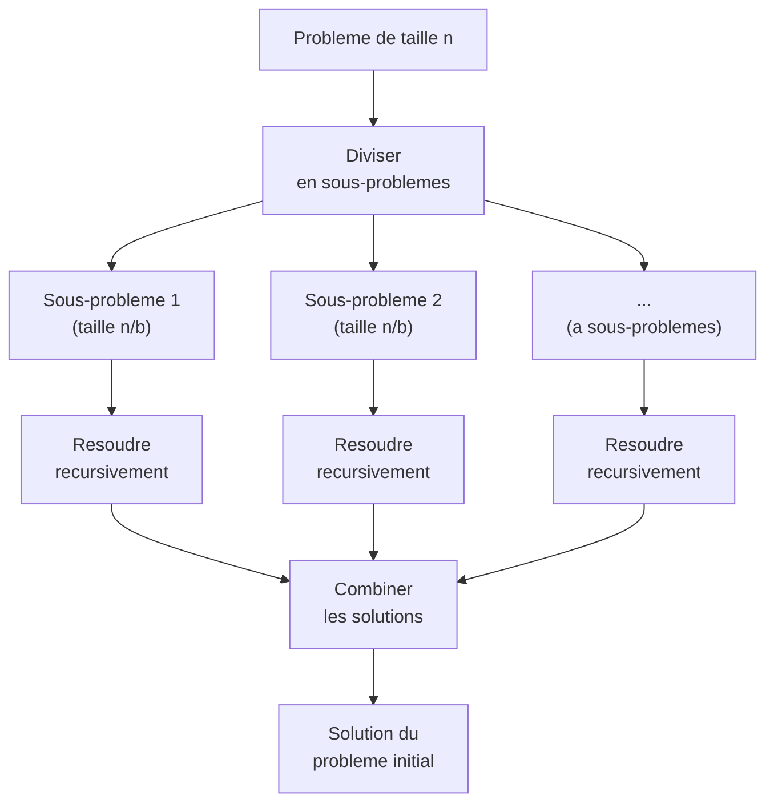
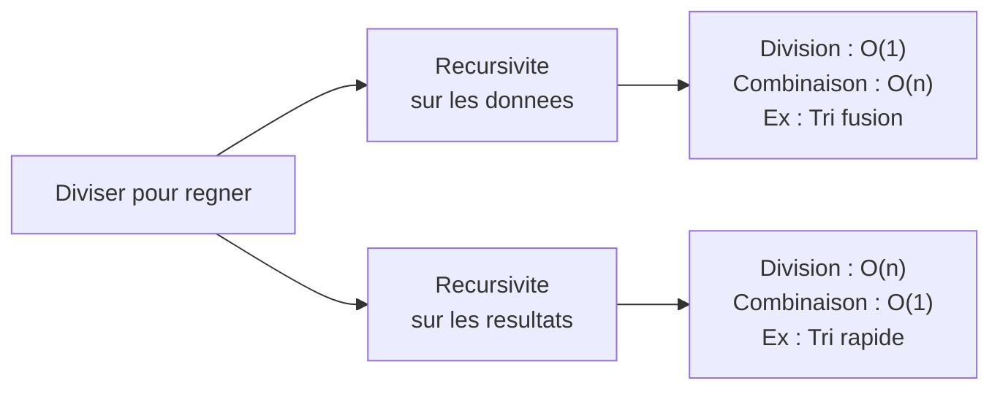
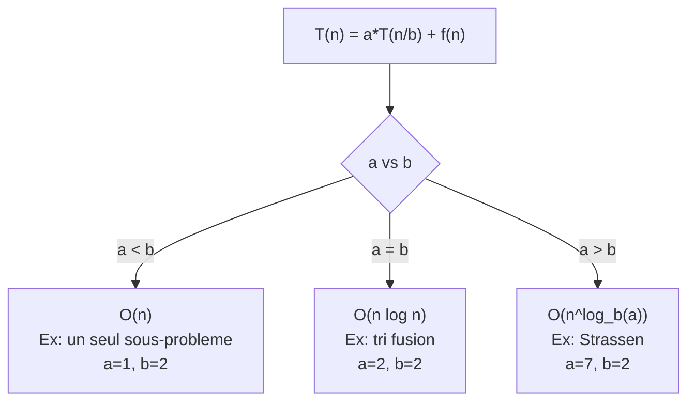

# Chapitre 3 -- Diviser pour regner

> **Idee centrale en une phrase :** Pour resoudre un gros probleme, on le coupe en morceaux, on resout chaque morceau, puis on assemble les solutions.

**Prerequis :** [Recurrences](02_recurrences.md)
**Chapitre suivant :** [Programmation dynamique ->](04_programmation_dynamique.md)

---

## 1. L'analogie du rangement de chambre

### Le probleme

Tu dois ranger 1000 livres par ordre alphabetique sur une etagere. Si tu essaies de tout ranger d'un coup, c'est le chaos. Mais si tu :

1. **Divises** les livres en deux tas de 500
2. **Ranges** chaque tas separement (en repetant la meme strategie)
3. **Fusionnes** les deux tas tries en intercalant les livres

Tu obtiens un rangement beaucoup plus rapide. C'est exactement le tri par fusion, et c'est le paradigme "diviser pour regner".



---

## 2. Le schema general

### Les trois etapes

Tout algorithme "diviser pour regner" suit le meme schema :

1. **DIVISER** : decomposer le probleme de taille n en a sous-problemes de taille n/b
2. **RESOUDRE** : resoudre recursivement chaque sous-probleme
3. **COMBINER** : assembler les solutions des sous-problemes pour obtenir la solution du probleme initial

### Les deux variantes (cours de Maud Marchal)

Le cours distingue deux facons d'appliquer la strategie :

**Variante 1 : Recursivite sur les donnees (ex : tri fusion)**

```
1. Separer les donnees en sous-ensembles       -> O(1)
2. Resoudre recursivement les sous-problemes
3. Effectuer un travail pour combiner           -> O(n)
```

Le travail est fait a la **recombinaison** (la fusion).

**Variante 2 : Recursivite sur les resultats (ex : tri rapide)**

```
1. Pre-traitement pour trouver le bon decoupage -> O(n)
2. Resoudre recursivement les sous-problemes
3. Les sous-resultats se combinent d'eux-memes  -> O(1)
```

Le travail est fait a la **division** (le partitionnement).



---

## 3. Complexite des algorithmes DPR

### 3.1 Cas ou un seul sous-probleme suffit

**Theoreme (du cours) :** Si T(n) = T(n/2) + g(n), avec T(1) = C, alors :

```
T(n) = C + somme(i=1 a E(log2(n))) de g(2^i)
```

**Application : Recherche dichotomique**

```python
def recherche_dicho(T, x, debut, fin):
    if debut > fin:
        return -1
    milieu = (debut + fin) // 2
    if T[milieu] == x:
        return milieu
    elif T[milieu] > x:
        return recherche_dicho(T, x, debut, milieu - 1)
    else:
        return recherche_dicho(T, x, milieu + 1, fin)
```

```
T(n) = T(n/2) + 2       (2 comparaisons par appel)
     = O(log n)
```

### 3.2 Cas general : le theoreme maitre

**Theoreme (du cours) :** Si T(n) = a*T(n/b) + c*n, avec T(1) = C, a > 1, b > 1, alors :

```
a < b  =>  T(n) = O(n)
a = b  =>  T(n) = O(n * log(n))
a > b  =>  T(n) = O(n^(log_b(a)))
```

### 3.3 Pourquoi l'equilibrage est important

Le cours insiste : les algorithmes DPR sont d'autant plus efficaces que les sous-ensembles sont de **meme taille**.

**Illustration : tri par insertion vs tri par fusion**

Le tri par insertion peut etre vu comme un DPR desequilibre :
- Un sous-probleme de taille n-1
- Un sous-probleme de taille 1

```
T(n) = T(n-1) + n  =>  T(n) = O(n^2)
```

Le tri par fusion est un DPR equilibre :
- Deux sous-problemes de taille n/2

```
T(n) = 2*T(n/2) + n  =>  T(n) = O(n log n)
```

---

## 4. Exemples classiques

### 4.1 Tri par fusion (Merge Sort)

**Principe :** Diviser le tableau en deux moities, trier chaque moitie recursivement, fusionner les deux moities triees.

```python
def tri_fusion(T, inf, sup):
    if inf < sup:
        mid = (inf + sup) // 2
        tri_fusion(T, inf, mid)
        tri_fusion(T, mid + 1, sup)
        fusionner(T, inf, mid, sup)

def fusionner(T, inf, mid, sup):
    gauche = T[inf:mid+1]
    droite = T[mid+1:sup+1]
    i, j, k = 0, 0, inf
    while i < len(gauche) and j < len(droite):
        if gauche[i] <= droite[j]:
            T[k] = gauche[i]
            i += 1
        else:
            T[k] = droite[j]
            j += 1
        k += 1
    while i < len(gauche):
        T[k] = gauche[i]
        i += 1
        k += 1
    while j < len(droite):
        T[k] = droite[j]
        j += 1
        k += 1
```

**Complexite :**

```
T(n) = 2*T(n/2) + O(n)      (fusionner coute O(n))
     = O(n log n)             (theoreme maitre, a = b = 2)
```

**Arbre d'appels pour T = [5, 2, 4, 6, 1, 3, 3, 6] :**

```
                [5,2,4,6,1,3,3,6]
               /                  \
        [5,2,4,6]            [1,3,3,6]
        /      \              /      \
     [5,2]   [4,6]        [1,3]   [3,6]
     / \      / \          / \      / \
   [5] [2]  [4] [6]     [1] [3]  [3] [6]
     \ /      \ /          \ /      \ /
     [2,5]   [4,6]        [1,3]   [3,6]
        \      /              \      /
        [2,4,5,6]            [1,3,3,6]
               \                  /
            [1,2,3,3,4,5,6,6]
```

### 4.2 Tri rapide (Quicksort)

**Principe :** Choisir un pivot, partitionner le tableau (elements < pivot a gauche, > pivot a droite), trier recursivement chaque partie.

```python
def tri_rapide(T, inf, sup):
    if inf < sup:
        pivot = partitionner(T, inf, sup)
        tri_rapide(T, inf, pivot - 1)
        tri_rapide(T, pivot + 1, sup)

def partitionner(T, inf, sup):
    pivot = T[sup]
    i = inf - 1
    for j in range(inf, sup):
        if T[j] <= pivot:
            i += 1
            T[i], T[j] = T[j], T[i]
    T[i+1], T[sup] = T[sup], T[i+1]
    return i + 1
```

**Complexite :**
- **Meilleur cas / cas moyen :** T(n) = 2*T(n/2) + O(n) = O(n log n)
- **Pire cas** (pivot toujours le min ou max) : T(n) = T(n-1) + O(n) = O(n^2)

### 4.3 Multiplication de grands entiers (Karatsuba)

**Probleme :** Multiplier deux nombres de n chiffres.

**Methode naive :** O(n^2) (multiplication posee a la main).

**Methode de Karatsuba :** On ecrit chaque nombre en deux moities :

```
x = a * 10^(n/2) + b
y = c * 10^(n/2) + d
```

Alors :

```
x * y = ac * 10^n + (ad + bc) * 10^(n/2) + bd
```

L'astuce : au lieu de calculer 4 multiplications (ac, ad, bc, bd), on n'en fait que 3 :

```
p1 = ac
p2 = bd
p3 = (a+b)(c+d) = ac + ad + bc + bd

Donc : ad + bc = p3 - p1 - p2
```

**Complexite :**

```
T(n) = 3*T(n/2) + O(n)
a = 3, b = 2, a > b
T(n) = O(n^(log2(3))) = O(n^1.585)
```

C'est mieux que O(n^2) !

### 4.4 Multiplication de matrices (Strassen)

**Probleme :** Multiplier deux matrices n x n.

**Methode naive :** 8 multiplications de matrices n/2 x n/2 => T(n) = 8*T(n/2) + O(n^2) = O(n^3).

**Methode de Strassen :** 7 multiplications au lieu de 8 :

```
T(n) = 7*T(n/2) + O(n^2)
a = 7, b = 2, a > b
T(n) = O(n^(log2(7))) = O(n^2.807)
```

### 4.5 Multiplication de polynomes

**Probleme :** Multiplier deux polynomes de degre n.

**Methode naive :** O(n^2).

**Methode DPR :** On decoupe chaque polynome en deux parties (termes de bas degre et termes de haut degre) et on applique une technique similaire a Karatsuba.

```
T(n) = 3*T(n/2) + O(n)  =>  O(n^1.585)
```

---

## 5. Algorithmes d'enveloppe convexe

Le cours couvre trois algorithmes pour calculer l'enveloppe convexe d'un ensemble de points.

### 5.1 Enveloppe rapide (QuickHull)

**Principe :** Similaire au tri rapide. On prend les deux points extremes (gauche et droite), puis on trouve recursivement les points les plus eloignes de chaque cote de la droite formee.

**Complexite :**
- Cas moyen : O(n log n)
- Pire cas : O(n^2)

### 5.2 Algorithme de Jarvis (marche de Jarvis)

**Principe :** On "enroule" un fil autour des points. A chaque etape, on cherche le point qui fait l'angle le plus petit avec la direction actuelle.

**Complexite :** O(n * h) ou h est le nombre de points sur l'enveloppe.

### 5.3 Scan de Graham

**Principe :**
1. Trier les points par angle polaire par rapport a un point de reference
2. Parcourir les points dans l'ordre et maintenir une pile des points de l'enveloppe
3. A chaque nouveau point, retirer de la pile les points qui ne font pas un virage a gauche

**Complexite :** O(n log n) (domine par le tri).

---

## 6. Schema recapitulatif de la complexite DPR



---

## 7. Pieges classiques

**Piege 1 : Confondre tri fusion et tri rapide**

- Tri fusion : travail a la **recombinaison** (fusion). Complexite O(n log n) dans TOUS les cas.
- Tri rapide : travail a la **division** (partitionnement). Complexite O(n^2) dans le pire cas.

**Piege 2 : Mal identifier a et b dans le theoreme maitre**

- **a** est le **nombre** de sous-problemes, pas leur taille.
- **b** est le **facteur de reduction** de la taille.

Exemple : si T(n) = 3*T(n/4) + n, alors a = 3, b = 4 (et non a = 4).

**Piege 3 : Oublier que le theoreme maitre a des conditions**

Le theoreme maitre tel que presente dans le cours suppose f(n) = c*n (lineaire). Pour d'autres formes de f(n), il faut utiliser la version complete du theoreme maitre ou une autre methode.

**Piege 4 : Sous-problemes desequilibres**

Le theoreme maitre suppose des sous-problemes de taille EGALE. Si les sous-problemes n'ont pas la meme taille (comme dans le pire cas du tri rapide), il ne s'applique pas.

**Piege 5 : Ne pas verifier le cas de base**

Tout algorithme DPR a besoin d'un **cas de base** (quand le probleme est assez petit pour etre resolu directement). Si le cas de base est mal defini, l'algorithme boucle indefiniment.

---

## 8. Recapitulatif

- **Diviser pour regner = Diviser + Resoudre recursivement + Combiner**.
- Deux variantes : recursivite sur les donnees (fusion) ou sur les resultats (partitionnement).
- La complexite est donnee par le **theoreme maitre** : comparer a (nb sous-problemes) et b (facteur de reduction).
- **Equilibre** : des sous-problemes de meme taille donnent de meilleurs resultats.
- Exemples classiques : tri fusion O(n log n), Karatsuba O(n^1.585), Strassen O(n^2.807).
- L'enveloppe convexe illustre le paradigme DPR en geometrie algorithmique.
