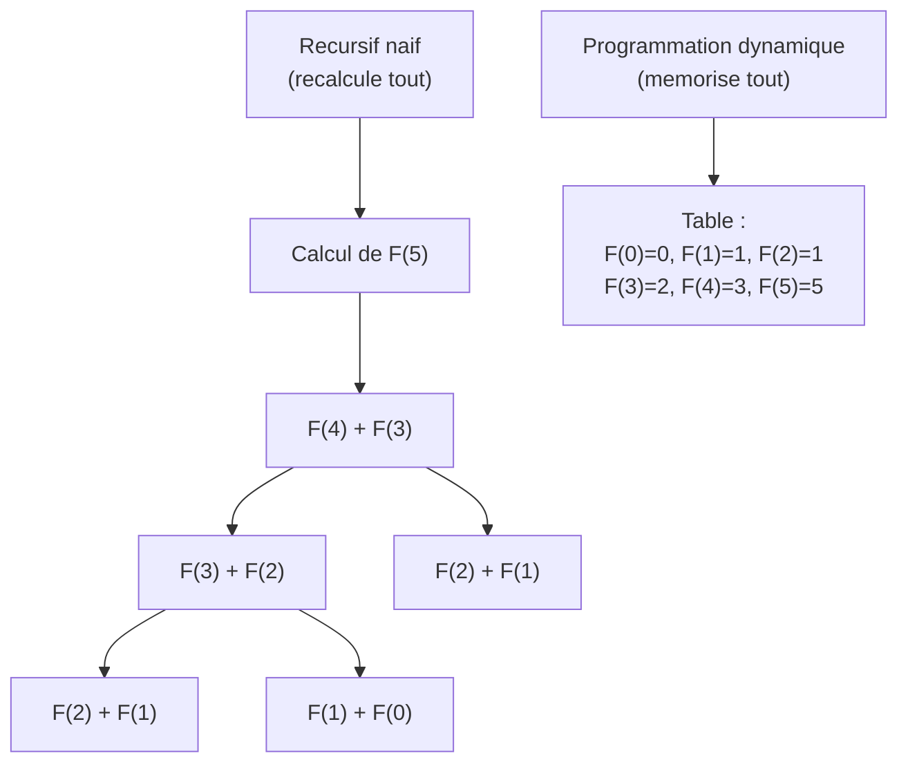
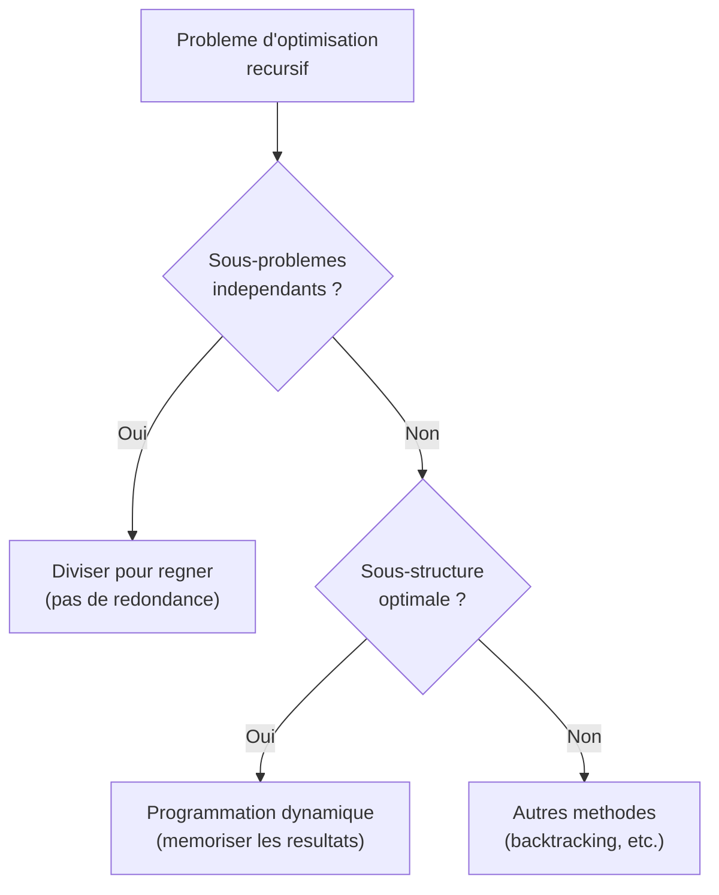
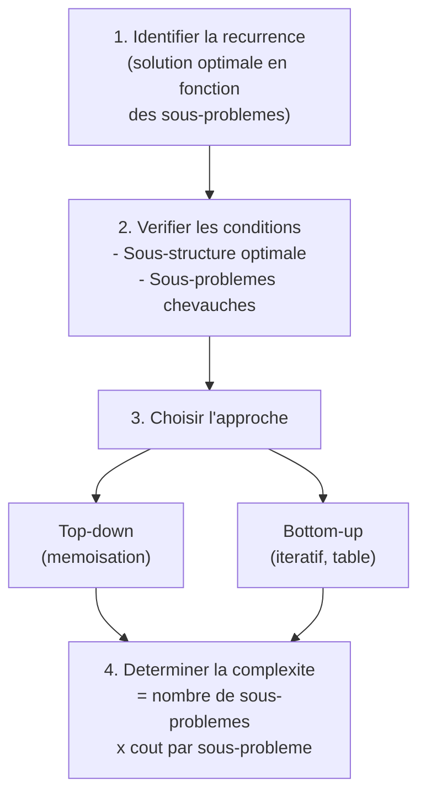

# Chapitre 4 -- Programmation dynamique

> **Idee centrale en une phrase :** Quand un algorithme recursif recalcule les memes choses encore et encore, on memorise les resultats pour ne jamais faire deux fois le meme calcul.

**Prerequis :** [Diviser pour regner](03_diviser_regner.md)
**Chapitre suivant :** [Algorithmes gloutons ->](05_algorithmes_gloutons.md)

---

## 1. L'analogie de la cuisine

### Le probleme des calculs redondants

Imaginons que tu prepares un repas pour 20 personnes. Chaque plat necessite une sauce de base. Si tu refais la sauce depuis zero pour chaque plat, tu perds un temps enorme. La solution : tu prepares la sauce **une seule fois** et tu la reutilises pour tous les plats.

C'est exactement ce que fait la programmation dynamique : au lieu de recalculer les memes sous-problemes, on les **memorise** dans une table.



**Lecture du diagramme :** A gauche, l'approche recursive naive recalcule F(2) et F(1) plusieurs fois. A droite, la programmation dynamique calcule chaque valeur une seule fois et la stocke.

---

## 2. Quand utiliser la programmation dynamique ?

Deux conditions doivent etre reunies :

### 2.1 Sous-structure optimale (principe d'optimalite de Bellman)

La solution optimale du probleme contient les solutions optimales des sous-problemes.

**Exemple :** Si le plus court chemin de A a C passe par B, alors le sous-chemin de A a B est aussi le plus court chemin de A a B.

### 2.2 Sous-problemes chevauches (overlapping subproblems)

Les memes sous-problemes apparaissent plusieurs fois dans l'arbre recursif.

**Difference cle avec "diviser pour regner" :**
- **DPR** : les sous-problemes sont **independants** (pas de chevauchement)
- **Programmation dynamique** : les sous-problemes se **chevauchent** (redondance)



---

## 3. La methode en 4 etapes

Le cours de Maud Marchal donne cette methodologie :

### Etape 1 : Caracteriser la structure d'une solution optimale

Identifier les sous-problemes et montrer que la solution optimale du probleme global contient les solutions optimales des sous-problemes.

### Etape 2 : Definir recursivement la valeur d'une solution optimale

Ecrire la **formule de recurrence** qui exprime la solution d'un probleme en fonction des solutions de sous-problemes plus petits.

### Etape 3 : Calculer la valeur en remontant progressivement

Remplir une **table** en commencant par les cas de base (les plus petits sous-problemes) et en remontant jusqu'au probleme initial.

### Etape 4 (facultatif) : Construire la solution optimale

A partir de la table remplie, reconstituer quelle combinaison de choix mene a la solution optimale.

---

## 4. Les deux approches : top-down et bottom-up

### 4.1 Approche recursive avec memoisation (top-down)

On garde la structure recursive, mais on stocke les resultats dans un dictionnaire :

```python
# Pseudo-code general
memo = {}

def f_dyn(parametres):
    if parametres in memo:
        return memo[parametres]       # deja calcule
    if cas_de_base(parametres):
        resultat = g(parametres)
    else:
        resultat = h(f_dyn(p1), ..., f_dyn(pk))
    memo[parametres] = resultat       # on memorise
    return resultat
```

**Avantage :** Facile a implementer a partir de la version recursive naive.
**Inconvenient :** Overhead des appels recursifs et de la table de hachage.

### 4.2 Approche iterative (bottom-up)

On remplit la table dans un ordre precis, des plus petits sous-problemes vers les plus grands :

```python
# Pseudo-code general
def f_iter(n):
    table = initialiser_cas_de_base()
    for taille croissante des sous-problemes:
        table[probleme] = calculer a partir de table[sous-problemes]
    return table[probleme_principal]
```

**Avantage :** Pas d'overhead recursif, possibilite d'optimiser la memoire.
**Inconvenient :** Il faut determiner l'ordre de remplissage de la table.

---

## 5. Exemple fondateur : Fibonacci

### 5.1 Version recursive naive -- O(2^n)

```python
def fibo(n):
    if n <= 1:
        return n
    return fibo(n-1) + fibo(n-2)
```

**Pourquoi c'est catastrophique ?** L'arbre des appels est un arbre binaire quasi-complet de profondeur n. Le nombre d'appels est environ 2^n.

Pour n = 40, ca fait plus d'un milliard d'appels. Pour n = 100, c'est astronomique.

### 5.2 Le graphe des appels : visualiser la redondance

```
Arbre des appels (recursif naif) :

              F(5)
             /    \
          F(4)    F(3)
         /   \    /  \
       F(3) F(2) F(2) F(1)
      / \   / \   / \
    F(2) F(1) F(1) F(0) F(1) F(0)
    / \
  F(1) F(0)

=> F(2) est calcule 3 fois, F(1) est calcule 5 fois !

Graphe des appels (sans redondance) :

    F(5) --> F(4) --> F(3) --> F(2) --> F(1) --> F(0)

=> Chaque valeur n'apparait qu'une fois.
```

### 5.3 Version avec memoisation -- O(n)

```python
memo = {}

def fibo_memo(n):
    if n in memo:
        return memo[n]
    if n <= 1:
        return n
    memo[n] = fibo_memo(n-1) + fibo_memo(n-2)
    return memo[n]
```

### 5.4 Version iterative -- O(n) en temps, O(1) en memoire

```python
def fibo_iter(n):
    if n <= 1:
        return n
    a, b = 0, 1
    for i in range(2, n+1):
        a, b = b, a + b
    return b
```

**Observation cle :** On n'a besoin que des **deux valeurs precedentes**, pas de toute la table. C'est une optimisation memoire tres courante en programmation dynamique.

---

## 6. Combinaisons C(n, p) -- le triangle de Pascal

### Formule de recurrence

```
C(n, p) = C(n-1, p) + C(n-1, p-1)    pour 0 < p < n
C(n, 0) = C(n, n) = 1
```

### Version recursive naive -- exponentielle

```python
def C(n, p):
    if p == 0 or p == n:
        return 1
    return C(n-1, p) + C(n-1, p-1)
```

### Version dynamique iterative -- O(n*p)

```python
def C_dyn(n, p):
    # Table triangulaire (triangle de Pascal)
    T = [[0] * (p+1) for _ in range(n+1)]
    for i in range(n+1):
        T[i][0] = 1
        if i <= p:
            T[i][i] = 1
    for i in range(2, n+1):
        for j in range(1, min(i, p+1)):
            T[i][j] = T[i-1][j] + T[i-1][j-1]
    return T[n][p]
```

---

## 7. Reconnaissance de chaines bruitees (edit distance)

C'est un exemple majeur du cours (Cours 4 / CTD4). C'est aussi la **distance d'edition** (distance de Levenshtein).

### Le probleme

On a deux chaines A = a1...an et B = b1...bm. La chaine B est une version "bruitee" de A. On veut trouver le **cout minimal** de transformation de A en B, avec trois operations :

- **Disparition** d'un caractere : cout D(a)
- **Insertion** d'un caractere : cout I(a)
- **Substitution** d'un caractere par un autre : cout S(a, b)

### Formule de recurrence

Soit c(i, j) le cout minimal pour transformer A[1..i] en B[1..j].

```
c(0, 0) = 0
c(i, 0) = c(i-1, 0) + D(ai)         (supprimer tous les caracteres de A)
c(0, j) = c(0, j-1) + I(bj)          (inserer tous les caracteres de B)

c(i, j) = min {
    c(i-1, j) + D(ai),               (supprimer ai)
    c(i, j-1) + I(bj),               (inserer bj)
    c(i-1, j-1) + S(ai, bj)          (substituer ai par bj)
}
```

Si ai = bj, alors S(ai, bj) = 0 (pas de substitution necessaire).

### Implementation

```python
def edit_distance(A, B, D, I, S):
    n, m = len(A), len(B)
    # Table (n+1) x (m+1)
    c = [[0] * (m+1) for _ in range(n+1)]
    
    # Initialisation
    for i in range(1, n+1):
        c[i][0] = c[i-1][0] + D(A[i-1])
    for j in range(1, m+1):
        c[0][j] = c[0][j-1] + I(B[j-1])
    
    # Remplissage
    for i in range(1, n+1):
        for j in range(1, m+1):
            suppr = c[i-1][j] + D(A[i-1])
            inser = c[i][j-1] + I(B[j-1])
            subst = c[i-1][j-1] + S(A[i-1], B[j-1])
            c[i][j] = min(suppr, inser, subst)
    
    return c[n][m]
```

**Complexite :** O(n * m) en temps et en espace.

### Visualisation du remplissage

```
          ""  B  R  U  I  T
    ""  [  0   1   2   3   4   5 ]
    B   [  1   0   1   2   3   4 ]
    R   [  2   1   0   1   2   3 ]
    U   [  3   2   1   0   1   2 ]
    T   [  4   3   2   1   1   1 ]

Chaque case c[i][j] est le minimum de :
  - la case au-dessus + cout suppression
  - la case a gauche + cout insertion
  - la case en diagonale + cout substitution
```

---

## 8. Multiplication de n matrices

C'est le deuxieme exemple majeur du cours (Cours 4 / CTD4).

### Le probleme

On doit multiplier n matrices M1 * M2 * ... * Mn. L'ordre de multiplication affecte le nombre d'operations scalaires.

**Exemple :** Matrices de dimensions 10x30, 30x5, 5x60.

- (M1 * M2) * M3 : 10*30*5 + 10*5*60 = 1500 + 3000 = **4500 operations**
- M1 * (M2 * M3) : 30*5*60 + 10*30*60 = 9000 + 18000 = **27000 operations**

Le parenthesage optimal fait une enorme difference !

### Formule de recurrence

Soit m(i, j) le nombre minimal d'operations pour calculer Mi * ... * Mj. La matrice Mi a des dimensions p(i-1) x p(i).

```
m(i, i) = 0                         (une seule matrice, rien a faire)
m(i, j) = min(k de i a j-1) {
    m(i, k) + m(k+1, j) + p(i-1)*p(k)*p(j)
}
```

### Implementation

```python
def mult_matrices(p):
    """p = [p0, p1, ..., pn] dimensions des matrices.
    Mi a dimensions p[i-1] x p[i]."""
    n = len(p) - 1  # nombre de matrices
    m = [[0] * n for _ in range(n)]
    
    # Remplir par diagonales croissantes
    for longueur in range(2, n+1):        # longueur de la sous-chaine
        for i in range(n - longueur + 1):
            j = i + longueur - 1
            m[i][j] = float('inf')
            for k in range(i, j):
                cout = m[i][k] + m[k+1][j] + p[i]*p[k+1]*p[j+1]
                if cout < m[i][j]:
                    m[i][j] = cout
    
    return m[0][n-1]
```

**Complexite :** O(n^3) en temps, O(n^2) en espace.

---

## 9. Triangulation optimale d'un polygone convexe

C'est le probleme des DS 2017 et 2021. C'est une application directe de la programmation dynamique.

### Le probleme

On a un polygone convexe a n sommets. On veut le decouper en triangles (triangulation) en minimisant la somme des perimetres des triangles.

### Formule de recurrence

Soit t[i, j] le poids de la triangulation optimale du sous-polygone (v(i-1), ..., vj).

```
t[i, j] = 0                                    si i = j
t[i, j] = min(k de i a j-1) {
    t[i, k] + t[k+1, j] + W(v(i-1), vk, vj)
}                                               si i < j
```

La valeur de la triangulation optimale du polygone complet P = (v0, v1, ..., v(n-1)) est t[1, n-1].

**Remarque :** Cette formule est tres similaire a celle de la multiplication de matrices. C'est un patron recurrent en programmation dynamique.

---

## 10. Probleme du chemin de cout minimal dans une matrice

C'est l'exemple des tutoriaux (Session 1) et du cours.

### Le probleme

Dans une matrice n x n, trouver le chemin de cout minimal de (0,0) a (n-1,n-1) en ne pouvant aller que vers la droite ou vers le bas.

### Formule de recurrence

```
dp[0][0] = a[0][0]
dp[i][0] = dp[i-1][0] + a[i][0]         (premiere colonne)
dp[0][j] = dp[0][j-1] + a[0][j]         (premiere ligne)
dp[i][j] = a[i][j] + min(dp[i-1][j], dp[i][j-1])
```

### Implementation

```python
def chemin_minimal(a):
    n = len(a)
    dp = [[0]*n for _ in range(n)]
    dp[0][0] = a[0][0]
    for i in range(1, n):
        dp[i][0] = dp[i-1][0] + a[i][0]
    for j in range(1, n):
        dp[0][j] = dp[0][j-1] + a[0][j]
    for i in range(1, n):
        for j in range(1, n):
            dp[i][j] = a[i][j] + min(dp[i-1][j], dp[i][j-1])
    return dp[n-1][n-1]
```

---

## 11. Schema recapitulatif de la programmation dynamique



---

## 12. Pieges classiques

**Piege 1 : Confondre DPR et programmation dynamique**

- DPR : sous-problemes **independants** (ex : tri fusion)
- Prog. dyn. : sous-problemes **chevauches** (ex : Fibonacci)

Si tu utilises la programmation dynamique quand les sous-problemes sont independants, ca marche mais c'est inutilement complique. Et inversement, utiliser DPR sans memoisation quand les sous-problemes se chevauchent mene a une complexite exponentielle.

**Piege 2 : Oublier l'initialisation de la table**

Les cas de base doivent etre correctement initialises AVANT de remplir le reste de la table. Par exemple, pour la distance d'edition, il faut initialiser la premiere ligne ET la premiere colonne.

**Piege 3 : Mauvais ordre de remplissage**

En bottom-up, l'ordre de remplissage est crucial. Il faut que quand on calcule table[i][j], toutes les valeurs dont elle depend soient deja calculees. En general, on remplit par taille croissante de sous-probleme.

**Piege 4 : Confondre le cout optimal et la solution optimale**

La table donne le **cout** (ou la valeur) de la solution optimale, pas la solution elle-meme. Pour reconstituer la solution, il faut soit garder les choix faits a chaque etape (dans une table auxiliaire), soit remonter dans la table a partir de la solution finale.

**Piege 5 : Oublier que la complexite spatiale peut etre reduite**

Pour Fibonacci, on n'a besoin que des 2 valeurs precedentes. Pour la distance d'edition, si on ne veut que le cout (pas le chemin), on peut ne garder que 2 lignes de la table au lieu de toute la table.

---

## 13. Recapitulatif

- **Programmation dynamique = recursion + memorisation** des resultats.
- Deux conditions : **sous-structure optimale** et **sous-problemes chevauches**.
- Deux approches : **top-down** (memoisation) et **bottom-up** (iteratif).
- **Methodologie en 4 etapes** : identifier la recurrence, verifier les conditions, remplir la table, (optionnel) reconstituer la solution.
- Exemples classiques du cours : **Fibonacci**, **C(n,p)**, **distance d'edition**, **multiplication de matrices**, **triangulation de polygone**, **chemin minimal dans une matrice**.
- En DS, le probleme de programmation dynamique vaut typiquement **10-14 points sur 20**.
