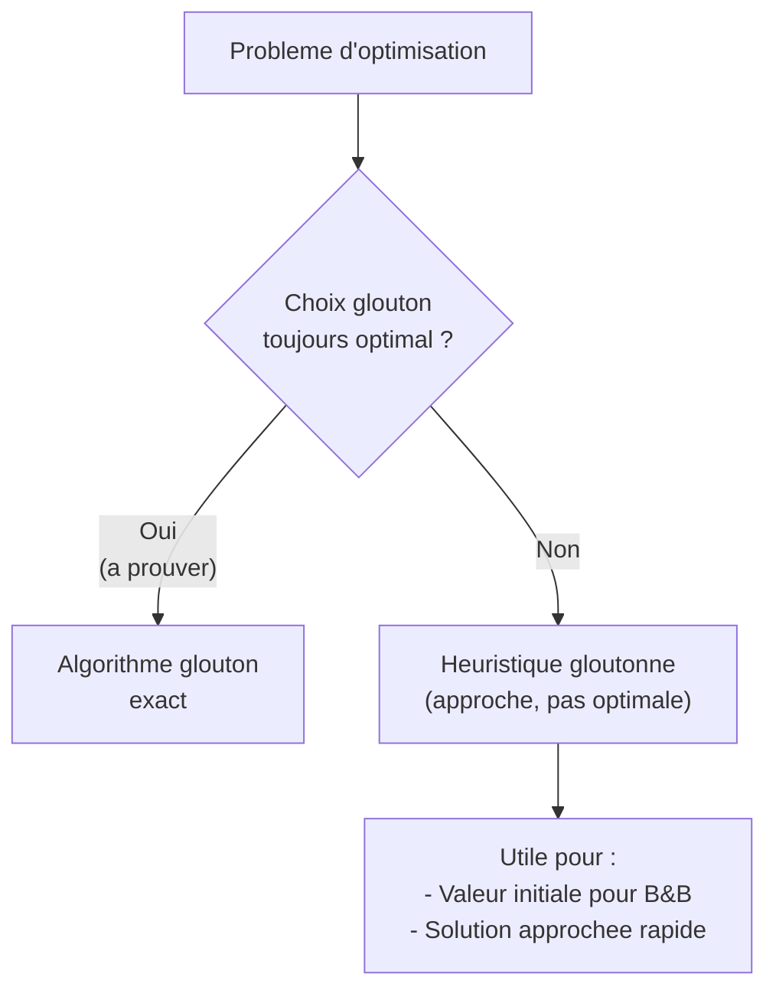
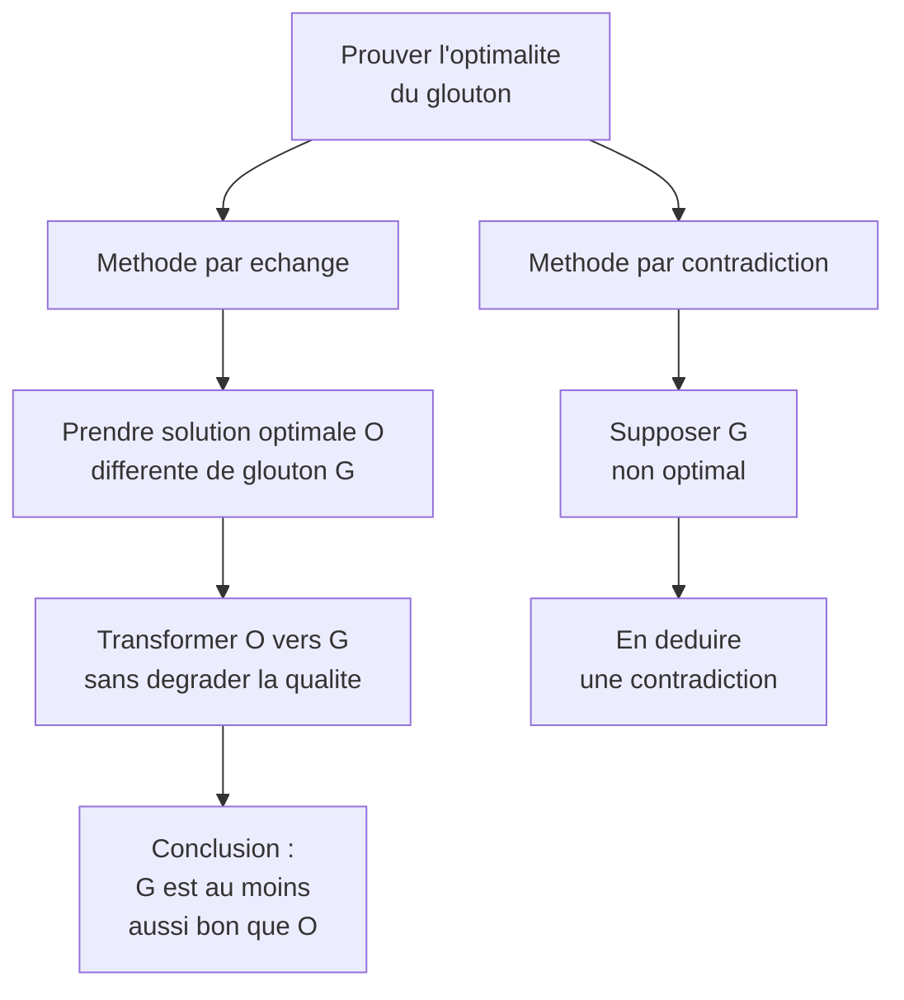

# Chapitre 5 -- Algorithmes gloutons

> **Idee centrale en une phrase :** A chaque etape, on fait le choix qui semble le meilleur sur le moment, sans jamais revenir en arriere -- et parfois, ca suffit pour obtenir la solution optimale.

**Prerequis :** [Programmation dynamique](04_programmation_dynamique.md)
**Chapitre suivant :** [Exploration et heuristiques ->](06_exploration_heuristiques.md)

---

## 1. L'analogie du rendu de monnaie

### Le probleme

Tu es caissier et tu dois rendre 37 centimes a un client. Tu as des pieces de 20, 10, 5, 2 et 1 centimes. Instinctivement, tu prends **la plus grosse piece possible** a chaque etape :

1. 37 centimes : je prends une piece de **20** -> reste 17
2. 17 centimes : je prends une piece de **10** -> reste 7
3. 7 centimes : je prends une piece de **5** -> reste 2
4. 2 centimes : je prends une piece de **2** -> reste 0

Total : 4 pieces. C'est optimal ! Tu as utilise un **algorithme glouton** : a chaque etape, tu fais le choix localement optimal (la plus grosse piece), sans jamais revenir sur tes choix.

### Attention : ca ne marche pas toujours !

Avec des pieces de 6, 4 et 1 centimes, pour rendre 8 centimes :
- Glouton : 6 + 1 + 1 = 3 pieces
- Optimal : 4 + 4 = 2 pieces

L'algorithme glouton n'est pas toujours optimal. Il faut **prouver** qu'il l'est pour chaque probleme.



---

## 2. Le cadre general

### 2.1 Problemes d'optimisation

Un probleme d'optimisation se compose de :

- Un **ensemble fini** d'elements E
- Des **solutions realisables** : parties de E qui satisfont certaines contraintes
- Une **fonction objectif** a maximiser ou minimiser

### 2.2 L'algorithme glouton

A chaque etape, l'algorithme :

1. Fait un **choix definitif** (pas de retour en arriere)
2. Ce choix est guide par un **critere local** de selection
3. Verifie que la contrainte est toujours respectee

```python
# Schema general (du cours)
def chercher_glouton(i, X, S):
    y = choix(S[i])           # meilleur element selon le critere local
    if predicat_partiel(X, i, y):   # la contrainte est respectee ?
        X[i] = y
        if est_solution(X, i):      # solution complete ?
            return SUCCES
        else:
            return chercher_glouton(i+1, X, S)
    else:
        return ECHEC
```

### 2.3 Complexite typique

```
O(n log n) + O(n * f(n)) + O(n * g(n))
```

ou :
- n log n : tri initial selon le critere
- n * f(n) : verification de la contrainte et ajout pour chaque element
- n * g(n) : verification du predicat partiel

Les algorithmes gloutons sont donc generalement **tres efficaces** (polynomiaux).

---

## 3. Algorithmes gloutons exacts

### 3.1 Reservation de salles (Interval Scheduling)

**Probleme :** On a n activites avec des heures de debut et fin. On veut planifier le **maximum d'activites** qui ne se chevauchent pas.

**Strategie gloutonne :** Trier les activites par **heure de fin croissante**, puis selectionner chaque activite compatible avec les precedentes.

```python
def reservation_salles(activites):
    # Trier par heure de fin
    activites.sort(key=lambda a: a.fin)
    
    selection = [activites[0]]
    derniere_fin = activites[0].fin
    
    for i in range(1, len(activites)):
        if activites[i].debut >= derniere_fin:
            selection.append(activites[i])
            derniere_fin = activites[i].fin
    
    return selection
```

**Pourquoi c'est optimal ?** En choisissant l'activite qui finit le plus tot, on laisse le maximum de place pour les activites suivantes.

**Complexite :** O(n log n) pour le tri + O(n) pour la selection = O(n log n).

**Preuve d'optimalite (methode par echange) :**

Soit G = {g1, g2, ..., gk} la solution gloutonne et O = {o1, o2, ..., om} une solution optimale, avec k < m par l'absurde. On peut montrer qu'on peut remplacer o1 par g1 (qui finit plus tot) sans perdre de solution. En repetant, on obtient une solution de taille au moins k, contradiction.

### 3.2 Arbre de recouvrement minimal (Minimum Spanning Tree)

**Probleme :** Dans un graphe pondere connexe, trouver l'arbre couvrant de poids minimal.

#### Algorithme de Kruskal

**Strategie :** Trier les aretes par poids croissant, ajouter chaque arete si elle ne cree pas de cycle.

```python
def kruskal(graphe):
    aretes = trier_par_poids(graphe.aretes)
    foret = UnionFind(graphe.sommets)
    arbre = []
    
    for arete in aretes:
        u, v = arete.extremites
        if foret.find(u) != foret.find(v):
            arbre.append(arete)
            foret.union(u, v)
    
    return arbre
```

**Complexite :** O(E log E) ou E est le nombre d'aretes.

#### Algorithme de Prim

**Strategie :** Partir d'un sommet, a chaque etape ajouter l'arete de poids minimal qui connecte un sommet de l'arbre a un sommet hors de l'arbre.

**Complexite :** O(E log V) avec un tas binaire.

### 3.3 Plus courts chemins : Dijkstra

**Strategie :** Depuis un sommet source, toujours explorer le sommet non visite le plus proche.

```python
def dijkstra(graphe, source):
    dist = {v: float('inf') for v in graphe.sommets}
    dist[source] = 0
    visite = set()
    
    while len(visite) < len(graphe.sommets):
        # Choisir le sommet non visite le plus proche
        u = min((v for v in graphe.sommets if v not in visite),
                key=lambda v: dist[v])
        visite.add(u)
        
        for v, poids in graphe.voisins(u):
            if dist[u] + poids < dist[v]:
                dist[v] = dist[u] + poids
    
    return dist
```

**Complexite :** O(V^2) avec un tableau, O((V+E) log V) avec un tas.

### 3.4 Code de Huffman

**Probleme :** Compresser un texte en attribuant des codes binaires de longueur variable aux caracteres, les plus frequents ayant les codes les plus courts.

**Strategie gloutonne :** Construire un arbre binaire en fusionnant toujours les deux noeuds de plus petite frequence.

**Complexite :** O(n log n) ou n est le nombre de caracteres distincts.

---

## 4. Algorithmes gloutons inexacts (heuristiques gloutonnes)

### 4.1 Traversee de matrice

**Probleme (du cours) :** Se deplacer de (1,1) a (n,n) dans une matrice en ne pouvant aller que a droite ou en bas. Minimiser la somme des valeurs traversees.

**Strategie gloutonne :** A chaque etape, choisir la case adjacente de plus petite valeur.

**Est-ce optimal ?** Non ! La programmation dynamique donne la vraie solution optimale.

```
Exemple :
    1  10  10
    1  10  10
    1   1   1

Glouton (toujours le min local) : 1 -> 1 -> 1 -> 1 -> 1 = 5  (va en bas puis a droite)
                                   C'est optimal ici par chance.

Mais :
    1  1  1
    10 10 1
    10 10 1

Glouton : 1 -> 1 -> 1 -> 1 -> 1 = 5 (va a droite puis en bas)
Optimal  : pareil ici.
```

Le glouton n'est PAS toujours optimal pour ce probleme. En general, il faut la programmation dynamique.

### 4.2 Le voyageur de commerce (TSP)

**Probleme :** Trouver le circuit le plus court passant par toutes les villes.

**Heuristique gloutonne :** A chaque etape, aller a la ville non visitee la plus proche.

**Resultat :** Pas optimal en general, mais donne une bonne approximation rapidement. Utile comme point de depart pour des methodes plus sophistiquees.

---

## 5. Comment prouver l'optimalite

Le cours presente deux methodes :

### 5.1 Methode par echange

1. Prendre une solution optimale quelconque differente de la solution gloutonne
2. Montrer qu'on peut la transformer en une solution au moins aussi bonne ET plus proche de la solution gloutonne
3. Par induction, la solution gloutonne est optimale

### 5.2 Methode par contradiction

1. Supposer que la solution gloutonne n'est pas optimale
2. Montrer que cela mene a une contradiction



---

## 6. Comparaison des paradigmes

| Critere | Diviser pour regner | Prog. dynamique | Glouton |
|---------|-------------------|-----------------|---------|
| Sous-problemes | Independants | Chevauches | Pas de decomposition |
| Choix | Aucun (on resout tout) | On choisit apres avoir resolu | On choisit d'abord |
| Retour arriere | Non | Non (mais on explore tout) | Non |
| Complexite typique | O(n log n) | O(n^2) ou O(n^3) | O(n log n) |
| Optimalite | Toujours (si correct) | Toujours (si correct) | A prouver |

---

## 7. Problemes d'affectation et d'ordonnancement

Le cours mentionne ces problemes comme exemples classiques d'algorithmes gloutons :

### Ordonnancement de taches

**Probleme :** n taches a effectuer, chacune avec un temps de traitement. Minimiser le temps d'attente moyen.

**Strategie gloutonne :** Trier les taches par temps de traitement croissant (SJF -- Shortest Job First).

**Preuve :** Si on intervertit deux taches adjacentes ti et tj avec ti > tj, le temps d'attente total augmente. Donc l'ordre croissant est optimal.

---

## 8. Pieges classiques

**Piege 1 : Supposer que le glouton est optimal sans preuve**

Le fait qu'un algorithme glouton donne de bons resultats sur quelques exemples ne prouve rien. Il faut une preuve formelle (par echange ou par contradiction).

**Piege 2 : Choisir le mauvais critere glouton**

Pour la reservation de salles, trier par **duree** (plus courte d'abord) ne donne PAS l'optimum. Trier par **heure de fin** est le bon critere. Le choix du critere est crucial.

**Piege 3 : Confondre glouton et programmation dynamique**

- Glouton : on fait UN choix a chaque etape, sans explorer les alternatives.
- Prog. dyn. : on explore TOUTES les alternatives et on garde la meilleure.

Le glouton est plus rapide mais ne marche que quand l'optimalite locale implique l'optimalite globale.

**Piege 4 : Oublier que le glouton inexact a des applications**

Meme quand le glouton n'est pas optimal, il est utile :
- Comme **valeur initiale** pour le branch-and-bound
- Comme **solution approchee** quand le probleme est NP-difficile
- Comme **borne** pour l'elagage

---

## 9. Recapitulatif

- **Glouton = choix local optimal a chaque etape, sans retour arriere**.
- Deux types : **exact** (optimal prouve) et **inexact** (heuristique).
- Complexite typique : **O(n log n)** (domine par le tri).
- Exemples exacts : reservation de salles, Kruskal, Prim, Dijkstra, Huffman.
- Exemples inexacts : voyageur de commerce, traversee de matrice.
- Pour prouver l'optimalite : methode par **echange** ou par **contradiction**.
- Le glouton est souvent compare a la programmation dynamique en DS : "le glouton donne-t-il l'optimum ? Sinon, utiliser la prog. dyn."
