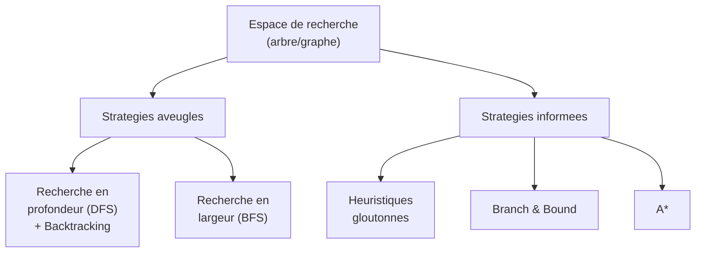
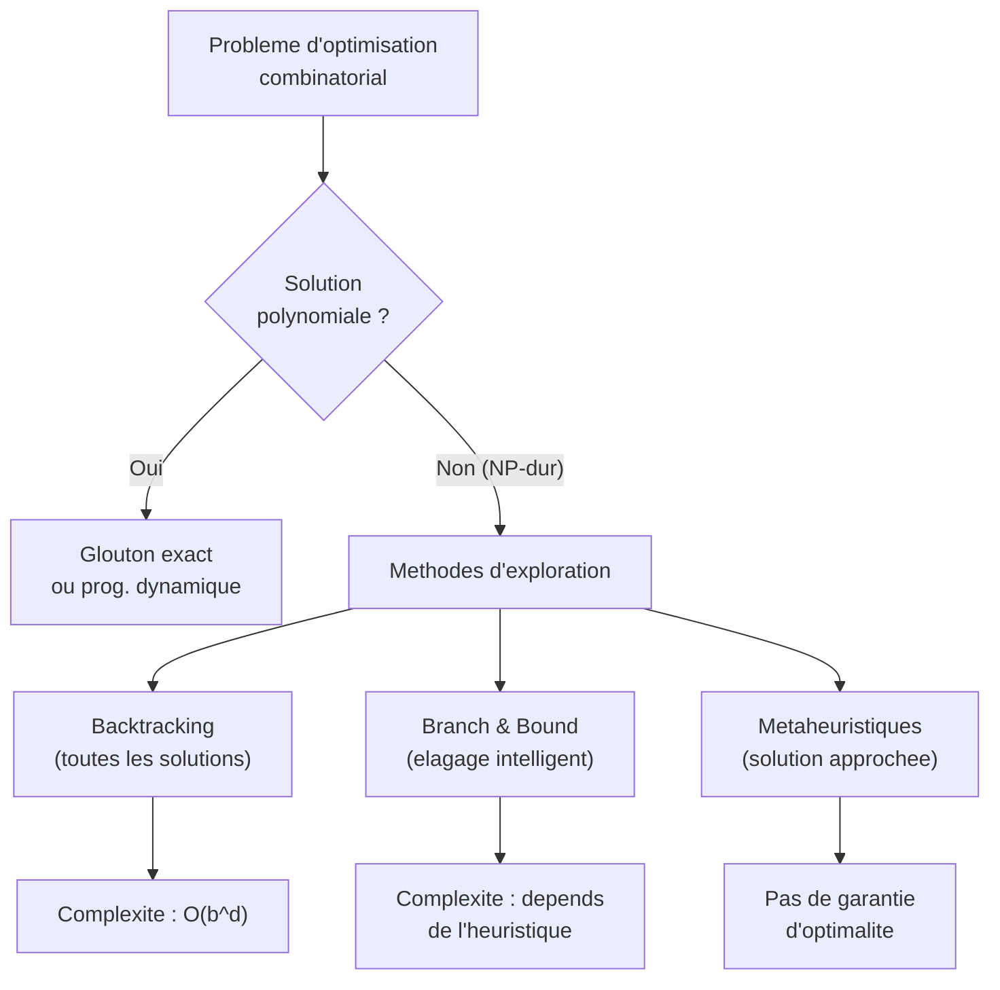

# Chapitre 6 -- Exploration d'arbres et heuristiques

> **Idee centrale en une phrase :** Quand on ne peut pas eviter d'explorer un grand espace de solutions, on utilise des strategies intelligentes pour eviter d'explorer les branches inutiles.

**Prerequis :** [Algorithmes gloutons](05_algorithmes_gloutons.md)

---

## 1. L'analogie du labyrinthe

### Le probleme

Tu es dans un labyrinthe et tu cherches la sortie. Tu as deux strategies de base :

- **Profondeur d'abord (DFS)** : tu avances toujours tout droit. Quand tu es bloque, tu reviens au dernier croisement et tu essaies une autre direction. C'est le **backtracking**.
- **Largeur d'abord (BFS)** : tu explores d'abord toutes les salles a 1 pas de toi, puis celles a 2 pas, etc. Ca garantit de trouver le chemin le plus court.

Mais le labyrinthe peut etre immense. Heureusement, tu as un sens de l'orientation (une **heuristique**) qui te dit "la sortie est probablement par la". Ca te permet d'explorer les branches les plus prometteuses en priorite.



---

## 2. Representation de l'espace de recherche

### 2.1 Arbre vs Graphe

**Representation en arbre :**
- A chaque fois qu'on genere un etat, on le relie a son predecesseur SANS verifier s'il a deja ete genere
- Avantage : rapide (pas de test d'occurrence)
- Inconvenient : duplication d'etats, memoire et temps gaspilles

**Representation en graphe :**
- Avant de stocker un nouvel etat, on verifie s'il existe deja
- Avantage : pas de duplication
- Inconvenient : test d'occurrence couteux

### 2.2 Exemple des explorateurs et cannibales

C'est un probleme classique du cours. Trois cannibales et trois explorateurs doivent traverser un fleuve avec une barque de 2 places, sans jamais laisser les cannibales en superiorite numerique sur une rive.

Un etat est represente par (X, Y, P) ou X = nb explorateurs, Y = nb cannibales, P = position de la barque (Gauche/Droite). L'etat initial est (3,3,G), l'objectif est (0,0,D).

L'espace de recherche est un arbre (ou graphe) ou chaque noeud est un etat et chaque arete est un deplacement de la barque.

---

## 3. Recherche en profondeur et backtracking

### 3.1 Principe

Le backtracking (retour arriere) est une methode systematique pour explorer l'arbre de recherche :

1. A chaque noeud, on choisit une branche a explorer
2. On descend dans cette branche recursivement
3. Si on atteint une impasse (pas de solution), on **remonte** au noeud precedent et on essaie une autre branche

```python
# Schema general du backtracking
def backtrack(etat):
    if est_solution(etat):
        return etat
    for choix in choix_possibles(etat):
        nouvel_etat = appliquer(etat, choix)
        if est_valide(nouvel_etat):
            resultat = backtrack(nouvel_etat)
            if resultat is not None:
                return resultat
    return None  # impasse, on remonte
```

### 3.2 L'algorithme general (du cours)

```python
# Schema du cours de Maud Marchal
def chercher(i, X):
    """Recherche par essais successifs"""
    for y in S[i]:                    # pour chaque choix possible
        if PP(X, i, y):              # si le predicat partiel est verifie
            X[i] = y
            modifier(y)              # mettre a jour l'etat
            if candidat(i):          # si c'est une solution complete
                SUCCES
            else:
                chercher(i+1, X)     # continuer la recherche
            restituer(y)             # annuler le choix (backtrack)
```

### 3.3 Exemple : le probleme des N reines

**Probleme :** Placer N reines sur un echiquier N x N de telle sorte qu'aucune reine n'en attaque une autre.

```python
def n_reines(n):
    colonnes = [-1] * n  # colonnes[i] = colonne de la reine en ligne i
    
    def est_valide(ligne, col):
        for i in range(ligne):
            if colonnes[i] == col:           # meme colonne
                return False
            if abs(colonnes[i] - col) == abs(i - ligne):  # meme diagonale
                return False
        return True
    
    def placer(ligne):
        if ligne == n:
            return True  # toutes les reines placees
        for col in range(n):
            if est_valide(ligne, col):
                colonnes[ligne] = col
                if placer(ligne + 1):
                    return True
                colonnes[ligne] = -1  # backtrack
        return False
    
    placer(0)
    return colonnes
```

### 3.4 Complexite du backtracking

Dans le pire cas, le backtracking explore **tout** l'arbre de recherche. Si l'arbre a un facteur de branchement b et une profondeur d :

```
Complexite pire cas = O(b^d)
```

C'est exponentiel. D'ou l'interet des heuristiques pour **elaguer** l'arbre.

---

## 4. Recherche en largeur (BFS)

### 4.1 Principe

On explore les noeuds par **niveaux** : d'abord tous les noeuds a distance 1 de la racine, puis ceux a distance 2, etc.

```python
from collections import deque

def bfs(etat_initial):
    file = deque([etat_initial])
    visite = {etat_initial}
    
    while file:
        etat = file.popleft()
        if est_solution(etat):
            return etat
        for successeur in generer_successeurs(etat):
            if successeur not in visite:
                visite.add(successeur)
                file.append(successeur)
    
    return None  # pas de solution
```

### 4.2 Proprietes

- **Complete** : si une solution existe, BFS la trouve
- **Optimale** : si le cout d'un chemin est le nombre d'aretes, BFS trouve le plus court chemin
- **Memoire** : O(b^d) -- peut etre tres couteux en memoire

---

## 5. Application du backtracking dans les jeux : Min-Max

### 5.1 Principe

Pour les jeux a deux joueurs (echecs, morpion, etc.), l'algorithme Min-Max parcourt l'arbre de jeu en alternant :

- Les noeuds **MAX** (le joueur qui maximise son score)
- Les noeuds **MIN** (l'adversaire qui minimise le score du joueur)

```python
def minimax(noeud, profondeur, est_maximisant):
    if profondeur == 0 or est_terminal(noeud):
        return evaluer(noeud)
    
    if est_maximisant:
        valeur = -float('inf')
        for enfant in generer_enfants(noeud):
            valeur = max(valeur, minimax(enfant, profondeur-1, False))
        return valeur
    else:
        valeur = float('inf')
        for enfant in generer_enfants(noeud):
            valeur = min(valeur, minimax(enfant, profondeur-1, True))
        return valeur
```

### 5.2 Elagage Alpha-Beta

L'elagage alpha-beta reduit le nombre de noeuds explores par Min-Max sans changer le resultat :

- **Alpha** : meilleure valeur que MAX peut garantir
- **Beta** : meilleure valeur que MIN peut garantir
- Si alpha >= beta, on coupe la branche (l'adversaire ne la choisira jamais)

```python
def alpha_beta(noeud, profondeur, alpha, beta, est_maximisant):
    if profondeur == 0 or est_terminal(noeud):
        return evaluer(noeud)
    
    if est_maximisant:
        valeur = -float('inf')
        for enfant in generer_enfants(noeud):
            valeur = max(valeur, alpha_beta(enfant, profondeur-1, alpha, beta, False))
            alpha = max(alpha, valeur)
            if alpha >= beta:
                break  # coupure beta
        return valeur
    else:
        valeur = float('inf')
        for enfant in generer_enfants(noeud):
            valeur = min(valeur, alpha_beta(enfant, profondeur-1, alpha, beta, True))
            beta = min(beta, valeur)
            if alpha >= beta:
                break  # coupure alpha
        return valeur
```

**Complexite :** Dans le meilleur cas (bon ordonnancement des noeuds), alpha-beta explore O(b^(d/2)) noeuds au lieu de O(b^d) pour Min-Max.

---

## 6. Heuristiques et recherche guidee

### 6.1 Principe general

Une **heuristique** est une fonction h(N) qui estime la "distance" entre un noeud N et la solution. Elle permet de guider la recherche vers les branches les plus prometteuses.

```
epd(N) = e(N) + d(N)
```

ou :
- **e(N)** = cout reel du chemin de la racine au noeud N (connu)
- **d(N)** = estimation heuristique du cout restant (estimee)
- **epd(N)** = evaluation par defaut = estimation du cout total

### 6.2 Branch and Bound (separation et evaluation)

C'est la technique d'exploration la plus importante pour les problemes d'optimisation.

**Principe :**

1. Maintenir la **meilleure solution trouvee** jusqu'ici (nbopt)
2. Pour chaque noeud N, calculer epd(N) = e(N) + d(N)
3. Si epd(N) >= nbopt, **couper** cette branche (elle ne peut pas contenir de meilleure solution)
4. Sinon, explorer les enfants de N

```python
meilleure_solution = float('inf')

def branch_and_bound(noeud):
    global meilleure_solution
    
    if est_feuille(noeud):
        cout = evaluer(noeud)
        meilleure_solution = min(meilleure_solution, cout)
        return
    
    for enfant in generer_enfants(noeud):
        borne_inf = e(enfant) + heuristique(enfant)
        if borne_inf < meilleure_solution:
            branch_and_bound(enfant)
```

**Exemple du cours : traversee de matrice**

Pour la matrice T, on cherche le chemin de cout minimal de (1,1) a (n,n).

Le cours propose plusieurs heuristiques de plus en plus precises :

```
d1(i,j) = c_ij * (plus petite case non nulle du tableau)
d2(i,j) = c_ij * (plus petite case non nulle de D_ij)
d3(i,j) = somme des c_ij plus petites valeurs non nulles de D_ij
d4(i,j) = somme des minimums par anti-diagonale
```

ou c_ij est le nombre de cases restantes a parcourir et D_ij est le sous-tableau de (i,j) a (n,n).

**Propriete cle :** epd1(N) <= epd2(N) <= epd3(N) <= epd4(N)

On a interet a choisir l'heuristique qui donne le **plus grand minorant** (d4) car elle permet d'elaguer plus de branches.

### 6.3 Exemple du sac a dos (DS 2020)

**Probleme :** Sac a dos de capacite C = 130, 4 produits de volumes V = (33, 49, 60, 32) et valeurs A = (4, 5, 6, 2).

**Branch and Bound :**
1. Commencer par une heuristique gloutonne pour obtenir une borne initiale
2. Explorer l'arbre en evaluant chaque noeud avec une borne superieure (relaxation)
3. Elaguer les branches dont la borne est inferieure a la meilleure solution connue

### 6.4 Heuristiques statiques vs dynamiques

**Statique :** Connue avant de commencer la recherche.
Exemple : pour le voyageur de commerce, la distance a vol d'oiseau vers la ville la plus proche non visitee.

**Dynamique :** Evaluee au cours de la recherche.
Exemple : dans alpha-beta, la valeur d'evaluation depend de la position actuelle du jeu.

---

## 7. Metaheuristiques (apercu)

Le cours mentionne brievement les metaheuristiques, qui sont des strategies generales pour echapper aux optima locaux.

### 7.1 Recherche locale

**Principe :** A partir d'une solution initiale, explorer le "voisinage" (solutions obtenues par une petite modification) et se deplacer vers le meilleur voisin.

**Probleme :** On peut rester bloque dans un **optimum local**.

### 7.2 Recuit simule (Simulated Annealing)

**Idee :** Accepter parfois des solutions moins bonnes (avec une probabilite qui decroit au cours du temps) pour echapper aux optima locaux.

```python
import math, random

def recuit_simule(solution_initiale, temperature, refroidissement):
    solution = solution_initiale
    meilleure = solution
    
    while temperature > 0.01:
        voisin = generer_voisin(solution)
        delta = cout(voisin) - cout(solution)
        
        if delta < 0:  # voisin meilleur
            solution = voisin
        elif random.random() < math.exp(-delta / temperature):
            solution = voisin  # on accepte quand meme
        
        if cout(solution) < cout(meilleure):
            meilleure = solution
        
        temperature *= refroidissement
    
    return meilleure
```

### 7.3 Algorithmes genetiques (apercu)

**Idee :** Maintenir une population de solutions, les faire "evoluer" par selection, croisement et mutation.

---

## 8. Schema recapitulatif



---

## 9. Les strategies du cours comparees

| Methode | Complete ? | Optimale ? | Memoire | Quand l'utiliser |
|---------|-----------|-----------|---------|-----------------|
| DFS + Backtracking | Oui (arbre fini) | Non | O(d) | Trouver UNE solution |
| BFS | Oui | Oui (cout uniforme) | O(b^d) | Plus court chemin |
| Branch & Bound | Oui | Oui | Variable | Optimisation avec bornes |
| Min-Max | Oui (profondeur fixe) | Oui | O(d) | Jeux a 2 joueurs |
| Alpha-Beta | Oui | Oui | O(d) | Idem, plus rapide |
| Glouton | Non | Non (sauf preuve) | O(1) | Solution rapide |
| Recuit simule | Non | Non | O(1) | NP-dur, grande taille |

---

## 10. Pieges classiques

**Piege 1 : Confondre DFS et backtracking**

DFS est une methode de parcours de graphe. Le backtracking est DFS + retour arriere dans un arbre de recherche. En pratique, on les confond souvent, mais la distinction existe.

**Piege 2 : Oublier de verifier les etats deja visites**

En BFS ou DFS sur un **graphe** (pas un arbre), il faut marquer les etats visites pour eviter les boucles infinies.

**Piege 3 : Mauvaise heuristique pour Branch & Bound**

L'heuristique doit etre un **minorant** du cout reel (pour un probleme de minimisation). Si l'heuristique surestime le cout, on risque de couper des branches contenant la solution optimale.

**Piege 4 : Confondre borne inferieure et borne superieure**

- Pour minimiser : l'heuristique donne une **borne inferieure** (epd(N) est un minorant). On coupe si epd(N) >= meilleure solution connue.
- Pour maximiser : l'heuristique donne une **borne superieure** (epd(N) est un majorant). On coupe si epd(N) <= meilleure solution connue.

**Piege 5 : Oublier l'heuristique gloutonne comme initialisation**

Avant de lancer un Branch & Bound, il est tres utile de lancer un algorithme glouton pour obtenir une premiere borne. Sans cette initialisation, le B&B n'elague rien au debut.

---

## 11. Recapitulatif

- **L'exploration d'arbres** est la methode de derniere recours pour les problemes d'optimisation combinatoire.
- **Backtracking** = DFS + retour arriere. Complet mais exponentiel.
- **BFS** = exploration par niveaux. Optimal pour le plus court chemin.
- **Branch & Bound** = backtracking + elagage par heuristique. Reduit enormement l'espace explore.
- **Min-Max + Alpha-Beta** = pour les jeux a 2 joueurs.
- **Heuristique** = estimation du cout restant. Plus elle est precise, plus l'elagage est efficace.
- **Metaheuristiques** (recuit simule, genetique) = pour les grands problemes NP-durs sans garantie d'optimalite.
- En DS, les exercices portent souvent sur le **Branch & Bound** (sac a dos, voyageur de commerce) ou sur des **preuves d'optimalite** du glouton vs programmation dynamique.
