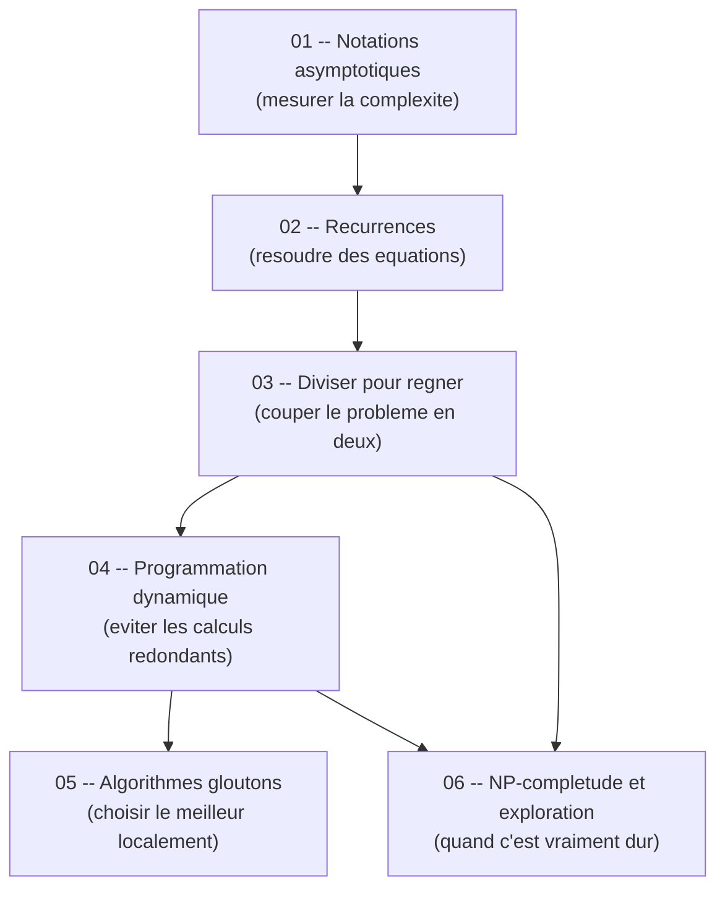

# Guide -- Complexite (S6)

Bienvenue dans ce guide de complexite algorithmique, concu pour etre accessible meme si tu debutes en algorithmique avancee. L'objectif est simple : te permettre de comprendre les concepts fondamentaux de l'analyse de complexite, etape par etape, avec des explications claires, des analogies concretes et du pseudo-code/Python que tu peux reproduire immediatement. Chaque chapitre est **autonome** -- tu peux les lire dans l'ordre ou sauter directement a celui qui t'interesse sans etre perdu.

---

## Roadmap d'apprentissage

Voici l'ordre recommande pour progresser efficacement. Chaque etape s'appuie sur les precedentes, mais tu peux toujours revenir en arriere si un concept te manque.

> **Lecture du diagramme** : les fleches indiquent l'ordre logique. Les notations asymptotiques (01) et les recurrences (02) sont les fondations. Diviser pour regner (03) mene naturellement a la programmation dynamique (04) puis aux algorithmes gloutons (05). La NP-completude et l'exploration (06) s'appuient sur tous les concepts precedents.

---

## Prerequis

Pas besoin d'etre un expert pour suivre ce guide. Voici le strict minimum :

- **Savoir ecrire une boucle et une fonction recursive** -- en C, Python ou n'importe quel langage.
- **Connaître les bases du tri** -- savoir ce qu'est un tri par insertion, un tri par fusion.
- **Notions de logarithme** -- savoir que log2(8) = 3, c'est tout.

Si tu sais ecrire une fonction recursive qui calcule une factorielle, tu as le niveau requis.

---

## Comment utiliser ce guide

1. **Lis dans l'ordre** pour une progression naturelle, ou **saute directement** au chapitre qui t'interesse -- chaque fichier est autonome et complet.
2. **Reproduis le pseudo-code** en parallele dans ton editeur. La complexite s'apprend en pratiquant, pas en lisant passivement.
3. **Les diagrammes Mermaid** sont rendus automatiquement sur GitHub et dans Obsidian. Si tu lis les fichiers dans un autre editeur, installe une extension Mermaid pour en profiter.
4. **Ne memorise pas les formules** -- comprends d'abord l'intuition, le reste viendra naturellement.
5. **La cheat sheet** est ton meilleur ami la veille du DS -- elle condense tout ce qui tombe regulierement aux examens.

---

## Table des matieres

| # | Chapitre | Description |
|---|----------|-------------|
| 01 | [Notations asymptotiques](01_notations_asymptotiques.md) | Mesurer la complexite d'un algorithme -- O, Theta, Omega, comment comparer des algorithmes. |
| 02 | [Recurrences](02_recurrences.md) | Resoudre les equations de recurrence -- equation caracteristique, series generatrices. |
| 03 | [Diviser pour regner](03_diviser_regner.md) | Couper un probleme en sous-problemes, le resoudre recursivement, combiner les resultats. |
| 04 | [Programmation dynamique](04_programmation_dynamique.md) | Eviter les calculs redondants en memorisant les resultats intermediaires. |
| 05 | [Algorithmes gloutons](05_algorithmes_gloutons.md) | Construire une solution optimale en faisant le meilleur choix local a chaque etape. |
| 06 | [Exploration et heuristiques](06_exploration_heuristiques.md) | Parcourir des arbres de recherche, backtracking, branch and bound, metaheuristiques. |
| -- | [Cheat sheet](cheat_sheet.md) | Fiche de revision condensee -- complexites a connaitre, pieges, questions recurrentes des DS. |

---

## Structure d'un chapitre

Chaque chapitre suit la meme progression pour t'aider a construire ta comprehension pas a pas :

| Etape | Ce que tu y trouves |
|-------|---------------------|
| **Analogie** | Une situation de la vie courante pour ancrer le concept. |
| **Intuition visuelle** | Un schema ou diagramme Mermaid pour visualiser l'idee avant toute formule. |
| **Explication progressive** | Le concept explique en partant du plus simple vers le plus precis. |
| **Formules** | Les equations mathematiques, introduites seulement quand l'intuition est en place. |
| **Exemples concrets** | Des problemes classiques du cours pour voir le concept en action. |
| **Pseudo-code / Python** | Du code complet et commente a reproduire. |
| **Pieges classiques** | Les erreurs frequentes et comment les eviter. |
| **Recapitulatif** | Un resume en quelques points pour reviser rapidement. |

> Cette structure est pensee pour que tu puisses toujours comprendre le *pourquoi* avant le *comment*. Si une formule te bloque, reviens a l'analogie -- elle contient l'essentiel.

---

## Correspondance avec le cours de Maud Marchal

| Chapitre du guide | Cours INSA correspondant |
|-------------------|--------------------------|
| 01 -- Notations asymptotiques | Cours 1 (Introduction a la complexite) |
| 02 -- Recurrences | Cours 1 (fin) + Cours 2 (debut) |
| 03 -- Diviser pour regner | Cours 2 (CTD1) |
| 04 -- Programmation dynamique | Cours 3 (CTD3) + Cours 4 (CTD4) |
| 05 -- Algorithmes gloutons | Cours 5 (CTD5) |
| 06 -- Exploration et heuristiques | Cours 6 (CTD6) + Cours 7 (CTD7) |
