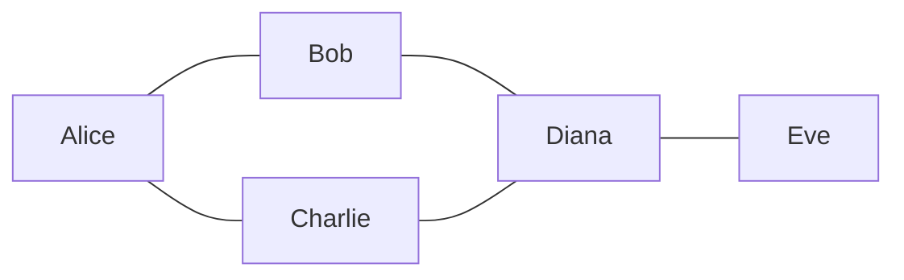
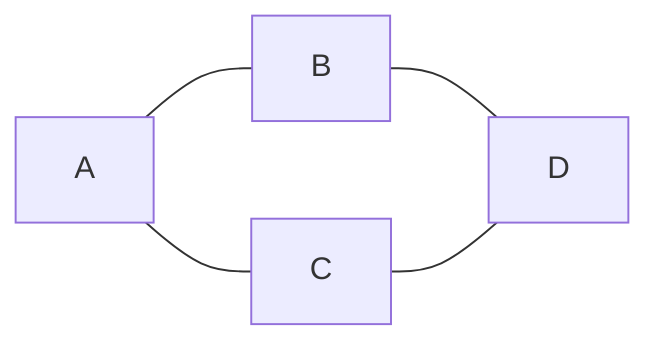
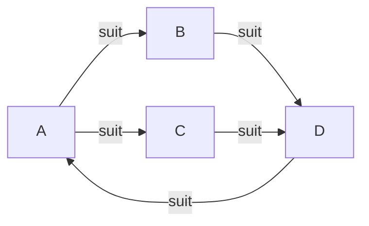
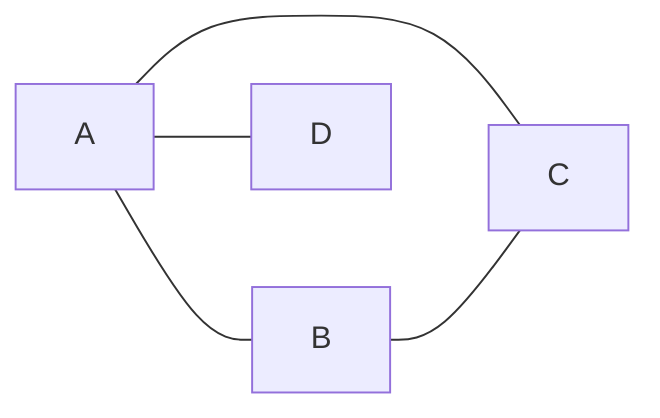
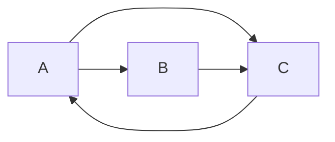
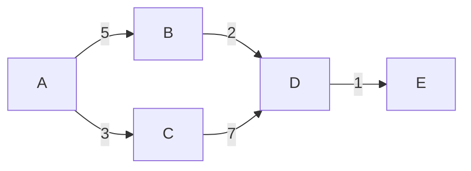
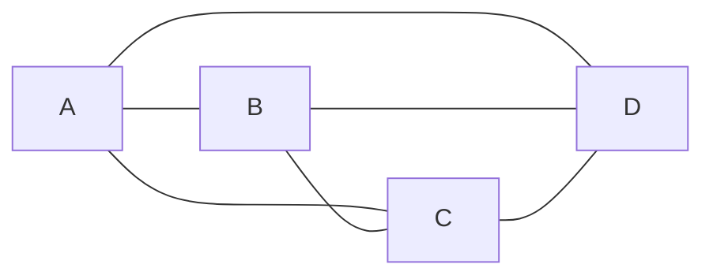
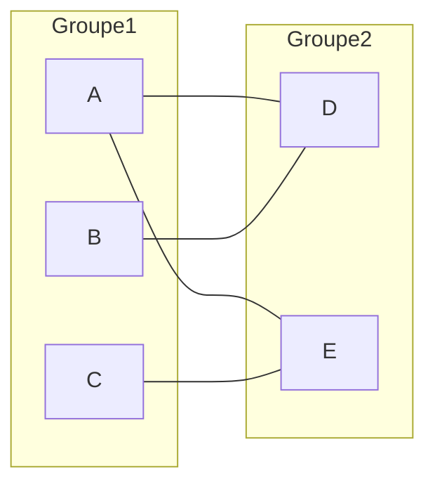

# Chapitre 1 -- Definitions de base

> **Idee centrale en une phrase :** Un graphe, c'est un ensemble de points (sommets) relies par des liens (aretes ou arcs) -- c'est la structure mathematique qui permet de modeliser n'importe quelle relation entre des objets.

**Prerequis :** Aucun -- c'est le point de depart !
**Chapitre suivant :** [Connexite -->](02_connexite.md)

---

## 1. L'analogie du reseau social

### Pourquoi les graphes ?

Imagine un reseau social comme Facebook ou Instagram :

- Chaque **personne** est un point (un sommet).
- Chaque **lien d'amitie** entre deux personnes est un trait qui relie ces deux points (une arete).

Ce dessin tout simple -- des points et des traits -- c'est un **graphe**. Et cette structure apparait partout :

- **Cartes routieres** : les villes sont des sommets, les routes sont des aretes.
- **Internet** : les ordinateurs sont des sommets, les cables reseau sont des aretes.
- **Organisation d'un projet** : les taches sont des sommets, les dependances sont des arcs (orientes).
- **Chimie** : les atomes sont des sommets, les liaisons chimiques sont des aretes.

### Schema intuitif



> Ce graphe represente un reseau social. Alice connait Bob et Charlie. Bob et Charlie connaissent tous les deux Diana. Diana connait Eve. Les liens n'ont pas de direction : si Alice connait Bob, alors Bob connait Alice.

---

## 2. Graphe non oriente

### Definition formelle

Un **graphe non oriente** est un couple G = (S, A) ou :
- **S** (ou V pour Vertices) est un ensemble fini de **sommets** (aussi appeles noeuds).
- **A** (ou E pour Edges) est un ensemble de **paires non ordonnees** de sommets, appelees **aretes**.

### Traduction en langage courant

- **S = {A, B, C, D}** : on a 4 sommets nommes A, B, C, D.
- **A = {{A,B}, {A,C}, {B,D}, {C,D}}** : on a 4 aretes. L'arete {A,B} signifie "A et B sont relies". Comme c'est une paire non ordonnee, {A,B} = {B,A} -- le sens n'a pas d'importance.

### Proprietes d'un graphe non oriente

- **Pas de direction** : une arete relie deux sommets de facon symetrique.
- **Pas de boucle** (en general) : un sommet n'est pas relie a lui-meme. Quand il y a des boucles, on le precise explicitement.
- **Pas d'aretes multiples** (graphe simple) : entre deux sommets, il y a au plus une arete.

### Exemple visuel



> G = ({A, B, C, D}, {{A,B}, {A,C}, {B,D}, {C,D}})

---

## 3. Graphe oriente

### Definition formelle

Un **graphe oriente** (ou digraphe) est un couple G = (S, A) ou :
- **S** est un ensemble fini de sommets.
- **A** est un ensemble de **couples ordonnes** de sommets, appeles **arcs**.

### Difference avec le graphe non oriente

Un **arc** (u, v) va **de u vers v**. C'est une fleche, pas un simple trait. L'arc (A, B) signifie "A pointe vers B", mais ca n'implique PAS que B pointe vers A.

### Analogie

Pense a Twitter (contrairement a Facebook) : si tu suis quelqu'un, cette personne ne te suit pas forcement en retour. Le lien a une direction.

### Exemple visuel



> G = ({A, B, C, D}, {(A,B), (A,C), (B,D), (C,D), (D,A)})
> Attention : (A,B) est different de (B,A). Ici il y a l'arc (D,A) mais pas l'arc (A,D).

---

## 4. Vocabulaire essentiel

### Sommets adjacents

Deux sommets sont **adjacents** s'ils sont relies par une arete (non oriente) ou un arc (oriente).

### Voisinage

Le **voisinage** d'un sommet v, note N(v) ou Gamma(v), est l'ensemble des sommets adjacents a v.

**Exemple :** Dans le graphe non oriente ci-dessus, N(A) = {B, C}, N(D) = {B, C}.

### Incidence

Une arete est **incidente** a un sommet si elle le touche. L'arete {A, B} est incidente a A et a B.

### Sous-graphe

Un **sous-graphe** de G = (S, A) est un graphe G' = (S', A') tel que :
- S' est inclus dans S (on garde un sous-ensemble de sommets)
- A' est inclus dans A (on garde un sous-ensemble d'aretes)
- Chaque arete de A' relie des sommets de S' (coherence)

### Sous-graphe induit

Le **sous-graphe induit** par un ensemble de sommets S' est le sous-graphe qui garde TOUTES les aretes entre les sommets de S'. On ne choisit que les sommets ; les aretes suivent automatiquement.

---

## 5. Degres

### Graphe non oriente : degre d(v)

Le **degre** d'un sommet v, note d(v) ou deg(v), est le nombre d'aretes incidentes a v. En d'autres termes, c'est le nombre de voisins de v.

**Exemple :**



- d(A) = 3 (relie a B, C, D)
- d(B) = 2 (relie a A, C)
- d(C) = 2 (relie a A, B)
- d(D) = 1 (relie a A seulement)

### Graphe oriente : degre entrant et sortant

Dans un graphe oriente, on distingue :
- **Degre entrant** d-(v) ou d_in(v) : nombre d'arcs qui **arrivent** a v.
- **Degre sortant** d+(v) ou d_out(v) : nombre d'arcs qui **partent** de v.
- **Degre total** : d(v) = d-(v) + d+(v).

**Exemple :**



- d+(A) = 2 (arcs vers B et C), d-(A) = 1 (arc depuis C)
- d+(B) = 1 (arc vers C), d-(B) = 1 (arc depuis A)
- d+(C) = 1 (arc vers A), d-(C) = 2 (arcs depuis A et B)

---

## 6. Theoremes fondamentaux sur les degres

### Theoreme des poignees de main (Handshaking Lemma)

> **Enonce :** Dans un graphe non oriente G = (S, A), la somme de tous les degres est egale a deux fois le nombre d'aretes.
>
> **Formule :** Somme des d(v) pour tout v dans S = 2 * |A|

**Pourquoi ?** Chaque arete contribue a exactement 2 degres (un de chaque cote). C'est comme une poignee de main : chaque poignee de main implique exactement 2 mains.

**Consequence immediate :** La somme de tous les degres est toujours **paire**.

**Consequence :** Le nombre de sommets de degre impair est toujours **pair**.

**Preuve de la consequence :** Si on decompose la somme en "somme des degres pairs + somme des degres impairs = nombre pair", la somme des degres pairs est forcement paire, donc la somme des degres impairs doit aussi etre paire. Pour qu'une somme de nombres impairs soit paire, il faut qu'il y ait un nombre pair de termes.

### Version orientee

> Dans un graphe oriente : Somme des d+(v) = Somme des d-(v) = |A|
>
> Chaque arc contribue a exactement un degre sortant et un degre entrant.

---

## 7. Representations d'un graphe

### 7.1 Matrice d'adjacence

La **matrice d'adjacence** M d'un graphe a n sommets est une matrice n x n ou :
- M[i][j] = 1 si l'arete/arc (i, j) existe
- M[i][j] = 0 sinon

**Pour un graphe non oriente :** la matrice est **symetrique** (M[i][j] = M[j][i]).
**Pour un graphe oriente :** la matrice n'est pas forcement symetrique.

**Exemple** (graphe non oriente A-B, A-C, B-C, B-D) :

```
    A  B  C  D
A [ 0  1  1  0 ]
B [ 1  0  1  1 ]
C [ 1  1  0  0 ]
D [ 0  1  0  0 ]
```

**Avantages :**
- Verification d'adjacence en O(1) : M[i][j] repond immediatement.
- Simple a implementer.

**Inconvenients :**
- Espace O(n^2) meme si le graphe a peu d'aretes (graphe creux).
- Parcourir les voisins d'un sommet coute O(n).

### 7.2 Listes d'adjacence

Chaque sommet est associe a la **liste de ses voisins**.

**Exemple** (meme graphe) :

```
A : [B, C]
B : [A, C, D]
C : [A, B]
D : [B]
```

**Avantages :**
- Espace O(n + m) ou m = nombre d'aretes. Beaucoup plus econome pour les graphes creux.
- Parcourir les voisins d'un sommet est rapide : O(degre du sommet).

**Inconvenients :**
- Verification d'adjacence en O(degre) au lieu de O(1).

### 7.3 Matrice d'incidence

La **matrice d'incidence** est une matrice n x m (n sommets, m aretes) ou :
- Graphe non oriente : M[i][j] = 1 si le sommet i est une extremite de l'arete j, 0 sinon.
- Graphe oriente : M[i][j] = -1 si l'arc j part de i, +1 si l'arc j arrive a i, 0 sinon.

**Utilisation :** surtout theorique, moins utilisee en pratique que les deux autres.

### Comparaison

| Representation | Espace | Adjacence ? | Voisins de v | Quand l'utiliser |
|----------------|--------|-------------|--------------|------------------|
| Matrice d'adjacence | O(n^2) | O(1) | O(n) | Graphes denses, acces frequent |
| Liste d'adjacence | O(n+m) | O(deg(v)) | O(deg(v)) | Graphes creux, parcours |
| Matrice d'incidence | O(n*m) | O(m) | O(m) | Usage theorique |

---

## 8. Graphes ponderes (ou values)

Un **graphe pondere** est un graphe ou chaque arete (ou arc) porte un **poids** (ou valuation, ou cout). Ce poids peut representer une distance, un temps, un cout financier, une capacite, etc.

### Definition formelle

Un graphe pondere est un triplet G = (S, A, w) ou w : A -> R est une fonction de poids.

### Exemple visuel



> Ici, aller de A a B coute 5, de A a C coute 3, etc. Le chemin le moins cher de A a D passe par A -> B -> D (cout 7) plutot que A -> C -> D (cout 10).

### Representation

La matrice d'adjacence d'un graphe pondere contient les poids au lieu de 1 :

```
    A    B    C    D    E
A [ 0    5    3    inf  inf ]
B [ inf  0    inf  2    inf ]
C [ inf  inf  0    7    inf ]
D [ inf  inf  inf  0    1   ]
E [ inf  inf  inf  inf  0   ]
```

(inf = pas d'arc direct)

---

## 9. Types particuliers de graphes

### Graphe complet K_n

Un graphe ou **tous** les sommets sont relies entre eux. K_n a n sommets et n(n-1)/2 aretes.



> K_4 : 4 sommets, 4*3/2 = 6 aretes. Chaque sommet a un degre de 3.

### Graphe biparti

Un graphe dont les sommets peuvent etre separes en **deux groupes** (partitions) tels que chaque arete relie un sommet du premier groupe a un sommet du second groupe. Aucune arete ne relie deux sommets du meme groupe.



**Propriete fondamentale :** Un graphe est biparti si et seulement si il ne contient **aucun cycle de longueur impaire**.

### Graphe biparti complet K_{p,q}

Un graphe biparti ou chaque sommet du premier groupe est relie a chaque sommet du second groupe. K_{p,q} a p + q sommets et p * q aretes.

### Graphe planaire

Un graphe est **planaire** s'il peut etre dessine dans le plan **sans croisement d'aretes**.

**Formule d'Euler pour les graphes planaires connexes :** n - m + f = 2

ou n = nombre de sommets, m = nombre d'aretes, f = nombre de faces (regions delimitees, y compris la face exterieure).

**Consequence :** Pour un graphe planaire simple connexe avec n >= 3 : m <= 3n - 6.

### Graphe regulier

Un graphe est **k-regulier** si tous ses sommets ont le meme degre k.
- 0-regulier : sommets isoles
- 1-regulier : couplage parfait
- 2-regulier : union de cycles
- 3-regulier : graphe cubique

---

## 10. Parcours de graphes

### 10.1 Parcours en largeur (BFS -- Breadth-First Search)

**Idee :** Explorer le graphe couche par couche. On visite d'abord tous les voisins d'un sommet, puis les voisins des voisins, etc.

**Analogie :** C'est comme une onde qui se propage : elle touche d'abord les sommets proches, puis les sommets eloignes.

**Structure de donnees :** File (FIFO -- First In, First Out).

**Pseudo-code :**

```
BFS(G, s):
    Creer une file F
    Marquer s comme visite
    Enfiler s dans F
    
    Tant que F n'est pas vide:
        v = Defiler F
        Pour chaque voisin w de v:
            Si w n'est pas visite:
                Marquer w comme visite
                Enfiler w dans F
```

**Complexite :** O(n + m) avec les listes d'adjacence.

**Propriete cle :** BFS donne les **distances** (en nombre d'aretes) depuis le sommet de depart.

### 10.2 Parcours en profondeur (DFS -- Depth-First Search)

**Idee :** Explorer le graphe en allant le plus loin possible dans une direction, puis revenir en arriere quand on est bloque.

**Analogie :** C'est comme explorer un labyrinthe : on avance le plus loin possible dans un couloir, et quand on arrive dans un cul-de-sac, on revient au dernier croisement.

**Structure de donnees :** Pile (LIFO -- Last In, First Out), ou recursivite.

**Pseudo-code :**

```
DFS(G, s):
    Marquer s comme visite
    Pour chaque voisin w de s:
        Si w n'est pas visite:
            DFS(G, w)
```

**Complexite :** O(n + m) avec les listes d'adjacence.

**Proprietes cles :**
- DFS permet de detecter les **cycles**.
- DFS permet de calculer les **composantes connexes**.
- DFS permet le **tri topologique** (graphes orientes acycliques).

### Comparaison BFS vs DFS

| Critere | BFS | DFS |
|---------|-----|-----|
| Structure | File (FIFO) | Pile/Recursion (LIFO) |
| Exploration | Couche par couche | En profondeur |
| Distance | Donne le plus court chemin (non pondere) | Non |
| Detection de cycles | Possible | Oui (plus naturel) |
| Tri topologique | Non | Oui |
| Espace memoire | O(n) dans le pire cas | O(n) dans le pire cas |

---

## 11. Isomorphisme de graphes

### Definition

Deux graphes G1 = (S1, A1) et G2 = (S2, A2) sont **isomorphes** s'il existe une bijection f : S1 -> S2 qui preserve les aretes. C'est-a-dire : {u, v} est dans A1 si et seulement si {f(u), f(v)} est dans A2.

**En langage courant :** Deux graphes sont isomorphes s'ils ont la **meme structure**, meme s'ils sont dessines differemment ou si les sommets ont des noms differents.

### Comment verifier que deux graphes NE SONT PAS isomorphes

Si deux graphes different sur l'un de ces criteres, ils ne sont PAS isomorphes :
1. **Nombre de sommets different**
2. **Nombre d'aretes different**
3. **Sequence de degres differente** (la liste triee de tous les degres)
4. **Nombre de cycles de longueur k different**

**Attention :** Ces conditions sont necessaires mais pas suffisantes. Deux graphes peuvent avoir les memes invariants sans etre isomorphes !

---

## Pieges classiques

| Piege | Explication |
|-------|-------------|
| Confondre arete et arc | Une arete n'a pas de direction, un arc en a une. Verifie toujours si le graphe est oriente ou non. |
| Oublier que {A,B} = {B,A} | Dans un graphe non oriente, l'ordre n'a pas d'importance. Ne compte pas la meme arete deux fois. |
| Confondre degre et nombre de voisins | Dans un graphe simple, c'est pareil. Mais avec des boucles, une boucle compte pour 2 dans le degre. |
| Oublier la face exterieure | Dans la formule d'Euler, n - m + f = 2, la face exterieure (infinie) compte comme une face ! |
| Matrice d'adjacence non symetrique | Si la matrice n'est pas symetrique, c'est un graphe oriente. Verifie toujours. |
| Graphe biparti et cycles impairs | Un graphe est biparti SSI il n'a pas de cycle impair. C'est un critere de verification puissant. |
| Isomorphisme : conditions necessaires vs suffisantes | Memes degres, meme nombre d'aretes... ne suffit PAS a prouver l'isomorphisme. Ca prouve seulement que ce n'est pas exclu. |

---

## Recapitulatif

- Un **graphe** = sommets + aretes (non oriente) ou arcs (oriente).
- Le **degre** d'un sommet = nombre de liens. Theoreme des poignees de main : somme des degres = 2m.
- **Representations** : matrice d'adjacence (O(n^2), acces rapide), listes d'adjacence (O(n+m), parcours rapide).
- **Graphe pondere** : aretes avec des poids (distances, couts...).
- **Types speciaux** : complet (K_n), biparti, planaire (n - m + f = 2), regulier.
- **Parcours** : BFS (file, couche par couche, distances) vs DFS (pile, en profondeur, cycles).
- **Isomorphisme** : meme structure = isomorphes. Invariants pour prouver la non-isomorphie.
