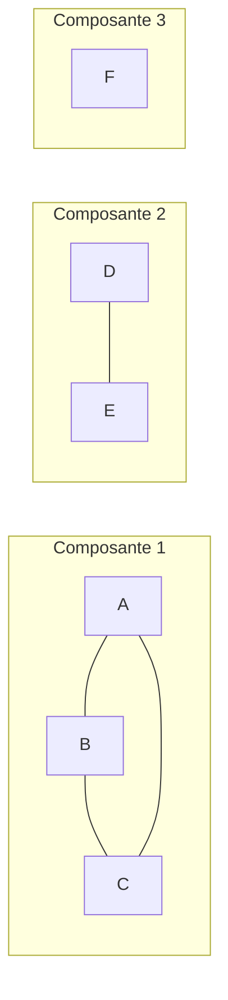
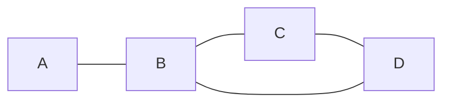
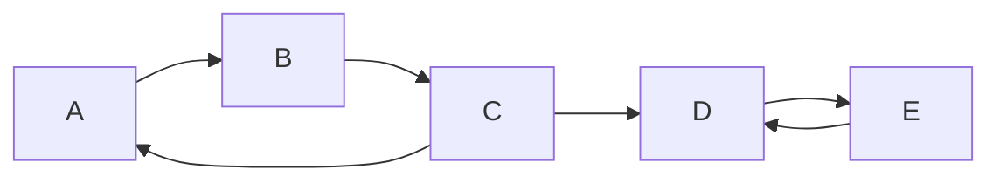
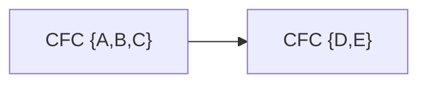
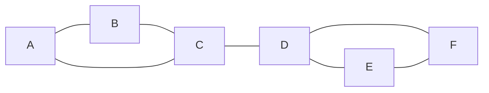

# Chapitre 2 -- Connexite

> **Idee centrale en une phrase :** La connexite, c'est savoir si on peut aller de n'importe quel point a n'importe quel autre en suivant les liens -- autrement dit, est-ce que le graphe tient en un seul morceau ?

**Prerequis :** [Definitions de base](01_definitions_base.md)
**Chapitre suivant :** [Cycles et arbres -->](03_cycles_arbres.md)

---

## 1. L'analogie du reseau de transport

### Le probleme

Imagine une carte de metro. Tu es a la station A et tu veux aller a la station Z. La question fondamentale est : **existe-t-il un chemin** (une succession de stations et de lignes) qui te permette d'y arriver ?

Si le reseau est en un seul morceau (toutes les stations sont reliees, directement ou indirectement), tu pourras toujours atteindre Z. Mais si le reseau est coupe en deux morceaux separes (par exemple a cause d'une greve sur certaines lignes), certaines stations deviennent inaccessibles.

C'est exactement la question de la **connexite** : le graphe est-il en un seul morceau ?

### Schema intuitif



> Ce graphe a 3 composantes connexes. Depuis A, on peut atteindre B et C, mais pas D, E ou F. Depuis D, on peut atteindre E mais c'est tout. F est completement isole.

---

## 2. Chaines, chemins et cycles -- le vocabulaire du deplacement

### Dans un graphe non oriente

| Terme | Definition | Exemple |
|-------|-----------|---------|
| **Chaine** | Suite de sommets relies par des aretes (on peut repasser par une arete) | A - B - C - B - D |
| **Chaine simple** | Chaine ou chaque **arete** est empruntee au plus une fois | A - B - C - D (sans repasser par une arete) |
| **Chaine elementaire** | Chaine ou chaque **sommet** est visite au plus une fois | A - B - C - D (sans repasser par un sommet) |
| **Longueur** | Nombre d'aretes dans la chaine | A - B - C - D a une longueur de 3 |
| **Cycle** | Chaine qui revient a son point de depart | A - B - C - A |

### Dans un graphe oriente

| Terme | Definition | Exemple |
|-------|-----------|---------|
| **Chemin** | Suite de sommets relies par des arcs, en respectant le sens | A -> B -> C -> D |
| **Chemin simple** | Chemin ou chaque **arc** est emprunte au plus une fois | A -> B -> C -> D |
| **Chemin elementaire** | Chemin ou chaque **sommet** est visite au plus une fois | A -> B -> C -> D |
| **Circuit** | Chemin qui revient a son point de depart | A -> B -> C -> A |

### Point crucial

> **Chaine** = graphe non oriente (on ne respecte pas de direction).
> **Chemin** = graphe oriente (on respecte le sens des fleches).
> En anglais, "path" est utilise pour les deux. En francais, la distinction est importante !

---

## 3. Connexite dans les graphes non orientes

### Definition

Un graphe non oriente G est **connexe** si pour tout couple de sommets (u, v), il existe une chaine de u a v.

**En langage courant :** On peut aller de n'importe quel sommet a n'importe quel autre en suivant les aretes.

### Composante connexe

Une **composante connexe** est un sous-ensemble maximal de sommets tel que tout couple de sommets de cet ensemble est relie par une chaine.

**Maximal** signifie qu'on ne peut pas ajouter de sommet supplementaire tout en gardant la propriete de connexite.

### Comment trouver les composantes connexes ?

On utilise un **parcours** (BFS ou DFS) :

```
CompConnexes(G):
    Marquer tous les sommets comme non visites
    num_composante = 0
    
    Pour chaque sommet v de G:
        Si v n'est pas visite:
            num_composante = num_composante + 1
            BFS(G, v)  // ou DFS(G, v)
            // Tous les sommets visites par ce parcours
            // forment la composante num_composante
    
    Retourner num_composante
```

**Complexite :** O(n + m) -- chaque sommet et chaque arete est visite exactement une fois au total.

### Proprietes

- Un graphe connexe a exactement **1 composante connexe**.
- Si un graphe a n sommets et p composantes connexes, alors il a **au moins n - p aretes**.
- **Ajouter une arete** entre deux composantes differentes reduit le nombre de composantes de 1.

---

## 4. Distance et diametre

### Distance

La **distance** entre deux sommets u et v, notee d(u, v), est la **longueur de la plus courte chaine** entre u et v (en nombre d'aretes, sans poids).

Si u et v ne sont pas dans la meme composante connexe, d(u, v) = infini.

**Proprietes de la distance :**
- d(u, u) = 0
- d(u, v) = d(v, u) (symetrie)
- d(u, v) <= d(u, w) + d(w, v) (inegalite triangulaire)

### Excentricite

L'**excentricite** d'un sommet v est la distance maximale entre v et tout autre sommet : e(v) = max_{u dans S} d(v, u).

**Intuition :** C'est la distance jusqu'au sommet le plus eloigne de v.

### Diametre

Le **diametre** du graphe est la plus grande distance entre deux sommets quelconques : diam(G) = max_{u,v dans S} d(u, v) = max_{v dans S} e(v).

**Intuition :** C'est la "longueur" du graphe -- la distance entre les deux sommets les plus eloignes.

### Rayon et centre

- Le **rayon** est la plus petite excentricite : rad(G) = min_{v dans S} e(v).
- Le **centre** du graphe est l'ensemble des sommets d'excentricite minimale (= rayon).

### Exemple complet



Distances :

| | A | B | C | D |
|---|---|---|---|---|
| A | 0 | 1 | 2 | 2 |
| B | 1 | 0 | 1 | 1 |
| C | 2 | 1 | 0 | 1 |
| D | 2 | 1 | 1 | 0 |

- e(A) = 2, e(B) = 1, e(C) = 2, e(D) = 2
- Diametre = 2 (distance A-C ou A-D)
- Rayon = 1 (excentricite de B)
- Centre = {B}

---

## 5. Connexite dans les graphes orientes

Dans un graphe oriente, la connexite est plus subtile car les arcs ont une direction.

### Forte connexite

Un graphe oriente G est **fortement connexe** si pour tout couple de sommets (u, v), il existe un chemin de u a v **ET** un chemin de v a u.

**En langage courant :** Depuis n'importe quel sommet, on peut atteindre n'importe quel autre sommet en respectant le sens des fleches.

### Composante fortement connexe (CFC)

Une **composante fortement connexe** est un sous-ensemble maximal de sommets tel que pour tout couple (u, v) de cet ensemble, il existe un chemin de u a v et un chemin de v a u.

### Exemple



Composantes fortement connexes :
- {A, B, C} : on peut aller de A a B (A->B), de B a C (B->C), de C a A (C->A), donc de n'importe lequel a n'importe quel autre.
- {D, E} : D->E et E->D.

> Attention : {A, B, C, D, E} n'est PAS fortement connexe car on ne peut pas aller de D a A (pas de chemin D -> ... -> A).

### Connexite faible

Un graphe oriente est **faiblement connexe** si, en oubliant l'orientation des arcs (en les remplacant par des aretes), on obtient un graphe connexe.

**Hierarchie :** Fortement connexe implique faiblement connexe, mais l'inverse est faux.

### Graphe des composantes fortement connexes (graphe quotient)

Si on contracte chaque CFC en un seul sommet, on obtient un **DAG** (Directed Acyclic Graph -- graphe oriente acyclique). Ce graphe est toujours un DAG car s'il y avait un cycle entre deux CFC, elles n'en formeraient qu'une seule.



### Algorithme de Tarjan

L'algorithme de Tarjan trouve toutes les composantes fortement connexes en **un seul parcours DFS** en temps O(n + m).

**Principe :** Chaque sommet recoit un index (ordre de decouverte) et un lowlink (plus petit index atteignable). Une CFC est detectee quand un sommet a son lowlink egal a son index (c'est la "racine" de la CFC dans l'arbre DFS).

**Pseudo-code simplifie :**

```
Tarjan(G):
    index_courant = 0
    Pile P = vide
    
    Pour chaque sommet v non visite:
        Tarjan_DFS(v)

Tarjan_DFS(v):
    v.index = index_courant
    v.lowlink = index_courant
    index_courant = index_courant + 1
    Empiler v dans P
    v.sur_pile = true
    
    Pour chaque successeur w de v:
        Si w n'a pas d'index:
            Tarjan_DFS(w)
            v.lowlink = min(v.lowlink, w.lowlink)
        Sinon si w.sur_pile:
            v.lowlink = min(v.lowlink, w.index)
    
    Si v.lowlink == v.index:
        // v est la racine d'une CFC
        Nouvelle CFC
        Repeter:
            w = Depiler P
            w.sur_pile = false
            Ajouter w a la CFC
        Tant que w != v
```

---

## 6. Points d'articulation et isthmes

### Motivation

Si tu geres un reseau informatique et qu'un serveur tombe en panne, est-ce que le reseau reste connecte ? Les **points d'articulation** et les **isthmes** identifient les elements critiques dont la suppression deconnecte le graphe.

### Point d'articulation (ou sommet de coupure)

Un sommet v est un **point d'articulation** si sa suppression (ainsi que toutes ses aretes) augmente le nombre de composantes connexes du graphe.

**Intuition :** C'est un sommet "charniere" -- si on le retire, le graphe se casse en morceaux.

### Isthme (ou pont, ou arete de coupure)

Une arete {u, v} est un **isthme** si sa suppression augmente le nombre de composantes connexes du graphe.

**Intuition :** C'est le seul chemin entre deux parties du graphe. Si on le coupe, deux parties deviennent deconnectees.

### Exemple visuel



- **C** est un point d'articulation : si on le supprime, {A, B} et {D, E, F} sont deconnectes.
- L'arete **{C, D}** est un isthme : c'est le seul lien entre les deux parties.
- **D** est aussi un point d'articulation ? Non, car si on supprime D, les aretes {D,E} et {D,F} disparaissent, mais on a toujours {E, F} qui reste connecte via l'arete {E,F}. Par contre, {C} et {E,F} sont deconnectes -- donc D serait aussi un point d'articulation si C etait supprime.

Verifions : suppression de D -> sommets restants {A, B, C, E, F}. Aretes restantes : {A-B, B-C, A-C, E-F}. Composantes : {A,B,C} et {E,F}. Donc **D est bien un point d'articulation**.

### Proprietes

- Si une arete est un isthme, alors au moins l'une de ses extremites est un point d'articulation (sauf si c'est la seule arete du graphe et les deux sommets n'ont que degre 1).
- Un sommet de degre 1 (feuille) n'est **jamais** un point d'articulation.
- Une arete est un isthme si et seulement si elle n'appartient a **aucun cycle**.

### Graphe 2-connexe (biconnexe)

Un graphe est **2-connexe** (ou biconnexe) s'il est connexe et n'a **aucun point d'articulation**. Cela signifie que le graphe reste connexe meme si on supprime n'importe quel sommet.

**Propriete equivalente :** Un graphe a au moins 3 sommets est 2-connexe si et seulement si entre tout couple de sommets, il existe au moins **2 chaines disjointes par les sommets** (theoreme de Whitney).

### k-connexite

Plus generalement, un graphe est **k-connexe** si la suppression de tout ensemble de moins de k sommets laisse le graphe connexe.

La **connectivite** kappa(G) est le plus grand k tel que G est k-connexe. C'est le nombre minimum de sommets a supprimer pour deconnecter le graphe.

---

## 7. Theoreme de Menger

> **Enonce :** Le nombre maximum de chaines disjointes par les sommets entre deux sommets non adjacents u et v est egal au nombre minimum de sommets a supprimer pour deconnecter u de v.

**Intuition :** Pour bloquer toute communication entre u et v, il faut couper autant de "routes" qu'il y a de chemins independants.

Ce theoreme fait le lien entre deux notions :
- **Connexite** (combien de sommets faut-il supprimer pour deconnecter)
- **Chemins disjoints** (combien de routes independantes existent)

---

## Pieges classiques

| Piege | Explication |
|-------|-------------|
| Confondre connexe et fortement connexe | Un graphe oriente peut etre faiblement connexe sans etre fortement connexe. Verifie toujours les deux directions ! |
| Oublier que la distance est en nombre d'aretes | La distance d(u,v) compte les aretes, pas les sommets. Une chaine A-B-C a une distance de 2, pas 3. |
| Chaine vs chemin | Chaine = non oriente, chemin = oriente. En DS, utilise le bon terme selon le type de graphe. |
| Elementaire vs simple | Elementaire = pas de sommet repete. Simple = pas d'arete repetee. Elementaire est plus restrictif que simple. |
| Point d'articulation avec degre 1 | Un sommet de degre 1 n'est JAMAIS un point d'articulation. Si on le supprime, le graphe perd un sommet isole mais les autres restent connectes. |
| Isthme et cycles | Si une arete appartient a un cycle, elle n'est PAS un isthme (il y a un chemin alternatif). Un isthme est toujours hors de tout cycle. |
| Composante fortement connexe et cycles | S'il existe un cycle passant par u et v dans un graphe oriente, alors u et v sont dans la meme CFC. |

---

## Recapitulatif

- **Connexe** (non oriente) : il existe une chaine entre tout couple de sommets.
- **Composante connexe** : sous-ensemble maximal de sommets mutuellement accessibles.
- **Distance** d(u,v) : longueur de la plus courte chaine. **Diametre** : plus grande distance.
- **Fortement connexe** (oriente) : chemin dans les deux sens entre tout couple de sommets.
- **CFC** : composantes fortement connexes. Le graphe quotient est un DAG.
- **Point d'articulation** : sommet dont la suppression deconnecte le graphe.
- **Isthme** : arete dont la suppression deconnecte le graphe. Appartient a aucun cycle.
- **k-connexite** : le graphe reste connexe apres suppression de k-1 sommets quelconques.
- **Menger** : nb max de chemins disjoints = nb min de sommets a couper.
