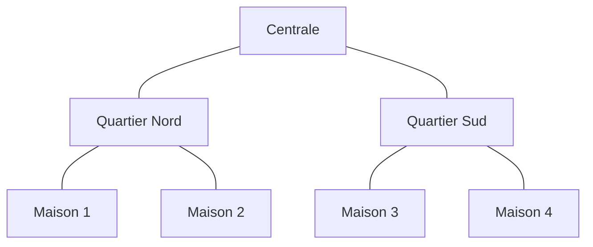
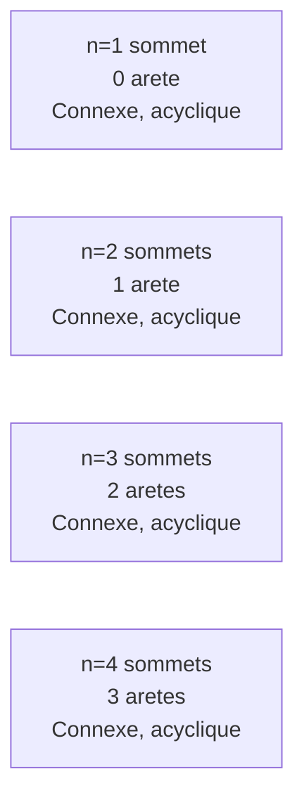
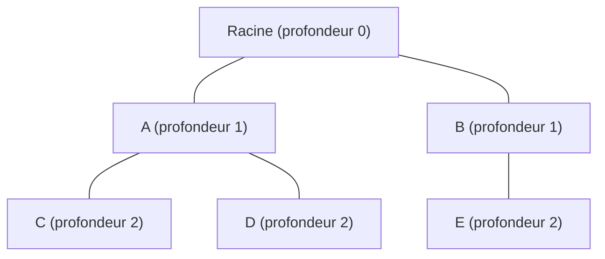

# Chapitre 3 -- Cycles et arbres

> **Idee centrale en une phrase :** Un cycle, c'est un chemin qui revient a son point de depart ; un arbre, c'est un graphe connexe qui n'a aucun cycle -- la structure la plus "econome" pour relier tous les sommets.

**Prerequis :** [Connexite](02_connexite.md)
**Chapitre suivant :** [Coloration -->](04_coloration.md)

---

## 1. L'analogie de la carte routiere

### Cycles = boucles

Imagine que tu te promenes dans une ville et que tu reviens exactement a ton point de depart sans jamais repasser par la meme rue. Tu as fait un **cycle** : une boucle fermee dans le reseau de rues.

### Arbres = reseau sans boucle

Maintenant imagine un reseau electrique ou chaque maison doit etre alimentee, mais ou on veut utiliser le **minimum de cables** possible (pour economiser). Le resultat est un **arbre** : un reseau connexe (tout est relie) mais sans aucune boucle (chaque maison a exactement un chemin pour etre atteinte depuis la centrale).



> Un arbre : 7 sommets, 6 aretes. Chaque maison a exactement un chemin vers la centrale. Aucun cycle.

---

## 2. Cycles

### Definition

Un **cycle** dans un graphe non oriente est une chaine elementaire (pas de sommet repete) qui revient a son point de depart, de longueur au moins 3.

Un **circuit** dans un graphe oriente est un chemin elementaire qui revient a son point de depart.

### Longueur d'un cycle

La **longueur** d'un cycle est le nombre d'aretes (ou d'arcs) qu'il contient.

- Cycle de longueur 3 = triangle
- Cycle de longueur 4 = carre
- Cycle de longueur n = C_n

### Graphe acyclique

Un graphe est **acyclique** s'il ne contient aucun cycle.

- Graphe non oriente acyclique = **foret** (union d'arbres)
- Graphe oriente acyclique = **DAG** (Directed Acyclic Graph)

### Detection de cycles

**Graphe non oriente :** On utilise un DFS. Si pendant le parcours on rencontre un sommet deja visite (et ce n'est pas le parent dans l'arbre DFS), alors il y a un cycle.

**Graphe oriente :** On utilise un DFS avec trois etats : non visite, en cours d'exploration, termine. Si on rencontre un sommet "en cours d'exploration", il y a un cycle.

```
DetecterCycle_Oriente(G):
    Pour chaque sommet v:
        v.etat = NON_VISITE
    
    Pour chaque sommet v:
        Si v.etat == NON_VISITE:
            Si DFS_Cycle(v) == true:
                Retourner "Cycle detecte"
    Retourner "Pas de cycle"

DFS_Cycle(v):
    v.etat = EN_COURS
    Pour chaque successeur w de v:
        Si w.etat == EN_COURS:
            Retourner true  // Cycle !
        Si w.etat == NON_VISITE:
            Si DFS_Cycle(w) == true:
                Retourner true
    v.etat = TERMINE
    Retourner false
```

---

## 3. Cycles euleriens

### Definition

Un **cycle eulerien** est un cycle qui passe par **chaque arete exactement une fois** et revient au point de depart.

Une **chaine eulerienne** est une chaine qui passe par **chaque arete exactement une fois** (sans forcement revenir au depart).

### Le probleme des ponts de Koenigsberg

C'est le probleme historique qui a donne naissance a la theorie des graphes (Euler, 1736). La ville de Koenigsberg avait 7 ponts reliant 4 zones. Question : peut-on traverser chaque pont exactement une fois et revenir au point de depart ?

Euler a montre que c'etait impossible, en inventant la notion de graphe.

### Theoreme d'Euler (condition d'existence)

> **Cycle eulerien :** Un graphe connexe admet un cycle eulerien si et seulement si **tous** les sommets sont de degre pair.

> **Chaine eulerienne :** Un graphe connexe admet une chaine eulerienne (ouverte, sans revenir au depart) si et seulement si il a **exactement 0 ou 2 sommets de degre impair**.
> - Si 0 sommet de degre impair : il existe un cycle eulerien (qui est aussi une chaine eulerienne fermee).
> - Si 2 sommets de degre impair : la chaine commence a l'un et finit a l'autre.

### Pourquoi "degre pair" ?

**Intuition :** Quand on entre dans un sommet par une arete, il faut pouvoir en sortir par une autre. Chaque passage "consomme" 2 aretes (une pour entrer, une pour sortir). Si le degre est impair, il restera une arete sans "partenaire" et on sera bloque.

### Algorithme pour trouver un cycle eulerien

**Algorithme de Hierholzer :**

```
Hierholzer(G, v0):
    // v0 = sommet de depart
    Trouver un cycle C en partant de v0
    // (on suit des aretes non encore utilisees jusqu'a revenir a v0)
    
    Tant qu'il reste des aretes non utilisees:
        Choisir un sommet v de C qui a des aretes non utilisees
        Trouver un cycle C' en partant de v (aretes non utilisees)
        Inserer C' dans C a la position de v
    
    Retourner C
```

**Complexite :** O(m) -- chaque arete est traitee une fois.

### Version orientee

Un graphe oriente connexe admet un **circuit eulerien** si et seulement si pour chaque sommet : **degre entrant = degre sortant**.

---

## 4. Cycles hamiltoniens

### Definition

Un **cycle hamiltonien** est un cycle qui passe par **chaque sommet exactement une fois** et revient au point de depart.

Un **chemin hamiltonien** est un chemin qui passe par **chaque sommet exactement une fois** (sans forcement revenir au depart).

### Difference avec Euler

| | Euler | Hamilton |
|---|---|---|
| Passe par chaque... | **arete** exactement une fois | **sommet** exactement une fois |
| Condition d'existence | Simple (degres pairs) | Tres difficile (probleme NP-complet) |
| Algorithme | Polynomial O(m) | Pas d'algorithme efficace connu |

### Conditions suffisantes (pas necessaires !)

**Theoreme de Dirac (1952) :**
> Si G est un graphe simple a n sommets (n >= 3) et si pour tout sommet v, d(v) >= n/2, alors G admet un cycle hamiltonien.

**Theoreme d'Ore (1960) :**
> Si G est un graphe simple a n sommets (n >= 3) et si pour tout couple de sommets non adjacents u, v, on a d(u) + d(v) >= n, alors G admet un cycle hamiltonien.

**Attention :** Ces conditions sont **suffisantes** mais pas necessaires. Un graphe peut avoir un cycle hamiltonien sans verifier ces conditions.

### Conditions necessaires

- Le graphe doit etre connexe.
- La suppression de k sommets ne doit pas creer plus de k composantes connexes.

### Complexite

Determiner si un graphe admet un cycle hamiltonien est un probleme **NP-complet**. Il n'existe pas d'algorithme efficace (polynomial) connu. On doit souvent essayer toutes les possibilites (backtracking).

---

## 5. Arbres

### Definition

Un **arbre** est un graphe connexe et acyclique.

Une **foret** est un graphe acyclique (pas forcement connexe). C'est une union d'arbres.

### Proprietes equivalentes

Les affirmations suivantes sont equivalentes pour un graphe G a n sommets :

1. G est un **arbre** (connexe et acyclique).
2. G est connexe et a exactement **n - 1 aretes**.
3. G est acyclique et a exactement **n - 1 aretes**.
4. Entre tout couple de sommets, il existe **exactement un chemin**.
5. G est connexe, et la suppression de **n'importe quelle arete** le deconnecte.
6. G est acyclique, et l'ajout de **n'importe quelle arete** cree exactement un cycle.

**C'est la propriete la plus importante du chapitre !** Connais au moins 3 de ces equivalences par coeur.

### Pourquoi n - 1 aretes ?

**Intuition :** Pour relier n sommets, il faut au minimum n - 1 aretes (sinon ce n'est pas connexe). Mais si on en met plus de n - 1, on cree forcement un cycle. Donc n - 1 aretes, c'est le "juste milieu" : connexe mais sans cycle.

### Demonstration visuelle



A chaque ajout d'un sommet, on ajoute exactement une arete pour le connecter. Donc aretes = sommets - 1.

### Feuille

Une **feuille** est un sommet de degre 1 dans un arbre (il n'a qu'un seul voisin).

**Propriete fondamentale :** Tout arbre a au moins 2 sommets possede **au moins 2 feuilles**.

**Preuve :** Prendre le plus long chemin dans l'arbre. Ses deux extremites sont forcement des feuilles (sinon on pourrait prolonger le chemin).

### Arbre enracine

Un **arbre enracine** est un arbre ou l'on a choisi un sommet particulier appele **racine**. Cela donne une hierarchie naturelle :

- La **racine** est au sommet (profondeur 0).
- Les **enfants** d'un sommet sont ses voisins situes "en dessous" (un niveau plus profond).
- Le **parent** d'un sommet est son voisin situe "au-dessus" (un niveau moins profond).
- Les **feuilles** sont les sommets sans enfant.
- La **profondeur** d'un sommet est sa distance a la racine.
- La **hauteur** de l'arbre est la profondeur maximale.



> Arbre enracine de hauteur 2. Feuilles : C, D, E.

---

## 6. Forets

### Definition

Une **foret** est un graphe acyclique. C'est une union disjointe d'arbres.

### Proprietes

- Une foret a n sommets et p composantes connexes possede exactement **n - p aretes**.
- Chaque composante connexe d'une foret est un arbre.
- Toute foret est un graphe **biparti** (car pas de cycle impair, et un arbre est biparti).

---

## 7. Arbre couvrant (Spanning Tree)

### Definition

Un **arbre couvrant** d'un graphe connexe G = (S, A) est un sous-graphe de G qui :
1. Contient **tous** les sommets de G.
2. Est un **arbre** (connexe et acyclique).

**En langage courant :** C'est un squelette du graphe qui relie tous les sommets avec le minimum d'aretes, sans boucle.

### Existence

> **Theoreme :** Tout graphe connexe possede au moins un arbre couvrant.

**Preuve constructive :** Partir du graphe connexe. Tant qu'il y a un cycle, supprimer une arete du cycle (le graphe reste connexe). Quand il n'y a plus de cycle, on a un arbre couvrant.

### Nombre d'aretes

Un arbre couvrant d'un graphe a n sommets possede exactement **n - 1 aretes**.

### Lien avec les parcours

- Un **arbre BFS** est un arbre couvrant obtenu par parcours en largeur.
- Un **arbre DFS** est un arbre couvrant obtenu par parcours en profondeur.

### Application : les arbres couvrants minimaux

Si le graphe est pondere (les aretes ont des poids), on cherche l'arbre couvrant dont la **somme des poids** est minimale. C'est le sujet du chapitre 5 (Kruskal, Prim).

---

## 8. Tri topologique

### Contexte : graphes orientes acycliques (DAG)

Un **DAG** est un graphe oriente sans circuit. C'est la structure ideale pour representer des **dependances** : "la tache A doit etre faite avant la tache B".

### Definition

Un **tri topologique** d'un DAG est un ordre lineaire de tous ses sommets tel que pour chaque arc (u, v), u apparait avant v dans l'ordre.

**Intuition :** C'est un "planning" qui respecte toutes les contraintes de precedence.

### Algorithme (base sur DFS)

```
TriTopologique(G):
    L = liste vide (resultat)
    
    Pour chaque sommet v de G:
        v.etat = NON_VISITE
    
    Pour chaque sommet v de G:
        Si v.etat == NON_VISITE:
            DFS_Topo(v, L)
    
    Retourner L (dans l'ordre inverse)

DFS_Topo(v, L):
    v.etat = EN_COURS
    
    Pour chaque successeur w de v:
        Si w.etat == NON_VISITE:
            DFS_Topo(w, L)
        Si w.etat == EN_COURS:
            ERREUR : "Le graphe a un cycle !"
    
    v.etat = TERMINE
    Ajouter v au debut de L
```

### Algorithme alternatif (base sur les degres entrants -- algorithme de Kahn)

```
Kahn(G):
    Calculer le degre entrant de chaque sommet
    F = file contenant tous les sommets de degre entrant 0
    L = liste vide
    
    Tant que F n'est pas vide:
        v = Defiler F
        Ajouter v a L
        Pour chaque successeur w de v:
            Reduire le degre entrant de w de 1
            Si degre entrant de w == 0:
                Enfiler w dans F
    
    Si |L| < n:
        ERREUR : "Le graphe a un cycle !"
    Retourner L
```

**Complexite :** O(n + m) pour les deux algorithmes.

### Unicite

Le tri topologique n'est **pas unique** en general. Si le DAG permet plusieurs ordres valides, il y a plusieurs tris topologiques possibles.

---

## Pieges classiques

| Piege | Explication |
|-------|-------------|
| Confondre eulerien et hamiltonien | Eulerien = chaque ARETE une fois. Hamiltonien = chaque SOMMET une fois. |
| Oublier les conditions d'Euler | Cycle eulerien : TOUS les degres pairs ET graphe connexe. Chaine eulerienne : exactement 0 ou 2 sommets de degre impair. |
| Appliquer Dirac/Ore comme conditions necessaires | Dirac et Ore sont des conditions SUFFISANTES. Un graphe peut etre hamiltonien sans les verifier. |
| Oublier que arbre = n-1 aretes | C'est la propriete la plus utile pour les preuves et verifications. n sommets, n-1 aretes, connexe, acyclique -- 4 proprietes dont 2 suffisent. |
| Confondre arbre et arbre couvrant | Un arbre couvrant doit contenir TOUS les sommets du graphe original. Un arbre quelconque n'a pas cette contrainte. |
| Tri topologique sur un graphe avec cycle | Le tri topologique n'existe que pour les DAG. S'il y a un cycle, c'est impossible (detecte par l'algorithme). |
| Oublier la face "infinie" dans Euler | La formule n - m + f = 2 est pour les graphes planaires. Mais ici on parle d'Euler le mathematicien et de cycles euleriens, pas de la formule d'Euler pour les graphes planaires ! Ne pas confondre. |

---

## Recapitulatif

- **Cycle** = chaine fermee sans repetition de sommet. **Circuit** = version orientee.
- **Eulerien** = passe par chaque arete une fois. Condition : tous les degres pairs (+ connexe).
- **Hamiltonien** = passe par chaque sommet une fois. Pas de condition simple (NP-complet).
- **Arbre** = connexe + acyclique = connexe + n-1 aretes = acyclique + n-1 aretes = chemin unique entre tout couple.
- **Foret** = union d'arbres = graphe acyclique.
- **Arbre couvrant** = sous-graphe arbre contenant tous les sommets. Existe pour tout graphe connexe.
- **Tri topologique** = ordre lineaire respectant les arcs. Existe ssi le graphe est un DAG.
- **Feuille** = sommet de degre 1. Tout arbre (n >= 2) a au moins 2 feuilles.
