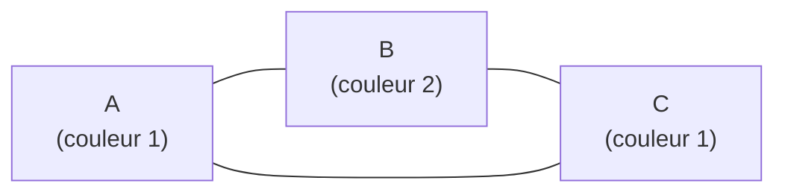
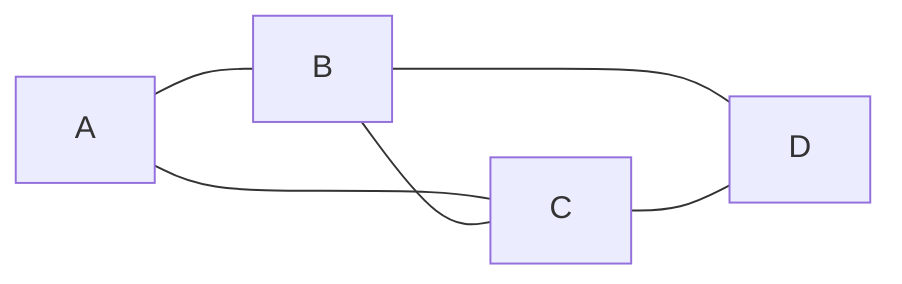
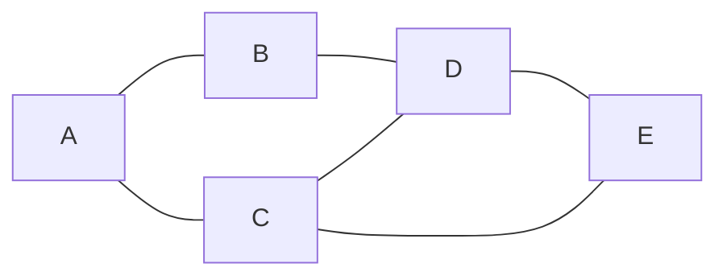

# Chapitre 4 -- Coloration de graphes

> **Idee centrale en une phrase :** Colorier un graphe, c'est attribuer une couleur a chaque sommet de facon que deux sommets adjacents n'aient jamais la meme couleur -- et on cherche a le faire avec le minimum de couleurs.

**Prerequis :** [Cycles et arbres](03_cycles_arbres.md)
**Chapitre suivant :** [Arbres couvrants minimaux -->](05_arbres_couvrants.md)

---

## 1. L'analogie de la carte geographique

### Le probleme

Regarde une carte politique du monde. Chaque pays a une couleur, et deux pays voisins (qui partagent une frontiere) n'ont jamais la meme couleur. Sinon, on ne pourrait pas distinguer les pays sur la carte.

**La question :** Combien de couleurs faut-il au minimum pour colorier une carte sans conflit ?

C'est exactement le probleme de **coloration de graphe** : les pays sont les sommets, deux pays voisins sont relies par une arete, et on veut colorer les sommets avec le minimum de couleurs tel que deux sommets adjacents aient des couleurs differentes.

### Autres applications

La coloration de graphes intervient dans de nombreux problemes pratiques :

- **Emplois du temps** : les cours sont les sommets, deux cours en conflit (meme prof ou meme salle) sont adjacents. Les couleurs sont les creneaux horaires.
- **Allocation de registres** en compilation : les variables sont les sommets, deux variables utilisees en meme temps sont adjacentes. Les couleurs sont les registres du processeur.
- **Frequences radio** : les antennes sont les sommets, deux antennes trop proches sont adjacentes. Les couleurs sont les frequences.

---

## 2. Definitions formelles

### Coloration propre

Une **coloration propre** (ou simplement coloration) d'un graphe G = (S, A) est une fonction c : S -> {1, 2, ..., k} qui attribue a chaque sommet un entier (une "couleur") tel que :

> Pour toute arete {u, v} dans A : c(u) != c(v)

Deux sommets adjacents ont des couleurs differentes.

### k-coloration

Une **k-coloration** est une coloration qui utilise au plus k couleurs.

Un graphe est **k-colorable** s'il admet une k-coloration.

### Nombre chromatique

Le **nombre chromatique** d'un graphe G, note chi(G), est le plus petit entier k tel que G admet une k-coloration.

**En langage courant :** C'est le nombre minimum de couleurs necessaires pour colorer G proprement.

### Exemples simples



> Ce triangle (K_3) necessite 3 couleurs : chi(K_3) = 3. Avec 2 couleurs, A et B auraient des couleurs differentes, B et C aussi, mais alors A et C auraient la meme couleur -- or ils sont adjacents !

---

## 3. Bornes du nombre chromatique

### Borne inferieure : la clique

Une **clique** est un sous-graphe complet (tous les sommets sont relies entre eux). Le **nombre de clique** omega(G) est la taille de la plus grande clique de G.

> **Propriete :** chi(G) >= omega(G)

**Pourquoi ?** Dans une clique de taille k, chaque sommet est adjacent a tous les autres, donc chaque sommet doit avoir une couleur differente. Il faut donc au moins k couleurs.

### Borne superieure : le degre maximum

> **Propriete :** chi(G) <= Delta(G) + 1

ou Delta(G) est le **degre maximal** du graphe (le plus grand degre parmi tous les sommets).

**Pourquoi ?** Avec l'algorithme glouton (voir section 5), on ne peut jamais avoir besoin de plus de Delta(G) + 1 couleurs, car chaque sommet a au plus Delta(G) voisins.

### Cas particuliers

| Graphe | chi(G) |
|--------|--------|
| Graphe sans arete (n sommets isoles) | 1 |
| Graphe biparti (non trivial) | 2 |
| Cycle pair C_{2k} | 2 |
| Cycle impair C_{2k+1} | 3 |
| Graphe complet K_n | n |
| Arbre (non trivial) | 2 |

---

## 4. Theoremes fondamentaux

### Theoreme de Brooks (1941)

> Pour tout graphe connexe G qui n'est ni un graphe complet ni un cycle impair :
>
> chi(G) <= Delta(G)

**En langage courant :** Sauf pour les graphes complets et les cycles impairs, on peut toujours faire mieux que Delta + 1 couleurs. On peut se contenter de Delta couleurs.

**Importance :** Brooks ameliore la borne Delta + 1 en Delta, sauf pour les deux exceptions ou Delta + 1 est effectivement necessaire :
- K_n : chi(K_n) = n = Delta + 1
- C_{2k+1} : chi = 3 = Delta + 1 (pour Delta = 2)

### Theoreme des quatre couleurs (1976)

> Tout graphe planaire est 4-colorable : chi(G) <= 4

**Historique :** Conjecture depuis 1852, demontree en 1976 par Appel et Haken a l'aide d'un ordinateur (premier theoreme majeur prouve par ordinateur). La preuve verifiee par ordinateur a ete confirmee en 2005 par Gonthier avec Coq.

### Theoreme des cinq couleurs (plus facile a demontrer)

> Tout graphe planaire est 5-colorable : chi(G) <= 5

C'est un resultat plus faible mais dont la preuve est accessible a un etudiant (par recurrence sur le nombre de sommets, en utilisant la formule d'Euler).

### Theoreme : graphe biparti et coloration

> Un graphe (avec au moins une arete) est 2-colorable si et seulement si il est biparti.
>
> Equivalence : un graphe est biparti ssi il ne contient pas de cycle de longueur impaire.

### Polynome chromatique

Le **polynome chromatique** P(G, k) donne le nombre de k-colorations propres du graphe G.

Exemples :
- P(K_n, k) = k(k-1)(k-2)...(k-n+1) = k! / (k-n)! (permutations)
- P(arbre a n sommets, k) = k * (k-1)^(n-1)

Le nombre chromatique chi(G) est le plus petit entier k tel que P(G, k) > 0.

---

## 5. Algorithme glouton de coloration

### Principe

Colorier les sommets un par un, dans un certain ordre. Pour chaque sommet, attribuer la plus petite couleur qui n'est pas deja utilisee par un voisin.

### Pseudo-code

```
ColorationGlouton(G, ordre):
    Pour chaque sommet v dans l'ordre:
        Couleurs_interdites = {c(w) : w voisin de v et w deja colore}
        c(v) = plus petit entier >= 1 qui n'est pas dans Couleurs_interdites
    
    Retourner c
```

### Exemple pas a pas

Graphe : A-B, A-C, B-C, B-D, C-D



Ordre choisi : A, B, C, D

| Etape | Sommet | Voisins deja colores | Couleurs interdites | Couleur attribuee |
|-------|--------|---------------------|---------------------|-------------------|
| 1 | A | aucun | {} | 1 |
| 2 | B | A(1) | {1} | 2 |
| 3 | C | A(1), B(2) | {1, 2} | 3 |
| 4 | D | B(2), C(3) | {2, 3} | 1 |

Resultat : 3 couleurs utilisees. Est-ce optimal ? Oui, car A-B-C forme un triangle (K_3), donc chi >= 3.

### L'ordre compte !

L'algorithme glouton ne donne pas toujours le nombre chromatique optimal. Le resultat depend de l'ordre dans lequel on traite les sommets.

**Mauvais ordre :** Peut utiliser beaucoup plus de couleurs que necessaire.

**Bons ordres heuristiques :**
- **Plus grand degre d'abord** : traiter les sommets les plus connectes en premier.
- **DSatur** : a chaque etape, choisir le sommet qui a le plus de couleurs differentes parmi ses voisins (saturation maximale).

### Algorithme DSatur (Degree of Saturation)

```
DSatur(G):
    Pour chaque sommet v:
        saturation(v) = 0
        c(v) = non defini
    
    Repeter n fois:
        v = sommet non colore avec la plus grande saturation
             (en cas d'egalite, prendre celui de plus grand degre)
        c(v) = plus petite couleur non utilisee par les voisins de v
        Mettre a jour la saturation des voisins non colores de v
    
    Retourner c
```

**DSatur est exact pour les graphes bipartis** et donne de bons resultats en pratique, mais ne garantit pas toujours l'optimalite.

---

## 6. Coloration d'aretes

### Definition

La **coloration d'aretes** (ou coloration chromatique d'aretes) consiste a colorier les aretes du graphe de sorte que deux aretes partageant un sommet commun aient des couleurs differentes.

L'**indice chromatique** chi'(G) est le nombre minimum de couleurs necessaires.

### Theoreme de Vizing (1964)

> Pour tout graphe simple G : Delta(G) <= chi'(G) <= Delta(G) + 1

L'indice chromatique est soit Delta, soit Delta + 1. Un graphe est dit de **classe 1** si chi'(G) = Delta et de **classe 2** si chi'(G) = Delta + 1.

---

## 7. Applications en exercice

### Application 1 : emploi du temps

On a 5 examens (A, B, C, D, E) et des etudiants inscrits dans plusieurs matieres. Deux examens ne peuvent pas avoir lieu en meme temps si un etudiant est inscrit aux deux.

Conflits : A-B, A-C, B-D, C-D, C-E, D-E



Coloration glouton (ordre A, B, C, D, E) :
- A : couleur 1
- B : couleur 2 (conflit avec A)
- C : couleur 2 (conflit avec A, pas avec B... Attention ! A-C est une arete, donc conflit. C : couleur 2 ? Non, A(1) et B ne sont pas voisins de C... Recalculons.)

Voisins de C : A(1), D(pas encore), E(pas encore). Couleur interdite : {1}. C recoit 2.
Voisins de D : B(2), C(2), E(pas encore). Couleurs interdites : {2}. D recoit 1.
Voisins de E : C(2), D(1). Couleurs interdites : {1, 2}. E recoit 3.

Resultat : 3 creneaux horaires suffisent.

### Application 2 : frequences radio

Meme principe : les antennes sont les sommets, la proximite cree des aretes, et les couleurs sont les frequences.

---

## Pieges classiques

| Piege | Explication |
|-------|-------------|
| Confondre chi et omega | chi(G) >= omega(G), mais l'egalite n'est pas toujours vraie. Il existe des graphes sans triangle (omega = 2) avec chi arbitrairement grand (graphes de Mycielski). |
| Appliquer Brooks a un graphe complet | Brooks dit chi <= Delta, SAUF pour les graphes complets et les cycles impairs. Ne pas oublier les exceptions ! |
| Croire que le glouton donne toujours chi | L'algorithme glouton donne une coloration valide mais pas forcement optimale. Le nombre de couleurs depend de l'ordre des sommets. |
| Oublier que les arbres sont 2-colorables | Un arbre (avec au moins 2 sommets) est biparti, donc 2-colorable. C'est un cas facile souvent oublie. |
| Confondre coloration de sommets et d'aretes | Ce sont deux problemes differents. La coloration de sommets (la plus courante) colorie les sommets. La coloration d'aretes colorie les aretes. |
| Theoreme des 4 couleurs : seulement pour les graphes planaires | Ce theoreme ne s'applique qu'aux graphes planaires. Un graphe non planaire peut necessiter plus de 4 couleurs. |

---

## Recapitulatif

- **Coloration propre** : chaque sommet a une couleur, deux voisins ont des couleurs differentes.
- **Nombre chromatique chi(G)** : minimum de couleurs necessaires.
- **Bornes** : omega(G) <= chi(G) <= Delta(G) + 1.
- **Brooks** : chi(G) <= Delta(G), sauf pour K_n et les cycles impairs.
- **4 couleurs** : tout graphe planaire est 4-colorable.
- **Biparti = 2-colorable = pas de cycle impair**.
- **Algorithme glouton** : simple, O(n+m), mais depend de l'ordre. DSatur est une bonne heuristique.
- **Vizing** : pour les aretes, Delta <= chi' <= Delta + 1.
- **Applications** : emplois du temps, registres CPU, frequences radio.
