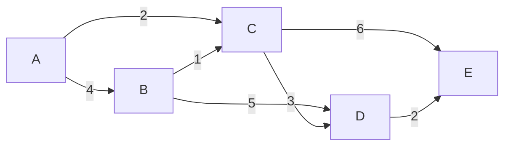

# Chapitre 5 -- Arbres couvrants minimaux

> **Idee centrale en une phrase :** Trouver la facon la moins couteuse de relier tous les points d'un reseau, sans creer de boucle -- c'est le probleme de l'arbre couvrant minimal, resolu par les algorithmes de Kruskal et Prim.

**Prerequis :** [Cycles et arbres](03_cycles_arbres.md)
**Chapitre suivant :** [Plus courts chemins -->](06_plus_courts_chemins.md)

---

## 1. L'analogie du reseau electrique

### Le probleme

Une compagnie d'electricite doit relier 6 villages par des cables electriques. Chaque paire de villages peut etre reliee, mais le cout depend de la distance, du terrain, etc. L'objectif :

1. **Tous les villages doivent etre alimentes** (connexite).
2. **Le cout total doit etre minimal** (optimisation).
3. **Pas de cable inutile** -- on ne veut pas de boucle qui gaspille du cable.

C'est exactement le probleme de l'**arbre couvrant minimal** (ACM ou MST -- Minimum Spanning Tree) :
- Les villages sont les sommets.
- Les cables possibles sont les aretes.
- Les couts sont les poids des aretes.
- L'ACM est l'arbre couvrant dont la somme des poids est minimale.

### Schema intuitif



> Graphe pondere : 5 sommets, 7 aretes. L'ACM aura 4 aretes (n-1 = 5-1 = 4).
> ACM possible : B-C(1), A-C(2), D-E(2), C-D(3) -> cout total = 8.

---

## 2. Definition formelle

### Arbre couvrant

Un **arbre couvrant** d'un graphe connexe G = (S, A) est un sous-graphe T = (S, A') qui :
- Contient **tous** les sommets de G.
- Est un **arbre** (connexe et acyclique).
- A exactement **n - 1 aretes** (ou n = |S|).

### Arbre couvrant minimal (ACM)

Pour un graphe pondere G = (S, A, w), un **arbre couvrant minimal** est un arbre couvrant T qui minimise :

```
w(T) = Somme de w(e) pour toute arete e dans T
```

### Existence et unicite

- **Existence :** Tout graphe connexe pondere possede au moins un ACM.
- **Unicite :** L'ACM est unique si et seulement si tous les poids sont distincts (pas de poids egaux).

---

## 3. Propriete fondamentale : la propriete de coupe

### Coupe

Une **coupe** dans un graphe est une partition des sommets en deux ensembles non vides S1 et S2. Les aretes de la coupe sont celles qui relient un sommet de S1 a un sommet de S2.

### Propriete de coupe (Cut Property)

> Pour toute coupe du graphe, l'arete de poids minimal traversant cette coupe appartient a (au moins) un ACM.

**Intuition :** Si tu dois relier deux groupes de sommets, il est toujours optimal de choisir le lien le moins cher entre les deux groupes.

C'est la propriete qui justifie a la fois l'algorithme de Kruskal et celui de Prim.

### Propriete de cycle (Cycle Property)

> Pour tout cycle du graphe, l'arete de poids maximal dans ce cycle n'appartient a aucun ACM (si son poids est strictement plus grand que toutes les autres aretes du cycle).

**Intuition :** Si une arete est dans un cycle et qu'elle est la plus couteuse, on peut toujours la remplacer par une autre arete du cycle qui coute moins cher.

---

## 4. Algorithme de Kruskal

### Idee

Trier toutes les aretes par poids croissant. Les ajouter une par une, en sautant celles qui creeraient un cycle.

**Analogie :** C'est comme construire un puzzle en choisissant toujours la piece la moins chere, a condition qu'elle ne forme pas une boucle.

### Pseudo-code

```
Kruskal(G):
    Trier les aretes par poids croissant
    T = ensemble vide (aretes de l'ACM)
    
    Pour chaque arete {u, v} (dans l'ordre croissant de poids):
        Si u et v ne sont pas dans la meme composante connexe:
            Ajouter {u, v} a T
            Fusionner les composantes de u et v
    
    Retourner T
```

### Structure Union-Find

Pour verifier efficacement si deux sommets sont dans la meme composante, on utilise la structure **Union-Find** (ou Disjoint Set Union) :

- **Find(x)** : retourne le representant de la composante de x.
- **Union(x, y)** : fusionne les composantes de x et y.

Avec les optimisations **compression de chemin** et **union par rang**, chaque operation coute quasi O(1) (O(alpha(n)), ou alpha est la fonction inverse d'Ackermann, quasi-constante).

### Exemple pas a pas

Graphe :

| Arete | Poids |
|-------|-------|
| B-C | 1 |
| A-C | 2 |
| D-E | 2 |
| C-D | 3 |
| A-B | 4 |
| B-D | 5 |
| C-E | 6 |

Aretes triees : B-C(1), A-C(2), D-E(2), C-D(3), A-B(4), B-D(5), C-E(6)

| Etape | Arete | Poids | Action | Composantes |
|-------|-------|-------|--------|-------------|
| 1 | B-C | 1 | Ajouter (B et C separes) | {A}, {B,C}, {D}, {E} |
| 2 | A-C | 2 | Ajouter (A et C separes) | {A,B,C}, {D}, {E} |
| 3 | D-E | 2 | Ajouter (D et E separes) | {A,B,C}, {D,E} |
| 4 | C-D | 3 | Ajouter (ABC et DE separes) | {A,B,C,D,E} |
| 5 | A-B | 4 | Refuser (A et B meme composante) | -- |
| 6 | B-D | 5 | Refuser (B et D meme composante) | -- |
| 7 | C-E | 6 | Refuser (C et E meme composante) | -- |

**ACM : {B-C, A-C, D-E, C-D}, poids total = 1 + 2 + 2 + 3 = 8.**

### Complexite

- Tri des aretes : **O(m log m)**
- m operations Union-Find : **O(m * alpha(n))** quasi O(m)
- **Total : O(m log m)** = O(m log n) car m <= n^2, donc log m <= 2 log n.

---

## 5. Algorithme de Prim

### Idee

Partir d'un sommet quelconque et faire grossir l'arbre progressivement. A chaque etape, ajouter l'arete de poids minimal qui relie un sommet deja dans l'arbre a un sommet pas encore dans l'arbre.

**Analogie :** C'est comme faire pousser un arbre : on part d'une graine et on ajoute toujours la branche la moins chere qui atteint un nouveau sommet.

### Pseudo-code

```
Prim(G, s):
    // s = sommet de depart (quelconque)
    T = {s}  // sommets dans l'arbre
    Aretes_ACM = ensemble vide
    
    Tant que |T| < n:
        Trouver l'arete {u, v} de poids minimal telle que
            u est dans T et v n'est pas dans T
        Ajouter v a T
        Ajouter {u, v} a Aretes_ACM
    
    Retourner Aretes_ACM
```

### Version avec file de priorite

```
Prim_Optimise(G, s):
    Pour chaque sommet v:
        cle(v) = infini
        parent(v) = null
        dans_arbre(v) = false
    
    cle(s) = 0
    F = file de priorite contenant tous les sommets
    
    Tant que F n'est pas vide:
        u = ExtractMin(F)
        dans_arbre(u) = true
        
        Pour chaque voisin v de u:
            Si v n'est pas dans l'arbre ET w(u,v) < cle(v):
                parent(v) = u
                cle(v) = w(u,v)
                DecreaseKey(F, v, cle(v))
    
    Retourner les aretes {parent(v), v} pour tout v != s
```

### Exemple pas a pas

Meme graphe que Kruskal. Depart : sommet A.

| Etape | T (dans l'arbre) | Aretes candidates | Arete choisie | Poids |
|-------|-----------------|-------------------|---------------|-------|
| 0 | {A} | A-B(4), A-C(2) | A-C | 2 |
| 1 | {A, C} | A-B(4), C-B(1), C-D(3), C-E(6) | C-B | 1 |
| 2 | {A, C, B} | B-D(5), C-D(3), C-E(6) | C-D | 3 |
| 3 | {A, C, B, D} | D-E(2), C-E(6) | D-E | 2 |
| 4 | {A, C, B, D, E} | Termine | -- | -- |

**ACM : {A-C, C-B, C-D, D-E}, poids total = 2 + 1 + 3 + 2 = 8.**

Meme resultat que Kruskal (meme ACM, meme cout).

### Complexite

- Avec un **tas binaire** : O((n + m) log n) = O(m log n)
- Avec un **tas de Fibonacci** : O(m + n log n) -- optimal pour les graphes denses.
- Avec une **simple recherche lineaire** (sans file de priorite) : O(n^2) -- simple a implementer, bon pour les graphes denses.

---

## 6. Comparaison Kruskal vs Prim

| Critere | Kruskal | Prim |
|---------|---------|------|
| Approche | Globale (toutes les aretes) | Locale (depuis un sommet) |
| Structure cle | Union-Find | File de priorite |
| Complexite | O(m log m) | O(m log n) avec tas binaire |
| Meilleur pour | Graphes creux (m petit) | Graphes denses (m grand) |
| Facilite | Simple a implementer | Plus complexe (file de priorite) |
| A la main | Tres pratique (tri + parcours) | Correct mais plus de bookkeeping |

### En DS : lequel utiliser ?

- **Kruskal** est generalement plus facile a derouler a la main car il suffit de trier les aretes et de les considerer une par une.
- **Prim** est demande quand l'enonce precise "a partir du sommet X" ou quand le graphe est represente par une matrice d'adjacence.

---

## 7. Correction des algorithmes

### Pourquoi Kruskal est correct ?

A chaque etape, quand on ajoute une arete {u, v}, les sommets u et v sont dans des composantes differentes. L'arete {u, v} est la plus legere parmi toutes les aretes qui traversent la coupe entre la composante de u et le reste du graphe. Par la **propriete de coupe**, cette arete appartient a un ACM.

### Pourquoi Prim est correct ?

A chaque etape, l'arete ajoutee est la plus legere qui traverse la coupe entre les sommets deja dans l'arbre et les sommets pas encore dans l'arbre. Par la **propriete de coupe**, cette arete appartient a un ACM.

---

## 8. Algorithme de Boruvka (complement)

### Idee

A chaque phase, pour **chaque composante connexe**, trouver l'arete de poids minimal qui la relie a une autre composante, et ajouter toutes ces aretes simultanement.

### Propriete

Le nombre de composantes est au moins divise par 2 a chaque phase, donc il y a au plus O(log n) phases.

### Complexite

O(m log n) -- meme ordre que Kruskal et Prim.

**Interet :** Boruvka est naturellement parallelisable (chaque composante peut travailler independamment).

---

## 9. Applications de l'ACM

### Reseaux de communication

Relier des villes par des cables (fibre optique, electricite) avec un cout minimal.

### Clustering

En supprimant les k-1 aretes les plus lourdes de l'ACM, on obtient k clusters (groupes). C'est la base de l'algorithme de clustering "single-linkage".

### Approximation du voyageur de commerce

L'ACM donne une approximation a facteur 2 du probleme du voyageur de commerce (TSP) sur des distances metriques.

---

## Pieges classiques

| Piege | Explication |
|-------|-------------|
| Oublier de verifier l'absence de cycle (Kruskal) | A chaque arete, il faut verifier que les deux extremites sont dans des composantes differentes. Sinon on cree un cycle et ce n'est plus un arbre. |
| Ajouter une arete entre deux sommets deja dans T (Prim) | L'arete doit relier un sommet dans T a un sommet hors de T. Pas deux sommets deja dans T. |
| Confondre ACM et plus court chemin | L'ACM minimise le cout TOTAL de toutes les aretes. Le plus court chemin minimise le cout d'un trajet entre deux sommets specifiques. Ce sont deux problemes differents ! |
| Croire que l'ACM est unique | L'ACM est unique seulement si tous les poids sont distincts. S'il y a des poids egaux, il peut y avoir plusieurs ACM de meme cout total. |
| Oublier que l'ACM a exactement n-1 aretes | C'est un arbre : n sommets, n-1 aretes. Si tu as plus ou moins d'aretes, il y a une erreur. |
| Se tromper dans Union-Find | Bien verifier que Find(u) != Find(v) avant d'ajouter l'arete. Sinon on cree un cycle. |

---

## Recapitulatif

- **ACM** = arbre couvrant de poids minimal. n-1 aretes, connexe, acyclique, cout total minimal.
- **Propriete de coupe** : l'arete la plus legere d'une coupe est dans un ACM.
- **Kruskal** : trier les aretes, les ajouter si pas de cycle (Union-Find). O(m log m). Bon pour les graphes creux.
- **Prim** : faire grossir l'arbre depuis un sommet, ajouter l'arete la plus legere vers un nouveau sommet. O(m log n). Bon pour les graphes denses.
- Les deux donnent le **meme resultat** (meme ACM si les poids sont distincts).
- **n-1 aretes** dans l'ACM, toujours. Verifier ca en DS !
