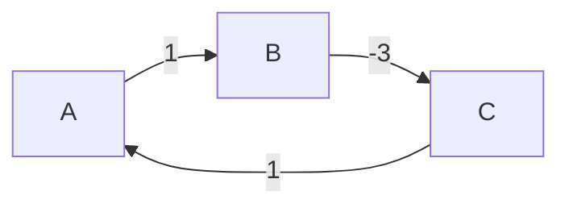
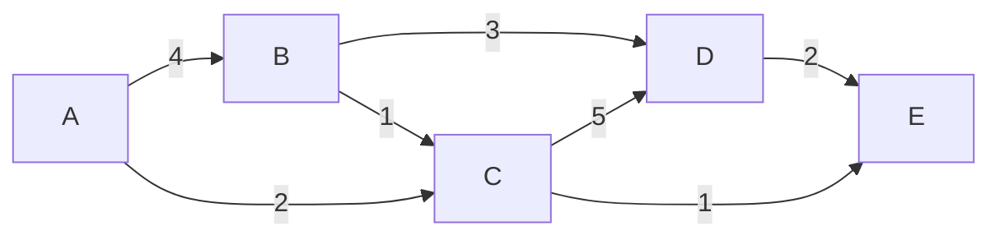
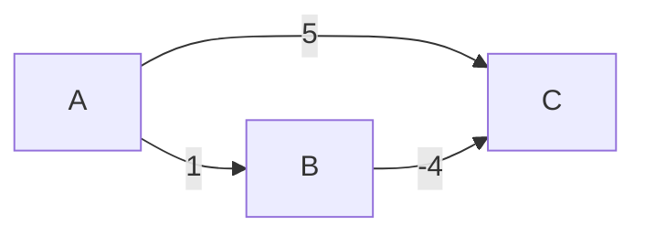
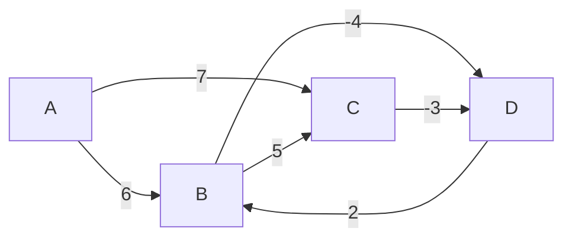

# Chapitre 6 -- Plus courts chemins

> **Idee centrale en une phrase :** Trouver le chemin le moins couteux entre deux points d'un reseau -- c'est le probleme du plus court chemin, resolu par Dijkstra (poids positifs), Bellman-Ford (poids quelconques) ou Floyd-Warshall (tous les couples).

**Prerequis :** [Connexite](02_connexite.md)
**Chapitre suivant :** [Ordonnancement -->](07_ordonnancement.md)

---

## 1. L'analogie du GPS

### Le probleme

Tu ouvres ton GPS et tu demandes le chemin le plus rapide de chez toi a l'aeroport. Le GPS connait :
- Toutes les intersections (sommets).
- Toutes les routes entre les intersections (arcs).
- Le temps de trajet sur chaque route (poids).

Il te calcule le chemin qui **minimise le temps total**. C'est exactement le probleme du **plus court chemin** dans un graphe pondere.

### Variantes du probleme

| Variante | Description | Algorithme |
|----------|-------------|------------|
| Source unique, poids >= 0 | Plus court chemin depuis un sommet, poids positifs | **Dijkstra** |
| Source unique, poids quelconques | Plus court chemin depuis un sommet, poids negatifs possibles | **Bellman-Ford** |
| Tous les couples | Plus court chemin entre toute paire de sommets | **Floyd-Warshall** |

---

## 2. Definitions formelles

### Poids d'un chemin

Le **poids** (ou cout, ou longueur ponderee) d'un chemin P = (v0, v1, ..., vk) est :

```
w(P) = w(v0,v1) + w(v1,v2) + ... + w(v_{k-1},vk)
```

C'est la somme des poids des arcs le long du chemin.

### Distance ponderee

La **distance** de u a v, notee delta(u, v), est le poids du plus court chemin de u a v :

```
delta(u, v) = min { w(P) : P est un chemin de u a v }
```

Si aucun chemin n'existe : delta(u, v) = infini.

### Sous-structure optimale

> **Propriete :** Tout sous-chemin d'un plus court chemin est lui-meme un plus court chemin.

Si le plus court chemin de A a D passe par B et C (A -> B -> C -> D), alors :
- A -> B -> C est le plus court chemin de A a C.
- B -> C -> D est le plus court chemin de B a D.

C'est cette propriete qui permet les algorithmes de programmation dynamique (Bellman-Ford, Floyd-Warshall).

### Probleme des circuits de poids negatif

Si le graphe contient un **circuit de poids negatif** (un cycle dont la somme des poids est negative), alors le plus court chemin n'est pas defini : on peut toujours reduire le cout en repassant par ce circuit.



> Circuit A -> B -> C -> A de poids 1 + (-3) + 1 = -1. Chaque tour reduit le cout de 1. Le plus court chemin de A a B est -infini !

---

## 3. Algorithme de Dijkstra

### Principe

Dijkstra explore les sommets par **ordre de distance croissante** depuis la source. A chaque etape, il prend le sommet non visite le plus proche et met a jour les distances de ses voisins.

**Hypothese cruciale :** Tous les poids sont **positifs ou nuls** (w(e) >= 0 pour tout arc e).

### Analogie

Imagine une pierre tombant dans l'eau. L'onde se propage en cercles concentriques, touchant d'abord les points les plus proches. Dijkstra fait la meme chose : il "explore" d'abord les sommets proches, puis les sommets eloignes.

### Pseudo-code

```
Dijkstra(G, s):
    Pour chaque sommet v:
        dist(v) = infini
        pred(v) = null
        visite(v) = false
    
    dist(s) = 0
    
    Repeter n fois:
        u = sommet non visite avec dist(u) minimale
        visite(u) = true
        
        Pour chaque voisin v de u:
            Si dist(u) + w(u,v) < dist(v):
                dist(v) = dist(u) + w(u,v)
                pred(v) = u
    
    Retourner dist, pred
```

### Reconstruction du chemin

Pour retrouver le plus court chemin de s a un sommet t, on remonte les predecesseurs :

```
ReconstructionChemin(pred, s, t):
    chemin = [t]
    v = t
    Tant que v != s:
        v = pred(v)
        Ajouter v au debut de chemin
    Retourner chemin
```

### Exemple pas a pas



Source : A

| Etape | Sommet choisi | dist(A) | dist(B) | dist(C) | dist(D) | dist(E) |
|-------|--------------|---------|---------|---------|---------|---------|
| Init | -- | 0 | inf | inf | inf | inf |
| 1 | A | **0** | 4 | 2 | inf | inf |
| 2 | C (dist=2) | 0 | 3 | **2** | 7 | 3 |
| 3 | B (dist=3) | 0 | **3** | 2 | 6 | 3 |
| 4 | E (dist=3) | 0 | 3 | 2 | 6 | **3** |
| 5 | D (dist=6) | 0 | 3 | 2 | **6** | 3 |

**Explications detaillees :**

**Etape 1 :** On part de A (dist=0). On met a jour ses voisins : dist(B) = 0+4=4, dist(C) = 0+2=2.

**Etape 2 :** Le sommet non visite le plus proche est C (dist=2). On met a jour ses voisins :
- B : dist(C)+w(C,B)... mais l'arc est B->C, pas C->B. On reconsidere : dist(B) reste 4 si pas d'arc C->B. En fait, verifions : B->C(1) existe, mais C->B n'est pas indique. Cependant A->B(4) et C via A pourrait donner B=min(4, 2+1=3). Oui : l'arc B-C de poids 1 signifie qu'on peut aussi reconsiderer B via C. dist(B) = min(4, 2+1) = 3.
- D : dist(D) = min(inf, 2+5) = 7.
- E : dist(E) = min(inf, 2+1) = 3.

**Etape 3 :** Les non visites les plus proches sont B(3) et E(3). On choisit B. Mise a jour :
- D : dist(D) = min(7, 3+3) = 6.

**Etape 4 :** On choisit E (dist=3). Pas de mise a jour utile.

**Etape 5 :** On choisit D (dist=6).

**Resultats finaux :** dist = {A:0, B:3, C:2, D:6, E:3}

**Plus court chemin A->D :** A -> C -> B -> D (cout 2+1+3 = 6).

### Complexite

| Implementation | Complexite |
|----------------|-----------|
| Tableau simple (recherche lineaire du min) | O(n^2) |
| Tas binaire (priority queue) | O((n + m) log n) |
| Tas de Fibonacci | O(m + n log n) |

- **Graphe dense** (m ~ n^2) : la version tableau en O(n^2) est la meilleure.
- **Graphe creux** (m ~ n) : la version tas en O(n log n) est la meilleure.

### Pourquoi Dijkstra echoue avec les poids negatifs

Dijkstra marque un sommet comme "visite" definitivement. Avec des poids negatifs, un chemin plus long en nombre d'aretes pourrait etre plus court en poids. Dijkstra ne le detecterait pas.

**Exemple :**



- Dijkstra choisit B (dist=1), puis C (dist=5). Mais le vrai plus court chemin vers C est A->B->C = 1+(-4) = -3.
- Dijkstra a deja fixe dist(C)=5 avant de voir le chemin via B. Quand il visite B, il tente de mettre a jour C a -3, mais C est deja visite... Cela depend de l'implementation, mais le principe de Dijkstra est invalide avec des poids negatifs.

---

## 4. Algorithme de Bellman-Ford

### Principe

Bellman-Ford **relaxe** toutes les aretes, n-1 fois. Il gere les poids negatifs et detecte les circuits de poids negatif.

### Relaxation

**Relaxer** un arc (u, v) signifie verifier si on peut ameliorer la distance a v en passant par u :

```
Si dist(u) + w(u,v) < dist(v):
    dist(v) = dist(u) + w(u,v)
    pred(v) = u
```

### Pourquoi n-1 iterations ?

Un plus court chemin dans un graphe a n sommets utilise au plus n-1 arcs. A chaque iteration, on "apprend" un arc de plus. Donc apres n-1 iterations, tous les plus courts chemins sont trouves.

### Pseudo-code

```
BellmanFord(G, s):
    Pour chaque sommet v:
        dist(v) = infini
        pred(v) = null
    dist(s) = 0
    
    // Relaxation : n-1 iterations
    Pour i de 1 a n-1:
        Pour chaque arc (u, v) du graphe:
            Si dist(u) + w(u,v) < dist(v):
                dist(v) = dist(u) + w(u,v)
                pred(v) = u
    
    // Detection de circuit negatif : n-eme iteration
    Pour chaque arc (u, v) du graphe:
        Si dist(u) + w(u,v) < dist(v):
            ERREUR : "Circuit de poids negatif detecte !"
    
    Retourner dist, pred
```

### Detection de circuit negatif

Apres n-1 iterations, si une relaxation supplementaire (la n-eme) ameliore encore une distance, c'est qu'il existe un circuit de poids negatif. En effet, un vrai plus court chemin utilise au plus n-1 arcs, donc n-1 iterations suffisent. Si la n-eme iteration ameliore encore quelque chose, c'est qu'on peut "tourner en rond" indefiniment.

### Exemple pas a pas



Source : A. n = 4 sommets, donc 3 iterations.

Arcs dans l'ordre : (A,B), (A,C), (B,C), (B,D), (C,D), (D,B)

**Iteration 1 :**

| Arc | dist avant | Relaxation | dist apres |
|-----|-----------|------------|-----------|
| (A,B) | dist(B)=inf | 0+6=6 < inf | dist(B)=6 |
| (A,C) | dist(C)=inf | 0+7=7 < inf | dist(C)=7 |
| (B,C) | dist(C)=7 | 6+5=11 > 7 | dist(C)=7 |
| (B,D) | dist(D)=inf | 6+(-4)=2 < inf | dist(D)=2 |
| (C,D) | dist(D)=2 | 7+(-3)=4 > 2 | dist(D)=2 |
| (D,B) | dist(B)=6 | 2+2=4 < 6 | dist(B)=4 |

**Iteration 2 :**

| Arc | dist avant | Relaxation | dist apres |
|-----|-----------|------------|-----------|
| (A,B) | dist(B)=4 | 0+6=6 > 4 | dist(B)=4 |
| (A,C) | dist(C)=7 | 0+7=7 = 7 | dist(C)=7 |
| (B,C) | dist(C)=7 | 4+5=9 > 7 | dist(C)=7 |
| (B,D) | dist(D)=2 | 4+(-4)=0 < 2 | dist(D)=0 |
| (C,D) | dist(D)=0 | 7+(-3)=4 > 0 | dist(D)=0 |
| (D,B) | dist(B)=4 | 0+2=2 < 4 | dist(B)=2 |

**Iteration 3 :**

| Arc | dist avant | Relaxation | dist apres |
|-----|-----------|------------|-----------|
| (B,D) | dist(D)=0 | 2+(-4)=-2 < 0 | dist(D)=-2 |
| (D,B) | dist(B)=2 | (-2)+2=0 < 2 | dist(B)=0 |

Les distances continuent de diminuer... Faisons la verification :

**Verification (iteration n = 4) :** Si une distance change encore, il y a un circuit negatif.
- (B,D) : 0+(-4) = -4 < -2. Amelioration ! **Circuit negatif detecte.**

Le circuit B -> D -> B a un poids de (-4) + 2 = -2 < 0.

### Complexite

**O(n * m)** : n-1 iterations, chacune parcourant tous les m arcs.

---

## 5. Algorithme de Floyd-Warshall

### Principe

Floyd-Warshall calcule les plus courts chemins entre **tous les couples** de sommets, en utilisant la **programmation dynamique**.

**Idee :** On considere les sommets un par un comme "intermediaires". A l'etape k, on a les plus courts chemins en n'utilisant que les sommets {1, 2, ..., k} comme intermediaires.

### Pseudo-code

```
FloydWarshall(G):
    // Initialisation : matrice des distances
    Pour i de 1 a n:
        Pour j de 1 a n:
            Si i == j:
                dist[i][j] = 0
            Sinon si (i,j) est un arc:
                dist[i][j] = w(i,j)
            Sinon:
                dist[i][j] = infini
    
    // Programmation dynamique
    Pour k de 1 a n:           // sommet intermediaire
        Pour i de 1 a n:       // source
            Pour j de 1 a n:   // destination
                Si dist[i][k] + dist[k][j] < dist[i][j]:
                    dist[i][j] = dist[i][k] + dist[k][j]
    
    Retourner dist
```

### L'ordre des boucles est crucial

**La boucle sur k (intermediaire) doit etre la boucle EXTERNE.** Si on met k en boucle interne, l'algorithme est faux !

### Detection de circuits negatifs

Apres execution, si un element diagonal dist[i][i] < 0, alors il existe un circuit negatif passant par le sommet i.

### Exemple pas a pas

Graphe : A -> B (3), A -> C (8), B -> C (2), C -> A (5), B -> A (-4)

Matrice initiale :

```
     A    B    C
A [  0    3    8  ]
B [ -4    0    2  ]
C [  5   inf   0  ]
```

**k = A (intermediaire A) :**
- dist[B][C] = min(2, dist[B][A] + dist[A][C]) = min(2, -4+8) = min(2, 4) = 2. Pas de changement.
- dist[C][B] = min(inf, dist[C][A] + dist[A][B]) = min(inf, 5+3) = 8. Amelioration !

```
     A    B    C
A [  0    3    8  ]
B [ -4    0    2  ]
C [  5    8    0  ]
```

**k = B (intermediaire B) :**
- dist[A][C] = min(8, dist[A][B] + dist[B][C]) = min(8, 3+2) = 5. Amelioration !
- dist[C][A] = min(5, dist[C][B] + dist[B][A]) = min(5, 8+(-4)) = min(5, 4) = 4. Amelioration !

```
     A    B    C
A [  0    3    5  ]
B [ -4    0    2  ]
C [  4    8    0  ]
```

**k = C (intermediaire C) :**
- dist[A][B] = min(3, dist[A][C] + dist[C][B]) = min(3, 5+8) = 3. Pas de changement.
- dist[B][A] = min(-4, dist[B][C] + dist[C][A]) = min(-4, 2+4) = -4. Pas de changement.

**Resultat final :**

```
     A    B    C
A [  0    3    5  ]
B [ -4    0    2  ]
C [  4    8    0  ]
```

Pas de valeur negative sur la diagonale, donc pas de circuit negatif.

### Complexite

**O(n^3)** en temps, **O(n^2)** en espace (la matrice des distances).

---

## 6. Comparaison des algorithmes

| Critere | Dijkstra | Bellman-Ford | Floyd-Warshall |
|---------|----------|-------------|----------------|
| Probleme | Source unique | Source unique | Tous les couples |
| Poids negatifs | Non | Oui | Oui |
| Circuit negatif | Non detecte | Detecte | Detecte |
| Complexite | O(m log n) | O(n * m) | O(n^3) |
| Approche | Glouton | Relaxation iteree | Programmation dynamique |
| Quand l'utiliser | Poids >= 0 | Poids quelconques | Petits graphes, tous les couples |

### Guide de choix en DS

1. **Poids tous positifs, un seul depart ?** -> Dijkstra.
2. **Poids negatifs possibles, un seul depart ?** -> Bellman-Ford.
3. **Tous les plus courts chemins ?** -> Floyd-Warshall.
4. **Pas de poids (graphe non pondere) ?** -> BFS (distance = nombre d'aretes).

---

## 7. Cas particulier : graphes orientes acycliques (DAG)

Pour un DAG, on peut calculer les plus courts chemins depuis une source en **O(n + m)** :

```
PlusCourtCheminDAG(G, s):
    Faire un tri topologique de G
    
    Pour chaque sommet v:
        dist(v) = infini
    dist(s) = 0
    
    Pour chaque sommet u dans l'ordre topologique:
        Pour chaque successeur v de u:
            Si dist(u) + w(u,v) < dist(v):
                dist(v) = dist(u) + w(u,v)
    
    Retourner dist
```

**Pourquoi ca marche ?** L'ordre topologique garantit que quand on traite un sommet u, tous ses predecesseurs ont deja ete traites. Donc dist(u) est deja optimale.

---

## Pieges classiques

| Piege | Explication |
|-------|-------------|
| Utiliser Dijkstra avec des poids negatifs | Dijkstra ne fonctionne PAS avec des poids negatifs. Utilise Bellman-Ford. |
| Oublier de verifier les circuits negatifs avec Bellman-Ford | La n-eme iteration est la verification. Si une distance change, il y a un circuit negatif. |
| Mauvais ordre des boucles dans Floyd-Warshall | La boucle sur k (intermediaire) DOIT etre la boucle la plus externe. k, i, j -- dans cet ordre ! |
| Confondre ACM et plus court chemin | L'ACM minimise le cout total de l'arbre. Dijkstra minimise le cout du chemin depuis une source. Ce sont des problemes DIFFERENTS. |
| Oublier de mettre dist(s) = 0 | La source a une distance de 0 a elle-meme. L'initialiser a infini est une erreur classique. |
| Confondre "longueur" (nombre d'aretes) et "poids" (somme des valuations) | En graphe non pondere, la distance = nombre d'aretes (utilise BFS). En graphe pondere, la distance = somme des poids (utilise Dijkstra/Bellman-Ford). |

---

## Recapitulatif

- **Plus court chemin** = chemin de poids minimal entre deux sommets.
- **Dijkstra** : glouton, poids >= 0, O(m log n). Le plus utilise en pratique.
- **Bellman-Ford** : relaxation n-1 fois, poids quelconques, detecte les circuits negatifs, O(nm).
- **Floyd-Warshall** : tous les couples, programmation dynamique, O(n^3). Boucle k EXTERNE.
- **DAG** : tri topologique + relaxation, O(n+m). Le cas le plus efficace.
- **Pas de plus court chemin** si circuit de poids negatif.
- En DS : verifier d'abord si les poids sont positifs (Dijkstra) ou negatifs (Bellman-Ford).
