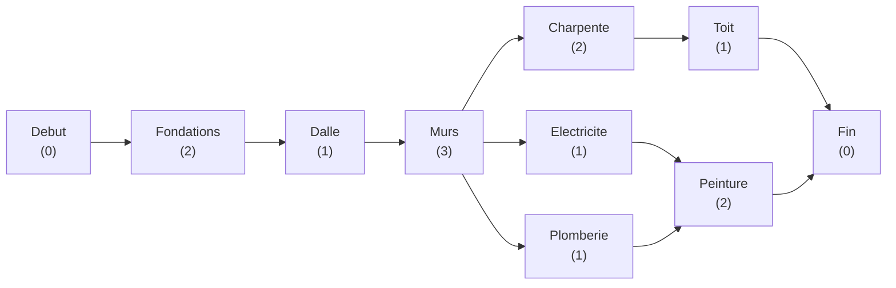
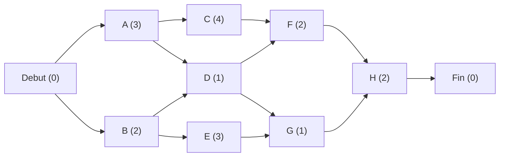

# Chapitre 7 -- Ordonnancement

> **Idee centrale en une phrase :** L'ordonnancement, c'est planifier un projet compose de taches dependantes les unes des autres, pour trouver la duree minimale du projet et identifier les taches critiques dont le moindre retard retarde tout le projet.

**Prerequis :** [Plus courts chemins](06_plus_courts_chemins.md)
**Chapitre suivant :** [Flots -->](08_flots.md)

---

## 1. L'analogie de la construction d'une maison

### Le probleme

Tu veux construire une maison. Il y a de nombreuses taches a realiser :

- Creuser les fondations (2 semaines)
- Couler la dalle (1 semaine) -- apres les fondations
- Monter les murs (3 semaines) -- apres la dalle
- Poser la charpente (2 semaines) -- apres les murs
- Faire l'electricite (1 semaine) -- apres les murs
- Faire la plomberie (1 semaine) -- apres les murs
- Poser le toit (1 semaine) -- apres la charpente
- Peindre (2 semaines) -- apres electricite ET plomberie

**Questions :**
1. Quelle est la **duree minimale** du projet ?
2. Quelles taches sont **critiques** (un retard retarde tout le projet) ?
3. Quelles taches ont de la **marge** (on peut les retarder sans impact) ?

C'est exactement le probleme d'**ordonnancement** resolu par les methodes MPM (Methode des Potentiels Metra) et PERT (Program Evaluation and Review Technique).

---

## 2. Modelisation par un graphe

### Graphe potentiel-taches (methode MPM)

Dans la methode **MPM** (Methode des Potentiels Metra), chaque **sommet** represente une tache et chaque **arc** represente une contrainte de precedence.

- Chaque sommet/tache a une **duree**.
- Un arc de A vers B signifie "A doit etre terminee avant que B puisse commencer".
- On ajoute un sommet **Debut** (duree 0) et un sommet **Fin** (duree 0).

### Graphe potentiel-etapes (methode PERT)

Dans la methode **PERT**, chaque **sommet** represente une etape (un evenement = debut ou fin d'une tache) et chaque **arc** represente une tache avec sa duree.

**Dans ce cours, on utilise principalement la methode MPM (potentiel-taches).**

### Construction du graphe MPM



> Le graphe est un DAG (graphe oriente acyclique) : pas de cycle, car une tache ne peut pas dependre d'elle-meme (directement ou indirectement).

---

## 3. Dates au plus tot

### Definition

La **date au plus tot** d'une tache T, notee ES(T) (Earliest Start), est la date la plus precoce a laquelle T peut commencer, en tenant compte de toutes les contraintes de precedence.

### Calcul (propagation avant)

On parcourt le graphe dans l'**ordre topologique** (des predecesseurs vers les successeurs) :

```
CalculDatesAuPlusTot(G):
    Pour chaque tache T dans l'ordre topologique:
        Si T n'a pas de predecesseur (T = Debut):
            ES(T) = 0
        Sinon:
            ES(T) = max { ES(P) + duree(P) : P predecesseur de T }
    
    Duree_projet = max { ES(T) + duree(T) : T n'a pas de successeur }
```

**Intuition :** Une tache ne peut commencer que quand **toutes** ses taches prerequises sont terminees. On prend le max car la plus lente des taches prerequises determine le debut.

### Exemple

| Tache | Duree | Predecesseurs | ES (date au plus tot) |
|-------|-------|---------------|----------------------|
| Debut | 0 | -- | 0 |
| Fondations | 2 | Debut | 0 |
| Dalle | 1 | Fondations | 0 + 2 = 2 |
| Murs | 3 | Dalle | 2 + 1 = 3 |
| Charpente | 2 | Murs | 3 + 3 = 6 |
| Electricite | 1 | Murs | 3 + 3 = 6 |
| Plomberie | 1 | Murs | 3 + 3 = 6 |
| Toit | 1 | Charpente | 6 + 2 = 8 |
| Peinture | 2 | Electricite, Plomberie | max(6+1, 6+1) = 7 |
| Fin | 0 | Toit, Peinture | max(8+1, 7+2) = 9 |

**Duree minimale du projet : 9 semaines.**

---

## 4. Dates au plus tard

### Definition

La **date au plus tard** d'une tache T, notee LS(T) (Latest Start), est la date la plus tardive a laquelle T peut commencer **sans retarder le projet**.

### Calcul (propagation arriere)

On parcourt le graphe dans l'**ordre topologique inverse** (des successeurs vers les predecesseurs) :

```
CalculDatesAuPlusTard(G, duree_projet):
    Pour chaque tache T dans l'ordre topologique inverse:
        Si T n'a pas de successeur (T = Fin):
            LS(T) = duree_projet - duree(T)
        Sinon:
            LS(T) = min { LS(S) - duree(T) : S successeur de T }
```

**Attention :** Il faut **aussi** considerer la formule correcte. LS(T) represente la date de debut au plus tard. Pour que le successeur S puisse commencer au plus tard a LS(S), la tache T doit etre terminee, donc T doit commencer au plus tard a LS(S) - duree(T).

### Exemple (suite)

Duree du projet = 9.

| Tache | Duree | Successeurs | LS (date au plus tard) |
|-------|-------|-------------|----------------------|
| Fin | 0 | -- | 9 - 0 = 9 |
| Toit | 1 | Fin | 9 - 1 = 8 |
| Peinture | 2 | Fin | 9 - 2 = 7 |
| Charpente | 2 | Toit | 8 - 2 = 6 |
| Electricite | 1 | Peinture | 7 - 1 = 6 |
| Plomberie | 1 | Peinture | 7 - 1 = 6 |
| Murs | 3 | Charpente, Electricite, Plomberie | min(6, 6, 6) - 3 = 3 |
| Dalle | 1 | Murs | 3 - 1 = 2 |
| Fondations | 2 | Dalle | 2 - 2 = 0 |
| Debut | 0 | Fondations | 0 - 0 = 0 |

---

## 5. Marges

### Marge totale (MT)

La **marge totale** d'une tache T est le retard maximal que peut prendre T sans retarder la fin du projet :

```
MT(T) = LS(T) - ES(T)
```

### Marge libre (ML)

La **marge libre** d'une tache T est le retard maximal que peut prendre T sans retarder le debut au plus tot d'aucune tache suivante :

```
ML(T) = min { ES(S) : S successeur de T } - ES(T) - duree(T)
```

### Proprietes

- **MT(T) >= ML(T) >= 0** toujours.
- Si MT(T) = 0, la tache est **critique** (voir section suivante).
- Si ML(T) = 0, tout retard sur T retarde au moins une tache suivante dans son debut au plus tot.

### Exemple (suite)

| Tache | ES | LS | MT = LS - ES | ML |
|-------|----|----|-------------|-----|
| Debut | 0 | 0 | 0 | 0 |
| Fondations | 0 | 0 | 0 | 0 |
| Dalle | 2 | 2 | 0 | 0 |
| Murs | 3 | 3 | 0 | 0 |
| Charpente | 6 | 6 | 0 | 0 |
| Electricite | 6 | 6 | 0 | 0 |
| Plomberie | 6 | 6 | 0 | 0 |
| Toit | 8 | 8 | 0 | 0 |
| Peinture | 7 | 7 | 0 | 0 |
| Fin | 9 | 9 | 0 | 0 |

Dans cet exemple, toutes les taches sont critiques (MT = 0 pour toutes). Modifions legerement le probleme pour avoir des marges.

### Exemple avec marges

Ajoutons une tache "Isolation" de duree 1 apres les Murs, qui n'est prerequis de rien d'autre que la Fin.

| Tache | Duree | ES | LS | MT |
|-------|-------|----|----|-----|
| Isolation | 1 | 6 | 8 | 2 |

L'isolation a une marge totale de 2 : elle peut commencer a la semaine 6, 7 ou 8 sans retarder le projet.

---

## 6. Chemin critique

### Definition

Le **chemin critique** est le plus long chemin du graphe (en termes de duree) entre le debut et la fin du projet. C'est le chemin compose uniquement de taches critiques (MT = 0).

### Proprietes

- La longueur du chemin critique = **duree minimale du projet**.
- **Tout retard sur une tache critique retarde le projet.**
- Il peut y avoir **plusieurs chemins critiques** de meme longueur.
- Les taches **non critiques** ont de la marge : on peut les retarder dans la limite de leur marge sans impact.

### Identification

Les taches critiques sont celles pour lesquelles :
```
ES(T) = LS(T)    (c'est-a-dire MT(T) = 0)
```

### Algorithme

Le chemin critique se trouve en calculant le **plus long chemin** dans le DAG. Sur un DAG, le plus long chemin se calcule en O(n + m) :

```
PlusLongChemin(G):
    // C'est le meme algo que le plus court chemin dans un DAG,
    // mais en maximisant au lieu de minimiser
    Tri topologique de G
    
    Pour chaque sommet v:
        dist(v) = -infini
    dist(Debut) = 0
    
    Pour chaque sommet u dans l'ordre topologique:
        Pour chaque successeur v de u:
            Si dist(u) + duree(u) > dist(v):
                dist(v) = dist(u) + duree(u)
    
    Retourner dist
```

Ou, de facon equivalente, inverser les signes des durees et chercher le plus court chemin.

---

## 7. Methode PERT avec estimation probabiliste

### Trois estimations de duree

En PERT, chaque tache a trois estimations de duree :
- **a** = duree optimiste (tout va bien)
- **m** = duree la plus probable
- **b** = duree pessimiste (tout va mal)

### Duree esperee

```
duree_esperee = (a + 4m + b) / 6
```

C'est une moyenne ponderee qui donne plus de poids a la valeur la plus probable.

### Variance

```
variance = ((b - a) / 6)^2
```

### Application

La variance du chemin critique est la **somme des variances** des taches du chemin critique. On peut alors utiliser la loi normale pour estimer la probabilite de terminer le projet avant une date donnee.

---

## 8. Representation graphique complete

### Tableau de synthese type DS

Pour un DS, on presente souvent les resultats sous forme de tableau :

| Tache | Duree | Pred. | ES | EF | LS | LF | MT | ML | Critique ? |
|-------|-------|-------|----|----|----|----|----|-----|-----------|
| A | d_A | -- | ES_A | ES_A + d_A | LS_A | LS_A + d_A | LS_A - ES_A | ... | MT = 0 ? |

Ou :
- **ES** = Earliest Start (date debut au plus tot)
- **EF** = Earliest Finish = ES + duree (date fin au plus tot)
- **LS** = Latest Start (date debut au plus tard)
- **LF** = Latest Finish = LS + duree (date fin au plus tard)
- **MT** = Marge Totale = LS - ES
- **ML** = Marge Libre

### Diagramme de Gantt

Le diagramme de Gantt represente les taches sur un axe temporel :
- Chaque tache est une barre horizontale.
- La position indique ES et EF.
- Les taches critiques sont souvent en rouge.
- Les marges sont representees en pointilles.

---

## 9. Exemple complet de DS

### Enonce

Un projet comporte les taches suivantes :

| Tache | Duree | Predecesseurs |
|-------|-------|---------------|
| A | 3 | -- |
| B | 2 | -- |
| C | 4 | A |
| D | 1 | A, B |
| E | 3 | B |
| F | 2 | C, D |
| G | 1 | D, E |
| H | 2 | F, G |

### Graphe MPM



### Dates au plus tot (propagation avant)

| Tache | Duree | Predecesseurs | Calcul ES | ES |
|-------|-------|---------------|-----------|-----|
| Debut | 0 | -- | -- | 0 |
| A | 3 | Debut | 0 | 0 |
| B | 2 | Debut | 0 | 0 |
| C | 4 | A | 0+3 = 3 | 3 |
| D | 1 | A, B | max(0+3, 0+2) = 3 | 3 |
| E | 3 | B | 0+2 = 2 | 2 |
| F | 2 | C, D | max(3+4, 3+1) = 7 | 7 |
| G | 1 | D, E | max(3+1, 2+3) = 5 | 5 |
| H | 2 | F, G | max(7+2, 5+1) = 9 | 9 |
| Fin | 0 | H | 9+2 = 11 | 11 |

**Duree minimale du projet : 11.**

### Dates au plus tard (propagation arriere)

| Tache | Duree | Successeurs | Calcul LS | LS |
|-------|-------|-------------|-----------|-----|
| Fin | 0 | -- | 11 | 11 |
| H | 2 | Fin | 11-2 = 9 | 9 |
| F | 2 | H | 9-2 = 7 | 7 |
| G | 1 | H | 9-1 = 8 | 8 |
| C | 4 | F | 7-4 = 3 | 3 |
| D | 1 | F, G | min(7-1, 8-1) = min(6, 7) = 6 | 6 |
| E | 3 | G | 8-3 = 5 | 5 |
| A | 3 | C, D | min(3-3, 6-3) = min(0, 3) = 0 | 0 |
| B | 2 | D, E | min(6-2, 5-2) = min(4, 3) = 3 | 3 |

### Tableau de synthese

| Tache | Duree | ES | LS | MT | Critique ? |
|-------|-------|----|----|-----|-----------|
| A | 3 | 0 | 0 | 0 | Oui |
| B | 2 | 0 | 3 | 3 | Non |
| C | 4 | 3 | 3 | 0 | Oui |
| D | 1 | 3 | 6 | 3 | Non |
| E | 3 | 2 | 5 | 3 | Non |
| F | 2 | 7 | 7 | 0 | Oui |
| G | 1 | 5 | 8 | 3 | Non |
| H | 2 | 9 | 9 | 0 | Oui |

**Chemin critique : Debut -> A -> C -> F -> H -> Fin (duree = 0 + 3 + 4 + 2 + 2 + 0 = 11).**

---

## Pieges classiques

| Piege | Explication |
|-------|-------------|
| Oublier de prendre le MAX pour ES | ES(T) = max des (ES(P) + duree(P)) pour tous les predecesseurs P. C'est un MAX, pas une somme ! Une tache ne commence que quand TOUTES ses taches prerequises sont finies. |
| Oublier de prendre le MIN pour LS | LS(T) = min des (LS(S)) - duree(T) pour tous les successeurs S. C'est un MIN : la tache doit finir assez tot pour le successeur le plus contraint. |
| Confondre ES et EF, LS et LF | ES = date de debut. EF = ES + duree = date de fin. Ne pas melanger les deux. |
| Oublier les taches Debut et Fin | Le graphe doit avoir une source unique (Debut) et un puits unique (Fin), avec duree 0. |
| Dire qu'il y a un seul chemin critique | Il peut y avoir PLUSIEURS chemins critiques de meme longueur. |
| Confondre marge totale et marge libre | MT : retard sans retarder le projet. ML : retard sans retarder aucune tache suivante. MT >= ML toujours. |
| Oublier que c'est un DAG | Le graphe d'ordonnancement est TOUJOURS acyclique. S'il y a un cycle, les dependances sont contradictoires. |

---

## Recapitulatif

- **Ordonnancement** : planifier des taches avec des contraintes de precedence.
- **Graphe MPM** : sommets = taches, arcs = contraintes. C'est un DAG.
- **ES** (date au plus tot) : propagation avant, prendre le MAX des predecesseurs.
- **LS** (date au plus tard) : propagation arriere, prendre le MIN des successeurs.
- **Marge totale** MT = LS - ES. Si MT = 0, la tache est critique.
- **Chemin critique** = plus long chemin = duree minimale du projet.
- **PERT** : estimation probabiliste avec (a + 4m + b) / 6.
- En DS : construire le graphe, calculer ES (avant), LS (arriere), MT, identifier le chemin critique.
