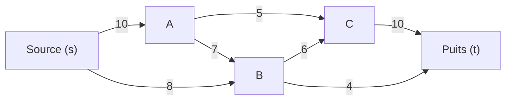
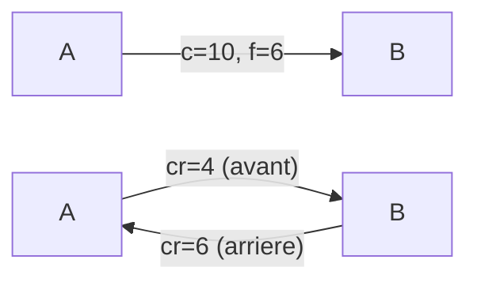
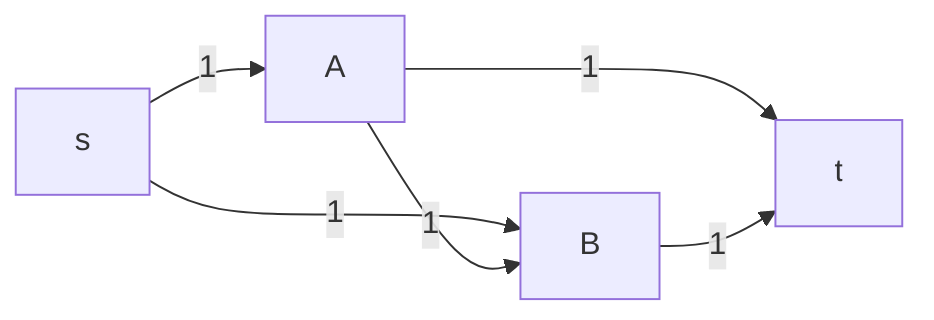
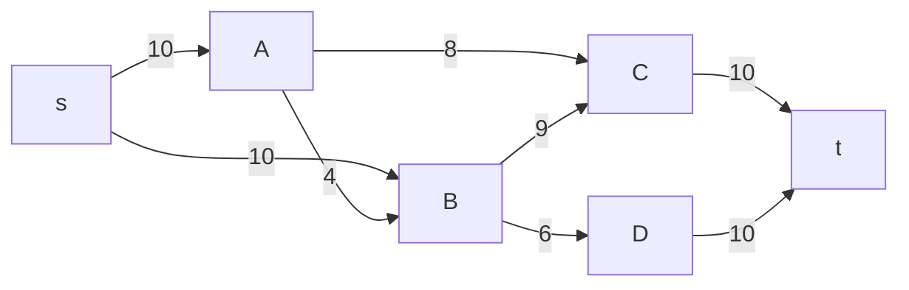

# Chapitre 8 -- Flots

> **Idee centrale en une phrase :** Un flot, c'est une quantite qui circule dans un reseau (eau dans des tuyaux, donnees dans un reseau informatique) en respectant les capacites de chaque lien -- et on cherche a maximiser le debit total entre une source et un puits.

**Prerequis :** [Arbres couvrants minimaux](05_arbres_couvrants.md), [Plus courts chemins](06_plus_courts_chemins.md)
**Retour :** [README](README.md)

---

## 1. L'analogie du reseau de tuyaux

### Le probleme

Imagine un reseau d'irrigation : l'eau part d'un reservoir (la **source**) et doit atteindre un champ (le **puits**). Les tuyaux ont des capacites maximales (un tuyau de 10 cm de diametre ne peut pas transporter autant d'eau qu'un tuyau de 30 cm).

**Questions :**
1. Quelle est la **quantite maximale** d'eau qu'on peut envoyer de la source au puits ?
2. Quel est le **goulot d'etranglement** du reseau (la coupe minimale) ?

C'est le probleme du **flot maximal**, resolu par l'algorithme de Ford-Fulkerson.

### Schema intuitif



> Reseau avec des capacites sur chaque arc. Question : quel est le flot maximal de s a t ?

---

## 2. Definitions formelles

### Reseau de transport

Un **reseau de transport** (ou reseau de flot) est un graphe oriente G = (S, A) avec :
- Une **source** s (sommet sans arc entrant, ou du moins le sommet d'origine du flot).
- Un **puits** t (sommet sans arc sortant, ou du moins le sommet de destination du flot).
- Une **capacite** c(u, v) >= 0 pour chaque arc (u, v).

### Flot

Un **flot** dans un reseau est une fonction f : A -> R+ qui associe a chaque arc une valeur (le debit) en respectant deux contraintes :

**1. Contrainte de capacite :** Pour chaque arc (u, v) :
```
0 <= f(u, v) <= c(u, v)
```
Le debit ne peut pas depasser la capacite du tuyau.

**2. Conservation du flot (loi de Kirchhoff) :** Pour chaque sommet v different de s et t :
```
Somme des f(u, v) pour u -> v = Somme des f(v, w) pour v -> w
```
Ce qui entre dans un sommet doit en sortir (pas d'accumulation, pas de fuite).

### Valeur du flot

La **valeur du flot** |f| est la quantite nette qui sort de la source :
```
|f| = Somme des f(s, v) pour s -> v  -  Somme des f(u, s) pour u -> s
```

Par la conservation du flot, c'est aussi la quantite nette qui arrive au puits.

---

## 3. Graphe residuel

### Motivation

Quand on a un flot courant et qu'on veut l'ameliorer, on doit voir :
1. Sur quels arcs on peut **envoyer plus** de flot (capacite non saturee).
2. Sur quels arcs on peut **reduire** le flot deja envoye (pour redistribuer).

### Definition

Le **graphe residuel** G_f est un graphe qui montre les "capacites restantes" :

Pour chaque arc (u, v) du graphe original :
- **Arc avant** (u, v) avec capacite residuelle c_f(u, v) = c(u, v) - f(u, v) si c_f > 0.
  (On peut encore envoyer du flot dans le meme sens.)
- **Arc arriere** (v, u) avec capacite residuelle c_f(v, u) = f(u, v) si f(u, v) > 0.
  (On peut "annuler" du flot deja envoye.)

### Exemple

Arc (A, B) avec capacite 10 et flot courant 6 :
- Arc avant : A -> B avec capacite residuelle 10 - 6 = 4.
- Arc arriere : B -> A avec capacite residuelle 6.



> Graphe original (en haut) et graphe residuel correspondant (en bas).

---

## 4. Chemin augmentant

### Definition

Un **chemin augmentant** est un chemin de s a t dans le **graphe residuel** G_f.

### Capacite residuelle du chemin

La **capacite residuelle** d'un chemin augmentant P est le minimum des capacites residuelles le long du chemin :

```
c_f(P) = min { c_f(u, v) : (u, v) arc de P }
```

C'est le goulot d'etranglement du chemin : on ne peut pas envoyer plus que la plus petite capacite residuelle.

### Augmentation du flot

On peut augmenter le flot de c_f(P) unites le long du chemin P :
- Pour chaque arc **avant** (u, v) de P : f(u, v) = f(u, v) + c_f(P).
- Pour chaque arc **arriere** (v, u) de P (correspondant a un arc original (u, v)) : f(u, v) = f(u, v) - c_f(P).

---

## 5. Algorithme de Ford-Fulkerson

### Principe

Partir d'un flot nul. Tant qu'il existe un chemin augmentant dans le graphe residuel, augmenter le flot le long de ce chemin.

### Pseudo-code

```
FordFulkerson(G, s, t):
    Pour chaque arc (u, v):
        f(u, v) = 0
    
    Tant qu'il existe un chemin augmentant P de s a t dans G_f:
        c_f(P) = min { c_f(u, v) : (u, v) dans P }
        
        Pour chaque arc (u, v) dans P:
            Si (u, v) est un arc avant:
                f(u, v) = f(u, v) + c_f(P)
            Si (u, v) est un arc arriere (correspondant a (v, u)):
                f(v, u) = f(v, u) - c_f(P)
    
    Retourner f
```

### Choix du chemin augmentant

Le choix du chemin augmentant affecte la performance :

| Methode | Recherche du chemin | Complexite totale |
|---------|--------------------|--------------------|
| Ford-Fulkerson generique | DFS | O(m * |f*|) -- peut ne pas terminer avec des capacites irrationnelles |
| **Edmonds-Karp** | **BFS** (plus court chemin) | **O(n * m^2)** -- toujours polynomial |
| Dinic | BFS + DFS par couches | O(n^2 * m) |

**En pratique et en DS, on utilise souvent Edmonds-Karp** (Ford-Fulkerson avec BFS).

### Pourquoi les arcs arriere sont essentiels

Sans les arcs arriere, l'algorithme pourrait se bloquer avec un flot non optimal. Les arcs arriere permettent de "defaire" une mauvaise decision et de redistribuer le flot.

**Exemple classique :**



Sans arc arriere, si on envoie d'abord s -> A -> B -> t (flot = 1), on ne peut plus envoyer s -> A -> t car A est "sature". Mais avec l'arc arriere B -> A (capacite residuelle 1), on peut trouver le chemin s -> B -> A -> t dans le graphe residuel, pour un flot total de 2.

---

## 6. Exemple complet pas a pas

### Reseau



### Iteration 1

**Chemin augmentant (BFS) :** s -> A -> C -> t
**Capacite residuelle :** min(10, 8, 10) = 8
**Flot apres :** f(s,A)=8, f(A,C)=8, f(C,t)=8. |f| = 8.

### Iteration 2

**Graphe residuel :** s->A(2), s->B(10), A->B(4), A->C(0, sature), C->A(8, arriere), B->C(9), B->D(6), C->t(2), D->t(10).

**Chemin augmentant (BFS) :** s -> B -> C -> t
**Capacite residuelle :** min(10, 9, 2) = 2
**Flot apres :** f(s,B)=2, f(B,C)=2, f(C,t)=10. |f| = 10.

### Iteration 3

**Chemin augmentant (BFS) :** s -> B -> D -> t
**Capacite residuelle :** min(8, 6, 10) = 6
**Flot apres :** f(s,B)=8, f(B,D)=6, f(D,t)=6. |f| = 16.

### Iteration 4

**Chemin augmentant (BFS) :** s -> A -> B -> D -> t
**Capacite residuelle :** min(2, 4, 2 [restant sur B->D... non, B->D a cap 6, f=6, donc residuel=0. Recalculons.])

Graphe residuel mis a jour :
- s->A : 10-8 = 2
- s->B : 10-8 = 2
- A->B : 4-0 = 4
- A->C : 8-8 = 0
- C->A : 8 (arriere)
- B->C : 9-2 = 7
- B->D : 6-6 = 0
- C->t : 10-10 = 0
- D->t : 10-6 = 4
- B->s : 8 (arriere), A->s : 8 (arriere), etc.

Chemin ? s -> A -> B -> C... mais C->t = 0. s -> A -> B -> D... mais B->D = 0.
s -> A -> B, puis B->C(7), C->t est 0.

Voyons si on utilise un arc arriere : s -> B -> C -> A(arriere, cap 8) -> ... non, A est deja apres s.

En fait, plus de chemin augmentant. **Flot maximal = 16.**

Recalculons plus soigneusement :

Apres iteration 3 : f(s,A)=8, f(s,B)=8, f(A,B)=0, f(A,C)=8, f(B,C)=2, f(B,D)=6, f(C,t)=10, f(D,t)=6.

Residuel : s->A(2), A->s(8), s->B(2), B->s(8), A->B(4), A->C(0), C->A(8), B->C(7), C->B(2), B->D(0), D->B(6), C->t(0), t->C(10), D->t(4), t->D(6).

Chemin s->A->B->C ? s->A(2), A->B(4), B->C(7). Ensuite C->t(0). Impasse.
Chemin s->A->B->D->t ? B->D(0). Impasse.

Pas de chemin de s a t dans le graphe residuel. **Flot maximal = 16.**

---

## 7. Theoreme du flot max -- coupe min

### Coupe

Une **coupe** (S, T) dans un reseau est une partition des sommets en deux ensembles S et T tels que s est dans S et t est dans T.

### Capacite de la coupe

La **capacite de la coupe** est la somme des capacites des arcs qui vont de S vers T :

```
c(S, T) = Somme des c(u, v) pour u dans S, v dans T, (u,v) arc
```

**Attention :** On ne compte que les arcs de S vers T, pas ceux de T vers S !

### Flot net a travers la coupe

Pour tout flot f et toute coupe (S, T) :

```
|f| = Somme des f(u,v) pour u dans S, v dans T - Somme des f(v,u) pour v dans T, u dans S
```

### Theoreme fondamental

> **Theoreme du flot maximal -- coupe minimale :**
> La valeur du flot maximal est egale a la capacite de la coupe minimale.
>
> max |f| = min c(S, T)

**En langage courant :** Le debit maximum est entierement determine par le goulot d'etranglement du reseau. Et ce goulot d'etranglement est la coupe de capacite minimale.

### Comment trouver la coupe minimale

A partir du flot maximal :
1. Construire le graphe residuel final.
2. **S** = ensemble des sommets accessibles depuis s dans le graphe residuel.
3. **T** = S \ S (les sommets non accessibles).
4. La coupe (S, T) est la coupe minimale.

### Verification

Dans notre exemple : le graphe residuel final ne permet pas d'atteindre t depuis s. Les sommets accessibles depuis s sont {s, A}. Donc S = {s, A}, T = {B, C, D, t}.

Arcs de S vers T : (s,B) cap 10, (A,B) cap 4, (A,C) cap 8. Mais attention, on cherche la coupe = arcs avec flot = capacite...

Capacite de la coupe : c(s,B) + c(A,B) + c(A,C) = 10 + 4 + 8 = 22. Ce n'est pas 16. Recalculons S.

En fait, les sommets accessibles depuis s dans le residuel sont ceux qu'on peut atteindre par des arcs de capacite residuelle > 0 : s -> A (cap 2). A -> B (cap 4). B -> C (cap 7). B -> s (cap 8, retour). C -> A (cap 8). Mais aussi D -> B (cap 6), D -> t (cap 4).

Donc depuis s : s -> A (2) -> B (4) -> C (7). Aussi B -> D ? B->D a cap residuelle 0. Donc on ne peut pas atteindre D ni t.

S = {s, A, B, C}, T = {D, t}.

Capacite de la coupe (S, T) : arcs de S vers T :
- B -> D : cap 6
- C -> t : cap 10

Total : 6 + 10 = **16**. Ca correspond au flot max !

---

## 8. Applications du flot maximal

### Couplage biparti maximum

Le probleme : dans un graphe biparti, trouver le nombre maximum de paires (un sommet de chaque cote) sans partager de sommet.

**Reduction au flot max :**
1. Ajouter une source s reliee a tous les sommets du groupe 1 (capacite 1).
2. Ajouter un puits t relie depuis tous les sommets du groupe 2 (capacite 1).
3. Arcs entre les deux groupes : capacite 1.
4. Le flot maximal = taille du couplage maximum.

### Theoreme de Konig

> Dans un graphe biparti, la taille du couplage maximum = la taille de la couverture minimale par sommets.

### Connectivity et arc-connectivity

Le nombre maximum de chemins arc-disjoints de s a t est egal a la coupe d'arcs minimale separant s et t (theoreme de Menger pour les arcs).

### Probleme de circulation avec bornes

Generalisation ou chaque arc a une capacite minimale ET maximale.

---

## 9. Variantes et extensions

### Flot a cout minimal

On cherche le flot de valeur donnee qui minimise le cout total (chaque arc a un cout par unite de flot en plus de sa capacite).

### Capacites sur les sommets

Si un sommet v a une capacite c(v), on le "dedouble" en v_in et v_out avec un arc (v_in, v_out) de capacite c(v).

### Sommets sources et puits multiples

Si on a plusieurs sources s1, ..., sk et plusieurs puits t1, ..., tl :
1. Ajouter une **super-source** S reliee a chaque si (capacite infinie ou egale a l'offre de si).
2. Ajouter un **super-puits** T relie depuis chaque ti (capacite infinie ou egale a la demande de ti).

---

## Pieges classiques

| Piege | Explication |
|-------|-------------|
| Oublier les arcs arriere dans le graphe residuel | Sans arcs arriere, l'algorithme peut se bloquer sur un flot sous-optimal. Les arcs arriere permettent de "defaire" du flot. |
| Compter les arcs T->S dans la coupe | La capacite d'une coupe ne compte que les arcs de S vers T, PAS ceux de T vers S. |
| Confondre capacite et flot dans le graphe residuel | Capacite residuelle = capacite - flot (arc avant) ou = flot (arc arriere). Ne pas confondre avec la capacite originale. |
| Ne pas verifier la conservation du flot | A chaque sommet (sauf s et t), la somme des flots entrants = somme des flots sortants. C'est une verification indispensable. |
| Oublier que flot max = coupe min | C'est LE theoreme central. Si on te demande le flot max, trouver la coupe min peut etre plus simple (et inversement). |
| Se tromper dans l'augmentation le long d'un arc arriere | Arc arriere = on REDUIT le flot sur l'arc original, on ne l'augmente pas. f(u,v) diminue quand on emprunte l'arc arriere (v,u). |
| Oublier de mettre a jour le graphe residuel | Apres chaque augmentation, le graphe residuel change. Il faut le recalculer avant de chercher un nouveau chemin. |

---

## Recapitulatif

- **Reseau** = graphe oriente avec source, puits, et capacites.
- **Flot** = quantite circulant dans le reseau, respectant capacites et conservation.
- **Graphe residuel** = montre les capacites restantes (arcs avant + arcs arriere).
- **Chemin augmentant** = chemin s->t dans le graphe residuel. On augmente le flot de min(capacites residuelles).
- **Ford-Fulkerson** : tant qu'il existe un chemin augmentant, augmenter. Utiliser BFS = Edmonds-Karp, O(nm^2).
- **Flot max = Coupe min** : theoreme fondamental. Le goulot d'etranglement determine le debit maximal.
- **Coupe** : partition (S, T) avec s dans S, t dans T. Capacite = somme des arcs S->T.
- **Applications** : couplage biparti, chemins disjoints, circulation, affectation.
