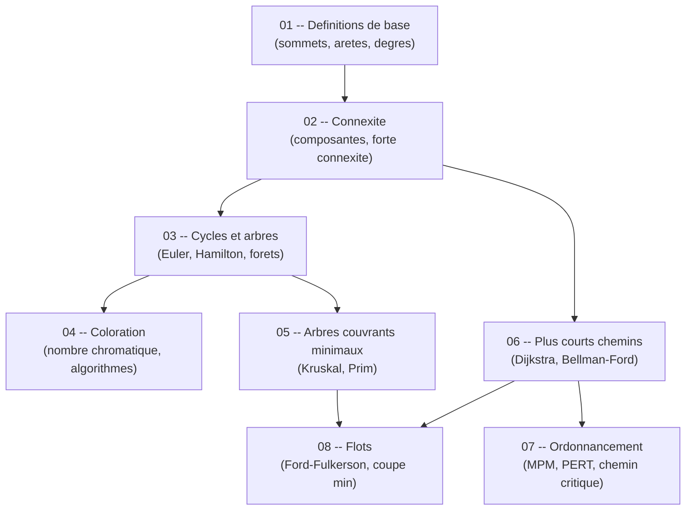

# Guide -- Graphes et Algorithmique (S6)

Bienvenue dans ce guide de theorie des graphes et d'algorithmique, concu pour etre accessible meme si tu pars de zero. L'objectif est simple : te permettre de comprendre les concepts fondamentaux des graphes, etape par etape, avec des explications claires, des schemas visuels et des algorithmes detailles que tu peux appliquer immediatement. Chaque chapitre est **autonome** -- tu peux les lire dans l'ordre ou sauter directement a celui qui t'interesse sans etre perdu.

Ce guide couvre l'integralite du programme de Graphes et Algorithmique du S6 a l'INSA Rennes (3A INFO) : des definitions de base jusqu'aux algorithmes de flots, en passant par la coloration, les arbres couvrants et l'ordonnancement.

---

## Roadmap d'apprentissage

Voici l'ordre recommande pour progresser efficacement. Chaque etape s'appuie sur les precedentes, mais tu peux toujours revenir en arriere si un concept te manque.

> **Lecture du diagramme** : les fleches indiquent l'ordre logique. Les definitions (01) sont le socle de tout. La connexite (02) ouvre vers les cycles/arbres (03) et les chemins (06). La coloration (04) et les arbres couvrants (05) dependent des arbres. L'ordonnancement (07) s'appuie sur les chemins. Les flots (08) utilisent a la fois les arbres couvrants et les chemins.

---

## Prerequis

Pas besoin d'un master en mathematiques pour suivre ce guide. Voici le strict minimum :

- **Savoir ce qu'est un ensemble** -- une collection d'elements, sans doublons. Par exemple {A, B, C}.
- **Comprendre la notion de relation** -- si A est relie a B, ca forme un lien.
- **Logique de base** -- si... alors..., ou, et, negation.
- **Savoir lire un pseudo-code** -- des instructions ecrites en langage naturel structure (si, tant que, pour...).

Si tu sais dessiner des points relies par des traits sur une feuille, tu as le niveau requis pour commencer.

---

## Comment utiliser ce guide

1. **Lis dans l'ordre** pour une progression naturelle, ou **saute directement** au chapitre qui t'interesse -- chaque fichier est autonome et complet.
2. **Dessine les graphes a la main** en parallele. Les graphes s'apprennent en les manipulant, pas en les lisant passivement.
3. **Les diagrammes Mermaid** sont rendus automatiquement sur GitHub et dans Obsidian. Si tu lis les fichiers dans un autre editeur, installe une extension Mermaid pour en profiter.
4. **Deroule les algorithmes pas a pas** sur des petits exemples avant de passer a des cas complexes.
5. **Ne memorise pas les algorithmes** -- comprends d'abord l'intuition et la logique, le reste viendra naturellement.
6. **Consulte la [cheat sheet](cheat_sheet.md)** pour un resume ultra-condense avant le DS.

---

## Table des matieres

| # | Chapitre | Description |
|---|----------|-------------|
| 01 | [Definitions de base](01_definitions_base.md) | Sommets, aretes, arcs, degres, representations -- le vocabulaire fondamental des graphes. |
| 02 | [Connexite](02_connexite.md) | Composantes connexes, forte connexite, points d'articulation, isthmes -- comprendre la structure d'un graphe. |
| 03 | [Cycles et arbres](03_cycles_arbres.md) | Cycles euleriens et hamiltoniens, arbres, forets -- les structures fondamentales. |
| 04 | [Coloration](04_coloration.md) | Nombre chromatique, algorithme glouton, theoremes de Brooks et des 4 couleurs. |
| 05 | [Arbres couvrants minimaux](05_arbres_couvrants.md) | Algorithmes de Kruskal et Prim -- relier tous les sommets au moindre cout. |
| 06 | [Plus courts chemins](06_plus_courts_chemins.md) | Dijkstra, Bellman-Ford, Floyd-Warshall -- trouver le chemin optimal. |
| 07 | [Ordonnancement](07_ordonnancement.md) | Methode MPM/PERT, marges, chemin critique -- planifier un projet. |
| 08 | [Flots](08_flots.md) | Reseaux, flot maximal, coupe minimale, Ford-Fulkerson -- optimiser les flux. |
| -- | [Cheat sheet](cheat_sheet.md) | Resume ultra-condense : tous les algorithmes, proprietes cles et pieges recurrents pour le DS. |

---

## Structure d'un chapitre

Chaque chapitre suit la meme progression pour t'aider a construire ta comprehension pas a pas :

| Etape | Ce que tu y trouves |
|-------|---------------------|
| **Concept simple** | Une situation de la vie courante ou une analogie pour ancrer le concept avant toute formalisation. |
| **Schema Mermaid** | Un diagramme visuel pour voir l'idee avant toute formule ou definition formelle. |
| **Explication progressive** | Le concept explique en partant du plus simple vers le plus precis, avec des exemples a chaque etape. |
| **Theoremes et proprietes** | Les resultats mathematiques importants, enonces clairement avec leurs conditions d'application. |
| **Exemples graphiques** | Des graphes concrets, dessines et annotes, pour voir chaque notion en action. |
| **Pseudo-code** | Les algorithmes ecrits en langage naturel structure, prets a etre deroules a la main ou codes. |
| **Pieges classiques** | Les erreurs frequentes en DS et comment les eviter -- apprendre des erreurs des autres. |
| **Recapitulatif** | Un resume en quelques points pour reviser rapidement avant l'examen. |

> Cette structure est pensee pour que tu puisses toujours comprendre le *pourquoi* avant le *comment*. Si une definition formelle te bloque, reviens a l'analogie -- elle contient l'essentiel.
