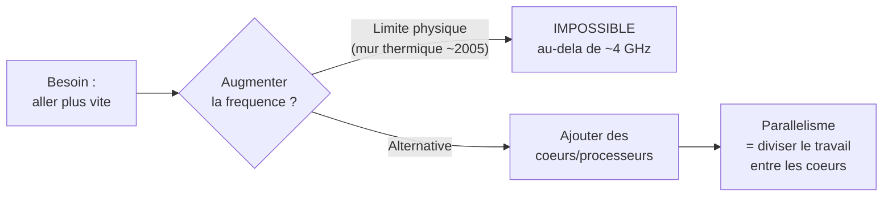
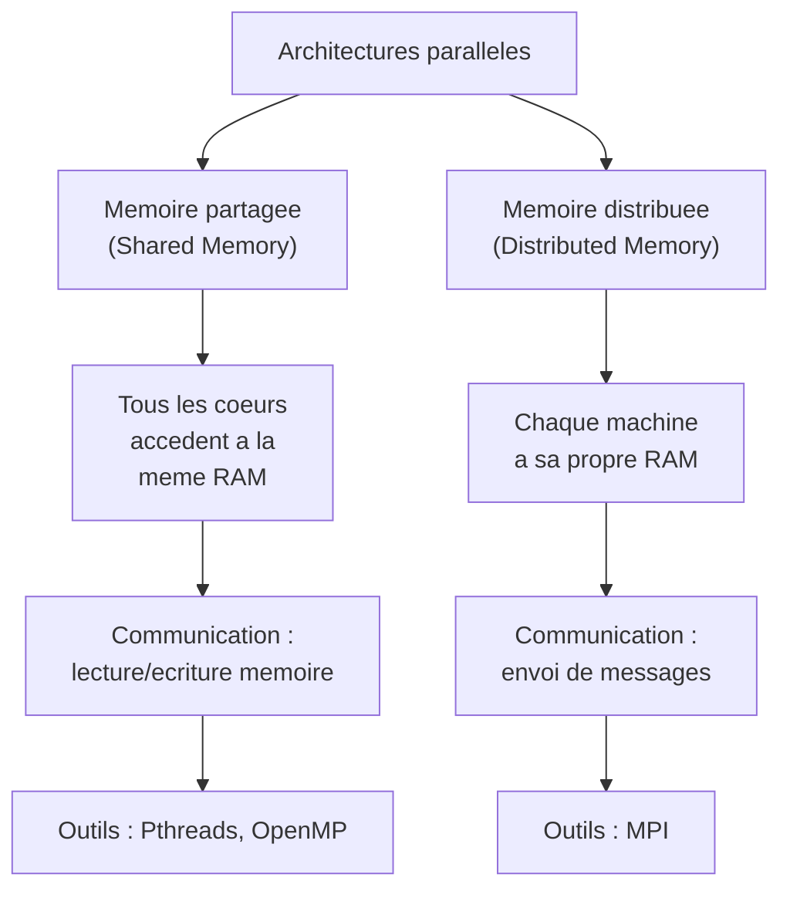
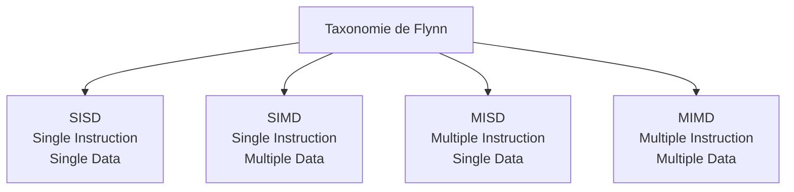
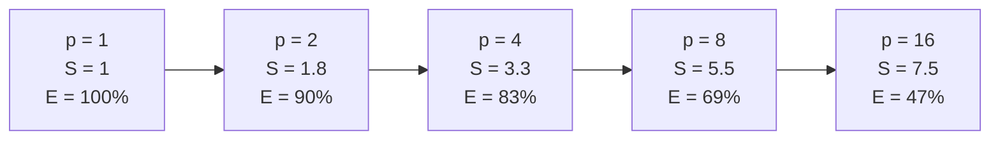
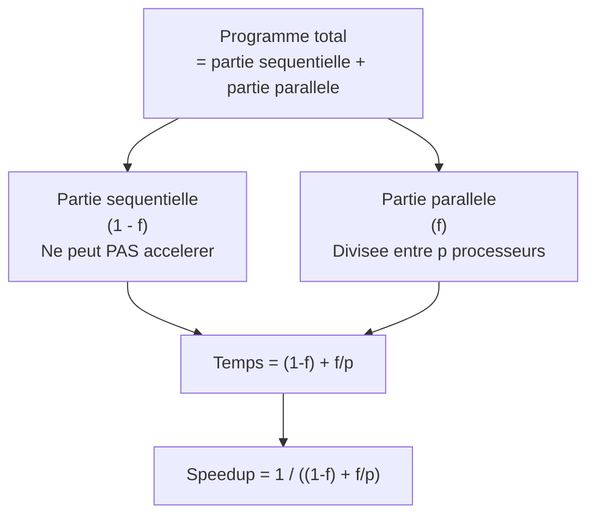
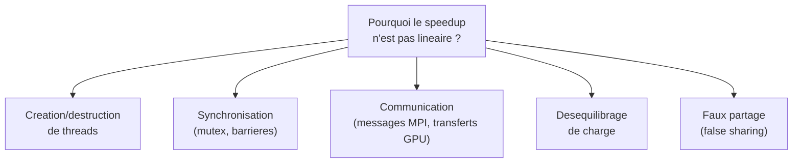
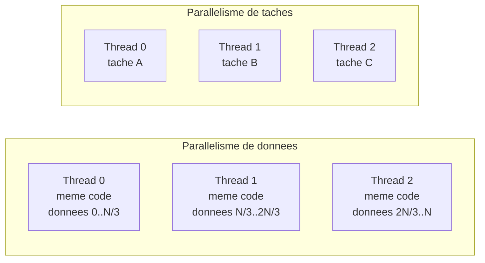

# Chapitre 1 -- Introduction au parallelisme

> **Idee centrale en une phrase :** Un seul processeur ne suffit plus a aller plus vite -- alors on en met plusieurs qui travaillent en meme temps sur le meme probleme.

**Prerequis :** Connaitre le langage C, savoir ce qu'est un processeur.
**Chapitre suivant :** [Threads POSIX -->](02_threads_posix.md)

---

## 1. L'analogie de la pizzeria

### Pourquoi paralleliser ?

Imagine que tu geres une pizzeria. Tu as **un seul pizzaiolo** qui peut faire une pizza en 10 minutes. Si 100 clients commandent en meme temps, le dernier devra attendre 1000 minutes (plus de 16 heures). Inacceptable.

Tu as trois options :

1. **Rendre le pizzaiolo plus rapide** (horloge processeur plus elevee) -- il y a une limite physique. Au-dela d'une certaine vitesse, il fait des erreurs ou se brule.
2. **Embaucher d'autres pizzaiolos** (ajouter des processeurs) -- chacun fait ses pizzas en parallele. Avec 10 pizzaiolos, le dernier client n'attend plus que 100 minutes.
3. **Reorganiser le travail** (pipeline) -- un pizzaiolo prepare la pate, un autre met la garniture, un troisieme enfourne. Comme une chaine de montage.

C'est exactement ce qui s'est passe dans l'histoire des processeurs :

- Pendant des annees, on a augmente la **frequence d'horloge** (option 1). Mais depuis ~2005, on a atteint un mur thermique : au-dela de ~4 GHz, le processeur chauffe trop.
- La solution adoptee par l'industrie : mettre **plusieurs coeurs** dans un meme processeur (option 2). Ton telephone a probablement 6 a 8 coeurs.
- Le **pipeline** (option 3) existe aussi dans les processeurs modernes, mais c'est transparent pour le programmeur.

> **Le probleme :** Avoir plusieurs coeurs ne suffit pas. Si ton programme est ecrit pour un seul coeur (sequentiel), les autres coeurs restent inactifs. Il faut **reecrire** le programme pour exploiter le parallelisme. C'est l'objet de ce cours.

### Schema : pourquoi le parallelisme est devenu necessaire



---

## 2. Les architectures paralleles

### 2.1 Memoire partagee vs memoire distribuee

Il existe deux grandes familles d'architectures paralleles. Toute la suite du cours s'organise autour de cette distinction.



#### Memoire partagee

Tous les processeurs (coeurs) voient la **meme memoire**. C'est le cas de ton ordinateur : les 4 ou 8 coeurs de ton processeur accedent a la meme RAM.

**Avantages :**
- Communication facile : un thread ecrit dans une variable, l'autre la lit.
- Pas besoin de copier les donnees.

**Inconvenients :**
- Problemes de **coherence** : si deux threads ecrivent en meme temps au meme endroit, le resultat est imprevisible (**race condition**).
- Ne passe pas a l'echelle au-dela d'une machine.

**Technologies :** Threads POSIX (chapitre 2), OpenMP (chapitre 3).

#### Memoire distribuee

Chaque processeur a **sa propre memoire**. C'est le cas d'un cluster : chaque machine (noeud) a ses propres donnees. Pour communiquer, les processus s'**envoient des messages** a travers le reseau.

**Avantages :**
- Passe a l'echelle : on peut ajouter des centaines de machines.
- Pas de probleme de coherence memoire (chacun a sa copie).

**Inconvenients :**
- Communication explicite : il faut programmer les envois et receptions.
- Plus complexe a programmer.

**Technologies :** MPI (chapitre 4).

#### Cas hybride : le GPU

Le GPU est un cas particulier : il a **sa propre memoire** (separee de la RAM du CPU), mais en interne, ses milliers de coeurs partagent differents niveaux de memoire. C'est un modele hybride.

**Technologies :** CUDA (chapitre 5).

### 2.2 Tableau recapitulatif

| Aspect | Memoire partagee | Memoire distribuee | GPU |
|--------|------------------|--------------------|-----|
| Memoire | Commune a tous | Propre a chaque noeud | Propre au GPU + memoire partagee interne |
| Communication | Lecture/ecriture en memoire | Envoi de messages | Transferts CPU <-> GPU |
| Scalabilite | 1 machine (quelques coeurs) | Cluster (centaines de noeuds) | 1 GPU (milliers de coeurs) |
| Difficulte | Moyenne (synchronisation) | Elevee (messages explicites) | Elevee (modele de programmation different) |
| Outils | Pthreads, OpenMP | MPI | CUDA, OpenCL |

---

## 3. La taxonomie de Flynn

En 1966, Michael Flynn a propose une classification des architectures selon deux criteres : combien d'**instructions** et combien de **donnees** sont traitees simultanement.

### Les 4 categories



#### SISD -- Single Instruction, Single Data

C'est le modele **sequentiel classique** : un seul processeur execute une instruction a la fois sur une donnee a la fois.

```
Instruction:  ADD    ADD    ADD    ADD
Donnee:       a[0]   a[1]   a[2]   a[3]
Temps:        t1     t2     t3     t4
```

Exemple : un vieux processeur mono-coeur.

#### SIMD -- Single Instruction, Multiple Data

**Une meme instruction** est appliquee simultanement a **plusieurs donnees**. C'est comme si un chef d'orchestre donnait la meme consigne a tous les musiciens en meme temps.

```
Instruction:  ADD    ADD    ADD    ADD     (la meme instruction)
Donnee:       a[0]   a[1]   a[2]   a[3]   (4 donnees differentes)
Temps:        t1     t1     t1     t1      (en meme temps !)
```

Exemples :
- Les instructions **SSE/AVX** des processeurs modernes (operations vectorielles).
- Les **GPU** : des milliers de coeurs executent le meme kernel sur des donnees differentes.

#### MISD -- Multiple Instruction, Single Data

Plusieurs instructions differentes sur la **meme** donnee. C'est tres rare en pratique. Un exemple theorique serait un systeme de vote ou trois processeurs font le meme calcul independamment pour verifier le resultat (tolerance aux pannes).

#### MIMD -- Multiple Instruction, Multiple Data

Chaque processeur execute **sa propre instruction** sur **ses propres donnees**. C'est le modele le plus general et le plus courant aujourd'hui.

```
Processeur 1:  ADD a[0]     (instruction 1, donnee 1)
Processeur 2:  MUL b[5]     (instruction 2, donnee 2)
Processeur 3:  SUB c[2]     (instruction 3, donnee 3)
Temps:         t1            (en meme temps)
```

Exemples : multi-coeurs, clusters, tout ce qu'on programme avec pthreads, OpenMP ou MPI.

### Tableau recapitulatif de Flynn

| Categorie | Instructions | Donnees | Exemple concret |
|-----------|-------------|---------|-----------------|
| SISD | 1 | 1 | Processeur mono-coeur classique |
| SIMD | 1 | Plusieurs | GPU, instructions SSE/AVX |
| MISD | Plusieurs | 1 | Systemes a tolerance de pannes (rare) |
| MIMD | Plusieurs | Plusieurs | Multi-coeur, clusters, Pthreads, OpenMP, MPI |

---

## 4. Mesurer la performance : Speedup et Efficacite

### 4.1 Le Speedup (acceleration)

Le speedup mesure **combien de fois plus rapide** est la version parallele par rapport a la version sequentielle.

**Formule :**

```
S(p) = T(1) / T(p)
```

| Terme | Signification |
|-------|---------------|
| `S(p)` | Speedup avec `p` processeurs |
| `T(1)` | Temps d'execution avec **1** processeur (sequentiel) |
| `T(p)` | Temps d'execution avec **p** processeurs (parallele) |

**Interpretation :**

- `S(p) = p` : speedup **lineaire** (ideal). Avec 4 processeurs, on va 4 fois plus vite. Tres rare en pratique.
- `S(p) < p` : speedup **sous-lineaire** (typique). Avec 4 processeurs, on va "seulement" 3 fois plus vite. Normal : il y a des couts de communication, synchronisation, etc.
- `S(p) > p` : speedup **super-lineaire** (rare). Peut arriver grace aux effets de cache : avec plus de processeurs, chaque processeur a un jeu de donnees plus petit qui tient mieux en cache.

**Exemple concret :**

Tu calcules la somme d'un tableau de 1 million d'elements :
- En sequentiel (1 coeur) : **2 secondes**
- Avec 4 coeurs : **0.6 secondes**
- Speedup : S(4) = 2 / 0.6 = **3.33**

C'est sous-lineaire (3.33 < 4), ce qui est normal : il faut du temps pour distribuer le travail et rassembler les resultats partiels.

### 4.2 L'Efficacite

L'efficacite mesure **quel pourcentage de la puissance de calcul** est reellement utilise.

**Formule :**

```
E(p) = S(p) / p
```

| Terme | Signification |
|-------|---------------|
| `E(p)` | Efficacite avec `p` processeurs (entre 0 et 1) |
| `S(p)` | Speedup obtenu |
| `p` | Nombre de processeurs |

**Interpretation :**

- `E(p) = 1` (100%) : chaque processeur est utilise a plein. Ideal.
- `E(p) = 0.5` (50%) : la moitie de la puissance est gaspillee en synchronisation ou attente.

**Reprenant l'exemple precedent :**

- E(4) = 3.33 / 4 = **0.83** (83%). Pas mal ! Seulement 17% de la puissance est perdue.

### Schema : Speedup en fonction du nombre de processeurs



> **Observation :** Plus on ajoute de processeurs, plus le speedup augmente... mais de moins en moins vite. L'efficacite diminue. Pourquoi ? C'est ce qu'explique la loi d'Amdahl.

---

## 5. La loi d'Amdahl

### 5.1 L'idee intuitive

Meme dans un programme parallele, il y a toujours des parties qui **doivent rester sequentielles** : initialisation, lecture de fichiers, synchronisation, affichage des resultats...

La loi d'Amdahl dit : **la partie sequentielle limite le speedup maximum**, quel que soit le nombre de processeurs.

### L'analogie de la cuisine

Tu prepares un gateau avec des amis :

- **Partie parallelisable** : casser les oeufs (chacun en casse un), peser la farine (chacun pese un ingredient), etc.
- **Partie sequentielle** : mettre le gateau au four. Meme avec 100 amis, tu ne peux pas cuire le gateau plus vite. C'est un goulot d'etranglement.

Si la cuisson prend 30 minutes sur 1 heure totale, tu ne pourras **jamais** descendre en dessous de 30 minutes, meme avec un million d'amis. Le speedup maximum est 60/30 = **2x**.

### 5.2 La formule

```
S_max(p) = 1 / ((1 - f) + f/p)
```

| Terme | Signification |
|-------|---------------|
| `S_max(p)` | Speedup maximum avec `p` processeurs |
| `f` | Fraction **parallelisable** du programme (entre 0 et 1) |
| `1 - f` | Fraction **sequentielle** (incompressible) |
| `p` | Nombre de processeurs |

### 5.3 Exemples numeriques

Supposons que **90%** du programme est parallelisable (f = 0.9, ce qui est deja tres bien) :

| Processeurs (p) | Speedup S_max | Calcul |
|-----------------|---------------|--------|
| 1 | 1.00 | 1 / (0.1 + 0.9/1) |
| 2 | 1.82 | 1 / (0.1 + 0.9/2) |
| 4 | 3.08 | 1 / (0.1 + 0.9/4) |
| 8 | 4.71 | 1 / (0.1 + 0.9/8) |
| 16 | 6.40 | 1 / (0.1 + 0.9/16) |
| 64 | 8.77 | 1 / (0.1 + 0.9/64) |
| infini | **10.00** | 1 / (0.1 + 0) = 1/0.1 |

> **Point crucial :** Meme avec un **nombre infini** de processeurs, le speedup est plafonne a `1/(1-f)`. Avec f = 0.9, le maximum est 10x. Les 10% sequentiels empechent d'aller au-dela.

### 5.4 La limite quand p tend vers l'infini

```
S_max(infini) = 1 / (1 - f)
```

| Fraction parallelisable (f) | Speedup maximum |
|-----------------------------|-----------------|
| 50% | 2x |
| 75% | 4x |
| 90% | 10x |
| 95% | 20x |
| 99% | 100x |

**Conclusion d'Amdahl :** Pour obtenir un gros speedup, il ne suffit pas d'ajouter des processeurs -- il faut **reduire la partie sequentielle**. C'est souvent le vrai defi de la programmation parallele.

### 5.5 Schema d'Amdahl



---

## 6. La loi de Gustafson

### L'idee : et si on augmentait la taille du probleme ?

La loi d'Amdahl est pessimiste car elle suppose que la **taille du probleme est fixe**. En pratique, quand on a plus de processeurs, on en profite souvent pour traiter un **probleme plus gros** (plus de donnees, plus de precision).

Gustafson propose une vision differente : le temps total reste constant, mais on fait **plus de travail**.

### La formule

```
S_scaled(p) = p - alpha * (p - 1)
```

| Terme | Signification |
|-------|---------------|
| `S_scaled(p)` | Speedup mis a l'echelle (scaled speedup) |
| `p` | Nombre de processeurs |
| `alpha` | Fraction sequentielle (equivalente a `1-f` d'Amdahl) |

### Exemple

Avec alpha = 0.1 (10% sequentiel) et p = 100 processeurs :

```
S_scaled(100) = 100 - 0.1 * 99 = 100 - 9.9 = 90.1
```

Gustafson predit un speedup de 90.1x, la ou Amdahl aurait predit ~10x. La difference : Gustafson suppose qu'on traite un probleme 100 fois plus gros.

> **En resume :** Amdahl repond a "combien de temps je gagne pour CE probleme ?". Gustafson repond a "quel probleme je peux resoudre dans LE MEME temps ?".

---

## 7. Sources de surcout (overhead)

En pratique, le speedup n'atteint jamais l'ideal. Voici pourquoi :

### 7.1 Les differentes sources



#### Creation/destruction de threads

Creer un thread prend du temps (quelques microsecondes). Si le travail a faire est tres petit, le cout de creation depasse le gain du parallelisme.

**Regle pratique :** Ne parallelise pas une boucle de 10 iterations. Parallelise une boucle de 10 000 iterations.

#### Synchronisation

Quand deux threads accedent a la meme donnee, il faut les synchroniser (mutex, barrieres). Pendant ce temps, un thread attend l'autre : c'est du temps perdu.

#### Communication

En memoire distribuee (MPI), envoyer un message prend du temps (latence reseau). En GPU, transferer des donnees entre CPU et GPU est lent.

#### Desequilibrage de charge (load imbalance)

Si un thread a plus de travail que les autres, les autres l'attendent. Exemple : diviser 100 iterations entre 3 threads donne 34, 34, 32 -- presque equilibre. Mais si certaines iterations sont plus lourdes que d'autres, le desequilibre se creuse.

#### Faux partage (false sharing)

Deux threads modifient des variables **differentes** mais situees sur la **meme ligne de cache**. Le processeur invalide la ligne de cache a chaque ecriture, meme si les deux threads ne se marchent pas dessus. Le resultat : des performances catastrophiques.

### 7.2 Comment minimiser le surcout

| Source | Solution |
|--------|----------|
| Creation de threads | Reutiliser les threads (pool de threads, OpenMP le fait automatiquement) |
| Synchronisation | Minimiser les sections critiques, utiliser `atomic` quand c'est possible |
| Communication | Regrouper les messages, recouvrir calcul et communication |
| Desequilibrage | Repartition dynamique du travail (`schedule(dynamic)` en OpenMP) |
| Faux partage | Espacement des donnees (padding), variables locales |

---

## 8. Modeles de parallelisme

Il existe plusieurs facons de decomposer un probleme pour le paralleliser :

### 8.1 Parallelisme de donnees (Data parallelism)

On divise les **donnees** entre les processeurs. Chaque processeur execute le **meme code** sur sa portion de donnees.

```
Donnees:  [a0 a1 a2 a3 | a4 a5 a6 a7 | a8 a9 a10 a11]
Thread 0: traite a0..a3
Thread 1: traite a4..a7
Thread 2: traite a8..a11
```

Exemple : chaque thread calcule la somme de sa tranche du tableau.

### 8.2 Parallelisme de taches (Task parallelism)

On divise le **travail** en taches differentes. Chaque processeur execute une **tache differente**.

```
Thread 0: lit le fichier
Thread 1: decompresse les donnees
Thread 2: applique le filtre
Thread 3: ecrit le resultat
```

Exemple : pipeline de traitement d'images.

### 8.3 Schema comparatif



---

## 9. Code C : mesurer le speedup

Voici un programme complet qui calcule la somme d'un tableau en sequentiel puis en parallele (avec OpenMP), et affiche le speedup :

```c
#include <stdio.h>
#include <stdlib.h>
#include <omp.h>

#define N 100000000  /* 100 millions d'elements */

int main(void)
{
    /* --- Allocation et initialisation du tableau --- */
    double *tab = (double *)malloc(N * sizeof(double));
    if (tab == NULL) {
        fprintf(stderr, "Erreur d'allocation memoire\n");
        return EXIT_FAILURE;
    }

    for (long i = 0; i < N; i++) {
        tab[i] = 1.0;  /* Valeur simple pour verifier le resultat */
    }

    /* --- Version sequentielle --- */
    double t0 = omp_get_wtime();    /* Demarrer le chrono */
    double somme_seq = 0.0;
    for (long i = 0; i < N; i++) {
        somme_seq += tab[i];
    }
    double t1 = omp_get_wtime();    /* Arreter le chrono */
    double temps_seq = t1 - t0;

    printf("Sequentiel : somme = %.0f, temps = %.4f s\n", somme_seq, temps_seq);

    /* --- Version parallele (OpenMP) --- */
    double t2 = omp_get_wtime();
    double somme_par = 0.0;

    /* reduction(+:somme_par) : chaque thread a sa copie locale,
       les copies sont additionnees a la fin automatiquement */
    #pragma omp parallel for reduction(+:somme_par)
    for (long i = 0; i < N; i++) {
        somme_par += tab[i];
    }
    double t3 = omp_get_wtime();
    double temps_par = t3 - t2;

    int nb_threads = 1;
    #pragma omp parallel
    {
        #pragma omp single
        nb_threads = omp_get_num_threads();
    }

    printf("Parallele (%d threads) : somme = %.0f, temps = %.4f s\n",
           nb_threads, somme_par, temps_par);

    /* --- Calcul du speedup et de l'efficacite --- */
    double speedup = temps_seq / temps_par;
    double efficacite = speedup / nb_threads;

    printf("Speedup : %.2f\n", speedup);
    printf("Efficacite : %.2f (%.0f%%)\n", efficacite, efficacite * 100);

    free(tab);
    return EXIT_SUCCESS;
}
```

### Compilation et execution

```bash
gcc -fopenmp -O2 mesure_speedup.c -o mesure_speedup

# Avec 1 thread (pour comparer)
OMP_NUM_THREADS=1 ./mesure_speedup

# Avec 4 threads
OMP_NUM_THREADS=4 ./mesure_speedup

# Avec 8 threads
OMP_NUM_THREADS=8 ./mesure_speedup
```

### Sortie attendue (approximative)

```
Sequentiel : somme = 100000000, temps = 0.2800 s
Parallele (4 threads) : somme = 100000000, temps = 0.0850 s
Speedup : 3.29
Efficacite : 0.82 (82%)
```

---

## 10. Pieges classiques

### Piege 1 : "Plus de threads = toujours plus rapide"

**Faux.** Au-dela d'un certain nombre de threads, le surcout (synchronisation, faux partage) depasse le gain. Il existe un **nombre optimal** de threads, souvent egal au nombre de coeurs physiques.

### Piege 2 : "Ma boucle fait 10 iterations, je vais la paralleliser"

**Mauvaise idee.** Le cout de creation des threads et de synchronisation est superieur au gain pour si peu d'iterations. Parallelise des boucles avec **des milliers** d'iterations minimum.

### Piege 3 : "Le speedup devrait etre egal au nombre de coeurs"

**Rarement le cas.** La loi d'Amdahl montre que la partie sequentielle plafonne le speedup. Vise un speedup de 70-80% du nombre de coeurs, c'est deja tres bon.

### Piege 4 : Confondre Amdahl et Gustafson

- **Amdahl** : taille de probleme **fixe**, on ajoute des processeurs.
- **Gustafson** : nombre de processeurs **fixe**, on augmente la taille du probleme.

Les deux sont corrects, mais repondent a des questions differentes.

### Piege 5 : Oublier de mesurer

Ne devine jamais les performances. **Mesure toujours** avec `omp_get_wtime()`, `MPI_Wtime()`, ou `clock_gettime()`. Les intuitions en performance sont souvent fausses.

---

## 11. Recapitulatif

| Concept | A retenir |
|---------|-----------|
| **Pourquoi paralleliser** | Le mur thermique empeche d'augmenter la frequence ; on ajoute des coeurs |
| **Memoire partagee** | Tous les threads voient la meme RAM (Pthreads, OpenMP) |
| **Memoire distribuee** | Chaque processus a sa RAM, communication par messages (MPI) |
| **Flynn** | SISD, SIMD, MISD, MIMD -- nos programmes sont en general MIMD |
| **Speedup** | S(p) = T(1)/T(p) -- combien de fois plus rapide |
| **Efficacite** | E(p) = S(p)/p -- pourcentage de la puissance utilisee |
| **Amdahl** | S_max = 1/(1-f) -- la partie sequentielle limite tout |
| **Gustafson** | Plus de processeurs = probleme plus gros dans le meme temps |
| **Surcout** | Creation threads, synchronisation, communication, desequilibrage, faux partage |

> **Le message essentiel :** Le parallelisme n'est pas magique. Il faut comprendre les limites theoriques (Amdahl), choisir le bon modele (donnees vs taches, memoire partagee vs distribuee), et toujours mesurer.
