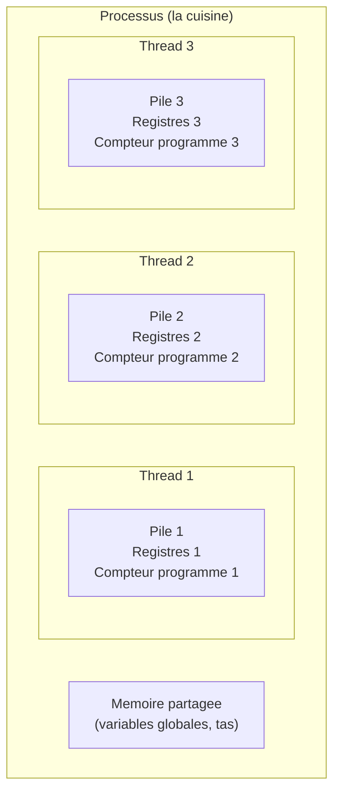
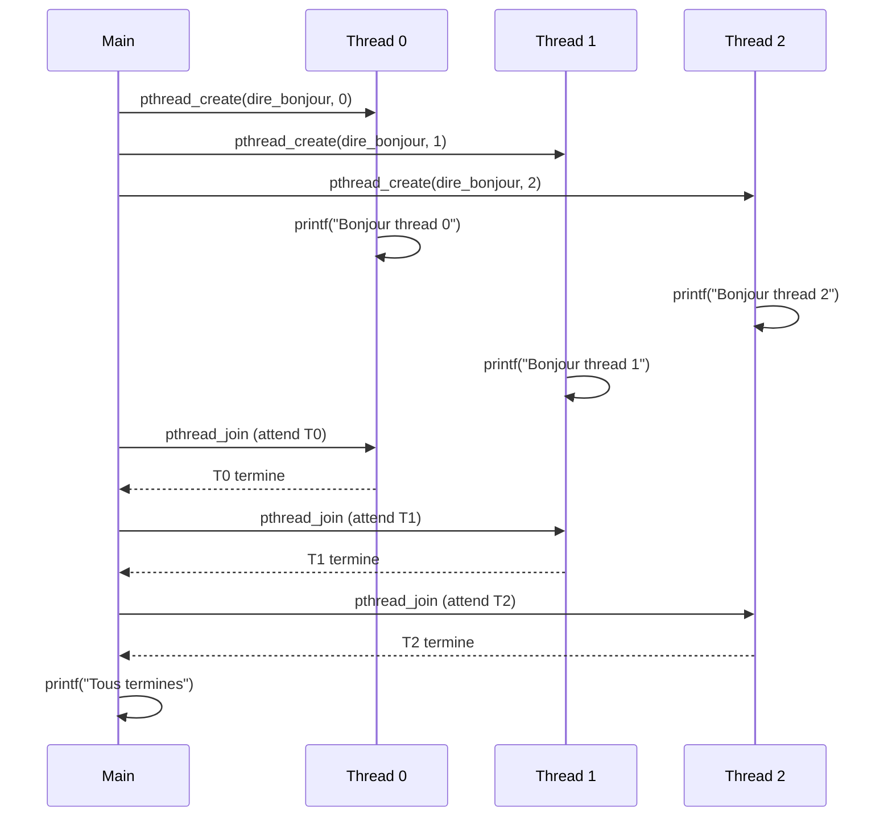
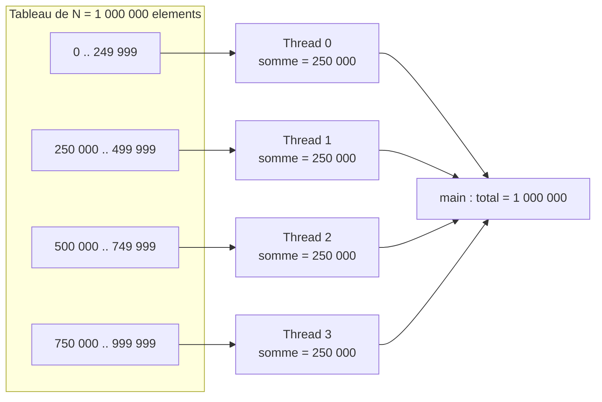
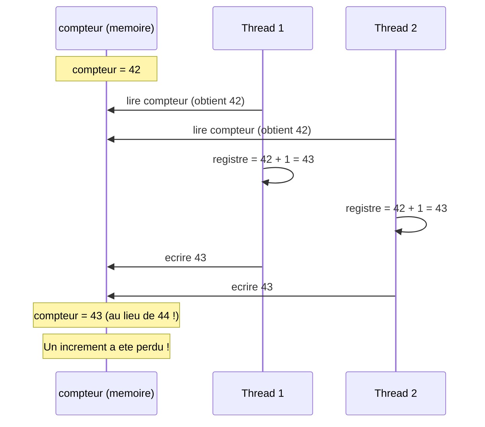
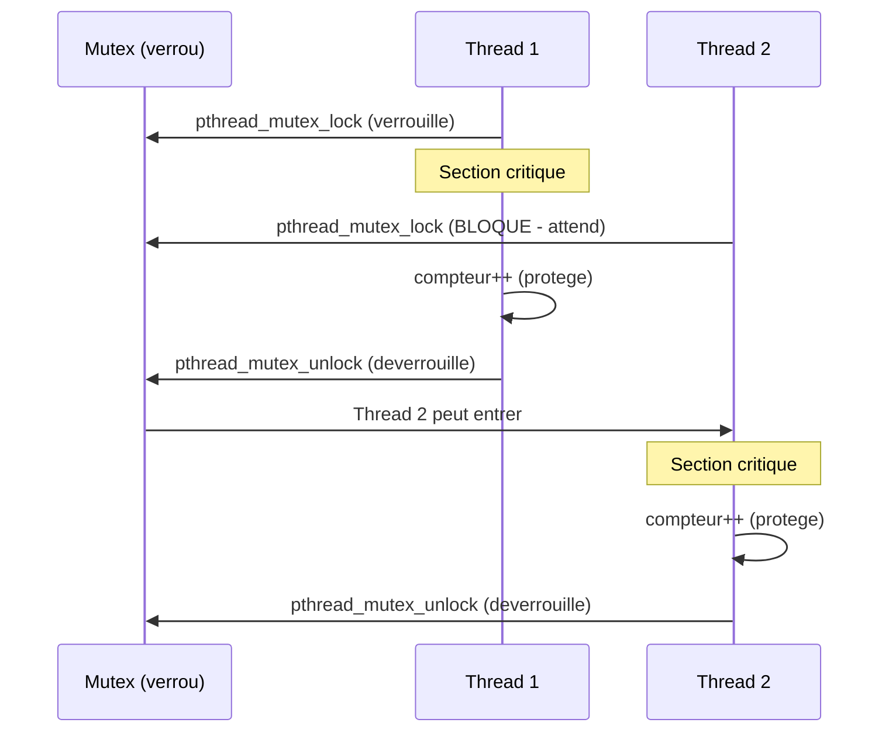
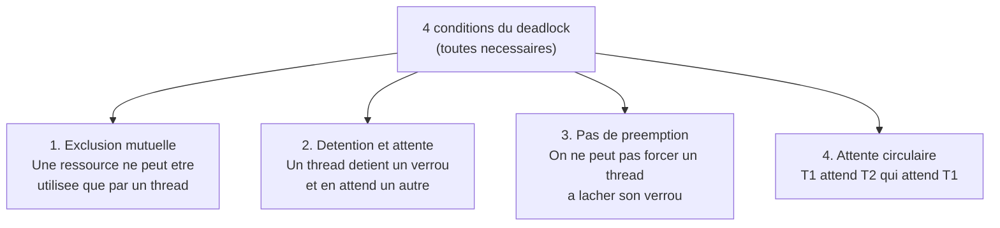
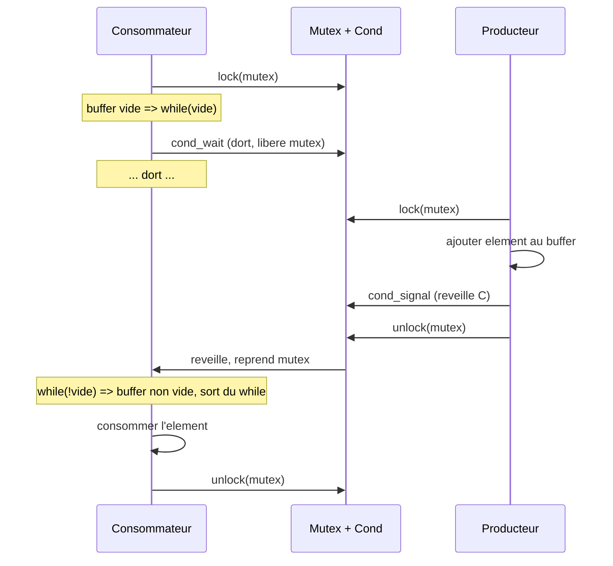
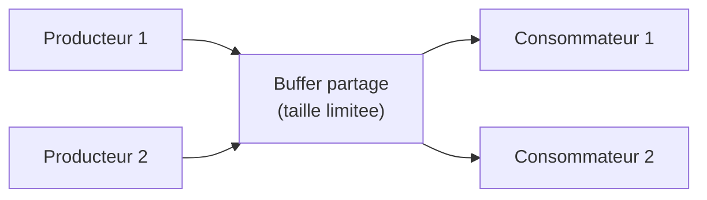

# Chapitre 2 -- Threads POSIX (Pthreads)

> **Idee centrale en une phrase :** Un thread est un fil d'execution leger qui partage la memoire avec les autres threads du meme processus -- c'est le mecanisme le plus bas niveau pour paralleliser en C.

**Prerequis :** [Introduction au parallelisme](01_intro_parallelisme.md)
**Chapitre suivant :** [OpenMP -->](03_openmp.md)

---

## 1. L'analogie de la cuisine partagee

### Qu'est-ce qu'un thread ?

Imagine une cuisine (= le processus). Dans cette cuisine, il y a un frigo, un plan de travail, des ustensiles (= la memoire partagee). Normalement, **un seul cuisinier** travaille dedans (= un seul thread).

Mais si tu invites des amis a cuisiner ensemble, vous etes maintenant **plusieurs cuisiniers dans la meme cuisine**. Chacun a ses propres mains et sa propre recette (= pile d'execution, registres), mais vous partagez tous le frigo et les ustensiles.

C'est exactement ce qu'est un thread : un **fil d'execution independant** au sein d'un meme processus, qui partage la memoire globale avec les autres threads.

### Processus vs Thread



| Aspect | Processus | Thread |
|--------|-----------|--------|
| Memoire | Propre (isolee) | Partagee avec les autres threads |
| Creation | Lourde (fork, copie memoire) | Legere (quelques microsecondes) |
| Communication | IPC (pipes, sockets...) | Lecture/ecriture directe en memoire |
| Crash | N'affecte pas les autres processus | Peut crasher tout le processus |
| Exemple | Chaque onglet Chrome | Chaque requete dans un serveur web |

### Ce que les threads partagent et ne partagent pas

**Partage (attention aux conflits) :**
- Variables globales
- Tas (memoire allouee avec `malloc`)
- Descripteurs de fichiers
- Code du programme

**Propre a chaque thread (pas de conflit) :**
- Pile d'execution (variables locales)
- Registres du processeur
- Compteur de programme (ou en est l'execution)
- Identifiant du thread (TID)

---

## 2. Creer et attendre un thread

### 2.1 `pthread_create` -- Lancer un thread

```c
#include <pthread.h>

int pthread_create(
    pthread_t *thread,           /* [OUT] identifiant du thread cree */
    const pthread_attr_t *attr,  /* attributs (NULL = defaut) */
    void *(*start_routine)(void *),  /* fonction a executer */
    void *arg                    /* argument passe a la fonction */
);
```

| Parametre | Signification |
|-----------|---------------|
| `thread` | Pointeur vers une variable qui recevra l'identifiant du nouveau thread |
| `attr` | Attributs du thread (taille de pile, etc.). `NULL` = valeurs par defaut |
| `start_routine` | La fonction que le thread va executer. Elle prend un `void*` et retourne un `void*` |
| `arg` | L'argument passe a la fonction. `NULL` si pas d'argument |

**Retour :** 0 en cas de succes, un code d'erreur sinon.

### 2.2 `pthread_join` -- Attendre un thread

```c
int pthread_join(
    pthread_t thread,   /* identifiant du thread a attendre */
    void **retval       /* [OUT] valeur retournee par le thread (ou NULL) */
);
```

`pthread_join` **bloque** le thread appelant jusqu'a ce que le thread cible ait termine. C'est l'equivalent de "attendre que ton collegue ait fini son travail avant de continuer".

### 2.3 Premier programme complet

```c
#include <stdio.h>
#include <stdlib.h>
#include <pthread.h>

/* Fonction executee par le thread.
   Elle recoit un pointeur generique (void*) et retourne un pointeur generique.
   Ici, on recoit un numero de thread. */
void *dire_bonjour(void *arg)
{
    int numero = *(int *)arg;    /* On caste le void* en int* puis on dereference */
    printf("Bonjour depuis le thread %d !\n", numero);
    return NULL;                 /* Le thread n'a rien a retourner */
}

int main(void)
{
    /* On veut creer 4 threads */
    int nb_threads = 4;
    pthread_t threads[4];        /* Tableau pour stocker les identifiants */
    int numeros[4];              /* Tableau pour stocker les arguments */

    /* --- Creation des threads --- */
    for (int i = 0; i < nb_threads; i++) {
        numeros[i] = i;          /* Chaque thread recoit son numero */
        int err = pthread_create(&threads[i], NULL, dire_bonjour, &numeros[i]);
        if (err != 0) {
            fprintf(stderr, "Erreur creation thread %d\n", i);
            return EXIT_FAILURE;
        }
    }

    /* --- Attente de la fin de tous les threads --- */
    for (int i = 0; i < nb_threads; i++) {
        pthread_join(threads[i], NULL);  /* On attend chaque thread */
    }

    printf("Tous les threads ont termine.\n");
    return EXIT_SUCCESS;
}
```

### Compilation et execution

```bash
gcc -pthread premier_thread.c -o premier_thread
./premier_thread
```

### Sortie possible (l'ordre varie a chaque execution !)

```
Bonjour depuis le thread 2 !
Bonjour depuis le thread 0 !
Bonjour depuis le thread 3 !
Bonjour depuis le thread 1 !
Tous les threads ont termine.
```

> **Point important :** L'ordre d'execution des threads est **non deterministe**. L'OS decide quel thread s'execute quand. C'est normal et c'est une source de bugs si on ne fait pas attention.

### Schema d'execution



---

## 3. Passer des arguments et recuperer des resultats

### 3.1 Passer un argument complexe

Comme `pthread_create` n'accepte qu'un seul argument (`void*`), on utilise une **structure** pour passer plusieurs valeurs :

```c
#include <stdio.h>
#include <stdlib.h>
#include <pthread.h>

/* Structure pour passer plusieurs arguments au thread */
typedef struct {
    int id;
    int debut;
    int fin;
    double *tableau;
    double resultat;    /* Le thread ecrira son resultat ici */
} args_thread_t;

void *calculer_somme(void *arg)
{
    args_thread_t *params = (args_thread_t *)arg;

    double somme = 0.0;
    for (int i = params->debut; i < params->fin; i++) {
        somme += params->tableau[i];
    }
    params->resultat = somme;   /* On ecrit le resultat dans la structure */

    printf("Thread %d : somme de [%d, %d[ = %.0f\n",
           params->id, params->debut, params->fin, somme);
    return NULL;
}

int main(void)
{
    int N = 1000000;
    int nb_threads = 4;
    double *tab = (double *)malloc(N * sizeof(double));

    /* Initialiser le tableau (toutes les valeurs a 1.0) */
    for (int i = 0; i < N; i++) tab[i] = 1.0;

    pthread_t threads[4];
    args_thread_t args[4];

    /* Diviser le travail entre les threads */
    int tranche = N / nb_threads;
    for (int i = 0; i < nb_threads; i++) {
        args[i].id = i;
        args[i].debut = i * tranche;
        args[i].fin = (i == nb_threads - 1) ? N : (i + 1) * tranche;
        args[i].tableau = tab;
        args[i].resultat = 0.0;
        pthread_create(&threads[i], NULL, calculer_somme, &args[i]);
    }

    /* Attendre et sommer les resultats */
    double total = 0.0;
    for (int i = 0; i < nb_threads; i++) {
        pthread_join(threads[i], NULL);
        total += args[i].resultat;
    }

    printf("Somme totale : %.0f (attendu : %d)\n", total, N);
    free(tab);
    return EXIT_SUCCESS;
}
```

### 3.2 Schema de la repartition du travail



---

## 4. Le probleme : les race conditions

### 4.1 Qu'est-ce qu'une race condition ?

Une **race condition** (condition de concurrence) se produit quand deux threads accedent a la **meme variable** en meme temps, et qu'au moins l'un d'eux **ecrit**. Le resultat depend de l'ordre d'execution, qui est imprevisible.

### L'analogie du compte en banque

Deux personnes veulent retirer 100 euros du meme compte qui contient 200 euros :

1. Personne A lit le solde : **200 euros**
2. Personne B lit le solde : **200 euros** (elle ne sait pas que A va retirer)
3. Personne A retire 100 : ecrit **100 euros**
4. Personne B retire 100 : ecrit **100 euros** (elle avait lu 200, elle ecrit 200-100=100)

Resultat : le solde est 100 euros au lieu de 0. La banque a perdu 100 euros !

### 4.2 Demonstration en code

```c
#include <stdio.h>
#include <stdlib.h>
#include <pthread.h>

int compteur = 0;  /* Variable partagee -- DANGER ! */

void *incrementer(void *arg)
{
    for (int i = 0; i < 1000000; i++) {
        compteur++;     /* Pas atomique ! Equivalent a :
                           1. lire compteur dans un registre
                           2. ajouter 1 au registre
                           3. ecrire le registre dans compteur
                           Si deux threads font ca en meme temps, une increment peut etre perdue */
    }
    return NULL;
}

int main(void)
{
    pthread_t t1, t2;

    pthread_create(&t1, NULL, incrementer, NULL);
    pthread_create(&t2, NULL, incrementer, NULL);

    pthread_join(t1, NULL);
    pthread_join(t2, NULL);

    /* On attend 2 000 000, mais on obtient souvent moins ! */
    printf("Compteur = %d (attendu : 2000000)\n", compteur);
    return EXIT_SUCCESS;
}
```

### Sortie typique (varie a chaque execution)

```
Compteur = 1387422 (attendu : 2000000)
```

### Schema de la race condition



---

## 5. Les Mutex -- Proteger les sections critiques

### 5.1 Qu'est-ce qu'un mutex ?

Un **mutex** (MUTual EXclusion) est un verrou. Un seul thread peut le detenir a la fois. Les autres threads qui essaient de le prendre doivent **attendre**.

### L'analogie des toilettes

Des toilettes avec un verrou : une seule personne peut entrer a la fois. Les autres font la queue. Quand la personne sort et deverrouille, le suivant entre.



### 5.2 API des mutex

```c
#include <pthread.h>

/* Declaration et initialisation */
pthread_mutex_t verrou = PTHREAD_MUTEX_INITIALIZER;

/* Ou bien dynamiquement : */
pthread_mutex_t verrou;
pthread_mutex_init(&verrou, NULL);   /* NULL = attributs par defaut */

/* Verrouiller (bloquant) */
pthread_mutex_lock(&verrou);

/* Deverrouiller */
pthread_mutex_unlock(&verrou);

/* Detruire (si init dynamique) */
pthread_mutex_destroy(&verrou);
```

### 5.3 Corriger le compteur avec un mutex

```c
#include <stdio.h>
#include <stdlib.h>
#include <pthread.h>

int compteur = 0;
pthread_mutex_t verrou = PTHREAD_MUTEX_INITIALIZER;  /* Le mutex protege compteur */

void *incrementer(void *arg)
{
    for (int i = 0; i < 1000000; i++) {
        pthread_mutex_lock(&verrou);     /* Entrer en section critique */
        compteur++;                       /* Acces protege */
        pthread_mutex_unlock(&verrou);   /* Sortir de la section critique */
    }
    return NULL;
}

int main(void)
{
    pthread_t t1, t2;

    pthread_create(&t1, NULL, incrementer, NULL);
    pthread_create(&t2, NULL, incrementer, NULL);

    pthread_join(t1, NULL);
    pthread_join(t2, NULL);

    printf("Compteur = %d (attendu : 2000000)\n", compteur);
    return EXIT_SUCCESS;
}
```

### Sortie (toujours correcte)

```
Compteur = 2000000 (attendu : 2000000)
```

### 5.4 Bonne pratique : minimiser la section critique

```c
/* MAUVAIS : tout dans la section critique (trop lent) */
pthread_mutex_lock(&verrou);
double resultat = calcul_complexe(donnees);   /* Pas besoin de mutex ici ! */
compteur += resultat;
pthread_mutex_unlock(&verrou);

/* BON : seulement l'acces partage dans la section critique */
double resultat = calcul_complexe(donnees);   /* Pas de mutex necessaire */
pthread_mutex_lock(&verrou);
compteur += resultat;                          /* Seul l'acces partage est protege */
pthread_mutex_unlock(&verrou);
```

> **Regle d'or :** La section critique doit etre la plus **courte** possible. Plus elle est longue, plus les threads passent du temps a attendre, et moins le parallelisme est efficace.

---

## 6. Les Deadlocks

### 6.1 Qu'est-ce qu'un deadlock ?

Un **deadlock** (interblocage) se produit quand deux threads s'attendent mutuellement : chacun detient un verrou dont l'autre a besoin.

### L'analogie du couloir etroit

Deux personnes se croisent dans un couloir trop etroit pour passer a deux. Chacune attend que l'autre recule. Personne ne bouge. Blocage eternel.

### 6.2 Conditions du deadlock (les 4 conditions de Coffman)

Un deadlock se produit quand ces **4 conditions** sont reunies simultanement :



### 6.3 Exemple de deadlock

```c
pthread_mutex_t verrou_A = PTHREAD_MUTEX_INITIALIZER;
pthread_mutex_t verrou_B = PTHREAD_MUTEX_INITIALIZER;

void *thread1(void *arg)
{
    pthread_mutex_lock(&verrou_A);     /* T1 prend A */
    /* ... du travail ... */
    pthread_mutex_lock(&verrou_B);     /* T1 attend B (detenu par T2) --> BLOQUE */
    /* section critique */
    pthread_mutex_unlock(&verrou_B);
    pthread_mutex_unlock(&verrou_A);
    return NULL;
}

void *thread2(void *arg)
{
    pthread_mutex_lock(&verrou_B);     /* T2 prend B */
    /* ... du travail ... */
    pthread_mutex_lock(&verrou_A);     /* T2 attend A (detenu par T1) --> BLOQUE */
    /* section critique */
    pthread_mutex_unlock(&verrou_A);
    pthread_mutex_unlock(&verrou_B);
    return NULL;
}
/* DEADLOCK ! T1 attend B (detenu par T2), T2 attend A (detenu par T1) */
```

### 6.4 Comment eviter les deadlocks

**Strategie 1 : Ordre global de verrouillage**

Tous les threads prennent les verrous **dans le meme ordre**. Si tout le monde prend A avant B, personne ne peut avoir B sans A.

```c
/* Thread 1 et Thread 2 prennent les verrous dans le MEME ORDRE */
void *thread_safe(void *arg)
{
    pthread_mutex_lock(&verrou_A);     /* Toujours A d'abord */
    pthread_mutex_lock(&verrou_B);     /* Puis B */
    /* section critique */
    pthread_mutex_unlock(&verrou_B);
    pthread_mutex_unlock(&verrou_A);
    return NULL;
}
```

**Strategie 2 : `pthread_mutex_trylock`**

Essayer de prendre le verrou sans bloquer. Si ca echoue, relacher ce qu'on a et reessayer.

```c
void *thread_prudent(void *arg)
{
    while (1) {
        pthread_mutex_lock(&verrou_A);
        if (pthread_mutex_trylock(&verrou_B) == 0) {
            break;  /* On a les deux verrous, on continue */
        }
        /* On n'a pas pu avoir B, on relache A et on reessaie */
        pthread_mutex_unlock(&verrou_A);
    }
    /* section critique (on a les deux verrous) */
    pthread_mutex_unlock(&verrou_B);
    pthread_mutex_unlock(&verrou_A);
    return NULL;
}
```

---

## 7. Variables de condition

### 7.1 Le probleme : attendre un evenement

Parfois, un thread doit **attendre qu'une condition soit remplie** par un autre thread. Par exemple : un thread consommateur attend qu'il y ait un element dans un buffer.

### Pourquoi pas un `while` en boucle ?

```c
/* MAUVAIS : attente active (busy waiting) -- gaspille le CPU ! */
while (buffer_vide) {
    /* On boucle en permanence, le CPU tourne pour rien */
}
```

L'attente active gaspille du CPU. La variable de condition permet au thread de **dormir** jusqu'a ce qu'on le reveille.

### 7.2 API des variables de condition

```c
#include <pthread.h>

/* Declaration et initialisation */
pthread_cond_t cond = PTHREAD_COND_INITIALIZER;

/* Attendre (le thread dort) -- DOIT etre appele avec le mutex verrouille */
pthread_cond_wait(&cond, &mutex);
/* Fonctionnement :
   1. Libere le mutex atomiquement
   2. Le thread dort
   3. Quand il est reveille, il reprend le mutex avant de continuer */

/* Reveiller UN thread en attente */
pthread_cond_signal(&cond);

/* Reveiller TOUS les threads en attente */
pthread_cond_broadcast(&cond);

/* Detruire */
pthread_cond_destroy(&cond);
```

### 7.3 Le pattern d'utilisation

**IMPORTANT : toujours utiliser un `while` autour de `pthread_cond_wait`** (jamais un `if`) pour gerer les reveils intempestifs (spurious wakeups).

```c
/* Thread qui ATTEND la condition */
pthread_mutex_lock(&mutex);
while (!condition_remplie) {           /* WHILE, pas IF ! */
    pthread_cond_wait(&cond, &mutex);  /* Dort en relachant le mutex */
}
/* Ici : condition remplie ET mutex verrouille */
/* ... utiliser la ressource ... */
pthread_mutex_unlock(&mutex);

/* Thread qui SIGNALE la condition */
pthread_mutex_lock(&mutex);
condition_remplie = 1;                 /* Modifier la condition */
pthread_cond_signal(&cond);            /* Reveiller un thread en attente */
pthread_mutex_unlock(&mutex);
```

### Schema du fonctionnement



---

## 8. Le patron Producteur-Consommateur

C'est **le** patron classique de la programmation concurrente. Un ou plusieurs threads **produisent** des donnees, un ou plusieurs threads les **consomment**, via un buffer partage.

### 8.1 Schema du patron



### 8.2 Implementation complete

```c
#include <stdio.h>
#include <stdlib.h>
#include <pthread.h>

#define TAILLE_BUFFER 5
#define NB_ELEMENTS 20

/* --- Buffer circulaire partage --- */
int buffer[TAILLE_BUFFER];
int count = 0;              /* Nombre d'elements dans le buffer */
int index_prod = 0;         /* Position d'ecriture */
int index_cons = 0;         /* Position de lecture */

/* --- Synchronisation --- */
pthread_mutex_t mutex = PTHREAD_MUTEX_INITIALIZER;
pthread_cond_t pas_plein = PTHREAD_COND_INITIALIZER;   /* Signale quand le buffer n'est plus plein */
pthread_cond_t pas_vide = PTHREAD_COND_INITIALIZER;    /* Signale quand le buffer n'est plus vide */

void *producteur(void *arg)
{
    for (int i = 0; i < NB_ELEMENTS; i++) {
        pthread_mutex_lock(&mutex);

        /* Attendre tant que le buffer est plein */
        while (count == TAILLE_BUFFER) {
            printf("  Producteur : buffer plein, j'attends...\n");
            pthread_cond_wait(&pas_plein, &mutex);
        }

        /* Ajouter un element */
        buffer[index_prod] = i;
        index_prod = (index_prod + 1) % TAILLE_BUFFER;  /* Buffer circulaire */
        count++;
        printf("Producteur : produit %d (buffer : %d/%d)\n",
               i, count, TAILLE_BUFFER);

        /* Signaler que le buffer n'est plus vide */
        pthread_cond_signal(&pas_vide);
        pthread_mutex_unlock(&mutex);
    }
    return NULL;
}

void *consommateur(void *arg)
{
    for (int i = 0; i < NB_ELEMENTS; i++) {
        pthread_mutex_lock(&mutex);

        /* Attendre tant que le buffer est vide */
        while (count == 0) {
            printf("  Consommateur : buffer vide, j'attends...\n");
            pthread_cond_wait(&pas_vide, &mutex);
        }

        /* Retirer un element */
        int val = buffer[index_cons];
        index_cons = (index_cons + 1) % TAILLE_BUFFER;
        count--;
        printf("Consommateur : consomme %d (buffer : %d/%d)\n",
               val, count, TAILLE_BUFFER);

        /* Signaler que le buffer n'est plus plein */
        pthread_cond_signal(&pas_plein);
        pthread_mutex_unlock(&mutex);
    }
    return NULL;
}

int main(void)
{
    pthread_t prod, cons;

    pthread_create(&prod, NULL, producteur, NULL);
    pthread_create(&cons, NULL, consommateur, NULL);

    pthread_join(prod, NULL);
    pthread_join(cons, NULL);

    printf("Termine.\n");
    return EXIT_SUCCESS;
}
```

### Compilation et execution

```bash
gcc -pthread producteur_consommateur.c -o prod_cons
./prod_cons
```

### Sortie (extrait)

```
Producteur : produit 0 (buffer : 1/5)
Producteur : produit 1 (buffer : 2/5)
Producteur : produit 2 (buffer : 3/5)
Consommateur : consomme 0 (buffer : 2/5)
Producteur : produit 3 (buffer : 3/5)
Producteur : produit 4 (buffer : 4/5)
Producteur : produit 5 (buffer : 5/5)
  Producteur : buffer plein, j'attends...
Consommateur : consomme 1 (buffer : 4/5)
Producteur : produit 6 (buffer : 5/5)
...
```

---

## 9. Autres primitives utiles

### 9.1 `pthread_self` et `pthread_equal`

```c
pthread_t mon_id = pthread_self();      /* Obtenir son propre identifiant */

/* Comparer deux identifiants (ne PAS utiliser ==) */
if (pthread_equal(id1, id2)) {
    printf("Meme thread\n");
}
```

### 9.2 `pthread_detach`

Un thread detache libere ses ressources automatiquement a la fin, sans que le main ait besoin d'appeler `pthread_join`.

```c
pthread_t t;
pthread_create(&t, NULL, ma_fonction, NULL);
pthread_detach(t);    /* Le main n'a plus besoin de faire join */
/* ATTENTION : on ne peut plus faire join apres un detach ! */
```

### 9.3 `pthread_cancel`

Demander a un thread de s'arreter (a utiliser avec precaution) :

```c
pthread_cancel(thread_id);
```

> **Attention :** `pthread_cancel` peut laisser des mutex verrouilles et de la memoire non liberee. Prefere un mecanisme d'arret propre (variable booleenne partagee).

### 9.4 Tableau recapitulatif de l'API

| Fonction | Role |
|----------|------|
| `pthread_create` | Creer un nouveau thread |
| `pthread_join` | Attendre la fin d'un thread |
| `pthread_exit` | Terminer le thread courant |
| `pthread_self` | Obtenir son identifiant |
| `pthread_detach` | Detacher un thread (pas de join) |
| `pthread_mutex_lock` | Verrouiller un mutex |
| `pthread_mutex_unlock` | Deverrouiller un mutex |
| `pthread_mutex_trylock` | Essayer de verrouiller sans bloquer |
| `pthread_cond_wait` | Attendre une condition (dort) |
| `pthread_cond_signal` | Reveiller un thread en attente |
| `pthread_cond_broadcast` | Reveiller tous les threads en attente |

---

## 10. Pieges classiques

### Piege 1 : Passer une variable locale en boucle

```c
/* MAUVAIS -- TRES COURANT ! */
for (int i = 0; i < 4; i++) {
    pthread_create(&threads[i], NULL, ma_fonction, &i);
    /* PROBLEME : tous les threads recoivent un pointeur vers la MEME variable i
       qui change a chaque iteration ! Quand le thread lit *arg, i vaut peut-etre
       deja 2 ou 3 au lieu de la valeur attendue. */
}

/* BON : utiliser un tableau d'arguments */
int numeros[4];
for (int i = 0; i < 4; i++) {
    numeros[i] = i;     /* Chaque element est distinct et ne change pas */
    pthread_create(&threads[i], NULL, ma_fonction, &numeros[i]);
}
```

### Piege 2 : Oublier le `pthread_join`

Si le `main` se termine avant les threads, le processus est tue et les threads meurent avec lui. Toujours faire `join` (ou `detach` si on ne veut pas attendre).

### Piege 3 : Oublier de proteger une variable partagee

Si deux threads accedent a la meme variable et qu'au moins un ecrit, il **faut** un mutex. Pas de "ca marche peut-etre sans mutex" : une race condition peut se manifester rarement mais causer des bugs tres difficiles a reproduire.

### Piege 4 : Utiliser `if` au lieu de `while` avec `cond_wait`

```c
/* MAUVAIS */
if (buffer_vide) {
    pthread_cond_wait(&cond, &mutex);
}
/* PROBLEME : le thread peut etre reveille par un "spurious wakeup" (reveil
   intempestif) sans que la condition ait change. Le while re-verifie. */

/* BON */
while (buffer_vide) {
    pthread_cond_wait(&cond, &mutex);
}
```

### Piege 5 : Deadlock par ordre de verrouillage

Si tu as plusieurs mutex, prends-les **toujours dans le meme ordre** partout dans le code. Un desordre dans l'ordre de verrouillage est la cause numero 1 de deadlocks.

---

## 11. Recapitulatif

| Concept | A retenir |
|---------|-----------|
| **Thread** | Fil d'execution leger partageant la memoire du processus |
| **pthread_create** | Cree un thread qui execute une fonction |
| **pthread_join** | Attend la fin d'un thread |
| **Race condition** | Acces concurrent non protege a une variable partagee |
| **Mutex** | Verrou d'exclusion mutuelle -- un seul thread a la fois |
| **Section critique** | Code protege par un mutex -- la garder la plus courte possible |
| **Deadlock** | Deux threads s'attendent mutuellement -- ordre global de verrouillage |
| **Variable de condition** | Permet a un thread de dormir en attendant un evenement |
| **Producteur-consommateur** | Patron classique : buffer partage + mutex + conditions |
| **Compilation** | `gcc -pthread fichier.c -o sortie` |

> **Le message essentiel :** Les threads POSIX sont le niveau le plus bas de parallelisme en C. Tu controles tout : creation, synchronisation, communication. C'est puissant mais verbeux. OpenMP (chapitre suivant) fournit une abstraction plus legere pour les cas courants.
