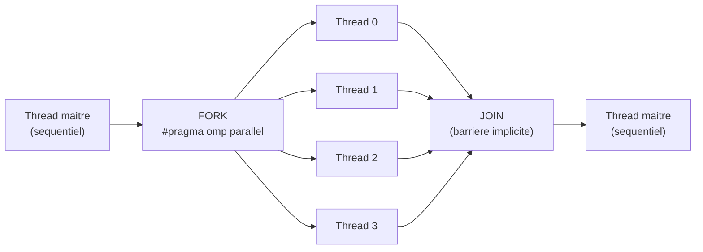
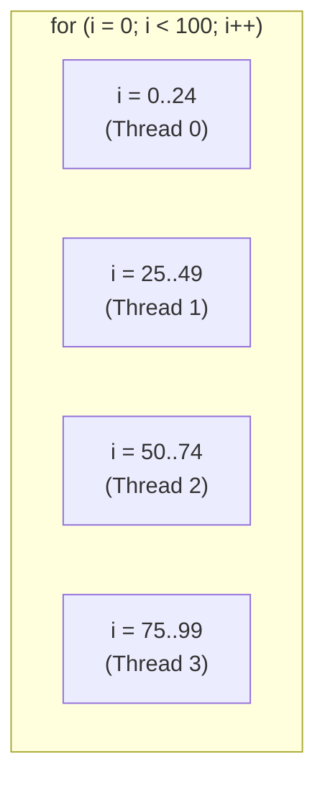
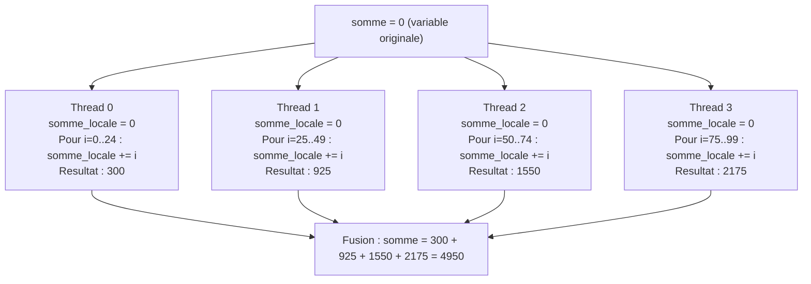
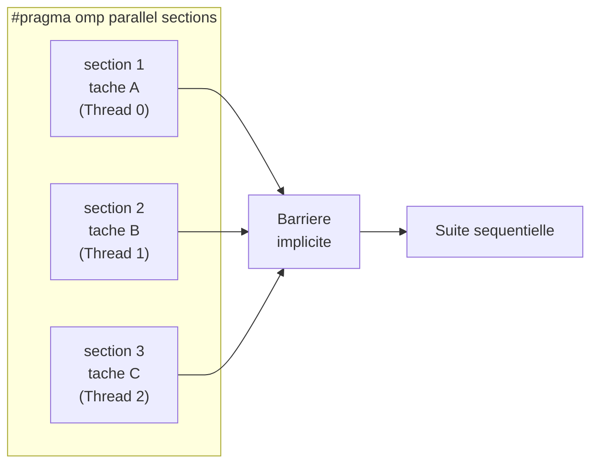
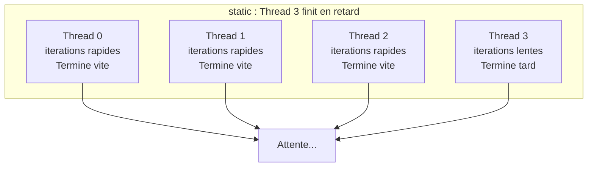
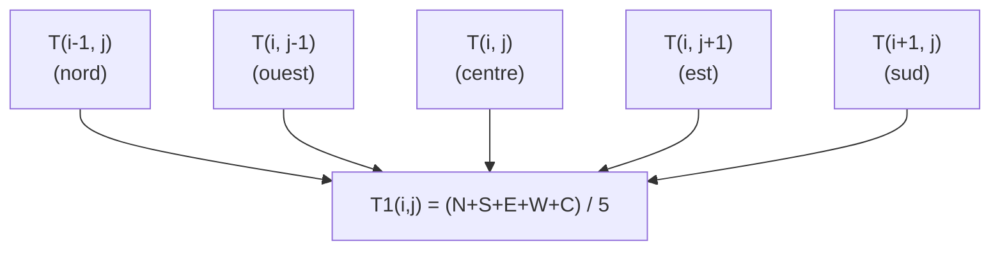

# Chapitre 3 -- OpenMP

> **Idee centrale en une phrase :** OpenMP permet de paralleliser un programme C en ajoutant de simples directives `#pragma` -- sans gerer manuellement les threads.

**Prerequis :** [Introduction au parallelisme](01_intro_parallelisme.md), [Threads POSIX](02_threads_posix.md) (recommande)
**Chapitre suivant :** [MPI -->](04_mpi.md)

---

## 1. L'analogie du chef de chantier

### Pthreads vs OpenMP

Avec les **Pthreads** (chapitre 2), tu es le **macon** : tu crees chaque thread a la main, tu geres les mutex, tu calcules les indices de debut et fin de chaque tranche. C'est precis mais laborieux.

Avec **OpenMP**, tu es le **chef de chantier** : tu pointes du doigt une boucle et tu dis "faites ca en parallele, 4 ouvriers". OpenMP s'occupe de creer les threads, repartir le travail, synchroniser. Tu gardes ton code sequentiel et tu ajoutes des **annotations**.

### Le modele Fork-Join

OpenMP fonctionne selon le modele **fork-join** :

1. Le programme demarre avec **un seul thread** (le thread maitre).
2. Quand il rencontre une directive `#pragma omp parallel`, il **forke** : plusieurs threads sont crees.
3. Les threads executent le code en parallele.
4. A la fin du bloc parallele, les threads se **joignent** : seul le thread maitre continue.



> **Point important :** A chaque `#pragma omp parallel`, OpenMP cree des threads (fork) puis les detruit (join). En pratique, les threads sont souvent **reutilises** d'une region parallele a l'autre (pool de threads), ce qui evite le cout de creation.

---

## 2. Premiere directive : `#pragma omp parallel`

### 2.1 Le programme minimal

```c
#include <stdio.h>
#include <omp.h>

int main(void)
{
    printf("Avant la region parallele (1 thread)\n");

    #pragma omp parallel
    {
        /* Ce bloc est execute par TOUS les threads */
        int id = omp_get_thread_num();     /* Numero du thread (0, 1, 2...) */
        int nb = omp_get_num_threads();    /* Nombre total de threads */
        printf("Bonjour du thread %d/%d\n", id, nb);
    }
    /* Barriere implicite ici : on attend que tous les threads aient fini */

    printf("Apres la region parallele (1 thread)\n");
    return 0;
}
```

### Compilation et execution

```bash
gcc -fopenmp hello_omp.c -o hello_omp

# Executer avec 4 threads
export OMP_NUM_THREADS=4
./hello_omp
```

### Sortie possible

```
Avant la region parallele (1 thread)
Bonjour du thread 0/4
Bonjour du thread 2/4
Bonjour du thread 1/4
Bonjour du thread 3/4
Apres la region parallele (1 thread)
```

### 2.2 Controler le nombre de threads

Trois facons (par ordre de priorite) :

```c
/* 1. Dans la directive (priorite la plus haute) */
#pragma omp parallel num_threads(8)
{ ... }

/* 2. Par appel de fonction */
omp_set_num_threads(8);

/* 3. Par variable d'environnement (priorite la plus basse) */
/* export OMP_NUM_THREADS=8 */
```

### 2.3 Fonctions utiles

| Fonction | Retourne |
|----------|----------|
| `omp_get_thread_num()` | Numero du thread courant (0 a N-1) |
| `omp_get_num_threads()` | Nombre total de threads dans la region parallele |
| `omp_get_max_threads()` | Nombre maximum de threads disponibles |
| `omp_get_wtime()` | Temps mur en secondes (pour mesurer les performances) |
| `omp_set_num_threads(n)` | Fixer le nombre de threads pour les prochaines regions |

---

## 3. Paralleliser une boucle : `#pragma omp parallel for`

C'est **la** directive la plus utilisee. Elle distribue automatiquement les iterations d'une boucle `for` entre les threads.

### 3.1 Syntaxe de base

```c
/* Version sequentielle */
for (int i = 0; i < N; i++) {
    tab[i] = tab[i] * 2;
}

/* Version parallele -- on ajoute UNE SEULE LIGNE */
#pragma omp parallel for
for (int i = 0; i < N; i++) {
    tab[i] = tab[i] * 2;
}
```

C'est tout ! OpenMP se charge de :
- Creer les threads
- Diviser les iterations entre les threads (par defaut : blocs contigus)
- Synchroniser a la fin de la boucle

### 3.2 Comment OpenMP divise le travail

Avec 4 threads et une boucle de 100 iterations :



### 3.3 Conditions pour paralleliser une boucle

La boucle `for` doit avoir une forme **canonique** :

```c
/* OK : OpenMP sait calculer le nombre d'iterations a l'avance */
for (int i = debut; i < fin; i++)
for (int i = debut; i <= fin; i += pas)

/* PAS OK : OpenMP ne peut pas predire le nombre d'iterations */
for (int i = 0; tab[i] != 0; i++)      /* Condition depend des donnees */
while (condition)                        /* Pas un for */
```

### 3.4 Exemple complet : calcul de PI

```c
#include <stdio.h>
#include <omp.h>

int main(void)
{
    long N = 100000000;  /* 100 millions de pas */
    double pas = 1.0 / N;
    double pi = 0.0;

    double t0 = omp_get_wtime();

    /* Chaque thread calcule sa contribution a pi.
       reduction(+:pi) : chaque thread a sa copie locale de pi,
       les copies sont additionnees a la fin. */
    #pragma omp parallel for reduction(+:pi)
    for (long i = 0; i < N; i++) {
        double x = (i + 0.5) * pas;       /* Point milieu */
        pi += 4.0 / (1.0 + x * x);        /* f(x) = 4/(1+x^2) */
    }
    pi *= pas;   /* Multiplier par la largeur du pas */

    double t1 = omp_get_wtime();

    printf("PI = %.15f\n", pi);
    printf("Temps = %.4f s\n", t1 - t0);
    return 0;
}
```

---

## 4. Variables partagees et privees

### 4.1 Le concept

Dans une region parallele, chaque variable est soit :

- **`shared`** (partagee) : tous les threads voient la **meme** variable. Attention aux race conditions !
- **`private`** (privee) : chaque thread a sa **propre copie**. Les modifications n'affectent pas les autres.

### 4.2 Regles par defaut

| Type de variable | Defaut dans `parallel` | Defaut dans `parallel for` |
|------------------|------------------------|----------------------------|
| Variable declaree **avant** le bloc | `shared` | `shared` |
| Variable declaree **dans** le bloc | `private` (locale) | `private` (locale) |
| Variable de boucle (le `i`) | -- | `private` (automatiquement) |

### 4.3 Clauses explicites

```c
int a = 10, b = 20, c = 30;

#pragma omp parallel private(a) shared(b) firstprivate(c)
{
    /* a : copie privee, NON initialisee (valeur indefinie !) */
    /* b : partagee entre tous les threads (attention race condition) */
    /* c : copie privee, INITIALISEE avec la valeur de c avant le bloc (30) */
}
```

| Clause | Comportement |
|--------|-------------|
| `shared(x)` | Tous les threads partagent la meme variable x |
| `private(x)` | Chaque thread a une copie non initialisee de x |
| `firstprivate(x)` | Chaque thread a une copie initialisee avec la valeur actuelle de x |
| `lastprivate(x)` | Comme private, mais la valeur de la derniere iteration est copiee apres le bloc |

### 4.4 Exemple dangereux

```c
int somme = 0;

/* MAUVAIS : race condition sur somme (shared par defaut) */
#pragma omp parallel for
for (int i = 0; i < 1000; i++) {
    somme += i;    /* Plusieurs threads ecrivent en meme temps ! */
}
/* somme est incorrecte */

/* BON : utiliser reduction */
#pragma omp parallel for reduction(+:somme)
for (int i = 0; i < 1000; i++) {
    somme += i;    /* Chaque thread a sa copie, fusion a la fin */
}
/* somme est correcte */
```

---

## 5. La clause `reduction`

### 5.1 Principe

La **reduction** est un patron tres courant : chaque thread calcule un resultat partiel, puis les resultats sont combines.

```c
#pragma omp parallel for reduction(operateur:variable)
```

| Operateur | Valeur initiale de la copie | Exemples d'usage |
|-----------|-----------------------------|------------------|
| `+` | 0 | Somme, comptage |
| `*` | 1 | Produit |
| `-` | 0 | Difference |
| `&` | ~0 (tous les bits a 1) | AND bit a bit |
| `\|` | 0 | OR bit a bit |
| `^` | 0 | XOR bit a bit |
| `&&` | 1 | AND logique |
| `\|\|` | 0 | OR logique |
| `min` | Plus grande valeur possible | Minimum |
| `max` | Plus petite valeur possible | Maximum |

### 5.2 Ce qui se passe en interne



### 5.3 Trouver le minimum avec reduction

```c
#include <stdio.h>
#include <omp.h>
#include <limits.h>

int main(void)
{
    int tab[] = {42, 7, 13, 99, 3, 56, 21, 8, 67, 2};
    int n = 10;
    int minimum = INT_MAX;   /* Valeur initiale tres grande */

    #pragma omp parallel for reduction(min:minimum)
    for (int i = 0; i < n; i++) {
        if (tab[i] < minimum) {
            minimum = tab[i];
        }
    }

    printf("Minimum = %d\n", minimum);   /* Affiche 2 */
    return 0;
}
```

---

## 6. Synchronisation : `critical`, `atomic`, barrieres

### 6.1 `#pragma omp critical`

Definit une **section critique** : un seul thread a la fois execute ce bloc. C'est l'equivalent du mutex en pthreads.

```c
int compteur = 0;

#pragma omp parallel for
for (int i = 0; i < 1000; i++) {
    #pragma omp critical
    {
        compteur++;   /* Un seul thread a la fois ici */
    }
}
```

> **Attention :** Toutes les sections `critical` sans nom partagent le meme verrou. Pour des verrous differents, nommez-les :

```c
#pragma omp critical(verrou_a)
{ /* section A */ }

#pragma omp critical(verrou_b)
{ /* section B -- peut s'executer en meme temps que A */ }
```

### 6.2 `#pragma omp atomic`

Pour les operations simples sur une seule variable (increment, etc.), `atomic` est **plus rapide** que `critical` car il utilise des instructions atomiques du processeur.

```c
int compteur = 0;

#pragma omp parallel for
for (int i = 0; i < 1000000; i++) {
    #pragma omp atomic
    compteur++;    /* Atomique : pas de race condition, plus rapide que critical */
}
```

| Directive | Usage | Performance |
|-----------|-------|-------------|
| `critical` | Bloc de code arbitraire | Lent (verrou logiciel) |
| `atomic` | Operation simple sur UNE variable (++, +=, etc.) | Rapide (instruction CPU) |
| `reduction` | Accumulation dans une boucle | Le plus rapide (copies locales) |

### 6.3 `#pragma omp barrier`

Force tous les threads a **attendre les uns les autres** a un point precis.

```c
#pragma omp parallel
{
    phase_1();      /* Tous les threads font la phase 1 */

    #pragma omp barrier   /* Tous attendent que tout le monde ait fini la phase 1 */

    phase_2();      /* Puis tout le monde fait la phase 2 */
}
```

> **Note :** Il y a une **barriere implicite** a la fin de chaque `#pragma omp for`, `#pragma omp sections`, etc. On peut la supprimer avec `nowait` si les phases suivantes n'ont pas de dependance :

```c
#pragma omp for nowait     /* Pas de barriere a la fin */
for (...) { ... }
```

---

## 7. Sections et single

### 7.1 `#pragma omp sections` -- Parallelisme de taches

Permet d'executer des **blocs de code differents** en parallele (parallelisme de taches, pas de donnees).

```c
#pragma omp parallel sections
{
    #pragma omp section
    {
        printf("Thread %d fait la tache A\n", omp_get_thread_num());
        traitement_A();
    }

    #pragma omp section
    {
        printf("Thread %d fait la tache B\n", omp_get_thread_num());
        traitement_B();
    }

    #pragma omp section
    {
        printf("Thread %d fait la tache C\n", omp_get_thread_num());
        traitement_C();
    }
}
/* Barriere implicite : on attend que toutes les sections soient terminees */
```

### Schema d'execution



### 7.2 `#pragma omp single` -- Un seul thread

Un seul thread execute le bloc ; les autres attendent (barriere implicite a la fin).

```c
#pragma omp parallel
{
    /* Tous les threads font ce travail */
    calcul_parallele();

    #pragma omp single
    {
        /* Un seul thread fait ca (ex: affichage, I/O) */
        printf("Resultat intermediaire : %d\n", resultat);
    }
    /* Barriere implicite : tous attendent */

    /* Tous les threads continuent */
    suite_du_calcul();
}
```

### 7.3 `#pragma omp master`

Similaire a `single`, mais **seul le thread maitre (thread 0)** execute le bloc. Pas de barriere implicite.

---

## 8. Politiques de schedule

### 8.1 Le probleme du desequilibrage de charge

Si certaines iterations sont plus couteuses que d'autres, les threads qui ont les iterations "faciles" finissent avant et attendent. C'est du temps gaspille.



### 8.2 Les differentes politiques

```c
#pragma omp parallel for schedule(TYPE, TAILLE_CHUNK)
```

#### `static` (par defaut)

Les iterations sont divisees en **blocs de taille egale** et distribuees a l'avance.

```c
#pragma omp parallel for schedule(static)
/* 100 iterations, 4 threads :
   T0 -> [0..24], T1 -> [25..49], T2 -> [50..74], T3 -> [75..99] */

#pragma omp parallel for schedule(static, 10)
/* Blocs de 10 : T0->[0..9], T1->[10..19], T2->[20..29], T3->[30..39],
   T0->[40..49], T1->[50..59], ... (round-robin) */
```

**Quand l'utiliser :** Quand toutes les iterations prennent a peu pres le meme temps.

#### `dynamic`

Les iterations sont distribuees **a la demande** : quand un thread finit son bloc, il en demande un autre.

```c
#pragma omp parallel for schedule(dynamic)
/* Chunk par defaut = 1 : chaque thread demande une iteration a la fois */

#pragma omp parallel for schedule(dynamic, 10)
/* Chaque thread demande un bloc de 10 iterations a la fois */
```

**Quand l'utiliser :** Quand les iterations ont des couts tres variables.

**Inconvenient :** Plus de **surcout** (overhead) car les threads doivent demander du travail au repartiteur.

#### `guided`

Comme `dynamic`, mais les blocs sont **de plus en plus petits** au fil du temps. Les premiers blocs sont gros (demarrage rapide), les derniers sont petits (equilibrage fin).

```c
#pragma omp parallel for schedule(guided)
```

#### `auto`

Le compilateur/runtime choisit la meilleure politique.

```c
#pragma omp parallel for schedule(auto)
```

### 8.3 Tableau comparatif

| Schedule | Repartition | Surcout | Equilibrage | Quand l'utiliser |
|----------|-------------|---------|-------------|------------------|
| `static` | A l'avance, blocs egaux | Tres faible | Mauvais si iterations inegales | Iterations homogenes |
| `dynamic` | A la demande | Moyen a eleve | Bon | Iterations tres inegales |
| `guided` | A la demande, blocs decroissants | Moyen | Bon | Compromis entre static et dynamic |
| `auto` | Choix automatique | Variable | Variable | Quand tu ne sais pas |

### 8.4 Exemple : mesurer l'effet du schedule

```c
#include <stdio.h>
#include <math.h>
#include <omp.h>

/* Simulation : l'iteration i prend un temps proportionnel a i */
double travail_variable(int i)
{
    double somme = 0.0;
    for (int j = 0; j < i * 1000; j++) {
        somme += sin(j * 0.001);
    }
    return somme;
}

int main(void)
{
    int N = 200;
    double resultat = 0.0;
    double t0, t1;

    /* --- static --- */
    resultat = 0.0;
    t0 = omp_get_wtime();
    #pragma omp parallel for reduction(+:resultat) schedule(static)
    for (int i = 0; i < N; i++) {
        resultat += travail_variable(i);
    }
    t1 = omp_get_wtime();
    printf("static  : %.4f s\n", t1 - t0);

    /* --- dynamic --- */
    resultat = 0.0;
    t0 = omp_get_wtime();
    #pragma omp parallel for reduction(+:resultat) schedule(dynamic, 4)
    for (int i = 0; i < N; i++) {
        resultat += travail_variable(i);
    }
    t1 = omp_get_wtime();
    printf("dynamic : %.4f s\n", t1 - t0);

    /* --- guided --- */
    resultat = 0.0;
    t0 = omp_get_wtime();
    #pragma omp parallel for reduction(+:resultat) schedule(guided)
    for (int i = 0; i < N; i++) {
        resultat += travail_variable(i);
    }
    t1 = omp_get_wtime();
    printf("guided  : %.4f s\n", t1 - t0);

    return 0;
}
```

---

## 9. Combiner les directives

### 9.1 `parallel` vs `parallel for`

```c
/* Deux directives separees -- equivaut a la version combinee */
#pragma omp parallel
{
    #pragma omp for
    for (int i = 0; i < N; i++) {
        tab[i] = f(i);
    }
}

/* Version combinee -- plus concise, meme effet */
#pragma omp parallel for
for (int i = 0; i < N; i++) {
    tab[i] = f(i);
}
```

### 9.2 Plusieurs boucles dans une region parallele

Quand tu as plusieurs boucles dans une seule region parallele, la separation est utile :

```c
#pragma omp parallel
{
    /* Premiere boucle -- les threads sont deja crees */
    #pragma omp for
    for (int i = 0; i < N; i++) {
        a[i] = f(i);
    }
    /* Barriere implicite ici */

    /* Deuxieme boucle -- memes threads, pas de recreation */
    #pragma omp for
    for (int i = 0; i < N; i++) {
        b[i] = g(a[i]);
    }
    /* Barriere implicite ici */
}
```

> **Avantage :** Les threads ne sont crees qu'une fois (au `#pragma omp parallel`), puis reutilises pour les deux boucles. Avec deux `#pragma omp parallel for` separes, les threads seraient crees et detruits deux fois.

---

## 10. Exemple complet : propagation de la chaleur

C'est un classique des TPs INSA. On simule la propagation de la chaleur dans une plaque 2D. A chaque iteration, la temperature de chaque cellule est la moyenne de ses 4 voisines et d'elle-meme.

```c
#include <stdio.h>
#include <stdlib.h>
#include <math.h>
#include <omp.h>

#define N 100       /* Taille de la grille */
#define MAX 1000.0  /* Temperature des bords */
#define SEUIL 1.0   /* Critere de convergence */

/* Macro pour acceder a la matrice lineaire comme un tableau 2D */
#define IDX(i,j) ((i)*(N+2)+(j))

int main(void)
{
    /* Allocation des deux grilles (bordure incluse : N+2 x N+2) */
    double *T  = (double *)calloc((N+2)*(N+2), sizeof(double));
    double *T1 = (double *)calloc((N+2)*(N+2), sizeof(double));
    double *temp;

    /* Initialiser les bords a MAX, l'interieur a 0 (calloc) */
    for (int i = 0; i < N+2; i++) {
        for (int j = 0; j < N+2; j++) {
            if (i == 0 || i == N+1 || j == 0 || j == N+1) {
                T[IDX(i,j)]  = MAX;
                T1[IDX(i,j)] = MAX;
            }
        }
    }

    double delta;
    int iter = 0;
    double t0 = omp_get_wtime();

    do {
        delta = 0.0;

        /* Calculer la nouvelle temperature de chaque cellule interieure */
        #pragma omp parallel for reduction(+:delta)
        for (int i = 1; i <= N; i++) {
            for (int j = 1; j <= N; j++) {
                /* Moyenne des 4 voisins + soi-meme (stencil a 5 points) */
                T1[IDX(i,j)] = (T[IDX(i-1,j)] + T[IDX(i+1,j)] +
                                T[IDX(i,j-1)] + T[IDX(i,j+1)] +
                                T[IDX(i,j)]) / 5.0;
                /* Accumuler la variation totale */
                delta += fabs(T1[IDX(i,j)] - T[IDX(i,j)]);
            }
        }

        /* Echanger les pointeurs (T devient T1, T1 devient T) */
        temp = T1;
        T1 = T;
        T = temp;
        iter++;

    } while (delta >= SEUIL);

    double t1 = omp_get_wtime();
    printf("Convergence en %d iterations, temps = %.4f s\n", iter, t1 - t0);

    free(T);
    free(T1);
    return 0;
}
```

### Compilation

```bash
gcc -fopenmp -O2 chaleur.c -o chaleur -lm
OMP_NUM_THREADS=4 ./chaleur
```

### Schema du stencil a 5 points



---

## 11. Pieges classiques

### Piege 1 : Race condition sur une variable partagee

```c
/* MAUVAIS */
int total = 0;
#pragma omp parallel for
for (int i = 0; i < N; i++) {
    total += tab[i];    /* Race condition ! */
}

/* BON : utiliser reduction */
#pragma omp parallel for reduction(+:total)
for (int i = 0; i < N; i++) {
    total += tab[i];
}
```

### Piege 2 : Variable privee non initialisee

```c
int x = 42;
#pragma omp parallel private(x)
{
    /* x n'est PAS initialisee a 42 ici ! Sa valeur est indefinie. */
    printf("x = %d\n", x);   /* Peut afficher n'importe quoi */
}

/* Solution : firstprivate */
#pragma omp parallel firstprivate(x)
{
    printf("x = %d\n", x);   /* x = 42 pour chaque thread */
}
```

### Piege 3 : Paralleliser une boucle avec dependance

```c
/* MAUVAIS : chaque iteration depend de la precedente ! */
#pragma omp parallel for
for (int i = 1; i < N; i++) {
    tab[i] = tab[i-1] + 1;   /* DEPENDANCE : tab[i] depend de tab[i-1] */
}
/* Le resultat est FAUX car les iterations ne sont pas executees dans l'ordre */
```

> **Regle :** Avant de paralleliser une boucle, verifie que les iterations sont **independantes** les unes des autres.

### Piege 4 : Oublier `-fopenmp` a la compilation

Sans `-fopenmp`, les `#pragma omp` sont **ignores** silencieusement. Le programme compile et s'execute... mais en sequentiel. Pas d'erreur, pas d'avertissement.

```bash
# MAUVAIS -- pas de -fopenmp, les pragmas sont ignores
gcc programme.c -o programme

# BON
gcc -fopenmp programme.c -o programme
```

### Piege 5 : Mesurer avec le mauvais chrono

```c
/* MAUVAIS : clock() mesure le temps CPU total (tous threads confondus) */
clock_t t0 = clock();
/* ... code parallele ... */
clock_t t1 = clock();
double temps = (double)(t1 - t0) / CLOCKS_PER_SEC;
/* Avec 4 threads, le temps rapporte est ~4 fois le temps reel ! */

/* BON : omp_get_wtime() mesure le temps mur (wall clock) */
double t0 = omp_get_wtime();
/* ... code parallele ... */
double t1 = omp_get_wtime();
double temps = t1 - t0;
```

### Piege 6 : Faux partage (false sharing)

```c
/* MAUVAIS : les elements du tableau sont sur la meme ligne de cache */
int compteurs[4] = {0};  /* 4 int = 16 octets, tiennent sur une seule ligne de cache */

#pragma omp parallel
{
    int id = omp_get_thread_num();
    for (int i = 0; i < 1000000; i++) {
        compteurs[id]++;   /* Faux partage : invalide la ligne de cache a chaque ecriture */
    }
}

/* BON : espacement (padding) pour mettre chaque compteur sur sa propre ligne de cache */
/* Une ligne de cache fait generalement 64 octets */
int compteurs[4 * 16] = {0};  /* 16 int entre chaque compteur */

#pragma omp parallel
{
    int id = omp_get_thread_num();
    for (int i = 0; i < 1000000; i++) {
        compteurs[id * 16]++;   /* Chaque compteur est sur sa propre ligne */
    }
}

/* ENCORE MIEUX : variable locale puis fusion */
int total = 0;
#pragma omp parallel
{
    int local = 0;
    for (int i = 0; i < 1000000; i++) {
        local++;
    }
    #pragma omp atomic
    total += local;
}
```

---

## 12. Recapitulatif

| Directive | Effet |
|-----------|-------|
| `#pragma omp parallel` | Cree une equipe de threads (region parallele) |
| `#pragma omp for` | Distribue les iterations d'un for entre les threads |
| `#pragma omp parallel for` | Combine parallel + for en une seule directive |
| `#pragma omp sections` / `section` | Parallelisme de taches (blocs differents) |
| `#pragma omp single` | Un seul thread execute le bloc |
| `#pragma omp master` | Seul le thread 0 execute (pas de barriere) |
| `#pragma omp critical` | Section critique (un thread a la fois) |
| `#pragma omp atomic` | Operation atomique sur une variable |
| `#pragma omp barrier` | Barriere de synchronisation |
| `nowait` | Supprime la barriere implicite |

| Clause | Effet |
|--------|-------|
| `shared(x)` | x est partagee |
| `private(x)` | Chaque thread a sa copie (non initialisee) |
| `firstprivate(x)` | Copie privee initialisee |
| `lastprivate(x)` | Copie privee, derniere valeur copiee apres |
| `reduction(op:x)` | Copies locales combinees par l'operateur op |
| `schedule(type, chunk)` | Politique de repartition des iterations |
| `num_threads(n)` | Fixer le nombre de threads |

| Fonction | Retourne |
|----------|----------|
| `omp_get_thread_num()` | Numero du thread (0 a N-1) |
| `omp_get_num_threads()` | Nombre de threads actifs |
| `omp_get_wtime()` | Temps mur (secondes) |
| `omp_set_num_threads(n)` | Definir le nombre de threads |

> **Le message essentiel :** OpenMP permet de paralleliser un programme C avec un minimum de modifications. L'essentiel est de bien comprendre quelles variables sont partagees, d'eviter les race conditions (utiliser `reduction`, `critical`, `atomic`), et de choisir la bonne politique de `schedule` selon l'uniformite des iterations.
