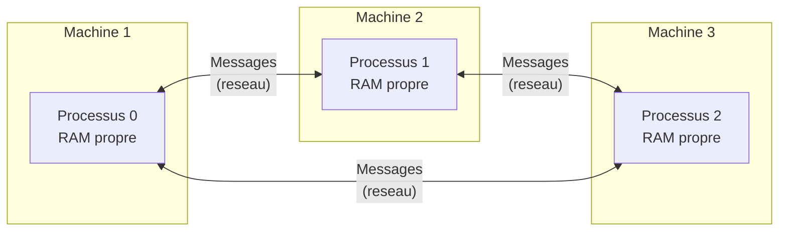
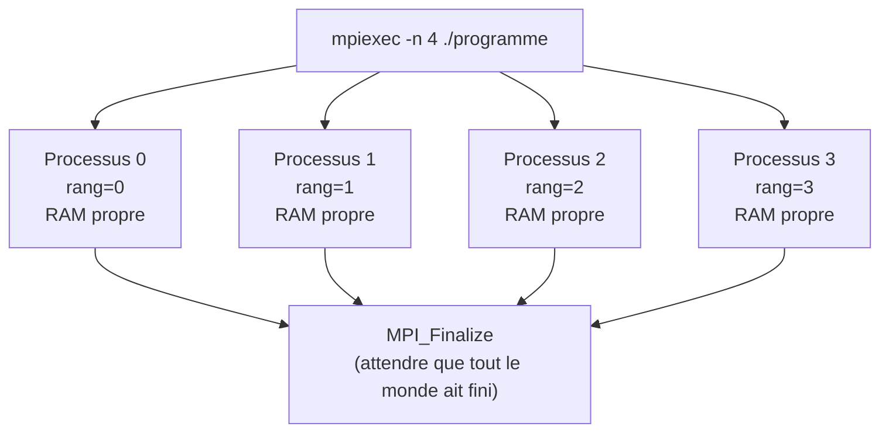
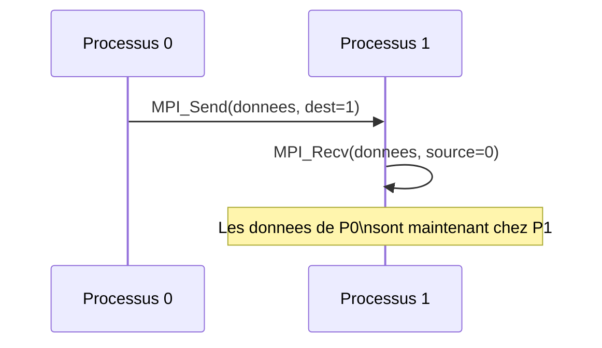
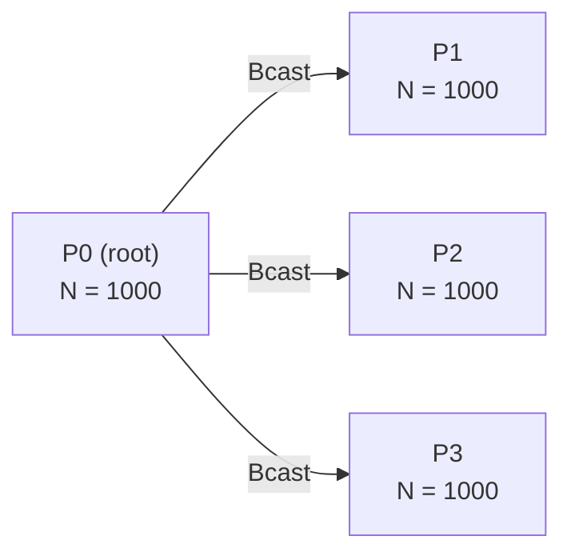
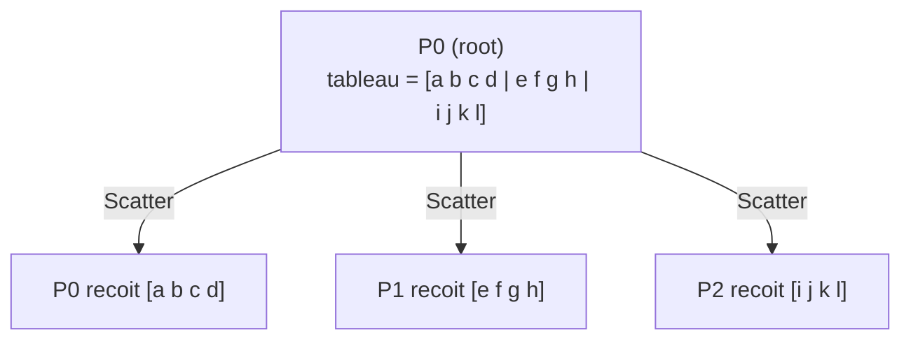
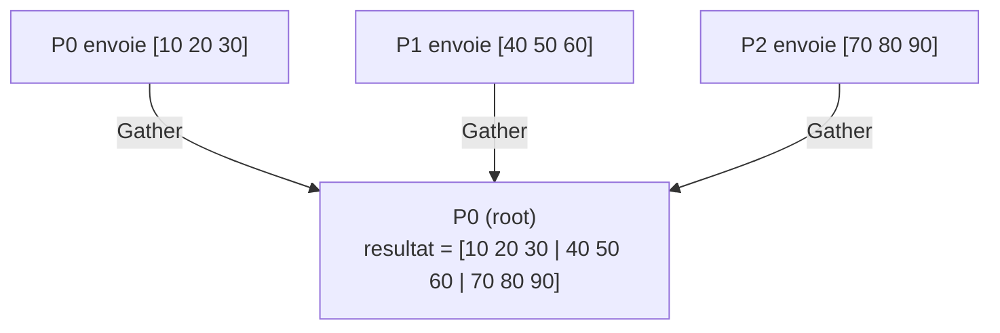
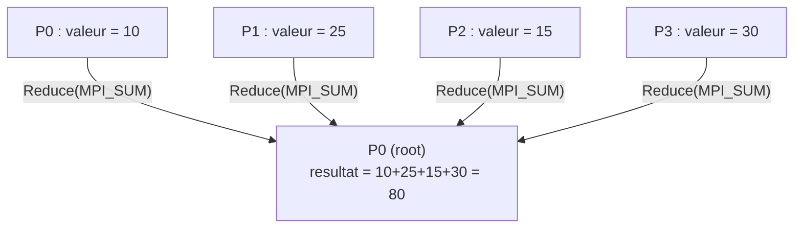
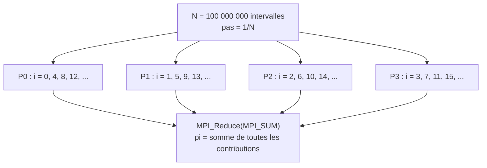
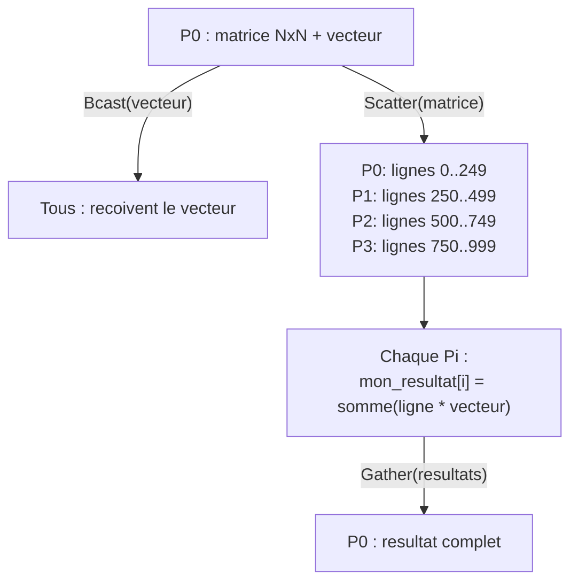
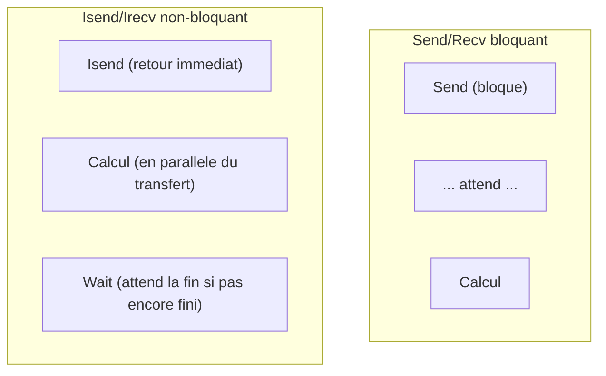

# Chapitre 4 -- MPI (Message Passing Interface)

> **Idee centrale en une phrase :** MPI permet a des programmes s'executant sur des machines differentes de communiquer en s'envoyant des messages -- c'est le standard pour le calcul distribue.

**Prerequis :** [Introduction au parallelisme](01_intro_parallelisme.md)
**Chapitre suivant :** [GPU et CUDA -->](05_gpu_cuda.md)

---

## 1. L'analogie du travail a distance

### Memoire partagee vs memoire distribuee

Avec les **threads** (memoire partagee), tout le monde travaille dans le **meme bureau** : on peut se passer des feuilles directement, lire le tableau commun, etc.

Avec **MPI** (memoire distribuee), chaque personne travaille dans **son propre bureau**, dans des batiments differents. Pour communiquer, il faut **envoyer un email** (= un message MPI). Personne ne peut lire les notes de l'autre sans les avoir recues.



### Le modele SPMD

MPI utilise le modele **SPMD** (Single Program, Multiple Data) : tous les processus executent le **meme programme**, mais chacun a un **rang** (numero) different et ses **propres donnees**.

Le rang permet a chaque processus de savoir **quel** travail il doit faire.

```c
if (rang == 0) {
    /* Je suis le chef, je distribue le travail */
} else {
    /* Je suis un travailleur, je fais ma part */
}
```

---

## 2. Initialisation et concepts de base

### 2.1 Le squelette d'un programme MPI

```c
#include <stdio.h>
#include <stdlib.h>
#include <mpi.h>

int main(int argc, char *argv[])
{
    int rang;       /* Mon numero (0, 1, 2, ...) */
    int nb_proc;    /* Nombre total de processus */

    /* --- Initialiser MPI --- */
    MPI_Init(&argc, &argv);

    /* --- Obtenir mon rang et le nombre de processus --- */
    MPI_Comm_rank(MPI_COMM_WORLD, &rang);
    MPI_Comm_size(MPI_COMM_WORLD, &nb_proc);

    printf("Je suis le processus %d sur %d\n", rang, nb_proc);

    /* --- Finaliser MPI --- */
    MPI_Finalize();
    return EXIT_SUCCESS;
}
```

### Compilation et execution

```bash
# Compilation avec mpicc (wrapper autour de gcc qui ajoute les bons flags)
mpicc hello_mpi.c -o hello_mpi

# Execution avec 4 processus
mpiexec -n 4 ./hello_mpi
```

### Sortie

```
Je suis le processus 0 sur 4
Je suis le processus 2 sur 4
Je suis le processus 1 sur 4
Je suis le processus 3 sur 4
```

### 2.2 Concepts fondamentaux

| Concept | Signification |
|---------|---------------|
| **Processus** | Instance du programme en cours d'execution, avec sa propre memoire |
| **Rang** | Numero unique du processus (0 a nb_proc-1) |
| **Communicateur** | Groupe de processus pouvant communiquer. `MPI_COMM_WORLD` = tous les processus |
| **SPMD** | Tous executent le meme programme, le rang determine le comportement |

### 2.3 Schema du modele MPI



---

## 3. Communications point a point : Send / Recv

### 3.1 Le principe

Un processus **envoie** un message (`MPI_Send`), un autre **recoit** le message (`MPI_Recv`). C'est la brique de base de MPI.



### 3.2 `MPI_Send`

```c
int MPI_Send(
    const void *buf,    /* Pointeur vers les donnees a envoyer */
    int count,          /* Nombre d'elements a envoyer */
    MPI_Datatype type,  /* Type des donnees */
    int dest,           /* Rang du destinataire */
    int tag,            /* Etiquette du message (pour distinguer les messages) */
    MPI_Comm comm       /* Communicateur (MPI_COMM_WORLD) */
);
```

### 3.3 `MPI_Recv`

```c
int MPI_Recv(
    void *buf,           /* Pointeur vers le buffer de reception */
    int count,           /* Nombre maximum d'elements a recevoir */
    MPI_Datatype type,   /* Type des donnees */
    int source,          /* Rang de l'expediteur (ou MPI_ANY_SOURCE) */
    int tag,             /* Etiquette (ou MPI_ANY_TAG) */
    MPI_Comm comm,       /* Communicateur */
    MPI_Status *status   /* Informations sur le message recu (ou MPI_STATUS_IGNORE) */
);
```

### 3.4 Types de donnees MPI

| Type MPI | Type C |
|----------|--------|
| `MPI_INT` | `int` |
| `MPI_LONG` | `long` |
| `MPI_FLOAT` | `float` |
| `MPI_DOUBLE` | `double` |
| `MPI_CHAR` | `char` |
| `MPI_UNSIGNED` | `unsigned int` |

### 3.5 Exemple complet : ping-pong

```c
#include <stdio.h>
#include <stdlib.h>
#include <mpi.h>

int main(int argc, char *argv[])
{
    int rang, nb_proc;
    MPI_Init(&argc, &argv);
    MPI_Comm_rank(MPI_COMM_WORLD, &rang);
    MPI_Comm_size(MPI_COMM_WORLD, &nb_proc);

    if (nb_proc != 2) {
        if (rang == 0) fprintf(stderr, "Ce programme necessite exactement 2 processus\n");
        MPI_Finalize();
        return EXIT_FAILURE;
    }

    int valeur;

    if (rang == 0) {
        /* Processus 0 envoie puis recoit */
        valeur = 42;
        printf("P0 envoie %d a P1\n", valeur);
        MPI_Send(&valeur, 1, MPI_INT, 1, 0, MPI_COMM_WORLD);

        MPI_Recv(&valeur, 1, MPI_INT, 1, 0, MPI_COMM_WORLD, MPI_STATUS_IGNORE);
        printf("P0 a recu %d de P1\n", valeur);
    }
    else {  /* rang == 1 */
        /* Processus 1 recoit puis renvoie */
        MPI_Recv(&valeur, 1, MPI_INT, 0, 0, MPI_COMM_WORLD, MPI_STATUS_IGNORE);
        printf("P1 a recu %d de P0\n", valeur);

        valeur += 100;
        printf("P1 envoie %d a P0\n", valeur);
        MPI_Send(&valeur, 1, MPI_INT, 0, 0, MPI_COMM_WORLD);
    }

    MPI_Finalize();
    return EXIT_SUCCESS;
}
```

### Sortie

```
P0 envoie 42 a P1
P1 a recu 42 de P0
P1 envoie 142 a P0
P0 a recu 142 de P1
```

---

## 4. Le danger du deadlock en MPI

### 4.1 Deadlock classique

```c
/* DEADLOCK ! Les deux processus envoient AVANT de recevoir.
   MPI_Send peut bloquer si le buffer interne est plein. */

if (rang == 0) {
    MPI_Send(&a, 1, MPI_INT, 1, 0, MPI_COMM_WORLD);  /* P0 envoie a P1 */
    MPI_Recv(&b, 1, MPI_INT, 1, 0, MPI_COMM_WORLD, MPI_STATUS_IGNORE);
}
else {
    MPI_Send(&a, 1, MPI_INT, 0, 0, MPI_COMM_WORLD);  /* P1 envoie a P0 */
    MPI_Recv(&b, 1, MPI_INT, 0, 0, MPI_COMM_WORLD, MPI_STATUS_IGNORE);
}
/* Les deux attendent que l'autre recoive, mais aucun ne recoit ! */
```

### 4.2 Solution 1 : Ordonner Send et Recv

```c
if (rang == 0) {
    MPI_Send(&a, 1, MPI_INT, 1, 0, MPI_COMM_WORLD);  /* P0 envoie d'abord */
    MPI_Recv(&b, 1, MPI_INT, 1, 0, MPI_COMM_WORLD, MPI_STATUS_IGNORE);
}
else {
    MPI_Recv(&b, 1, MPI_INT, 0, 0, MPI_COMM_WORLD, MPI_STATUS_IGNORE);  /* P1 recoit d'abord */
    MPI_Send(&a, 1, MPI_INT, 0, 0, MPI_COMM_WORLD);
}
```

### 4.3 Solution 2 : `MPI_Sendrecv`

Envoie et recoit en une seule operation (pas de deadlock possible) :

```c
MPI_Sendrecv(
    &a, 1, MPI_INT, partenaire, 0,    /* Envoi */
    &b, 1, MPI_INT, partenaire, 0,    /* Reception */
    MPI_COMM_WORLD, MPI_STATUS_IGNORE
);
```

### 4.4 Solution 3 : Communications non-bloquantes

```c
MPI_Request requete;

/* Lancer l'envoi sans bloquer */
MPI_Isend(&a, 1, MPI_INT, dest, 0, MPI_COMM_WORLD, &requete);

/* Faire autre chose pendant que le message part... */
faire_du_travail();

/* Attendre que l'envoi soit termine */
MPI_Wait(&requete, MPI_STATUS_IGNORE);
```

---

## 5. Communications collectives

Les communications collectives impliquent **tous** les processus du communicateur. Elles sont plus efficaces et plus lisibles que les send/recv individuels.

### 5.1 `MPI_Bcast` -- Broadcast (diffusion)

Un processus envoie la **meme donnee** a tous les autres.



```c
int N = 0;
if (rang == 0) {
    N = 1000;   /* Seul P0 connait la valeur */
}

/* Tous les processus appellent Bcast -- P0 envoie, les autres recoivent */
MPI_Bcast(&N, 1, MPI_INT, 0, MPI_COMM_WORLD);

/* Maintenant, TOUS les processus ont N = 1000 */
printf("P%d : N = %d\n", rang, N);
```

> **Point important :** `MPI_Bcast` est appele par **tous** les processus, pas seulement le root. C'est une erreur tres courante de ne l'appeler que dans un `if (rang == 0)`.

### 5.2 `MPI_Scatter` -- Distribution

Distribue un tableau en **morceaux egaux** : chaque processus recoit sa part.



```c
double *donnees = NULL;
double morceau[3];    /* Chaque processus recoit 3 elements */

if (rang == 0) {
    /* Seul le root a le tableau complet */
    donnees = (double *)malloc(nb_proc * 3 * sizeof(double));
    for (int i = 0; i < nb_proc * 3; i++) {
        donnees[i] = (double)i;
    }
}

/* Distribuer 3 doubles a chaque processus */
MPI_Scatter(donnees, 3, MPI_DOUBLE,    /* Envoi : 3 elements par processus */
            morceau, 3, MPI_DOUBLE,     /* Reception : chacun recoit 3 elements */
            0, MPI_COMM_WORLD);         /* Root = processus 0 */

printf("P%d a recu : [%.0f, %.0f, %.0f]\n", rang, morceau[0], morceau[1], morceau[2]);

if (rang == 0) free(donnees);
```

### 5.3 `MPI_Gather` -- Rassemblement

L'inverse de Scatter : chaque processus envoie ses donnees, le root les rassemble dans un tableau.



```c
double mes_resultats[3] = {rang * 10.0, rang * 10.0 + 1, rang * 10.0 + 2};
double *tous_resultats = NULL;

if (rang == 0) {
    tous_resultats = (double *)malloc(nb_proc * 3 * sizeof(double));
}

MPI_Gather(mes_resultats, 3, MPI_DOUBLE,       /* Envoi : chacun envoie 3 elements */
           tous_resultats, 3, MPI_DOUBLE,        /* Reception : le root recoit tout */
           0, MPI_COMM_WORLD);

if (rang == 0) {
    printf("Resultats rassembles : ");
    for (int i = 0; i < nb_proc * 3; i++) {
        printf("%.0f ", tous_resultats[i]);
    }
    printf("\n");
    free(tous_resultats);
}
```

### 5.4 `MPI_Reduce` -- Reduction

Chaque processus fournit une valeur, MPI les combine avec une operation (somme, max, etc.) et envoie le resultat au root.



```c
double ma_somme_partielle = calculer_ma_part(rang, nb_proc);
double somme_totale;

MPI_Reduce(&ma_somme_partielle, &somme_totale, 1, MPI_DOUBLE,
           MPI_SUM, 0, MPI_COMM_WORLD);

if (rang == 0) {
    printf("Somme totale = %f\n", somme_totale);
}
```

### Operations de reduction disponibles

| Operation | Resultat |
|-----------|----------|
| `MPI_SUM` | Somme de toutes les valeurs |
| `MPI_PROD` | Produit de toutes les valeurs |
| `MPI_MAX` | Maximum |
| `MPI_MIN` | Minimum |
| `MPI_MAXLOC` | Maximum + rang du processus qui l'a |
| `MPI_MINLOC` | Minimum + rang du processus qui l'a |
| `MPI_LAND` | ET logique |
| `MPI_LOR` | OU logique |

### 5.5 `MPI_Allreduce` -- Reduction avec distribution du resultat

Comme `MPI_Reduce`, mais le resultat est envoye a **tous** les processus (pas seulement le root).

```c
double ma_valeur = ...;
double somme_globale;

MPI_Allreduce(&ma_valeur, &somme_globale, 1, MPI_DOUBLE,
              MPI_SUM, MPI_COMM_WORLD);
/* Maintenant, TOUS les processus ont somme_globale */
```

### 5.6 Tableau recapitulatif des collectives

| Fonction | Direction | Description |
|----------|-----------|-------------|
| `MPI_Bcast` | 1 --> tous | Diffuser une valeur a tous |
| `MPI_Scatter` | 1 --> tous (portions) | Distribuer un tableau en morceaux |
| `MPI_Gather` | tous --> 1 | Rassembler les morceaux en un tableau |
| `MPI_Reduce` | tous --> 1 (avec operation) | Combiner des valeurs (somme, max...) |
| `MPI_Allreduce` | tous --> tous (avec operation) | Reduce + diffuser le resultat a tous |
| `MPI_Allgather` | tous --> tous | Gather + diffuser le tableau complet a tous |
| `MPI_Barrier` | synchronisation | Attendre que tous les processus soient arrives |

---

## 6. Exemple complet : calcul de PI distribue

C'est le TP4 classique de l'INSA. On calcule PI par la methode des trapezes, en distribuant les intervalles entre les processus.

```c
#include <stdio.h>
#include <stdlib.h>
#include <math.h>
#include <mpi.h>

int main(int argc, char *argv[])
{
    long N = 100000000;    /* Nombre total d'intervalles */
    int rang, nb_proc;
    double PI_REF = 3.141592653589793238462643;

    MPI_Init(&argc, &argv);
    MPI_Comm_rank(MPI_COMM_WORLD, &rang);
    MPI_Comm_size(MPI_COMM_WORLD, &nb_proc);

    /* P0 lit N depuis les arguments et le diffuse */
    if (rang == 0 && argc > 1) {
        N = strtol(argv[1], NULL, 10);
    }
    MPI_Bcast(&N, 1, MPI_LONG, 0, MPI_COMM_WORLD);

    /* Mesurer le temps */
    double t0 = MPI_Wtime();

    /* Chaque processus calcule sa part */
    double pas = 1.0 / (double)N;
    double somme_locale = 0.0;

    /* Distribution cyclique : P(k) traite les iterations k, k+nb_proc, k+2*nb_proc... */
    for (long i = rang; i < N; i += nb_proc) {
        double x = (i + 0.5) * pas;
        somme_locale += 4.0 / (1.0 + x * x);
    }
    somme_locale *= pas;

    /* Reduire : sommer toutes les contributions */
    double pi_estime;
    MPI_Reduce(&somme_locale, &pi_estime, 1, MPI_DOUBLE,
               MPI_SUM, 0, MPI_COMM_WORLD);

    double t1 = MPI_Wtime();

    if (rang == 0) {
        printf("PI = %.15f\n", pi_estime);
        printf("Erreur = %e\n", fabs(pi_estime - PI_REF) / PI_REF);
        printf("Temps = %.6f s avec %d processus\n", t1 - t0, nb_proc);
    }

    MPI_Finalize();
    return EXIT_SUCCESS;
}
```

### Compilation et execution

```bash
mpicc pi_mpi.c -o pi_mpi -lm

# Avec 1 processus (sequentiel)
mpiexec -n 1 ./pi_mpi 100000000

# Avec 4 processus
mpiexec -n 4 ./pi_mpi 100000000
```

### Schema de la distribution



---

## 7. Exemple complet : produit matrice-vecteur distribue

C'est le TP5 classique. Le processus 0 a la matrice complete et le vecteur. On distribue les lignes de la matrice, chaque processus calcule sa portion du resultat, puis on rassemble.

```c
#include <stdio.h>
#include <stdlib.h>
#include <mpi.h>

#define N 1000   /* Taille de la matrice (N x N) */

int main(int argc, char *argv[])
{
    int rang, nb_proc;
    MPI_Init(&argc, &argv);
    MPI_Comm_rank(MPI_COMM_WORLD, &rang);
    MPI_Comm_size(MPI_COMM_WORLD, &nb_proc);

    int lignes_par_proc = N / nb_proc;  /* Suppose que N est divisible par nb_proc */

    double *matrice = NULL;     /* Matrice complete (seulement P0) */
    double *vecteur = (double *)malloc(N * sizeof(double));
    double *ma_partie = (double *)malloc(lignes_par_proc * N * sizeof(double));
    double *mon_resultat = (double *)malloc(lignes_par_proc * sizeof(double));
    double *resultat = NULL;

    /* P0 initialise la matrice et le vecteur */
    if (rang == 0) {
        matrice = (double *)malloc(N * N * sizeof(double));
        resultat = (double *)malloc(N * sizeof(double));
        for (int i = 0; i < N * N; i++) matrice[i] = 1.0;
        for (int i = 0; i < N; i++) vecteur[i] = 1.0;
    }

    double t0 = MPI_Wtime();

    /* 1. Diffuser le vecteur a tous */
    MPI_Bcast(vecteur, N, MPI_DOUBLE, 0, MPI_COMM_WORLD);

    /* 2. Distribuer les lignes de la matrice */
    MPI_Scatter(matrice, lignes_par_proc * N, MPI_DOUBLE,
                ma_partie, lignes_par_proc * N, MPI_DOUBLE,
                0, MPI_COMM_WORLD);

    /* 3. Chaque processus calcule sa portion du produit */
    for (int i = 0; i < lignes_par_proc; i++) {
        mon_resultat[i] = 0.0;
        for (int j = 0; j < N; j++) {
            mon_resultat[i] += ma_partie[i * N + j] * vecteur[j];
        }
    }

    /* 4. Rassembler les resultats */
    MPI_Gather(mon_resultat, lignes_par_proc, MPI_DOUBLE,
               resultat, lignes_par_proc, MPI_DOUBLE,
               0, MPI_COMM_WORLD);

    double t1 = MPI_Wtime();

    if (rang == 0) {
        printf("Temps = %.6f s avec %d processus\n", t1 - t0, nb_proc);
        /* Verification : chaque element devrait valoir N (= 1000) */
        printf("resultat[0] = %.0f (attendu : %d)\n", resultat[0], N);
        free(matrice);
        free(resultat);
    }

    free(vecteur);
    free(ma_partie);
    free(mon_resultat);
    MPI_Finalize();
    return EXIT_SUCCESS;
}
```

### Schema du produit matrice-vecteur distribue



---

## 8. Communications non-bloquantes

### 8.1 Pourquoi non-bloquant ?

`MPI_Send` et `MPI_Recv` sont **bloquants** : le programme attend que l'operation soit terminee. Pendant ce temps, le processeur ne fait rien d'utile.

Les versions non-bloquantes (`MPI_Isend`, `MPI_Irecv`) lancent l'operation et **reviennent immediatement**. On peut faire du calcul pendant que le message circule, puis verifier la completion avec `MPI_Wait`.

### 8.2 Schema comparatif



### 8.3 API

```c
MPI_Request requete;

/* Envoyer sans bloquer */
MPI_Isend(&donnees, count, type, dest, tag, comm, &requete);

/* Recevoir sans bloquer */
MPI_Irecv(&buffer, count, type, source, tag, comm, &requete);

/* Attendre la fin de l'operation */
MPI_Wait(&requete, MPI_STATUS_IGNORE);

/* Tester si l'operation est terminee (sans bloquer) */
int termine;
MPI_Test(&requete, &termine, MPI_STATUS_IGNORE);
```

### 8.4 Exemple : recouvrement calcul/communication

```c
MPI_Request req_send, req_recv;

/* Lancer l'envoi et la reception */
MPI_Isend(mes_bordures, n, MPI_DOUBLE, voisin, 0, MPI_COMM_WORLD, &req_send);
MPI_Irecv(bordures_recues, n, MPI_DOUBLE, voisin, 0, MPI_COMM_WORLD, &req_recv);

/* Pendant que les bordures circulent, calculer l'interieur du domaine */
calculer_interieur(grille);

/* Maintenant on a besoin des bordures : attendre */
MPI_Wait(&req_send, MPI_STATUS_IGNORE);
MPI_Wait(&req_recv, MPI_STATUS_IGNORE);

/* Calculer les bords avec les donnees recues */
calculer_bordures(grille, bordures_recues);
```

---

## 9. Mesurer le temps

```c
double t0 = MPI_Wtime();      /* Temps mur en secondes */
/* ... code a mesurer ... */
double t1 = MPI_Wtime();
printf("Temps = %f s\n", t1 - t0);
```

> **Attention :** Chaque processus a son propre chrono. Pour mesurer le temps global, utilise `MPI_Barrier` avant de mesurer, ou mesure seulement sur P0 apres le `MPI_Reduce`/`MPI_Gather` final.

---

## 10. Pieges classiques

### Piege 1 : Deadlock Send/Recv

Si deux processus font `Send` avant `Recv`, ils se bloquent mutuellement. **Toujours alterner :** un envoie pendant que l'autre recoit.

### Piege 2 : Oublier d'appeler la collective partout

**Toutes** les collectives (`Bcast`, `Scatter`, `Gather`, `Reduce`) doivent etre appelees par **tous** les processus du communicateur, pas seulement le root.

```c
/* MAUVAIS */
if (rang == 0) {
    MPI_Bcast(&N, 1, MPI_INT, 0, MPI_COMM_WORLD);  /* Seul P0 appelle ! */
}

/* BON */
MPI_Bcast(&N, 1, MPI_INT, 0, MPI_COMM_WORLD);  /* Tout le monde appelle */
```

### Piege 3 : Taille non divisible par nb_proc

Si N n'est pas divisible par le nombre de processus, `Scatter`/`Gather` ne fonctionnent pas directement. Solutions : utiliser `MPI_Scatterv`/`MPI_Gatherv` qui gere des tailles differentes, ou s'assurer que N est divisible.

### Piege 4 : Oublier MPI_Init ou MPI_Finalize

Sans `MPI_Init`, rien ne fonctionne. Sans `MPI_Finalize`, des messages peuvent etre perdus et le programme peut ne pas se terminer proprement.

### Piege 5 : Confondre count et taille en octets

Le parametre `count` de `MPI_Send` est le **nombre d'elements**, pas la taille en octets. MPI connait la taille grace au `MPI_Datatype`.

```c
double tab[100];

/* MAUVAIS */
MPI_Send(tab, 100 * sizeof(double), MPI_DOUBLE, ...);  /* NON ! */

/* BON */
MPI_Send(tab, 100, MPI_DOUBLE, ...);  /* 100 elements de type double */
```

---

## 11. Recapitulatif

| Concept | A retenir |
|---------|-----------|
| **MPI** | Standard pour le calcul distribue (memoire distribuee) |
| **SPMD** | Meme programme, rangs differents, donnees differentes |
| **MPI_Init / MPI_Finalize** | Encadrent tout programme MPI |
| **MPI_Comm_rank / MPI_Comm_size** | Mon numero / combien on est |
| **MPI_Send / MPI_Recv** | Communication point a point (bloquante) |
| **MPI_Bcast** | 1 --> tous (diffusion) |
| **MPI_Scatter** | 1 --> tous (distribution de morceaux) |
| **MPI_Gather** | tous --> 1 (rassemblement) |
| **MPI_Reduce** | tous --> 1 avec operation (somme, max...) |
| **MPI_Allreduce** | tous --> tous avec operation |
| **MPI_Isend / MPI_Irecv** | Communications non-bloquantes |
| **Compilation** | `mpicc fichier.c -o sortie -lm` |
| **Execution** | `mpiexec -n 4 ./sortie` |

> **Le message essentiel :** MPI est plus verbeux que OpenMP mais passe a l'echelle sur des clusters. La cle est de bien planifier la distribution des donnees et les communications. Utilise les collectives autant que possible (elles sont optimisees), evite les send/recv individuels quand un scatter/gather fait l'affaire.
