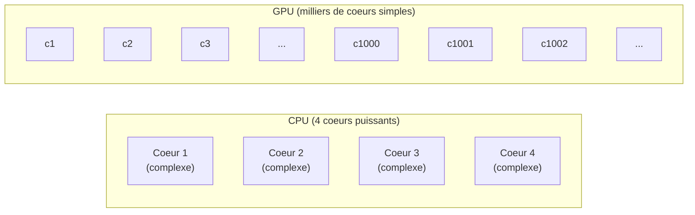
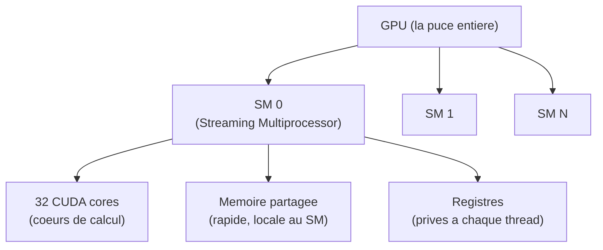
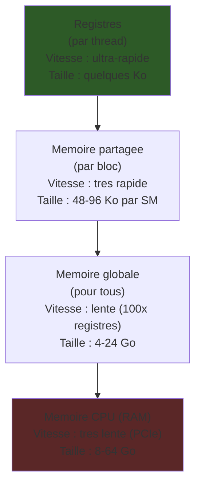
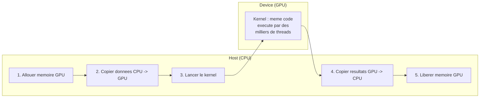
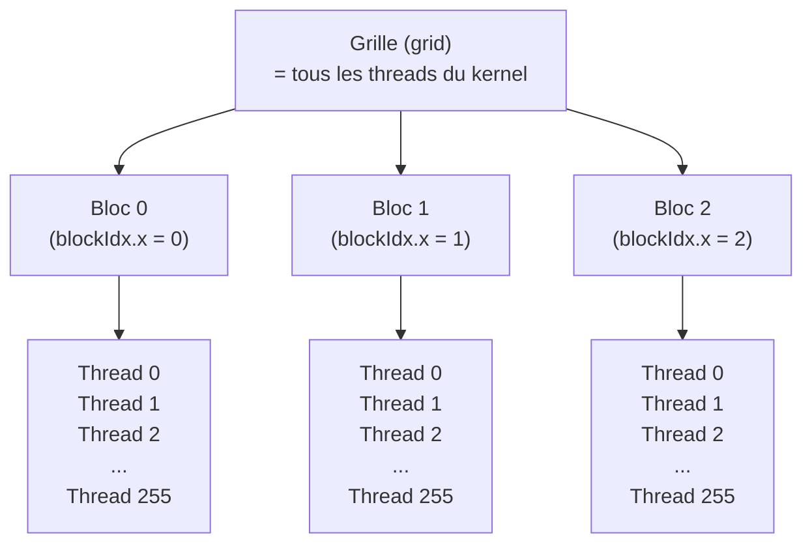
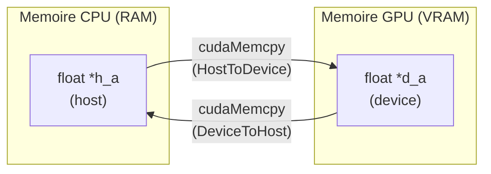
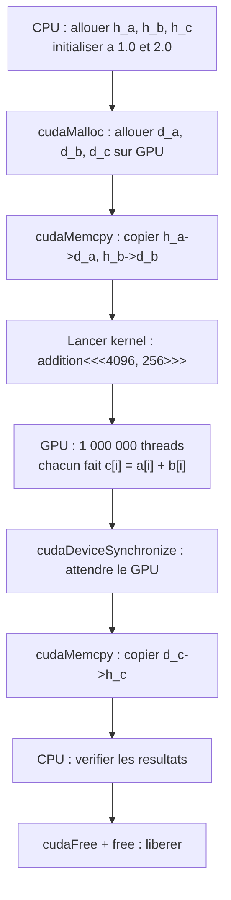
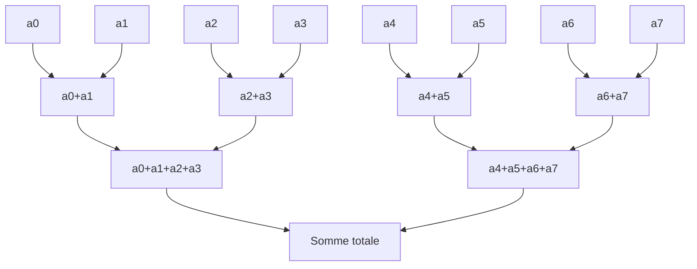
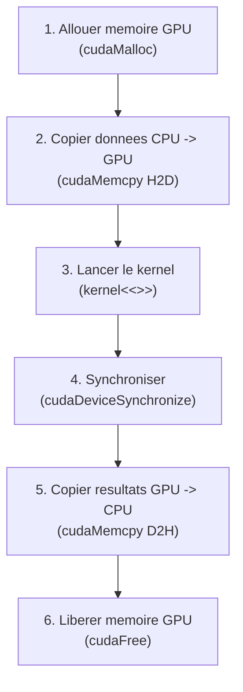

# Chapitre 5 -- GPU et CUDA

> **Idee centrale en une phrase :** Un GPU possede des milliers de petits coeurs qui executent le meme calcul sur des donnees differentes -- c'est ideal pour les problemes massivement paralleles.

**Prerequis :** [Introduction au parallelisme](01_intro_parallelisme.md)
**Chapitre precedent :** [MPI](04_mpi.md)

---

## 1. L'analogie de l'usine vs l'artisan

### CPU vs GPU

Un **CPU** (Central Processing Unit), c'est comme un **artisan tres qualifie** : il a quelques bras (4-16 coeurs) mais chacun est tres habile. Il peut faire des taches complexes et variees, prendre des decisions rapidement.

Un **GPU** (Graphics Processing Unit), c'est comme une **usine avec des milliers d'ouvriers** : chaque ouvrier est moins qualifie (coeur plus simple), mais ils sont tellement nombreux qu'ils abattent un travail enorme quand la tache est repetitive.

| Aspect | CPU | GPU |
|--------|-----|-----|
| Nombre de coeurs | 4-16 (puissants) | 1000-10000 (simples) |
| Type de tache | Taches complexes, variees | Tache simple, repetee des milliers de fois |
| Latence | Tres faible (rapide pour 1 tache) | Elevee (lent pour 1 tache) |
| Debit | Faible (peu de taches en parallele) | Enorme (milliers de taches en parallele) |
| Memoire | Grande RAM (8-64 Go) | RAM plus petite mais tres rapide (4-24 Go) |
| Analogie | Artisan qualifie | Usine avec 1000 ouvriers |

### Schema comparatif



---

## 2. Architecture du GPU NVIDIA

### 2.1 Hierarchie du materiel

Un GPU NVIDIA est organise en niveaux :



| Composant | Nombre typique | Role |
|-----------|----------------|------|
| **SM** (Streaming Multiprocessor) | 10-80 par GPU | Unite de calcul autonome |
| **CUDA cores** | 32-128 par SM | Executent les operations arithmetiques |
| **Warp** | 32 threads | Groupe de threads executes en meme temps (SIMD) |
| **Registres** | Prives a chaque thread | Memoire ultra-rapide |
| **Memoire partagee** | Partagee au sein d'un SM | Cache programmable, rapide |
| **Memoire globale** | Accessible par tous | La VRAM du GPU (lente mais grande) |

### 2.2 Hierarchie de la memoire



> **Regle d'or :** Plus la memoire est proche du coeur de calcul, plus elle est rapide mais petite. L'objectif est de maximiser l'utilisation des registres et de la memoire partagee, et de minimiser les acces a la memoire globale.

---

## 3. Le modele de programmation CUDA

### 3.1 Le principe

CUDA (Compute Unified Device Architecture) est le modele de programmation de NVIDIA. Le programme s'execute en deux parties :

1. **Code host (CPU)** : gere la memoire, lance les calculs sur le GPU, recupere les resultats.
2. **Code device (GPU)** : execute les calculs en parallele (appele **kernel**).



### 3.2 Qu'est-ce qu'un kernel ?

Un **kernel** est une fonction executee par chaque thread du GPU. On ecrit le code pour **un seul thread**, et CUDA le lance des milliers de fois en parallele.

```c
/* __global__ signifie : c'est un kernel (appele depuis le CPU, execute sur le GPU) */
__global__ void additionner(float *a, float *b, float *c, int n)
{
    /* Chaque thread calcule son index global */
    int i = blockIdx.x * blockDim.x + threadIdx.x;

    if (i < n) {       /* Verifier qu'on ne depasse pas le tableau */
        c[i] = a[i] + b[i];
    }
}
```

### 3.3 Qualificateurs de fonction

| Qualificateur | Appele depuis | Execute sur | Exemple |
|---------------|---------------|-------------|---------|
| `__global__` | CPU (host) | GPU (device) | Kernel principal |
| `__device__` | GPU | GPU | Fonction utilitaire appelee par le kernel |
| `__host__` | CPU | CPU | Fonction normale (defaut si rien n'est specifie) |

---

## 4. Grille, blocs et threads

### 4.1 La hierarchie d'execution

Quand on lance un kernel, on specifie combien de threads on veut, organises en une **grille** de **blocs** :



| Concept | Description | Variable CUDA |
|---------|-------------|---------------|
| **Grid** (grille) | Ensemble de tous les blocs | `gridDim.x` = nombre de blocs |
| **Block** (bloc) | Groupe de threads (max 1024) | `blockDim.x` = threads par bloc |
| **Thread** | Unite d'execution elementaire | `threadIdx.x` = index dans le bloc |
| **Index global** | Position unique du thread | `blockIdx.x * blockDim.x + threadIdx.x` |

### 4.2 Syntaxe de lancement

```c
/* Lancer le kernel avec nb_blocs blocs de taille_bloc threads chacun */
mon_kernel<<<nb_blocs, taille_bloc>>>(arguments);

/* Exemple : 1024 elements, blocs de 256 threads */
int N = 1024;
int taille_bloc = 256;
int nb_blocs = (N + taille_bloc - 1) / taille_bloc;  /* = ceil(N / taille_bloc) */

additionner<<<nb_blocs, taille_bloc>>>(d_a, d_b, d_c, N);
```

### 4.3 Calcul de l'index global

C'est la formule la plus importante en CUDA :

```c
int i = blockIdx.x * blockDim.x + threadIdx.x;
```

**Exemple avec 3 blocs de 4 threads :**

```
Bloc 0 (blockIdx.x = 0):  threads 0, 1, 2, 3   -> i = 0*4+0, 0*4+1, 0*4+2, 0*4+3 = 0, 1, 2, 3
Bloc 1 (blockIdx.x = 1):  threads 0, 1, 2, 3   -> i = 1*4+0, 1*4+1, 1*4+2, 1*4+3 = 4, 5, 6, 7
Bloc 2 (blockIdx.x = 2):  threads 0, 1, 2, 3   -> i = 2*4+0, 2*4+1, 2*4+2, 2*4+3 = 8, 9, 10, 11
```

### 4.4 Dimensions 2D et 3D

Les grilles et blocs peuvent etre 2D ou 3D, utile pour les matrices et les volumes :

```c
/* Bloc 2D */
dim3 taille_bloc(16, 16);     /* 16x16 = 256 threads par bloc */
dim3 nb_blocs((largeur + 15) / 16, (hauteur + 15) / 16);

mon_kernel<<<nb_blocs, taille_bloc>>>(args);

/* Dans le kernel */
__global__ void mon_kernel(...)
{
    int col = blockIdx.x * blockDim.x + threadIdx.x;
    int lig = blockIdx.y * blockDim.y + threadIdx.y;

    if (col < largeur && lig < hauteur) {
        /* Traiter le pixel (lig, col) */
    }
}
```

---

## 5. Gestion de la memoire

### 5.1 Le CPU et le GPU ont des memoires separees

C'est le point crucial : le GPU **ne peut pas** acceder a la memoire du CPU directement (et inversement). Il faut **copier** les donnees explicitement.



### 5.2 Convention de nommage

Par convention, on prefixe les pointeurs avec `h_` (host/CPU) et `d_` (device/GPU) :

```c
float *h_a;    /* Pointeur CPU */
float *d_a;    /* Pointeur GPU */
```

### 5.3 API memoire

```c
/* Allouer de la memoire sur le GPU */
float *d_a;
cudaMalloc((void **)&d_a, N * sizeof(float));

/* Copier du CPU vers le GPU */
cudaMemcpy(d_a, h_a, N * sizeof(float), cudaMemcpyHostToDevice);

/* Copier du GPU vers le CPU */
cudaMemcpy(h_resultat, d_resultat, N * sizeof(float), cudaMemcpyDeviceToHost);

/* Liberer la memoire GPU */
cudaFree(d_a);
```

### 5.4 Tableau recapitulatif des fonctions memoire

| Fonction | Role |
|----------|------|
| `cudaMalloc(&ptr, taille)` | Allouer sur le GPU |
| `cudaFree(ptr)` | Liberer sur le GPU |
| `cudaMemcpy(dst, src, taille, direction)` | Copier entre CPU et GPU |
| `cudaMemset(ptr, valeur, taille)` | Initialiser la memoire GPU |

| Direction | Constante |
|-----------|-----------|
| CPU --> GPU | `cudaMemcpyHostToDevice` |
| GPU --> CPU | `cudaMemcpyDeviceToHost` |
| GPU --> GPU | `cudaMemcpyDeviceToDevice` |

---

## 6. Premier programme CUDA complet

Addition de deux vecteurs : chaque thread additionne un element.

```c
#include <stdio.h>
#include <stdlib.h>

/* --- Kernel GPU --- */
__global__ void addition_vecteurs(float *a, float *b, float *c, int n)
{
    int i = blockIdx.x * blockDim.x + threadIdx.x;
    if (i < n) {
        c[i] = a[i] + b[i];
    }
}

int main(void)
{
    int N = 1000000;
    size_t taille = N * sizeof(float);

    /* --- 1. Allouer et initialiser sur le CPU --- */
    float *h_a = (float *)malloc(taille);
    float *h_b = (float *)malloc(taille);
    float *h_c = (float *)malloc(taille);

    for (int i = 0; i < N; i++) {
        h_a[i] = 1.0f;
        h_b[i] = 2.0f;
    }

    /* --- 2. Allouer sur le GPU --- */
    float *d_a, *d_b, *d_c;
    cudaMalloc((void **)&d_a, taille);
    cudaMalloc((void **)&d_b, taille);
    cudaMalloc((void **)&d_c, taille);

    /* --- 3. Copier les donnees CPU -> GPU --- */
    cudaMemcpy(d_a, h_a, taille, cudaMemcpyHostToDevice);
    cudaMemcpy(d_b, h_b, taille, cudaMemcpyHostToDevice);

    /* --- 4. Lancer le kernel --- */
    int taille_bloc = 256;
    int nb_blocs = (N + taille_bloc - 1) / taille_bloc;

    addition_vecteurs<<<nb_blocs, taille_bloc>>>(d_a, d_b, d_c, N);

    /* Attendre que le GPU ait fini */
    cudaDeviceSynchronize();

    /* --- 5. Copier les resultats GPU -> CPU --- */
    cudaMemcpy(h_c, d_c, taille, cudaMemcpyDeviceToHost);

    /* --- 6. Verifier --- */
    int erreurs = 0;
    for (int i = 0; i < N; i++) {
        if (h_c[i] != 3.0f) erreurs++;
    }
    printf("Verification : %d erreurs sur %d elements\n", erreurs, N);

    /* --- 7. Liberer la memoire --- */
    cudaFree(d_a);
    cudaFree(d_b);
    cudaFree(d_c);
    free(h_a);
    free(h_b);
    free(h_c);

    return 0;
}
```

### Compilation et execution

```bash
nvcc addition_vecteurs.cu -o addition_vecteurs
./addition_vecteurs
```

### Sortie

```
Verification : 0 erreurs sur 1000000 elements
```

### Schema d'execution



---

## 7. La memoire partagee (`__shared__`)

### 7.1 Pourquoi ?

La memoire globale est **lente** (400-600 cycles de latence). Si plusieurs threads du meme bloc accedent aux memes donnees, on peut les charger une fois dans la **memoire partagee** (rapide, ~5 cycles) et les reutiliser.

### 7.2 Declaration

```c
__global__ void mon_kernel(float *donnees, int n)
{
    /* Memoire partagee : visible par tous les threads du MEME bloc */
    __shared__ float cache[256];

    int i = blockIdx.x * blockDim.x + threadIdx.x;
    int tid = threadIdx.x;    /* Index local dans le bloc */

    /* Charger de la memoire globale vers la memoire partagee */
    if (i < n) {
        cache[tid] = donnees[i];
    }

    /* SYNCHRONISER : attendre que tous les threads du bloc aient fini de charger */
    __syncthreads();

    /* Maintenant on peut utiliser cache[] en toute securite */
    /* ... calculs utilisant cache[] ... */
}
```

### 7.3 `__syncthreads()` -- La barriere intra-bloc

`__syncthreads()` est une **barriere de synchronisation** : tous les threads du bloc attendent que tout le monde ait atteint ce point. C'est indispensable quand on lit des donnees ecrites par d'autres threads du bloc.

> **Attention :** `__syncthreads()` ne synchronise que les threads du **meme bloc**. Pour synchroniser entre blocs, il faut finir le kernel et en relancer un autre.

---

## 8. Reduction sur GPU

La reduction (sommer tous les elements d'un tableau) est un exercice classique en CUDA car elle necessite de la cooperation entre threads.

### 8.1 Schema de la reduction par arbre

```
Etape 1:  [a0+a1]  [a2+a3]  [a4+a5]  [a6+a7]     (N/2 additions)
Etape 2:  [s01+s23]         [s45+s67]               (N/4 additions)
Etape 3:  [s0123+s4567]                             (N/8 additions)
Resultat:  somme totale
```



### 8.2 Kernel de reduction

```c
__global__ void reduction_somme(float *entree, float *sortie, int n)
{
    __shared__ float cache[256];

    int tid = threadIdx.x;
    int i = blockIdx.x * blockDim.x + threadIdx.x;

    /* Charger dans la memoire partagee */
    cache[tid] = (i < n) ? entree[i] : 0.0f;
    __syncthreads();

    /* Reduction par arbre dans le bloc */
    for (int stride = blockDim.x / 2; stride > 0; stride /= 2) {
        if (tid < stride) {
            cache[tid] += cache[tid + stride];
        }
        __syncthreads();   /* Attendre que toutes les additions soient faites */
    }

    /* Le thread 0 de chaque bloc ecrit la somme partielle */
    if (tid == 0) {
        sortie[blockIdx.x] = cache[0];
    }
}
```

> **Note :** Ce kernel donne un resultat partiel par bloc. Pour obtenir la somme totale, on relance le kernel sur les sommes partielles (ou on finit la reduction sur le CPU).

---

## 9. Gestion des erreurs

```c
/* Verifier chaque appel CUDA */
cudaError_t err = cudaMalloc(&d_a, taille);
if (err != cudaSuccess) {
    fprintf(stderr, "Erreur cudaMalloc : %s\n", cudaGetErrorString(err));
    exit(EXIT_FAILURE);
}

/* Verifier les erreurs du kernel (qui est asynchrone) */
mon_kernel<<<blocs, threads>>>(args);
err = cudaGetLastError();
if (err != cudaSuccess) {
    fprintf(stderr, "Erreur kernel : %s\n", cudaGetErrorString(err));
}
cudaDeviceSynchronize();  /* Attendre et capturer les erreurs d'execution */
```

### Macro pratique

```c
#define CUDA_CHECK(appel) do { \
    cudaError_t err = appel; \
    if (err != cudaSuccess) { \
        fprintf(stderr, "Erreur CUDA ligne %d : %s\n", \
                __LINE__, cudaGetErrorString(err)); \
        exit(EXIT_FAILURE); \
    } \
} while(0)

/* Utilisation */
CUDA_CHECK(cudaMalloc(&d_a, taille));
CUDA_CHECK(cudaMemcpy(d_a, h_a, taille, cudaMemcpyHostToDevice));
```

---

## 10. Mesurer le temps sur GPU

On utilise des **events CUDA** pour mesurer avec precision :

```c
cudaEvent_t debut, fin;
cudaEventCreate(&debut);
cudaEventCreate(&fin);

cudaEventRecord(debut);       /* Marquer le debut */
mon_kernel<<<blocs, threads>>>(args);
cudaEventRecord(fin);         /* Marquer la fin */

cudaEventSynchronize(fin);    /* Attendre que fin soit atteint */

float temps_ms;
cudaEventElapsedTime(&temps_ms, debut, fin);
printf("Temps kernel : %.3f ms\n", temps_ms);

cudaEventDestroy(debut);
cudaEventDestroy(fin);
```

> **Attention :** N'utilise pas `clock()` ou `gettimeofday()` pour mesurer le temps GPU -- le kernel est **asynchrone**, ces fonctions mesureraient seulement le temps de lancement (quasi instantane).

---

## 11. Bonnes pratiques et optimisation

### 11.1 Choisir la taille des blocs

| Taille | Commentaire |
|--------|-------------|
| 32 | Minimum (1 warp). Peu d'occupation du SM |
| 128 | Bon compromis pour la plupart des cas |
| 256 | Le plus courant. Bon ratio occupation/registres |
| 512 | Peut limiter l'occupation si le kernel utilise beaucoup de registres |
| 1024 | Maximum. Rarement optimal |

**Regle pratique :** Commence avec **256** threads par bloc.

### 11.2 Maximiser l'occupation

L'**occupation** (occupancy) mesure le ratio de warps actifs par rapport au maximum du SM. Plus l'occupation est elevee, mieux le GPU masque la latence memoire.

### 11.3 Acces memoire coalescents

Quand les 32 threads d'un warp accedent a des adresses **consecutives** en memoire, le GPU combine les acces en une seule transaction. C'est un **acces coalescent**.

```c
/* BON : acces coalescent (threads consecutifs -> adresses consecutives) */
float val = tableau[threadIdx.x];    /* Thread 0 -> [0], Thread 1 -> [1], ... */

/* MAUVAIS : acces non-coalescent (stride) */
float val = tableau[threadIdx.x * 32];  /* Thread 0 -> [0], Thread 1 -> [32], ... */
```

### 11.4 Minimiser les transferts CPU-GPU

Le bus PCIe est un goulot d'etranglement. Strategies :

1. **Regrouper les transferts** : un gros transfert est plus efficace que plein de petits.
2. **Garder les donnees sur le GPU** : si tu enchaines plusieurs kernels, ne copie pas les resultats intermediaires vers le CPU.
3. **Utiliser des transferts asynchrones** (`cudaMemcpyAsync`) pour recouvrir transfert et calcul.

---

## 12. Pieges classiques

### Piege 1 : Oublier le `if (i < n)` dans le kernel

Le nombre de threads est souvent un multiple de la taille du bloc, donc plus grand que le nombre d'elements. Sans la garde `if (i < n)`, des threads accedent hors des limites du tableau.

```c
__global__ void kernel(float *tab, int n)
{
    int i = blockIdx.x * blockDim.x + threadIdx.x;
    /* SANS GARDE : buffer overflow si i >= n */
    tab[i] = tab[i] * 2;    /* DANGER ! */

    /* AVEC GARDE : correct */
    if (i < n) {
        tab[i] = tab[i] * 2;
    }
}
```

### Piege 2 : Oublier `cudaDeviceSynchronize`

Le lancement d'un kernel est **asynchrone** : le CPU continue immediatement. Si tu copies les resultats avant que le kernel ait fini, tu obtiens des donnees incorrectes.

```c
kernel<<<blocs, threads>>>(d_a, n);
/* Le kernel n'est peut-etre pas fini ici ! */
cudaMemcpy(h_a, d_a, taille, cudaMemcpyDeviceToHost);
/* cudaMemcpy est synchrone : il attend implicitement le kernel. OK dans ce cas. */

/* Mais si tu utilises le resultat sans copie : */
kernel<<<blocs, threads>>>(d_a, n);
/* Faire quelque chose qui suppose que le kernel est fini -> BUG ! */
cudaDeviceSynchronize();   /* Attendre explicitement */
```

### Piege 3 : Allouer trop de memoire partagee

La memoire partagee est limitee (~48 Ko par bloc). Si tu declares un tableau trop grand, le kernel ne se lance pas.

```c
/* MAUVAIS : 100000 * 4 = 400 Ko >> 48 Ko */
__shared__ float cache[100000];    /* Trop grand ! */

/* BON : rester sous 48 Ko / sizeof(float) = 12288 */
__shared__ float cache[256];       /* 1 Ko, largement OK */
```

### Piege 4 : Oublier `__syncthreads` avec la memoire partagee

Si un thread lit dans `__shared__` avant qu'un autre thread ait fini d'ecrire, le resultat est indefini.

### Piege 5 : Confondre memoire CPU et GPU

```c
float *d_a;
cudaMalloc(&d_a, taille);
d_a[0] = 42.0f;    /* CRASH ! d_a est un pointeur GPU, pas accessible depuis le CPU */
```

---

## 13. Recapitulatif

| Concept | A retenir |
|---------|-----------|
| **GPU** | Des milliers de coeurs simples, ideal pour le parallelisme massif |
| **Kernel** | Fonction executee par chaque thread GPU (`__global__`) |
| **Grille / Bloc / Thread** | Hierarchie d'organisation : grid > block > thread |
| **Index global** | `blockIdx.x * blockDim.x + threadIdx.x` |
| **<<<blocs, threads>>>** | Syntaxe de lancement du kernel |
| **cudaMalloc / cudaFree** | Allouer / liberer la memoire GPU |
| **cudaMemcpy** | Copier entre CPU et GPU (et inversement) |
| **__shared__** | Memoire rapide partagee au sein d'un bloc |
| **__syncthreads()** | Barriere de synchronisation intra-bloc |
| **Warp** | 32 threads executes ensemble (SIMD) |
| **Acces coalescent** | Threads consecutifs -> adresses consecutives = rapide |
| **Compilation** | `nvcc fichier.cu -o sortie` |

### Le schema mental d'un programme CUDA



> **Le message essentiel :** Le GPU est un accelerateur specialise : il excelle quand on lui donne des milliers de taches identiques et independantes. La difficulte est de gerer les transferts memoire (CPU<->GPU) et d'optimiser les acces memoire sur le GPU. Le schema de programmation est toujours le meme : allouer, copier, calculer, copier, liberer.
