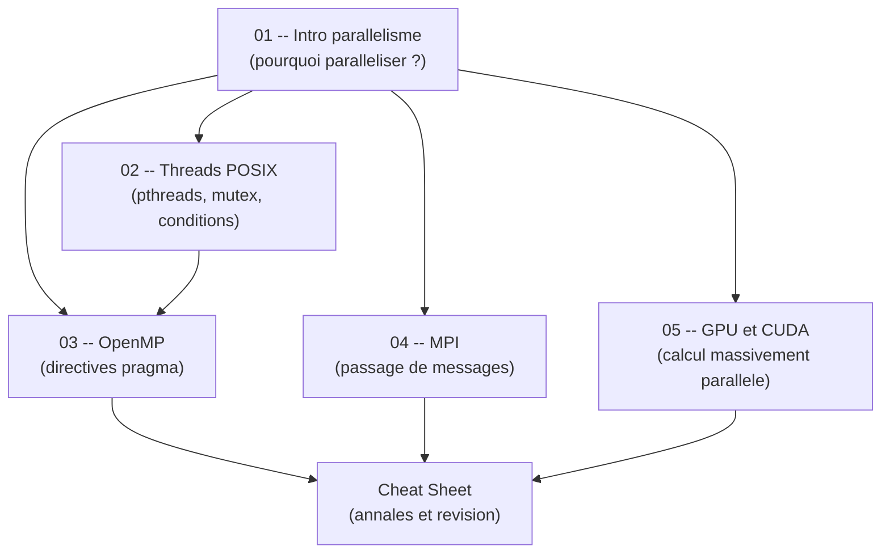

# Guide -- Parallelisme (S6)

Bienvenue dans ce guide de programmation parallele, concu pour etre accessible meme si tu n'as jamais ecrit une ligne de code parallele. L'objectif est simple : te permettre de comprendre les concepts fondamentaux du parallelisme -- des architectures materielles jusqu'au calcul GPU -- etape par etape, avec des explications claires, des analogies concretes et du code C que tu peux compiler et executer immediatement. Chaque chapitre est **autonome** -- tu peux les lire dans l'ordre ou sauter directement a celui qui t'interesse sans etre perdu.

Ce guide couvre les quatre grands paradigmes de programmation parallele enseignes en 3A INFO a l'INSA Rennes : les threads POSIX, OpenMP, MPI et CUDA. Que tu prepares un TP, un DS ou que tu veuilles simplement comprendre comment ton processeur multi-coeurs fonctionne, tu es au bon endroit.

---

## Roadmap d'apprentissage

Voici l'ordre recommande pour progresser efficacement. Chaque etape s'appuie sur les precedentes, mais tu peux toujours revenir en arriere si un concept te manque.



> **Lecture du diagramme :** Le chapitre 01 (Introduction) est le socle commun -- tout part de la. Ensuite, deux chemins de memoire partagee se dessinent : les Threads POSIX (02) puis OpenMP (03), qui est une couche d'abstraction au-dessus des threads. MPI (04) est le chemin de la memoire distribuee (plusieurs machines). GPU/CUDA (05) est le calcul massivement parallele. La cheat sheet synthetise tout pour les revisions.

---

## Prerequis

Pour suivre ce guide, tu as besoin de :

- **Savoir programmer en C** -- variables, fonctions, pointeurs, allocation dynamique (`malloc`/`free`). Si `int *p = malloc(10 * sizeof(int));` ne te fait pas peur, tu as le niveau.
- **Connaitre les bases de Linux** -- ouvrir un terminal, compiler avec `gcc`, executer un programme. On compilera beaucoup en ligne de commande.
- **Comprendre les pointeurs et la memoire** -- la programmation parallele manipule beaucoup la memoire partagee. Si tu sais ce qu'est un `segfault`, tu es pret.

Si tu sais ecrire un programme C qui alloue un tableau, le remplit dans une boucle et l'affiche, tu as tout ce qu'il faut pour commencer.

---

## Comment utiliser ce guide

1. **Lis dans l'ordre** pour une progression naturelle, ou **saute directement** au chapitre qui t'interesse -- chaque fichier est autonome et complet.
2. **Compile et execute le code C** en parallele dans ton terminal. Le parallelisme s'apprend en pratiquant, pas en lisant passivement. Observe les sorties, change le nombre de threads, provoque des bugs.
3. **Les diagrammes Mermaid** sont rendus automatiquement sur GitHub et dans Obsidian. Si tu lis les fichiers dans un autre editeur, installe une extension Mermaid pour en profiter.
4. **Ne memorise pas les API** -- comprends d'abord l'intuition derriere chaque mecanisme, le reste viendra naturellement. Les signatures de fonctions, tu les retrouveras dans le `man` ou la cheat sheet.

---

## Table des matieres

| # | Chapitre | Description |
|---|----------|-------------|
| 01 | [Introduction au parallelisme](01_intro_parallelisme.md) | Pourquoi paralleliser, architectures materielles, taxonomie de Flynn, loi d'Amdahl, speedup et efficacite. |
| 02 | [Threads POSIX](02_threads_posix.md) | `pthread_create`, `pthread_join`, mutex, variables de condition, patron producteur-consommateur. |
| 03 | [OpenMP](03_openmp.md) | `#pragma omp parallel`, `for`, `sections`, `critical`, `atomic`, `reduction`, politiques de `schedule`. |
| 04 | [MPI](04_mpi.md) | `MPI_Init`, `MPI_Send`/`MPI_Recv`, `MPI_Bcast`, `MPI_Scatter`, `MPI_Gather`, `MPI_Reduce`. |
| 05 | [GPU et CUDA](05_gpu_cuda.md) | Architecture GPU, kernels CUDA, grille/blocs/threads, memoire globale/partagee/registres. |
| -- | [Cheat Sheet](cheat_sheet.md) | Analyse des annales, patterns d'examen, questions types, aide-memoire des fonctions cles. |

---

## Structure d'un chapitre

Chaque chapitre suit la meme progression pour t'aider a construire ta comprehension pas a pas :

| Etape | Ce que tu y trouves |
|-------|---------------------|
| **Analogie** | Une situation de la vie courante pour ancrer le concept avant toute technique. |
| **Schema Mermaid** | Un diagramme pour visualiser l'idee avant les details. |
| **Explication progressive** | Le concept explique en partant du plus simple vers le plus precis. |
| **Code C commente** | Des exemples complets, commentes ligne par ligne, prets a compiler. |
| **Schemas d'execution** | Comment les threads ou processus interagissent concretement dans le temps. |
| **Pieges classiques** | Race conditions, deadlocks, erreurs de compilation -- et comment les eviter. |
| **Recapitulatif** | Un resume en quelques points pour reviser rapidement. |

> Cette structure est pensee pour que tu puisses toujours comprendre le *pourquoi* avant le *comment*. Si un concept te bloque, reviens a l'analogie -- elle contient l'essentiel.

---

## Compilation rapide

Voici les commandes de compilation pour chaque technologie abordee dans ce guide :

```bash
# OpenMP
gcc -fopenmp programme.c -o programme -lm

# Threads POSIX
gcc programme.c -o programme -lpthread

# MPI (necessite OpenMPI ou MPICH)
mpicc programme.c -o programme -lm

# CUDA (necessite le toolkit NVIDIA CUDA)
nvcc programme.cu -o programme
```

### Execution

```bash
# OpenMP -- controler le nombre de threads
export OMP_NUM_THREADS=4
./programme

# MPI -- lancer avec plusieurs processus
mpiexec -n 4 ./programme

# CUDA -- executer directement
./programme
```

---

## Metriques de performance (apercu)

Ces formules reviennent dans **tous** les chapitres. Pas besoin de les retenir maintenant, elles seront expliquees en detail dans le chapitre 01.

| Metrique | Formule | Signification |
|----------|---------|---------------|
| Speedup | `S(p) = T(1) / T(p)` | Combien de fois plus rapide avec `p` processeurs |
| Efficacite | `E(p) = S(p) / p` | Pourcentage d'utilisation effective des ressources |
| Amdahl | `S_max = 1 / ((1-f) + f/p)` | Limite theorique (f = fraction parallelisable) |

---

## Ressources externes

- **OpenMP** : <https://www.openmp.org/specifications/>
- **MPI** : <https://www.mpi-forum.org/docs/>
- **CUDA** : <https://docs.nvidia.com/cuda/>
- **Pthreads** : `man pthread_create` (ou <https://man7.org/linux/man-pages/man3/pthread_create.3.html>)
- **Cluster INSA** : `ssh cluster-infomath-tete.educ.insa-rennes.fr`
