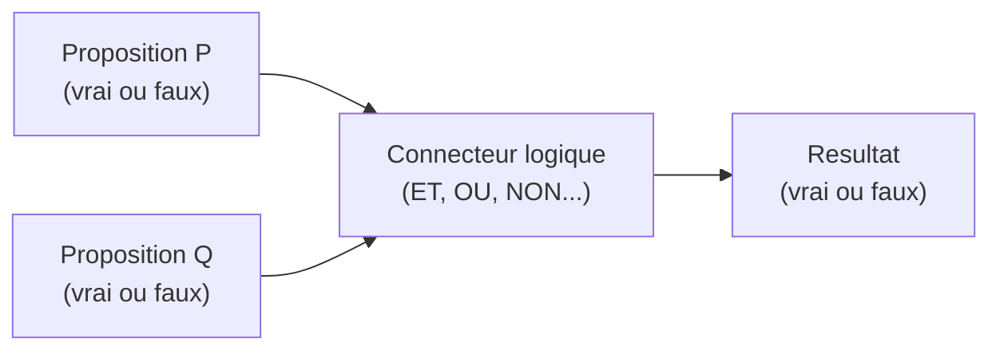
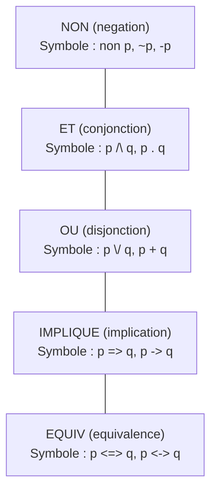
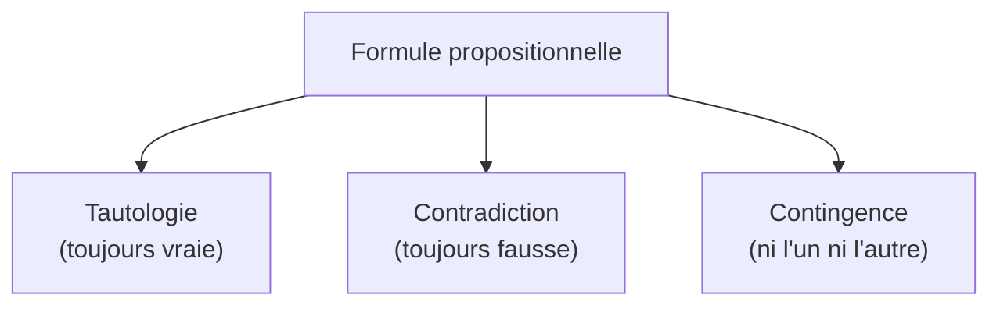
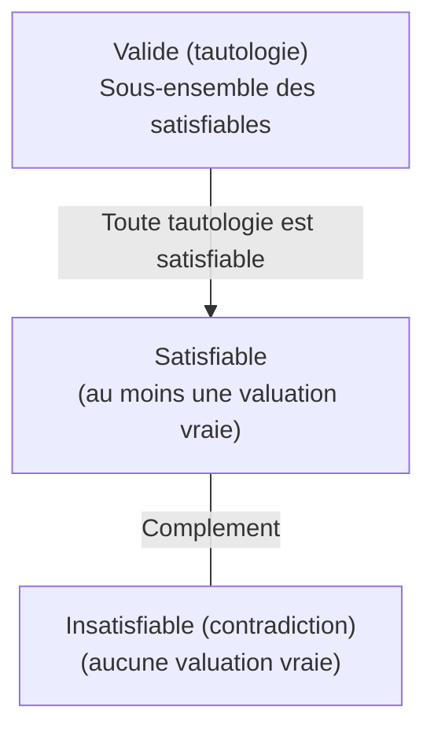

# Chapitre 1 -- Calcul propositionnel

> **Idee centrale en une phrase :** Le calcul propositionnel permet de raisonner sur des phrases qui sont soit vraies, soit fausses, en les combinant avec des connecteurs logiques (ET, OU, NON...).

**Prerequis :** Aucun
**Chapitre suivant :** [Formes normales ->](02_formes_normales.md)

---

## 1. L'analogie de l'interrupteur

### Des interrupteurs a la logique

Imagine un circuit electrique avec des interrupteurs. Chaque interrupteur est soit **allume** (vrai, note 1) soit **eteint** (faux, note 0). Tu ne peux pas avoir un interrupteur "a moitie allume" -- c'est l'un ou l'autre.

Maintenant, imagine que tu relies deux interrupteurs :
- **En serie** (les deux doivent etre allumes pour que le courant passe) : c'est le **ET** logique.
- **En parallele** (il suffit qu'un seul soit allume) : c'est le **OU** logique.
- **Avec un inverseur** (si allume devient eteint et vice versa) : c'est le **NON** logique.

Le calcul propositionnel, c'est exactement ca : on manipule des "interrupteurs" (propositions) avec des "connexions" (connecteurs logiques) pour determiner si le resultat final est vrai ou faux.

### Schema du principe



**Lecture du schema :** Deux propositions P et Q passent par un connecteur logique, qui produit un resultat vrai ou faux.

---

## 2. Vocabulaire fondamental

### Qu'est-ce qu'une proposition ?

Une **proposition** (ou **variable propositionnelle**) est un enonce qui est soit **vrai** (V, 1, T) soit **faux** (F, 0, F). Pas d'entre-deux.

| Enonce | Proposition ? | Pourquoi |
|--------|---------------|----------|
| "La Terre est ronde" | Oui | C'est vrai ou faux (ici, vrai) |
| "2 + 2 = 5" | Oui | C'est vrai ou faux (ici, faux) |
| "Quelle heure est-il ?" | Non | C'est une question, pas un enonce vrai/faux |
| "Ferme la porte" | Non | C'est un ordre, pas un enonce vrai/faux |
| "x > 3" | Non | Ca depend de x, ce n'est pas fixe (ca deviendra une proposition dans le calcul des predicats) |

### Variables propositionnelles

On note les propositions par des lettres : **p, q, r, s...** (ou parfois P, Q, R, S).

Chaque variable peut prendre la valeur **V** (vrai) ou **F** (faux). On appelle cette attribution une **valuation** (ou **interpretation**).

### Formules propositionnelles

Une **formule** est une expression construite a partir de :
- **Variables propositionnelles** : p, q, r...
- **Connecteurs logiques** : NON, ET, OU, IMPLIQUE, EQUIV
- **Parentheses** : pour grouper

Exemples de formules : `p ET q`, `NON(p OU q)`, `(p IMPLIQUE q) ET r`

---

## 3. Les cinq connecteurs logiques

Voici les cinq connecteurs fondamentaux, du plus simple au plus subtil.

### Vue d'ensemble



### 3.1. La negation : NON

**Symboles courants :** non p, ~p, -p, p barre

**Idee :** "Le contraire." Si p est vrai, NON p est faux. Si p est faux, NON p est vrai.

**Table de verite :**

| p | NON p |
|---|-------|
| V | F |
| F | V |

**Exemple concret :**
- p = "Il pleut" (vrai)
- NON p = "Il ne pleut pas" (faux)

### 3.2. La conjonction : ET

**Symboles courants :** p ET q, p /\ q, p . q, p & q

**Idee :** "Les deux en meme temps." Le resultat est vrai **uniquement** si les deux propositions sont vraies.

**Table de verite :**

| p | q | p ET q |
|---|---|--------|
| V | V | V |
| V | F | F |
| F | V | F |
| F | F | F |

**Moyen mnemotechnique :** Pour le ET, il faut que TOUT soit vrai. Un seul faux suffit a rendre le tout faux.

**Exemple concret :**
- p = "J'ai mon parapluie" (vrai)
- q = "Il pleut" (faux)
- p ET q = "J'ai mon parapluie ET il pleut" (faux -- car q est faux)

### 3.3. La disjonction : OU

**Symboles courants :** p OU q, p \/ q, p + q, p | q

**Idee :** "Au moins un des deux." Le resultat est vrai des qu'**au moins une** des deux propositions est vraie.

**ATTENTION :** C'est un OU **inclusif** (pas comme dans la vie courante ou "fromage ou dessert" signifie "l'un mais pas l'autre").

**Table de verite :**

| p | q | p OU q |
|---|---|--------|
| V | V | V |
| V | F | V |
| F | V | V |
| F | F | F |

**Moyen mnemotechnique :** Pour le OU, il suffit d'UN SEUL vrai. Les deux faux rendent le tout faux.

**Exemple concret :**
- p = "J'ai mon parapluie" (vrai)
- q = "Il fait beau" (vrai)
- p OU q = "J'ai mon parapluie OU il fait beau" (vrai -- et meme si les deux sont vrais !)

### 3.4. L'implication : IMPLIQUE

**Symboles courants :** p => q, p -> q, p IMPLIQUE q

**Idee :** "Si p, alors q." C'est la promesse : "Si je gagne au loto, je t'achete une voiture."

**Table de verite :**

| p | q | p => q |
|---|---|--------|
| V | V | V |
| V | F | **F** |
| F | V | V |
| F | F | V |

**C'est le connecteur le plus deroutant.** Detaillons chaque ligne :

1. **V => V = V** : "J'ai gagne au loto et je t'ai achete la voiture." Promesse tenue.
2. **V => F = F** : "J'ai gagne au loto MAIS je ne t'ai PAS achete la voiture." Promesse **violee** -- c'est le SEUL cas ou l'implication est fausse.
3. **F => V = V** : "Je n'ai pas gagne au loto, mais je t'ai quand meme achete la voiture." La promesse ne disait rien sur ce cas -- elle n'est pas violee.
4. **F => F = V** : "Je n'ai pas gagne au loto et je ne t'ai pas achete la voiture." Normal, la promesse n'est pas violee non plus.

> **Regle d'or :** L'implication n'est fausse que dans UN SEUL cas : quand la premisse est vraie et la conclusion est fausse (VRAI => FAUX = FAUX).

**Formule equivalente tres utile :**
```
p => q   est equivalent a   (NON p) OU q
```
C'est cette equivalence qu'on utilise le plus souvent pour simplifier.

### 3.5. L'equivalence : EQUIV

**Symboles courants :** p <=> q, p <-> q, p EQUIV q

**Idee :** "Si et seulement si." Les deux propositions ont la **meme** valeur de verite.

**Table de verite :**

| p | q | p <=> q |
|---|---|---------|
| V | V | V |
| V | F | F |
| F | V | F |
| F | F | V |

**Moyen mnemotechnique :** L'equivalence est vraie quand p et q ont la **meme** valeur (tous les deux vrais ou tous les deux faux).

**Formule equivalente :**
```
p <=> q   est equivalent a   (p => q) ET (q => p)
```

---

## 4. Priorite des connecteurs

Quand il n'y a pas de parentheses, on applique les connecteurs dans cet ordre (du plus prioritaire au moins prioritaire) :

| Priorite | Connecteur | Symbole |
|----------|------------|---------|
| 1 (plus fort) | NON | ~ |
| 2 | ET | /\ |
| 3 | OU | \/ |
| 4 | IMPLIQUE | => |
| 5 (plus faible) | EQUIV | <=> |

**Exemple :** `~p /\ q \/ r` se lit comme `((~p) /\ q) \/ r`

> **Conseil :** En cas de doute, mets des parentheses. C'est toujours plus clair et ca evite les erreurs.

---

## 5. Tables de verite : la methode pas a pas

### Principe

Une table de verite **enumere toutes les combinaisons possibles** de valeurs des variables et calcule le resultat de la formule pour chaque combinaison.

- Avec **n** variables, il y a **2^n** lignes.
- 2 variables : 4 lignes
- 3 variables : 8 lignes
- 4 variables : 16 lignes

### Methode pas a pas

**Etape 1 :** Identifier toutes les variables propositionnelles.

**Etape 2 :** Ecrire toutes les combinaisons de V/F (en binaire : VVV, VVF, VFV, VFF, FVV, FVF, FFV, FFF pour 3 variables).

**Etape 3 :** Calculer les sous-formules de l'interieur vers l'exterieur.

**Etape 4 :** Calculer la formule finale.

### Exemple resolu : `(p => q) /\ (q => r)`

**Etape 1 :** Variables : p, q, r (3 variables, donc 8 lignes).

**Etape 2 et 3 :** On calcule d'abord `p => q`, puis `q => r`, puis leur conjonction.

| p | q | r | p => q | q => r | (p => q) /\ (q => r) |
|---|---|---|--------|--------|----------------------|
| V | V | V | V | V | V |
| V | V | F | V | F | F |
| V | F | V | F | V | F |
| V | F | F | F | V | F |
| F | V | V | V | V | V |
| F | V | F | V | F | F |
| F | F | V | V | V | V |
| F | F | F | V | V | V |

**Verification colonne par colonne :**
- `p => q` : faux seulement quand p=V et q=F (lignes 3 et 4)
- `q => r` : faux seulement quand q=V et r=F (lignes 2 et 6)
- Le ET final : vrai seulement quand les deux sont vrais

### Exemple resolu : `~(p /\ q) <=> (~p \/ ~q)` (loi de De Morgan)

| p | q | p /\ q | ~(p /\ q) | ~p | ~q | ~p \/ ~q | ~(p /\ q) <=> (~p \/ ~q) |
|---|---|--------|-----------|----|----|----------|--------------------------|
| V | V | V | F | F | F | F | V |
| V | F | F | V | F | V | V | V |
| F | V | F | V | V | F | V | V |
| F | F | F | V | V | V | V | V |

**Resultat :** La colonne finale ne contient que des V. C'est une **tautologie** (voir section suivante).

---

## 6. Tautologies, contradictions, contingences

### Definitions



| Type | Definition | Exemple |
|------|-----------|---------|
| **Tautologie** | Vraie pour **toute** valuation | `p \/ ~p` (tiers exclu) |
| **Contradiction** | Fausse pour **toute** valuation | `p /\ ~p` |
| **Contingence** | Vraie pour certaines valuations, fausse pour d'autres | `p /\ q` |

### Comment reconnaitre une tautologie ?

1. **Methode exhaustive :** Construire la table de verite et verifier que la derniere colonne ne contient que des V.
2. **Methode par equivalences :** Simplifier la formule en utilisant les equivalences connues jusqu'a obtenir V (ou constante Vrai).

### Tautologies fondamentales a connaitre

| Nom | Formule |
|-----|---------|
| Tiers exclu | `p \/ ~p` |
| Non-contradiction | `~(p /\ ~p)` |
| Modus ponens | `(p /\ (p => q)) => q` |
| Modus tollens | `((p => q) /\ ~q) => ~p` |
| Syllogisme hypothetique | `((p => q) /\ (q => r)) => (p => r)` |
| Contraposee | `(p => q) <=> (~q => ~p)` |

---

## 7. Equivalences logiques fondamentales

Deux formules A et B sont **logiquement equivalentes** (notees A equiv B) si elles ont la **meme table de verite** (memes valeurs pour toute valuation).

### Les equivalences a connaitre absolument

**Lois de De Morgan :**
```
~(p /\ q)  equiv  (~p \/ ~q)
~(p \/ q)  equiv  (~p /\ ~q)
```
> **Moyen mnemotechnique :** La negation "casse" le connecteur (ET devient OU, OU devient ET) et "rentre" dans chaque terme.

**Double negation :**
```
~~p  equiv  p
```

**Commutativite :**
```
p /\ q  equiv  q /\ p
p \/ q  equiv  q \/ p
```

**Associativite :**
```
(p /\ q) /\ r  equiv  p /\ (q /\ r)
(p \/ q) \/ r  equiv  p \/ (q \/ r)
```

**Distributivite :**
```
p /\ (q \/ r)  equiv  (p /\ q) \/ (p /\ r)
p \/ (q /\ r)  equiv  (p \/ q) /\ (p \/ r)
```

**Idempotence :**
```
p /\ p  equiv  p
p \/ p  equiv  p
```

**Absorption :**
```
p /\ (p \/ q)  equiv  p
p \/ (p /\ q)  equiv  p
```

**Element neutre :**
```
p /\ V  equiv  p       p /\ F  equiv  F
p \/ V  equiv  V       p \/ F  equiv  p
```

**Complement :**
```
p /\ ~p  equiv  F
p \/ ~p  equiv  V
```

**Elimination de l'implication :**
```
p => q  equiv  ~p \/ q
```

**Elimination de l'equivalence :**
```
p <=> q  equiv  (p => q) /\ (q => p)
p <=> q  equiv  (p /\ q) \/ (~p /\ ~q)
```

**Contraposee :**
```
p => q  equiv  ~q => ~p
```

---

## 8. Satisfiabilite et validite

### Definitions

| Concept | Definition |
|---------|-----------|
| **Satisfiable** | Il **existe** au moins une valuation qui rend la formule vraie |
| **Valide** (tautologie) | **Toute** valuation rend la formule vraie |
| **Insatisfiable** (contradiction) | **Aucune** valuation ne rend la formule vraie |

### Relations entre les concepts



**Lien entre validite et insatisfiabilite :**
```
A est valide   <=>   ~A est insatisfiable
A est insatisfiable   <=>   ~A est valide
```

Ce lien est **fondamental** pour la methode de resolution (chapitre 03) : pour prouver que A est valide, on montre que ~A est insatisfiable.

---

## 9. Consequence logique

### Definition

On dit que B est une **consequence logique** de A1, A2, ..., An (note A1, A2, ..., An |= B) si :

> Toute valuation qui rend **toutes** les Ai vraies rend aussi B vraie.

Autrement dit : il est **impossible** que toutes les premisses soient vraies et la conclusion fausse.

### Lien avec la tautologie

```
A1, A2, ..., An |= B   <=>   (A1 /\ A2 /\ ... /\ An) => B est une tautologie
```

### Exemple resolu

Montrons que `p, p => q |= q` (modus ponens).

| p | q | p => q | p /\ (p => q) | (p /\ (p => q)) => q |
|---|---|--------|---------------|----------------------|
| V | V | V | V | V |
| V | F | F | F | V |
| F | V | V | F | V |
| F | F | V | F | V |

La derniere colonne ne contient que des V : c'est une tautologie, donc q est bien consequence logique de p et p => q.

---

## 10. Exemples supplementaires resolus

### Exemple 1 : Verifier si `(p => q) => (~q => ~p)` est une tautologie

C'est la contraposee. Construisons la table :

| p | q | p => q | ~q | ~p | ~q => ~p | (p => q) => (~q => ~p) |
|---|---|--------|----|----|----------|------------------------|
| V | V | V | F | F | V | V |
| V | F | F | V | F | F | V |
| F | V | V | F | V | V | V |
| F | F | V | V | V | V | V |

Que des V : c'est bien une **tautologie**.

### Exemple 2 : Simplifier `~(p => q)` avec les equivalences

```
~(p => q)
= ~(~p \/ q)           (elimination de l'implication)
= ~~p /\ ~q            (De Morgan)
= p /\ ~q              (double negation)
```

Resultat : `~(p => q) equiv p /\ ~q`

**Interpretation :** "L'implication est fausse" signifie "la premisse est vraie ET la conclusion est fausse." C'est coherent avec la table de verite de l'implication (seul cas faux : V => F).

### Exemple 3 : Simplifier `(p \/ q) /\ (p \/ ~q)`

```
(p \/ q) /\ (p \/ ~q)
= p \/ (q /\ ~q)       (distributivite de \/ sur /\)
= p \/ F               (complement : q /\ ~q = F)
= p                    (element neutre)
```

---

## 11. Pieges classiques

### Piege 1 : Confondre OU inclusif et OU exclusif

En logique, `p OU q` est **inclusif** : il est vrai meme si les deux sont vrais. Dans la vie courante, "fromage ou dessert" est souvent exclusif. Ne fais pas cette confusion en logique formelle.

Le OU exclusif (XOR) se definit comme : `p XOR q equiv (p \/ q) /\ ~(p /\ q)` ou encore `p XOR q equiv (p /\ ~q) \/ (~p /\ q)`.

### Piege 2 : L'implication quand la premisse est fausse

Beaucoup d'etudiants pensent que "F => F" devrait etre faux. Non : **l'implication n'est fausse que quand la premisse est vraie et la conclusion fausse** (V => F). Dans tous les autres cas, elle est vraie. Pense a la promesse du loto.

### Piege 3 : Oublier la priorite des connecteurs

`~p /\ q` signifie `(~p) /\ q` et **PAS** `~(p /\ q)`. Le NON ne porte que sur le terme qui le suit immediatement. En cas de doute, mets des parentheses.

### Piege 4 : Confondre equivalence et implication

`p <=> q` n'est PAS la meme chose que `p => q`. L'equivalence exige que l'implication marche dans **les deux sens**.

### Piege 5 : Se tromper dans De Morgan

La negation **inverse** le connecteur : ET devient OU, OU devient ET. Un piege frequent est d'oublier d'inverser le connecteur ou d'oublier de nier chaque terme.

```
~(p /\ q) = ~p \/ ~q   (ET devient OU)
~(p \/ q) = ~p /\ ~q   (OU devient ET)
```

---

## 12. Recapitulatif

- Une **proposition** est un enonce vrai ou faux.
- Les **cinq connecteurs** : NON (~), ET (/\), OU (\/), IMPLIQUE (=>), EQUIV (<=>).
- L'**implication** n'est fausse que dans un cas : VRAI => FAUX.
- L'**equivalence** est vraie quand les deux cotes ont la meme valeur.
- Une **tautologie** est vraie pour toute valuation ; une **contradiction** est toujours fausse.
- Les **equivalences logiques** (De Morgan, distributivite, absorption...) permettent de simplifier les formules.
- La **consequence logique** `A1, ..., An |= B` signifie que la verite des premisses entraine celle de la conclusion.
- Pour **verifier une tautologie** : table de verite complete ou simplification par equivalences.
- **Piege principal :** l'implication quand la premisse est fausse est toujours vraie.
