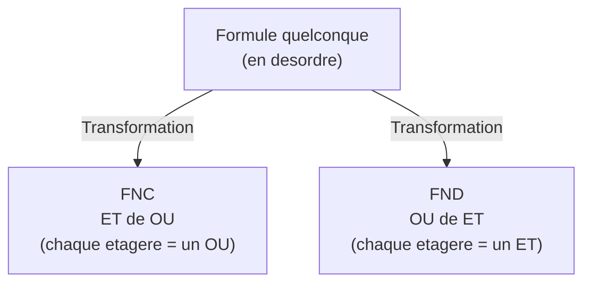
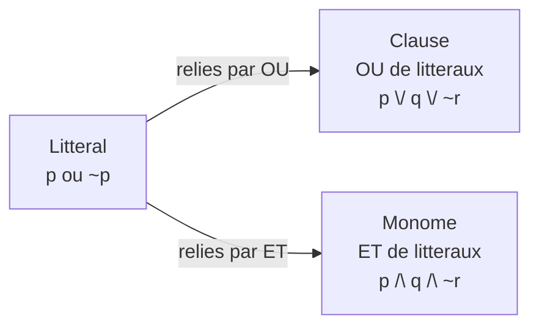
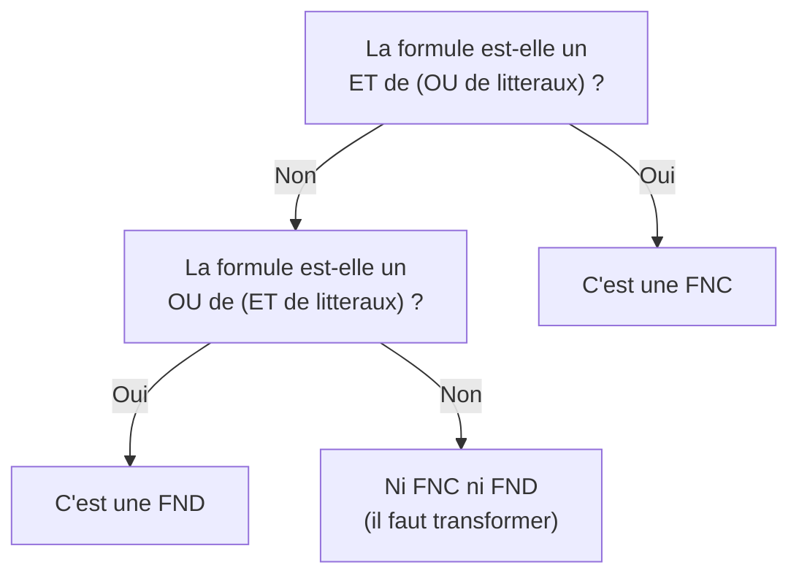

# Chapitre 2 -- Formes normales (FNC et FND)

> **Idee centrale en une phrase :** Toute formule propositionnelle peut etre reecrite sous une forme standardisee -- soit comme un "ET de OU" (FNC), soit comme un "OU de ET" (FND) -- ce qui facilite enormement le raisonnement automatique.

**Prerequis :** [Calcul propositionnel](01_calcul_propositionnel.md)
**Chapitre suivant :** [Resolution ->](03_resolution.md)

---

## 1. L'analogie du rangement

### Pourquoi mettre en forme normale ?

Imagine un placard en desordre : les vetements sont melanges, empiles n'importe comment. Tu peux trouver ce que tu cherches, mais c'est penible. Maintenant, imagine que tu ranges tout par categories : les t-shirts ensemble, les pantalons ensemble, les chaussettes ensemble. Le contenu est le meme, mais c'est beaucoup plus facile a utiliser.

Les formes normales, c'est pareil : on prend une formule logique "en desordre" et on la **reorganise** dans un format standard. La formule dit exactement la meme chose (meme table de verite), mais elle est dans un format que les algorithmes (et les humains) savent manipuler efficacement.

### Les deux types de rangement



---

## 2. Vocabulaire : litteraux, clauses, monomes

Avant de definir les formes normales, il faut connaitre le vocabulaire de base.

### Litteral

Un **litteral** est une variable propositionnelle ou sa negation.

| Exemple | Type |
|---------|------|
| p | Litteral positif |
| ~p | Litteral negatif |
| q | Litteral positif |
| ~q | Litteral negatif |

**Attention :** `~(p /\ q)` n'est **PAS** un litteral. Un litteral est toujours une seule variable, eventuellement niee.

### Clause (pour la FNC)

Une **clause** est une **disjonction** (OU) de litteraux.

Exemples :
- `p \/ q \/ ~r` : clause a 3 litteraux
- `p` : clause a 1 litteral (cas degenere)
- `p \/ ~p` : clause toujours vraie (tautologique)

### Monome (pour la FND)

Un **monome** (ou **terme**) est une **conjonction** (ET) de litteraux.

Exemples :
- `p /\ q /\ ~r` : monome a 3 litteraux
- `p` : monome a 1 litteral
- `p /\ ~p` : monome toujours faux (contradiction)

### Resume visuel



---

## 3. Forme Normale Conjonctive (FNC)

### Definition

Une formule est en **Forme Normale Conjonctive (FNC)** si elle est une **conjonction** (ET) de **clauses** (OU de litteraux).

```
FNC = (clause1) /\ (clause2) /\ ... /\ (clausen)
    = (l1 \/ l2 \/ ...) /\ (l3 \/ l4 \/ ...) /\ ...
```

Autrement dit : c'est un **ET de OU**.

### Exemples

| Formule | En FNC ? | Pourquoi |
|---------|----------|----------|
| `(p \/ q) /\ (~p \/ r)` | Oui | ET de deux clauses |
| `p /\ q /\ r` | Oui | ET de trois clauses (chacune a 1 litteral) |
| `p \/ q` | Oui | Une seule clause (ET de une seule clause) |
| `(p /\ q) \/ r` | **Non** | C'est un OU dont un des termes est un ET |
| `~(p \/ q)` | **Non** | La negation porte sur toute une sous-formule |

### Pourquoi la FNC est importante

La FNC est la forme requise pour la **methode de resolution** (chapitre 03). C'est aussi la forme la plus utilisee dans les solveurs SAT (satisfiabilite) en informatique.

---

## 4. Forme Normale Disjonctive (FND)

### Definition

Une formule est en **Forme Normale Disjonctive (FND)** si elle est une **disjonction** (OU) de **monomes** (ET de litteraux).

```
FND = (monome1) \/ (monome2) \/ ... \/ (monomen)
    = (l1 /\ l2 /\ ...) \/ (l3 /\ l4 /\ ...) \/ ...
```

Autrement dit : c'est un **OU de ET**.

### Exemples

| Formule | En FND ? | Pourquoi |
|---------|----------|----------|
| `(p /\ q) \/ (~p /\ r)` | Oui | OU de deux monomes |
| `p \/ q \/ r` | Oui | OU de trois monomes (chacun a 1 litteral) |
| `p /\ q` | Oui | Un seul monome |
| `(p \/ q) /\ r` | **Non** | C'est un ET dont un des termes est un OU |

### Pourquoi la FND est utile

La FND est utile pour **lire directement les cas ou la formule est vraie** : chaque monome correspond a une combinaison de valeurs qui rend la formule vraie.

---

## 5. Comment distinguer FNC et FND



> **Astuce mnemotechnique :**
> - **FNC** = **C**onjonctive = **C**onnecteur principal est **ET** (/\) = ET de OU
> - **FND** = **D**isjonctive = **D**isjonction principale est **OU** (\/) = OU de ET

---

## 6. Methode de mise en FNC (pas a pas)

### Les 4 etapes

**Etape 1 : Eliminer les equivalences (<=>)**
```
A <=> B  -->  (A => B) /\ (B => A)
```

**Etape 2 : Eliminer les implications (=>)**
```
A => B  -->  ~A \/ B
```

**Etape 3 : Faire descendre les negations (lois de De Morgan + double negation)**
```
~(A /\ B)  -->  ~A \/ ~B
~(A \/ B)  -->  ~A /\ ~B
~~A        -->  A
```
Repeter jusqu'a ce que chaque negation ne porte que sur une **variable** (litteral).

**Etape 4 : Distribuer le OU sur le ET**
```
A \/ (B /\ C)  -->  (A \/ B) /\ (A \/ C)
```
Repeter jusqu'a obtenir un ET de OU.

### Exemple resolu complet : Mettre en FNC `p => (q /\ r)`

**Etape 1 :** Pas d'equivalence, rien a faire.

**Etape 2 :** Eliminer l'implication.
```
p => (q /\ r)
= ~p \/ (q /\ r)
```

**Etape 3 :** Pas de negation a descendre (la negation porte deja sur p seul).

**Etape 4 :** Distribuer le OU sur le ET.
```
~p \/ (q /\ r)
= (~p \/ q) /\ (~p \/ r)
```

**Resultat FNC :** `(~p \/ q) /\ (~p \/ r)`

**Verification :** C'est bien un ET de deux clauses. Chaque clause est un OU de litteraux. OK.

### Exemple resolu complet : Mettre en FNC `~(p => q) \/ (r <=> p)`

**Etape 1 :** Eliminer l'equivalence.
```
~(p => q) \/ ((r => p) /\ (p => r))
```

**Etape 2 :** Eliminer les implications.
```
~(~p \/ q) \/ ((~r \/ p) /\ (~p \/ r))
```

**Etape 3 :** Descendre les negations.
```
~(~p \/ q) = ~~p /\ ~q = p /\ ~q       (De Morgan puis double negation)
```
Donc :
```
(p /\ ~q) \/ ((~r \/ p) /\ (~p \/ r))
```

**Etape 4 :** Distribuer le OU sur le ET.

Posons A = `p /\ ~q`, B = `~r \/ p`, C = `~p \/ r`.

On doit distribuer `A \/ (B /\ C)` :
```
A \/ (B /\ C) = (A \/ B) /\ (A \/ C)
```

Maintenant A = `p /\ ~q`, donc :
```
(A \/ B) = (p /\ ~q) \/ (~r \/ p)
```
On distribue encore :
```
= (p \/ ~r \/ p) /\ (~q \/ ~r \/ p)
= (p \/ ~r) /\ (~q \/ ~r \/ p)          (idempotence : p \/ p = p)
```

```
(A \/ C) = (p /\ ~q) \/ (~p \/ r)
= (p \/ ~p \/ r) /\ (~q \/ ~p \/ r)
= V /\ (~q \/ ~p \/ r)                   (complement : p \/ ~p = V)
= ~q \/ ~p \/ r                          (element neutre : V /\ X = X)
```

**Resultat FNC :**
```
(p \/ ~r) /\ (~q \/ ~r \/ p) /\ (~p \/ ~q \/ r)
```

Trois clauses reliees par ET. Chaque clause est un OU de litteraux. C'est bien une FNC.

---

## 7. Methode de mise en FND (pas a pas)

### Les 4 etapes

Les trois premieres etapes sont **identiques** a la FNC. Seule la quatrieme change.

**Etapes 1-3 :** Identiques (eliminer <=>, eliminer =>, descendre les negations).

**Etape 4 : Distribuer le ET sur le OU**
```
A /\ (B \/ C)  -->  (A /\ B) \/ (A /\ C)
```
Repeter jusqu'a obtenir un OU de ET.

### Exemple resolu : Mettre en FND `(p \/ q) /\ r`

**Etapes 1-3 :** Rien a faire (pas d'implication, pas d'equivalence, pas de negation complexe).

**Etape 4 :** Distribuer le ET sur le OU.
```
(p \/ q) /\ r
= (p /\ r) \/ (q /\ r)
```

**Resultat FND :** `(p /\ r) \/ (q /\ r)`

C'est bien un OU de deux monomes. Chaque monome est un ET de litteraux.

---

## 8. Methode par la table de verite

On peut aussi obtenir les formes normales directement a partir de la table de verite. C'est plus systematique (pas de risque d'erreur de calcul) mais plus long pour beaucoup de variables.

### FND a partir de la table de verite

Pour chaque ligne ou la formule vaut **V** :
1. Construire un monome avec toutes les variables : la variable telle quelle si elle vaut V, sa negation si elle vaut F.
2. Relier tous ces monomes par des OU.

### FNC a partir de la table de verite

Pour chaque ligne ou la formule vaut **F** :
1. Construire une clause avec toutes les variables : la **negation** de la variable si elle vaut V, la variable telle quelle si elle vaut F.
2. Relier toutes ces clauses par des ET.

### Exemple resolu : FND et FNC de `p => q`

Table de verite de `p => q` :

| p | q | p => q |
|---|---|--------|
| V | V | **V** |
| V | F | **F** |
| F | V | **V** |
| F | F | **V** |

**FND :** Lignes ou la formule vaut V : lignes 1, 3, 4.
- Ligne 1 (p=V, q=V) : monome = `p /\ q`
- Ligne 3 (p=F, q=V) : monome = `~p /\ q`
- Ligne 4 (p=F, q=F) : monome = `~p /\ ~q`

```
FND = (p /\ q) \/ (~p /\ q) \/ (~p /\ ~q)
```

**FNC :** Lignes ou la formule vaut F : ligne 2 seulement.
- Ligne 2 (p=V, q=F) : clause = `~p \/ q`

```
FNC = ~p \/ q
```

> On retrouve bien le resultat connu : `p => q equiv ~p \/ q`.

---

## 9. Simplification apres mise en forme normale

Les formes normales obtenues ne sont pas toujours minimales. On peut simplifier avec les lois d'equivalence :

### Regles utiles pour simplifier

```
Idempotence :     A \/ A = A       et    A /\ A = A
Absorption :      A \/ (A /\ B) = A     et    A /\ (A \/ B) = A
Complement :      A \/ ~A = V      et    A /\ ~A = F
Element neutre :  A \/ F = A       et    A /\ V = A
Element absorbant : A \/ V = V     et    A /\ F = F
```

### Exemple de simplification

Simplifions la FND obtenue pour `p => q` :
```
(p /\ q) \/ (~p /\ q) \/ (~p /\ ~q)
```

On peut factoriser les deux premiers monomes :
```
= ((p \/ ~p) /\ q) \/ (~p /\ ~q)     (distributivite)
= (V /\ q) \/ (~p /\ ~q)              (complement)
= q \/ (~p /\ ~q)                      (element neutre)
= (q \/ ~p) /\ (q \/ ~q)              (distributivite)
= (q \/ ~p) /\ V                       (complement)
= q \/ ~p                              (element neutre)
= ~p \/ q                              (commutativite)
```

On retrouve la forme minimale : `~p \/ q`.

---

## 10. Recapitulatif des deux formes

| | FNC | FND |
|---|-----|-----|
| **Structure** | ET de OU | OU de ET |
| **Briques** | Clauses (OU de litteraux) | Monomes (ET de litteraux) |
| **Connecteur principal** | /\ (ET) | \/ (OU) |
| **Etape 4** | Distribuer \/ sur /\ | Distribuer /\ sur \/ |
| **Via table de verite** | Lignes a **F** -> clauses | Lignes a **V** -> monomes |
| **Utilite principale** | Resolution, solveurs SAT | Lire les cas vrais |

---

## 11. Exemple recapitulatif complet

### Enonce : Mettre `(p <=> q) => r` en FNC et en FND.

**Etape 1 :** Eliminer l'equivalence.
```
((p => q) /\ (q => p)) => r
```

**Etape 2 :** Eliminer les implications.
```
(p => q) = ~p \/ q
(q => p) = ~q \/ p
```
Donc :
```
((~p \/ q) /\ (~q \/ p)) => r
= ~((~p \/ q) /\ (~q \/ p)) \/ r
```

**Etape 3 :** Descendre les negations.
```
~((~p \/ q) /\ (~q \/ p))
= ~(~p \/ q) \/ ~(~q \/ p)            (De Morgan)
= (~~p /\ ~q) \/ (~~q /\ ~p)          (De Morgan)
= (p /\ ~q) \/ (q /\ ~p)              (double negation)
```

Donc la formule devient :
```
(p /\ ~q) \/ (q /\ ~p) \/ r
```

**Pour la FND :** C'est deja presque une FND ! Chaque terme est un monome (ET de litteraux) et ils sont relies par OU.

```
FND = (p /\ ~q) \/ (q /\ ~p) \/ r
```

C'est bien un OU de monomes.

**Pour la FNC :** On part de `(p /\ ~q) \/ (q /\ ~p) \/ r` et on distribue.

Posons A = `(p /\ ~q) \/ (q /\ ~p)`. On distribue d'abord A :
```
A = (p /\ ~q) \/ (q /\ ~p)
  = (p \/ q) /\ (p \/ ~p) /\ (~q \/ q) /\ (~q \/ ~p)   (distributivite)
  = (p \/ q) /\ V /\ V /\ (~q \/ ~p)
  = (p \/ q) /\ (~p \/ ~q)
```

Maintenant : `A \/ r = ((p \/ q) /\ (~p \/ ~q)) \/ r`

On distribue le OU :
```
= (p \/ q \/ r) /\ (~p \/ ~q \/ r)
```

**FNC = `(p \/ q \/ r) /\ (~p \/ ~q \/ r)`**

Deux clauses reliees par ET. C'est bien une FNC.

---

## 12. Pieges classiques

### Piege 1 : Confondre FNC et FND

- **FNC** = ET de OU (le connecteur **principal** est ET)
- **FND** = OU de ET (le connecteur **principal** est OU)

Si tu vois un ET au niveau le plus haut, c'est une FNC. Si tu vois un OU au niveau le plus haut, c'est une FND.

### Piege 2 : Oublier une etape de transformation

L'erreur la plus frequente est de passer directement a la distribution (etape 4) sans avoir d'abord elimine toutes les implications et fait descendre toutes les negations. Respecte l'ordre : <=>, =>, negations, distribution.

### Piege 3 : Se tromper dans la distribution

```
CORRECT :   A \/ (B /\ C) = (A \/ B) /\ (A \/ C)
INCORRECT : A \/ (B /\ C) = (A \/ B) /\ C         <- FAUX !
```

Le A doit etre distribue dans **chaque** terme de la conjonction/disjonction.

### Piege 4 : Confondre les methodes par table de verite

- Pour la **FND** : on prend les lignes a **V** (vrai) et on construit des monomes.
- Pour la **FNC** : on prend les lignes a **F** (faux) et on construit des clauses.

Pour la FNC, attention : on prend la **negation** de chaque variable dans la clause. Si p=V dans la ligne a F, on met `~p` dans la clause. C'est contre-intuitif mais logique : la clause doit "bloquer" cette combinaison fausse.

### Piege 5 : Ne pas simplifier

Les formes normales obtenues par la methode algebrique ou par la table de verite ne sont pas toujours minimales. Pense a simplifier avec idempotence, absorption, complement.

---

## 13. Recapitulatif

- Un **litteral** = variable ou sa negation. Une **clause** = OU de litteraux. Un **monome** = ET de litteraux.
- **FNC** = ET de clauses = ET de OU (connecteur principal : ET).
- **FND** = OU de monomes = OU de ET (connecteur principal : OU).
- **Methode algebrique** : 4 etapes dans l'ordre -- eliminer <=>, eliminer =>, descendre les negations (De Morgan), distribuer.
- **Methode par table de verite** : FND depuis les lignes vraies, FNC depuis les lignes fausses.
- Toute formule propositionnelle admet une FNC et une FND (theoreme d'existence).
- La FNC est **indispensable** pour la methode de resolution (chapitre suivant).
