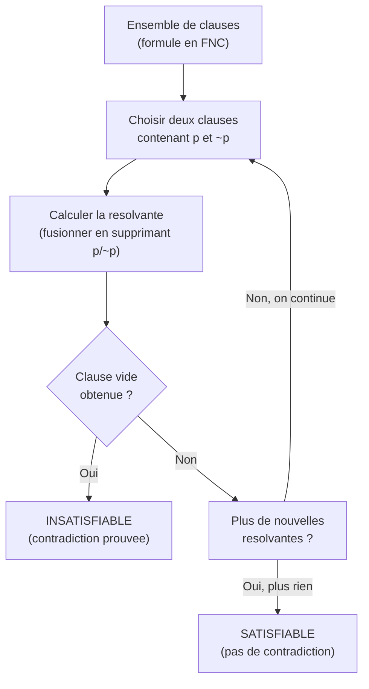
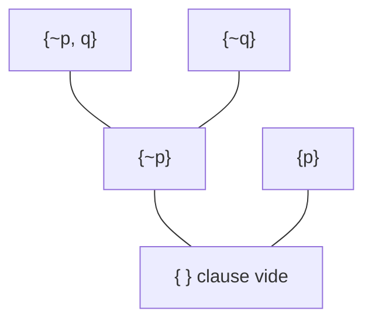
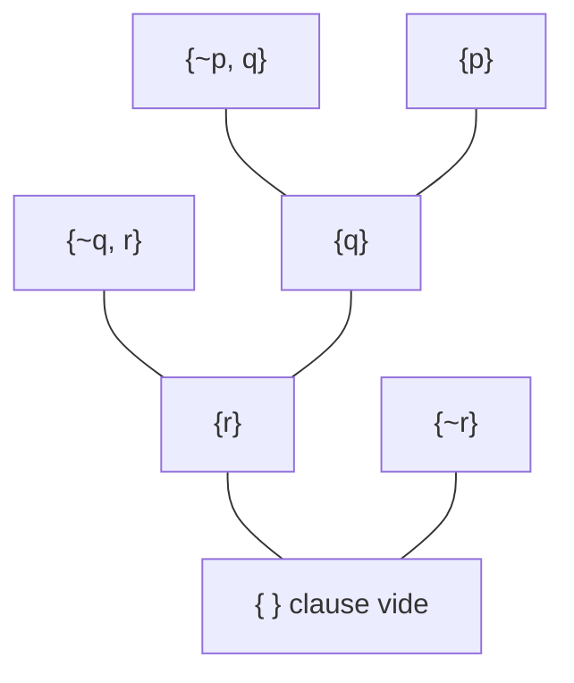
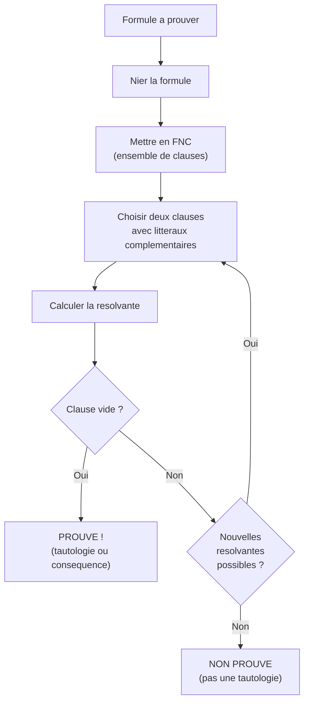

# Chapitre 3 -- Methode de resolution

> **Idee centrale en une phrase :** La resolution est une methode mecanique pour prouver qu'une formule est insatisfiable (contradiction), en combinant des clauses deux a deux jusqu'a obtenir la clause vide.

**Prerequis :** [Formes normales](02_formes_normales.md)
**Chapitre suivant :** [Calcul des predicats ->](04_calcul_predicats.md)

---

## 1. L'analogie du jeu d'elimination

### L'idee intuitive

Imagine que tu as une liste de **regles** qui doivent toutes etre satisfaites en meme temps. Tu cherches a montrer que c'est **impossible** -- qu'il n'existe aucune situation ou toutes les regles sont verifiees simultanement.

La methode de resolution fonctionne comme un jeu d'elimination :

1. Tu prends deux regles qui se **contredisent partiellement** (l'une dit "p ou ..." et l'autre dit "non-p ou ...").
2. Tu les combines pour creer une **nouvelle regle** plus simple (en supprimant p et non-p).
3. Tu repetes jusqu'a ce que tu obtiennes une regle **impossible** (la clause vide : meme rien ne peut etre vrai).

Si tu arrives a la clause vide, c'est que les regles de depart etaient contradictoires.

### Schema du principe



---

## 2. La resolvante : definition

### Principe

Soient deux clauses qui contiennent un litteral et sa negation :
- Clause 1 : `A \/ p`
- Clause 2 : `B \/ ~p`

La **resolvante** de ces deux clauses sur p est :
```
Resolvante = A \/ B
```

On "supprime" le litteral p et ~p, et on fusionne le reste.

### Formellement

Si C1 = `{l1, l2, ..., p}` et C2 = `{m1, m2, ..., ~p}`, alors :
```
Res(C1, C2) = {l1, l2, ..., m1, m2, ...}
```

(En notation ensembliste, une clause est un ensemble de litteraux relies par OU.)

### La clause vide

La **clause vide**, notee [] ou {} ou F (faux), est obtenue quand on resout deux clauses unitaires complementaires :
- C1 = `{p}`
- C2 = `{~p}`
- Res(C1, C2) = `{}` = clause vide

La clause vide represente le **faux** : c'est une clause qui ne contient aucun litteral, donc elle ne peut etre satisfaite par aucune valuation.

---

## 3. Exemples simples de resolvantes

### Exemple 1 : Clauses unitaires

```
C1 = {p}
C2 = {~p}
Res(C1, C2) = {}  (clause vide)
```

### Exemple 2 : Clauses a deux litteraux

```
C1 = {p, q}        (c'est-a-dire : p \/ q)
C2 = {~p, r}        (c'est-a-dire : ~p \/ r)
Res(C1, C2) sur p = {q, r}    (c'est-a-dire : q \/ r)
```

**Explication :** On supprime p de C1 et ~p de C2, et on fusionne le reste.

### Exemple 3 : Resolution avec des litteraux communs

```
C1 = {p, q, r}
C2 = {~p, q, s}
Res(C1, C2) sur p = {q, r, s}    (q apparait dans les deux, on ne le met qu'une fois)
```

### Exemple 4 : Attention aux tautologies

```
C1 = {p, q}
C2 = {~p, ~q}
Res(C1, C2) sur p = {q, ~q}
```

La resolvante `{q, ~q}` est une **tautologie** (toujours vraie). Elle n'apporte aucune information. On peut l'ignorer dans le processus de resolution (elle ne mene jamais a la clause vide).

> **Regle importante :** On ne resout que sur **un seul** litteral a la fois. Si C1 et C2 contiennent deux paires complementaires (par exemple p/~p et q/~q), on ne resout que sur l'une d'elles.

---

## 4. La methode de resolution pour prouver l'insatisfiabilite

### Algorithme

**Entree :** Un ensemble de clauses S = {C1, C2, ..., Cn} (formule en FNC).

**Objectif :** Determiner si S est insatisfiable.

**Methode :**
1. Choisir deux clauses Ci et Cj qui contiennent un litteral complementaire (p dans l'une, ~p dans l'autre).
2. Calculer la resolvante R = Res(Ci, Cj).
3. Si R est la clause vide : **S est insatisfiable**. STOP.
4. Si R est une tautologie : l'ignorer (elle n'apporte rien).
5. Si R est deja dans S : l'ignorer (pas d'information nouvelle).
6. Sinon : ajouter R a S et retourner a l'etape 1.
7. Si on ne peut plus produire de nouvelle resolvante : **S est satisfiable**. STOP.

### Theoreme de completude de la resolution

> La clause vide est derivable par resolution a partir de S **si et seulement si** S est insatisfiable.

C'est un resultat fondamental : la resolution est une methode **correcte** (si on derive la clause vide, c'est bien insatisfiable) et **complete** (si c'est insatisfiable, on finira par trouver la clause vide).

---

## 5. Prouver une tautologie par resolution

### Le principe de refutation

Pour prouver que la formule F est une **tautologie** :
1. Prendre la **negation** de F : calculer ~F.
2. Mettre ~F en **FNC** (ensemble de clauses).
3. Appliquer la resolution sur cet ensemble de clauses.
4. Si on obtient la clause vide : ~F est insatisfiable, donc F est une tautologie.


### Pourquoi ca marche

- F est une tautologie signifie que F est vraie pour **toute** valuation.
- Donc ~F est fausse pour **toute** valuation, c'est-a-dire ~F est **insatisfiable**.
- La resolution detecte l'insatisfiabilite en derivant la clause vide.

---

## 6. Prouver une consequence logique par resolution

### Le principe

Pour prouver que `B` est consequence logique de `A1, A2, ..., An` :
1. Prendre `A1 /\ A2 /\ ... /\ An /\ ~B`.
2. Mettre le tout en FNC.
3. Appliquer la resolution.
4. Si clause vide : B est bien consequence logique de A1, ..., An.

**Pourquoi :** Si les premisses et la negation de la conclusion menent a une contradiction, c'est que la conclusion decoule necessairement des premisses.

---

## 7. Exemple resolu complet : prouver une tautologie

### Enonce : Prouver que `(p => q) => (~q => ~p)` est une tautologie.

**Etape 1 :** Nier la formule.
```
~((p => q) => (~q => ~p))
```

**Etape 2 :** Simplifier la negation.

On sait que `~(A => B) equiv A /\ ~B`. Donc :
```
= (p => q) /\ ~(~q => ~p)
= (p => q) /\ ~q /\ ~~p          (car ~(A => B) = A /\ ~B)
= (~p \/ q) /\ ~q /\ p           (elimination de => et double negation)
```

**Etape 3 :** Identifier les clauses (c'est deja en FNC).
```
C1 = {~p, q}
C2 = {~q}
C3 = {p}
```

**Etape 4 :** Appliquer la resolution.

```
C1 = {~p, q}    C2 = {~q}
Resolution sur q :
C4 = Res(C1, C2) = {~p}

C4 = {~p}    C3 = {p}
Resolution sur p :
C5 = Res(C4, C3) = {}  (clause vide !)
```

**Conclusion :** On a obtenu la clause vide, donc ~F est insatisfiable, donc F est une **tautologie**. CQFD.

### Arbre de resolution



---

## 8. Exemple resolu : prouver une consequence logique

### Enonce : Prouver que `{p => q, q => r} |= p => r`

On veut montrer que `p => r` est consequence logique de `p => q` et `q => r`.

**Etape 1 :** Former l'ensemble de clauses a partir des premisses ET de la negation de la conclusion.

Premisses :
```
p => q   -->   ~p \/ q   -->   C1 = {~p, q}
q => r   -->   ~q \/ r   -->   C2 = {~q, r}
```

Negation de la conclusion :
```
~(p => r) = p /\ ~r   -->   C3 = {p}  et  C4 = {~r}
```

Ensemble : `{C1, C2, C3, C4} = {{~p, q}, {~q, r}, {p}, {~r}}`

**Etape 2 :** Resolution.

```
C1 = {~p, q}    C3 = {p}
Res(C1, C3) sur p = {q}  -->  C5

C2 = {~q, r}    C5 = {q}
Res(C2, C5) sur q = {r}  -->  C6

C6 = {r}    C4 = {~r}
Res(C6, C4) sur r = {}   -->  clause vide !
```

**Conclusion :** Clause vide obtenue, donc `p => r` est bien consequence logique de `p => q` et `q => r`. C'est le **syllogisme hypothetique**.

### Arbre de resolution



---

## 9. Exemple resolu plus complexe

### Enonce : Prouver l'insatisfiabilite de l'ensemble de clauses suivant

```
C1 = {p, q}
C2 = {p, ~q}
C3 = {~p, q}
C4 = {~p, ~q}
```

**Resolution :**

```
Res(C1, C2) sur q = {p}    -->  C5
Res(C3, C4) sur q = {~p}   -->  C6
Res(C5, C6) sur p = {}     -->  clause vide !
```

**Conclusion :** Cet ensemble de clauses est **insatisfiable**.

**Verification :** C1 dit "p ou q", C2 dit "p ou non-q". Si p est faux, C1 exige q, mais C2 exige non-q : contradiction. Si p est vrai, C3 exige q, mais C4 exige non-q : contradiction. Aucune valuation ne satisfait les 4 clauses simultanement.

---

## 10. Strategies de resolution

L'ordre dans lequel on choisit les clauses a resoudre peut rendre la recherche plus ou moins efficace.

### Resolution lineaire

On part d'une clause initiale et on resout toujours avec la derniere resolvante obtenue. C'est souvent la strategie la plus naturelle a ecrire a la main.

### Resolution unitaire

On privilegie toujours les resolutions impliquant une **clause unitaire** (un seul litteral). C'est plus efficace car les clauses unitaires propagent des informations fortes.

### Resolution par ensemble de support

On divise les clauses en deux : celles qui viennent des premisses (qui sont satisfiables entre elles) et celles qui viennent de la negation de la conclusion. On resout toujours en impliquant au moins une clause de la negation.

> **Conseil pour les DS :** En pratique, commence par les clauses unitaires (s'il y en a), puis travaille avec les clauses les plus courtes.

---

## 11. Resolution propositionnelle : resume de la procedure



---

## 12. Pieges classiques

### Piege 1 : Oublier de nier la formule

Pour prouver une tautologie ou une consequence logique, il faut d'abord **nier** ce qu'on veut prouver. C'est le principe de refutation. Si tu oublies cette etape, la resolution ne peut rien prouver.

### Piege 2 : Resoudre sur deux litteraux a la fois

```
C1 = {p, q}
C2 = {~p, ~q}
```

**INCORRECT :** Resoudre sur p ET q en meme temps pour obtenir `{}`.

**CORRECT :** Resoudre sur p pour obtenir `{q, ~q}` (tautologie) OU resoudre sur q pour obtenir `{p, ~p}` (tautologie). Il faut ensuite chercher d'autres resolvantes.

On ne resout **jamais** sur plus d'un litteral a la fois.

### Piege 3 : Oublier les doublons

Si la resolvante contient deux fois le meme litteral, on ne le garde qu'une fois (c'est un ensemble).
```
C1 = {p, q}
C2 = {~p, q}
Res(C1, C2) = {q}    (pas {q, q})
```

### Piege 4 : Ne pas mettre en FNC avant de commencer

La resolution ne fonctionne que sur des **clauses** (FNC). Si ta formule contient des implications, des equivalences ou des negations complexes, tu dois d'abord les eliminer (chapitre 02).

### Piege 5 : S'arreter trop tot

Si tu n'as pas encore obtenu la clause vide, verifie que tu as essaye **toutes** les paires de clauses possibles (y compris avec les nouvelles resolvantes). Parfois la clause vide n'est obtenue qu'apres plusieurs etapes intermediaires.

---

## 13. Recapitulatif

- La **resolvante** de deux clauses contenant p et ~p s'obtient en supprimant p/~p et en fusionnant le reste.
- La **clause vide** (= faux) signifie contradiction.
- Pour prouver une **tautologie** : nier, mettre en FNC, resoudre jusqu'a la clause vide.
- Pour prouver une **consequence logique** : ajouter la negation de la conclusion aux premisses, puis resoudre.
- On ne resout que sur **un seul** litteral a la fois.
- Les resolvantes tautologiques (`{p, ~p}`) sont ignorees.
- La resolution est **correcte et complete** pour la logique propositionnelle.
- **Strategie au DS** : commencer par les clauses unitaires, puis les plus courtes.
