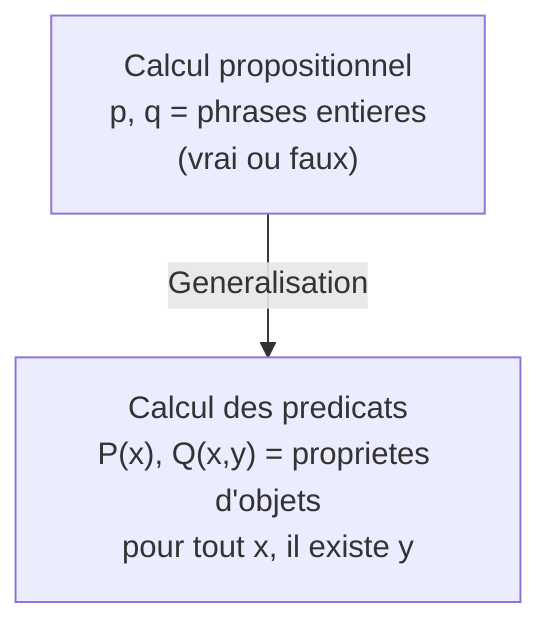
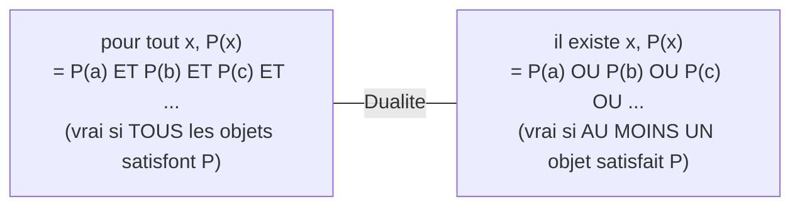

# Chapitre 4 -- Calcul des predicats

> **Idee centrale en une phrase :** Le calcul des predicats generalise le calcul propositionnel en permettant de parler de **proprietes d'objets** et de **quantifier** ("pour tout", "il existe"), ce qui donne un pouvoir expressif bien superieur.

**Prerequis :** [Calcul propositionnel](01_calcul_propositionnel.md)
**Chapitre suivant :** [Unification ->](05_unification.md)

---

## 1. L'analogie de la base de donnees

### Pourquoi le calcul propositionnel ne suffit pas

Le calcul propositionnel parle de phrases entieres : "il pleut" est vrai ou faux, point final. Mais dans la vie courante (et en informatique), on a besoin de dire des choses comme :

- "**Tous** les etudiants ont un numero d'etudiant."
- "**Il existe** un etudiant qui a obtenu 20/20."
- "Si quelqu'un est **etudiant a l'INSA**, alors il **suit des cours de logique**."

Ces phrases parlent d'**objets** (etudiants) et de **proprietes** (avoir un numero, obtenir 20/20, etre a l'INSA). Le calcul propositionnel ne peut pas exprimer ca.

### L'analogie

Pense a une base de donnees :
- Les **objets** sont les lignes de la table (etudiants, cours, notes...).
- Les **proprietes** (predicats) sont les colonnes ou les requetes (`estEtudiant(x)`, `aSuivi(x, cours)`).
- Les **quantificateurs** sont les clauses SQL : `FOR ALL` correspond a "pour tout", `EXISTS` correspond a "il existe".

Le calcul des predicats, c'est le langage formel qui permet de faire des requetes logiques sur un "monde" d'objets.

### Schema



---

## 2. Vocabulaire : les briques du calcul des predicats

### Domaine de discours

Le **domaine** (ou **univers**) est l'ensemble des objets dont on parle.

Exemples :
- Les entiers naturels : {0, 1, 2, 3, ...}
- Les etudiants de l'INSA
- Les chaines de caracteres

### Termes

Les **termes** designent des objets. Il y a trois types :

| Type | Exemple | Description |
|------|---------|-------------|
| **Constante** | a, b, 0, "Alice" | Un objet specifique et fixe |
| **Variable** | x, y, z | Un objet quelconque (a determiner) |
| **Fonction appliquee** | f(x), g(a, y), succ(0) | Un objet obtenu en appliquant une fonction a des termes |

**Definition recursive :** Un terme est :
1. Une constante, ou
2. Une variable, ou
3. f(t1, t2, ..., tn) ou f est un symbole de fonction et t1, ..., tn sont des termes.

**Exemples :**
- `a` : terme (constante)
- `x` : terme (variable)
- `f(a)` : terme (fonction appliquee a une constante)
- `f(g(x, a), b)` : terme (fonction appliquee a deux termes)
- `succ(succ(0))` : terme representant le nombre 2 en arithmetique de Peano

### Predicats (symboles de relation)

Un **predicat** est un symbole qui, applique a des termes, donne une proposition (vrai ou faux).

| Predicat | Arite | Exemple | Signification |
|----------|-------|---------|---------------|
| `Etudiant(x)` | 1 (unaire) | `Etudiant(Alice)` | "Alice est etudiante" |
| `PlusGrand(x, y)` | 2 (binaire) | `PlusGrand(3, 2)` | "3 est plus grand que 2" |
| `Entre(x, y, z)` | 3 (ternaire) | `Entre(2, 1, 3)` | "2 est entre 1 et 3" |

**Attention :** Un predicat **n'est PAS un terme**. Un predicat applique a des termes donne une **formule atomique** (pas un objet).

### Formules atomiques

Une **formule atomique** (ou **atome**) est un predicat applique a des termes :
```
P(t1, t2, ..., tn)
```

Exemples : `Etudiant(Alice)`, `PlusGrand(f(x), y)`, `Egal(x, 0)`

---

## 3. Les quantificateurs

### Le quantificateur universel : "pour tout"

**Symbole :** Pour tout (note aussi : Ax, pour tout x)

**Syntaxe :** `pour tout x, P(x)` signifie "pour tout objet x du domaine, P(x) est vrai".

**Exemple :**
- Domaine : les entiers naturels
- `pour tout x, (x >= 0)` signifie "tout entier naturel est positif ou nul" (vrai)
- `pour tout x, (x > 5)` signifie "tout entier naturel est strictement superieur a 5" (faux, car 0 n'est pas > 5)

> **Intuition :** Le "pour tout" est comme un **ET geant** sur tout le domaine. Si le domaine est {a, b, c}, alors `pour tout x, P(x)` equivaut a `P(a) /\ P(b) /\ P(c)`.

### Le quantificateur existentiel : "il existe"

**Symbole :** Il existe (note aussi : Ex, il existe x)

**Syntaxe :** `il existe x, P(x)` signifie "il existe au moins un objet x du domaine tel que P(x) est vrai".

**Exemple :**
- Domaine : les entiers naturels
- `il existe x, (x > 100)` signifie "il existe un entier naturel superieur a 100" (vrai, par exemple x = 101)
- `il existe x, (x < 0)` signifie "il existe un entier naturel negatif" (faux)

> **Intuition :** Le "il existe" est comme un **OU geant** sur tout le domaine. Si le domaine est {a, b, c}, alors `il existe x, P(x)` equivaut a `P(a) \/ P(b) \/ P(c)`.

### Schema recapitulatif



---

## 4. Construction des formules

### Syntaxe des formules du premier ordre

Les formules sont construites recursivement :

1. **Formule atomique** : `P(t1, ..., tn)` est une formule.
2. **Negation** : si F est une formule, `~F` est une formule.
3. **Conjonction** : si F et G sont des formules, `F /\ G` est une formule.
4. **Disjonction** : si F et G sont des formules, `F \/ G` est une formule.
5. **Implication** : si F et G sont des formules, `F => G` est une formule.
6. **Equivalence** : si F et G sont des formules, `F <=> G` est une formule.
7. **Quantification universelle** : si F est une formule et x une variable, `pour tout x, F` est une formule.
8. **Quantification existentielle** : si F est une formule et x une variable, `il existe x, F` est une formule.

### Portee d'un quantificateur

Le quantificateur s'applique a la formule qui le suit immediatement (ou au bloc entre parentheses).

```
pour tout x, (P(x) => Q(x))
```
Ici, le "pour tout x" porte sur toute la formule `P(x) => Q(x)`.

```
(pour tout x, P(x)) => Q(x)
```
Ici, le "pour tout x" ne porte que sur `P(x)`. Le x dans Q(x) n'est **pas** lie par le quantificateur -- c'est une **variable libre**.

> **Piege :** Les parentheses sont cruciales ! `pour tout x, (P(x) => Q(x))` et `(pour tout x, P(x)) => Q(x)` n'ont pas du tout la meme signification.

---

## 5. Variables libres et liees

### Definition

- Une variable est **liee** si elle est sous la portee d'un quantificateur.
- Une variable est **libre** si elle n'est sous la portee d'aucun quantificateur.

### Exemples

| Formule | Variables libres | Variables liees |
|---------|-----------------|-----------------|
| `P(x)` | x | aucune |
| `pour tout x, P(x)` | aucune | x |
| `pour tout x, P(x, y)` | y | x |
| `(pour tout x, P(x)) /\ Q(x)` | x (dans Q(x)) | x (dans P(x)) |

**Attention au dernier exemple :** Le meme symbole `x` peut etre libre dans une partie de la formule et lie dans une autre. C'est source de confusion.

### Formule close (ou enonce)

Une formule est **close** si elle n'a **aucune variable libre**. Seules les formules closes ont une valeur de verite fixe (vrai ou faux) dans une interpretation donnee.

---

## 6. Interpretations et satisfiabilite

### Qu'est-ce qu'une interpretation ?

Une **interpretation** (ou **structure**) donne un sens concret a tous les symboles de la formule :

1. **Domaine** D : l'ensemble des objets.
2. **Constantes** : chaque constante est associee a un element de D.
3. **Fonctions** : chaque symbole de fonction est associe a une fonction sur D.
4. **Predicats** : chaque symbole de predicat est associe a une relation sur D.
5. **Variables libres** : chaque variable libre est associee a un element de D.

### Exemple d'interpretation

Formule : `pour tout x, (P(x) => Q(x, a))`

Interpretation I1 :
- Domaine D = {1, 2, 3}
- a = 1
- P(x) vrai si x est pair, c'est-a-dire P = {2}
- Q(x, y) vrai si x <= y, c'est-a-dire Q = {(1,1), (1,2), (1,3), (2,2), (2,3), (3,3)}

Evaluation :
- `P(1) => Q(1, 1)` = F => V = V
- `P(2) => Q(2, 1)` = V => F = **F**
- `P(3) => Q(3, 1)` = F => F = V

`pour tout x, (P(x) => Q(x, a))` = V /\ F /\ V = **F**

La formule est **fausse** dans l'interpretation I1 (a cause de x=2).

### Satisfiabilite, validite

| Concept | Definition |
|---------|-----------|
| **Satisfiable** | Il existe au moins une interpretation qui rend la formule vraie |
| **Valide** | Toute interpretation rend la formule vraie |
| **Insatisfiable** | Aucune interpretation ne rend la formule vraie |

---

## 7. Equivalences avec les quantificateurs

### Negation des quantificateurs (lois de De Morgan generalisees)

```
~(pour tout x, P(x))  equiv  il existe x, ~P(x)
~(il existe x, P(x))  equiv  pour tout x, ~P(x)
```

> **Intuition :**
> - "Ce n'est pas vrai que TOUT le monde aime le chocolat" = "Il EXISTE quelqu'un qui n'aime pas le chocolat."
> - "Il n'EXISTE PAS d'etudiant parfait" = "TOUT etudiant est imparfait."

### Distributivite des quantificateurs

```
pour tout x, (P(x) /\ Q(x))  equiv  (pour tout x, P(x)) /\ (pour tout x, Q(x))
il existe x, (P(x) \/ Q(x))  equiv  (il existe x, P(x)) \/ (il existe x, Q(x))
```

**ATTENTION -- ces distributivites NE marchent PAS :**
```
pour tout x, (P(x) \/ Q(x))  PAS equiv  (pour tout x, P(x)) \/ (pour tout x, Q(x))
il existe x, (P(x) /\ Q(x))  PAS equiv  (il existe x, P(x)) /\ (il existe x, Q(x))
```

**Contre-exemple :** Domaine = {1, 2}. P(1) = V, P(2) = F, Q(1) = F, Q(2) = V.
- `pour tout x, (P(x) \/ Q(x))` = (V \/ F) /\ (F \/ V) = V /\ V = V
- `(pour tout x, P(x)) \/ (pour tout x, Q(x))` = (V /\ F) \/ (F /\ V) = F \/ F = F

### Renommage de variable

Si une variable n'apparait pas dans une partie de la formule, on peut la deplacer :
```
(pour tout x, P(x)) /\ Q(y)  equiv  pour tout x, (P(x) /\ Q(y))   (si x n'est pas libre dans Q)
```

### Ordre des quantificateurs de meme type

```
pour tout x, pour tout y, P(x,y)  equiv  pour tout y, pour tout x, P(x,y)
il existe x, il existe y, P(x,y)  equiv  il existe y, il existe x, P(x,y)
```

Les quantificateurs de **meme type** commutent.

### Ordre des quantificateurs de types differents

```
il existe x, pour tout y, P(x,y)  ==>  pour tout y, il existe x, P(x,y)
```
Mais l'inverse N'EST PAS VRAI en general.

> **Intuition :**
> - "Il existe un medecin qui soigne tout le monde" (un super-medecin) implique "Pour tout malade, il existe un medecin qui le soigne" (un medecin par personne).
> - Mais l'inverse est faux : avoir un medecin par personne ne signifie pas qu'il existe un seul medecin qui soigne tout le monde.

---

## 8. Forme prenexe

### Definition

Une formule est en **forme prenexe** si tous les quantificateurs sont **au debut** (en prefixe), suivis d'une formule sans quantificateurs (la **matrice**).

```
Q1 x1, Q2 x2, ..., Qn xn, M(x1, x2, ..., xn)
```
ou chaque Qi est "pour tout" ou "il existe" et M ne contient aucun quantificateur.

### Methode de mise en forme prenexe

1. Eliminer les equivalences et les implications.
2. Descendre les negations (De Morgan + negation des quantificateurs).
3. **Renommer les variables liees** pour eviter les conflits (si la meme variable est liee par deux quantificateurs differents).
4. **Sortir les quantificateurs** vers le debut.

### Exemple resolu

Mettre en forme prenexe : `(pour tout x, P(x)) => (il existe x, Q(x))`

**Etape 1 :** Eliminer l'implication.
```
~(pour tout x, P(x)) \/ (il existe x, Q(x))
```

**Etape 2 :** Descendre la negation.
```
(il existe x, ~P(x)) \/ (il existe x, Q(x))
```

**Etape 3 :** Renommer pour eviter le conflit (les deux x sont differents).
```
(il existe x, ~P(x)) \/ (il existe y, Q(y))
```

**Etape 4 :** Sortir les quantificateurs.
```
il existe x, il existe y, (~P(x) \/ Q(y))
```

**Resultat :** `il existe x, il existe y, (~P(x) \/ Q(y))`

---

## 9. Skolemisation

### Pourquoi skolemiser ?

Pour appliquer la resolution au calcul des predicats, on a besoin d'eliminer les quantificateurs existentiels. La **skolemisation** remplace chaque `il existe` par une **fonction** ou **constante** concrete.

### Regles de skolemisation

1. Si `il existe x` n'est precede d'aucun `pour tout`, remplacer x par une **nouvelle constante** (constante de Skolem).
   ```
   il existe x, P(x)  -->  P(c)     (c est une nouvelle constante)
   ```

2. Si `il existe x` est precede de `pour tout y1, pour tout y2, ...`, remplacer x par une **nouvelle fonction** appliquee aux variables universelles precedentes.
   ```
   pour tout y, il existe x, P(x, y)  -->  pour tout y, P(f(y), y)   (f est une nouvelle fonction)
   ```

### Exemple

```
pour tout x, il existe y, pour tout z, il existe w, P(x, y, z, w)
```

- y depend de x : remplacer y par f(x)
- w depend de x et z : remplacer w par g(x, z)

```
pour tout x, pour tout z, P(x, f(x), z, g(x, z))
```

> **Important :** La skolemisation **ne preserve pas l'equivalence logique** mais preserve la satisfiabilite. Si la formule skolemisee est insatisfiable, la formule originale l'est aussi. C'est suffisant pour la resolution.

---

## 10. Forme clausale du premier ordre

### Procedure complete : de la formule aux clauses

Pour mettre une formule du premier ordre en forme clausale (prete pour la resolution) :

1. Eliminer <=> et =>
2. Descendre les negations (De Morgan + negation des quantificateurs)
3. Renommer les variables liees (eviter les conflits)
4. Mettre en forme prenexe (sortir les quantificateurs)
5. **Skolemiser** (eliminer les quantificateurs existentiels)
6. Supprimer les quantificateurs universels (ils sont implicites)
7. Mettre la matrice en FNC
8. Ecrire les clauses

### Exemple complet

Formule : `pour tout x, (P(x) => il existe y, Q(x, y))`

**Etape 1 :** Eliminer =>.
```
pour tout x, (~P(x) \/ il existe y, Q(x, y))
```

**Etape 2 :** Rien a descendre.

**Etape 3 :** Pas de conflit de variables.

**Etape 4 :** Sortir le quantificateur existentiel.
```
pour tout x, il existe y, (~P(x) \/ Q(x, y))
```

**Etape 5 :** Skolemiser (y depend de x, remplacer par f(x)).
```
pour tout x, (~P(x) \/ Q(x, f(x)))
```

**Etape 6 :** Supprimer le pour tout (implicite).
```
~P(x) \/ Q(x, f(x))
```

**Etape 7-8 :** C'est deja une clause.
```
Clause : {~P(x), Q(x, f(x))}
```

---

## 11. Traduction en logique du premier ordre

### Comment formaliser des phrases du langage naturel

C'est un exercice classique en DS. Voici les schemas courants :

**"Tous les A sont B" :**
```
pour tout x, (A(x) => B(x))
```

**"Certains A sont B" (il existe des A qui sont B) :**
```
il existe x, (A(x) /\ B(x))
```

**"Aucun A n'est B" :**
```
pour tout x, (A(x) => ~B(x))
```
ou de facon equivalente : `~(il existe x, (A(x) /\ B(x)))`

**"Il existe un unique A tel que B" :**
```
il existe x, (A(x) /\ B(x) /\ pour tout y, ((A(y) /\ B(y)) => y = x))
```

### Exemples de traduction

| Phrase | Formule |
|--------|---------|
| "Tout etudiant suit un cours" | `pour tout x, (Etudiant(x) => il existe y, (Cours(y) /\ Suit(x, y)))` |
| "Il existe un cours que tout etudiant suit" | `il existe y, (Cours(y) /\ pour tout x, (Etudiant(x) => Suit(x, y)))` |
| "Personne n'aime tout le monde" | `pour tout x, (~pour tout y, Aime(x, y))` equiv `pour tout x, il existe y, ~Aime(x, y)` |

> **Piege :** "Tout etudiant suit un cours" (un cours par etudiant, pas forcement le meme) est DIFFERENT de "Il existe un cours que tout etudiant suit" (un seul cours pour tous). L'ordre des quantificateurs change le sens !

---

## 12. Pieges classiques

### Piege 1 : L'ordre des quantificateurs

`pour tout x, il existe y, P(x,y)` n'est PAS equivalent a `il existe y, pour tout x, P(x,y)`. Le premier dit "pour chaque x, il y a un y (possiblement different)". Le deuxieme dit "il existe un seul y qui marche pour tous les x".

### Piege 2 : "Tous les A sont B" se traduit avec IMPLIQUE, pas ET

```
CORRECT :   pour tout x, (A(x) => B(x))
INCORRECT : pour tout x, (A(x) /\ B(x))    <- Ceci dit "tout est A et B"
```

### Piege 3 : "Certains A sont B" se traduit avec ET, pas IMPLIQUE

```
CORRECT :   il existe x, (A(x) /\ B(x))
INCORRECT : il existe x, (A(x) => B(x))     <- Ceci est presque toujours vrai (trivial)
```

**Pourquoi l'incorrect est trivial :** `A(x) => B(x)` est vrai des qu'un objet n'est PAS un A. Donc s'il existe ne serait-ce qu'un objet qui n'est pas un A, la formule est vraie. Ca ne dit pas du tout "certains A sont B".

### Piege 4 : Oublier de renommer les variables

Si la meme variable x est liee par deux quantificateurs differents, il **faut** la renommer avant de mettre en forme prenexe.

### Piege 5 : Confondre termes et formules

- `f(x)` est un **terme** (designe un objet).
- `P(x)` est une **formule** (est vraie ou fausse).
- On ne peut PAS ecrire `pour tout f(x), ...` (on quantifie sur des **variables**, pas sur des termes).

---

## 13. Recapitulatif

- Le calcul des predicats ajoute des **predicats** (proprietes d'objets), des **termes** (constantes, variables, fonctions) et des **quantificateurs** (pour tout, il existe) au calcul propositionnel.
- **pour tout** = ET geant sur le domaine. **il existe** = OU geant.
- Negation des quantificateurs : `~pour tout = il existe ~` et `~il existe = pour tout ~`.
- **Variables libres** vs **liees** : les liees sont sous un quantificateur.
- L'**ordre des quantificateurs** est crucial : `pour tout il existe` n'est pas `il existe pour tout`.
- "Tous les A sont B" = `pour tout x, (A(x) => B(x))` (avec IMPLIQUE).
- "Certains A sont B" = `il existe x, (A(x) /\ B(x))` (avec ET).
- **Forme prenexe** : quantificateurs en prefixe, matrice sans quantificateurs.
- **Skolemisation** : eliminer les "il existe" par des constantes/fonctions de Skolem.
