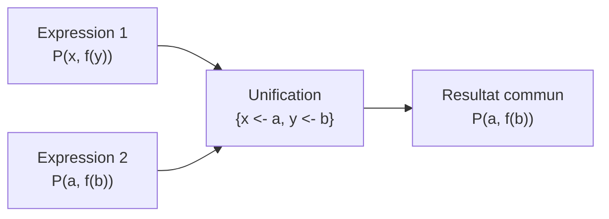
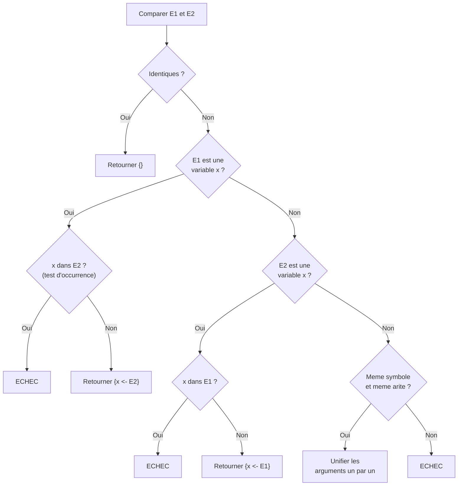
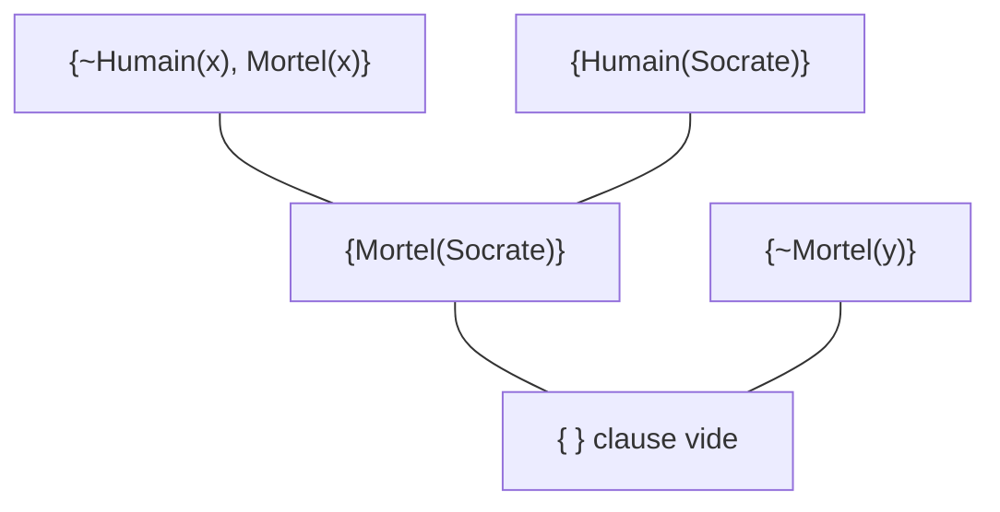

# Chapitre 5 -- Unification

> **Idee centrale en une phrase :** L'unification est l'algorithme qui cherche une substitution (un remplacement de variables par des termes) pour rendre deux expressions identiques -- c'est la brique technique cle de la resolution au premier ordre.

**Prerequis :** [Calcul des predicats](04_calcul_predicats.md)
**Chapitre suivant :** [Deduction naturelle ->](06_deduction_naturelle.md)

---

## 1. L'analogie du puzzle

### L'idee intuitive

Imagine deux pieces de puzzle avec des trous (les variables) et des bosses (les constantes/fonctions). L'unification consiste a trouver le bon remplissage pour que les deux pieces s'emboitent parfaitement -- c'est-a-dire pour que les deux expressions deviennent **identiques**.

Par exemple :
- Piece 1 : `P(x, a)` (x est un trou, a est une bosse)
- Piece 2 : `P(b, a)` (b est une bosse, a est une bosse)
- Remplissage : mettre b dans le trou x -> `P(b, a) = P(b, a)` : ca s'emboite !

Parfois, les deux pieces ne peuvent pas s'emboiter (par exemple `P(a, b)` et `P(b, a)` avec a et b des constantes differentes). Dans ce cas, l'unification **echoue**.

### Schema



---

## 2. Substitutions

### Definition

Une **substitution** est un ensemble de remplacements de variables par des termes.

**Notation :** `sigma = {x <- t1, y <- t2, ...}` ou `sigma = {x/t1, y/t2, ...}`

Cela signifie : "remplacer x par t1, remplacer y par t2, etc."

### Application d'une substitution

Appliquer la substitution sigma a un terme ou une formule, c'est remplacer simultanement chaque variable par le terme associe.

**Notation :** `F sigma` ou `sigma(F)`

### Exemples

| Expression | Substitution | Resultat |
|-----------|-------------|---------|
| `P(x, y)` | `{x <- a, y <- b}` | `P(a, b)` |
| `f(x, g(y))` | `{x <- h(z), y <- a}` | `f(h(z), g(a))` |
| `P(x, x)` | `{x <- f(a)}` | `P(f(a), f(a))` |
| `Q(x, y, z)` | `{x <- y}` | `Q(y, y, z)` |

### Composition de substitutions

Si sigma1 = `{x <- f(y)}` et sigma2 = `{y <- a}`, alors la composition sigma1 sigma2 appliquee a un terme :
- D'abord appliquer sigma1, puis sigma2 au resultat.

Exemple : `P(x, y)` avec sigma1 puis sigma2 :
- sigma1 : `P(f(y), y)`
- sigma2 : `P(f(a), a)`

---

## 3. Unificateur et MGU

### Unificateur

Un **unificateur** de deux expressions E1 et E2 est une substitution sigma telle que :
```
E1 sigma = E2 sigma
```

C'est-a-dire : apres application de sigma, les deux expressions deviennent identiques.

### Exemples

| E1 | E2 | Unificateur | Resultat |
|----|----|----|---------|
| `P(x)` | `P(a)` | `{x <- a}` | `P(a)` |
| `P(x, y)` | `P(a, b)` | `{x <- a, y <- b}` | `P(a, b)` |
| `P(x, x)` | `P(a, a)` | `{x <- a}` | `P(a, a)` |
| `P(x, x)` | `P(a, b)` | **Echec !** | a != b |
| `P(a)` | `P(b)` | **Echec !** | a != b (constantes differentes) |
| `P(x)` | `Q(x)` | **Echec !** | predicats differents |

### Plusieurs unificateurs possibles

Pour `P(x)` et `P(y)`, il existe plusieurs unificateurs :
- `{x <- y}` donne `P(y)`
- `{y <- x}` donne `P(x)`
- `{x <- a, y <- a}` donne `P(a)`

Tous sont corrects, mais certains sont "meilleurs" (plus generaux) que d'autres.

### Unificateur le Plus General (MGU)

Le **MGU** (Most General Unifier, ou unificateur le plus general) est l'unificateur qui fait le **minimum de remplacements necessaires**. Il ne specialise pas plus qu'il ne faut.

Pour `P(x)` et `P(y)` :
- `{x <- y}` est un MGU (on remplace juste x par y)
- `{x <- a, y <- a}` n'est PAS un MGU (on specialise trop : on fixe une constante alors que ce n'est pas necessaire)

> **Propriete fondamentale :** Si deux expressions sont unifiables, leur MGU existe et est unique (a renommage de variables pres).

---

## 4. L'algorithme d'unification

### Principe

L'algorithme parcourt les deux expressions en parallele, de gauche a droite, et construit progressivement la substitution.

### Algorithme pas a pas

**Entree :** Deux expressions E1 et E2.
**Sortie :** Le MGU sigma, ou ECHEC.

```
Fonction UNIFIER(E1, E2):
    Si E1 et E2 sont identiques:
        Retourner {} (substitution vide)

    Si E1 est une variable x:
        Si x apparait dans E2:
            Retourner ECHEC (test d'occurrence)
        Sinon:
            Retourner {x <- E2}

    Si E2 est une variable x:
        Si x apparait dans E1:
            Retourner ECHEC (test d'occurrence)
        Sinon:
            Retourner {x <- E1}

    Si E1 = f(s1, ..., sn) et E2 = f(t1, ..., tn) (meme symbole, meme arite):
        sigma <- {}
        Pour i de 1 a n:
            sigma_i <- UNIFIER(si sigma, ti sigma)
            Si sigma_i = ECHEC:
                Retourner ECHEC
            sigma <- sigma compose sigma_i
        Retourner sigma

    Sinon (symboles differents ou arites differentes):
        Retourner ECHEC
```

### Representation en diagramme



---

## 5. Le test d'occurrence (occur check)

### Pourquoi ce test ?

Le test d'occurrence verifie qu'une variable x n'apparait **pas** dans le terme qu'on veut lui substituer. Sans ce test, on pourrait creer des termes **infinis**.

### Exemple

Unifier `x` avec `f(x)` :
- Sans test d'occurrence : `{x <- f(x)}`, ce qui donnerait `f(f(f(f(...))))` a l'infini.
- Avec test d'occurrence : **ECHEC**.

### Cas concret

Unifier `P(x)` avec `P(f(x))` :
- Il faudrait `x = f(x)`, ce qui est impossible (terme infini).
- **ECHEC**.

> **Retenir :** On ne peut JAMAIS substituer une variable par un terme qui **contient** cette variable.

---

## 6. Exemples resolus pas a pas

### Exemple 1 : Unification simple

Unifier `P(x, f(y))` et `P(a, f(b))`.

```
Etape 1 : Comparer P(x, f(y)) et P(a, f(b))
  - Meme predicat P, meme arite 2. On unifie les arguments.

Etape 2 : Unifier x et a
  - x est une variable, a est une constante.
  - sigma1 = {x <- a}

Etape 3 : Appliquer sigma1 aux arguments restants :
  f(y) sigma1 = f(y)   (y n'est pas affecte)
  f(b) sigma1 = f(b)

Etape 4 : Unifier f(y) et f(b)
  - Meme symbole f, meme arite 1. On unifie les arguments.

Etape 5 : Unifier y et b
  - sigma2 = {y <- b}

Resultat : MGU = {x <- a, y <- b}
Verification : P(x, f(y)){x <- a, y <- b} = P(a, f(b)) = P(a, f(b)). OK.
```

### Exemple 2 : Variable remplacee par un terme compose

Unifier `P(x, y)` et `P(f(a), g(x))`.

```
Etape 1 : Meme predicat P, arite 2.

Etape 2 : Unifier x et f(a)
  - sigma1 = {x <- f(a)}

Etape 3 : Appliquer sigma1 aux arguments restants :
  y sigma1 = y
  g(x) sigma1 = g(f(a))

Etape 4 : Unifier y et g(f(a))
  - sigma2 = {y <- g(f(a))}

Resultat : MGU = {x <- f(a), y <- g(f(a))}
Verification : P(x, y){...} = P(f(a), g(f(a))) et P(f(a), g(x)){...} = P(f(a), g(f(a))). OK.
```

### Exemple 3 : Echec par conflit de constantes

Unifier `P(a, x)` et `P(b, c)`.

```
Etape 1 : Meme predicat P, arite 2.

Etape 2 : Unifier a et b
  - a et b sont des constantes differentes.
  - ECHEC.
```

### Exemple 4 : Echec par test d'occurrence

Unifier `P(x, x)` et `P(y, f(y))`.

```
Etape 1 : Meme predicat P, arite 2.

Etape 2 : Unifier x et y
  - sigma1 = {x <- y}

Etape 3 : Appliquer sigma1 :
  x sigma1 = y
  f(y) sigma1 = f(y)

Etape 4 : Unifier y et f(y)
  - y est une variable, mais y apparait dans f(y).
  - Test d'occurrence : ECHEC.
```

### Exemple 5 : Unification avec une meme variable

Unifier `P(x, x)` et `P(a, a)`.

```
Etape 1 : Meme predicat P, arite 2.

Etape 2 : Unifier x et a
  - sigma1 = {x <- a}

Etape 3 : Appliquer sigma1 :
  x sigma1 = a
  a sigma1 = a

Etape 4 : Unifier a et a
  - Identiques. Rien a faire.

Resultat : MGU = {x <- a}
```

### Exemple 6 : Unification de `P(x, x)` et `P(a, b)`

```
Etape 1 : Meme predicat P, arite 2.

Etape 2 : Unifier x et a
  - sigma1 = {x <- a}

Etape 3 : Appliquer sigma1 :
  x sigma1 = a
  b sigma1 = b

Etape 4 : Unifier a et b
  - a et b sont des constantes differentes.
  - ECHEC.
```

**Explication :** `P(x, x)` exige que les deux arguments soient le meme objet. Mais `P(a, b)` a deux objets differents. Impossible de les unifier.

### Exemple 7 : Unification avec des fonctions imbriquees

Unifier `P(f(x), g(y, a))` et `P(f(f(b)), g(f(b), z))`.

```
Etape 1 : Meme predicat P, arite 2.

Etape 2 : Unifier f(x) et f(f(b))
  - Meme symbole f, arite 1.
  - Unifier x et f(b) : sigma1 = {x <- f(b)}

Etape 3 : Appliquer sigma1 aux deuxiemes arguments :
  g(y, a) sigma1 = g(y, a)
  g(f(b), z) sigma1 = g(f(b), z)

Etape 4 : Unifier g(y, a) et g(f(b), z)
  - Meme symbole g, arite 2.
  - Unifier y et f(b) : sigma2 = {y <- f(b)}
  - Unifier a et z : sigma3 = {z <- a}

Resultat : MGU = {x <- f(b), y <- f(b), z <- a}
```

---

## 7. Resolution au premier ordre

### Comment l'unification intervient dans la resolution

Dans la resolution propositionnelle (chapitre 03), on cherchait des litteraux complementaires **identiques** (p et ~p). Au premier ordre, les litteraux ne sont pas forcement identiques -- il faut les **unifier**.

### Principe de resolution au premier ordre

Soient deux clauses :
- C1 contenant le litteral positif `P(s1, ..., sn)`
- C2 contenant le litteral negatif `~P(t1, ..., tn)`

Si `P(s1, ..., sn)` et `P(t1, ..., tn)` sont **unifiables** avec le MGU sigma, alors la resolvante est :

```
Res(C1, C2) = (C1 \ {P(s1,...,sn)} union C2 \ {~P(t1,...,tn)}) sigma
```

On applique sigma a toute la resolvante.

### Exemple

```
C1 = {P(x, a), Q(x)}
C2 = {~P(b, y), R(y)}
```

On unifie `P(x, a)` et `P(b, y)` :
- MGU : sigma = {x <- b, y <- a}

Resolvante :
```
Res = ({Q(x)} union {R(y)}) sigma
    = {Q(b), R(a)}
```

---

## 8. Exemple complet de resolution au premier ordre

### Enonce

Prouver que `il existe x, Mortel(x)` est consequence logique de :
- A1 : `pour tout x, (Humain(x) => Mortel(x))` ("Tout humain est mortel")
- A2 : `Humain(Socrate)` ("Socrate est humain")

### Mise en clauses

A1 en clause : `{~Humain(x), Mortel(x)}`
A2 en clause : `{Humain(Socrate)}`

Negation de la conclusion :
`~(il existe x, Mortel(x))` = `pour tout x, ~Mortel(x)`
En clause : `{~Mortel(y)}` (on renomme la variable pour eviter les conflits)

### Ensemble de clauses

```
C1 = {~Humain(x), Mortel(x)}
C2 = {Humain(Socrate)}
C3 = {~Mortel(y)}
```

### Resolution

```
C1 = {~Humain(x), Mortel(x)}    C2 = {Humain(Socrate)}
Unifier Humain(x) et Humain(Socrate) : sigma = {x <- Socrate}
C4 = Res(C1, C2) = {Mortel(Socrate)}

C4 = {Mortel(Socrate)}    C3 = {~Mortel(y)}
Unifier Mortel(Socrate) et Mortel(y) : sigma = {y <- Socrate}
C5 = Res(C4, C3) = {}   (clause vide !)
```

**Conclusion :** Clause vide obtenue. Socrate est bien mortel.

### Arbre de resolution



---

## 9. Pieges classiques

### Piege 1 : Oublier le test d'occurrence

Si on oublie de verifier que la variable n'apparait pas dans le terme, on peut creer des substitutions invalides (termes infinis). Toujours verifier avant de substituer.

### Piege 2 : Ne pas appliquer la substitution courante aux termes suivants

Quand on unifie les arguments un par un, chaque nouvelle substitution doit etre **appliquee** aux arguments restants avant de continuer.

```
Unifier P(x, x, y) et P(a, z, z) :

Etape 1 : x et a -> sigma1 = {x <- a}
Etape 2 : Appliquer sigma1 : x sigma1 = a, z sigma1 = z
          Unifier a et z -> sigma2 = {z <- a}
Etape 3 : Appliquer sigma1 sigma2 : y sigma = y, z sigma = a
          Unifier y et a -> sigma3 = {y <- a}

MGU = {x <- a, z <- a, y <- a}
```

Si on oublie d'appliquer sigma1 a l'etape 2, on fait n'importe quoi.

### Piege 3 : Confondre constantes et variables

Par convention en logique du premier ordre :
- Les **minuscules du debut de l'alphabet** (a, b, c) sont souvent des **constantes**.
- Les **minuscules de la fin de l'alphabet** (x, y, z) sont souvent des **variables**.

Mais cette convention n'est pas universelle ! Lis toujours l'enonce pour savoir quels symboles sont des variables et lesquels sont des constantes.

### Piege 4 : Oublier d'appliquer le MGU a TOUTE la resolvante

Dans la resolution au premier ordre, le MGU doit etre applique a **tous** les litteraux de la resolvante, pas seulement aux litteraux qui ont ete resolus.

### Piege 5 : Resoudre avec des predicats differents

On ne peut unifier que des litteraux ayant le **meme** symbole de predicat. `P(x)` et `Q(x)` ne sont pas unifiables (meme si les arguments sont identiques).

---

## 10. Recapitulatif

- Une **substitution** `{x <- t}` remplace la variable x par le terme t partout.
- L'**unification** cherche une substitution qui rend deux expressions identiques.
- Le **MGU** est l'unificateur le plus general (minimum de specialisation).
- L'algorithme d'unification parcourt les expressions en parallele, argument par argument.
- Le **test d'occurrence** empeche de substituer x par un terme contenant x (evite les boucles infinies).
- La resolution au **premier ordre** utilise l'unification pour trouver des litteraux complementaires dans deux clauses.
- Toujours **appliquer** la substitution courante aux arguments restants avant de continuer.
- Le MGU est applique a **toute** la resolvante, pas seulement aux litteraux resolus.
