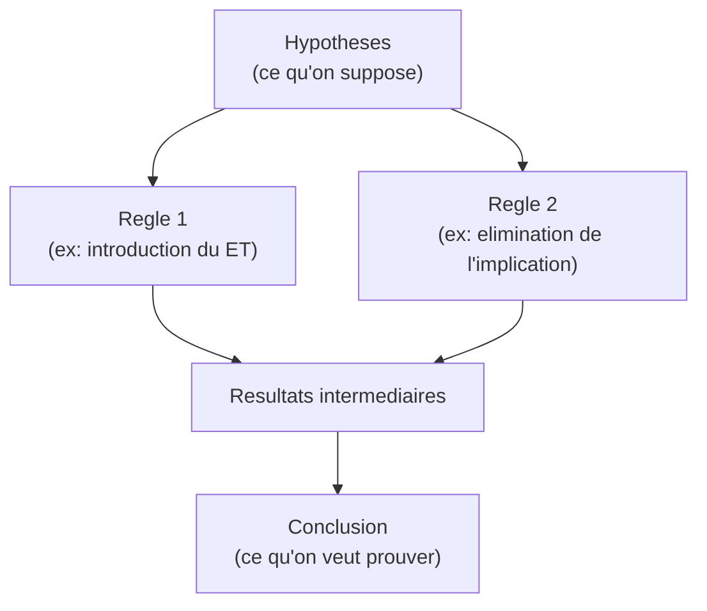
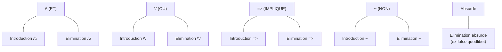
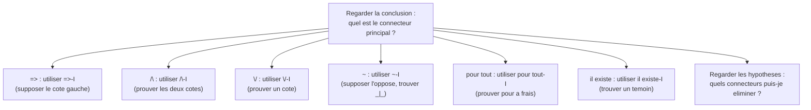

# Chapitre 6 -- Deduction naturelle

> **Idee centrale en une phrase :** La deduction naturelle est un systeme de preuves formelles ou l'on construit un raisonnement etape par etape, en utilisant des regles d'introduction et d'elimination pour chaque connecteur logique.

**Prerequis :** [Calcul propositionnel](01_calcul_propositionnel.md), [Calcul des predicats](04_calcul_predicats.md)
**Fiche recapitulative :** [Cheat Sheet ->](cheat_sheet.md)

---

## 1. L'analogie du jeu de construction

### L'idee intuitive

Imagine un jeu de LEGO ou chaque brique represente un fait ou une hypothese, et chaque notice de montage represente une **regle d'inference**. Pour construire la tour finale (la conclusion), tu dois assembler les briques en respectant les notices.

- **Briques de base** : les hypotheses de depart (ce qu'on suppose vrai).
- **Notices** : les regles d'inference (comment combiner les briques).
- **Tour finale** : la conclusion qu'on veut prouver.

La deduction naturelle, c'est exactement ca : on part d'hypotheses et on applique des regles pour arriver a la conclusion, etape par etape, de facon verifiable.

### Schema general



---

## 2. Structure d'une preuve en deduction naturelle

### Le sequent

Un **sequent** (ou jugement) se note :
```
A1, A2, ..., An |- B
```

Cela signifie : "A partir des hypotheses A1, A2, ..., An, on peut deduire B."

- La partie gauche du `|-` s'appelle le **contexte** (ou les hypotheses).
- La partie droite est la **conclusion**.

### Format d'une preuve

Une preuve est un **arbre** construit de bas en haut (la conclusion est en bas, les hypotheses en haut). Chaque noeud de l'arbre est justifie par une **regle d'inference**.

```
   Hypothese1    Hypothese2
   -------------------------  [Nom de la regle]
         Conclusion
```

Les traits horizontaux representent l'application d'une regle. Au-dessus : les premisses. En dessous : la conclusion de la regle.

---

## 3. Les regles d'inference pour le calcul propositionnel

Pour chaque connecteur logique, il y a deux types de regles :
- **Introduction (I)** : comment **construire** une formule avec ce connecteur.
- **Elimination (E)** : comment **utiliser** une formule avec ce connecteur.

### Vue d'ensemble



### 3.1. Regles pour la conjonction (ET, /\)

**Introduction du ET (/\-I) :**

Si on a prouve A et prouve B (separement), alors on peut conclure A /\ B.

```
     A       B
    -----------  [/\-I]
      A /\ B
```

**Elimination du ET (/\-E) :**

Si on a prouve A /\ B, alors on peut conclure A (ou B).

```
    A /\ B                A /\ B
    ------  [/\-E1]       ------  [/\-E2]
      A                     B
```

### 3.2. Regles pour la disjonction (OU, \/)

**Introduction du OU (\/-I) :**

Si on a prouve A, alors on peut conclure A \/ B (ou B \/ A), pour n'importe quel B.

```
      A                     B
    ------  [\/-I1]       ------  [\/-I2]
    A \/ B                A \/ B
```

**Elimination du OU (\/-E) -- Raisonnement par cas :**

Si on a A \/ B, et qu'en supposant A on prouve C, et qu'en supposant B on prouve aussi C, alors C est prouve.

```
              [A]       [B]
               .         .
               .         .
    A \/ B     C         C
    -------------------------  [\/-E]
               C
```

Les crochets [A] et [B] indiquent des **hypotheses temporaires** qu'on "decharge" (on n'a plus besoin de les supposer apres avoir applique la regle).

### 3.3. Regles pour l'implication (=>, ->)

**Introduction de l'implication (=>-I) :**

Pour prouver A => B : supposer A (hypothese temporaire), et montrer que B en decoule. Puis decharger l'hypothese A.

```
     [A]
      .
      .
      B
    ------  [=>-I]
    A => B
```

C'est la regle la plus utilisee. On dit aussi "preuve sous hypothese" ou "preuve conditionnelle".

**Elimination de l'implication (=>-E) -- Modus ponens :**

Si on a A et A => B, alors on peut conclure B.

```
    A     A => B
    ------------  [=>-E]
         B
```

### 3.4. Regles pour la negation (~)

**Introduction de la negation (~-I) -- Preuve par contradiction :**

Pour prouver ~A : supposer A, et deriver une **contradiction** (faux, note _|_). Puis decharger l'hypothese A.

```
     [A]
      .
      .
     _|_
    ------  [~-I]
      ~A
```

**Elimination de la negation (~-E) :**

Si on a A et ~A, alors on obtient le faux (_|_).

```
    A     ~A
    --------  [~-E]
      _|_
```

### 3.5. Regles pour l'absurde (_|_)

**Elimination de l'absurde (ex falso quodlibet) :**

A partir du faux, on peut deduire **n'importe quoi**.

```
     _|_
    ------  [_|_-E]
      A
```

### 3.6. Regle du tiers exclu (classique)

En logique classique (pas intuitionniste), on dispose aussi de la regle RAA (Reductio Ad Absurdum) :

Pour prouver A : supposer ~A, deriver une contradiction, conclure A.

```
     [~A]
      .
      .
     _|_
    ------  [RAA]
      A
```

**Difference avec ~-I :** La regle ~-I conclut ~A a partir d'une hypothese A. La regle RAA conclut A a partir d'une hypothese ~A. Ce sont des sens opposes.

---

## 4. Exemples resolus en calcul propositionnel

### Exemple 1 : Prouver `p /\ q |- q /\ p` (commutativite du ET)

On veut montrer que si p /\ q, alors q /\ p.

```
Preuve :

1.  p /\ q          (hypothese)
2.  q                (/\-E2 sur 1)
3.  p                (/\-E1 sur 1)
4.  q /\ p           (/\-I sur 2 et 3)
```

### Exemple 2 : Prouver `|- p => p` (reflexivite de l'implication)

On veut prouver p => p sans aucune hypothese.

```
Preuve :

1.  [p]              (hypothese temporaire)
2.  p => p           (=>-I, decharge de 1)
```

**Explication :** On suppose p (etape 1), on l'a deja (c'est p), donc on decharge l'hypothese pour obtenir p => p.

### Exemple 3 : Prouver `p => q, q => r |- p => r` (syllogisme hypothetique)

```
Preuve :

1.  p => q           (hypothese)
2.  q => r           (hypothese)
3.  [p]              (hypothese temporaire)
4.  q                (=>-E sur 3 et 1)
5.  r                (=>-E sur 4 et 2)
6.  p => r           (=>-I, decharge de 3)
```

### Exemple 4 : Prouver `p /\ (q \/ r) |- (p /\ q) \/ (p /\ r)` (distributivite)

```
Preuve :

1.  p /\ (q \/ r)       (hypothese)
2.  p                    (/\-E1 sur 1)
3.  q \/ r               (/\-E2 sur 1)

    Cas 1 : supposons q
4.  [q]                  (hypothese temporaire)
5.  p /\ q               (/\-I sur 2 et 4)
6.  (p /\ q) \/ (p /\ r) (\/-I1 sur 5)

    Cas 2 : supposons r
7.  [r]                  (hypothese temporaire)
8.  p /\ r               (/\-I sur 2 et 7)
9.  (p /\ q) \/ (p /\ r) (\/-I2 sur 8)

10. (p /\ q) \/ (p /\ r) (\/-E sur 3, 6, 9 -- decharge de 4 et 7)
```

### Exemple 5 : Prouver `|- ~~p => p` (elimination de la double negation, classique)

```
Preuve :

1.  [~~p]               (hypothese temporaire)
2.    [~p]              (hypothese temporaire)
3.    _|_               (~-E sur 1 et 2)
4.  p                   (RAA, decharge de 2)
5.  ~~p => p            (=>-I, decharge de 1)
```

### Exemple 6 : Prouver la contraposee `p => q |- ~q => ~p`

```
Preuve :

1.  p => q             (hypothese)
2.  [~q]               (hypothese temporaire)
3.    [p]              (hypothese temporaire)
4.    q                (=>-E sur 3 et 1)
5.    _|_              (~-E sur 4 et 2)
6.  ~p                 (~-I, decharge de 3)
7.  ~q => ~p           (=>-I, decharge de 2)
```

---

## 5. Regles pour les quantificateurs

### 5.1. Quantificateur universel (pour tout)

**Introduction du pour tout (pour tout-I) :**

Pour prouver `pour tout x, P(x)` : prouver P(a) pour une variable **fraiche** a (qui n'apparait nulle part dans les hypotheses en cours).

```
    P(a)         (a frais)
    --------  [pour tout-I]
    pour tout x, P(x)
```

> **Condition cruciale :** a ne doit apparaitre dans **aucune** hypothese non dechargee. C'est ce qui garantit que la preuve est valable pour "n'importe quel" objet.

**Elimination du pour tout (pour tout-E) :**

Si on a `pour tout x, P(x)`, on peut conclure P(t) pour **n'importe quel** terme t.

```
    pour tout x, P(x)
    ------------------  [pour tout-E]
         P(t)
```

### 5.2. Quantificateur existentiel (il existe)

**Introduction du il existe (il existe-I) :**

Si on a prouve P(t) pour un terme t specifique, on peut conclure `il existe x, P(x)`.

```
       P(t)
    ----------  [il existe-I]
    il existe x, P(x)
```

**Elimination du il existe (il existe-E) :**

Si on a `il existe x, P(x)`, on peut poser P(a) pour une variable **fraiche** a, et si on arrive a prouver C (qui ne contient pas a), alors C est prouvee.

```
                  [P(a)]       (a frais)
                    .
                    .
    il existe x, P(x)     C
    --------------------------  [il existe-E]
              C
```

> **Condition cruciale :** a ne doit apparaitre ni dans C, ni dans les hypotheses non dechargees (sauf P(a)).

---

## 6. Exemples resolus avec quantificateurs

### Exemple 1 : Prouver `pour tout x, P(x) |- pour tout x, (P(x) \/ Q(x))`

```
Preuve :

1.  pour tout x, P(x)           (hypothese)
2.  P(a)                         (pour tout-E sur 1, avec a frais)
3.  P(a) \/ Q(a)                 (\/-I1 sur 2)
4.  pour tout x, (P(x) \/ Q(x)) (pour tout-I sur 3, a est frais)
```

### Exemple 2 : Prouver `pour tout x, (P(x) => Q(x)), pour tout x, P(x) |- pour tout x, Q(x)`

```
Preuve :

1.  pour tout x, (P(x) => Q(x))    (hypothese)
2.  pour tout x, P(x)               (hypothese)
3.  P(a) => Q(a)                     (pour tout-E sur 1)
4.  P(a)                             (pour tout-E sur 2)
5.  Q(a)                             (=>-E sur 4 et 3)
6.  pour tout x, Q(x)               (pour tout-I sur 5, a est frais)
```

### Exemple 3 : Prouver `il existe x, P(x), pour tout x, (P(x) => Q(x)) |- il existe x, Q(x)`

```
Preuve :

1.  il existe x, P(x)               (hypothese)
2.  pour tout x, (P(x) => Q(x))     (hypothese)
3.  [P(a)]                          (hypothese temporaire, a frais)
4.  P(a) => Q(a)                     (pour tout-E sur 2)
5.  Q(a)                             (=>-E sur 3 et 4)
6.  il existe x, Q(x)               (il existe-I sur 5)
7.  il existe x, Q(x)               (il existe-E sur 1, 3-6, decharge de 3)
```

---

## 7. Strategies pour construire une preuve

### Strategie generale



### Regles pratiques

1. **Commence par la conclusion** : regarde le connecteur principal de ce que tu veux prouver, et applique la regle d'introduction correspondante.

2. **Exploite les hypotheses** : si tu as `A /\ B`, extrais A et B. Si tu as `A => B` et que tu as A, deduis B. Si tu as `A \/ B`, fais un raisonnement par cas.

3. **Pour les implications** : la strategie la plus naturelle est de supposer le cote gauche et de montrer le cote droit.

4. **Pour les negations** : suppose le contraire et cherche une contradiction.

5. **Travaille aux deux bouts** : pars de la conclusion (regles d'introduction) et des hypotheses (regles d'elimination), et essaie de faire se rejoindre les deux.

### Erreurs frequentes dans la construction

- Oublier de **decharger** une hypothese temporaire.
- Utiliser une variable qui n'est **pas fraiche** dans pour tout-I ou il existe-E.
- Utiliser =>-E (modus ponens) sans avoir **les deux premisses** (A et A => B).
- Confondre ~-I (suppose A, trouve _|_, conclut ~A) et RAA (suppose ~A, trouve _|_, conclut A).

---

## 8. Preuve en format lineaire vs arbre

### Format arbre (Gentzen)

C'est le format original, avec les regles ecrites sous forme de fractions. Chaque regle a ses premisses au-dessus du trait et sa conclusion en dessous.

### Format lineaire (Fitch)

C'est le format le plus utilise en pratique (et en DS). On numerote chaque ligne et on justifie chaque etape par la regle utilisee et les numeros de lignes des premisses.

```
1.  A1                 (hypothese)
2.  A2                 (hypothese)
3.  ...                (regle, lignes utilisees)
...
n.  Conclusion         (regle, lignes utilisees)
```

Les hypotheses temporaires sont indiquees par des crochets `[...]` et une indentation supplementaire.

> **Conseil pour le DS :** Utilise le format lineaire, c'est plus facile a lire et a verifier. N'oublie pas de justifier **chaque** ligne par le nom de la regle et les numeros des lignes utilisees.

---

## 9. Pieges classiques

### Piege 1 : Oublier de decharger les hypotheses temporaires

Quand tu utilises =>-I, ~-I, \/-E ou il existe-E, tu introduces une hypothese **temporaire** qui doit etre **dechargee** a la fin. Si tu oublies, ta preuve est invalide (tu as "triche" en gardant une hypothese non justifiee).

### Piege 2 : Variable non fraiche dans pour tout-I

Pour conclure `pour tout x, P(x)`, il faut que la variable utilisee dans la preuve (disons a) n'apparaisse dans **aucune** hypothese non dechargee. Sinon, ta preuve ne vaut que pour cet objet specifique, pas pour "tout" objet.

### Piege 3 : Confondre introduction et elimination

- **Introduction** = on **construit** une formule avec le connecteur.
- **Elimination** = on **utilise** une formule avec le connecteur pour en extraire de l'information.

Ne confonds pas les sens : /\-I combine deux choses en une, /\-E extrait une chose a partir de deux.

### Piege 4 : Modus ponens dans le mauvais sens

```
CORRECT :   A  et  A => B  donnent  B   (=>-E)
INCORRECT : B  et  A => B  donnent  A   (FAUX !)
```

L'implication va de gauche a droite. On ne peut pas "remonter" une implication.

### Piege 5 : Ne pas voir la strategie

Si tu bloques, demande-toi :
- "Qu'est-ce que je veux prouver ?" -> Regarde la regle d'introduction correspondante.
- "Qu'est-ce que j'ai ?" -> Regarde les regles d'elimination applicables.
- "Est-ce que je peux supposer quelque chose ?" -> Pense a =>-I ou ~-I.

---

## 10. Recapitulatif des regles

### Calcul propositionnel

| Connecteur | Introduction | Elimination |
|-----------|-------------|------------|
| /\ (ET) | Si A et B, alors A /\ B | Si A /\ B, alors A (ou B) |
| \/ (OU) | Si A, alors A \/ B | Si A \/ B, et A => C, et B => C, alors C |
| => (IMPLIQUE) | Supposer A, montrer B, conclure A => B | Si A et A => B, alors B (modus ponens) |
| ~ (NON) | Supposer A, trouver _\|_, conclure ~A | Si A et ~A, alors _\|_ |
| _\|_ (FAUX) | -- | Si _\|_, alors A (n'importe quoi) |

### Quantificateurs

| Quantificateur | Introduction | Elimination |
|---------------|-------------|------------|
| pour tout | Prouver P(a) pour a frais | De pour tout x P(x), deduire P(t) |
| il existe | De P(t), deduire il existe x P(x) | De il existe x P(x), poser P(a) pour a frais |

### Strategie en une phrase

Travaille **de la conclusion vers les hypotheses** (introduction), tout en **exploitant les hypotheses** (elimination), jusqu'a ce que les deux bouts se rejoignent.
