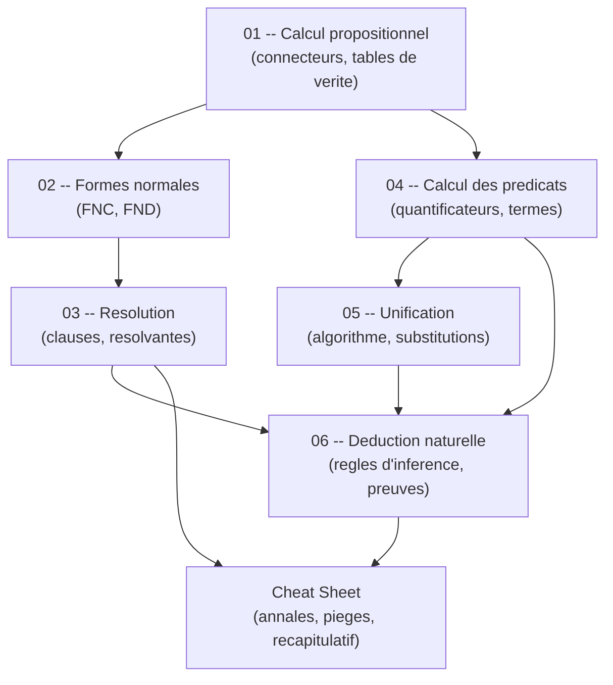

# Guide -- Propositions et Predicats (S6)

Bienvenue dans ce guide de logique formelle, concu pour etre accessible meme si tu pars de zero. L'objectif : te permettre de comprendre le calcul propositionnel, le calcul des predicats et les techniques de preuve utilisees en informatique, etape par etape, avec des explications claires et des exemples resolus en detail. Chaque chapitre est **autonome** -- tu peux les lire dans l'ordre ou sauter directement a celui qui t'interesse.

---

## Roadmap d'apprentissage

Voici l'ordre recommande pour progresser efficacement. Chaque etape s'appuie sur les precedentes.

> **Lecture du diagramme** : les fleches indiquent l'ordre logique. Le calcul propositionnel (01) est le socle de tout. Il mene d'un cote aux formes normales et a la resolution (02-03), de l'autre au calcul des predicats et a l'unification (04-05). La deduction naturelle (06) reunit les deux branches. La cheat sheet est le recapitulatif final pour preparer le DS.

---

## Prerequis

- **Savoir ce qu'est une proposition** -- une phrase qui est soit vraie, soit fausse (pas les deux).
- **Avoir un stylo et du papier** -- la logique s'apprend en ecrivant, pas en lisant passivement.
- **Aucun logiciel requis** -- tout se fait a la main dans ce cours.

Si tu sais que "il pleut" est vrai ou faux (mais pas les deux en meme temps), tu as le niveau requis.

---

## Comment utiliser ce guide

1. **Lis dans l'ordre** pour une progression naturelle, ou **saute directement** au chapitre qui t'interesse.
2. **Refais les exemples** a la main sur papier. La logique formelle exige de la rigueur -- recopier les etapes est le meilleur moyen de les comprendre.
3. **Les diagrammes Mermaid** sont rendus automatiquement sur GitHub et dans Obsidian. Si tu lis dans un autre editeur, installe une extension Mermaid.
4. **Ne memorise pas les regles mecaniquement** -- comprends d'abord pourquoi elles marchent, puis entraine-toi sur les exemples.

---

## Table des matieres

| # | Chapitre | Description |
|---|----------|-------------|
| 01 | [Calcul propositionnel](01_calcul_propositionnel.md) | Connecteurs logiques, tables de verite, tautologies et equivalences -- le socle de toute la logique. |
| 02 | [Formes normales](02_formes_normales.md) | Transformer une formule en FNC ou FND -- indispensable pour la resolution. |
| 03 | [Resolution](03_resolution.md) | Prouver des resultats par la methode des clauses et resolvantes. |
| 04 | [Calcul des predicats](04_calcul_predicats.md) | Quantificateurs, termes, formules et interpretations -- generaliser la logique. |
| 05 | [Unification](05_unification.md) | Algorithme d'unification et substitutions -- la brique technique cle. |
| 06 | [Deduction naturelle](06_deduction_naturelle.md) | Construire des preuves formelles avec les regles d'inference. |
| -- | [Cheat Sheet](cheat_sheet.md) | Recapitulatif complet, analyse des annales, types de questions, pieges frequents. |

---

## Structure d'un chapitre

Chaque chapitre suit la meme progression :

| Etape | Ce que tu y trouves |
|-------|---------------------|
| **Analogie** | Une situation concrete pour ancrer le concept. |
| **Intuition visuelle** | Un diagramme Mermaid pour visualiser l'idee avant toute formalisation. |
| **Explication progressive** | Le concept explique du plus simple au plus precis. |
| **Definitions et regles** | Les definitions formelles, introduites seulement quand l'intuition est en place. |
| **Exemples resolus** | Des exercices detailles pas a pas pour voir la methode en action. |
| **Pieges classiques** | Les erreurs frequentes et comment les eviter. |
| **Recapitulatif** | Un resume en quelques points pour reviser rapidement. |

> Cette structure est pensee pour que tu comprennes toujours le *pourquoi* avant le *comment*. Si une definition te bloque, reviens a l'analogie.
