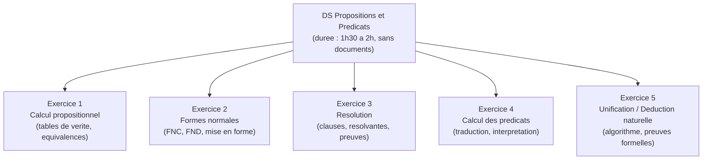

# Cheat Sheet -- Propositions et Predicats

> **Objectif :** Recapitulatif complet pour reviser avant le DS. Contient toutes les formules, regles, methodes et pieges en un seul endroit.

---

## 1. Structure typique d'un DS

D'apres l'analyse des annales (2013-2025), le DS de Propositions et Predicats a l'INSA Rennes suit generalement cette structure :



### Types de questions recurrents

| Type | Frequence | Points typiques |
|------|-----------|-----------------|
| Table de verite d'une formule | Tres frequent | 2-4 pts |
| Montrer qu'une formule est une tautologie | Tres frequent | 3-5 pts |
| Mise en FNC / FND | Tres frequent | 3-5 pts |
| Preuve par resolution | Frequent | 4-6 pts |
| Traduction francais -> logique du 1er ordre | Tres frequent | 3-5 pts |
| Evaluation d'une formule dans une interpretation | Frequent | 3-4 pts |
| Unification de deux termes | Frequent | 3-4 pts |
| Preuve en deduction naturelle | Frequent | 4-6 pts |
| Skolemisation / forme prenexe | Occasionnel | 2-3 pts |
| Satisfiabilite d'un ensemble de clauses | Occasionnel | 2-3 pts |

---

## 2. Connecteurs logiques -- Reference rapide

### Tables de verite

| p | q | ~p | p /\ q | p \/ q | p => q | p <=> q |
|---|---|-----|--------|--------|--------|---------|
| V | V | F | V | V | V | V |
| V | F | F | F | V | **F** | F |
| F | V | V | F | V | V | F |
| F | F | V | F | F | V | V |

**A retenir :** L'implication n'est fausse que dans UN cas : V => F.

### Priorite des connecteurs

```
~ (1, plus fort) > /\ (2) > \/ (3) > => (4) > <=> (5, plus faible)
```

---

## 3. Equivalences fondamentales -- Reference rapide

### A connaitre par coeur

```
Elimination =>     :  p => q        equiv  ~p \/ q
Elimination <=>    :  p <=> q       equiv  (p => q) /\ (q => p)
Contraposee        :  p => q        equiv  ~q => ~p
De Morgan          :  ~(p /\ q)     equiv  ~p \/ ~q
De Morgan          :  ~(p \/ q)     equiv  ~p /\ ~q
Double negation    :  ~~p            equiv  p
Distributivite     :  p /\ (q \/ r) equiv  (p /\ q) \/ (p /\ r)
Distributivite     :  p \/ (q /\ r) equiv  (p \/ q) /\ (p \/ r)
Absorption         :  p /\ (p \/ q) equiv  p
Absorption         :  p \/ (p /\ q) equiv  p
Idempotence        :  p /\ p        equiv  p
Idempotence        :  p \/ p        equiv  p
Complement         :  p /\ ~p       equiv  F
Complement         :  p \/ ~p       equiv  V
Element neutre     :  p /\ V = p    p \/ F = p
Element absorbant  :  p /\ F = F    p \/ V = V
Commutativite      :  p /\ q = q /\ p    p \/ q = q \/ p
Associativite      :  (p /\ q) /\ r = p /\ (q /\ r)
```

### Negation de l'implication

```
~(p => q)  equiv  p /\ ~q
```

Tres utile pour la resolution (etape de negation).

---

## 4. Formes normales -- Procedure rapide

### FNC (ET de OU)

```
1. Eliminer <=>  :  A <=> B  -->  (A => B) /\ (B => A)
2. Eliminer =>   :  A => B   -->  ~A \/ B
3. Descendre ~   :  De Morgan + double negation
4. Distribuer \/ sur /\  :  A \/ (B /\ C) --> (A \/ B) /\ (A \/ C)
```

### FND (OU de ET)

```
Etapes 1-3 : identiques a la FNC
4. Distribuer /\ sur \/  :  A /\ (B \/ C) --> (A /\ B) \/ (A /\ C)
```

### Via la table de verite

- **FND** : lignes a **V** -> monomes (variable si V, ~variable si F, relies par ET) -> relies par OU
- **FNC** : lignes a **F** -> clauses (~variable si V, variable si F, relies par OU) -> relies par ET

---

## 5. Resolution -- Procedure rapide

### Pour prouver une tautologie

```
1. Nier la formule
2. Mettre en FNC (ensemble de clauses)
3. Resoudre jusqu'a la clause vide
4. Clause vide = la formule est une tautologie
```

### Pour prouver A1, ..., An |= B

```
1. Prendre les clauses de A1, ..., An ET de ~B
2. Resoudre jusqu'a la clause vide
```

### Resolvante

```
C1 = {..., p, ...}     C2 = {..., ~p, ...}
Res(C1, C2) = (C1 \ {p}) union (C2 \ {~p})
```

**Regles :**
- Resoudre sur **un seul** litteral a la fois
- Ignorer les resolvantes tautologiques (contenant p et ~p)
- Eliminer les doublons dans une clause

---

## 6. Quantificateurs -- Reference rapide

### Negation des quantificateurs

```
~(pour tout x, P(x))   equiv   il existe x, ~P(x)
~(il existe x, P(x))   equiv   pour tout x, ~P(x)
```

### Traduction francais -> logique

| Phrase | Formule |
|--------|---------|
| "Tous les A sont B" | `pour tout x, (A(x) => B(x))` |
| "Certains A sont B" | `il existe x, (A(x) /\ B(x))` |
| "Aucun A n'est B" | `pour tout x, (A(x) => ~B(x))` |
| "Il existe un unique A qui est B" | `il existe x, (A(x) /\ B(x) /\ pour tout y, (A(y) /\ B(y) => y = x))` |

**Piege capital :**
- "Tous les A sont B" utilise **=>** (pas /\)
- "Certains A sont B" utilise **/\** (pas =>)

### Ordre des quantificateurs

```
il existe x, pour tout y, P(x,y)  ==>  pour tout y, il existe x, P(x,y)
```
Mais l'inverse est FAUX en general.

---

## 7. Forme prenexe et skolemisation -- Procedure rapide

### Forme prenexe

```
1. Eliminer <=> et =>
2. Descendre les negations (De Morgan + negation quantificateurs)
3. Renommer les variables liees (eviter conflits)
4. Sortir les quantificateurs vers le debut
```

### Skolemisation

```
- il existe x (sans pour tout avant) : remplacer x par une constante c
- pour tout y, il existe x : remplacer x par f(y) (fonction de Skolem)
- pour tout y, pour tout z, il existe x : remplacer x par f(y, z)
```

---

## 8. Unification -- Procedure rapide

### Algorithme

```
1. Comparer les deux expressions
2. Si identiques : retourner {}
3. Si l'une est une variable x :
   - Test d'occurrence : x dans l'autre ? -> ECHEC
   - Sinon : retourner {x <- autre}
4. Si meme symbole/predicat et meme arite :
   Unifier les arguments un par un (en appliquant chaque substitution)
5. Sinon : ECHEC
```

**Regles critiques :**
- **Test d'occurrence** : x ne peut pas etre remplace par un terme contenant x
- Appliquer **chaque substitution intermediaire** avant de continuer
- Le MGU est le resultat compose de toutes les substitutions intermediaires

---

## 9. Deduction naturelle -- Reference rapide

### Regles propositionnelles

| Regle | Premisses | Conclusion |
|-------|-----------|-----------|
| /\-I | A, B | A /\ B |
| /\-E1 | A /\ B | A |
| /\-E2 | A /\ B | B |
| \/-I1 | A | A \/ B |
| \/-I2 | B | A \/ B |
| \/-E | A \/ B, [A]->C, [B]->C | C |
| =>-I | [A]->B | A => B |
| =>-E | A, A => B | B |
| ~-I | [A]->_\|_ | ~A |
| ~-E | A, ~A | _\|_ |
| _\|_-E | _\|_ | A (n'importe quoi) |
| RAA | [~A]->_\|_ | A |

### Regles pour les quantificateurs

| Regle | Premisses | Conclusion | Condition |
|-------|-----------|-----------|-----------|
| pour tout-I | P(a) | pour tout x, P(x) | a frais |
| pour tout-E | pour tout x, P(x) | P(t) | t quelconque |
| il existe-I | P(t) | il existe x, P(x) | t quelconque |
| il existe-E | il existe x P(x), [P(a)]->C | C | a frais, a pas dans C |

### Strategie de base

1. **Regarder la conclusion** -> utiliser la regle d'introduction correspondante.
2. **Exploiter les hypotheses** -> utiliser les regles d'elimination.
3. **Pour =>** : supposer le cote gauche, montrer le cote droit.
4. **Pour ~** : supposer l'oppose, trouver une contradiction.
5. **Pour \/** : faire un raisonnement par cas.

---

## 10. Les 15 pieges les plus frequents en DS

### Calcul propositionnel

| # | Piege | Erreur frequente | Correction |
|---|-------|-----------------|------------|
| 1 | Implication avec premisse fausse | Penser que F => F = F | F => F = **V** (promesse non violee) |
| 2 | OU inclusif vs exclusif | Penser que V OU V = F | V OU V = **V** (OU inclusif) |
| 3 | Priorite des connecteurs | Lire ~p /\ q comme ~(p /\ q) | C'est (~p) /\ q |
| 4 | De Morgan incomplet | ~(p /\ q) = ~p /\ ~q | C'est ~p **\/** ~q (ET devient OU) |

### Formes normales

| # | Piege | Erreur frequente | Correction |
|---|-------|-----------------|------------|
| 5 | Confondre FNC et FND | "ET de ET" = FNC | FNC = ET de **OU** |
| 6 | Sauter des etapes | Distribuer avant d'eliminer => | Respecter l'ordre : <=>, =>, ~, distribution |
| 7 | Mauvaise distribution | A \/ (B /\ C) = (A \/ B) /\ C | C'est (A \/ B) /\ (A \/ C) |

### Resolution

| # | Piege | Erreur frequente | Correction |
|---|-------|-----------------|------------|
| 8 | Oublier la negation | Resoudre directement sans nier | Il faut d'abord NIER la formule a prouver |
| 9 | Resoudre sur 2 litteraux | Resoudre p et q en meme temps | Un seul litteral a la fois |
| 10 | Garder les doublons | Clause {p, p, q} | C'est {p, q} |

### Calcul des predicats

| # | Piege | Erreur frequente | Correction |
|---|-------|-----------------|------------|
| 11 | "Tous les A sont B" avec ET | pour tout x, A(x) /\ B(x) | pour tout x, A(x) **=>** B(x) |
| 12 | "Certains A sont B" avec => | il existe x, A(x) => B(x) | il existe x, A(x) **/\** B(x) |
| 13 | Ordre des quantificateurs | Intervertir pour tout et il existe | L'ordre change le sens ! |

### Unification et deduction

| # | Piege | Erreur frequente | Correction |
|---|-------|-----------------|------------|
| 14 | Oublier le test d'occurrence | {x <- f(x)} accepte | ECHEC (terme infini) |
| 15 | Modus ponens a l'envers | De B et A => B, deduire A | On ne peut PAS remonter l'implication |

---

## 11. Checklist avant de rendre le DS

```
[ ] Chaque table de verite a 2^n lignes (n variables)
[ ] Chaque equivalence utilisee est correcte (verifier De Morgan !)
[ ] La FNC est bien un ET de OU (pas un ET de ET)
[ ] La FND est bien un OU de ET (pas un OU de OU)
[ ] J'ai BIEN nie la formule avant d'appliquer la resolution
[ ] Je n'ai resolu que sur UN litteral a la fois
[ ] Les resolvantes tautologiques sont ignorees
[ ] "Tous les A sont B" utilise => (pas /\)
[ ] "Certains A sont B" utilise /\ (pas =>)
[ ] Le test d'occurrence est verifie pour chaque unification
[ ] Chaque substitution est appliquee avant de continuer
[ ] En deduction naturelle, chaque hypothese temporaire est dechargee
[ ] Les variables fraiches (pour tout-I, il existe-E) ne sont pas dans les hypotheses
[ ] Chaque ligne de la preuve est justifiee (regle + numeros de lignes)
```

---

## 12. Formules a connaitre pour le DS

### Tautologies classiques

```
Tiers exclu            :  p \/ ~p
Non-contradiction      :  ~(p /\ ~p)
Modus ponens           :  (p /\ (p => q)) => q
Modus tollens          :  ((p => q) /\ ~q) => ~p
Syllogisme hypothetique:  ((p => q) /\ (q => r)) => (p => r)
Contraposee            :  (p => q) <=> (~q => ~p)
Exportation            :  ((p /\ q) => r) <=> (p => (q => r))
Loi de Peirce          :  ((p => q) => p) => p  (classique)
```

### Equivalences des quantificateurs (De Morgan generalise)

```
~(pour tout x, P(x))  equiv  il existe x, ~P(x)
~(il existe x, P(x))  equiv  pour tout x, ~P(x)
```

### Distributivite des quantificateurs (ATTENTION : pas toujours valide)

```
VALIDE :
  pour tout x, (P(x) /\ Q(x))  equiv  (pour tout x, P(x)) /\ (pour tout x, Q(x))
  il existe x, (P(x) \/ Q(x))  equiv  (il existe x, P(x)) \/ (il existe x, Q(x))

NON VALIDE :
  pour tout x, (P(x) \/ Q(x))  PAS equiv  (pour tout x, P(x)) \/ (pour tout x, Q(x))
  il existe x, (P(x) /\ Q(x))  PAS equiv  (il existe x, P(x)) /\ (il existe x, Q(x))
```

---

## 13. Conseils de gestion du temps

| Exercice | Temps recommande | Conseil |
|----------|-----------------|---------|
| Table de verite | 5-10 min | Methode mecanique, va vite mais verifie bien |
| Equivalences / tautologie | 10-15 min | Utilise les equivalences connues, pas besoin de tout recalculer |
| Formes normales | 10-15 min | Suis les 4 etapes dans l'ordre, ne saute rien |
| Resolution | 15-20 min | Commence par les clauses unitaires |
| Traduction en predicats | 10-15 min | Relis la phrase 2 fois avant de formaliser |
| Unification | 10-15 min | Sois methodique, note chaque substitution |
| Deduction naturelle | 15-20 min | Pars de la conclusion, travaille a rebours |

> **Total :** environ 1h30-2h. Si tu bloques sur un exercice, passe au suivant et reviens-y a la fin.
