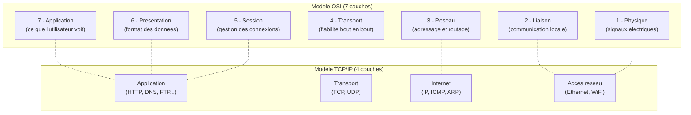
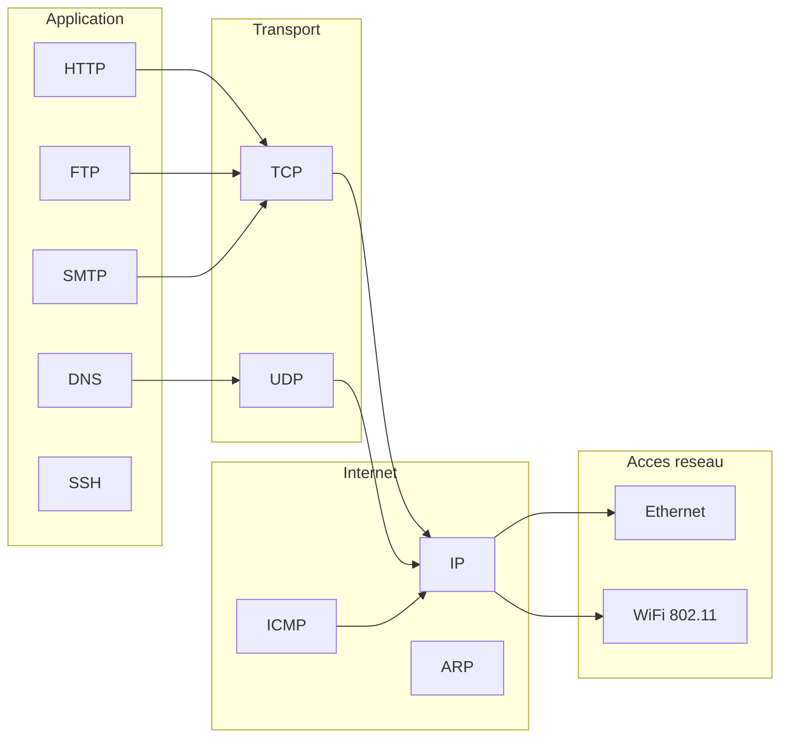
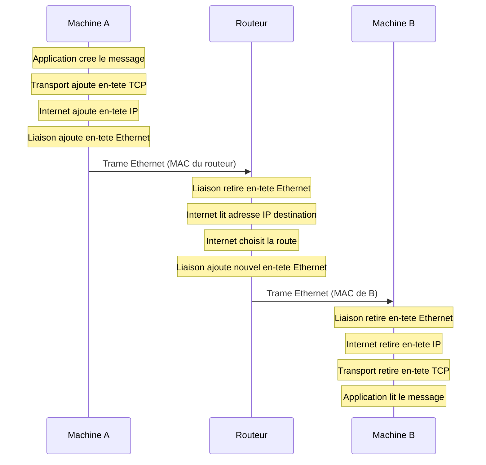

# 01 -- Modele OSI et TCP/IP

## Analogie : le systeme postal

Imagine que tu veuilles envoyer un colis a un ami a l'autre bout de la France. Tu ne vas pas marcher jusqu'a chez lui avec le paquet sous le bras. A la place, tu passes par un **systeme organise en etapes** :

1. Tu **ecris ta lettre** (le contenu, le message).
2. Tu la **mets dans une enveloppe** avec l'adresse du destinataire.
3. Tu **deposes l'enveloppe au bureau de poste**.
4. Le bureau de poste **trie le courrier** et l'envoie au centre de tri regional.
5. Le centre de tri **achemine** le courrier vers le bon departement.
6. Le facteur local **livre** la lettre dans la boite aux lettres de ton ami.

Chaque etape a un role precis. Personne ne fait tout : le facteur ne trie pas le courrier national, et le centre de tri ne sonne pas aux portes. C'est exactement comme ca que fonctionnent les reseaux informatiques : chaque **couche** a une responsabilite bien definie.

---

## Intuition visuelle



> Le modele OSI est un modele **theorique** en 7 couches. Le modele TCP/IP est le modele **pratique** utilise sur Internet, avec 4 couches. Les deux decrivent la meme realite, mais TCP/IP fusionne certaines couches.

---

## Explication progressive

### Pourquoi des couches ?

Imagine un monde sans couches : chaque application devrait savoir comment transformer des donnees en signaux electriques, gerer les erreurs de transmission, trouver le chemin a travers le reseau, etc. Ce serait un cauchemar a developper et a maintenir.

Les couches resolvent ce probleme par la **separation des responsabilites** :

- Chaque couche fournit un **service** a la couche du dessus.
- Chaque couche utilise les **services** de la couche du dessous.
- Chaque couche ne connait que ses voisines directes.

C'est comme une chaine de montage : chaque ouvrier fait sa tache sans se soucier du travail des autres.

### Le modele OSI en detail

Le modele OSI (Open Systems Interconnection) a ete defini par l'ISO en 1984. Il decoupe la communication en **7 couches** :

#### Couche 7 -- Application

C'est la couche que tu utilises directement. Quand tu ouvres un navigateur web, tu interagis avec la couche application.

- **Protocoles** : HTTP (web), SMTP (email), FTP (transfert de fichiers), DNS (noms de domaine)
- **Role** : fournir des services reseau aux utilisateurs et aux programmes
- **Analogie postale** : c'est le contenu de ta lettre

#### Couche 6 -- Presentation

Elle s'occupe du **format** des donnees : encodage, compression, chiffrement.

- **Role** : traduire les donnees entre le format de l'application et le format reseau
- **Exemples** : conversion ASCII/Unicode, compression JPEG, chiffrement SSL/TLS
- **Analogie postale** : c'est la langue dans laquelle tu ecris ta lettre

#### Couche 5 -- Session

Elle gere l'**ouverture**, le **maintien** et la **fermeture** des sessions de communication.

- **Role** : synchroniser les echanges, gerer les points de reprise
- **Analogie postale** : c'est le fait de maintenir une correspondance suivie avec quelqu'un (tu sais ou tu en es dans la conversation)

> **Note importante** : en pratique, les couches 5, 6 et 7 sont souvent fusionnees. Dans le modele TCP/IP, elles forment une seule couche "Application". En DS, on te demandera rarement de distinguer les couches 5 et 6.

#### Couche 4 -- Transport

C'est la couche qui assure la **fiabilite** de la communication de bout en bout.

- **Protocoles** : TCP (fiable, ordonne), UDP (rapide, sans garantie)
- **Role** : decouper les donnees en segments, gerer la retransmission, le controle de flux
- **Unite de donnees** : **segment** (TCP) ou **datagramme** (UDP)
- **Analogie postale** : c'est le recommande avec accuse de reception (TCP) ou le courrier simple (UDP)

#### Couche 3 -- Reseau

C'est la couche qui permet de **trouver le chemin** entre deux machines, meme si elles sont sur des reseaux differents.

- **Protocoles** : IP (adressage), ICMP (diagnostics), ARP (resolution d'adresses)
- **Role** : adressage logique, routage, fragmentation
- **Unite de donnees** : **paquet**
- **Analogie postale** : c'est le code postal et le systeme de tri qui determine par ou transite ta lettre

#### Couche 2 -- Liaison de donnees

Elle gere la communication **entre deux machines directement connectees** (sur le meme reseau local).

- **Protocoles** : Ethernet, WiFi (802.11), PPP
- **Role** : adressage physique (MAC), detection d'erreurs, controle d'acces au medium
- **Unite de donnees** : **trame** (frame)
- **Analogie postale** : c'est le facteur qui livre dans ton quartier -- il ne connait que les adresses locales

#### Couche 1 -- Physique

C'est le monde des **signaux** : electricite, lumiere, ondes radio.

- **Role** : transmettre des bits bruts sur un support physique
- **Exemples** : cables Ethernet (cuivre), fibre optique (lumiere), WiFi (ondes radio)
- **Unite de donnees** : **bit**
- **Analogie postale** : c'est le camion qui transporte physiquement le courrier

### Le modele TCP/IP : la version pratique

Le modele TCP/IP (aussi appele modele Internet) est ne **avant** le modele OSI. C'est celui qui est reellement utilise sur Internet. Il ne comporte que **4 couches** :

| Couche TCP/IP | Correspond a (OSI) | Protocoles principaux |
|---------------|--------------------|-----------------------|
| Application | Couches 5, 6, 7 | HTTP, DNS, FTP, SMTP, SSH |
| Transport | Couche 4 | TCP, UDP |
| Internet | Couche 3 | IP, ICMP, ARP |
| Acces reseau | Couches 1, 2 | Ethernet, WiFi, PPP |

**Pourquoi 4 au lieu de 7 ?** Parce que les concepteurs de TCP/IP ont juge que les distinctions entre les couches 5, 6, 7 d'un cote, et 1, 2 de l'autre, etaient inutiles en pratique. Ce qui compte, c'est ce qui se passe a chaque grande etape.

---

## L'encapsulation : le concept central

L'encapsulation est **le** concept le plus important pour comprendre les reseaux. Chaque couche ajoute son propre **en-tete** (header) aux donnees avant de les passer a la couche du dessous.

```
Couche Application :  [Donnees]
                        |
                        v
Couche Transport :    [En-tete TCP][Donnees]
                        |            = segment
                        v
Couche Internet :     [En-tete IP][En-tete TCP][Donnees]
                        |                        = paquet
                        v
Couche Acces reseau : [En-tete Ethernet][En-tete IP][En-tete TCP][Donnees][FCS]
                                                                           = trame
```

**A la reception**, c'est l'inverse : chaque couche retire son en-tete et passe le reste a la couche du dessus. C'est la **desencapsulation**.

### Analogie de l'encapsulation

C'est comme les poupees russes (matriochkas) :

1. Tu ecris ton message sur un papier (donnees).
2. Tu le mets dans une petite enveloppe avec le numero de port (segment TCP).
3. Tu mets cette enveloppe dans une enveloppe moyenne avec l'adresse IP (paquet IP).
4. Tu mets le tout dans une grande enveloppe avec l'adresse MAC (trame Ethernet).

Chaque couche d'enveloppe contient les informations necessaires pour cette etape du transport.

---

## Les noms des unites de donnees

Un piege classique en DS : les unites de donnees changent de nom a chaque couche.

| Couche | Nom de l'unite | Exemple |
|--------|---------------|---------|
| Application | Donnees / Message | Page HTML, requete DNS |
| Transport | Segment (TCP) / Datagramme (UDP) | Segment TCP avec port 80 |
| Reseau / Internet | Paquet | Paquet IP avec adresse destination |
| Liaison / Acces reseau | Trame (frame) | Trame Ethernet avec adresse MAC |
| Physique | Bit | Signal electrique 0 ou 1 |

> **Astuce memoire** : Du haut vers le bas, pense a "**D**onnees, **S**egment, **P**aquet, **T**rame, **B**it" -- "**Des Segments de Paquets Traversent des Bits**".

---

## Protocoles cles par couche



### Quel protocole utilise quoi ?

| Protocole applicatif | Transport | Port standard |
|---------------------|-----------|---------------|
| HTTP | TCP | 80 |
| HTTPS | TCP | 443 |
| DNS | UDP (et TCP) | 53 |
| FTP | TCP | 20, 21 |
| SSH | TCP | 22 |
| SMTP | TCP | 25 |
| POP3 | TCP | 110 |
| IMAP | TCP | 143 |

---

## Communication entre deux machines

Quand une machine A envoie un message a une machine B sur un autre reseau, voici ce qui se passe :



**Point cle** : l'adresse IP reste la meme de bout en bout. L'adresse MAC change a chaque saut (hop). C'est une distinction fondamentale.

---

## OSI vs TCP/IP : les differences

| Critere | Modele OSI | Modele TCP/IP |
|---------|-----------|---------------|
| Nombre de couches | 7 | 4 |
| Origine | ISO (1984) | DARPA (1970s) |
| Approche | Theorique d'abord | Pratique d'abord |
| Couches 5-6-7 | Separees | Fusionnees en "Application" |
| Couches 1-2 | Separees | Fusionnees en "Acces reseau" |
| Usage reel | Reference pedagogique | Utilise sur Internet |
| Protocoles | Aucun impose | TCP, IP, etc. integres |

**En DS** : on te demande souvent de placer un protocole dans la bonne couche. Retiens le modele TCP/IP (4 couches) pour le cote pratique, et le modele OSI (7 couches) pour le vocabulaire.

---

## Pieges classiques

### Piege 1 : confondre couche et protocole

La couche est un **niveau d'abstraction**. Le protocole est une **regle de communication** qui opere a un certain niveau. Exemple : IP est un protocole de la couche reseau (ou couche Internet en TCP/IP).

### Piege 2 : penser que le modele OSI est utilise sur Internet

Non. Internet utilise TCP/IP. Le modele OSI est un cadre theorique de reference. On l'utilise pour decrire et enseigner, pas pour implementer.

### Piege 3 : oublier que l'adresse MAC change a chaque saut

L'adresse IP identifie la machine de bout en bout. L'adresse MAC identifie le prochain maillon de la chaine. Quand un paquet traverse un routeur, l'en-tete Ethernet est completement reconstruit.

### Piege 4 : confondre segment, paquet et trame

- **Segment** = couche transport (TCP/UDP)
- **Paquet** = couche reseau (IP)
- **Trame** = couche liaison (Ethernet)

Ces trois mots designent des unites de donnees a des niveaux differents. Un segment est encapsule dans un paquet, qui est encapsule dans une trame.

### Piege 5 : croire que ARP est un protocole de couche 3

ARP (Address Resolution Protocol) est souvent place a la frontiere entre les couches 2 et 3. Dans le modele TCP/IP, il est dans la couche Internet. En OSI, il est parfois place en couche 2. En DS, precise le modele que tu utilises.

---

## Recapitulatif

1. **Les reseaux sont organises en couches** -- chaque couche a un role precis et communique uniquement avec ses voisines.

2. **Le modele OSI a 7 couches** (Application, Presentation, Session, Transport, Reseau, Liaison, Physique) -- c'est le modele theorique de reference.

3. **Le modele TCP/IP a 4 couches** (Application, Transport, Internet, Acces reseau) -- c'est le modele reel utilise sur Internet.

4. **L'encapsulation** est le mecanisme central : chaque couche ajoute son en-tete aux donnees avant de les transmettre.

5. **Les unites de donnees changent de nom** a chaque couche : donnees, segment, paquet, trame, bit.

6. **L'adresse IP est de bout en bout**, l'adresse MAC est locale (change a chaque saut).

7. **Chaque protocole appartient a une couche** : HTTP (application), TCP (transport), IP (internet), Ethernet (acces reseau).
