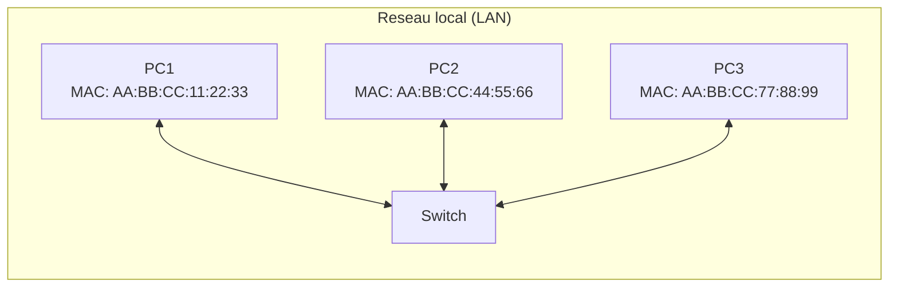
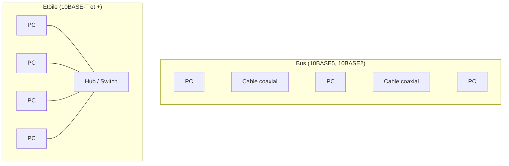
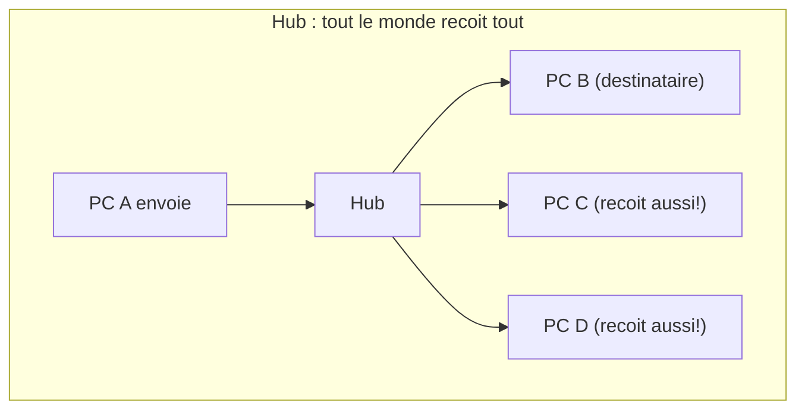
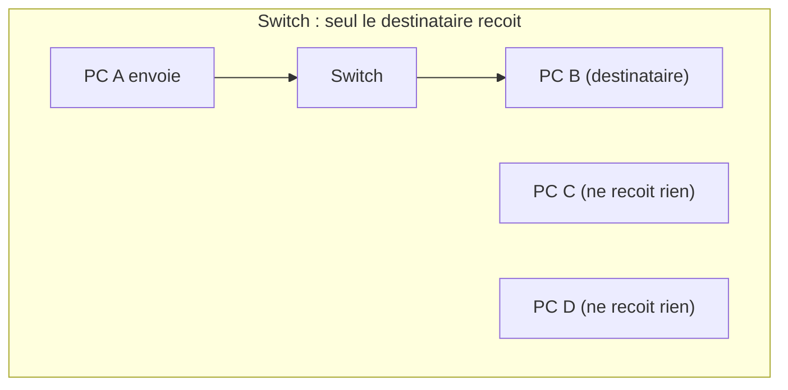
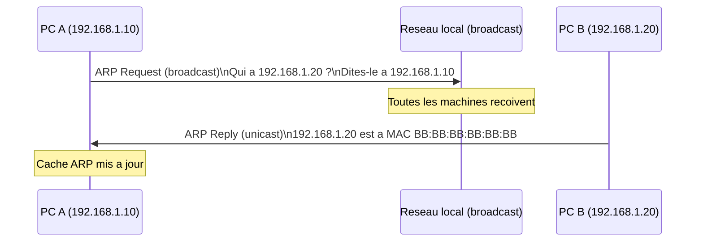

# 02 -- Ethernet et la couche liaison

## Analogie : le bureau open space

Imagine un grand bureau open space ou tout le monde travaille dans la meme piece. Quand tu veux parler a ton collegue, tu as deux options :

1. **Crier dans la piece** : tout le monde entend, mais seul ton collegue se sent concerne (c'est le **broadcast**).
2. **Appeler par son nom** : tu dis "Eh, Marie !", et seule Marie reagit (c'est la communication **dirigee**).

Maintenant, si tout le monde parle en meme temps, personne ne comprend rien (c'est une **collision**). Il faut donc des regles : attendre son tour, reecouter si quelqu'un parle deja, etc.

Ethernet, c'est exactement ca : un ensemble de regles pour que des machines connectees au meme reseau local puissent communiquer sans se marcher dessus.

---

## Intuition visuelle



> Un reseau Ethernet relie des machines via un **switch** (commutateur). Chaque machine est identifiee par son **adresse MAC**, un identifiant unique grave dans sa carte reseau.

---

## Explication progressive

### Qu'est-ce qu'Ethernet ?

Ethernet est le protocole de **couche 2** (liaison de donnees) le plus utilise au monde pour les reseaux locaux (LAN). Il a ete invente en 1973 par Robert Metcalfe chez Xerox PARC.

Son role : permettre a des machines sur le **meme reseau physique** de s'echanger des donnees de maniere ordonnee.

### L'adresse MAC

Chaque carte reseau (interface Ethernet, WiFi) possede une **adresse MAC** (Media Access Control) :

- **Taille** : 6 octets (48 bits)
- **Format** : `AA:BB:CC:DD:EE:FF` (6 groupes de 2 chiffres hexadecimaux)
- **Unicite** : normalement unique au monde (attribuee par le fabricant)
- **Gravee en dur** : ecrite dans la carte reseau a la fabrication (mais modifiable par logiciel)

**Structure de l'adresse MAC :**

```
AA : BB : CC : DD : EE : FF
|           |  |            |
+--- OUI ---+  +--- NIC ----+
(fabricant)    (interface unique)
```

- **OUI** (Organizationally Unique Identifier) : les 3 premiers octets identifient le fabricant.
- **NIC** : les 3 derniers octets identifient l'interface specifique.

**Adresses speciales :**

| Adresse | Signification |
|---------|---------------|
| `FF:FF:FF:FF:FF:FF` | Broadcast -- tous les hotes du reseau local |
| `01:xx:xx:xx:xx:xx` | Multicast (bit de poids faible du premier octet = 1) |
| `00:00:00:00:00:00` | Adresse nulle (non attribuee) |

**Commandes pour voir ton adresse MAC :**

```bash
# Linux
ip link show
ifconfig

# Windows
ipconfig /all
```

---

### La trame Ethernet

La trame (frame) est l'unite de donnees de la couche 2. C'est le "colis" qui circule sur le cable.

**Structure de la trame Ethernet II (la plus courante) :**

```
+----------+----------+------+---------+-----+
| Dest MAC | Src MAC  | Type | Payload | FCS |
| 6 octets | 6 octets | 2 o  | 46-1500 | 4 o |
+----------+----------+------+---------+-----+
```

| Champ | Taille | Description |
|-------|--------|-------------|
| Preambule | 7 octets | Synchronisation (101010...10) -- pas toujours compte |
| SFD (Start Frame Delimiter) | 1 octet | Marque le debut de la trame (10101011) |
| Destination MAC | 6 octets | Adresse MAC du destinataire |
| Source MAC | 6 octets | Adresse MAC de l'emetteur |
| EtherType / Length | 2 octets | Type du protocole encapsule (ex: 0x0800 = IPv4) |
| Payload (donnees) | 46 a 1500 octets | Les donnees transportees (paquet IP, etc.) |
| FCS (Frame Check Sequence) | 4 octets | Code de detection d'erreurs (CRC-32) |

**Valeurs EtherType courantes :**

| Valeur | Protocole |
|--------|-----------|
| 0x0800 | IPv4 |
| 0x0806 | ARP |
| 0x86DD | IPv6 |
| 0x8100 | VLAN (802.1Q) |

**Taille totale :**
- Minimum : 64 octets (14 en-tete + 46 donnees + 4 FCS)
- Maximum : 1518 octets (14 en-tete + 1500 donnees + 4 FCS)
- Le **MTU** (Maximum Transmission Unit) d'Ethernet est de **1500 octets** (taille max des donnees).

> **Pourquoi un minimum de 46 octets de donnees ?** Pour garantir que la trame soit assez longue pour que les collisions soient detectees (en Ethernet classique). Si les donnees font moins de 46 octets, on ajoute du **padding** (bourrage).

---

### Topologies Ethernet

L'evolution d'Ethernet a connu plusieurs topologies :



| Topologie | Support | Debit | Epoque |
|-----------|---------|-------|--------|
| Bus (10BASE5) | Cable coaxial epais | 10 Mbit/s | 1980s |
| Bus (10BASE2) | Cable coaxial fin | 10 Mbit/s | 1980s |
| Etoile (10BASE-T) | Paire torsadee + hub | 10 Mbit/s | 1990s |
| Etoile (100BASE-TX) | Paire torsadee + switch | 100 Mbit/s | Late 1990s |
| Etoile (1000BASE-T) | Paire torsadee + switch | 1 Gbit/s | 2000s |
| Etoile (10GBASE-T) | Paire torsadee Cat6a | 10 Gbit/s | 2010s |

Aujourd'hui, quasiment tous les reseaux Ethernet utilisent une **topologie en etoile** avec un **switch** au centre.

---

### Hub vs Switch : la difference cruciale

#### Le Hub (concentrateur)

- Recoit une trame sur un port.
- **Recopie** la trame sur **tous** les autres ports.
- Tous les hotes recoivent tout -- meme les trames qui ne les concernent pas.
- **Domaine de collision** : tous les ports partagent le meme domaine. Si deux machines emettent en meme temps, il y a collision.
- **Obsolete** aujourd'hui.

#### Le Switch (commutateur)

- Recoit une trame sur un port.
- Lit l'**adresse MAC destination**.
- Envoie la trame **uniquement** sur le port ou se trouve le destinataire.
- **Domaine de collision** : chaque port a son propre domaine. Pas de collision entre ports differents.
- **Table MAC** : le switch maintient une table qui associe chaque adresse MAC au port correspondant.





#### Apprentissage de la table MAC du switch

Le switch apprend automatiquement quelle machine est sur quel port :

1. PC A envoie une trame. Le switch note : "MAC de A = port 1".
2. La destination est inconnue ? Le switch envoie la trame sur **tous** les ports (flood).
3. Quand le destinataire repond, le switch note aussi son port.
4. Desormais, les trames entre A et B vont directement au bon port.

**Expiration** : les entrees de la table MAC expirent apres un certain temps (typiquement 300 secondes) si aucun trafic n'est vu.

---

### CSMA/CD : la gestion des collisions

Sur un reseau Ethernet classique (avec hub ou bus), les collisions sont possibles. Le protocole **CSMA/CD** (Carrier Sense Multiple Access with Collision Detection) gere ca :

1. **Carrier Sense** : avant d'emettre, la machine ecoute le cable. Si quelqu'un parle, elle attend.
2. **Multiple Access** : plusieurs machines partagent le meme support.
3. **Collision Detection** : si deux machines emettent en meme temps, elles detectent la collision.
4. **Backoff** : apres une collision, chaque machine attend un temps aleatoire avant de reessayer.

**Algorithme de backoff exponentiel :**

Apres la n-ieme collision consecutive :
- Choisir un nombre aleatoire k entre 0 et 2^n - 1 (avec n plafonne a 10)
- Attendre k * temps de slot (51.2 microsecondes pour 10 Mbit/s)
- Apres 16 collisions consecutives, abandonner

> **Important** : avec les switches modernes en full-duplex, **il n'y a plus de collisions**. CSMA/CD est desactive. Mais c'est un classique d'examen.

---

### ARP : le lien entre IP et MAC

ARP (Address Resolution Protocol) fait le pont entre la couche 3 (adresses IP) et la couche 2 (adresses MAC). Quand une machine veut envoyer un paquet IP a une adresse IP locale, elle a besoin de l'adresse MAC correspondante.

**Fonctionnement :**



**Structure du paquet ARP :**

| Champ | Taille | Description |
|-------|--------|-------------|
| Hardware Type | 2 octets | 1 = Ethernet |
| Protocol Type | 2 octets | 0x0800 = IPv4 |
| Hardware Size | 1 octet | 6 (longueur adresse MAC) |
| Protocol Size | 1 octet | 4 (longueur adresse IPv4) |
| Opcode | 2 octets | 1 = Request, 2 = Reply |
| Sender MAC | 6 octets | Adresse MAC de l'emetteur |
| Sender IP | 4 octets | Adresse IP de l'emetteur |
| Target MAC | 6 octets | Adresse MAC cible (00:00:00:00:00:00 si inconnu) |
| Target IP | 4 octets | Adresse IP cible |

**Le cache ARP :**

Pour eviter de faire une requete ARP a chaque paquet, les machines gardent un **cache** des associations IP-MAC qu'elles ont appris :

```bash
# Voir le cache ARP
arp -a

# Exemple de sortie :
# 192.168.1.1    ether   0c:70:4a:f8:8a:47   C   eth0
# 192.168.1.20   ether   bb:bb:bb:bb:bb:bb   C   eth0
```

Les entrees du cache ARP expirent typiquement apres quelques minutes.

---

### VLAN : segmenter un reseau

Un **VLAN** (Virtual LAN) permet de creer des reseaux locaux virtuels sur un meme switch physique.

**Pourquoi ?**
- **Securite** : isoler les groupes (ex: comptabilite vs developpement)
- **Performance** : limiter le domaine de broadcast
- **Flexibilite** : regrouper des machines sans tenir compte de leur emplacement physique

**Fonctionnement :**
- Chaque port du switch est assigne a un VLAN.
- Les machines d'un VLAN ne peuvent communiquer qu'avec les machines du meme VLAN.
- Pour communiquer entre VLANs, il faut un **routeur** (routage inter-VLAN).

**802.1Q (tagging) :**

Quand une trame doit traverser un lien entre deux switches (lien trunk), un tag VLAN est ajoute dans l'en-tete Ethernet :

```
+----------+----------+--------+------+---------+-----+
| Dest MAC | Src MAC  | 802.1Q | Type | Payload | FCS |
| 6 octets | 6 octets | 4 oct  | 2 o  | 46-1500 | 4 o |
+----------+----------+--------+------+---------+-----+
                         |
                    +---------+
                    | TPID    | 2 octets (0x8100)
                    | TCI     | 2 octets (priorite + VLAN ID)
                    +---------+
```

Le VLAN ID est code sur 12 bits, ce qui permet jusqu'a **4096 VLANs** differents (0 a 4095).

---

## Schemas protocoles : parcours complet d'une trame

Voici ce qui se passe quand PC A (192.168.1.10, MAC AA) veut communiquer avec PC B (192.168.1.20, MAC BB) sur le meme reseau local :

**Etape 1 : Resolution ARP (si necessaire)**
```
PC A ne connait pas la MAC de 192.168.1.20
--> ARP Request en broadcast (FF:FF:FF:FF:FF:FF)
<-- ARP Reply de PC B avec sa MAC (BB:BB:BB:BB:BB:BB)
```

**Etape 2 : Construction de la trame**
```
+----------------+----------------+--------+------------+--------+-----+
| Dest MAC: BB   | Src MAC: AA    | 0x0800 | Paquet IP  | Donnees| FCS |
+----------------+----------------+--------+------------+--------+-----+
```

**Etape 3 : Transmission via le switch**
```
PC A --> [port 1] Switch [port 3] --> PC B
         (table MAC : AA=port1, BB=port3)
```

---

## Pieges classiques

### Piege 1 : confondre adresse MAC et adresse IP

- **MAC** = adresse physique, locale, 6 octets, ne change pas (normalement)
- **IP** = adresse logique, routable, 4 octets (IPv4), peut changer

L'adresse MAC sert a la communication **locale** (sur le meme reseau). L'adresse IP sert a la communication **globale** (entre reseaux).

### Piege 2 : oublier le broadcast ARP

ARP Request est envoye en **broadcast** Ethernet (FF:FF:FF:FF:FF:FF). ARP Reply est envoye en **unicast** (directement a celui qui a demande). Cette asymetrie est souvent un piege en DS.

### Piege 3 : croire qu'un switch est la meme chose qu'un routeur

- **Switch** = couche 2, utilise les adresses MAC, travaille au sein d'un reseau local.
- **Routeur** = couche 3, utilise les adresses IP, connecte des reseaux differents.

Un switch ne regarde jamais l'adresse IP. Un routeur ne regarde jamais l'adresse MAC (sauf pour construire la trame de la couche du dessous).

### Piege 4 : oublier le padding Ethernet

Si les donnees font moins de 46 octets, Ethernet ajoute du padding pour atteindre la taille minimale de 64 octets (trame complete). En analyse Wireshark, on peut voir des octets "0x00" ajoutes a la fin.

### Piege 5 : confondre hub et switch

Le **hub** envoie tout a tout le monde (couche 1). Le **switch** envoie au bon port grace a sa table MAC (couche 2). Aujourd'hui, les hubs n'existent plus, mais la distinction est un classique d'examen.

---

## Recapitulatif

1. **Ethernet** est le protocole de couche 2 dominant pour les reseaux locaux. Il gere la communication entre machines directement connectees.

2. **L'adresse MAC** (6 octets, format AA:BB:CC:DD:EE:FF) identifie de maniere unique chaque carte reseau. Le broadcast MAC est `FF:FF:FF:FF:FF:FF`.

3. **La trame Ethernet** contient : MAC destination, MAC source, EtherType, donnees (46-1500 octets), FCS. Taille minimale : 64 octets, maximale : 1518 octets.

4. **Le switch** apprend les adresses MAC et envoie les trames uniquement au bon port. Le hub (obsolete) envoyait tout a tout le monde.

5. **CSMA/CD** gere les collisions sur les reseaux partages (bus, hub). Avec les switches full-duplex, plus de collisions.

6. **ARP** resout les adresses IP en adresses MAC. ARP Request = broadcast, ARP Reply = unicast.

7. **Les VLANs** permettent de segmenter un reseau physique en plusieurs reseaux logiques. Le tag 802.1Q identifie le VLAN dans la trame.

8. **Le MTU** d'Ethernet est de 1500 octets. Les trames trop petites sont completees par du padding.
