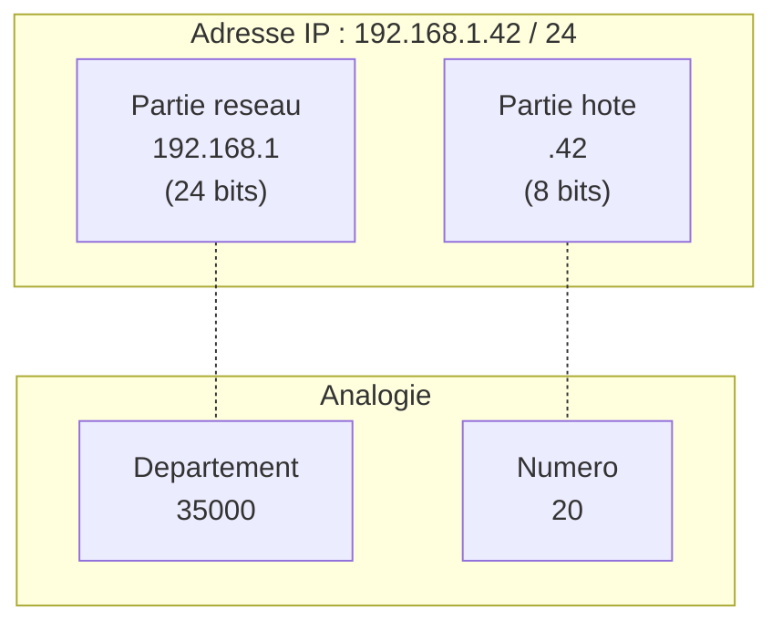

# 03 -- Adressage IP et sous-reseaux

## Analogie : le systeme d'adresses postales

Imagine le systeme postal francais. Chaque adresse a une structure hierarchique :

- **Le pays** : France
- **Le departement** : 35 (Ille-et-Vilaine)
- **La ville** : Rennes
- **La rue et le numero** : 20 avenue des Buttes de Coesmes

Cette structure permet au systeme postal de trier le courrier efficacement : d'abord par pays, puis par departement, puis par ville, puis par rue.

Les adresses IP fonctionnent exactement pareil : une partie identifie le **reseau** (comme le departement) et une autre partie identifie la **machine** dans ce reseau (comme le numero de rue). C'est cette separation qui permet aux routeurs de prendre leurs decisions rapidement.

---

## Intuition visuelle



> L'adresse IP 192.168.1.42 avec un masque /24 signifie : le reseau est 192.168.1.0 et la machine est le numero 42 dans ce reseau.

---

## Explication progressive

### Qu'est-ce qu'une adresse IPv4 ?

Une adresse IPv4 est un nombre de **32 bits** (4 octets) qui identifie de maniere unique une interface reseau sur un reseau IP.

**Format decimal pointe :**
```
192.168.1.42
```

Chaque nombre represente un octet (8 bits), donc chaque nombre va de **0 a 255**.

**Representation binaire :**
```
192     . 168     . 1       . 42
11000000. 10101000. 00000001. 00101010
```

**Conversion decimal <--> binaire :**

Pour convertir 192 en binaire :
```
192 / 2 = 96  reste 0
 96 / 2 = 48  reste 0
 48 / 2 = 24  reste 0
 24 / 2 = 12  reste 0
 12 / 2 = 6   reste 0
  6 / 2 = 3   reste 0
  3 / 2 = 1   reste 1
  1 / 2 = 0   reste 1
--> Lire les restes de bas en haut : 11000000
```

**Astuce rapide** : retiens les puissances de 2 pour un octet :

| Position | 7 | 6 | 5 | 4 | 3 | 2 | 1 | 0 |
|----------|---|---|---|---|---|---|---|---|
| Valeur | 128 | 64 | 32 | 16 | 8 | 4 | 2 | 1 |

Pour 192 : 128 + 64 = 192, donc `11000000`.

---

### Le masque de sous-reseau

Le masque determine ou finit la partie **reseau** et ou commence la partie **hote** dans une adresse IP.

**Exemple avec le masque 255.255.255.0 :**

```
Adresse IP : 192.168.1.42    = 11000000.10101000.00000001.00101010
Masque     : 255.255.255.0   = 11111111.11111111.11111111.00000000
                                |--- partie reseau ---||- hote -|
```

- Les bits a **1** dans le masque = partie reseau
- Les bits a **0** dans le masque = partie hote

**Notation CIDR** : au lieu d'ecrire le masque complet, on ecrit le nombre de bits a 1 apres un slash :

| Masque | CIDR | Bits reseau | Bits hote |
|--------|------|-------------|-----------|
| 255.0.0.0 | /8 | 8 | 24 |
| 255.255.0.0 | /16 | 16 | 16 |
| 255.255.255.0 | /24 | 24 | 8 |
| 255.255.255.128 | /25 | 25 | 7 |
| 255.255.255.192 | /26 | 26 | 6 |
| 255.255.255.224 | /27 | 27 | 5 |
| 255.255.255.240 | /28 | 28 | 4 |
| 255.255.255.248 | /29 | 29 | 3 |
| 255.255.255.252 | /30 | 30 | 2 |

> **Astuce** : le masque est toujours une suite de 1 suivie d'une suite de 0. Jamais de 1 isoles au milieu des 0.

---

### Adresse reseau et adresse de broadcast

Pour chaque sous-reseau, deux adresses sont reservees :

- **Adresse reseau** : tous les bits hote a 0 (premiere adresse)
- **Adresse de broadcast** : tous les bits hote a 1 (derniere adresse)

**Exemple : 192.168.1.42/24**

```
Adresse IP       : 192.168.1.42       = 11000000.10101000.00000001.00101010
Masque           : 255.255.255.0      = 11111111.11111111.11111111.00000000

Adresse reseau   : 192.168.1.0        = 11000000.10101000.00000001.00000000
                    (bits hote tous a 0)

Broadcast        : 192.168.1.255      = 11000000.10101000.00000001.11111111
                    (bits hote tous a 1)

Premiere hote    : 192.168.1.1
Derniere hote    : 192.168.1.254
Nombre d'hotes   : 254 (= 2^8 - 2)
```

**Formule generale** : pour un masque /n, le nombre d'adresses d'hotes utilisables est **2^(32-n) - 2**.

Le "-2" vient du fait qu'on retire l'adresse reseau et l'adresse de broadcast.

---

### Classes d'adresses (historique)

Avant CIDR (Classless Inter-Domain Routing), les adresses etaient divisees en classes :

| Classe | Plage premier octet | Masque par defaut | Nombre de reseaux | Hotes par reseau |
|--------|--------------------|--------------------|-------------------|-----------------|
| A | 1 -- 126 | /8 (255.0.0.0) | 126 | 16 777 214 |
| B | 128 -- 191 | /16 (255.255.0.0) | 16 384 | 65 534 |
| C | 192 -- 223 | /24 (255.255.255.0) | 2 097 152 | 254 |
| D | 224 -- 239 | N/A | Multicast | N/A |
| E | 240 -- 255 | N/A | Experimental | N/A |

> **Important** : ce systeme de classes est **obsolete** depuis les annees 1990. Aujourd'hui on utilise CIDR, qui permet n'importe quel masque. Mais les DS posent encore des questions dessus.

**Adresses privees (RFC 1918) :**

| Classe | Plage | CIDR |
|--------|-------|------|
| A | 10.0.0.0 -- 10.255.255.255 | 10.0.0.0/8 |
| B | 172.16.0.0 -- 172.31.255.255 | 172.16.0.0/12 |
| C | 192.168.0.0 -- 192.168.255.255 | 192.168.0.0/16 |

Ces adresses ne sont **pas routees** sur Internet. Elles sont utilisees dans les reseaux locaux. Pour acceder a Internet, un **NAT** (Network Address Translation) traduit l'adresse privee en adresse publique.

**Adresses speciales :**

| Adresse | Usage |
|---------|-------|
| 127.0.0.0/8 | Loopback (127.0.0.1 = localhost) |
| 0.0.0.0 | "Cette machine" / adresse indefinie |
| 255.255.255.255 | Broadcast limite (reseau local) |
| 169.254.0.0/16 | Link-local (APIPA, quand pas de DHCP) |

---

### Calcul de sous-reseaux : la methode pas a pas

C'est LA competence la plus testee en DS. Voici la methode complete.

#### Exercice 1 : trouver les infos d'un sous-reseau

**Donne** : adresse 172.16.45.130/26

**Etape 1 : convertir le masque**
```
/26 signifie 26 bits a 1 et 6 bits a 0
Masque = 11111111.11111111.11111111.11000000 = 255.255.255.192
```

**Etape 2 : trouver le pas (block size)**
```
Pas = 256 - valeur du dernier octet non nul du masque
Pas = 256 - 192 = 64
```

Le pas est la taille de chaque sous-reseau dans le dernier octet significatif.

**Etape 3 : trouver l'adresse reseau**
```
Les sous-reseaux commencent a : 0, 64, 128, 192
130 est entre 128 et 192
--> Adresse reseau : 172.16.45.128
```

**Etape 4 : trouver le broadcast**
```
Prochain sous-reseau : 172.16.45.192
Broadcast = 192 - 1 = 191
--> Broadcast : 172.16.45.191
```

**Etape 5 : plage d'hotes**
```
Premier hote : 172.16.45.129
Dernier hote : 172.16.45.190
Nombre d'hotes : 2^6 - 2 = 62
```

**Resume :**

| Propriete | Valeur |
|-----------|--------|
| Adresse IP | 172.16.45.130/26 |
| Masque | 255.255.255.192 |
| Adresse reseau | 172.16.45.128 |
| Broadcast | 172.16.45.191 |
| Premier hote | 172.16.45.129 |
| Dernier hote | 172.16.45.190 |
| Nombre d'hotes | 62 |

#### Exercice 2 : decouper un reseau en sous-reseaux

**Donne** : le reseau 10.0.0.0/8 doit etre decoupe en 4 sous-reseaux egaux.

**Etape 1 : combien de bits supplementaires ?**
```
4 sous-reseaux = 2^2 --> il faut 2 bits supplementaires
Nouveau masque : /8 + 2 = /10
```

**Etape 2 : calculer le nouveau masque**
```
/10 = 11111111.11000000.00000000.00000000 = 255.192.0.0
```

**Etape 3 : enumerer les sous-reseaux**

| Sous-reseau | Adresse reseau | Broadcast | Plage d'hotes | Nombre d'hotes |
|-------------|----------------|-----------|---------------|----------------|
| 1 | 10.0.0.0/10 | 10.63.255.255 | 10.0.0.1 -- 10.63.255.254 | 4 194 302 |
| 2 | 10.64.0.0/10 | 10.127.255.255 | 10.64.0.1 -- 10.127.255.254 | 4 194 302 |
| 3 | 10.128.0.0/10 | 10.191.255.255 | 10.128.0.1 -- 10.191.255.254 | 4 194 302 |
| 4 | 10.192.0.0/10 | 10.255.255.255 | 10.192.0.1 -- 10.255.255.254 | 4 194 302 |

#### Exercice 3 : combien de sous-reseaux pour N hotes ?

**Donne** : on a besoin de sous-reseaux pouvant contenir 50 hotes chacun, dans le reseau 192.168.1.0/24.

**Etape 1 : combien de bits hote ?**
```
Il faut au moins 50 + 2 = 52 adresses (reseau + broadcast)
2^5 = 32 (pas assez)
2^6 = 64 (suffisant!)
--> 6 bits hote
```

**Etape 2 : calculer le masque**
```
32 - 6 = 26 bits reseau --> masque /26
Masque = 255.255.255.192
Pas = 64
```

**Etape 3 : enumerer les sous-reseaux**

| Sous-reseau | Adresse reseau | Broadcast | Hotes dispo |
|-------------|----------------|-----------|-------------|
| 1 | 192.168.1.0/26 | 192.168.1.63 | 62 |
| 2 | 192.168.1.64/26 | 192.168.1.127 | 62 |
| 3 | 192.168.1.128/26 | 192.168.1.191 | 62 |
| 4 | 192.168.1.192/26 | 192.168.1.255 | 62 |

On obtient 4 sous-reseaux de 62 hotes chacun (suffisant pour 50).

---

### VLSM : masques de taille variable

VLSM (Variable Length Subnet Mask) permet d'utiliser des masques differents pour chaque sous-reseau, afin de ne pas gaspiller d'adresses.

**Exemple** : on a le reseau 192.168.10.0/24 et on doit creer :
- 1 sous-reseau de 100 hotes
- 1 sous-reseau de 50 hotes
- 1 sous-reseau de 25 hotes
- 2 sous-reseaux de 2 hotes (liens point a point)

**Methode** : allouer du plus grand au plus petit.

**Sous-reseau 1 : 100 hotes**
```
2^7 = 128 >= 102 --> 7 bits hote --> masque /25
192.168.10.0/25 (128 adresses, 126 hotes)
Prochain disponible : 192.168.10.128
```

**Sous-reseau 2 : 50 hotes**
```
2^6 = 64 >= 52 --> 6 bits hote --> masque /26
192.168.10.128/26 (64 adresses, 62 hotes)
Prochain disponible : 192.168.10.192
```

**Sous-reseau 3 : 25 hotes**
```
2^5 = 32 >= 27 --> 5 bits hote --> masque /27
192.168.10.192/27 (32 adresses, 30 hotes)
Prochain disponible : 192.168.10.224
```

**Sous-reseau 4 : lien point a point (2 hotes)**
```
2^2 = 4 >= 4 --> 2 bits hote --> masque /30
192.168.10.224/30 (4 adresses, 2 hotes)
Prochain disponible : 192.168.10.228
```

**Sous-reseau 5 : lien point a point (2 hotes)**
```
192.168.10.228/30 (4 adresses, 2 hotes)
Prochain disponible : 192.168.10.232
```

**Bilan :**

| Sous-reseau | CIDR | Hotes necessaires | Hotes disponibles |
|-------------|------|-------------------|-------------------|
| 192.168.10.0/25 | /25 | 100 | 126 |
| 192.168.10.128/26 | /26 | 50 | 62 |
| 192.168.10.192/27 | /27 | 25 | 30 |
| 192.168.10.224/30 | /30 | 2 | 2 |
| 192.168.10.228/30 | /30 | 2 | 2 |

---

### Le paquet IP

Puisqu'on parle d'adressage IP, regardons a quoi ressemble l'en-tete d'un paquet IP :

```
 0                   1                   2                   3
 0 1 2 3 4 5 6 7 8 9 0 1 2 3 4 5 6 7 8 9 0 1 2 3 4 5 6 7 8 9 0 1
+-+-+-+-+-+-+-+-+-+-+-+-+-+-+-+-+-+-+-+-+-+-+-+-+-+-+-+-+-+-+-+-+
|Version|  IHL  |    ToS        |         Total Length          |
+-+-+-+-+-+-+-+-+-+-+-+-+-+-+-+-+-+-+-+-+-+-+-+-+-+-+-+-+-+-+-+-+
|         Identification        |Flags|   Fragment Offset       |
+-+-+-+-+-+-+-+-+-+-+-+-+-+-+-+-+-+-+-+-+-+-+-+-+-+-+-+-+-+-+-+-+
|  TTL  |    Protocol           |       Header Checksum         |
+-+-+-+-+-+-+-+-+-+-+-+-+-+-+-+-+-+-+-+-+-+-+-+-+-+-+-+-+-+-+-+-+
|                       Source Address                          |
+-+-+-+-+-+-+-+-+-+-+-+-+-+-+-+-+-+-+-+-+-+-+-+-+-+-+-+-+-+-+-+-+
|                    Destination Address                        |
+-+-+-+-+-+-+-+-+-+-+-+-+-+-+-+-+-+-+-+-+-+-+-+-+-+-+-+-+-+-+-+-+
|                    Options (variable)                         |
+-+-+-+-+-+-+-+-+-+-+-+-+-+-+-+-+-+-+-+-+-+-+-+-+-+-+-+-+-+-+-+-+
```

| Champ | Taille | Description |
|-------|--------|-------------|
| Version | 4 bits | 4 pour IPv4 |
| IHL | 4 bits | Longueur de l'en-tete (en mots de 32 bits), minimum 5 |
| ToS / DSCP | 8 bits | Type de service / qualite de service |
| Total Length | 16 bits | Taille totale du paquet (en-tete + donnees), max 65535 |
| Identification | 16 bits | Identifiant pour la reassemblage des fragments |
| Flags | 3 bits | DF (Don't Fragment), MF (More Fragments) |
| Fragment Offset | 13 bits | Position du fragment dans le paquet original |
| TTL | 8 bits | Nombre max de sauts (decremente a chaque routeur) |
| Protocol | 8 bits | Protocole de couche superieure (6=TCP, 17=UDP, 1=ICMP) |
| Header Checksum | 16 bits | Controle d'integrite de l'en-tete |
| Source Address | 32 bits | Adresse IP source |
| Destination Address | 32 bits | Adresse IP destination |

**Champs importants pour les DS :**

- **TTL** : empeche les paquets de tourner indefiniment en boucle. Commence typiquement a 64 ou 128. Chaque routeur decremente de 1. A 0, le paquet est detruit et un message ICMP "Time Exceeded" est renvoye a la source (c'est le principe de `traceroute`).

- **Fragmentation** : quand un paquet est trop grand pour le MTU du prochain lien, il est fragmente. Les champs Identification, Flags et Fragment Offset permettent au destinataire de reassembler les fragments.

---

### Fragmentation IP

Quand un paquet IP est plus grand que le MTU du reseau suivant, il doit etre fragmente.

**Exemple** : un paquet de 4000 octets de donnees doit traverser un lien avec MTU = 1500.

```
Taille max de donnees par fragment = MTU - taille en-tete IP
                                   = 1500 - 20 = 1480 octets

Mais l'offset doit etre un multiple de 8 octets.
1480 / 8 = 185 (ok, c'est entier)
```

**Fragments :**

| Fragment | Donnees | Offset | MF (More Fragments) | Total Length |
|----------|---------|--------|---------------------|-------------|
| 1 | 1480 octets | 0 | 1 | 1500 |
| 2 | 1480 octets | 185 (= 1480/8) | 1 | 1500 |
| 3 | 1040 octets | 370 (= 2960/8) | 0 | 1060 |

Verification : 1480 + 1480 + 1040 = 4000 octets de donnees au total.

---

## Pieges classiques

### Piege 1 : oublier de retirer 2 du nombre d'adresses

Le nombre d'hotes utilisables est **2^n - 2**, pas 2^n. Les deux adresses reservees sont l'adresse reseau (tous les bits hote a 0) et le broadcast (tous les bits hote a 1).

### Piege 2 : se tromper dans le calcul du pas

Le pas (block size) se calcule comme **256 - valeur du dernier octet du masque**. Pour un /26 : 256 - 192 = 64. Les sous-reseaux commencent donc a 0, 64, 128, 192.

### Piege 3 : confondre /31 et /32

- **/32** = une seule adresse (masque 255.255.255.255). Utilise pour identifier une interface de loopback.
- **/31** = deux adresses (pas de reseau ni de broadcast). Utilise pour les liens point a point entre routeurs (RFC 3021).
- **/30** = quatre adresses (2 utilisables). Utilise traditionnellement pour les liens point a point.

### Piege 4 : oublier que le masque doit etre contigu

Le masque est TOUJOURS une suite de 1 suivie d'une suite de 0. Un masque comme 255.255.128.255 (11111111.11111111.10000000.11111111) est **invalide**.

### Piege 5 : confondre adresse publique et adresse privee

Les plages privees (10.0.0.0/8, 172.16.0.0/12, 192.168.0.0/16) ne sont **jamais routees** sur Internet. Si tu vois une de ces adresses en source dans un paquet sur Internet, c'est qu'il y a un NAT quelque part.

### Piege 6 : ne pas aligner les sous-reseaux avec VLSM

En VLSM, chaque sous-reseau doit commencer a une adresse qui est un multiple de sa taille. Un /26 (64 adresses) ne peut commencer qu'a 0, 64, 128 ou 192 dans le dernier octet.

---

## Recapitulatif

1. **Une adresse IPv4** fait 32 bits (4 octets), ecrite en notation decimale pointee (ex: 192.168.1.42).

2. **Le masque de sous-reseau** separe la partie reseau de la partie hote. En notation CIDR : /24 signifie 24 bits de reseau.

3. **L'adresse reseau** a tous les bits hote a 0. **Le broadcast** a tous les bits hote a 1. Ni l'un ni l'autre ne peut etre attribue a un hote.

4. **Nombre d'hotes utilisables = 2^(32-n) - 2** pour un masque /n.

5. **Le pas (block size) = 256 - dernier octet du masque**. Les sous-reseaux commencent aux multiples du pas.

6. **VLSM** permet d'utiliser des masques differents par sous-reseau. On alloue du plus grand besoin au plus petit.

7. **Adresses privees** (10/8, 172.16/12, 192.168/16) ne sont pas routees sur Internet. Un NAT est necessaire.

8. **La fragmentation IP** decoupe les paquets trop grands. L'offset est en unites de 8 octets. Le drapeau MF indique s'il y a d'autres fragments.

9. **Le TTL** est decremente a chaque routeur. A 0, le paquet est detruit (principe de traceroute).
