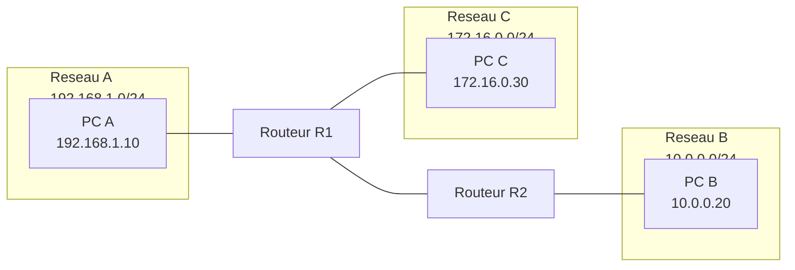
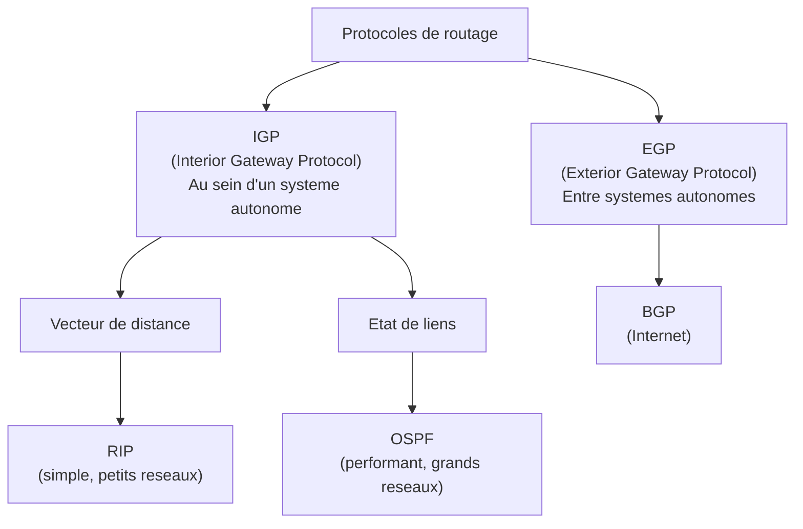
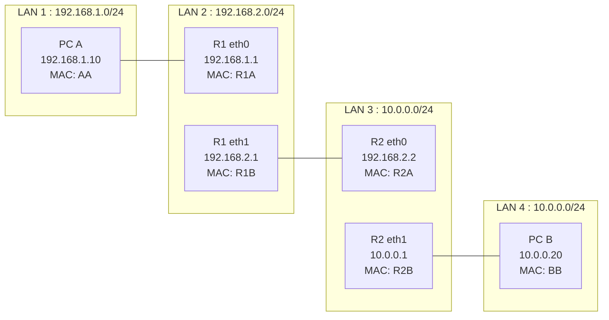

# 04 -- Routage

## Analogie : le GPS et les panneaux routiers

Quand tu conduis ta voiture pour aller de Rennes a Paris, tu ne connais pas a l'avance chaque virage du trajet. A chaque intersection, tu regardes les panneaux et tu choisis la direction qui te rapproche de ta destination.

Les panneaux, c'est la **table de routage**. L'intersection, c'est le **routeur**. Et la decision de tourner a gauche ou a droite, c'est la **decision de routage**.

Un routeur fonctionne exactement comme ca : il regarde l'adresse de destination du paquet, consulte sa table de routage, et decide par quelle interface envoyer le paquet.

---

## Intuition visuelle



> Chaque routeur connait ses reseaux directement connectes et sait a qui transmettre les paquets pour les reseaux distants. R1 sait atteindre le reseau B en passant par R2.

---

## Explication progressive

### Qu'est-ce que le routage ?

Le routage est le processus par lequel un routeur **determine le chemin** qu'un paquet doit emprunter pour atteindre sa destination. C'est le mecanisme fondamental qui permet a Internet de fonctionner.

**Principe de base :**
1. Un paquet arrive sur une interface du routeur.
2. Le routeur lit l'**adresse IP destination**.
3. Il consulte sa **table de routage**.
4. Il trouve la meilleure correspondance (longest prefix match).
5. Il transmet le paquet par l'interface indiquee vers le prochain saut (next hop).

### La table de routage

La table de routage est une liste de regles qui associent des **reseaux de destination** a des **prochains sauts** (next hop) ou des **interfaces de sortie**.

**Exemple de table de routage :**

```
Destination        Masque              Passerelle        Interface    Metrique
192.168.1.0        255.255.255.0       Directement       eth0         0
10.0.0.0           255.255.255.0       192.168.2.1       eth1         1
172.16.0.0         255.255.0.0         192.168.2.2       eth1         2
0.0.0.0            0.0.0.0             192.168.1.254     eth0         10
```

**Colonnes importantes :**

| Colonne | Description |
|---------|-------------|
| Destination | Le reseau de destination (adresse reseau + masque) |
| Passerelle (Gateway) | L'adresse IP du prochain routeur, ou "Directement connecte" |
| Interface | L'interface physique par laquelle envoyer le paquet |
| Metrique | Le "cout" de cette route (plus petit = meilleur) |

**Commandes pour voir la table de routage :**

```bash
# Linux
ip route show
route -n

# Windows
route print

# Exemple de sortie Linux :
# default via 192.168.1.254 dev eth0
# 192.168.1.0/24 dev eth0  proto kernel  scope link  src 192.168.1.10
# 10.0.0.0/24 via 192.168.2.1 dev eth1
```

---

### Le longest prefix match

Quand plusieurs routes correspondent a une destination, le routeur choisit celle avec le **masque le plus long** (le plus specifique).

**Exemple :**

Table de routage :
```
10.0.0.0/8      via 192.168.1.1
10.1.0.0/16     via 192.168.1.2
10.1.2.0/24     via 192.168.1.3
0.0.0.0/0       via 192.168.1.254   (route par defaut)
```

Ou va le paquet destine a 10.1.2.42 ?

```
10.0.0.0/8      --> correspond (8 bits)
10.1.0.0/16     --> correspond (16 bits)
10.1.2.0/24     --> correspond (24 bits)  <-- GAGNE (plus long prefixe)
0.0.0.0/0       --> correspond (0 bits)
```

Reponse : le paquet est envoye via **192.168.1.3** (24 bits de correspondance).

**Autre exemple** : ou va le paquet destine a 10.2.3.4 ?

```
10.0.0.0/8      --> correspond (8 bits)  <-- GAGNE
10.1.0.0/16     --> ne correspond PAS (10.2 != 10.1)
10.1.2.0/24     --> ne correspond PAS
0.0.0.0/0       --> correspond (0 bits)
```

Reponse : le paquet est envoye via **192.168.1.1** (8 bits de correspondance).

---

### La route par defaut (default route)

La route par defaut est celle utilisee quand aucune autre route ne correspond. Elle est notee **0.0.0.0/0** (masque de 0 bit = correspond a tout).

```
0.0.0.0/0  via 192.168.1.254  dev eth0
```

C'est la "passerelle par defaut" (default gateway) que tu configures dans les parametres reseau de ton PC. En general, c'est l'adresse du routeur de ton reseau local qui donne acces a Internet.

---

### Routage statique vs dynamique

#### Routage statique

Les routes sont configurees **manuellement** par l'administrateur.

```bash
# Ajouter une route statique sous Linux
ip route add 10.0.0.0/24 via 192.168.1.1

# Supprimer une route
ip route del 10.0.0.0/24
```

**Avantages :**
- Simple a comprendre et a configurer
- Pas de surcharge de bande passante (pas d'echange de protocole)
- Controle total de l'administrateur

**Inconvenients :**
- Ne s'adapte pas aux pannes (si un lien tombe, la route reste)
- Laborieux sur de grands reseaux (beaucoup de routes a configurer)
- Maintenance manuelle a chaque changement de topologie

**Usage** : petits reseaux, liens point a point, routes de secours.

#### Routage dynamique

Les routeurs echangent des informations entre eux pour **decouvrir automatiquement** les routes optimales et s'adapter aux changements de topologie.

**Avantages :**
- S'adapte automatiquement aux pannes et aux changements
- Scalable (fonctionne sur de grands reseaux)
- Trouve les chemins optimaux

**Inconvenients :**
- Plus complexe a configurer
- Consomme de la bande passante (messages de controle entre routeurs)
- Temps de convergence (delai avant que tous les routeurs aient la meme vue)

---

### Protocoles de routage dynamique



#### RIP (Routing Information Protocol)

- **Type** : vecteur de distance (distance vector)
- **Metrique** : nombre de sauts (hop count), maximum 15
- **Fonctionnement** : chaque routeur envoie sa table de routage complete a ses voisins, toutes les 30 secondes
- **Avantage** : tres simple
- **Inconvenient** : convergence lente, limite a 15 sauts, boucles de routage possibles

**Principe du vecteur de distance :**

Chaque routeur connait la distance (en sauts) vers chaque destination. Il envoie cette information a ses voisins. Chaque voisin met a jour sa propre table si la route recue est meilleure.

```
Routeur A connait :
  Reseau X : 0 sauts (directement connecte)
  Reseau Y : 1 saut (via B)

Routeur A dit a ses voisins :
  "Je peux atteindre X en 0 sauts et Y en 1 saut"

Routeur C recoit et calcule :
  "A me dit qu'il atteint X en 0 sauts. Moi je suis a 1 saut de A.
   Donc je peux atteindre X en 1 saut via A."
```

**Probleme de boucle de routage** : si un lien tombe, les routeurs peuvent temporairement se renvoyer le trafic en boucle. Solutions : split horizon, route poisoning, hold-down timers.

#### OSPF (Open Shortest Path First)

- **Type** : etat de liens (link state)
- **Metrique** : cout (base sur la bande passante)
- **Fonctionnement** : chaque routeur connait la topologie complete du reseau et calcule le plus court chemin avec l'algorithme de Dijkstra
- **Avantage** : convergence rapide, pas de limite de sauts, pas de boucles
- **Inconvenient** : plus complexe, necessite plus de memoire et de calcul

**Principe de l'etat de liens :**

1. Chaque routeur decouvre ses voisins directs.
2. Il mesure le cout de chaque lien.
3. Il envoie un **LSA** (Link State Advertisement) a tous les routeurs du reseau.
4. Chaque routeur reconstruit la **carte complete** du reseau.
5. Il applique l'algorithme de **Dijkstra** pour trouver le plus court chemin vers chaque destination.

**Calcul du cout OSPF :**
```
Cout = bande passante de reference / bande passante du lien

Par defaut, bande passante de reference = 100 Mbit/s

Exemples :
  Ethernet 10 Mbit/s  --> cout = 100/10  = 10
  Fast Ethernet 100 Mbit/s --> cout = 100/100 = 1
  Gigabit Ethernet     --> cout = 100/1000 = 0.1 (arrondi a 1)
```

#### BGP (Border Gateway Protocol)

- **Type** : vecteur de chemin (path vector)
- **Usage** : routage **entre** systemes autonomes (AS) -- c'est le protocole d'Internet
- **Metrique** : politique (pas simplement la distance)
- **Particularite** : les decisions de routage sont basees sur des **politiques** (accords commerciaux, preferences geographiques) autant que sur la distance

BGP est le protocole qui fait fonctionner Internet a grande echelle. Chaque operateur (Orange, Free, Google) est un systeme autonome identifie par un numero d'AS.

---

### Processus de routage complet

Voyons comment un paquet traverse plusieurs reseaux :

**Scenario** : PC A (192.168.1.10) envoie un paquet a PC B (10.0.0.20). Ils sont sur des reseaux differents, relies par deux routeurs.



**Etape 1 : PC A prepare le paquet**
```
PC A veut envoyer a 10.0.0.20
10.0.0.20 n'est pas sur le meme reseau que 192.168.1.10/24
--> Envoyer a la passerelle par defaut : 192.168.1.1
--> ARP pour trouver la MAC de 192.168.1.1 = R1A

Trame :
  MAC dest : R1A (routeur, pas PC B !)
  MAC src  : AA
  IP dest  : 10.0.0.20 (PC B -- ne change pas)
  IP src   : 192.168.1.10 (PC A -- ne change pas)
```

**Etape 2 : R1 recoit et route**
```
R1 recoit la trame sur eth0
Retire l'en-tete Ethernet
Lit IP dest : 10.0.0.20
Consulte table de routage :
  10.0.0.0/24 via 192.168.2.2 (eth1)
--> ARP pour MAC de 192.168.2.2 = R2A

Nouvelle trame :
  MAC dest : R2A (routeur R2)
  MAC src  : R1B
  IP dest  : 10.0.0.20 (INCHANGE)
  IP src   : 192.168.1.10 (INCHANGE)
  TTL      : decremente de 1
```

**Etape 3 : R2 recoit et route**
```
R2 recoit la trame sur eth0
Retire l'en-tete Ethernet
Lit IP dest : 10.0.0.20
Consulte table de routage :
  10.0.0.0/24 directement connecte (eth1)
--> ARP pour MAC de 10.0.0.20 = BB

Nouvelle trame :
  MAC dest : BB (PC B -- enfin!)
  MAC src  : R2B
  IP dest  : 10.0.0.20 (INCHANGE)
  IP src   : 192.168.1.10 (INCHANGE)
  TTL      : decremente de 1
```

**Etape 4 : PC B recoit**
```
PC B recoit la trame
MAC dest = sa MAC -> OK
Retire l'en-tete Ethernet
IP dest = son IP -> OK
Retire l'en-tete IP
Passe les donnees a la couche transport
```

**Points essentiels :**
- L'adresse **IP ne change jamais** pendant le trajet (sauf avec NAT)
- L'adresse **MAC change a chaque saut** (routeur)
- Le **TTL est decremente** a chaque routeur
- Chaque routeur fait un **ARP** pour le prochain saut

---

### ICMP : le protocole de diagnostic

ICMP (Internet Control Message Protocol) est utilise pour les messages d'erreur et de diagnostic dans le routage.

**Messages ICMP importants :**

| Type | Code | Message | Usage |
|------|------|---------|-------|
| 0 | 0 | Echo Reply | Reponse a un ping |
| 3 | 0 | Network Unreachable | Reseau destination inaccessible |
| 3 | 1 | Host Unreachable | Hote destination inaccessible |
| 3 | 3 | Port Unreachable | Port destination inaccessible (UDP) |
| 8 | 0 | Echo Request | Commande ping |
| 11 | 0 | Time Exceeded | TTL expire (utilise par traceroute) |

**ping** utilise ICMP Echo Request (type 8) et Echo Reply (type 0) :
```bash
ping 10.0.0.20
# Envoie des Echo Request
# Attend des Echo Reply
# Mesure le RTT (Round-Trip Time)
```

**traceroute** utilise le TTL et ICMP Time Exceeded (type 11) :
```bash
traceroute 10.0.0.20
# Envoie un paquet avec TTL=1 -> premier routeur repond Time Exceeded
# Envoie un paquet avec TTL=2 -> deuxieme routeur repond Time Exceeded
# Envoie un paquet avec TTL=3 -> ...
# Continue jusqu'a atteindre la destination
```

---

## Pieges classiques

### Piege 1 : oublier que la MAC change a chaque saut

C'est LE piege le plus frequent en DS. L'adresse IP source et destination restent les memes de bout en bout. L'adresse MAC source et destination changent a chaque routeur traverse.

### Piege 2 : confondre passerelle et destination

Si PC A veut envoyer a PC B sur un autre reseau, il n'envoie **pas** la trame a PC B. Il l'envoie a sa **passerelle** (son routeur). C'est le routeur qui se charge de faire suivre.

### Piege 3 : oublier la route par defaut

Si un paquet ne correspond a aucune route specifique dans la table de routage, il est envoye via la route par defaut (0.0.0.0/0). Si aucune route par defaut n'est configuree, le paquet est **detruit** et un ICMP "Destination Unreachable" est renvoye.

### Piege 4 : confondre RIP et OSPF

- **RIP** = vecteur de distance, metrique = nombre de sauts, max 15, convergence lente
- **OSPF** = etat de liens, metrique = cout, algorithme de Dijkstra, convergence rapide

### Piege 5 : ne pas decrementer le TTL

A chaque routeur traverse, le TTL est decremente de 1. Si TTL = 0, le paquet est detruit. C'est un detail souvent oublie dans les exercices de routage pas a pas.

### Piege 6 : appliquer le mauvais masque dans le longest prefix match

Le longest prefix match compare les bits de l'adresse destination avec chaque entree de la table de routage. L'entree avec le **plus long masque** qui correspond gagne, pas celle avec la plus petite metrique.

---

## Recapitulatif

1. **Le routage** est le processus qui determine le chemin d'un paquet a travers le reseau. Chaque routeur prend une decision independante basee sur sa table de routage.

2. **La table de routage** associe des reseaux de destination a des prochains sauts et des interfaces de sortie. La route par defaut (0.0.0.0/0) est utilisee quand aucune route specifique ne correspond.

3. **Le longest prefix match** est la regle de decision : la route avec le masque le plus long qui correspond a la destination est choisie.

4. **Routage statique** = routes configurees manuellement. **Routage dynamique** = routes apprises automatiquement via des protocoles (RIP, OSPF, BGP).

5. **RIP** (vecteur de distance) : simple, metrique = sauts, max 15 sauts, convergence lente.

6. **OSPF** (etat de liens) : performant, metrique = cout, algorithme de Dijkstra, convergence rapide.

7. **BGP** : protocole inter-AS qui fait fonctionner Internet, decisions basees sur des politiques.

8. **A chaque saut** : la MAC change, l'IP reste constante, le TTL est decremente.

9. **ICMP** est utilise pour les diagnostics (ping, traceroute) et les messages d'erreur (destination inaccessible, TTL expire).
